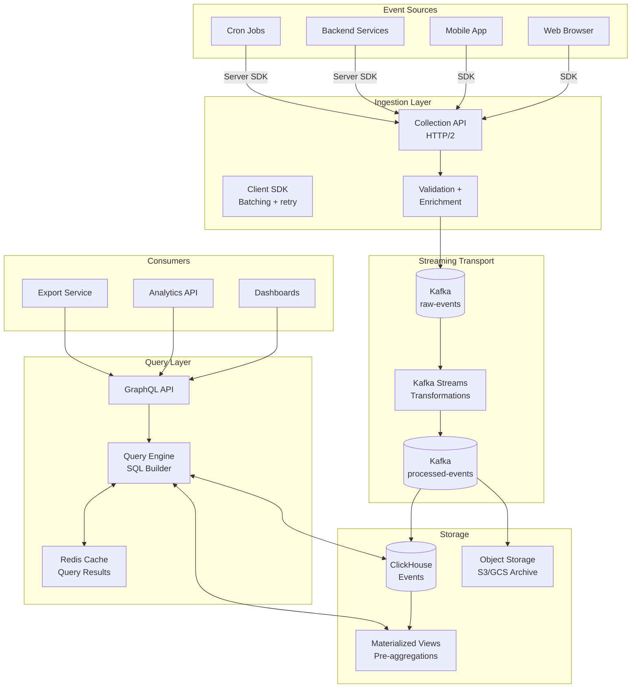

# Analytics Pipeline

## What This Pipeline Does

This section documents a complete, production-grade analytics pipeline capable of ingesting billions of events per day, storing them efficiently, and serving complex analytical queries in milliseconds.

The pipeline covers:
- **Event collection** — HTTP endpoints, SDK design, server-side event emission
- **Streaming transport** — Kafka for durability, backpressure, and replayability
- **Columnar storage** — ClickHouse for sub-second analytical queries
- **Query layer** — SQL functions, materialized views, and GraphQL API

## Why Not Just Use PostgreSQL?

PostgreSQL is excellent for transactional data. It fails for analytics at scale because:

| Characteristic | OLTP (PostgreSQL) | OLAP (ClickHouse) |
|---------------|-------------------|-------------------|
| Workload | Many small reads/writes | Few large reads |
| Storage | Row-oriented | Column-oriented |
| Query type | Point lookups, joins | Aggregations, scans |
| Index strategy | B-tree on individual rows | Column-level compression |
| 1B row query | 100s of seconds | < 1 second |
| Compression | 1x (row store) | 10–50x (column store) |

For a billion-event analytics table, ClickHouse stores it in ~10 GB. PostgreSQL would need ~500 GB for the same data with no indexes, or ~2TB with indexes.

## Architecture Diagram

## Section Contents

| Page | Topics |
|------|--------|
| [Architecture](./architecture) | Full platform design, component decisions, data flow |
| [Event Schema](./event-schema) | Event taxonomy, TypeScript types, schema registry |
| [Ingestion](./ingestion) | HTTP collection endpoint, client SDK, server-side events |
| [ClickHouse Storage](./storage-clickhouse) | Tables, ReplicatedMergeTree, materialized views, TTL |
| [Query Engine](./query-engine) | Funnel SQL, retention analysis, caching, GraphQL API |

## Scale Targets

This architecture is designed for:

| Metric | Target |
|--------|--------|
| Ingestion rate | 100K events/second peak |
| Event size | 1 KB average |
| Retention | 2 years raw, 5 years aggregated |
| Query latency | P50 < 100ms, P99 < 2s |
| Dashboard freshness | < 5 minutes |
| API uptime | 99.9% |

These targets reflect a mid-size SaaS company (1–10M monthly active users). Adjust based on your scale.

## Technology Choices

| Component | Choice | Alternatives | Why |
|-----------|--------|-------------|-----|
| Event transport | Apache Kafka | Kinesis, Pulsar | Highest throughput, battle-tested |
| OLAP store | ClickHouse | BigQuery, Snowflake, Druid | Self-hosted, fastest queries, best cost |
| Stream processing | Kafka Streams | Flink, Spark Streaming | Low ops overhead |
| Query layer | TypeScript + SQL | dbt, Metabase | Full control over API |
| Object storage | S3 | GCS, Azure Blob | Industry standard |

::: tip
If you're just starting and don't have billions of events yet, consider starting with PostgreSQL + TimescaleDB extension. Migrate to ClickHouse when queries start taking > 5 seconds. The event schema and ingestion pipeline remain the same either way.
:::
