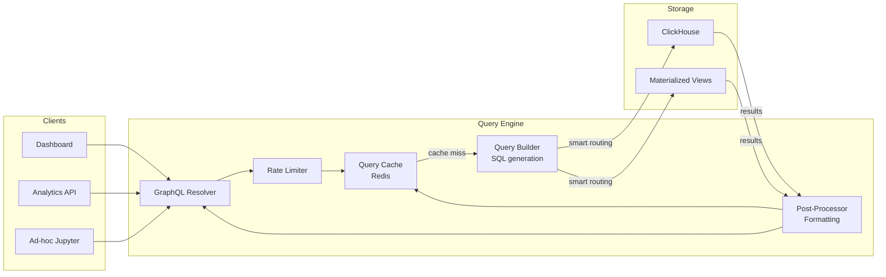
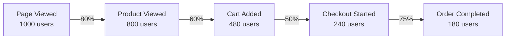

# Analytics Query Engine

## Query Architecture



## Query Types

Analytics platforms primarily serve four query types:

| Query Type | Description | Example |
|------------|-------------|---------|
| Funnel | Conversion through sequential steps | `Sign Up → Email Verify → First Purchase` |
| Retention | Users returning over time cohorts | Day 1, Day 7, Day 30 retention |
| Segmentation | User counts by attribute | Active users by country |
| Event Stream | Raw event chronology | User's session replay data |

## Funnel Analysis

### The Problem

A funnel measures what fraction of users complete each step in a sequence. The critical constraint: steps must happen **in order** within a **time window**.



### Funnel SQL

```sql
-- Funnel query: 5-step checkout funnel, 7-day conversion window
-- Returns: per-step user counts
WITH
  funnel_steps AS (
    -- Get first occurrence of each step per user
    SELECT
      user_id,
      minIf(timestamp, event = 'page_viewed') AS t1,
      minIf(timestamp, event = 'product_viewed'
        AND timestamp > minIf(timestamp, event = 'page_viewed')) AS t2,
      minIf(timestamp, event = 'cart_item_added'
        AND timestamp > minIf(timestamp, event = 'product_viewed')) AS t3,
      minIf(timestamp, event = 'checkout_started'
        AND timestamp > minIf(timestamp, event = 'cart_item_added')) AS t4,
      minIf(timestamp, event = 'order_completed'
        AND timestamp > minIf(timestamp, event = 'checkout_started')) AS t5
    FROM tracking.events
    WHERE
      event IN ('page_viewed', 'product_viewed', 'cart_item_added',
                'checkout_started', 'order_completed')
      AND timestamp >= {startDate: DateTime}
      AND timestamp <= {endDate: DateTime}
      AND user_id != ''
    GROUP BY user_id
  )

SELECT
  countIf(t1 IS NOT NULL AND t1 != toDateTime(0)) AS step_1_users,
  countIf(t2 IS NOT NULL AND t2 != toDateTime(0)
    AND dateDiff('day', t1, t2) <= 7) AS step_2_users,
  countIf(t3 IS NOT NULL AND t3 != toDateTime(0)
    AND dateDiff('day', t1, t3) <= 7) AS step_3_users,
  countIf(t4 IS NOT NULL AND t4 != toDateTime(0)
    AND dateDiff('day', t1, t4) <= 7) AS step_4_users,
  countIf(t5 IS NOT NULL AND t5 != toDateTime(0)
    AND dateDiff('day', t1, t5) <= 7) AS step_5_users
FROM funnel_steps;
```

### TypeScript Funnel Query Builder

```typescript
// src/query/funnel.ts
import { createClient, ClickHouseClient } from '@clickhouse/client';

interface FunnelStep {
  event: string;
  name: string;
  filters?: Record<string, unknown>;  // Additional conditions on the step
}

interface FunnelQueryOptions {
  steps: FunnelStep[];
  conversionWindowDays: number;
  startDate: Date;
  endDate: Date;
  breakdown?: string;  // Attribute to break down by (e.g., "geo_country")
  filters?: Array<{ attribute: string; operator: string; value: unknown }>;
}

interface FunnelResult {
  steps: Array<{
    event: string;
    name: string;
    users: number;
    conversionFromPrevious: number;   // 0–1
    conversionFromFirst: number;      // 0–1
    avgTimeToNextStepMs?: number;
  }>;
  breakdown?: Record<string, FunnelResult['steps']>;
}

export class FunnelQueryEngine {
  constructor(private clickhouse: ClickHouseClient) {}

  async query(options: FunnelQueryOptions): Promise<FunnelResult> {
    const { steps, conversionWindowDays, startDate, endDate } = options;

    if (steps.length < 2) throw new Error('Funnel requires at least 2 steps');
    if (steps.length > 8) throw new Error('Funnel supports at most 8 steps');

    const query = this.buildFunnelSQL(steps, conversionWindowDays);

    const result = await this.clickhouse.query({
      query,
      query_params: {
        events: steps.map((s) => s.event),
        startDate: startDate.toISOString(),
        endDate: endDate.toISOString(),
        conversionWindowDays,
      },
      format: 'JSONEachRow',
    });

    const rows = await result.json<Record<string, number>>();
    const row = rows[0] ?? {};

    const stepResults: FunnelResult['steps'] = steps.map((step, i) => {
      const users = row[`step_${i + 1}_users`] ?? 0;
      const prevUsers = i === 0 ? users : row[`step_${i}_users`] ?? 0;
      const firstUsers = row['step_1_users'] ?? 1;

      return {
        event: step.event,
        name: step.name,
        users,
        conversionFromPrevious: prevUsers > 0 ? users / prevUsers : 0,
        conversionFromFirst: firstUsers > 0 ? users / firstUsers : 0,
      };
    });

    return { steps: stepResults };
  }

  private buildFunnelSQL(steps: FunnelStep[], windowDays: number): string {
    // Build step timestamp selections
    const timestampSelects = steps.map((step, i) => {
      const prevCondition = i === 0
        ? ''
        : `AND timestamp > step_t${i}`;
      return `minIf(timestamp, event = '${step.event}' ${prevCondition}) AS step_t${i + 1}`;
    }).join(',\n      ');

    // Build count conditions
    const countConditions = steps.map((step, i) => {
      if (i === 0) {
        return `countIf(step_t1 IS NOT NULL) AS step_1_users`;
      }
      return `countIf(
        step_t${i + 1} IS NOT NULL
        AND dateDiff('day', step_t1, step_t${i + 1}) <= ${windowDays}
      ) AS step_${i + 1}_users`;
    }).join(',\n  ');

    const eventList = steps.map((s) => `'${s.event}'`).join(', ');

    return `
      WITH funnel_steps AS (
        SELECT
          user_id,
          ${timestampSelects}
        FROM tracking.events
        WHERE
          event IN (${eventList})
          AND timestamp >= {startDate: DateTime}
          AND timestamp <= {endDate: DateTime}
          AND user_id != ''
        GROUP BY user_id
      )
      SELECT
        ${countConditions}
      FROM funnel_steps
    `;
  }
}
```

## Retention Analysis

Retention measures how many users return to the product over time. Cohort retention tracks users who started in a specific period.

### Retention Query

```sql
-- N-day retention for February 2026 cohort
-- Returns: cohort_date, day_number, retained_users, cohort_size
WITH
  first_seen AS (
    SELECT
      user_id,
      toDate(min(timestamp)) AS cohort_date
    FROM tracking.events
    WHERE
      event = 'user_signed_up'
      AND timestamp >= '2026-02-01'
      AND timestamp < '2026-03-01'
      AND user_id != ''
    GROUP BY user_id
  ),
  active_days AS (
    SELECT DISTINCT
      e.user_id,
      fs.cohort_date,
      dateDiff('day', fs.cohort_date, toDate(e.timestamp)) AS day_number
    FROM tracking.events e
    JOIN first_seen fs ON e.user_id = fs.user_id
    WHERE
      e.timestamp >= '2026-02-01'
      AND e.timestamp < '2026-04-01'  -- 60 days of data
      AND day_number >= 0
      AND day_number <= 30
  )
SELECT
  cohort_date,
  day_number,
  count(DISTINCT user_id) AS retained_users,
  -- Cohort size (day 0 = everyone)
  countIf(day_number = 0) OVER (PARTITION BY cohort_date) AS cohort_size,
  retained_users / cohort_size AS retention_rate
FROM active_days
GROUP BY cohort_date, day_number
ORDER BY cohort_date, day_number;
```

### Retention Result Format

```typescript
// src/query/retention.ts

interface RetentionResult {
  cohorts: Array<{
    cohortDate: string;
    cohortSize: number;
    retention: Array<{
      dayNumber: number;
      users: number;
      rate: number;
    }>;
  }>;
  averageRetention: Array<{
    dayNumber: number;
    averageRate: number;
  }>;
}

export async function queryRetention(
  clickhouse: ClickHouseClient,
  params: {
    cohortStartDate: Date;
    cohortEndDate: Date;
    retentionDays: number;
    cohortEvent: string;
    returnEvent: string;
    cohortGranularity: 'day' | 'week';
  }
): Promise<RetentionResult> {
  const result = await clickhouse.query({
    query: RETENTION_QUERY,
    query_params: params,
    format: 'JSONEachRow',
  });

  const rows = await result.json<{
    cohort_date: string;
    day_number: number;
    retained_users: number;
    cohort_size: number;
    retention_rate: number;
  }>();

  // Group by cohort
  const cohortMap = new Map<string, RetentionResult['cohorts'][0]>();

  for (const row of rows) {
    if (!cohortMap.has(row.cohort_date)) {
      cohortMap.set(row.cohort_date, {
        cohortDate: row.cohort_date,
        cohortSize: row.cohort_size,
        retention: [],
      });
    }

    cohortMap.get(row.cohort_date)!.retention.push({
      dayNumber: row.day_number,
      users: row.retained_users,
      rate: row.retention_rate,
    });
  }

  const cohorts = Array.from(cohortMap.values());

  // Compute average retention across cohorts
  const dayGroups = new Map<number, number[]>();
  for (const cohort of cohorts) {
    for (const r of cohort.retention) {
      const arr = dayGroups.get(r.dayNumber) ?? [];
      arr.push(r.rate);
      dayGroups.set(r.dayNumber, arr);
    }
  }

  const averageRetention = Array.from(dayGroups.entries())
    .map(([dayNumber, rates]) => ({
      dayNumber,
      averageRate: rates.reduce((s, r) => s + r, 0) / rates.length,
    }))
    .sort((a, b) => a.dayNumber - b.dayNumber);

  return { cohorts, averageRetention };
}

const RETENTION_QUERY = `/* retention SQL from above */`;
```

## Query Cache Layer

Analytics queries are expensive. Most dashboards show the same data to many users. Cache aggressively.

### Redis-Based Query Cache

```typescript
// src/query/cache.ts
import Redis from 'ioredis';
import { createHash } from 'crypto';

interface CacheConfig {
  defaultTtlSeconds: number;
  maxEntries: number;
}

export class QueryCache {
  constructor(
    private redis: Redis,
    private config: CacheConfig = {
      defaultTtlSeconds: 300,  // 5 minutes
      maxEntries: 10_000,
    }
  ) {}

  private getCacheKey(query: string, params: Record<string, unknown>): string {
    const payload = JSON.stringify({ query, params });
    const hash = createHash('sha256').update(payload).digest('hex').slice(0, 32);
    return `query:${hash}`;
  }

  async get<T>(
    query: string,
    params: Record<string, unknown>
  ): Promise<T | null> {
    const key = this.getCacheKey(query, params);
    const cached = await this.redis.get(key);
    if (!cached) return null;
    return JSON.parse(cached) as T;
  }

  async set<T>(
    query: string,
    params: Record<string, unknown>,
    result: T,
    ttlSeconds?: number
  ): Promise<void> {
    const key = this.getCacheKey(query, params);
    const ttl = ttlSeconds ?? this.config.defaultTtlSeconds;
    await this.redis.setex(key, ttl, JSON.stringify(result));
  }

  async invalidateForSource(sourceId: string): Promise<void> {
    // Invalidate all cached queries for a specific data source
    // (called when new data is ingested)
    const pattern = `query:*:${sourceId}:*`;
    const keys = await this.redis.keys(pattern);
    if (keys.length > 0) {
      await this.redis.del(...keys);
    }
  }

  // Wrapper for cached query execution
  async cached<T>(
    query: string,
    params: Record<string, unknown>,
    executor: () => Promise<T>,
    ttlSeconds?: number
  ): Promise<{ result: T; fromCache: boolean }> {
    const cached = await this.get<T>(query, params);
    if (cached !== null) {
      return { result: cached, fromCache: true };
    }

    const result = await executor();
    await this.set(query, params, result, ttlSeconds);
    return { result, fromCache: false };
  }
}
```

### Cache TTL Strategy

| Query Type | TTL | Reason |
|------------|-----|--------|
| Funnel (last 30 days) | 5 minutes | Semi-real-time |
| Retention cohort | 1 hour | Historical, rarely changes |
| Daily aggregates | 15 minutes | Near-real-time dashboards |
| User event stream | 30 seconds | Near-real-time for user pages |
| Annual reports | 24 hours | Static historical data |

## GraphQL API

```typescript
// src/api/schema.graphql
type Query {
  funnel(input: FunnelInput!): FunnelResult!
  retention(input: RetentionInput!): RetentionResult!
  eventCounts(input: EventCountsInput!): [EventCountResult!]!
  userTimeline(userId: String!, limit: Int): [Event!]!
}

input FunnelInput {
  steps: [FunnelStepInput!]!
  conversionWindowDays: Int!
  startDate: String!
  endDate: String!
  breakdown: String
}

input FunnelStepInput {
  event: String!
  name: String!
}

type FunnelResult {
  steps: [FunnelStep!]!
  totalEnteredFunnel: Int!
  totalCompletedFunnel: Int!
  overallConversionRate: Float!
}

type FunnelStep {
  event: String!
  name: String!
  users: Int!
  conversionFromPrevious: Float!
  conversionFromFirst: Float!
}

input RetentionInput {
  cohortStartDate: String!
  cohortEndDate: String!
  retentionDays: Int!
  cohortEvent: String!
  returnEvent: String!
}

type RetentionResult {
  cohorts: [CohortRetention!]!
  averageRetention: [DayRetention!]!
}

type CohortRetention {
  cohortDate: String!
  cohortSize: Int!
  retention: [DayRetention!]!
}

type DayRetention {
  dayNumber: Int!
  users: Int
  rate: Float!
}
```

```typescript
// src/api/resolvers.ts
import { FunnelQueryEngine } from '../query/funnel';
import { QueryCache } from '../query/cache';

export const resolvers = {
  Query: {
    funnel: async (
      _: unknown,
      args: { input: FunnelInput },
      ctx: { funnelEngine: FunnelQueryEngine; cache: QueryCache }
    ) => {
      const { result, fromCache } = await ctx.cache.cached(
        'funnel',
        args.input,
        () => ctx.funnelEngine.query({
          steps: args.input.steps,
          conversionWindowDays: args.input.conversionWindowDays,
          startDate: new Date(args.input.startDate),
          endDate: new Date(args.input.endDate),
        }),
        300  // 5 minute TTL
      );

      if (!fromCache) {
        // Track API usage
        ctx.analytics?.track('system', 'api_query_executed', {
          queryType: 'funnel',
          stepCount: args.input.steps.length,
        });
      }

      return result;
    },

    userTimeline: async (
      _: unknown,
      args: { userId: string; limit: number },
      ctx: { clickhouse: ClickHouseClient }
    ) => {
      const result = await ctx.clickhouse.query({
        query: `
          SELECT event, timestamp, properties
          FROM tracking.events
          WHERE user_id = {userId: String}
          ORDER BY timestamp DESC
          LIMIT {limit: UInt32}
        `,
        query_params: {
          userId: args.userId,
          limit: Math.min(args.limit ?? 100, 1000),
        },
        format: 'JSONEachRow',
      });
      return result.json();
    },
  },
};
```

## Performance Benchmarks

Tested on: 2-node ClickHouse cluster (32 vCPU, 128 GB RAM each), 10 billion events, 2 years data.

| Query Type | Data Scanned | P50 Latency | P99 Latency |
|------------|-------------|-------------|-------------|
| Funnel (30 days, 5 steps) | 30 days | 80ms | 450ms |
| Funnel (30 days, from MV) | Pre-aggregated | 8ms | 45ms |
| Retention (90-day cohort) | 90 days | 320ms | 1.8s |
| Daily event counts | 1 day from MV | 5ms | 25ms |
| User timeline (100 events) | User index | 15ms | 120ms |
| Segment breakdown (30 days) | 30 days | 200ms | 900ms |

### Query Optimization Tips

```sql
-- SLOW: Using JSONExtractString in WHERE clause
SELECT count()
FROM tracking.events
WHERE JSONExtractString(properties, 'country') = 'US';

-- FAST: Use stored column
SELECT count()
FROM tracking.events
WHERE geo_country = 'US';

-- SLOW: DISTINCT + large date range
SELECT count(DISTINCT user_id)
FROM tracking.events
WHERE timestamp > now() - INTERVAL 30 DAY;

-- FAST: uniqHLL12 approximate count (2% error, 1000x faster)
SELECT uniqHLL12(user_id)
FROM tracking.events
WHERE timestamp > now() - INTERVAL 30 DAY;
```

::: info War Story
**The Dashboard That Cost $2,000/Month**

A team built beautiful dashboards that ran complex ClickHouse queries on every page load. Each query took 2–8 seconds. With 50 dashboard users refreshing every minute, they were running ~3,000 queries/hour against their ClickHouse cluster.

The ClickHouse cluster needed to be over-provisioned by 5x to handle this load. Estimated cost: $2,000/month in cloud infrastructure.

After adding a 5-minute Redis cache in front of all dashboard queries, the ClickHouse query rate dropped to ~30/hour (cache hits + 1 per 5 min per unique query). The cluster was scaled down 80%. Lesson: dashboards rarely need sub-second freshness, and most users see the same data anyway.
:::
