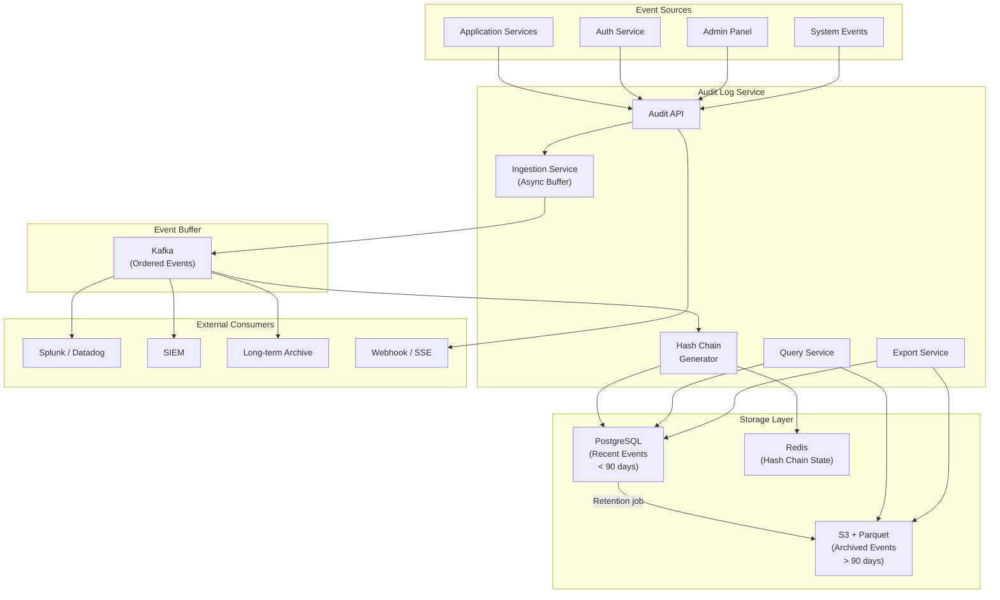
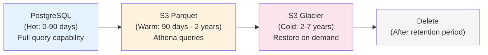

# Audit Log Service Blueprint

An audit log answers one question: **who did what, to what, and when?** It is the security camera of your application — a tamper-evident, immutable record of every significant action. Without it, investigating security incidents is guesswork, compliance audits are painful, and debugging customer issues ("I never changed that setting") is impossible.

This blueprint covers a production-grade audit log service that captures structured events, provides tamper detection through hash chaining, supports compliance requirements (SOC 2, GDPR, HIPAA), and scales to billions of events.

## Overview & Requirements

### Functional Requirements

| Requirement | Description |
|---|---|
| Event capture | Record every significant action with actor, target, action, and metadata |
| Immutability | Events cannot be modified or deleted (except by retention policy) |
| Tamper detection | Cryptographic hash chain to detect unauthorized modifications |
| Querying | Search by actor, action, target, time range, and metadata |
| Retention | Configurable retention periods per event category |
| Export | Export events in CSV, JSON, or SIEM-compatible formats |
| Real-time streaming | Stream events to external systems (Splunk, Datadog, S3) |
| Compliance | SOC 2 Type II, GDPR Article 30, HIPAA audit trail |

### Non-Functional Requirements

| Requirement | Target |
|---|---|
| Write latency | < 50ms (async accepted) |
| Query latency (indexed) | < 500ms |
| Event throughput | 10,000 events/second |
| Retention | 7 years (configurable) |
| Availability | 99.99% for writes |
| Durability | Zero event loss |
| Storage | Petabyte-scale archival |

### What Gets Audited

Not everything belongs in an audit log. Focus on security-relevant and compliance-relevant actions:

| Category | Examples |
|---|---|
| **Authentication** | Login, logout, failed login, MFA enabled/disabled, password changed |
| **Authorization** | Permission granted, role changed, API key created/revoked |
| **Data access** | Record viewed, exported, searched (for sensitive data) |
| **Data mutation** | Record created, updated, deleted |
| **Configuration** | Setting changed, feature flag toggled, webhook modified |
| **Administrative** | User invited, suspended, billing plan changed |
| **System** | Deployment, migration, maintenance mode enabled |

## Architecture Diagram



## Core Components Deep Dive

### Event Schema

Every audit event follows a standardized schema. Consistency is critical — if different services log events in different formats, the audit log becomes unsearchable.

```typescript
// audit-event.ts
interface AuditEvent {
  // Identity
  id: string;                    // UUIDv7 (time-ordered)
  timestamp: string;             // ISO 8601 with timezone

  // Who
  actor: {
    type: 'user' | 'service' | 'system' | 'api_key';
    id: string;                  // User ID, service name, or API key ID
    email?: string;              // For user actors
    ip?: string;                 // Client IP address
    userAgent?: string;          // Client user agent
  };

  // What
  action: string;                // Dot-notation: "user.create", "settings.update"
  category: string;              // "authentication", "data_access", "configuration"
  outcome: 'success' | 'failure' | 'error';

  // On what
  target: {
    type: string;                // "user", "project", "api_key", "setting"
    id: string;                  // Target entity ID
    name?: string;               // Human-readable name
  };

  // Context
  metadata: Record<string, any>; // Action-specific data
  changes?: {                    // For update actions
    before: Record<string, any>;
    after: Record<string, any>;
  };

  // Location
  source: {
    service: string;             // "auth-service", "billing-service"
    version: string;             // Service version
    environment: string;         // "production", "staging"
  };

  // Tamper detection
  previousHash?: string;         // Hash of the previous event
  hash?: string;                 // SHA-256 of this event
}
```

### Ingestion Service

The ingestion service receives events, validates them, and pushes them to Kafka for ordered processing. It must be fire-and-forget from the caller's perspective — an audit log write must never block or fail the primary operation.

```typescript
// ingestion-service.ts
class AuditIngestionService {
  private kafka: KafkaProducer;

  /**
   * Record an audit event. This method is async and non-blocking.
   * The caller should fire and forget — never await in the hot path.
   */
  async record(event: Omit<AuditEvent, 'id' | 'timestamp' | 'hash' | 'previousHash'>): Promise<void> {
    const auditEvent: AuditEvent = {
      id: uuidv7(),
      timestamp: new Date().toISOString(),
      ...event,
    };

    // Validate schema
    const validation = auditEventSchema.safeParse(auditEvent);
    if (!validation.success) {
      this.logger.error('Invalid audit event', {
        errors: validation.error.issues,
        event: auditEvent,
      });
      this.metrics.increment('audit.ingestion.validation_errors');
      return; // Never throw — audit failures must not break the app
    }

    // Publish to Kafka — partition by actor ID for ordering per actor
    await this.kafka.produce({
      topic: 'audit-events',
      key: auditEvent.actor.id,
      value: JSON.stringify(auditEvent),
      headers: {
        'event-type': auditEvent.action,
        'source-service': auditEvent.source.service,
      },
    });

    this.metrics.increment('audit.ingestion.events_recorded');
  }
}

// Usage in application code
class UserService {
  async updateUserRole(adminId: string, targetUserId: string, newRole: string): Promise<void> {
    const user = await this.db.getUser(targetUserId);
    const oldRole = user.role;

    // Perform the action
    await this.db.updateUser(targetUserId, { role: newRole });

    // Fire-and-forget audit event
    this.audit.record({
      actor: { type: 'user', id: adminId },
      action: 'user.role_changed',
      category: 'authorization',
      outcome: 'success',
      target: { type: 'user', id: targetUserId, name: user.email },
      changes: {
        before: { role: oldRole },
        after: { role: newRole },
      },
      metadata: { reason: 'Promoted to team lead' },
      source: { service: 'user-service', version: '2.3.1', environment: 'production' },
    });
  }
}
```

::: warning Never Block on Audit Writes
The audit log must never fail the operation it is recording. If the audit system is down, the operation should still succeed — the event will be retried or captured through a dead-letter queue. Use async, fire-and-forget patterns. See [Message Queues](/system-design/message-queues/) for reliability patterns.
:::

### Hash Chain for Tamper Detection

Each event includes a hash of its contents and a reference to the previous event's hash, forming a chain. If anyone modifies or deletes an event in the database, the chain breaks and the tampering is detectable.

```typescript
// hash-chain.ts
import { createHash } from 'crypto';

class HashChainGenerator {
  private previousHash: string = '0'.repeat(64); // Genesis hash

  constructor(private redis: Redis) {}

  async initialize(): Promise<void> {
    const stored = await this.redis.get('audit:chain:latest_hash');
    if (stored) this.previousHash = stored;
  }

  async processEvent(event: AuditEvent): Promise<AuditEvent> {
    // Reference the previous hash
    event.previousHash = this.previousHash;

    // Hash the event contents (excluding the hash field itself)
    const hashInput = JSON.stringify({
      id: event.id,
      timestamp: event.timestamp,
      actor: event.actor,
      action: event.action,
      target: event.target,
      metadata: event.metadata,
      changes: event.changes,
      previousHash: event.previousHash,
    });

    event.hash = createHash('sha256').update(hashInput).digest('hex');

    // Update chain state
    this.previousHash = event.hash;
    await this.redis.set('audit:chain:latest_hash', event.hash);

    return event;
  }

  /**
   * Verify the integrity of a sequence of events.
   * Returns the first event where the chain breaks, or null if valid.
   */
  async verify(events: AuditEvent[]): Promise<VerificationResult> {
    let expectedPreviousHash = events[0]?.previousHash;

    for (let i = 0; i < events.length; i++) {
      const event = events[i];

      // Check previous hash reference
      if (i > 0 && event.previousHash !== events[i - 1].hash) {
        return {
          valid: false,
          brokenAt: event.id,
          reason: 'Previous hash mismatch — event may have been deleted or reordered',
        };
      }

      // Recompute hash and compare
      const recomputed = this.computeHash(event);
      if (recomputed !== event.hash) {
        return {
          valid: false,
          brokenAt: event.id,
          reason: 'Hash mismatch — event content may have been modified',
        };
      }
    }

    return { valid: true };
  }
}
```

::: tip Hash Chain Limitations
A hash chain detects tampering but does not prevent it. For higher assurance, periodically publish chain checkpoints to an external, immutable store (like a blockchain or a third-party timestamping service). For SOC 2, having a tamper-detection mechanism is sufficient — you do not need cryptographic proof of non-tampering.
:::

## Data Model / Schema

```sql
-- Audit events (partitioned by month)
CREATE TABLE audit_events (
    id              UUID NOT NULL,
    timestamp       TIMESTAMPTZ NOT NULL,

    -- Actor
    actor_type      TEXT NOT NULL,
    actor_id        TEXT NOT NULL,
    actor_email     TEXT,
    actor_ip        INET,
    actor_user_agent TEXT,

    -- Action
    action          TEXT NOT NULL,
    category        TEXT NOT NULL,
    outcome         TEXT NOT NULL CHECK (outcome IN ('success', 'failure', 'error')),

    -- Target
    target_type     TEXT NOT NULL,
    target_id       TEXT NOT NULL,
    target_name     TEXT,

    -- Details
    metadata        JSONB DEFAULT '{}',
    changes         JSONB,

    -- Source
    source_service  TEXT NOT NULL,
    source_version  TEXT,
    source_env      TEXT NOT NULL,

    -- Tamper detection
    previous_hash   TEXT,
    hash            TEXT NOT NULL,

    PRIMARY KEY (id, timestamp)
) PARTITION BY RANGE (timestamp);

-- Create monthly partitions
CREATE TABLE audit_events_2026_01 PARTITION OF audit_events
    FOR VALUES FROM ('2026-01-01') TO ('2026-02-01');
CREATE TABLE audit_events_2026_02 PARTITION OF audit_events
    FOR VALUES FROM ('2026-02-01') TO ('2026-03-01');
CREATE TABLE audit_events_2026_03 PARTITION OF audit_events
    FOR VALUES FROM ('2026-03-01') TO ('2026-04-01');

-- Indexes for common query patterns
CREATE INDEX idx_audit_actor ON audit_events(actor_id, timestamp DESC);
CREATE INDEX idx_audit_target ON audit_events(target_type, target_id, timestamp DESC);
CREATE INDEX idx_audit_action ON audit_events(action, timestamp DESC);
CREATE INDEX idx_audit_category ON audit_events(category, timestamp DESC);

-- Prevent any updates or deletes via a trigger
CREATE OR REPLACE FUNCTION prevent_audit_modification()
RETURNS TRIGGER AS $$
BEGIN
    RAISE EXCEPTION 'Audit log events cannot be modified or deleted';
END;
$$ LANGUAGE plpgsql;

CREATE TRIGGER audit_immutability_update
    BEFORE UPDATE ON audit_events
    FOR EACH ROW EXECUTE FUNCTION prevent_audit_modification();

CREATE TRIGGER audit_immutability_delete
    BEFORE DELETE ON audit_events
    FOR EACH ROW EXECUTE FUNCTION prevent_audit_modification();
```

::: danger Immutability at the Database Level
The triggers above prevent application-level modifications, but a DBA with superuser access can still bypass them. For true immutability: (1) restrict superuser access to break-glass procedures, (2) use the hash chain for tamper detection, (3) replicate events to an external write-only store (S3 with Object Lock, or a dedicated audit SaaS). Defense in depth.
:::

## API Design

### Record an Event

```
POST /api/v1/audit/events
Authorization: Bearer <service-token>

{
  "actor": { "type": "user", "id": "user_123", "ip": "203.0.113.42" },
  "action": "project.settings_updated",
  "category": "configuration",
  "outcome": "success",
  "target": { "type": "project", "id": "proj_456", "name": "Acme Dashboard" },
  "changes": {
    "before": { "visibility": "private" },
    "after": { "visibility": "public" }
  },
  "metadata": { "reason": "Making project public for demo" }
}

Response (202 Accepted):
{
  "eventId": "01914a77-8a1a-7000-b000-000000000001",
  "status": "accepted"
}
```

### Query Events

```
GET /api/v1/audit/events?actor_id=user_123&action=project.*&from=2026-03-01&to=2026-03-20&limit=50
Authorization: Bearer <admin-token>

Response:
{
  "events": [
    {
      "id": "01914a77-8a1a-7000-b000-000000000001",
      "timestamp": "2026-03-20T14:30:00Z",
      "actor": { "type": "user", "id": "user_123", "email": "admin@example.com" },
      "action": "project.settings_updated",
      "category": "configuration",
      "outcome": "success",
      "target": { "type": "project", "id": "proj_456", "name": "Acme Dashboard" },
      "changes": {
        "before": { "visibility": "private" },
        "after": { "visibility": "public" }
      }
    }
  ],
  "total": 1,
  "hasMore": false,
  "cursor": "eyJsYXN0SWQiOiAiMDE5MTRhNzcifQ=="
}
```

### Export Events

```
POST /api/v1/audit/export
Authorization: Bearer <admin-token>

{
  "format": "csv",
  "from": "2026-01-01",
  "to": "2026-03-31",
  "filters": { "category": "authentication" },
  "deliveryMethod": "email",
  "email": "compliance@example.com"
}

Response (202 Accepted):
{
  "exportId": "export_789",
  "status": "processing",
  "estimatedRows": 150000
}
```

### Verify Chain Integrity

```
POST /api/v1/audit/verify
Authorization: Bearer <admin-token>

{
  "from": "2026-03-01",
  "to": "2026-03-20"
}

Response:
{
  "valid": true,
  "eventsChecked": 45230,
  "timeRange": { "from": "2026-03-01", "to": "2026-03-20" },
  "verifiedAt": "2026-03-20T15:00:00Z"
}
```

## Compliance Integration

### SOC 2 Type II

SOC 2 requires evidence of:

| Control | How the Audit Log Addresses It |
|---|---|
| Access logging | Every login, logout, and permission change is recorded |
| Change management | Configuration changes include before/after diffs |
| Data access monitoring | Sensitive data access is logged with actor context |
| Incident investigation | Events are searchable by time range, actor, and target |
| Retention | Events retained for 7 years with immutability guarantees |

### GDPR Article 30

GDPR requires a record of processing activities:

| Requirement | Implementation |
|---|---|
| What data was processed | `target.type` + `metadata` fields |
| Why it was processed | `action` + `metadata.reason` fields |
| Who processed it | `actor` fields (user ID, service name) |
| When it was processed | `timestamp` field |
| Right to access | Export API with per-user filtering |
| Right to erasure | Audit events themselves are exempt under legitimate interest, but log the erasure action |

::: tip GDPR and Audit Logs
GDPR Article 17 (right to erasure) does not require you to delete audit log entries about a user. Audit logs serve a legitimate interest (security, fraud detection, compliance). However, you must document this in your privacy policy and Data Protection Impact Assessment. When you delete a user's data, log the deletion itself as an audit event.
:::

## Scaling Considerations

### Storage Growth

| Events/Day | Storage/Day | Storage/Year | Archive Strategy |
|---|---|---|---|
| 100K | ~200 MB | ~73 GB | PostgreSQL only |
| 1M | ~2 GB | ~730 GB | PostgreSQL + S3 archive after 90 days |
| 10M | ~20 GB | ~7.3 TB | PostgreSQL hot (30 days) + S3 Parquet |
| 100M | ~200 GB | ~73 TB | ClickHouse + S3 with Athena |

For high-volume audit logs, use [ClickHouse](/system-design/databases/clickhouse-internals) for the query layer and S3 with Parquet files for long-term storage. Query archived events with AWS Athena or Presto.

### Retention and Archival



## Deployment

### Infrastructure

| Component | Service | Count | Notes |
|---|---|---|---|
| Audit API | ECS Fargate | 3 | Stateless, behind ALB |
| Kafka | MSK | 3-node cluster | Retention: 7 days, 10 partitions |
| Chain Processor | ECS Fargate | 1 | Single consumer for ordering |
| PostgreSQL | RDS (r6g.xlarge) | 1 + replica | Monthly partitions |
| Redis | ElastiCache | 1 | Chain state only |
| S3 | Standard + Glacier | — | Object Lock enabled |

### Monitoring

| Metric | Warning | Critical |
|---|---|---|
| Event ingestion lag | > 30s | > 120s |
| Chain verification failures | > 0 | — |
| Write failures | > 0.01% | > 0.1% |
| Query latency p99 | > 2s | > 5s |
| Partition size (90-day) | > 500 GB | > 1 TB |

Monitor with [Prometheus](/devops/monitoring/prometheus-deep-dive). Set up daily automated chain verification and alert on any integrity failures.

## Related Pages

- [Auth Service Blueprint](/production-blueprints/auth-service/) — Authentication events to audit
- [Structured Logging](/devops/logging/structured-logging) — Operational logging vs audit logging
- [OWASP A09: Logging Failures](/security/owasp/a09-logging-monitoring-failures) — Security logging requirements
- [Event-Driven Architecture](/architecture-patterns/event-driven/) — Event schema design patterns
- [Kafka Internals](/system-design/message-queues/kafka-internals) — Message ordering guarantees
- [Encryption at Rest](/security/encryption/encryption-at-rest) — Encrypting audit data

---

> *"An audit log you cannot search is a compliance checkbox. An audit log you can query, verify, and stream is a security tool. Build the tool."*
