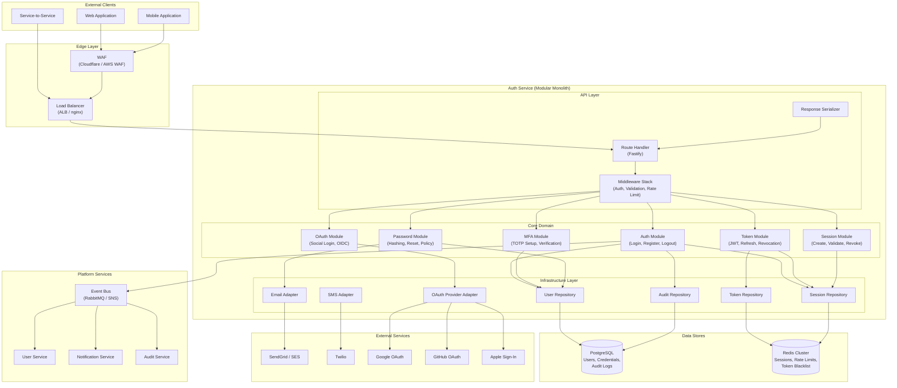
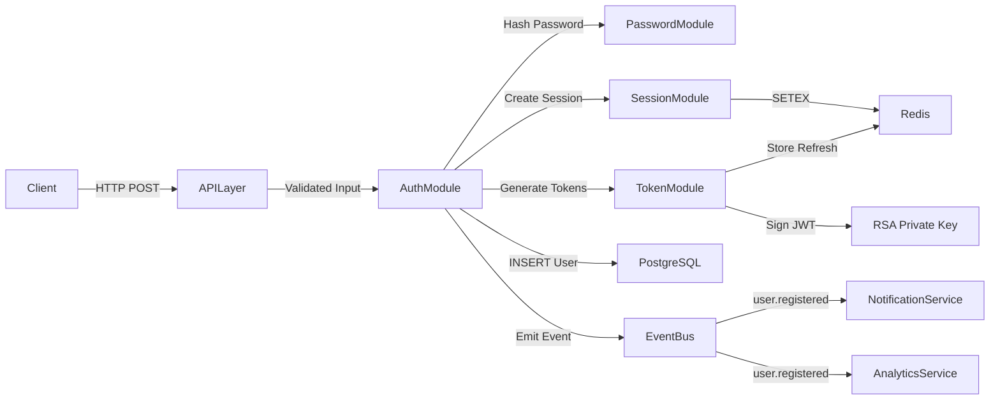
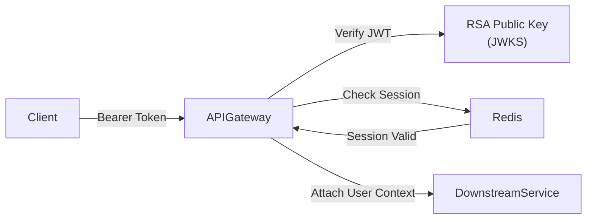

# Auth Service Architecture

A production auth service is not a single module. It is a coordinated system of components, each with distinct responsibilities, failure modes, and scaling characteristics. This page describes the full internal architecture: how each component works, how they communicate, and why the boundaries exist where they do.

## High-Level Architecture

The auth service follows a layered architecture within a single deployable unit (a modular monolith), while communicating with external services via well-defined API contracts.



## Component Breakdown

### API Layer

The API layer is the entry point for all requests. It is responsible for HTTP handling, input validation, rate limiting, and response serialization. It contains zero business logic.

#### Route Handler (Fastify)

Fastify is chosen over Express for three reasons: performance (2x throughput in benchmarks), schema-based validation (via JSON Schema, which eliminates an entire class of input bugs), and a plugin architecture that enforces encapsulation.

```typescript
// src/api/routes/auth.routes.ts

import { FastifyInstance, FastifyRequest, FastifyReply } from 'fastify';
import { AuthController } from '../controllers/auth.controller';
import {
  RegisterSchema,
  LoginSchema,
  RefreshSchema,
  LogoutSchema,
  ForgotPasswordSchema,
  ResetPasswordSchema,
} from '../schemas/auth.schemas';

export async function authRoutes(fastify: FastifyInstance): Promise<void> {
  const controller = fastify.diContainer.resolve<AuthController>('authController');

  fastify.post('/auth/register', {
    schema: RegisterSchema,
    preHandler: [fastify.rateLimit({ max: 5, timeWindow: '15 min' })],
    handler: (req, reply) => controller.register(req, reply),
  });

  fastify.post('/auth/login', {
    schema: LoginSchema,
    preHandler: [
      fastify.rateLimit({ max: 10, timeWindow: '15 min' }),
      fastify.bruteForceProtection,
    ],
    handler: (req, reply) => controller.login(req, reply),
  });

  fastify.post('/auth/refresh', {
    schema: RefreshSchema,
    handler: (req, reply) => controller.refresh(req, reply),
  });

  fastify.post('/auth/logout', {
    schema: LogoutSchema,
    preHandler: [fastify.authenticate],
    handler: (req, reply) => controller.logout(req, reply),
  });

  fastify.post('/auth/forgot-password', {
    schema: ForgotPasswordSchema,
    preHandler: [fastify.rateLimit({ max: 3, timeWindow: '15 min' })],
    handler: (req, reply) => controller.forgotPassword(req, reply),
  });

  fastify.post('/auth/reset-password', {
    schema: ResetPasswordSchema,
    handler: (req, reply) => controller.resetPassword(req, reply),
  });

  fastify.get('/auth/me', {
    preHandler: [fastify.authenticate],
    handler: (req, reply) => controller.me(req, reply),
  });

  fastify.post('/auth/mfa/setup', {
    preHandler: [fastify.authenticate],
    handler: (req, reply) => controller.mfaSetup(req, reply),
  });

  fastify.post('/auth/mfa/verify', {
    preHandler: [fastify.authenticate],
    handler: (req, reply) => controller.mfaVerify(req, reply),
  });
}
```

#### Middleware Stack

The middleware stack executes in a specific order, and each middleware has a single responsibility:

```typescript
// src/api/middleware/pipeline.ts

// Execution order for every request:
// 1. Request ID injection (correlation ID for tracing)
// 2. Request logging (method, path, timestamp)
// 3. CORS handling (origin validation)
// 4. Body parsing (JSON, with size limits)
// 5. Input sanitization (XSS prevention)
// 6. Rate limiting (global, then route-specific)
// 7. Authentication (for protected routes)
// 8. Authorization (role/permission checks)
// 9. Input validation (JSON Schema against route schema)
// 10. Route handler (business logic)
// 11. Response serialization (strip internal fields)
// 12. Response logging (status code, duration)

import { FastifyInstance } from 'fastify';
import { randomUUID } from 'crypto';

export async function setupMiddleware(fastify: FastifyInstance): Promise<void> {
  // 1. Request ID
  fastify.addHook('onRequest', async (request) => {
    request.id = request.headers['x-request-id'] as string || randomUUID();
  });

  // 2. Request logging
  fastify.addHook('onRequest', async (request) => {
    request.log.info({
      method: request.method,
      url: request.url,
      requestId: request.id,
      ip: request.ip,
      userAgent: request.headers['user-agent'],
    }, 'incoming request');
  });

  // 5. Input sanitization
  fastify.addHook('preHandler', async (request) => {
    if (request.body && typeof request.body === 'object') {
      sanitizeObject(request.body as Record<string, unknown>);
    }
  });

  // 12. Response logging
  fastify.addHook('onResponse', async (request, reply) => {
    request.log.info({
      method: request.method,
      url: request.url,
      statusCode: reply.statusCode,
      requestId: request.id,
      duration: reply.elapsedTime,
    }, 'request completed');
  });
}

function sanitizeObject(obj: Record<string, unknown>): void {
  for (const key of Object.keys(obj)) {
    const value = obj[key];
    if (typeof value === 'string') {
      obj[key] = value
        .replace(/</g, '&lt;')
        .replace(/>/g, '&gt;')
        .replace(/"/g, '&quot;')
        .replace(/'/g, '&#x27;');
    } else if (typeof value === 'object' && value !== null) {
      sanitizeObject(value as Record<string, unknown>);
    }
  }
}
```

#### Authentication Middleware

The authentication middleware validates JWT access tokens and attaches user context to the request. It checks the JWKS endpoint for key rotation and caches public keys.

```typescript
// src/api/middleware/authenticate.ts

import { FastifyRequest, FastifyReply } from 'fastify';
import { createRemoteJWKSet, jwtVerify, JWTPayload } from 'jose';

interface AuthenticatedUser {
  userId: string;
  email: string;
  emailVerified: boolean;
  roles: string[];
  permissions: string[];
  sessionId: string;
  orgId?: string;
}

declare module 'fastify' {
  interface FastifyRequest {
    user: AuthenticatedUser;
  }
}

const JWKS_URL = new URL(process.env.JWKS_URL || 'http://localhost:3000/.well-known/jwks.json');
const JWKS = createRemoteJWKSet(JWKS_URL);

export async function authenticate(
  request: FastifyRequest,
  reply: FastifyReply,
): Promise<void> {
  const authHeader = request.headers.authorization;

  if (!authHeader || !authHeader.startsWith('Bearer ')) {
    reply.code(401).send({
      error: 'UNAUTHORIZED',
      message: 'Missing or invalid authorization header',
      statusCode: 401,
    });
    return;
  }

  const token = authHeader.substring(7);

  try {
    const { payload } = await jwtVerify(token, JWKS, {
      issuer: process.env.JWT_ISSUER || 'auth.yourplatform.com',
      audience: process.env.JWT_AUDIENCE || 'api.yourplatform.com',
    });

    const jwtPayload = payload as JWTPayload & {
      email: string;
      email_verified: boolean;
      roles: string[];
      permissions: string[];
      session_id: string;
      org_id?: string;
    };

    // Check if session is still valid in Redis
    const sessionValid = await request.server.redis.exists(
      `session:${jwtPayload.session_id}`,
    );

    if (!sessionValid) {
      reply.code(401).send({
        error: 'SESSION_EXPIRED',
        message: 'Session has been revoked or expired',
        statusCode: 401,
      });
      return;
    }

    request.user = {
      userId: jwtPayload.sub!,
      email: jwtPayload.email,
      emailVerified: jwtPayload.email_verified,
      roles: jwtPayload.roles,
      permissions: jwtPayload.permissions,
      sessionId: jwtPayload.session_id,
      orgId: jwtPayload.org_id,
    };
  } catch (error) {
    request.log.warn({ error }, 'JWT verification failed');
    reply.code(401).send({
      error: 'INVALID_TOKEN',
      message: 'Token is invalid or expired',
      statusCode: 401,
    });
  }
}
```

### Core Domain Layer

The core domain contains all business logic. Each module is self-contained and communicates with other modules through well-defined interfaces, not direct database access.

#### Auth Module

The auth module orchestrates registration, login, and logout flows. It coordinates between the password module, token module, session module, and MFA module.

```typescript
// src/core/auth/auth.service.ts

import { EventEmitter } from 'events';
import { PasswordService } from '../password/password.service';
import { TokenService } from '../token/token.service';
import { SessionService } from '../session/session.service';
import { MFAService } from '../mfa/mfa.service';
import { UserRepository } from '../../infrastructure/repositories/user.repository';
import { AuditRepository } from '../../infrastructure/repositories/audit.repository';
import {
  RegisterInput,
  LoginInput,
  AuthResult,
  MFAChallengeResult,
} from './auth.types';
import {
  EmailAlreadyExistsError,
  InvalidCredentialsError,
  AccountLockedError,
  EmailNotVerifiedError,
} from './auth.errors';

export class AuthService {
  constructor(
    private readonly userRepo: UserRepository,
    private readonly passwordService: PasswordService,
    private readonly tokenService: TokenService,
    private readonly sessionService: SessionService,
    private readonly mfaService: MFAService,
    private readonly auditRepo: AuditRepository,
    private readonly eventEmitter: EventEmitter,
  ) {}

  async register(input: RegisterInput): Promise<AuthResult> {
    // Check for existing user
    const existingUser = await this.userRepo.findByEmail(input.email);
    if (existingUser) {
      throw new EmailAlreadyExistsError(input.email);
    }

    // Validate password strength
    await this.passwordService.validateStrength(input.password);

    // Check password against breach database
    const isBreached = await this.passwordService.checkBreachDatabase(input.password);
    if (isBreached) {
      throw new Error('This password has appeared in a data breach. Please choose a different password.');
    }

    // Hash password
    const passwordHash = await this.passwordService.hash(input.password);

    // Create user
    const user = await this.userRepo.create({
      email: input.email.toLowerCase().trim(),
      passwordHash,
      displayName: input.displayName,
      emailVerified: false,
    });

    // Generate verification token
    const verificationToken = await this.tokenService.generateEmailVerificationToken(user.id);

    // Create session
    const session = await this.sessionService.create({
      userId: user.id,
      ipAddress: input.metadata.ipAddress,
      userAgent: input.metadata.userAgent,
      deviceFingerprint: input.metadata.deviceFingerprint,
    });

    // Generate tokens
    const tokens = await this.tokenService.generateTokenPair(user, session.id);

    // Emit events
    this.eventEmitter.emit('user.registered', {
      userId: user.id,
      email: user.email,
      verificationToken,
      timestamp: new Date(),
    });

    // Audit log
    await this.auditRepo.log({
      userId: user.id,
      action: 'USER_REGISTERED',
      ipAddress: input.metadata.ipAddress,
      userAgent: input.metadata.userAgent,
      metadata: { email: user.email },
    });

    return {
      user: {
        id: user.id,
        email: user.email,
        displayName: user.displayName,
        emailVerified: user.emailVerified,
        mfaEnabled: false,
      },
      accessToken: tokens.accessToken,
      refreshToken: tokens.refreshToken,
      expiresIn: tokens.expiresIn,
    };
  }

  async login(input: LoginInput): Promise<AuthResult | MFAChallengeResult> {
    // Find user
    const user = await this.userRepo.findByEmail(input.email.toLowerCase().trim());
    if (!user) {
      // Constant-time comparison to prevent timing attacks
      await this.passwordService.hash('dummy-password-for-timing');
      throw new InvalidCredentialsError();
    }

    // Check account lock
    if (user.lockedUntil && user.lockedUntil > new Date()) {
      await this.auditRepo.log({
        userId: user.id,
        action: 'LOGIN_ATTEMPT_LOCKED',
        ipAddress: input.metadata.ipAddress,
        userAgent: input.metadata.userAgent,
      });
      throw new AccountLockedError(user.lockedUntil);
    }

    // Verify password
    const passwordValid = await this.passwordService.verify(
      input.password,
      user.passwordHash,
    );

    if (!passwordValid) {
      // Increment failed attempts
      const failedAttempts = await this.userRepo.incrementFailedAttempts(user.id);

      // Lock account after 10 failures
      if (failedAttempts >= 10) {
        const lockUntil = new Date(Date.now() + 30 * 60 * 1000); // 30 minutes
        await this.userRepo.lockAccount(user.id, lockUntil);

        this.eventEmitter.emit('account.locked', {
          userId: user.id,
          email: user.email,
          failedAttempts,
          lockUntil,
        });
      }

      await this.auditRepo.log({
        userId: user.id,
        action: 'LOGIN_FAILED',
        ipAddress: input.metadata.ipAddress,
        userAgent: input.metadata.userAgent,
        metadata: { failedAttempts },
      });

      throw new InvalidCredentialsError();
    }

    // Reset failed attempts on successful password verification
    await this.userRepo.resetFailedAttempts(user.id);

    // Check if MFA is enabled
    if (user.mfaEnabled) {
      const mfaToken = await this.mfaService.createChallenge(user.id);
      return {
        mfaRequired: true,
        mfaToken,
        userId: user.id,
      };
    }

    // Create session
    const session = await this.sessionService.create({
      userId: user.id,
      ipAddress: input.metadata.ipAddress,
      userAgent: input.metadata.userAgent,
      deviceFingerprint: input.metadata.deviceFingerprint,
    });

    // Generate tokens
    const tokens = await this.tokenService.generateTokenPair(user, session.id);

    // Update last login
    await this.userRepo.updateLastLogin(user.id, input.metadata.ipAddress);

    // Audit log
    await this.auditRepo.log({
      userId: user.id,
      action: 'LOGIN_SUCCESS',
      ipAddress: input.metadata.ipAddress,
      userAgent: input.metadata.userAgent,
      metadata: { sessionId: session.id },
    });

    this.eventEmitter.emit('user.logged_in', {
      userId: user.id,
      sessionId: session.id,
      timestamp: new Date(),
    });

    return {
      user: {
        id: user.id,
        email: user.email,
        displayName: user.displayName,
        emailVerified: user.emailVerified,
        mfaEnabled: user.mfaEnabled,
      },
      accessToken: tokens.accessToken,
      refreshToken: tokens.refreshToken,
      expiresIn: tokens.expiresIn,
    };
  }

  async logout(userId: string, sessionId: string, allSessions: boolean = false): Promise<void> {
    if (allSessions) {
      await this.sessionService.revokeAllForUser(userId);
      await this.tokenService.revokeAllRefreshTokens(userId);
    } else {
      await this.sessionService.revoke(sessionId);
      await this.tokenService.revokeRefreshTokenBySession(sessionId);
    }

    await this.auditRepo.log({
      userId,
      action: allSessions ? 'LOGOUT_ALL_SESSIONS' : 'LOGOUT',
      metadata: { sessionId, allSessions },
    });

    this.eventEmitter.emit('user.logged_out', {
      userId,
      sessionId,
      allSessions,
      timestamp: new Date(),
    });
  }
}
```

#### Token Module

The token module handles JWT creation, validation, refresh token rotation, and token revocation. It uses asymmetric signing (RS256) and implements refresh token rotation with reuse detection.

```typescript
// src/core/token/token.service.ts

import { SignJWT, importPKCS8, importSPKI, KeyLike } from 'jose';
import { randomUUID } from 'crypto';
import { Redis } from 'ioredis';
import { User } from '../user/user.types';
import {
  TokenPair,
  RefreshTokenData,
  InvalidRefreshTokenError,
  RefreshTokenReuseError,
} from './token.types';

export class TokenService {
  private privateKey: KeyLike | null = null;
  private currentKid: string;

  constructor(
    private readonly redis: Redis,
    private readonly config: {
      issuer: string;
      audience: string;
      accessTokenTTL: number;   // seconds
      refreshTokenTTL: number;  // seconds
      privateKeyPEM: string;
      keyId: string;
    },
  ) {
    this.currentKid = config.keyId;
  }

  async initialize(): Promise<void> {
    this.privateKey = await importPKCS8(this.config.privateKeyPEM, 'RS256');
  }

  async generateTokenPair(user: User, sessionId: string): Promise<TokenPair> {
    const accessToken = await this.generateAccessToken(user, sessionId);
    const refreshToken = await this.generateRefreshToken(user.id, sessionId);

    return {
      accessToken,
      refreshToken: refreshToken.token,
      expiresIn: this.config.accessTokenTTL,
    };
  }

  private async generateAccessToken(user: User, sessionId: string): Promise<string> {
    if (!this.privateKey) {
      throw new Error('TokenService not initialized');
    }

    const jwt = await new SignJWT({
      email: user.email,
      email_verified: user.emailVerified,
      roles: user.roles,
      permissions: this.derivePermissions(user.roles),
      session_id: sessionId,
      org_id: user.orgId,
    })
      .setProtectedHeader({ alg: 'RS256', kid: this.currentKid, typ: 'JWT' })
      .setIssuer(this.config.issuer)
      .setSubject(user.id)
      .setAudience(this.config.audience)
      .setExpirationTime(`${this.config.accessTokenTTL}s`)
      .setIssuedAt()
      .setJti(randomUUID())
      .sign(this.privateKey);

    return jwt;
  }

  private async generateRefreshToken(
    userId: string,
    sessionId: string,
  ): Promise<{ token: string; data: RefreshTokenData }> {
    const token = randomUUID();
    const family = randomUUID(); // Token family for rotation tracking

    const data: RefreshTokenData = {
      userId,
      sessionId,
      family,
      generation: 0,
      createdAt: Date.now(),
      expiresAt: Date.now() + this.config.refreshTokenTTL * 1000,
    };

    // Store in Redis with TTL
    await this.redis.setex(
      `refresh_token:${token}`,
      this.config.refreshTokenTTL,
      JSON.stringify(data),
    );

    // Track token family for reuse detection
    await this.redis.sadd(`refresh_family:${family}`, token);
    await this.redis.expire(`refresh_family:${family}`, this.config.refreshTokenTTL);

    // Track user's refresh tokens
    await this.redis.sadd(`user_refresh_tokens:${userId}`, token);

    return { token, data };
  }

  async refresh(
    refreshToken: string,
  ): Promise<TokenPair & { user: User }> {
    // Look up the refresh token
    const dataStr = await this.redis.get(`refresh_token:${refreshToken}`);
    if (!dataStr) {
      throw new InvalidRefreshTokenError();
    }

    const data: RefreshTokenData = JSON.parse(dataStr);

    // Check expiry
    if (data.expiresAt < Date.now()) {
      await this.redis.del(`refresh_token:${refreshToken}`);
      throw new InvalidRefreshTokenError();
    }

    // Check if this token has already been used (reuse detection)
    const tokenExists = await this.redis.exists(`refresh_token:${refreshToken}`);
    if (!tokenExists) {
      // Token was already consumed — this is a reuse attempt
      // Revoke the entire family (potential token theft)
      await this.revokeTokenFamily(data.family, data.userId);
      throw new RefreshTokenReuseError();
    }

    // Revoke the old refresh token (one-time use)
    await this.redis.del(`refresh_token:${refreshToken}`);
    await this.redis.srem(`user_refresh_tokens:${data.userId}`, refreshToken);

    // Look up user for new token claims
    // In practice, this would call UserRepository
    const user = await this.getUserForToken(data.userId);

    // Generate new token pair (rotation)
    const newRefreshToken = randomUUID();
    const newData: RefreshTokenData = {
      userId: data.userId,
      sessionId: data.sessionId,
      family: data.family,
      generation: data.generation + 1,
      createdAt: Date.now(),
      expiresAt: data.expiresAt, // Keep original family expiry
    };

    await this.redis.setex(
      `refresh_token:${newRefreshToken}`,
      Math.floor((data.expiresAt - Date.now()) / 1000),
      JSON.stringify(newData),
    );

    await this.redis.sadd(`refresh_family:${data.family}`, newRefreshToken);
    await this.redis.sadd(`user_refresh_tokens:${data.userId}`, newRefreshToken);

    const accessToken = await this.generateAccessToken(user, data.sessionId);

    return {
      accessToken,
      refreshToken: newRefreshToken,
      expiresIn: this.config.accessTokenTTL,
      user,
    };
  }

  private async revokeTokenFamily(family: string, userId: string): Promise<void> {
    const tokens = await this.redis.smembers(`refresh_family:${family}`);

    const pipeline = this.redis.pipeline();
    for (const token of tokens) {
      pipeline.del(`refresh_token:${token}`);
      pipeline.srem(`user_refresh_tokens:${userId}`, token);
    }
    pipeline.del(`refresh_family:${family}`);
    await pipeline.exec();
  }

  async revokeAllRefreshTokens(userId: string): Promise<void> {
    const tokens = await this.redis.smembers(`user_refresh_tokens:${userId}`);

    const pipeline = this.redis.pipeline();
    for (const token of tokens) {
      const dataStr = await this.redis.get(`refresh_token:${token}`);
      if (dataStr) {
        const data: RefreshTokenData = JSON.parse(dataStr);
        pipeline.del(`refresh_family:${data.family}`);
      }
      pipeline.del(`refresh_token:${token}`);
    }
    pipeline.del(`user_refresh_tokens:${userId}`);
    await pipeline.exec();
  }

  async revokeRefreshTokenBySession(sessionId: string): Promise<void> {
    // This requires scanning — in production, maintain a session->token index
    // For now, we scan user tokens (bounded by max sessions per user)
    // A more efficient approach uses a Redis hash: session:{sessionId}:refresh_token
    const tokenKey = `session_refresh:${sessionId}`;
    const token = await this.redis.get(tokenKey);
    if (token) {
      await this.redis.del(`refresh_token:${token}`);
      await this.redis.del(tokenKey);
    }
  }

  private derivePermissions(roles: string[]): string[] {
    const rolePermissions: Record<string, string[]> = {
      user: ['read:own_profile', 'write:own_profile', 'read:projects', 'write:projects'],
      admin: [
        'read:own_profile', 'write:own_profile',
        'read:projects', 'write:projects',
        'read:users', 'write:users',
        'read:audit_logs', 'manage:settings',
      ],
      super_admin: ['*'],
    };

    const permissions = new Set<string>();
    for (const role of roles) {
      const perms = rolePermissions[role] || [];
      for (const perm of perms) {
        permissions.add(perm);
      }
    }
    return Array.from(permissions);
  }

  private async getUserForToken(userId: string): Promise<User> {
    // Placeholder — in practice, inject UserRepository
    throw new Error('Must be implemented with UserRepository injection');
  }
}
```

#### Session Module

The session module manages user sessions in Redis. Each session tracks the device, IP, and creation time. Sessions have a configurable maximum per user.

```typescript
// src/core/session/session.service.ts

import { randomUUID } from 'crypto';
import { Redis } from 'ioredis';

interface Session {
  id: string;
  userId: string;
  ipAddress: string;
  userAgent: string;
  deviceFingerprint?: string;
  createdAt: number;
  lastActivityAt: number;
  expiresAt: number;
}

interface CreateSessionInput {
  userId: string;
  ipAddress: string;
  userAgent: string;
  deviceFingerprint?: string;
}

export class SessionService {
  private readonly SESSION_TTL = 30 * 24 * 60 * 60; // 30 days in seconds
  private readonly MAX_SESSIONS_PER_USER = 5;

  constructor(private readonly redis: Redis) {}

  async create(input: CreateSessionInput): Promise<Session> {
    // Check existing session count
    const existingSessions = await this.getSessionsForUser(input.userId);

    if (existingSessions.length >= this.MAX_SESSIONS_PER_USER) {
      // Revoke oldest session
      const oldest = existingSessions.sort((a, b) => a.createdAt - b.createdAt)[0];
      await this.revoke(oldest.id);
    }

    const session: Session = {
      id: randomUUID(),
      userId: input.userId,
      ipAddress: input.ipAddress,
      userAgent: input.userAgent,
      deviceFingerprint: input.deviceFingerprint,
      createdAt: Date.now(),
      lastActivityAt: Date.now(),
      expiresAt: Date.now() + this.SESSION_TTL * 1000,
    };

    const pipeline = this.redis.pipeline();

    // Store session data
    pipeline.setex(
      `session:${session.id}`,
      this.SESSION_TTL,
      JSON.stringify(session),
    );

    // Add to user's session set
    pipeline.sadd(`user_sessions:${input.userId}`, session.id);
    pipeline.expire(`user_sessions:${input.userId}`, this.SESSION_TTL);

    await pipeline.exec();

    return session;
  }

  async validate(sessionId: string): Promise<Session | null> {
    const dataStr = await this.redis.get(`session:${sessionId}`);
    if (!dataStr) return null;

    const session: Session = JSON.parse(dataStr);

    if (session.expiresAt < Date.now()) {
      await this.revoke(sessionId);
      return null;
    }

    // Update last activity (lazy update, not on every request)
    const timeSinceActivity = Date.now() - session.lastActivityAt;
    if (timeSinceActivity > 5 * 60 * 1000) { // Update every 5 minutes
      session.lastActivityAt = Date.now();
      await this.redis.setex(
        `session:${sessionId}`,
        Math.floor((session.expiresAt - Date.now()) / 1000),
        JSON.stringify(session),
      );
    }

    return session;
  }

  async revoke(sessionId: string): Promise<void> {
    const dataStr = await this.redis.get(`session:${sessionId}`);
    if (dataStr) {
      const session: Session = JSON.parse(dataStr);
      await this.redis.srem(`user_sessions:${session.userId}`, sessionId);
    }
    await this.redis.del(`session:${sessionId}`);
  }

  async revokeAllForUser(userId: string): Promise<void> {
    const sessionIds = await this.redis.smembers(`user_sessions:${userId}`);

    const pipeline = this.redis.pipeline();
    for (const sessionId of sessionIds) {
      pipeline.del(`session:${sessionId}`);
    }
    pipeline.del(`user_sessions:${userId}`);
    await pipeline.exec();
  }

  async getSessionsForUser(userId: string): Promise<Session[]> {
    const sessionIds = await this.redis.smembers(`user_sessions:${userId}`);
    const sessions: Session[] = [];

    for (const sessionId of sessionIds) {
      const dataStr = await this.redis.get(`session:${sessionId}`);
      if (dataStr) {
        sessions.push(JSON.parse(dataStr));
      } else {
        // Clean up stale reference
        await this.redis.srem(`user_sessions:${userId}`, sessionId);
      }
    }

    return sessions;
  }
}
```

#### MFA Module

The MFA module implements TOTP (Time-based One-Time Password) using the `otplib` library, which is RFC 6238 compliant and compatible with Google Authenticator, Authy, and 1Password.

```typescript
// src/core/mfa/mfa.service.ts

import { authenticator } from 'otplib';
import { randomUUID } from 'crypto';
import { Redis } from 'ioredis';
import { UserRepository } from '../../infrastructure/repositories/user.repository';
import { encrypt, decrypt } from '../../infrastructure/crypto/aes';

interface MFASetupResult {
  secret: string;
  qrCodeUrl: string;
  backupCodes: string[];
}

export class MFAService {
  private readonly MFA_CHALLENGE_TTL = 300; // 5 minutes

  constructor(
    private readonly redis: Redis,
    private readonly userRepo: UserRepository,
    private readonly encryptionKey: string,
    private readonly appName: string = 'YourPlatform',
  ) {
    authenticator.options = {
      window: 1,    // Allow 1 step before/after for clock drift
      step: 30,     // 30-second window (standard TOTP)
      digits: 6,    // 6-digit codes
    };
  }

  async setup(userId: string): Promise<MFASetupResult> {
    const user = await this.userRepo.findById(userId);
    if (!user) throw new Error('User not found');

    // Generate TOTP secret
    const secret = authenticator.generateSecret(32);

    // Generate QR code URL (otpauth:// URI)
    const qrCodeUrl = authenticator.keyuri(user.email, this.appName, secret);

    // Generate backup codes
    const backupCodes = this.generateBackupCodes(10);

    // Encrypt and store temporarily (not activated until verified)
    const encryptedSecret = encrypt(secret, this.encryptionKey);
    const encryptedBackupCodes = backupCodes.map(code =>
      encrypt(code, this.encryptionKey),
    );

    await this.redis.setex(
      `mfa_setup:${userId}`,
      600, // 10 minutes to complete setup
      JSON.stringify({
        encryptedSecret,
        encryptedBackupCodes,
        backupCodes, // Return plain codes to user this one time
      }),
    );

    return { secret, qrCodeUrl, backupCodes };
  }

  async verifySetup(userId: string, code: string): Promise<boolean> {
    const setupDataStr = await this.redis.get(`mfa_setup:${userId}`);
    if (!setupDataStr) {
      throw new Error('MFA setup expired. Please start again.');
    }

    const setupData = JSON.parse(setupDataStr);
    const secret = decrypt(setupData.encryptedSecret, this.encryptionKey);

    // Verify the code against the secret
    const isValid = authenticator.verify({ token: code, secret });

    if (!isValid) {
      return false;
    }

    // Activate MFA — store encrypted secret in database
    await this.userRepo.enableMFA(userId, {
      encryptedSecret: setupData.encryptedSecret,
      encryptedBackupCodes: setupData.encryptedBackupCodes,
    });

    // Clean up setup data
    await this.redis.del(`mfa_setup:${userId}`);

    return true;
  }

  async createChallenge(userId: string): Promise<string> {
    const challengeToken = randomUUID();

    await this.redis.setex(
      `mfa_challenge:${challengeToken}`,
      this.MFA_CHALLENGE_TTL,
      JSON.stringify({ userId, createdAt: Date.now() }),
    );

    return challengeToken;
  }

  async verifyChallenge(
    challengeToken: string,
    code: string,
  ): Promise<{ userId: string } | null> {
    const challengeStr = await this.redis.get(`mfa_challenge:${challengeToken}`);
    if (!challengeStr) return null;

    const challenge = JSON.parse(challengeStr);
    const mfaData = await this.userRepo.getMFASecret(challenge.userId);
    if (!mfaData) return null;

    const secret = decrypt(mfaData.encryptedSecret, this.encryptionKey);

    // Try TOTP code first
    if (authenticator.verify({ token: code, secret })) {
      await this.redis.del(`mfa_challenge:${challengeToken}`);
      return { userId: challenge.userId };
    }

    // Try backup codes
    for (let i = 0; i < mfaData.encryptedBackupCodes.length; i++) {
      const backupCode = decrypt(mfaData.encryptedBackupCodes[i], this.encryptionKey);
      if (backupCode === code) {
        // Consume the backup code
        await this.userRepo.consumeBackupCode(challenge.userId, i);
        await this.redis.del(`mfa_challenge:${challengeToken}`);
        return { userId: challenge.userId };
      }
    }

    return null;
  }

  private generateBackupCodes(count: number): string[] {
    const codes: string[] = [];
    for (let i = 0; i < count; i++) {
      // Generate 8-character alphanumeric codes in groups of 4
      const code = randomUUID().replace(/-/g, '').substring(0, 8).toUpperCase();
      codes.push(`${code.substring(0, 4)}-${code.substring(4, 8)}`);
    }
    return codes;
  }
}
```

#### Password Module

The password module handles password hashing with Argon2id, password strength validation using zxcvbn, and breach checking via the Have I Been Pwned API.

```typescript
// src/core/password/password.service.ts

import argon2 from 'argon2';
import { zxcvbnAsync, zxcvbnOptions } from '@zxcvbn-ts/core';
import * as zxcvbnCommonPackage from '@zxcvbn-ts/language-common';
import * as zxcvbnEnPackage from '@zxcvbn-ts/language-en';
import { createHash } from 'crypto';

// Configure zxcvbn with language packs
zxcvbnOptions({
  translations: zxcvbnEnPackage.translations,
  graphs: zxcvbnCommonPackage.adjacencyGraphs,
  dictionary: {
    ...zxcvbnCommonPackage.dictionary,
    ...zxcvbnEnPackage.dictionary,
  },
});

interface PasswordStrengthResult {
  score: number;        // 0-4
  feedback: {
    warning: string;
    suggestions: string[];
  };
  crackTimesDisplay: {
    offlineSlowHashingPerSecond: string;
    onlineNoThrottlingPerSecond: string;
  };
}

export class PasswordService {
  // Argon2id configuration — OWASP recommended
  private readonly ARGON2_CONFIG = {
    type: argon2.argon2id,
    memoryCost: 65536,     // 64 MB
    timeCost: 3,           // 3 iterations
    parallelism: 4,        // 4 threads
    hashLength: 32,        // 32-byte hash
  };

  private readonly MIN_PASSWORD_LENGTH = 10;
  private readonly MAX_PASSWORD_LENGTH = 128;
  private readonly MIN_ZXCVBN_SCORE = 3;

  async hash(password: string): Promise<string> {
    return argon2.hash(password, this.ARGON2_CONFIG);
  }

  async verify(password: string, hash: string): Promise<boolean> {
    try {
      return await argon2.verify(hash, password);
    } catch {
      return false;
    }
  }

  async needsRehash(hash: string): Promise<boolean> {
    return argon2.needsRehash(hash, this.ARGON2_CONFIG);
  }

  async validateStrength(password: string): Promise<PasswordStrengthResult> {
    if (password.length < this.MIN_PASSWORD_LENGTH) {
      throw new Error(`Password must be at least ${this.MIN_PASSWORD_LENGTH} characters`);
    }

    if (password.length > this.MAX_PASSWORD_LENGTH) {
      throw new Error(`Password must be at most ${this.MAX_PASSWORD_LENGTH} characters`);
    }

    const result = await zxcvbnAsync(password);

    if (result.score < this.MIN_ZXCVBN_SCORE) {
      const feedback = result.feedback;
      throw new Error(
        `Password is too weak. ${feedback.warning || 'Please choose a stronger password.'} ` +
        `Suggestions: ${feedback.suggestions.join('. ')}`,
      );
    }

    return {
      score: result.score,
      feedback: result.feedback,
      crackTimesDisplay: {
        offlineSlowHashingPerSecond: result.crackTimesDisplay.offlineSlowHashing1e4PerSecond,
        onlineNoThrottlingPerSecond: result.crackTimesDisplay.onlineNoThrottling10PerSecond,
      },
    };
  }

  async checkBreachDatabase(password: string): Promise<boolean> {
    // Uses k-anonymity model — only send first 5 chars of SHA-1 hash
    const sha1 = createHash('sha1').update(password).digest('hex').toUpperCase();
    const prefix = sha1.substring(0, 5);
    const suffix = sha1.substring(5);

    try {
      const response = await fetch(`https://api.pwnedpasswords.com/range/${prefix}`, {
        headers: { 'User-Agent': 'YourPlatform-AuthService' },
      });

      if (!response.ok) {
        // Don't block registration if HIBP is down
        return false;
      }

      const text = await response.text();
      const lines = text.split('\n');

      for (const line of lines) {
        const [hashSuffix, count] = line.split(':');
        if (hashSuffix.trim() === suffix) {
          return parseInt(count.trim(), 10) > 0;
        }
      }

      return false;
    } catch {
      // Network error — don't block registration
      return false;
    }
  }
}
```

#### OAuth Module

The OAuth module handles social login via OpenID Connect. It supports Google, GitHub, and Apple as identity providers.

```typescript
// src/core/oauth/oauth.service.ts

import { Issuer, Client, generators, TokenSet } from 'openid-client';
import { Redis } from 'ioredis';
import { UserRepository } from '../../infrastructure/repositories/user.repository';

interface OAuthProvider {
  name: string;
  issuerUrl: string;
  clientId: string;
  clientSecret: string;
  scopes: string[];
  redirectUri: string;
}

interface OAuthProfile {
  provider: string;
  providerId: string;
  email: string;
  emailVerified: boolean;
  displayName: string;
  avatarUrl?: string;
}

export class OAuthService {
  private clients = new Map<string, Client>();

  constructor(
    private readonly redis: Redis,
    private readonly userRepo: UserRepository,
    private readonly providers: OAuthProvider[],
  ) {}

  async initialize(): Promise<void> {
    for (const provider of this.providers) {
      const issuer = await Issuer.discover(provider.issuerUrl);
      const client = new issuer.Client({
        client_id: provider.clientId,
        client_secret: provider.clientSecret,
        redirect_uris: [provider.redirectUri],
        response_types: ['code'],
      });
      this.clients.set(provider.name, client);
    }
  }

  async getAuthorizationUrl(providerName: string): Promise<{ url: string; state: string }> {
    const client = this.clients.get(providerName);
    if (!client) throw new Error(`Unknown OAuth provider: ${providerName}`);

    const provider = this.providers.find(p => p.name === providerName)!;
    const state = generators.state();
    const nonce = generators.nonce();
    const codeVerifier = generators.codeVerifier();
    const codeChallenge = generators.codeChallenge(codeVerifier);

    // Store PKCE and state in Redis
    await this.redis.setex(
      `oauth_state:${state}`,
      600, // 10 minutes
      JSON.stringify({ providerName, nonce, codeVerifier }),
    );

    const url = client.authorizationUrl({
      scope: provider.scopes.join(' '),
      state,
      nonce,
      code_challenge: codeChallenge,
      code_challenge_method: 'S256',
    });

    return { url, state };
  }

  async handleCallback(
    providerName: string,
    code: string,
    state: string,
  ): Promise<OAuthProfile> {
    const stateDataStr = await this.redis.get(`oauth_state:${state}`);
    if (!stateDataStr) {
      throw new Error('OAuth state expired or invalid');
    }

    const stateData = JSON.parse(stateDataStr);
    await this.redis.del(`oauth_state:${state}`);

    if (stateData.providerName !== providerName) {
      throw new Error('OAuth provider mismatch');
    }

    const client = this.clients.get(providerName);
    if (!client) throw new Error(`Unknown OAuth provider: ${providerName}`);

    const provider = this.providers.find(p => p.name === providerName)!;

    const tokenSet: TokenSet = await client.callback(
      provider.redirectUri,
      { code, state },
      {
        state,
        nonce: stateData.nonce,
        code_verifier: stateData.codeVerifier,
      },
    );

    const userInfo = await client.userinfo(tokenSet);

    return {
      provider: providerName,
      providerId: userInfo.sub,
      email: userInfo.email!,
      emailVerified: userInfo.email_verified ?? false,
      displayName: userInfo.name || userInfo.preferred_username || userInfo.email!,
      avatarUrl: userInfo.picture,
    };
  }

  async linkOrCreateUser(profile: OAuthProfile): Promise<string> {
    // Check if OAuth account is already linked
    const existingLink = await this.userRepo.findByOAuthProvider(
      profile.provider,
      profile.providerId,
    );

    if (existingLink) {
      return existingLink.userId;
    }

    // Check if a user with this email already exists
    const existingUser = await this.userRepo.findByEmail(profile.email);

    if (existingUser) {
      // Link OAuth account to existing user
      await this.userRepo.linkOAuthProvider(existingUser.id, {
        provider: profile.provider,
        providerId: profile.providerId,
        email: profile.email,
        displayName: profile.displayName,
        avatarUrl: profile.avatarUrl,
      });
      return existingUser.id;
    }

    // Create new user with OAuth account
    const user = await this.userRepo.create({
      email: profile.email,
      passwordHash: null, // OAuth users don't have passwords initially
      displayName: profile.displayName,
      emailVerified: profile.emailVerified,
      avatarUrl: profile.avatarUrl,
    });

    await this.userRepo.linkOAuthProvider(user.id, {
      provider: profile.provider,
      providerId: profile.providerId,
      email: profile.email,
      displayName: profile.displayName,
      avatarUrl: profile.avatarUrl,
    });

    return user.id;
  }
}
```

### Infrastructure Layer

The infrastructure layer contains all implementations that touch external systems: databases, caches, email providers, and third-party APIs. Each component is abstracted behind an interface so the core domain remains testable.

#### Dependency Injection Container

```typescript
// src/infrastructure/container.ts

import { asClass, asValue, createContainer, InjectionMode } from 'awilix';
import { Redis } from 'ioredis';
import { Pool } from 'pg';
import { AuthService } from '../core/auth/auth.service';
import { TokenService } from '../core/token/token.service';
import { SessionService } from '../core/session/session.service';
import { MFAService } from '../core/mfa/mfa.service';
import { PasswordService } from '../core/password/password.service';
import { OAuthService } from '../core/oauth/oauth.service';
import { UserRepository } from './repositories/user.repository';
import { AuditRepository } from './repositories/audit.repository';
import { AuthController } from '../api/controllers/auth.controller';
import { SendGridEmailAdapter } from './adapters/sendgrid.adapter';
import { TwilioSMSAdapter } from './adapters/twilio.adapter';
import { config } from './config';

export function createAppContainer() {
  const container = createContainer({
    injectionMode: InjectionMode.CLASSIC,
  });

  // External dependencies
  const pgPool = new Pool({
    host: config.database.host,
    port: config.database.port,
    database: config.database.name,
    user: config.database.user,
    password: config.database.password,
    max: config.database.poolSize,
    idleTimeoutMillis: 30000,
    connectionTimeoutMillis: 5000,
    ssl: config.database.ssl ? { rejectUnauthorized: true } : false,
  });

  const redis = new Redis({
    host: config.redis.host,
    port: config.redis.port,
    password: config.redis.password,
    db: config.redis.db,
    maxRetriesPerRequest: 3,
    retryStrategy: (times: number) => Math.min(times * 50, 2000),
    enableReadyCheck: true,
    lazyConnect: true,
  });

  container.register({
    // External
    pgPool: asValue(pgPool),
    redis: asValue(redis),
    config: asValue(config),

    // Repositories
    userRepo: asClass(UserRepository).singleton(),
    auditRepo: asClass(AuditRepository).singleton(),

    // Core services
    passwordService: asClass(PasswordService).singleton(),
    tokenService: asClass(TokenService).singleton(),
    sessionService: asClass(SessionService).singleton(),
    mfaService: asClass(MFAService).singleton(),
    oauthService: asClass(OAuthService).singleton(),
    authService: asClass(AuthService).singleton(),

    // Adapters
    emailAdapter: asClass(SendGridEmailAdapter).singleton(),
    smsAdapter: asClass(TwilioSMSAdapter).singleton(),

    // Controllers
    authController: asClass(AuthController).singleton(),
  });

  return container;
}
```

## Data Flow Diagrams

### Write Path (Registration/Login)



### Read Path (Token Validation)



The read path is intentionally simple. JWT verification is a local operation (no network call) using the cached public key. The only network call is to Redis to verify the session is still active, which completes in sub-millisecond time.

## Error Handling Strategy

The service uses a structured error hierarchy that maps domain errors to HTTP responses:

```typescript
// src/core/errors/base.error.ts

export abstract class DomainError extends Error {
  abstract readonly code: string;
  abstract readonly statusCode: number;
  abstract readonly isOperational: boolean;

  constructor(message: string) {
    super(message);
    this.name = this.constructor.name;
    Error.captureStackTrace(this, this.constructor);
  }

  toJSON() {
    return {
      error: this.code,
      message: this.message,
      statusCode: this.statusCode,
    };
  }
}

export class EmailAlreadyExistsError extends DomainError {
  readonly code = 'EMAIL_ALREADY_EXISTS';
  readonly statusCode = 409;
  readonly isOperational = true;

  constructor(email: string) {
    super(`An account with email ${email} already exists`);
  }
}

export class InvalidCredentialsError extends DomainError {
  readonly code = 'INVALID_CREDENTIALS';
  readonly statusCode = 401;
  readonly isOperational = true;

  constructor() {
    // Generic message to prevent user enumeration
    super('Invalid email or password');
  }
}

export class AccountLockedError extends DomainError {
  readonly code = 'ACCOUNT_LOCKED';
  readonly statusCode = 423;
  readonly isOperational = true;

  constructor(lockedUntil: Date) {
    super(`Account is temporarily locked until ${lockedUntil.toISOString()}`);
  }
}

export class InvalidRefreshTokenError extends DomainError {
  readonly code = 'INVALID_REFRESH_TOKEN';
  readonly statusCode = 401;
  readonly isOperational = true;

  constructor() {
    super('Refresh token is invalid or expired');
  }
}

export class RefreshTokenReuseError extends DomainError {
  readonly code = 'REFRESH_TOKEN_REUSE_DETECTED';
  readonly statusCode = 401;
  readonly isOperational = true;

  constructor() {
    super('Refresh token reuse detected. All sessions have been revoked for security.');
  }
}

export class MFARequiredError extends DomainError {
  readonly code = 'MFA_REQUIRED';
  readonly statusCode = 403;
  readonly isOperational = true;

  constructor() {
    super('Multi-factor authentication is required');
  }
}

export class RateLimitExceededError extends DomainError {
  readonly code = 'RATE_LIMIT_EXCEEDED';
  readonly statusCode = 429;
  readonly isOperational = true;

  constructor(retryAfter: number) {
    super(`Rate limit exceeded. Retry after ${retryAfter} seconds.`);
  }
}
```

### Global Error Handler

```typescript
// src/api/middleware/error-handler.ts

import { FastifyError, FastifyRequest, FastifyReply } from 'fastify';
import { DomainError } from '../../core/errors/base.error';

export function errorHandler(
  error: FastifyError | DomainError | Error,
  request: FastifyRequest,
  reply: FastifyReply,
): void {
  // Domain errors — expected, operational
  if (error instanceof DomainError) {
    request.log.warn({
      error: error.code,
      message: error.message,
      requestId: request.id,
    }, 'Domain error');

    reply.code(error.statusCode).send(error.toJSON());
    return;
  }

  // Fastify validation errors
  if ('validation' in error && error.validation) {
    reply.code(400).send({
      error: 'VALIDATION_ERROR',
      message: 'Request validation failed',
      statusCode: 400,
      details: error.validation,
    });
    return;
  }

  // Unexpected errors — log full stack, return generic message
  request.log.error({
    error: error.message,
    stack: error.stack,
    requestId: request.id,
  }, 'Unexpected error');

  reply.code(500).send({
    error: 'INTERNAL_SERVER_ERROR',
    message: 'An unexpected error occurred',
    statusCode: 500,
    requestId: request.id,
  });
}
```

## Configuration Management

All configuration is loaded from environment variables with strict validation at startup. The service refuses to start if any required configuration is missing.

```typescript
// src/infrastructure/config.ts

import { z } from 'zod';

const configSchema = z.object({
  // Server
  PORT: z.coerce.number().default(3000),
  HOST: z.string().default('0.0.0.0'),
  NODE_ENV: z.enum(['development', 'production', 'test']).default('development'),
  LOG_LEVEL: z.enum(['trace', 'debug', 'info', 'warn', 'error', 'fatal']).default('info'),

  // Database
  DATABASE_HOST: z.string(),
  DATABASE_PORT: z.coerce.number().default(5432),
  DATABASE_NAME: z.string(),
  DATABASE_USER: z.string(),
  DATABASE_PASSWORD: z.string(),
  DATABASE_POOL_SIZE: z.coerce.number().default(20),
  DATABASE_SSL: z.coerce.boolean().default(true),

  // Redis
  REDIS_HOST: z.string(),
  REDIS_PORT: z.coerce.number().default(6379),
  REDIS_PASSWORD: z.string().optional(),
  REDIS_DB: z.coerce.number().default(0),

  // JWT
  JWT_PRIVATE_KEY: z.string().min(1),
  JWT_KEY_ID: z.string().min(1),
  JWT_ISSUER: z.string().default('auth.yourplatform.com'),
  JWT_AUDIENCE: z.string().default('api.yourplatform.com'),
  JWT_ACCESS_TOKEN_TTL: z.coerce.number().default(900),       // 15 minutes
  JWT_REFRESH_TOKEN_TTL: z.coerce.number().default(2592000),   // 30 days

  // MFA
  MFA_ENCRYPTION_KEY: z.string().length(64), // 32 bytes hex-encoded
  MFA_APP_NAME: z.string().default('YourPlatform'),

  // Email
  SENDGRID_API_KEY: z.string().optional(),
  EMAIL_FROM: z.string().email().default('noreply@yourplatform.com'),

  // OAuth
  GOOGLE_CLIENT_ID: z.string().optional(),
  GOOGLE_CLIENT_SECRET: z.string().optional(),
  GITHUB_CLIENT_ID: z.string().optional(),
  GITHUB_CLIENT_SECRET: z.string().optional(),
  APPLE_CLIENT_ID: z.string().optional(),
  APPLE_CLIENT_SECRET: z.string().optional(),
  OAUTH_REDIRECT_BASE_URL: z.string().url().optional(),

  // Security
  BCRYPT_ROUNDS: z.coerce.number().default(12),
  MAX_SESSIONS_PER_USER: z.coerce.number().default(5),
  ACCOUNT_LOCKOUT_THRESHOLD: z.coerce.number().default(10),
  ACCOUNT_LOCKOUT_DURATION_MINUTES: z.coerce.number().default(30),
});

const parsed = configSchema.safeParse(process.env);

if (!parsed.success) {
  console.error('Configuration validation failed:');
  for (const issue of parsed.error.issues) {
    console.error(`  ${issue.path.join('.')}: ${issue.message}`);
  }
  process.exit(1);
}

const env = parsed.data;

export const config = {
  server: {
    port: env.PORT,
    host: env.HOST,
    env: env.NODE_ENV,
    logLevel: env.LOG_LEVEL,
  },
  database: {
    host: env.DATABASE_HOST,
    port: env.DATABASE_PORT,
    name: env.DATABASE_NAME,
    user: env.DATABASE_USER,
    password: env.DATABASE_PASSWORD,
    poolSize: env.DATABASE_POOL_SIZE,
    ssl: env.DATABASE_SSL,
  },
  redis: {
    host: env.REDIS_HOST,
    port: env.REDIS_PORT,
    password: env.REDIS_PASSWORD,
    db: env.REDIS_DB,
  },
  jwt: {
    privateKey: env.JWT_PRIVATE_KEY,
    keyId: env.JWT_KEY_ID,
    issuer: env.JWT_ISSUER,
    audience: env.JWT_AUDIENCE,
    accessTokenTTL: env.JWT_ACCESS_TOKEN_TTL,
    refreshTokenTTL: env.JWT_REFRESH_TOKEN_TTL,
  },
  mfa: {
    encryptionKey: env.MFA_ENCRYPTION_KEY,
    appName: env.MFA_APP_NAME,
  },
  email: {
    sendGridApiKey: env.SENDGRID_API_KEY,
    from: env.EMAIL_FROM,
  },
  oauth: {
    google: env.GOOGLE_CLIENT_ID ? {
      clientId: env.GOOGLE_CLIENT_ID,
      clientSecret: env.GOOGLE_CLIENT_SECRET!,
    } : undefined,
    github: env.GITHUB_CLIENT_ID ? {
      clientId: env.GITHUB_CLIENT_ID,
      clientSecret: env.GITHUB_CLIENT_SECRET!,
    } : undefined,
    apple: env.APPLE_CLIENT_ID ? {
      clientId: env.APPLE_CLIENT_ID,
      clientSecret: env.APPLE_CLIENT_SECRET!,
    } : undefined,
    redirectBaseUrl: env.OAUTH_REDIRECT_BASE_URL,
  },
  security: {
    maxSessionsPerUser: env.MAX_SESSIONS_PER_USER,
    accountLockoutThreshold: env.ACCOUNT_LOCKOUT_THRESHOLD,
    accountLockoutDurationMinutes: env.ACCOUNT_LOCKOUT_DURATION_MINUTES,
  },
} as const;
```

## Event-Driven Communication

The auth service publishes events to a message bus for other services to consume. This decouples the auth service from downstream services and enables asynchronous processing.

### Event Schema

```typescript
// src/core/events/auth.events.ts

interface BaseEvent {
  eventId: string;        // UUID
  eventType: string;
  timestamp: string;      // ISO 8601
  source: 'auth-service';
  version: '1.0';
}

interface UserRegisteredEvent extends BaseEvent {
  eventType: 'user.registered';
  data: {
    userId: string;
    email: string;
    displayName: string;
    registrationMethod: 'email' | 'google' | 'github' | 'apple';
  };
}

interface UserLoggedInEvent extends BaseEvent {
  eventType: 'user.logged_in';
  data: {
    userId: string;
    sessionId: string;
    ipAddress: string;
    loginMethod: 'password' | 'oauth' | 'mfa';
  };
}

interface UserLoggedOutEvent extends BaseEvent {
  eventType: 'user.logged_out';
  data: {
    userId: string;
    sessionId: string;
    allSessions: boolean;
  };
}

interface PasswordChangedEvent extends BaseEvent {
  eventType: 'user.password_changed';
  data: {
    userId: string;
    method: 'self_service' | 'admin_reset' | 'forgot_password';
  };
}

interface MFAEnabledEvent extends BaseEvent {
  eventType: 'user.mfa_enabled';
  data: {
    userId: string;
    method: 'totp';
  };
}

interface AccountLockedEvent extends BaseEvent {
  eventType: 'account.locked';
  data: {
    userId: string;
    reason: 'brute_force';
    failedAttempts: number;
    lockUntil: string;
  };
}

type AuthEvent =
  | UserRegisteredEvent
  | UserLoggedInEvent
  | UserLoggedOutEvent
  | PasswordChangedEvent
  | MFAEnabledEvent
  | AccountLockedEvent;
```

### Event Publisher

```typescript
// src/infrastructure/events/event-publisher.ts

import { SNSClient, PublishCommand } from '@aws-sdk/client-sns';
import { randomUUID } from 'crypto';

export class EventPublisher {
  private readonly sns: SNSClient;
  private readonly topicArn: string;

  constructor(topicArn: string, region: string = 'us-east-1') {
    this.sns = new SNSClient({ region });
    this.topicArn = topicArn;
  }

  async publish(eventType: string, data: Record<string, unknown>): Promise<void> {
    const event = {
      eventId: randomUUID(),
      eventType,
      timestamp: new Date().toISOString(),
      source: 'auth-service',
      version: '1.0',
      data,
    };

    await this.sns.send(new PublishCommand({
      TopicArn: this.topicArn,
      Message: JSON.stringify(event),
      MessageAttributes: {
        eventType: {
          DataType: 'String',
          StringValue: eventType,
        },
      },
    }));
  }
}
```

## Testing Strategy

### Unit Tests

Every core module has unit tests that run without external dependencies. Repositories and adapters are mocked.

```typescript
// src/core/auth/__tests__/auth.service.test.ts

describe('AuthService', () => {
  describe('register', () => {
    it('should create user with hashed password', async () => { /* ... */ });
    it('should reject duplicate emails', async () => { /* ... */ });
    it('should reject weak passwords', async () => { /* ... */ });
    it('should reject breached passwords', async () => { /* ... */ });
    it('should generate access and refresh tokens', async () => { /* ... */ });
    it('should emit user.registered event', async () => { /* ... */ });
    it('should write audit log entry', async () => { /* ... */ });
  });

  describe('login', () => {
    it('should return tokens on valid credentials', async () => { /* ... */ });
    it('should return MFA challenge when MFA enabled', async () => { /* ... */ });
    it('should increment failed attempts on wrong password', async () => { /* ... */ });
    it('should lock account after 10 failed attempts', async () => { /* ... */ });
    it('should use constant-time comparison for non-existent users', async () => { /* ... */ });
    it('should reject locked accounts', async () => { /* ... */ });
  });
});
```

### Integration Tests

Integration tests run against real PostgreSQL and Redis instances (via Docker Compose) and verify the full request-response cycle.

### Load Tests

k6 scripts simulate realistic traffic patterns (registration, login, token refresh) and validate p95 latency targets.

```
Registration: p95 < 500ms (Argon2 hashing is intentionally slow)
Login:        p95 < 300ms (password verification + token generation)
Token Refresh: p95 < 50ms (Redis lookup + JWT signing)
Token Validation: p95 < 5ms (local JWT verification + Redis EXISTS)
```

---

> *"An auth service is one of the few systems where 'overengineering' is usually just 'engineering.' Every layer you skip is a vulnerability disclosure waiting to happen."*
