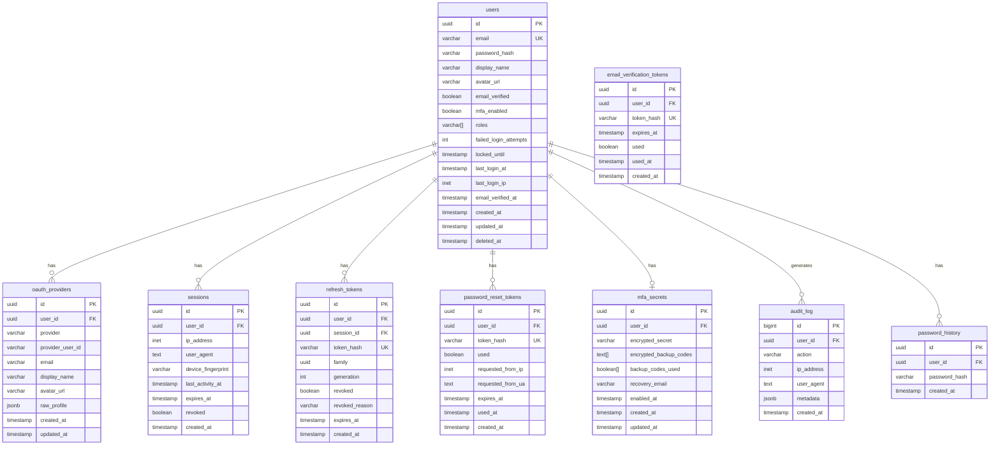

# Auth Service Database Schema

This page contains the complete PostgreSQL schema for the auth service. Every table, column, index, constraint, trigger, and function is defined here with the rationale behind each design decision. The schema is organized into a dedicated `auth` schema to isolate it from application tables.

## Schema Overview



## Full DDL

### Schema and Extensions

```sql
-- ============================================================
-- Auth Service Database Schema
-- PostgreSQL 16+
-- ============================================================

-- Create dedicated schema
CREATE SCHEMA IF NOT EXISTS auth;

-- Required extensions
CREATE EXTENSION IF NOT EXISTS "uuid-ossp";       -- UUID generation
CREATE EXTENSION IF NOT EXISTS "pgcrypto";         -- Cryptographic functions
CREATE EXTENSION IF NOT EXISTS "citext";           -- Case-insensitive text
CREATE EXTENSION IF NOT EXISTS "btree_gist";       -- GiST index support for exclusions

-- Set search path for this session
SET search_path TO auth, public;
```

### Users Table

The users table is the central entity. Every other table references it. The `email` column uses `citext` (case-insensitive text) to prevent duplicate registrations with different casing.

```sql
-- ============================================================
-- USERS TABLE
-- ============================================================

CREATE TABLE auth.users (
    id              UUID PRIMARY KEY DEFAULT uuid_generate_v4(),
    email           CITEXT NOT NULL,
    password_hash   VARCHAR(255),           -- NULL for OAuth-only users
    display_name    VARCHAR(100) NOT NULL,
    avatar_url      VARCHAR(2048),
    email_verified  BOOLEAN NOT NULL DEFAULT FALSE,
    mfa_enabled     BOOLEAN NOT NULL DEFAULT FALSE,
    roles           VARCHAR(50)[] NOT NULL DEFAULT ARRAY['user']::VARCHAR[],

    -- Security fields
    failed_login_attempts   INTEGER NOT NULL DEFAULT 0,
    locked_until            TIMESTAMPTZ,
    last_login_at           TIMESTAMPTZ,
    last_login_ip           INET,
    email_verified_at       TIMESTAMPTZ,

    -- Timestamps
    created_at      TIMESTAMPTZ NOT NULL DEFAULT NOW(),
    updated_at      TIMESTAMPTZ NOT NULL DEFAULT NOW(),
    deleted_at      TIMESTAMPTZ,            -- Soft delete

    -- Constraints
    CONSTRAINT users_email_unique UNIQUE (email),
    CONSTRAINT users_email_length CHECK (char_length(email) <= 255),
    CONSTRAINT users_email_format CHECK (email ~* '^[a-zA-Z0-9._%+-]+@[a-zA-Z0-9.-]+\.[a-zA-Z]{2,}$'),
    CONSTRAINT users_display_name_length CHECK (char_length(display_name) BETWEEN 2 AND 100),
    CONSTRAINT users_failed_attempts_non_negative CHECK (failed_login_attempts >= 0),
    CONSTRAINT users_roles_not_empty CHECK (array_length(roles, 1) > 0)
);

-- Indexes
CREATE INDEX idx_users_email ON auth.users (email) WHERE deleted_at IS NULL;
CREATE INDEX idx_users_created_at ON auth.users (created_at);
CREATE INDEX idx_users_last_login_at ON auth.users (last_login_at) WHERE last_login_at IS NOT NULL;
CREATE INDEX idx_users_locked_until ON auth.users (locked_until) WHERE locked_until IS NOT NULL;

-- Partial index for active users only (most queries filter soft-deleted)
CREATE INDEX idx_users_active ON auth.users (id) WHERE deleted_at IS NULL;

COMMENT ON TABLE auth.users IS 'Core user accounts with credentials and profile information';
COMMENT ON COLUMN auth.users.password_hash IS 'Argon2id hash. NULL for OAuth-only accounts.';
COMMENT ON COLUMN auth.users.roles IS 'Array of role names. Default: {user}. Options: user, admin, super_admin';
COMMENT ON COLUMN auth.users.deleted_at IS 'Soft delete timestamp. Non-NULL means the account is deactivated.';
```

### OAuth Providers Table

Links external OAuth identity providers to user accounts. A user can have multiple providers linked (e.g., both Google and GitHub).

```sql
-- ============================================================
-- OAUTH PROVIDERS TABLE
-- ============================================================

CREATE TABLE auth.oauth_providers (
    id                  UUID PRIMARY KEY DEFAULT uuid_generate_v4(),
    user_id             UUID NOT NULL REFERENCES auth.users(id) ON DELETE CASCADE,
    provider            VARCHAR(50) NOT NULL,       -- 'google', 'github', 'apple'
    provider_user_id    VARCHAR(255) NOT NULL,       -- Provider's unique user ID
    email               VARCHAR(255),
    display_name        VARCHAR(100),
    avatar_url          VARCHAR(2048),
    raw_profile         JSONB,                       -- Full profile from provider (for debugging)
    access_token        VARCHAR(2048),               -- Encrypted OAuth access token
    refresh_token       VARCHAR(2048),               -- Encrypted OAuth refresh token
    token_expires_at    TIMESTAMPTZ,

    -- Timestamps
    created_at          TIMESTAMPTZ NOT NULL DEFAULT NOW(),
    updated_at          TIMESTAMPTZ NOT NULL DEFAULT NOW(),

    -- Constraints
    CONSTRAINT oauth_provider_unique UNIQUE (provider, provider_user_id),
    CONSTRAINT oauth_user_provider_unique UNIQUE (user_id, provider)
);

-- Indexes
CREATE INDEX idx_oauth_providers_user_id ON auth.oauth_providers (user_id);
CREATE INDEX idx_oauth_providers_lookup ON auth.oauth_providers (provider, provider_user_id);

COMMENT ON TABLE auth.oauth_providers IS 'Links external OAuth/OIDC identity providers to user accounts';
COMMENT ON COLUMN auth.oauth_providers.raw_profile IS 'Full profile JSON from the OAuth provider, stored for debugging and future field mapping';
```

### Sessions Table

Tracks active user sessions. Sessions are primarily stored in Redis for fast access, but persisted in PostgreSQL for audit purposes and recovery after Redis failures.

```sql
-- ============================================================
-- SESSIONS TABLE
-- ============================================================

CREATE TABLE auth.sessions (
    id                  UUID PRIMARY KEY DEFAULT uuid_generate_v4(),
    user_id             UUID NOT NULL REFERENCES auth.users(id) ON DELETE CASCADE,
    ip_address          INET NOT NULL,
    user_agent          TEXT NOT NULL,
    device_fingerprint  VARCHAR(255),
    last_activity_at    TIMESTAMPTZ NOT NULL DEFAULT NOW(),
    expires_at          TIMESTAMPTZ NOT NULL,
    revoked             BOOLEAN NOT NULL DEFAULT FALSE,
    revoked_at          TIMESTAMPTZ,
    revoked_reason      VARCHAR(100),       -- 'logout', 'password_change', 'admin_revoke', 'security_alert'

    -- Timestamps
    created_at          TIMESTAMPTZ NOT NULL DEFAULT NOW(),

    -- Constraints
    CONSTRAINT sessions_expires_after_creation CHECK (expires_at > created_at)
);

-- Indexes
CREATE INDEX idx_sessions_user_id ON auth.sessions (user_id) WHERE revoked = FALSE;
CREATE INDEX idx_sessions_expires_at ON auth.sessions (expires_at) WHERE revoked = FALSE;
CREATE INDEX idx_sessions_user_active ON auth.sessions (user_id, created_at DESC) WHERE revoked = FALSE;

-- Index for cleanup job (find expired sessions)
CREATE INDEX idx_sessions_expired ON auth.sessions (expires_at) WHERE revoked = FALSE AND expires_at < NOW();

COMMENT ON TABLE auth.sessions IS 'User sessions. Primary storage is Redis; PostgreSQL is the source of truth for audit and recovery.';
COMMENT ON COLUMN auth.sessions.revoked_reason IS 'Why the session was terminated: logout, password_change, admin_revoke, security_alert';
```

### Refresh Tokens Table

Stores refresh token metadata. The actual token value is never stored — only a SHA-256 hash. This prevents token theft from database access.

```sql
-- ============================================================
-- REFRESH TOKENS TABLE
-- ============================================================

CREATE TABLE auth.refresh_tokens (
    id              UUID PRIMARY KEY DEFAULT uuid_generate_v4(),
    user_id         UUID NOT NULL REFERENCES auth.users(id) ON DELETE CASCADE,
    session_id      UUID NOT NULL REFERENCES auth.sessions(id) ON DELETE CASCADE,
    token_hash      VARCHAR(64) NOT NULL,       -- SHA-256 of the token value
    family          UUID NOT NULL,               -- Token family for rotation tracking
    generation      INTEGER NOT NULL DEFAULT 0,  -- Rotation counter within family
    revoked         BOOLEAN NOT NULL DEFAULT FALSE,
    revoked_at      TIMESTAMPTZ,
    revoked_reason  VARCHAR(100),               -- 'rotated', 'logout', 'reuse_detected', 'password_change'
    expires_at      TIMESTAMPTZ NOT NULL,

    -- Timestamps
    created_at      TIMESTAMPTZ NOT NULL DEFAULT NOW(),

    -- Constraints
    CONSTRAINT refresh_tokens_hash_unique UNIQUE (token_hash),
    CONSTRAINT refresh_tokens_generation_non_negative CHECK (generation >= 0),
    CONSTRAINT refresh_tokens_expires_after_creation CHECK (expires_at > created_at)
);

-- Indexes
CREATE INDEX idx_refresh_tokens_user_id ON auth.refresh_tokens (user_id) WHERE revoked = FALSE;
CREATE INDEX idx_refresh_tokens_session_id ON auth.refresh_tokens (session_id) WHERE revoked = FALSE;
CREATE INDEX idx_refresh_tokens_family ON auth.refresh_tokens (family);
CREATE INDEX idx_refresh_tokens_hash ON auth.refresh_tokens (token_hash) WHERE revoked = FALSE;
CREATE INDEX idx_refresh_tokens_expires ON auth.refresh_tokens (expires_at) WHERE revoked = FALSE;

COMMENT ON TABLE auth.refresh_tokens IS 'Refresh token metadata. Token values are stored as SHA-256 hashes only.';
COMMENT ON COLUMN auth.refresh_tokens.family IS 'UUID grouping tokens in a rotation chain. Used for reuse detection.';
COMMENT ON COLUMN auth.refresh_tokens.generation IS 'How many times this token family has been rotated. Starts at 0.';
```

### Password Reset Tokens Table

```sql
-- ============================================================
-- PASSWORD RESET TOKENS TABLE
-- ============================================================

CREATE TABLE auth.password_reset_tokens (
    id                  UUID PRIMARY KEY DEFAULT uuid_generate_v4(),
    user_id             UUID NOT NULL REFERENCES auth.users(id) ON DELETE CASCADE,
    token_hash          VARCHAR(64) NOT NULL,       -- SHA-256 of the token
    used                BOOLEAN NOT NULL DEFAULT FALSE,
    used_at             TIMESTAMPTZ,
    requested_from_ip   INET NOT NULL,
    requested_from_ua   TEXT,
    expires_at          TIMESTAMPTZ NOT NULL,

    -- Timestamps
    created_at          TIMESTAMPTZ NOT NULL DEFAULT NOW(),

    -- Constraints
    CONSTRAINT password_reset_hash_unique UNIQUE (token_hash),
    CONSTRAINT password_reset_expires CHECK (expires_at > created_at)
);

-- Indexes
CREATE INDEX idx_password_reset_user_id ON auth.password_reset_tokens (user_id) WHERE used = FALSE;
CREATE INDEX idx_password_reset_hash ON auth.password_reset_tokens (token_hash) WHERE used = FALSE;
CREATE INDEX idx_password_reset_expires ON auth.password_reset_tokens (expires_at) WHERE used = FALSE;

COMMENT ON TABLE auth.password_reset_tokens IS 'Password reset tokens. Tokens are one-time use and expire after 1 hour.';
```

### Email Verification Tokens Table

```sql
-- ============================================================
-- EMAIL VERIFICATION TOKENS TABLE
-- ============================================================

CREATE TABLE auth.email_verification_tokens (
    id              UUID PRIMARY KEY DEFAULT uuid_generate_v4(),
    user_id         UUID NOT NULL REFERENCES auth.users(id) ON DELETE CASCADE,
    token_hash      VARCHAR(64) NOT NULL,       -- SHA-256 of the token
    used            BOOLEAN NOT NULL DEFAULT FALSE,
    used_at         TIMESTAMPTZ,
    expires_at      TIMESTAMPTZ NOT NULL,

    -- Timestamps
    created_at      TIMESTAMPTZ NOT NULL DEFAULT NOW(),

    -- Constraints
    CONSTRAINT email_verification_hash_unique UNIQUE (token_hash),
    CONSTRAINT email_verification_expires CHECK (expires_at > created_at)
);

-- Indexes
CREATE INDEX idx_email_verification_user_id ON auth.email_verification_tokens (user_id) WHERE used = FALSE;
CREATE INDEX idx_email_verification_hash ON auth.email_verification_tokens (token_hash) WHERE used = FALSE;

COMMENT ON TABLE auth.email_verification_tokens IS 'Email verification tokens. Expire after 24 hours.';
```

### MFA Secrets Table

Stores encrypted TOTP secrets and backup codes. The encryption key is managed by the application, not the database.

```sql
-- ============================================================
-- MFA SECRETS TABLE
-- ============================================================

CREATE TABLE auth.mfa_secrets (
    id                      UUID PRIMARY KEY DEFAULT uuid_generate_v4(),
    user_id                 UUID NOT NULL REFERENCES auth.users(id) ON DELETE CASCADE,
    encrypted_secret        VARCHAR(512) NOT NULL,          -- AES-256-GCM encrypted TOTP secret
    encrypted_backup_codes  TEXT[] NOT NULL,                 -- Array of encrypted backup codes
    backup_codes_used       BOOLEAN[] NOT NULL,              -- Parallel array tracking used codes
    recovery_email          VARCHAR(255),

    -- Timestamps
    enabled_at              TIMESTAMPTZ NOT NULL DEFAULT NOW(),
    created_at              TIMESTAMPTZ NOT NULL DEFAULT NOW(),
    updated_at              TIMESTAMPTZ NOT NULL DEFAULT NOW(),

    -- Constraints
    CONSTRAINT mfa_secrets_user_unique UNIQUE (user_id),
    CONSTRAINT mfa_backup_codes_length CHECK (
        array_length(encrypted_backup_codes, 1) = array_length(backup_codes_used, 1)
    )
);

COMMENT ON TABLE auth.mfa_secrets IS 'TOTP MFA secrets and backup codes. All sensitive data is AES-256-GCM encrypted at the application layer.';
COMMENT ON COLUMN auth.mfa_secrets.encrypted_secret IS 'TOTP secret encrypted with AES-256-GCM. Decrypted only during TOTP verification.';
COMMENT ON COLUMN auth.mfa_secrets.backup_codes_used IS 'Parallel boolean array. backup_codes_used[i] = TRUE means encrypted_backup_codes[i] has been consumed.';
```

### Password History Table

Prevents users from reusing recent passwords.

```sql
-- ============================================================
-- PASSWORD HISTORY TABLE
-- ============================================================

CREATE TABLE auth.password_history (
    id              UUID PRIMARY KEY DEFAULT uuid_generate_v4(),
    user_id         UUID NOT NULL REFERENCES auth.users(id) ON DELETE CASCADE,
    password_hash   VARCHAR(255) NOT NULL,

    -- Timestamps
    created_at      TIMESTAMPTZ NOT NULL DEFAULT NOW()
);

-- Indexes
CREATE INDEX idx_password_history_user_id ON auth.password_history (user_id, created_at DESC);

COMMENT ON TABLE auth.password_history IS 'Stores the last N password hashes per user to prevent password reuse. Default: keep last 5.';
```

### Audit Log Table

The audit log is append-only and uses a BIGSERIAL primary key for high-throughput inserts. It is partitioned by month for efficient querying and retention management.

```sql
-- ============================================================
-- AUDIT LOG TABLE (PARTITIONED)
-- ============================================================

CREATE TABLE auth.audit_log (
    id              BIGINT GENERATED ALWAYS AS IDENTITY,
    user_id         UUID,                           -- NULL for system events
    action          VARCHAR(100) NOT NULL,
    ip_address      INET,
    user_agent      TEXT,
    metadata        JSONB DEFAULT '{}',
    created_at      TIMESTAMPTZ NOT NULL DEFAULT NOW(),

    PRIMARY KEY (id, created_at)
) PARTITION BY RANGE (created_at);

-- Create partitions for the next 12 months
CREATE TABLE auth.audit_log_2026_01 PARTITION OF auth.audit_log
    FOR VALUES FROM ('2026-01-01') TO ('2026-02-01');
CREATE TABLE auth.audit_log_2026_02 PARTITION OF auth.audit_log
    FOR VALUES FROM ('2026-02-01') TO ('2026-03-01');
CREATE TABLE auth.audit_log_2026_03 PARTITION OF auth.audit_log
    FOR VALUES FROM ('2026-03-01') TO ('2026-04-01');
CREATE TABLE auth.audit_log_2026_04 PARTITION OF auth.audit_log
    FOR VALUES FROM ('2026-04-01') TO ('2026-05-01');
CREATE TABLE auth.audit_log_2026_05 PARTITION OF auth.audit_log
    FOR VALUES FROM ('2026-05-01') TO ('2026-06-01');
CREATE TABLE auth.audit_log_2026_06 PARTITION OF auth.audit_log
    FOR VALUES FROM ('2026-06-01') TO ('2026-07-01');
CREATE TABLE auth.audit_log_2026_07 PARTITION OF auth.audit_log
    FOR VALUES FROM ('2026-07-01') TO ('2026-08-01');
CREATE TABLE auth.audit_log_2026_08 PARTITION OF auth.audit_log
    FOR VALUES FROM ('2026-08-01') TO ('2026-09-01');
CREATE TABLE auth.audit_log_2026_09 PARTITION OF auth.audit_log
    FOR VALUES FROM ('2026-09-01') TO ('2026-10-01');
CREATE TABLE auth.audit_log_2026_10 PARTITION OF auth.audit_log
    FOR VALUES FROM ('2026-10-01') TO ('2026-11-01');
CREATE TABLE auth.audit_log_2026_11 PARTITION OF auth.audit_log
    FOR VALUES FROM ('2026-11-01') TO ('2026-12-01');
CREATE TABLE auth.audit_log_2026_12 PARTITION OF auth.audit_log
    FOR VALUES FROM ('2026-12-01') TO ('2027-01-01');

-- Indexes (created on each partition automatically by PostgreSQL)
CREATE INDEX idx_audit_log_user_id ON auth.audit_log (user_id, created_at DESC);
CREATE INDEX idx_audit_log_action ON auth.audit_log (action, created_at DESC);
CREATE INDEX idx_audit_log_ip ON auth.audit_log (ip_address, created_at DESC);

-- Audit actions enum-like constraint
-- Rather than an actual ENUM (which requires ALTER TYPE for changes),
-- we use a CHECK constraint with a list of valid actions
ALTER TABLE auth.audit_log ADD CONSTRAINT audit_log_valid_actions CHECK (
    action IN (
        'USER_REGISTERED',
        'LOGIN_SUCCESS',
        'LOGIN_FAILED',
        'LOGIN_ATTEMPT_LOCKED',
        'LOGOUT',
        'LOGOUT_ALL_SESSIONS',
        'TOKEN_REFRESHED',
        'TOKEN_REUSE_DETECTED',
        'PASSWORD_CHANGED',
        'PASSWORD_RESET_REQUESTED',
        'PASSWORD_RESET_COMPLETED',
        'EMAIL_VERIFICATION_SENT',
        'EMAIL_VERIFIED',
        'MFA_ENABLED',
        'MFA_DISABLED',
        'MFA_CHALLENGE_PASSED',
        'MFA_CHALLENGE_FAILED',
        'BACKUP_CODE_USED',
        'OAUTH_LINKED',
        'OAUTH_UNLINKED',
        'ACCOUNT_LOCKED',
        'ACCOUNT_UNLOCKED',
        'ACCOUNT_DELETED',
        'SESSION_REVOKED',
        'ADMIN_ACTION'
    )
);

COMMENT ON TABLE auth.audit_log IS 'Immutable audit trail of all authentication events. Partitioned by month. Retain for 2 years.';
```

## Triggers and Functions

### Auto-Update `updated_at` Trigger

```sql
-- ============================================================
-- TRIGGER: Auto-update updated_at timestamp
-- ============================================================

CREATE OR REPLACE FUNCTION auth.update_updated_at_column()
RETURNS TRIGGER AS $$
BEGIN
    NEW.updated_at = NOW();
    RETURN NEW;
END;
$$ LANGUAGE plpgsql;

-- Apply to all tables with updated_at
CREATE TRIGGER trg_users_updated_at
    BEFORE UPDATE ON auth.users
    FOR EACH ROW EXECUTE FUNCTION auth.update_updated_at_column();

CREATE TRIGGER trg_oauth_providers_updated_at
    BEFORE UPDATE ON auth.oauth_providers
    FOR EACH ROW EXECUTE FUNCTION auth.update_updated_at_column();

CREATE TRIGGER trg_mfa_secrets_updated_at
    BEFORE UPDATE ON auth.mfa_secrets
    FOR EACH ROW EXECUTE FUNCTION auth.update_updated_at_column();
```

### Password History Trigger

Automatically records old password hashes when a user's password is changed, and enforces the "no reuse of last 5 passwords" policy.

```sql
-- ============================================================
-- TRIGGER: Record password history on password change
-- ============================================================

CREATE OR REPLACE FUNCTION auth.record_password_history()
RETURNS TRIGGER AS $$
BEGIN
    -- Only fire when password_hash actually changes
    IF OLD.password_hash IS DISTINCT FROM NEW.password_hash AND OLD.password_hash IS NOT NULL THEN
        -- Record the old password hash
        INSERT INTO auth.password_history (user_id, password_hash)
        VALUES (OLD.id, OLD.password_hash);

        -- Keep only the last 5 entries per user
        DELETE FROM auth.password_history
        WHERE id IN (
            SELECT id FROM auth.password_history
            WHERE user_id = OLD.id
            ORDER BY created_at DESC
            OFFSET 5
        );
    END IF;

    RETURN NEW;
END;
$$ LANGUAGE plpgsql;

CREATE TRIGGER trg_users_password_history
    AFTER UPDATE OF password_hash ON auth.users
    FOR EACH ROW EXECUTE FUNCTION auth.record_password_history();
```

### Session Limit Enforcement Trigger

```sql
-- ============================================================
-- TRIGGER: Enforce maximum sessions per user
-- ============================================================

CREATE OR REPLACE FUNCTION auth.enforce_session_limit()
RETURNS TRIGGER AS $$
DECLARE
    session_count INTEGER;
    max_sessions INTEGER := 5;
    oldest_session_id UUID;
BEGIN
    -- Count active sessions for this user
    SELECT COUNT(*) INTO session_count
    FROM auth.sessions
    WHERE user_id = NEW.user_id AND revoked = FALSE AND expires_at > NOW();

    -- If over the limit, revoke the oldest session
    IF session_count >= max_sessions THEN
        SELECT id INTO oldest_session_id
        FROM auth.sessions
        WHERE user_id = NEW.user_id AND revoked = FALSE AND expires_at > NOW()
        ORDER BY created_at ASC
        LIMIT 1;

        IF oldest_session_id IS NOT NULL THEN
            UPDATE auth.sessions
            SET revoked = TRUE, revoked_at = NOW(), revoked_reason = 'session_limit_exceeded'
            WHERE id = oldest_session_id;
        END IF;
    END IF;

    RETURN NEW;
END;
$$ LANGUAGE plpgsql;

CREATE TRIGGER trg_sessions_limit
    BEFORE INSERT ON auth.sessions
    FOR EACH ROW EXECUTE FUNCTION auth.enforce_session_limit();
```

### Audit Log Trigger for Critical Actions

```sql
-- ============================================================
-- TRIGGER: Auto-audit critical user changes
-- ============================================================

CREATE OR REPLACE FUNCTION auth.audit_user_changes()
RETURNS TRIGGER AS $$
BEGIN
    -- MFA status change
    IF OLD.mfa_enabled IS DISTINCT FROM NEW.mfa_enabled THEN
        INSERT INTO auth.audit_log (user_id, action, metadata)
        VALUES (
            NEW.id,
            CASE WHEN NEW.mfa_enabled THEN 'MFA_ENABLED' ELSE 'MFA_DISABLED' END,
            jsonb_build_object(
                'old_value', OLD.mfa_enabled,
                'new_value', NEW.mfa_enabled,
                'triggered_by', 'system_trigger'
            )
        );
    END IF;

    -- Email verification
    IF OLD.email_verified = FALSE AND NEW.email_verified = TRUE THEN
        INSERT INTO auth.audit_log (user_id, action, metadata)
        VALUES (NEW.id, 'EMAIL_VERIFIED', '{}');
    END IF;

    -- Account lock/unlock
    IF OLD.locked_until IS DISTINCT FROM NEW.locked_until THEN
        IF NEW.locked_until IS NOT NULL AND NEW.locked_until > NOW() THEN
            INSERT INTO auth.audit_log (user_id, action, metadata)
            VALUES (
                NEW.id, 'ACCOUNT_LOCKED',
                jsonb_build_object('locked_until', NEW.locked_until::text, 'failed_attempts', NEW.failed_login_attempts)
            );
        ELSIF OLD.locked_until IS NOT NULL AND (NEW.locked_until IS NULL OR NEW.locked_until <= NOW()) THEN
            INSERT INTO auth.audit_log (user_id, action, metadata)
            VALUES (NEW.id, 'ACCOUNT_UNLOCKED', '{}');
        END IF;
    END IF;

    -- Soft delete
    IF OLD.deleted_at IS NULL AND NEW.deleted_at IS NOT NULL THEN
        INSERT INTO auth.audit_log (user_id, action, metadata)
        VALUES (NEW.id, 'ACCOUNT_DELETED', jsonb_build_object('deleted_at', NEW.deleted_at::text));
    END IF;

    RETURN NEW;
END;
$$ LANGUAGE plpgsql;

CREATE TRIGGER trg_users_audit
    AFTER UPDATE ON auth.users
    FOR EACH ROW EXECUTE FUNCTION auth.audit_user_changes();
```

## Row-Level Security (RLS)

For multi-tenant deployments, RLS policies ensure that users can only access their own data, even if the application has a bug.

```sql
-- ============================================================
-- ROW-LEVEL SECURITY POLICIES
-- ============================================================

-- Enable RLS on sensitive tables
ALTER TABLE auth.users ENABLE ROW LEVEL SECURITY;
ALTER TABLE auth.sessions ENABLE ROW LEVEL SECURITY;
ALTER TABLE auth.refresh_tokens ENABLE ROW LEVEL SECURITY;
ALTER TABLE auth.mfa_secrets ENABLE ROW LEVEL SECURITY;

-- Application role
CREATE ROLE auth_app_user;

-- Users: can only see own row
CREATE POLICY users_own_data ON auth.users
    FOR ALL TO auth_app_user
    USING (id = current_setting('app.current_user_id')::UUID);

-- Sessions: can only see own sessions
CREATE POLICY sessions_own_data ON auth.sessions
    FOR ALL TO auth_app_user
    USING (user_id = current_setting('app.current_user_id')::UUID);

-- Refresh tokens: can only see own tokens
CREATE POLICY refresh_tokens_own_data ON auth.refresh_tokens
    FOR ALL TO auth_app_user
    USING (user_id = current_setting('app.current_user_id')::UUID);

-- MFA: can only see own MFA config
CREATE POLICY mfa_own_data ON auth.mfa_secrets
    FOR ALL TO auth_app_user
    USING (user_id = current_setting('app.current_user_id')::UUID);

-- Service role (bypasses RLS)
CREATE ROLE auth_service_role BYPASSRLS;
```

## Maintenance Procedures

### Cleanup Expired Tokens

A scheduled job (run via `pg_cron` or an external cron) that cleans up expired data:

```sql
-- ============================================================
-- MAINTENANCE: Cleanup expired data
-- ============================================================

CREATE OR REPLACE FUNCTION auth.cleanup_expired_data()
RETURNS TABLE(
    expired_sessions_removed INTEGER,
    expired_refresh_tokens_removed INTEGER,
    expired_reset_tokens_removed INTEGER,
    expired_verification_tokens_removed INTEGER
) AS $$
DECLARE
    v_sessions INTEGER;
    v_refresh INTEGER;
    v_reset INTEGER;
    v_verification INTEGER;
BEGIN
    -- Remove expired sessions (older than 90 days past expiry for audit retention)
    WITH deleted AS (
        DELETE FROM auth.sessions
        WHERE expires_at < NOW() - INTERVAL '90 days'
        RETURNING id
    )
    SELECT COUNT(*) INTO v_sessions FROM deleted;

    -- Remove expired refresh tokens
    WITH deleted AS (
        DELETE FROM auth.refresh_tokens
        WHERE expires_at < NOW() - INTERVAL '7 days'
        RETURNING id
    )
    SELECT COUNT(*) INTO v_refresh FROM deleted;

    -- Remove expired/used password reset tokens
    WITH deleted AS (
        DELETE FROM auth.password_reset_tokens
        WHERE (expires_at < NOW() AND used = FALSE)
           OR (used = TRUE AND used_at < NOW() - INTERVAL '30 days')
        RETURNING id
    )
    SELECT COUNT(*) INTO v_reset FROM deleted;

    -- Remove expired/used verification tokens
    WITH deleted AS (
        DELETE FROM auth.email_verification_tokens
        WHERE (expires_at < NOW() AND used = FALSE)
           OR (used = TRUE AND used_at < NOW() - INTERVAL '30 days')
        RETURNING id
    )
    SELECT COUNT(*) INTO v_verification FROM deleted;

    RETURN QUERY SELECT v_sessions, v_refresh, v_reset, v_verification;
END;
$$ LANGUAGE plpgsql;

-- Schedule with pg_cron (run daily at 3 AM UTC)
-- SELECT cron.schedule('auth-cleanup', '0 3 * * *', 'SELECT * FROM auth.cleanup_expired_data()');
```

### Partition Management

Automatically create audit log partitions for future months:

```sql
-- ============================================================
-- MAINTENANCE: Auto-create audit log partitions
-- ============================================================

CREATE OR REPLACE FUNCTION auth.create_audit_log_partition()
RETURNS void AS $$
DECLARE
    partition_date DATE;
    partition_name TEXT;
    start_date TEXT;
    end_date TEXT;
BEGIN
    -- Create partitions for the next 3 months
    FOR i IN 0..2 LOOP
        partition_date := date_trunc('month', NOW() + (i || ' months')::INTERVAL)::DATE;
        partition_name := 'audit_log_' || to_char(partition_date, 'YYYY_MM');
        start_date := to_char(partition_date, 'YYYY-MM-DD');
        end_date := to_char(partition_date + INTERVAL '1 month', 'YYYY-MM-DD');

        -- Check if partition already exists
        IF NOT EXISTS (
            SELECT 1 FROM pg_tables
            WHERE schemaname = 'auth' AND tablename = partition_name
        ) THEN
            EXECUTE format(
                'CREATE TABLE auth.%I PARTITION OF auth.audit_log FOR VALUES FROM (%L) TO (%L)',
                partition_name, start_date, end_date
            );
            RAISE NOTICE 'Created partition: auth.%', partition_name;
        END IF;
    END LOOP;
END;
$$ LANGUAGE plpgsql;

-- Schedule monthly (run on 1st of each month at 1 AM UTC)
-- SELECT cron.schedule('audit-partition', '0 1 1 * *', 'SELECT auth.create_audit_log_partition()');
```

## Migration Files

### Migration 001: Initial Schema

```sql
-- migrations/001_initial_schema.up.sql
-- Description: Create auth schema with all tables
-- Author: Platform Team
-- Date: 2026-03-17

BEGIN;

-- [All CREATE TABLE statements from above go here]
-- This is the full initial migration that sets up the auth schema.

-- Verify migration
DO $$
BEGIN
    ASSERT (SELECT COUNT(*) FROM information_schema.tables WHERE table_schema = 'auth') >= 8,
        'Expected at least 8 tables in auth schema';
END;
$$;

COMMIT;
```

```sql
-- migrations/001_initial_schema.down.sql
-- WARNING: This drops all auth data. Use with extreme caution.

BEGIN;

DROP SCHEMA auth CASCADE;

COMMIT;
```

### Migration 002: Add Organization Support

```sql
-- migrations/002_add_organization_support.up.sql
-- Description: Add multi-tenancy support with organization_id
-- Author: Platform Team
-- Date: 2026-03-17

BEGIN;

-- Add organization reference to users
ALTER TABLE auth.users
    ADD COLUMN org_id UUID,
    ADD COLUMN org_role VARCHAR(50) DEFAULT 'member';

CREATE INDEX idx_users_org_id ON auth.users (org_id) WHERE org_id IS NOT NULL AND deleted_at IS NULL;

-- Add organization context to sessions
ALTER TABLE auth.sessions
    ADD COLUMN org_id UUID;

-- Add organization context to audit log
ALTER TABLE auth.audit_log
    ADD COLUMN org_id UUID;

CREATE INDEX idx_audit_log_org_id ON auth.audit_log (org_id, created_at DESC) WHERE org_id IS NOT NULL;

COMMENT ON COLUMN auth.users.org_id IS 'Organization ID for multi-tenant deployments. NULL for personal accounts.';
COMMENT ON COLUMN auth.users.org_role IS 'Role within the organization: owner, admin, member, viewer';

COMMIT;
```

```sql
-- migrations/002_add_organization_support.down.sql

BEGIN;

ALTER TABLE auth.users DROP COLUMN IF EXISTS org_id, DROP COLUMN IF EXISTS org_role;
ALTER TABLE auth.sessions DROP COLUMN IF EXISTS org_id;
ALTER TABLE auth.audit_log DROP COLUMN IF EXISTS org_id;

COMMIT;
```

### Migration 003: Add Rate Limit Tracking

```sql
-- migrations/003_add_rate_limit_tracking.up.sql
-- Description: Add table for persistent rate limit tracking (complement to Redis)
-- Author: Platform Team
-- Date: 2026-03-17

BEGIN;

CREATE TABLE auth.rate_limit_overrides (
    id              UUID PRIMARY KEY DEFAULT uuid_generate_v4(),
    identifier      VARCHAR(255) NOT NULL,       -- IP address, user ID, or API key
    identifier_type VARCHAR(50) NOT NULL,         -- 'ip', 'user_id', 'api_key'
    endpoint        VARCHAR(255) NOT NULL,        -- '/auth/login', '/auth/register', '*'
    max_requests    INTEGER NOT NULL,
    window_seconds  INTEGER NOT NULL,
    reason          TEXT,                          -- Why this override exists
    expires_at      TIMESTAMPTZ,                  -- NULL = permanent
    created_by      UUID REFERENCES auth.users(id),
    created_at      TIMESTAMPTZ NOT NULL DEFAULT NOW(),

    CONSTRAINT rate_limit_override_unique UNIQUE (identifier, identifier_type, endpoint)
);

CREATE INDEX idx_rate_limit_overrides_lookup
    ON auth.rate_limit_overrides (identifier, identifier_type, endpoint)
    WHERE expires_at IS NULL OR expires_at > NOW();

COMMENT ON TABLE auth.rate_limit_overrides IS 'Custom rate limit overrides for specific IPs, users, or API keys. Used for allowlisting partners or blocking abusers.';

COMMIT;
```

## Query Patterns

### Common Queries Used by the Application

```sql
-- Find user by email (login flow)
-- Uses: idx_users_email
SELECT id, email, password_hash, display_name, avatar_url,
       email_verified, mfa_enabled, roles,
       failed_login_attempts, locked_until,
       last_login_at, last_login_ip
FROM auth.users
WHERE email = $1 AND deleted_at IS NULL;

-- Get active sessions for user (settings page)
-- Uses: idx_sessions_user_active
SELECT id, ip_address, user_agent, device_fingerprint,
       created_at, last_activity_at
FROM auth.sessions
WHERE user_id = $1 AND revoked = FALSE AND expires_at > NOW()
ORDER BY last_activity_at DESC;

-- Validate refresh token (token refresh flow)
-- Uses: idx_refresh_tokens_hash
SELECT rt.id, rt.user_id, rt.session_id, rt.family, rt.generation, rt.expires_at,
       u.email, u.display_name, u.email_verified, u.mfa_enabled, u.roles
FROM auth.refresh_tokens rt
JOIN auth.users u ON u.id = rt.user_id AND u.deleted_at IS NULL
WHERE rt.token_hash = $1 AND rt.revoked = FALSE AND rt.expires_at > NOW();

-- Get recent audit log for user (security settings)
-- Uses: idx_audit_log_user_id (partition pruning on created_at)
SELECT action, ip_address, user_agent, metadata, created_at
FROM auth.audit_log
WHERE user_id = $1 AND created_at > NOW() - INTERVAL '30 days'
ORDER BY created_at DESC
LIMIT 50;

-- Check password history (password change)
-- Uses: idx_password_history_user_id
SELECT password_hash
FROM auth.password_history
WHERE user_id = $1
ORDER BY created_at DESC
LIMIT 5;

-- Admin: Find locked accounts
-- Uses: idx_users_locked_until
SELECT id, email, failed_login_attempts, locked_until
FROM auth.users
WHERE locked_until IS NOT NULL AND locked_until > NOW() AND deleted_at IS NULL
ORDER BY locked_until DESC;
```

## Performance Considerations

### Index Strategy

| Table | Index | Purpose | Expected Cardinality |
|---|---|---|---|
| `users` | `email` (unique) | Login lookup | 1 row per query |
| `sessions` | `user_id` (partial: not revoked) | List active sessions | 1-5 rows per user |
| `refresh_tokens` | `token_hash` (partial: not revoked) | Token validation | 1 row per query |
| `audit_log` | `user_id + created_at` | User's activity | 50-100 rows per query |
| `audit_log` | `action + created_at` | Action-based analysis | Varies |

### Table Size Estimates (1M Users)

| Table | Row Count | Estimated Size | Growth Rate |
|---|---|---|---|
| `users` | 1M | ~500 MB | 10K/month |
| `sessions` | 3M (active) | ~300 MB | Churn: create/expire |
| `refresh_tokens` | 3M (active) | ~250 MB | Churn: rotate/expire |
| `audit_log` | 100M/year | ~20 GB/year | 300K/day |
| `password_history` | 3M | ~150 MB | Slow growth |
| `oauth_providers` | 500K | ~100 MB | Slow growth |

### Vacuum Strategy

```sql
-- Custom autovacuum settings for high-churn tables
ALTER TABLE auth.sessions SET (
    autovacuum_vacuum_scale_factor = 0.05,      -- Vacuum after 5% dead rows (default: 20%)
    autovacuum_analyze_scale_factor = 0.02       -- Analyze after 2% changed rows
);

ALTER TABLE auth.refresh_tokens SET (
    autovacuum_vacuum_scale_factor = 0.05,
    autovacuum_analyze_scale_factor = 0.02
);

ALTER TABLE auth.audit_log SET (
    autovacuum_vacuum_scale_factor = 0.1,
    autovacuum_vacuum_cost_limit = 1000          -- Allow more aggressive vacuuming
);
```

---

> *"A well-designed schema is the foundation of a reliable auth system. Get the constraints, indexes, and triggers right, and the application code becomes almost boring — which is exactly what you want for security-critical infrastructure."*
