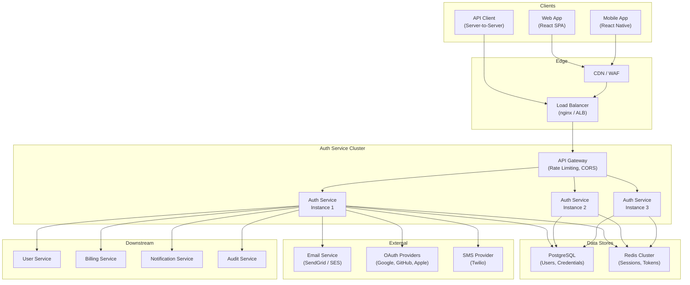
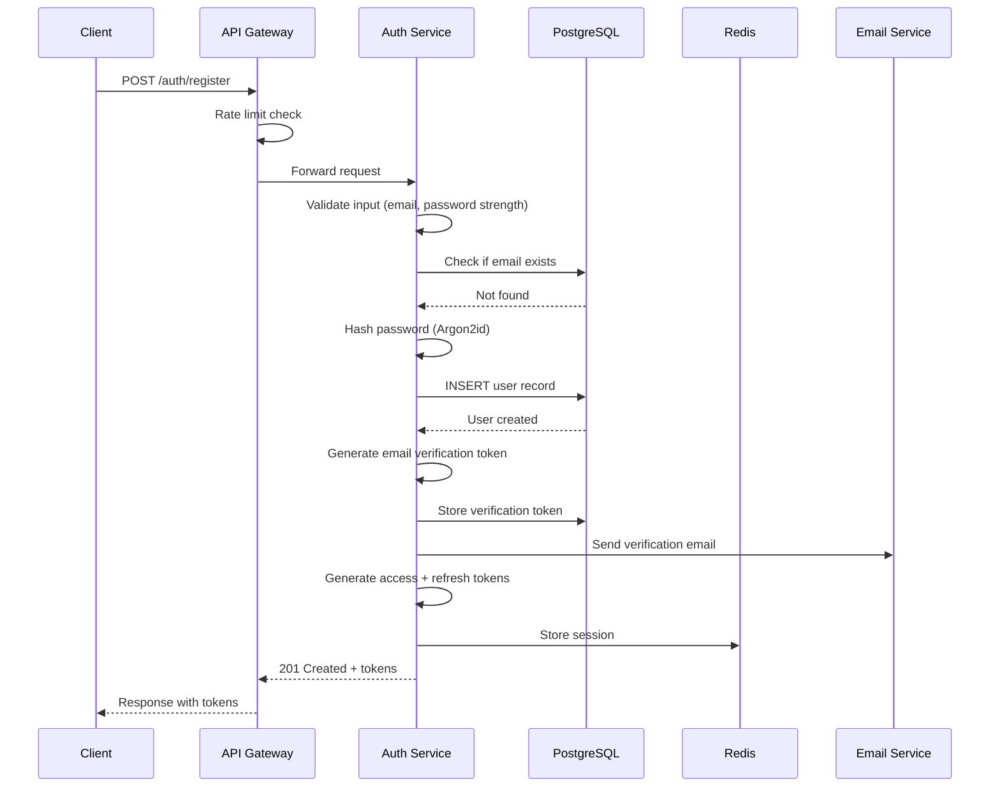
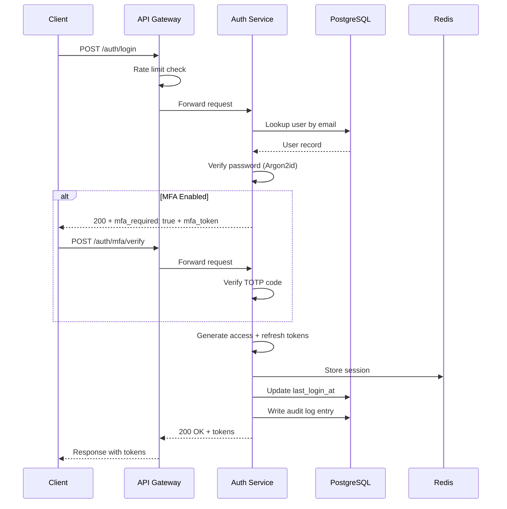
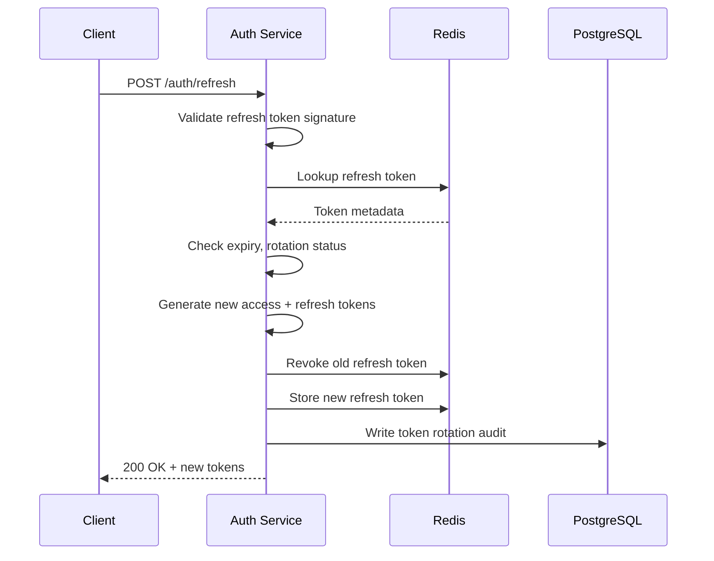

# Auth Service Blueprint

Authentication is the front door to every product. It is the first thing users interact with, the most security-critical system you will build, and the one with the highest operational cost if you get it wrong. A compromised auth system does not just leak data — it destroys trust.

This blueprint covers a complete, production-grade authentication service that handles user registration, login, session management, token refresh, multi-factor authentication, password resets, OAuth2/OIDC social login, and full audit logging. It is designed for a SaaS platform serving tens of thousands to millions of users.

## What This Blueprint Covers

This is not a tutorial on `passport.js`. This is a system design for authentication infrastructure that you can operate in production with confidence. The blueprint addresses six critical dimensions:

1. **Architecture** — How the auth service fits into a broader platform, its internal components, and its communication patterns with other services.
2. **API Contracts** — Every endpoint, request/response schema, error format, and edge case. A developer should be able to implement a client from this spec alone.
3. **Database Schema** — Complete PostgreSQL schema with users, sessions, refresh tokens, password reset tokens, MFA secrets, and audit logs. Full DDL with indexes and constraints.
4. **Deployment** — Docker, Kubernetes manifests, health checks, environment configuration, and CI/CD pipeline.
5. **Scaling** — How the system behaves under load, connection pooling, Redis clustering, horizontal scaling, and capacity planning.
6. **Security** — Threat model, attack surface analysis, rate limiting, brute-force protection, and compliance considerations.

## System Overview

The auth service is a stateless microservice that manages identity, credentials, and sessions. It relies on PostgreSQL for persistent storage and Redis for session/token caching. It exposes a REST API consumed by client applications and other backend services.



## Authentication Flows

The service supports multiple authentication flows, each optimized for different client types and security requirements.

### Registration Flow



### Login Flow



### Token Refresh Flow



## Token Architecture

The service uses a dual-token architecture with short-lived access tokens and long-lived refresh tokens, implementing refresh token rotation for security.

| Token Type | Format | Lifetime | Storage | Purpose |
|---|---|---|---|---|
| Access Token | JWT (RS256) | 15 minutes | Client only | API authorization |
| Refresh Token | Opaque (UUID v4) | 30 days | Redis + DB | Token renewal |
| MFA Token | Opaque (UUID v4) | 5 minutes | Redis | MFA flow continuation |
| Email Verification | Opaque (URL-safe) | 24 hours | PostgreSQL | Email confirmation |
| Password Reset | Opaque (URL-safe) | 1 hour | PostgreSQL | Password recovery |

### Access Token Claims

```typescript
interface AccessTokenPayload {
  // Standard JWT claims
  iss: string;          // Issuer: "auth.yourplatform.com"
  sub: string;          // Subject: user ID (UUID)
  aud: string[];        // Audience: ["api.yourplatform.com"]
  exp: number;          // Expiration: 15 minutes from issuance
  iat: number;          // Issued at
  jti: string;          // JWT ID: unique token identifier

  // Custom claims
  email: string;
  email_verified: boolean;
  roles: string[];      // ["user", "admin"]
  permissions: string[];// ["read:projects", "write:projects"]
  org_id?: string;      // Organization context (multi-tenant)
  session_id: string;   // Links to session in Redis
}
```

### Key Rotation Strategy

Access tokens are signed with RSA-256 using asymmetric keys. The public key is available at a JWKS endpoint so any service can verify tokens without calling the auth service.

```
GET /.well-known/jwks.json
```

Key rotation happens on a 90-day cycle:
1. Generate new key pair, assign new `kid`.
2. Add new public key to JWKS endpoint.
3. Start signing new tokens with the new key.
4. Keep old public key in JWKS for the lifetime of existing tokens (15 min).
5. Remove old public key after grace period.

## Security Posture

### Password Policy

| Rule | Requirement |
|---|---|
| Minimum length | 10 characters |
| Maximum length | 128 characters |
| Complexity | No explicit rules — use zxcvbn scoring |
| Minimum zxcvbn score | 3 out of 4 |
| Breach check | Check against Have I Been Pwned API (k-anonymity model) |
| Hashing | Argon2id (memory: 64 MB, iterations: 3, parallelism: 4) |

### Brute Force Protection

| Layer | Mechanism | Threshold |
|---|---|---|
| API Gateway | Global rate limit | 1000 req/min per IP |
| Login endpoint | Per-IP rate limit | 10 attempts per 15 min |
| Login endpoint | Per-account rate limit | 5 failed attempts, then progressive delay |
| Account lockout | Temporary lockout | 10 failed attempts → 30 min lockout |
| CAPTCHA | Challenge after failures | After 3 failed attempts |

### Session Security

- HTTP-only, Secure, SameSite=Strict cookies for web clients.
- Refresh token rotation: every refresh invalidates the old token.
- Refresh token reuse detection: if a revoked token is presented, all tokens for that session are revoked (indicates token theft).
- Session binding: tokens are bound to device fingerprint (User-Agent + IP subnet).
- Concurrent session limit: configurable, default 5 active sessions per user.

## Technology Stack Justification

| Component | Choice | Rationale |
|---|---|---|
| Language | TypeScript (Node.js) | Strong ecosystem for web auth, type safety, team familiarity |
| Framework | Fastify | 2x faster than Express, schema-based validation, plugin architecture |
| ORM | Drizzle ORM | Type-safe queries, zero-cost abstractions, migration support |
| Password hashing | Argon2id | OWASP recommended, memory-hard (resists GPU attacks) |
| JWT signing | jose library | RFC-compliant, supports RS256/ES256, JWKS |
| Database | PostgreSQL 16 | ACID compliance, row-level security, JSON support |
| Session store | Redis 7 (Cluster) | Sub-millisecond latency, TTL support, atomic operations |
| Email | SendGrid | Deliverability, templates, webhook tracking |
| MFA | otplib (TOTP) | RFC 6238 compliant, compatible with Google Authenticator |
| OAuth | openid-client | Certified OpenID Connect RP, supports PKCE |

## Failure Mode Analysis

| Failure | Impact | Detection | Mitigation |
|---|---|---|---|
| PostgreSQL down | No new registrations, no password resets | Health check fails | Read replica failover, cached user data in Redis for login |
| Redis down | No session validation, no token refresh | Health check fails | Fall back to database session lookup (degraded performance) |
| Email service down | Verification/reset emails not sent | Delivery webhook monitoring | Queue emails, retry with exponential backoff |
| JWT signing key compromised | All tokens untrustworthy | Anomaly detection in audit logs | Immediate key rotation, revoke all sessions |
| DDoS on login | Service unavailable | Rate limit metrics spike | WAF rules, CAPTCHA, IP blocklist |
| Credential stuffing | Account takeovers | Failed login rate anomaly | Rate limiting, breach detection, forced MFA |

## Subsections

- **[Architecture](/production-blueprints/auth-service/architecture)** — Detailed component design, service boundaries, internal data flow, and technology stack deep dive.
- **[API Contracts](/production-blueprints/auth-service/api-contracts)** — Complete REST API specification with TypeScript types, request/response schemas, and error handling.
- **[Database Schema](/production-blueprints/auth-service/database-schema)** — Full PostgreSQL DDL with tables, indexes, constraints, triggers, and migration files.
- **[Deployment](/production-blueprints/auth-service/deployment)** — Docker, Kubernetes manifests, environment configuration, health checks, and CI/CD pipeline.
- **[Scaling Plan](/production-blueprints/auth-service/scaling-plan)** — Performance characteristics, connection pooling, Redis clustering, horizontal scaling, and capacity planning.

## Key Design Decisions

### Why Not Use Auth0/Clerk/Firebase Auth?

Third-party auth providers are excellent for getting started quickly, but this blueprint exists for teams that need:

1. **Full data ownership** — User credentials never leave your infrastructure.
2. **Custom flows** — Enterprise SSO, custom MFA, org-level auth policies.
3. **Cost control** — At 100K+ MAU, managed auth services cost $5K-50K/month.
4. **Compliance** — SOC 2, HIPAA, GDPR requirements that mandate data residency.
5. **Integration depth** — Auth that deeply integrates with your domain model.

### Why Argon2id Over bcrypt?

bcrypt was the gold standard for password hashing for 15 years. Argon2id supersedes it because:

- **Memory-hard**: bcrypt uses ~4 KB of memory; Argon2id uses 64 MB+. This makes GPU/ASIC attacks economically infeasible.
- **Configurable parallelism**: Argon2id can use multiple CPU cores.
- **Side-channel resistance**: The "id" variant combines Argon2i (side-channel resistant) and Argon2d (GPU-resistant).
- **Winner of the Password Hashing Competition (2015)**: Peer-reviewed by the cryptographic community.

### Why RS256 Over HS256 for JWTs?

HS256 (symmetric) is simpler but requires every service that validates tokens to have the secret key. RS256 (asymmetric) means:

- Only the auth service has the private key.
- Any service can validate tokens using the public key (from JWKS endpoint).
- Key compromise in a downstream service cannot forge tokens.
- Standard OIDC/JWKS infrastructure works out of the box.

---

> *"Auth is the one system where 'good enough' is never good enough. Every shortcut you take is a vulnerability you will eventually have to patch under pressure."*
