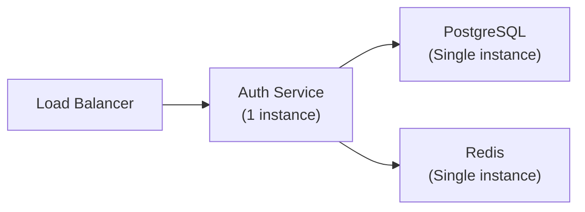
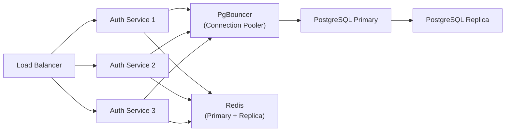
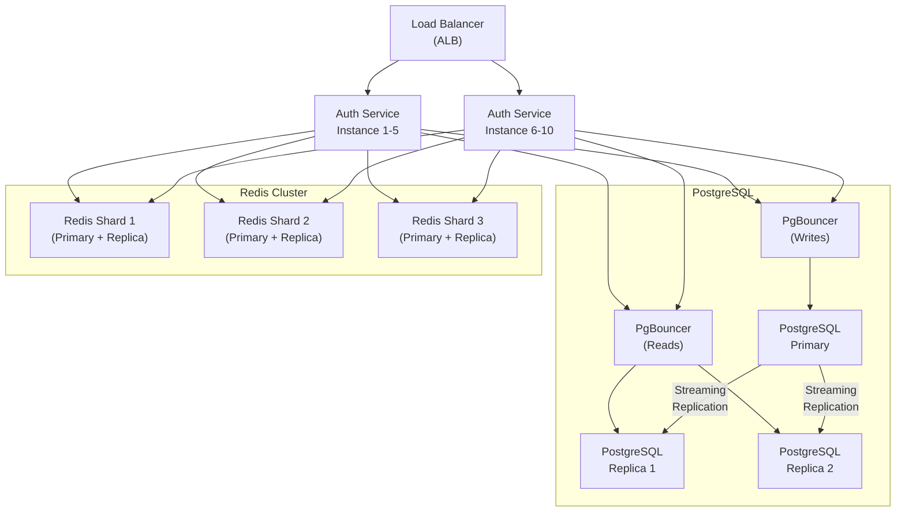
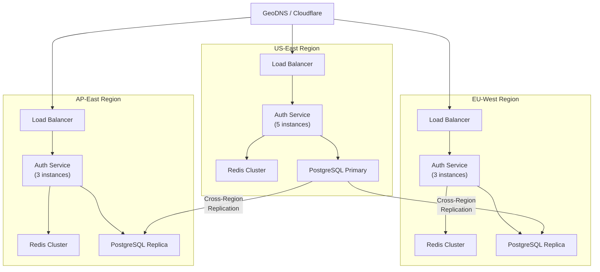
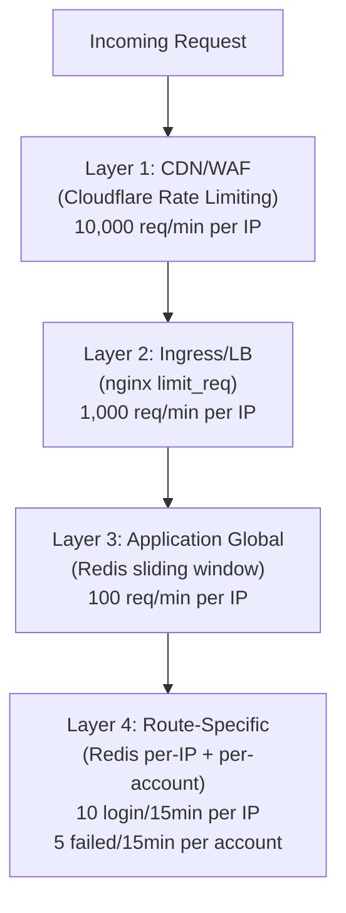

# Auth Service Scaling Plan

Authentication is one of the few services where every user interacts with it on every session. Unlike feature-specific endpoints that only a subset of users hit, the auth service processes traffic proportional to your entire user base, multiplied by their session frequency. A platform with 1 million monthly active users generates approximately 3-5 million token refresh requests per day, on top of login and registration traffic.

This page covers the scaling journey from a single-instance deployment to a globally distributed auth service serving tens of millions of users.

## Traffic Profile Analysis

### Request Pattern Breakdown

Auth traffic has a distinctive pattern that differs from typical application traffic:

| Operation | Read/Write | Frequency per User | Latency Target | CPU Cost | I/O Cost |
|---|---|---|---|---|---|
| Token validation | Read | 50-200/day | < 5ms | Very Low (JWT verify) | Low (Redis EXISTS) |
| Token refresh | Read + Write | 4-20/day | < 50ms | Low (JWT sign) | Medium (Redis GET/SET) |
| Login | Read + Write | 1-3/day | < 300ms | High (Argon2 verify) | Medium (PG query) |
| Registration | Write | Once | < 500ms | High (Argon2 hash) | Medium (PG insert) |
| Password reset | Write | Rare | < 500ms | High (Argon2 hash) | Medium (PG + email) |
| JWKS fetch | Read | Varies (cached) | < 10ms | None | None (in-memory) |

### Read/Write Ratio

```
Token validation:  ~85% of all requests (READ-ONLY, stateless)
Token refresh:     ~10% of all requests (READ + WRITE to Redis)
Login:             ~4%  of all requests (READ PG + WRITE Redis)
Everything else:   ~1%  of all requests
```

The auth service is overwhelmingly read-heavy for token validation. The key insight: token validation does not need to hit the auth service at all. By distributing the JWKS public key, any downstream service can validate tokens locally.

### Traffic Estimates by Scale

| User Scale | MAU | Daily Logins | Daily Refreshes | Peak RPS (Auth Service) | Peak RPS (Token Validation) |
|---|---|---|---|---|---|
| Startup | 10K | 5K | 20K | 5 | 50 |
| Growth | 100K | 50K | 200K | 50 | 500 |
| Scale | 1M | 500K | 2M | 500 | 5,000 |
| Large | 10M | 5M | 20M | 5,000 | 50,000 |

::: tip
Token validation should happen at the API gateway or within each service, not at the auth service. The JWKS endpoint provides the public key for local verification. This eliminates 85%+ of potential auth service traffic.
:::

## Scaling Phases

### Phase 1: Single Instance (0 - 50K MAU)

At this scale, a single auth service instance behind a load balancer with one PostgreSQL instance and one Redis instance handles all traffic comfortably.



**Configuration:**
- 1 auth service instance (2 vCPU, 2 GB RAM)
- PostgreSQL: db.r6g.large (2 vCPU, 16 GB RAM) or equivalent
- Redis: cache.r6g.large (2 vCPU, 13 GB RAM) or equivalent
- Connection pool: 20 connections to PostgreSQL

**Bottlenecks at this scale:** None. A single Node.js instance can handle 1,000+ RPS for typical auth operations.

### Phase 2: Multiple Instances with Connection Pooling (50K - 500K MAU)

As traffic grows, you need multiple auth service instances for redundancy and capacity. The primary challenge is PostgreSQL connection management — each Node.js instance opens a pool of connections, and PostgreSQL has a hard connection limit.



**Key changes:**
- 3 auth service instances
- PgBouncer for connection pooling
- PostgreSQL read replica for read queries (user lookups)
- Redis with 1 replica for failover

#### PgBouncer Configuration

```ini
; pgbouncer.ini

[databases]
auth_service = host=postgres-primary.auth-system port=5432 dbname=auth_service

[pgbouncer]
listen_port = 6432
listen_addr = 0.0.0.0

; Pool mode: transaction-level pooling (best for Node.js)
pool_mode = transaction

; Connection limits
max_client_conn = 200          ; Total client connections allowed
default_pool_size = 25         ; Connections per database-user pair
min_pool_size = 5              ; Keep at least 5 connections warm
reserve_pool_size = 5          ; Extra connections for burst
reserve_pool_timeout = 3       ; Seconds before using reserve pool

; Timeouts
server_connect_timeout = 5
server_idle_timeout = 300
client_idle_timeout = 300
query_timeout = 30
query_wait_timeout = 30

; Logging
log_connections = 0
log_disconnections = 0
log_pooler_errors = 1
stats_period = 60

; Security
auth_type = scram-sha-256
auth_file = /etc/pgbouncer/userlist.txt
```

**Why PgBouncer matters:**

Without PgBouncer, 3 service instances with 20 connections each = 60 PostgreSQL connections. At 10 instances = 200 connections. PostgreSQL performs poorly beyond ~200-300 connections due to per-connection memory overhead (~10 MB each) and process scheduling. PgBouncer maintains a small pool of actual PostgreSQL connections and multiplexes application connections through them.

### Phase 3: Read Replicas and Redis Cluster (500K - 5M MAU)

At this scale, read traffic starts to dominate. Login operations perform user lookups (reads), and these can be directed to read replicas. Write operations (registration, password changes) go to the primary.



#### Read/Write Splitting in Application Code

```typescript
// src/infrastructure/database/connection-manager.ts

import { Pool, PoolClient } from 'pg';

export class ConnectionManager {
  private readonly writePool: Pool;
  private readonly readPool: Pool;

  constructor(config: {
    write: { host: string; port: number; database: string; user: string; password: string };
    read: { host: string; port: number; database: string; user: string; password: string };
    poolSize: number;
  }) {
    this.writePool = new Pool({
      ...config.write,
      max: config.poolSize,
      idleTimeoutMillis: 30000,
      connectionTimeoutMillis: 5000,
    });

    this.readPool = new Pool({
      ...config.read,
      max: config.poolSize * 2, // More read capacity
      idleTimeoutMillis: 30000,
      connectionTimeoutMillis: 5000,
    });
  }

  async query<T>(sql: string, params?: unknown[], useReplica = false): Promise<T[]> {
    const pool = useReplica ? this.readPool : this.writePool;
    const result = await pool.query(sql, params);
    return result.rows as T[];
  }

  async transaction<T>(fn: (client: PoolClient) => Promise<T>): Promise<T> {
    const client = await this.writePool.connect();
    try {
      await client.query('BEGIN');
      const result = await fn(client);
      await client.query('COMMIT');
      return result;
    } catch (error) {
      await client.query('ROLLBACK');
      throw error;
    } finally {
      client.release();
    }
  }

  async healthCheck(): Promise<{ write: boolean; read: boolean }> {
    const [writeOk, readOk] = await Promise.allSettled([
      this.writePool.query('SELECT 1'),
      this.readPool.query('SELECT 1'),
    ]);
    return {
      write: writeOk.status === 'fulfilled',
      read: readOk.status === 'fulfilled',
    };
  }
}
```

#### Redis Cluster Configuration

```typescript
// src/infrastructure/cache/redis-cluster.ts

import { Cluster } from 'ioredis';

export function createRedisCluster(nodes: { host: string; port: number }[]): Cluster {
  return new Cluster(nodes, {
    // Cluster-specific settings
    clusterRetryStrategy: (times: number) => {
      if (times > 10) return null; // Stop retrying after 10 attempts
      return Math.min(times * 100, 3000);
    },
    enableReadyCheck: true,
    scaleReads: 'slave',  // Read from replicas when possible

    // Per-node settings
    redisOptions: {
      maxRetriesPerRequest: 3,
      connectTimeout: 5000,
      commandTimeout: 3000,
      password: process.env.REDIS_PASSWORD,
      tls: process.env.REDIS_TLS === 'true' ? {} : undefined,
    },

    // DNS-based discovery (for Kubernetes)
    dnsLookup: (address, callback) => callback(null, address),
    natMap: undefined,
  });
}

// Session operations using Redis Cluster
export class ClusteredSessionStore {
  constructor(private readonly redis: Cluster) {}

  async set(sessionId: string, data: string, ttlSeconds: number): Promise<void> {
    // Sessions for the same user should hash to the same shard
    // Use hash tags: {userId}:session:sessionId
    await this.redis.setex(`{session}:${sessionId}`, ttlSeconds, data);
  }

  async get(sessionId: string): Promise<string | null> {
    return this.redis.get(`{session}:${sessionId}`);
  }

  async delete(sessionId: string): Promise<void> {
    await this.redis.del(`{session}:${sessionId}`);
  }

  async exists(sessionId: string): Promise<boolean> {
    return (await this.redis.exists(`{session}:${sessionId}`)) === 1;
  }
}
```

### Phase 4: Global Distribution (5M+ MAU)

At global scale, latency becomes the primary concern. Users in Asia should not have their login requests routed to US-East. The solution is multi-region deployment with regional Redis instances and a globally replicated PostgreSQL.



**Write routing at global scale:**

Reads (login user lookup, session validation) can be served from any region using local replicas. Writes (registration, password change) must be routed to the primary region. Two strategies:

1. **Route all writes to the primary region** — Simple, but adds latency for non-primary regions (100-200ms cross-region).
2. **Use a multi-primary database** (CockroachDB, Spanner) — Complex, but eliminates cross-region writes.

For most auth services, strategy 1 is sufficient. Users register once and change passwords rarely. The extra 100ms is acceptable for these infrequent operations.

## Connection Pooling Deep Dive

### The Connection Exhaustion Problem

Each PostgreSQL connection consumes approximately 10 MB of memory and one process slot. The maximum practical connection count for a PostgreSQL instance is:

$$
\text{Max Connections} \approx \frac{\text{Available Memory (MB)} - \text{OS Reserved (MB)}}{\text{Per-Connection Memory (MB)}}
$$

For a 16 GB instance:

$$
\text{Max Connections} \approx \frac{16384 - 2048}{10} \approx 1434
$$

But performance degrades well before this limit due to process scheduling overhead. The practical sweet spot is 100-300 connections.

### Pooling Architecture

```
Application Layer:     [Node.js Pool: 20 conn] × 10 instances = 200 app connections
                                    ↓
Connection Pooler:     [PgBouncer: 200 client conn → 50 server conn]
                                    ↓
Database Layer:        [PostgreSQL: 50 active connections]
```

Without PgBouncer, the database handles 200 connections. With PgBouncer in `transaction` mode, the database handles only 50 connections — a 4x reduction — because connections are returned to the pool after each transaction completes.

### Pool Sizing Formula

The optimal pool size for each Node.js instance:

$$
\text{Pool Size} = \frac{\text{Target RPS} \times \text{Avg Query Duration (s)}}{\text{Number of Instances}}
$$

For 500 RPS with 5ms average query duration across 5 instances:

$$
\text{Pool Size} = \frac{500 \times 0.005}{5} = 0.5 \text{ connections}
$$

This seems unrealistically low, but it is correct — most queries complete in milliseconds, so connections are rapidly reused. In practice, set the minimum at 5-10 to handle burst traffic and long-running queries.

## Rate Limiting Architecture

### Multi-Layer Rate Limiting

Rate limiting for auth endpoints operates at four layers:



### Redis-Based Rate Limiter

```typescript
// src/infrastructure/rate-limit/sliding-window.ts

import { Redis } from 'ioredis';

interface RateLimitResult {
  allowed: boolean;
  limit: number;
  remaining: number;
  resetAt: number;     // Unix timestamp
  retryAfter?: number; // Seconds
}

export class SlidingWindowRateLimiter {
  constructor(private readonly redis: Redis) {}

  async check(
    key: string,
    limit: number,
    windowSeconds: number,
  ): Promise<RateLimitResult> {
    const now = Date.now();
    const windowStart = now - windowSeconds * 1000;
    const resetAt = Math.ceil((now + windowSeconds * 1000) / 1000);

    // Lua script for atomic sliding window check
    const luaScript = `
      local key = KEYS[1]
      local now = tonumber(ARGV[1])
      local window_start = tonumber(ARGV[2])
      local limit = tonumber(ARGV[3])
      local window_seconds = tonumber(ARGV[4])

      -- Remove entries outside the window
      redis.call('ZREMRANGEBYSCORE', key, '-inf', window_start)

      -- Count current entries
      local count = redis.call('ZCARD', key)

      if count < limit then
        -- Add this request
        redis.call('ZADD', key, now, now .. ':' .. math.random(1000000))
        redis.call('EXPIRE', key, window_seconds)
        return {1, limit - count - 1}  -- allowed, remaining
      else
        return {0, 0}  -- blocked, 0 remaining
      end
    `;

    const result = await this.redis.eval(
      luaScript,
      1,
      `ratelimit:${key}`,
      now,
      windowStart,
      limit,
      windowSeconds,
    ) as [number, number];

    const allowed = result[0] === 1;
    const remaining = result[1];

    return {
      allowed,
      limit,
      remaining,
      resetAt,
      retryAfter: allowed ? undefined : windowSeconds,
    };
  }
}

// Fastify plugin
export function rateLimitPlugin(redis: Redis) {
  const limiter = new SlidingWindowRateLimiter(redis);

  return async function rateLimit(
    request: any,
    reply: any,
    config: { max: number; timeWindow: string },
  ) {
    const windowSeconds = parseTimeWindow(config.timeWindow);
    const key = `${request.routerPath}:${request.ip}`;

    const result = await limiter.check(key, config.max, windowSeconds);

    // Set rate limit headers
    reply.header('X-RateLimit-Limit', result.limit);
    reply.header('X-RateLimit-Remaining', result.remaining);
    reply.header('X-RateLimit-Reset', result.resetAt);

    if (!result.allowed) {
      reply.header('Retry-After', result.retryAfter);
      reply.code(429).send({
        error: 'RATE_LIMIT_EXCEEDED',
        message: `Too many requests. Please try again after ${result.retryAfter} seconds.`,
        statusCode: 429,
        retryAfter: result.retryAfter,
      });
    }
  };
}

function parseTimeWindow(window: string): number {
  const match = window.match(/^(\d+)\s*(s|sec|m|min|h|hr)$/i);
  if (!match) throw new Error(`Invalid time window: ${window}`);
  const value = parseInt(match[1], 10);
  const unit = match[2].toLowerCase();
  switch (unit) {
    case 's': case 'sec': return value;
    case 'm': case 'min': return value * 60;
    case 'h': case 'hr': return value * 3600;
    default: return value;
  }
}
```

### Per-Account Brute Force Protection

```typescript
// src/infrastructure/rate-limit/brute-force.ts

import { Redis } from 'ioredis';

interface BruteForceResult {
  allowed: boolean;
  failedAttempts: number;
  maxAttempts: number;
  lockoutUntil?: Date;
  requireCaptcha: boolean;
}

export class BruteForceProtection {
  constructor(
    private readonly redis: Redis,
    private readonly config: {
      maxAttempts: number;          // 10
      lockoutDurationSeconds: number; // 1800 (30 min)
      captchaThreshold: number;     // 3
      windowSeconds: number;        // 900 (15 min)
    },
  ) {}

  async recordFailedAttempt(
    identifier: string,       // email or user ID
    ipAddress: string,
  ): Promise<BruteForceResult> {
    const accountKey = `brute:account:${identifier}`;
    const ipKey = `brute:ip:${ipAddress}`;

    // Increment counters atomically
    const pipeline = this.redis.pipeline();
    pipeline.incr(accountKey);
    pipeline.expire(accountKey, this.config.windowSeconds);
    pipeline.incr(ipKey);
    pipeline.expire(ipKey, this.config.windowSeconds);
    const results = await pipeline.exec();

    const accountAttempts = results![0][1] as number;
    const ipAttempts = results![2][1] as number;
    const failedAttempts = Math.max(accountAttempts, ipAttempts);

    // Check if account should be locked
    if (failedAttempts >= this.config.maxAttempts) {
      const lockUntil = new Date(Date.now() + this.config.lockoutDurationSeconds * 1000);
      await this.redis.setex(
        `brute:locked:${identifier}`,
        this.config.lockoutDurationSeconds,
        lockUntil.toISOString(),
      );
      return {
        allowed: false,
        failedAttempts,
        maxAttempts: this.config.maxAttempts,
        lockoutUntil: lockUntil,
        requireCaptcha: true,
      };
    }

    return {
      allowed: true,
      failedAttempts,
      maxAttempts: this.config.maxAttempts,
      requireCaptcha: failedAttempts >= this.config.captchaThreshold,
    };
  }

  async isLocked(identifier: string): Promise<{ locked: boolean; until?: Date }> {
    const lockData = await this.redis.get(`brute:locked:${identifier}`);
    if (!lockData) return { locked: false };
    return { locked: true, until: new Date(lockData) };
  }

  async resetAttempts(identifier: string): Promise<void> {
    await this.redis.del(`brute:account:${identifier}`);
    await this.redis.del(`brute:locked:${identifier}`);
  }
}
```

## DDoS Protection Strategy

### Layer 1: CDN/WAF (Cloudflare, AWS Shield)

- **Rate limiting**: 10,000 requests/min per IP (configurable per endpoint).
- **Bot detection**: JavaScript challenge for suspicious clients.
- **IP reputation**: Block known-bad IPs from threat intelligence feeds.
- **Geo-blocking**: Block regions with no legitimate users (if applicable).
- **Challenge page**: CAPTCHA for IPs that exceed soft limits.

### Layer 2: Application-Level Protections

| Attack Vector | Detection | Mitigation |
|---|---|---|
| Credential stuffing | High login failure rate from diverse IPs | CAPTCHA after 3 failures, progressive delays, breach DB check |
| Account enumeration | Timing differences in login responses | Constant-time responses, generic error messages |
| Token flooding | High refresh rate per user | Per-user refresh rate limit (30/min) |
| Registration spam | High registration volume | CAPTCHA, email verification, phone verification at scale |
| Password spray | Low failures per account, many accounts | Per-IP rate limiting, anomaly detection on aggregate failure rate |

### Anomaly Detection

```typescript
// src/infrastructure/security/anomaly-detector.ts

import { Redis } from 'ioredis';

export class AuthAnomalyDetector {
  constructor(private readonly redis: Redis) {}

  async checkLoginAnomaly(
    userId: string,
    ipAddress: string,
    userAgent: string,
  ): Promise<{
    anomalous: boolean;
    reasons: string[];
    riskScore: number;
  }> {
    const reasons: string[] = [];
    let riskScore = 0;

    // Check 1: New device
    const knownDevices = await this.redis.smembers(`known_devices:${userId}`);
    const deviceHash = this.hashDevice(userAgent);
    if (!knownDevices.includes(deviceHash)) {
      reasons.push('new_device');
      riskScore += 20;
    }

    // Check 2: New IP geolocation
    const knownGeos = await this.redis.smembers(`known_geos:${userId}`);
    const geo = await this.getGeoLocation(ipAddress);
    if (geo && !knownGeos.includes(geo.country)) {
      reasons.push('new_country');
      riskScore += 30;
    }

    // Check 3: Impossible travel
    const lastLogin = await this.redis.get(`last_login_geo:${userId}`);
    if (lastLogin && geo) {
      const last = JSON.parse(lastLogin);
      const distance = this.calculateDistance(last.lat, last.lon, geo.lat, geo.lon);
      const timeDiff = (Date.now() - last.timestamp) / 1000 / 3600; // hours
      const speedKmh = distance / timeDiff;

      if (speedKmh > 1000) { // Faster than commercial flight
        reasons.push('impossible_travel');
        riskScore += 50;
      }
    }

    // Check 4: Unusual time of day
    const hourOfDay = new Date().getUTCHours();
    const loginHours = await this.redis.get(`login_hours:${userId}`);
    if (loginHours) {
      const typicalHours = JSON.parse(loginHours) as number[];
      if (!typicalHours.includes(hourOfDay)) {
        reasons.push('unusual_time');
        riskScore += 10;
      }
    }

    // Check 5: Tor exit node or VPN
    const isTor = await this.redis.sismember('tor_exit_nodes', ipAddress);
    if (isTor) {
      reasons.push('tor_exit_node');
      riskScore += 40;
    }

    return {
      anomalous: riskScore >= 50,
      reasons,
      riskScore: Math.min(riskScore, 100),
    };
  }

  private hashDevice(userAgent: string): string {
    const crypto = require('crypto');
    return crypto.createHash('sha256').update(userAgent).digest('hex').substring(0, 16);
  }

  private async getGeoLocation(ip: string): Promise<{ country: string; lat: number; lon: number } | null> {
    // Use MaxMind GeoIP2 or similar service
    return null; // Placeholder
  }

  private calculateDistance(lat1: number, lon1: number, lat2: number, lon2: number): number {
    // Haversine formula - returns distance in km
    const R = 6371;
    const dLat = (lat2 - lat1) * Math.PI / 180;
    const dLon = (lon2 - lon1) * Math.PI / 180;
    const a = Math.sin(dLat / 2) * Math.sin(dLat / 2) +
              Math.cos(lat1 * Math.PI / 180) * Math.cos(lat2 * Math.PI / 180) *
              Math.sin(dLon / 2) * Math.sin(dLon / 2);
    return R * 2 * Math.atan2(Math.sqrt(a), Math.sqrt(1 - a));
  }
}
```

## Monitoring and Alerting

### Key Metrics

```typescript
// src/infrastructure/metrics/auth-metrics.ts

import { Counter, Histogram, Gauge, Registry } from 'prom-client';

export class AuthMetrics {
  private readonly registry: Registry;

  // Counters
  readonly loginAttempts: Counter;
  readonly loginSuccesses: Counter;
  readonly loginFailures: Counter;
  readonly registrations: Counter;
  readonly tokenRefreshes: Counter;
  readonly tokenRefreshFailures: Counter;
  readonly mfaChallenges: Counter;
  readonly mfaSuccesses: Counter;
  readonly mfaFailures: Counter;
  readonly accountLockouts: Counter;
  readonly passwordResets: Counter;

  // Histograms
  readonly loginLatency: Histogram;
  readonly registrationLatency: Histogram;
  readonly tokenRefreshLatency: Histogram;
  readonly passwordHashLatency: Histogram;
  readonly dbQueryLatency: Histogram;
  readonly redisLatency: Histogram;

  // Gauges
  readonly activeSessions: Gauge;
  readonly dbConnectionPoolSize: Gauge;
  readonly dbConnectionPoolUsed: Gauge;
  readonly redisConnectionPoolSize: Gauge;

  constructor() {
    this.registry = new Registry();

    this.loginAttempts = new Counter({
      name: 'auth_login_attempts_total',
      help: 'Total login attempts',
      labelNames: ['method', 'status'],
      registers: [this.registry],
    });

    this.loginSuccesses = new Counter({
      name: 'auth_login_successes_total',
      help: 'Successful logins',
      labelNames: ['method'],
      registers: [this.registry],
    });

    this.loginFailures = new Counter({
      name: 'auth_login_failures_total',
      help: 'Failed login attempts',
      labelNames: ['reason'],
      registers: [this.registry],
    });

    this.registrations = new Counter({
      name: 'auth_registrations_total',
      help: 'Total user registrations',
      labelNames: ['method'],
      registers: [this.registry],
    });

    this.tokenRefreshes = new Counter({
      name: 'auth_token_refreshes_total',
      help: 'Total token refreshes',
      registers: [this.registry],
    });

    this.tokenRefreshFailures = new Counter({
      name: 'auth_token_refresh_failures_total',
      help: 'Failed token refreshes',
      labelNames: ['reason'],
      registers: [this.registry],
    });

    this.mfaChallenges = new Counter({
      name: 'auth_mfa_challenges_total',
      help: 'MFA challenges issued',
      registers: [this.registry],
    });

    this.mfaSuccesses = new Counter({
      name: 'auth_mfa_successes_total',
      help: 'Successful MFA verifications',
      registers: [this.registry],
    });

    this.mfaFailures = new Counter({
      name: 'auth_mfa_failures_total',
      help: 'Failed MFA verifications',
      registers: [this.registry],
    });

    this.accountLockouts = new Counter({
      name: 'auth_account_lockouts_total',
      help: 'Account lockouts due to failed attempts',
      registers: [this.registry],
    });

    this.passwordResets = new Counter({
      name: 'auth_password_resets_total',
      help: 'Password reset completions',
      registers: [this.registry],
    });

    this.loginLatency = new Histogram({
      name: 'auth_login_duration_seconds',
      help: 'Login request duration in seconds',
      labelNames: ['status'],
      buckets: [0.05, 0.1, 0.2, 0.3, 0.5, 1, 2, 5],
      registers: [this.registry],
    });

    this.registrationLatency = new Histogram({
      name: 'auth_registration_duration_seconds',
      help: 'Registration request duration',
      buckets: [0.1, 0.2, 0.5, 1, 2, 5],
      registers: [this.registry],
    });

    this.tokenRefreshLatency = new Histogram({
      name: 'auth_token_refresh_duration_seconds',
      help: 'Token refresh duration',
      buckets: [0.005, 0.01, 0.025, 0.05, 0.1, 0.25],
      registers: [this.registry],
    });

    this.passwordHashLatency = new Histogram({
      name: 'auth_password_hash_duration_seconds',
      help: 'Argon2 password hashing duration',
      buckets: [0.1, 0.2, 0.3, 0.5, 1, 2],
      registers: [this.registry],
    });

    this.dbQueryLatency = new Histogram({
      name: 'auth_db_query_duration_seconds',
      help: 'Database query duration',
      labelNames: ['operation', 'table'],
      buckets: [0.001, 0.005, 0.01, 0.025, 0.05, 0.1, 0.5],
      registers: [this.registry],
    });

    this.redisLatency = new Histogram({
      name: 'auth_redis_duration_seconds',
      help: 'Redis operation duration',
      labelNames: ['operation'],
      buckets: [0.0005, 0.001, 0.005, 0.01, 0.025, 0.05],
      registers: [this.registry],
    });

    this.activeSessions = new Gauge({
      name: 'auth_active_sessions',
      help: 'Number of active sessions',
      registers: [this.registry],
    });

    this.dbConnectionPoolSize = new Gauge({
      name: 'auth_db_pool_size',
      help: 'Database connection pool size',
      registers: [this.registry],
    });

    this.dbConnectionPoolUsed = new Gauge({
      name: 'auth_db_pool_used',
      help: 'Database connections in use',
      registers: [this.registry],
    });

    this.redisConnectionPoolSize = new Gauge({
      name: 'auth_redis_pool_size',
      help: 'Redis connection pool size',
      registers: [this.registry],
    });
  }

  async getMetrics(): Promise<string> {
    return this.registry.metrics();
  }
}
```

### Alert Rules (Prometheus)

```yaml
# prometheus/auth-alerts.yaml

groups:
  - name: auth-service
    rules:
      # High error rate
      - alert: AuthHighErrorRate
        expr: |
          sum(rate(auth_login_failures_total[5m]))
          / sum(rate(auth_login_attempts_total[5m]))
          > 0.1
        for: 5m
        labels:
          severity: warning
        annotations:
          summary: "Auth service login failure rate above 10%"
          description: "{{ $value | humanizePercentage }} of login attempts are failing"

      # Credential stuffing detection
      - alert: AuthCredentialStuffing
        expr: |
          sum(rate(auth_login_failures_total{reason="invalid_credentials"}[5m])) > 50
        for: 2m
        labels:
          severity: critical
        annotations:
          summary: "Possible credential stuffing attack"
          description: "More than 50 failed login attempts per second"

      # Account lockout spike
      - alert: AuthLockoutSpike
        expr: |
          sum(rate(auth_account_lockouts_total[5m])) > 10
        for: 5m
        labels:
          severity: warning
        annotations:
          summary: "Unusual number of account lockouts"

      # Token refresh failure spike (might indicate stolen refresh tokens)
      - alert: AuthTokenReuseDetected
        expr: |
          sum(rate(auth_token_refresh_failures_total{reason="reuse_detected"}[5m])) > 1
        for: 1m
        labels:
          severity: critical
        annotations:
          summary: "Refresh token reuse detected — possible token theft"

      # High login latency
      - alert: AuthHighLoginLatency
        expr: |
          histogram_quantile(0.95, rate(auth_login_duration_seconds_bucket[5m])) > 1
        for: 5m
        labels:
          severity: warning
        annotations:
          summary: "Login p95 latency exceeds 1 second"

      # Database connection pool exhaustion
      - alert: AuthDbPoolExhaustion
        expr: |
          auth_db_pool_used / auth_db_pool_size > 0.9
        for: 5m
        labels:
          severity: critical
        annotations:
          summary: "Database connection pool 90% utilized"

      # Redis latency spike
      - alert: AuthRedisHighLatency
        expr: |
          histogram_quantile(0.95, rate(auth_redis_duration_seconds_bucket[5m])) > 0.01
        for: 5m
        labels:
          severity: warning
        annotations:
          summary: "Redis p95 latency exceeds 10ms"

      # Service unavailable
      - alert: AuthServiceDown
        expr: up{job="auth-service"} == 0
        for: 1m
        labels:
          severity: critical
        annotations:
          summary: "Auth service instance is down"
```

## Capacity Planning

### Resource Calculator

Use this table to estimate the infrastructure needed for your scale:

| MAU | Auth Service | PostgreSQL | Redis | PgBouncer | Est. Monthly Cost |
|---|---|---|---|---|---|
| 10K | 1x (1 vCPU, 1 GB) | 1x db.t3.medium | 1x cache.t3.medium | Not needed | $150 |
| 100K | 2x (2 vCPU, 2 GB) | 1x db.r6g.large | 1x cache.r6g.large | 1x (1 vCPU) | $500 |
| 500K | 3x (2 vCPU, 4 GB) | 1x db.r6g.xlarge + replica | 3-node cluster | 2x (2 vCPU) | $1,500 |
| 1M | 5x (2 vCPU, 4 GB) | 1x db.r6g.2xlarge + 2 replicas | 6-node cluster | 2x (2 vCPU) | $3,000 |
| 5M | 10x (4 vCPU, 8 GB) | 1x db.r6g.4xlarge + 3 replicas | 9-node cluster | 3x (4 vCPU) | $10,000 |
| 10M | 20x (4 vCPU, 8 GB) | Multi-region (3 regions) | Per-region clusters | Per-region | $30,000+ |

### Load Testing Benchmarks

Expected performance on a single auth service instance (2 vCPU, 4 GB RAM):

| Operation | Concurrency 1 | Concurrency 10 | Concurrency 50 | Concurrency 100 |
|---|---|---|---|---|
| Login (password verify) | 10 RPS | 80 RPS | 150 RPS | 180 RPS |
| Registration (password hash) | 8 RPS | 60 RPS | 120 RPS | 140 RPS |
| Token refresh | 500 RPS | 2,000 RPS | 3,500 RPS | 4,000 RPS |
| JWKS fetch | 5,000 RPS | 10,000 RPS | 15,000 RPS | 18,000 RPS |

Login and registration are intentionally slow because Argon2id hashing consumes 64 MB of memory and significant CPU per operation. This is the trade-off: password security vs. login throughput.

### Argon2 Tuning for Scale

At high scale, Argon2id's memory cost becomes a scaling bottleneck. Each concurrent login uses 64 MB of memory. With 100 concurrent logins, that is 6.4 GB of memory just for password hashing.

**Options:**
1. **Reduce memory cost** — Trade security for throughput (not recommended below 19 MB).
2. **Offload to dedicated workers** — Run password hashing on separate instances with more memory.
3. **Use worker threads** — Isolate Argon2 to worker threads so the event loop stays responsive.

```typescript
// Option 3: Worker thread for Argon2
// src/infrastructure/workers/argon2-worker.ts

import { Worker, isMainThread, parentPort, workerData } from 'worker_threads';
import argon2 from 'argon2';

if (!isMainThread) {
  // Worker thread
  const { operation, password, hash, options } = workerData;

  (async () => {
    try {
      if (operation === 'hash') {
        const result = await argon2.hash(password, options);
        parentPort!.postMessage({ success: true, result });
      } else if (operation === 'verify') {
        const result = await argon2.verify(hash, password);
        parentPort!.postMessage({ success: true, result });
      }
    } catch (error: any) {
      parentPort!.postMessage({ success: false, error: error.message });
    }
  })();
}

export function hashInWorker(password: string, options: any): Promise<string> {
  return new Promise((resolve, reject) => {
    const worker = new Worker(__filename, {
      workerData: { operation: 'hash', password, options },
    });
    worker.on('message', (msg) => {
      if (msg.success) resolve(msg.result);
      else reject(new Error(msg.error));
    });
    worker.on('error', reject);
  });
}
```

---

> *"Scaling an auth service is fundamentally about understanding that 99% of your traffic is token validation, and token validation should never hit the auth service. Build the JWKS endpoint, distribute the public key, and let every other service validate tokens locally."*
