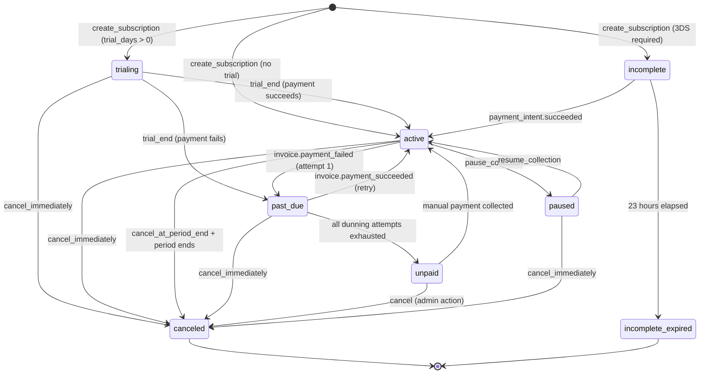
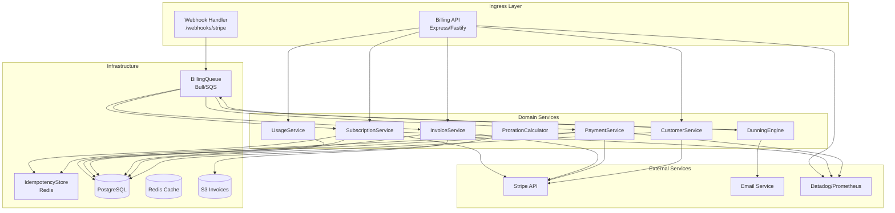
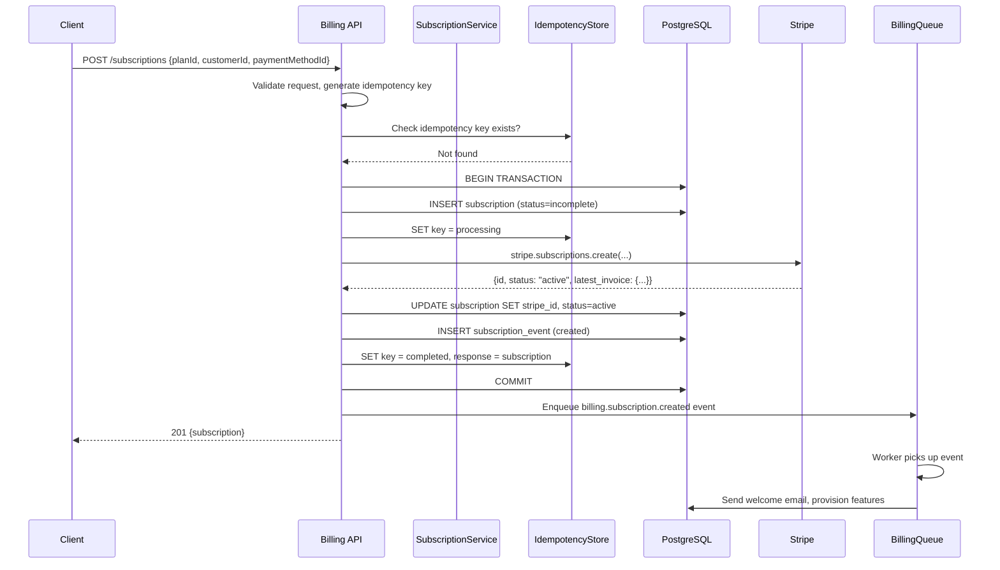
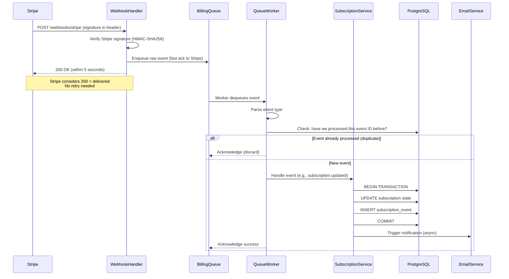
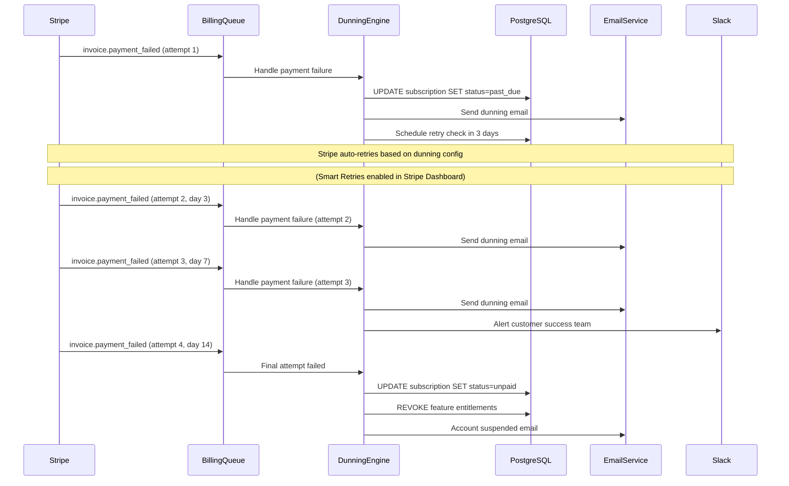

# Billing Engine: Architecture

## The Core Problem with Billing Architecture

Billing sits at the intersection of three systems with conflicting guarantees:

1. **Stripe** — authoritative for payment state, delivers webhooks at-least-once
2. **Your database** — authoritative for subscription/customer state, needs ACID transactions
3. **Your application** — authoritative for business rules, stateless and horizontally scaled

The architecture must reconcile these without double-charging or losing payments. The key insight: **Stripe is the ledger of record for money, your database is the ledger of record for entitlements**.

## Subscription State Machine

A subscription is a finite state machine. Every state transition must be:
- Atomic (all-or-nothing)
- Auditable (full history)
- Reversible (where business rules allow)



### State Transition Rules

| From | To | Trigger | Side Effects |
|------|-----|---------|--------------|
| trialing | active | `customer.subscription.trial_will_end` + payment | Grant full feature access |
| active | past_due | `invoice.payment_failed` | Downgrade access, send dunning email 1 |
| past_due | active | `invoice.payment_succeeded` | Restore full access, cancel dunning |
| past_due | unpaid | Max retry attempts | Suspend access, send final warning |
| unpaid | canceled | Admin action | Revoke access, mark churn |
| any | canceled | `customer.subscription.deleted` | Revoke access, cleanup |

## Service Architecture



## Database Schema

The schema is designed for correctness first. Every table has full audit history.

```sql
-- Customers mirror Stripe customers with local enrichment
CREATE TABLE customers (
    id              UUID PRIMARY KEY DEFAULT gen_random_uuid(),
    stripe_id       TEXT UNIQUE NOT NULL,
    email           TEXT NOT NULL,
    name            TEXT,
    metadata        JSONB DEFAULT '{}',
    tax_exempt      TEXT CHECK (tax_exempt IN ('none', 'exempt', 'reverse')),
    default_currency TEXT NOT NULL DEFAULT 'usd',
    created_at      TIMESTAMPTZ NOT NULL DEFAULT NOW(),
    updated_at      TIMESTAMPTZ NOT NULL DEFAULT NOW(),
    deleted_at      TIMESTAMPTZ  -- soft delete
);

-- Plans define pricing structures (immutable after first subscription)
CREATE TABLE plans (
    id              UUID PRIMARY KEY DEFAULT gen_random_uuid(),
    stripe_price_id TEXT UNIQUE,
    name            TEXT NOT NULL,
    description     TEXT,
    amount_cents    INTEGER,  -- NULL for usage-based
    currency        TEXT NOT NULL DEFAULT 'usd',
    interval        TEXT NOT NULL CHECK (interval IN ('month', 'year', 'week', 'day')),
    interval_count  INTEGER NOT NULL DEFAULT 1,
    pricing_model   TEXT NOT NULL CHECK (pricing_model IN ('flat', 'per_seat', 'usage', 'tiered_volume', 'tiered_graduated', 'hybrid')),
    trial_days      INTEGER NOT NULL DEFAULT 0,
    features        JSONB DEFAULT '{}',
    metadata        JSONB DEFAULT '{}',
    active          BOOLEAN NOT NULL DEFAULT TRUE,
    created_at      TIMESTAMPTZ NOT NULL DEFAULT NOW()
);

-- Subscriptions are the core entity
CREATE TABLE subscriptions (
    id                      UUID PRIMARY KEY DEFAULT gen_random_uuid(),
    stripe_subscription_id  TEXT UNIQUE,
    customer_id             UUID NOT NULL REFERENCES customers(id),
    plan_id                 UUID NOT NULL REFERENCES plans(id),
    status                  TEXT NOT NULL CHECK (status IN (
        'trialing', 'active', 'past_due', 'canceled',
        'unpaid', 'incomplete', 'incomplete_expired', 'paused'
    )),
    quantity                INTEGER NOT NULL DEFAULT 1,  -- seats for per-seat plans
    current_period_start    TIMESTAMPTZ NOT NULL,
    current_period_end      TIMESTAMPTZ NOT NULL,
    trial_start             TIMESTAMPTZ,
    trial_end               TIMESTAMPTZ,
    cancel_at               TIMESTAMPTZ,  -- scheduled cancellation
    canceled_at             TIMESTAMPTZ,  -- actual cancellation
    cancel_at_period_end    BOOLEAN NOT NULL DEFAULT FALSE,
    metadata                JSONB DEFAULT '{}',
    created_at              TIMESTAMPTZ NOT NULL DEFAULT NOW(),
    updated_at              TIMESTAMPTZ NOT NULL DEFAULT NOW()
);

-- Full audit log for subscription changes
CREATE TABLE subscription_events (
    id              UUID PRIMARY KEY DEFAULT gen_random_uuid(),
    subscription_id UUID NOT NULL REFERENCES subscriptions(id),
    event_type      TEXT NOT NULL,  -- 'created', 'upgraded', 'downgraded', 'canceled', etc.
    from_status     TEXT,
    to_status       TEXT,
    from_plan_id    UUID REFERENCES plans(id),
    to_plan_id      UUID REFERENCES plans(id),
    metadata        JSONB DEFAULT '{}',
    created_by      TEXT,  -- 'system', 'webhook', 'admin:user@example.com'
    idempotency_key TEXT,
    created_at      TIMESTAMPTZ NOT NULL DEFAULT NOW()
);

-- Invoices snapshot pricing at time of billing
CREATE TABLE invoices (
    id                  UUID PRIMARY KEY DEFAULT gen_random_uuid(),
    stripe_invoice_id   TEXT UNIQUE,
    customer_id         UUID NOT NULL REFERENCES customers(id),
    subscription_id     UUID REFERENCES subscriptions(id),
    status              TEXT NOT NULL CHECK (status IN (
        'draft', 'open', 'paid', 'void', 'uncollectible'
    )),
    amount_due_cents    INTEGER NOT NULL,
    amount_paid_cents   INTEGER NOT NULL DEFAULT 0,
    amount_remaining_cents INTEGER GENERATED ALWAYS AS (amount_due_cents - amount_paid_cents) STORED,
    currency            TEXT NOT NULL DEFAULT 'usd',
    period_start        TIMESTAMPTZ NOT NULL,
    period_end          TIMESTAMPTZ NOT NULL,
    due_date            TIMESTAMPTZ,
    paid_at             TIMESTAMPTZ,
    voided_at           TIMESTAMPTZ,
    pdf_url             TEXT,  -- S3 signed URL
    hosted_url          TEXT,  -- Stripe hosted invoice URL
    line_items          JSONB NOT NULL DEFAULT '[]',  -- snapshot of charges
    metadata            JSONB DEFAULT '{}',
    created_at          TIMESTAMPTZ NOT NULL DEFAULT NOW(),
    updated_at          TIMESTAMPTZ NOT NULL DEFAULT NOW()
);

-- Usage records for metered billing
CREATE TABLE usage_records (
    id              UUID PRIMARY KEY DEFAULT gen_random_uuid(),
    subscription_id UUID NOT NULL REFERENCES subscriptions(id),
    metric          TEXT NOT NULL,  -- 'api_calls', 'storage_gb', 'seats'
    quantity        BIGINT NOT NULL,
    timestamp       TIMESTAMPTZ NOT NULL DEFAULT NOW(),
    idempotency_key TEXT UNIQUE,  -- prevent duplicate reporting
    metadata        JSONB DEFAULT '{}',
    created_at      TIMESTAMPTZ NOT NULL DEFAULT NOW()
);

-- Idempotency keys for payment operations
CREATE TABLE idempotency_keys (
    key             TEXT PRIMARY KEY,
    operation       TEXT NOT NULL,
    request_hash    TEXT NOT NULL,
    response_body   JSONB,
    status          TEXT NOT NULL CHECK (status IN ('processing', 'completed', 'failed')),
    created_at      TIMESTAMPTZ NOT NULL DEFAULT NOW(),
    expires_at      TIMESTAMPTZ NOT NULL DEFAULT NOW() + INTERVAL '24 hours'
);

-- Indexes for common query patterns
CREATE INDEX idx_subscriptions_customer_id ON subscriptions(customer_id);
CREATE INDEX idx_subscriptions_status ON subscriptions(status) WHERE status != 'canceled';
CREATE INDEX idx_subscriptions_period_end ON subscriptions(current_period_end);
CREATE INDEX idx_invoices_customer_id ON invoices(customer_id);
CREATE INDEX idx_invoices_subscription_id ON invoices(subscription_id);
CREATE INDEX idx_invoices_status ON invoices(status) WHERE status IN ('open', 'draft');
CREATE INDEX idx_usage_records_subscription_metric ON usage_records(subscription_id, metric, timestamp);
```

## Event Flow: Subscription Creation



## Event Flow: Webhook Processing



## Event Flow: Failed Payment & Dunning



## TypeScript Service Interfaces

```typescript
// Core domain types
export type SubscriptionStatus =
  | 'trialing'
  | 'active'
  | 'past_due'
  | 'canceled'
  | 'unpaid'
  | 'incomplete'
  | 'incomplete_expired'
  | 'paused';

export type PricingModel =
  | 'flat'
  | 'per_seat'
  | 'usage'
  | 'tiered_volume'
  | 'tiered_graduated'
  | 'hybrid';

export interface Subscription {
  id: string;
  stripeSubscriptionId: string | null;
  customerId: string;
  planId: string;
  status: SubscriptionStatus;
  quantity: number;
  currentPeriodStart: Date;
  currentPeriodEnd: Date;
  trialStart: Date | null;
  trialEnd: Date | null;
  cancelAt: Date | null;
  canceledAt: Date | null;
  cancelAtPeriodEnd: boolean;
  metadata: Record<string, string>;
  createdAt: Date;
  updatedAt: Date;
}

export interface CreateSubscriptionInput {
  customerId: string;
  planId: string;
  paymentMethodId?: string;
  quantity?: number;
  trialDays?: number;
  couponId?: string;
  metadata?: Record<string, string>;
  idempotencyKey: string;
}

export interface SubscriptionService {
  create(input: CreateSubscriptionInput): Promise<Subscription>;
  update(id: string, input: UpdateSubscriptionInput): Promise<Subscription>;
  cancel(id: string, input: CancelSubscriptionInput): Promise<Subscription>;
  pause(id: string): Promise<Subscription>;
  resume(id: string): Promise<Subscription>;
  getById(id: string): Promise<Subscription | null>;
  getByCustomerId(customerId: string): Promise<Subscription[]>;
  syncFromStripe(stripeSubscriptionId: string): Promise<Subscription>;
}

export interface InvoiceService {
  getById(id: string): Promise<Invoice | null>;
  getBySubscriptionId(subscriptionId: string): Promise<Invoice[]>;
  generatePdf(invoiceId: string): Promise<string>; // Returns S3 URL
  void(invoiceId: string, reason: string): Promise<Invoice>;
  markUncollectible(invoiceId: string): Promise<Invoice>;
}

export interface UsageService {
  record(input: RecordUsageInput): Promise<void>;
  aggregate(
    subscriptionId: string,
    metric: string,
    from: Date,
    to: Date
  ): Promise<UsageAggregate>;
  getCurrentPeriodUsage(subscriptionId: string): Promise<UsageSummary>;
}
```

## Error Handling Philosophy

Billing errors are not all equal. Classify them:

```typescript
export class BillingError extends Error {
  constructor(
    message: string,
    public readonly code: BillingErrorCode,
    public readonly retryable: boolean,
    public readonly details?: Record<string, unknown>
  ) {
    super(message);
    this.name = 'BillingError';
  }
}

export enum BillingErrorCode {
  // Stripe errors (retryable)
  STRIPE_API_UNAVAILABLE = 'STRIPE_API_UNAVAILABLE',
  STRIPE_RATE_LIMITED = 'STRIPE_RATE_LIMITED',

  // Payment errors (NOT retryable without customer action)
  CARD_DECLINED = 'CARD_DECLINED',
  INSUFFICIENT_FUNDS = 'INSUFFICIENT_FUNDS',
  CARD_EXPIRED = 'CARD_EXPIRED',
  AUTHENTICATION_REQUIRED = 'AUTHENTICATION_REQUIRED',

  // Business logic errors (NOT retryable)
  SUBSCRIPTION_ALREADY_CANCELED = 'SUBSCRIPTION_ALREADY_CANCELED',
  PLAN_NOT_FOUND = 'PLAN_NOT_FOUND',
  CUSTOMER_NOT_FOUND = 'CUSTOMER_NOT_FOUND',
  DUPLICATE_OPERATION = 'DUPLICATE_OPERATION',

  // System errors (retryable)
  DATABASE_ERROR = 'DATABASE_ERROR',
  LOCK_TIMEOUT = 'LOCK_TIMEOUT',
}

// Map Stripe error codes to our domain errors
export function mapStripeError(error: Stripe.errors.StripeError): BillingError {
  const stripeCode = error.code;

  const cardDeclinedCodes = [
    'card_declined',
    'insufficient_funds',
    'lost_card',
    'stolen_card',
    'do_not_honor',
  ];

  if (cardDeclinedCodes.includes(stripeCode ?? '')) {
    return new BillingError(
      `Card declined: ${error.message}`,
      BillingErrorCode.CARD_DECLINED,
      false,  // Customer must update payment method
      { stripeCode, declineCode: error.decline_code }
    );
  }

  if (stripeCode === 'authentication_required') {
    return new BillingError(
      '3D Secure authentication required',
      BillingErrorCode.AUTHENTICATION_REQUIRED,
      false,
      { clientSecret: (error as any).payment_intent?.client_secret }
    );
  }

  if (error.statusCode === 429) {
    return new BillingError(
      'Stripe rate limited',
      BillingErrorCode.STRIPE_RATE_LIMITED,
      true,  // Retry after backoff
      { retryAfter: error.headers?.['retry-after'] }
    );
  }

  if ((error.statusCode ?? 0) >= 500) {
    return new BillingError(
      'Stripe API unavailable',
      BillingErrorCode.STRIPE_API_UNAVAILABLE,
      true,
      { statusCode: error.statusCode }
    );
  }

  return new BillingError(
    error.message,
    BillingErrorCode.STRIPE_API_UNAVAILABLE,
    false
  );
}
```

## Observability

Every billing operation emits structured metrics and traces:

```typescript
import { metrics, tracer } from './observability';

export class InstrumentedSubscriptionService implements SubscriptionService {
  constructor(private readonly inner: SubscriptionService) {}

  async create(input: CreateSubscriptionInput): Promise<Subscription> {
    const span = tracer.startSpan('billing.subscription.create');
    const timer = metrics.histogram('billing_operation_duration_ms', {
      operation: 'subscription.create',
    });

    try {
      span.setAttributes({
        'billing.customer_id': input.customerId,
        'billing.plan_id': input.planId,
        'billing.idempotency_key': input.idempotencyKey,
      });

      const result = await this.inner.create(input);

      metrics.increment('billing_subscriptions_created_total', {
        plan_id: input.planId,
        has_trial: String(!!input.trialDays),
      });

      return result;
    } catch (error) {
      metrics.increment('billing_errors_total', {
        operation: 'subscription.create',
        error_code: error instanceof BillingError ? error.code : 'UNKNOWN',
      });
      span.recordException(error as Error);
      throw error;
    } finally {
      timer.end();
      span.end();
    }
  }
}
```

## Configuration

```typescript
export interface BillingConfig {
  stripe: {
    secretKey: string;             // sk_live_... or sk_test_...
    webhookSecret: string;         // whsec_...
    apiVersion: Stripe.LatestApiVersion;
    maxRetries: number;            // Default: 3
    timeout: number;               // Default: 30000ms
  };
  idempotency: {
    ttlSeconds: number;            // Default: 86400 (24 hours)
    redisKeyPrefix: string;        // Default: 'billing:idempotency:'
  };
  dunning: {
    maxAttempts: number;           // Default: 4
    gracePeriodDays: number;       // Days before access revocation
    emailSchedule: number[];       // Days after failure to send emails
  };
  invoices: {
    s3Bucket: string;
    s3KeyPrefix: string;
    pdfExpiryDays: number;         // Signed URL expiry
  };
  queue: {
    concurrency: number;           // Worker concurrency
    maxJobRetries: number;
    jobTimeout: number;
  };
}
```

## Deployment Considerations

### Database Connection Pooling

Billing operations are I/O-bound. Use PgBouncer in transaction mode with:
- Pool size: `(CPU cores × 2) + effective_io_concurrency`
- Max client connections: 100 per billing service instance
- Transaction mode (not session mode — advisory locks don't work in transaction mode)

::: warning Advisory Locks and PgBouncer
If you use PostgreSQL advisory locks for distributed locking (e.g., `pg_advisory_xact_lock`), you MUST use PgBouncer in session mode or use a dedicated connection. Transaction mode PgBouncer releases the connection after each statement, which releases advisory locks.
:::

### Blue-Green Deployments

Billing services must support zero-downtime deploys:
1. Database migrations must be backward-compatible (never drop columns in the same deploy that removes code using them)
2. Queue workers must handle events from both old and new schema versions
3. Use feature flags for new pricing model rollouts

### Regional Considerations

If serving multiple regions with Stripe:
- Use separate Stripe accounts per region or Stripe Connect
- Store currency as an explicit column, never derive from locale
- Timestamp everything in UTC, convert to customer timezone only for display
