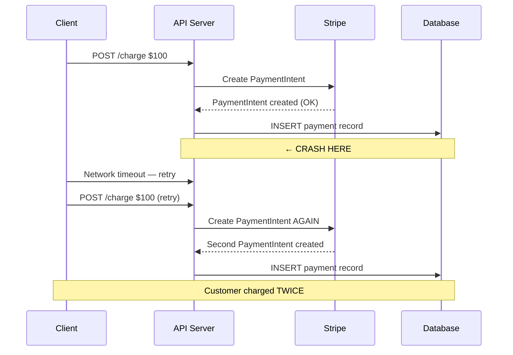

# Idempotency in Billing

## The Fundamental Problem

In distributed systems, operations can fail in ambiguous ways:
- Network timeout: did the server process the request before timing out?
- Client crash: did the server receive the request at all?
- Server restart: did the operation complete before the restart?

For most operations, "try again if uncertain" is acceptable. For billing, it is not. A retry can mean a double charge.

**Idempotency** is the property that applying an operation multiple times has the same effect as applying it once.

$$
f(f(x)) = f(x)
$$

## Why Billing Needs Idempotency



Without idempotency, every retry is a potential double charge.

## Idempotency Key Design

An idempotency key is a unique token that identifies a specific operation. Sending the same key twice must produce the same result.

### Key Structure

```typescript
// Deterministic key generation — same inputs = same key
export function generateIdempotencyKey(params: {
  operationType: string;
  customerId: string;
  subscriptionId?: string;
  planId?: string;
  requestId: string;         // From client or generated per API request
  periodStart?: string;      // For period-specific operations
}): string {
  const { operationType, customerId, subscriptionId, planId, requestId, periodStart } = params;

  const components = [
    operationType,
    customerId,
    subscriptionId ?? 'none',
    planId ?? 'none',
    periodStart ?? 'none',
    requestId,
  ];

  // SHA-256 hash for a fixed-length key
  const crypto = require('crypto');
  return crypto
    .createHash('sha256')
    .update(components.join(':'))
    .digest('hex');
}

// Examples:
// Operation: create subscription for customer cus_xxx, plan plan_yyy
// Key: sha256("subscription.create:cus_xxx:none:plan_yyy:none:req_zzz")
//
// Operation: charge for March 2026 billing period
// Key: sha256("invoice.create:cus_xxx:sub_aaa:plan_yyy:2026-03-01:req_bbb")
```

### Key Properties

| Property | Requirement |
|----------|------------|
| Uniqueness | Different operations must have different keys |
| Determinism | Same operation must always produce the same key |
| Unpredictability | Customers should not be able to guess valid keys |
| Bounded TTL | Keys expire after 24-48 hours |

## Implementation: Redis-Backed Idempotency

```typescript
import Redis from 'ioredis';
import { logger } from './logger';

export type IdempotencyStatus = 'processing' | 'completed' | 'failed';

export interface IdempotencyRecord<T = unknown> {
  key: string;
  status: IdempotencyStatus;
  result?: T;
  errorCode?: string;
  createdAt: number;     // Unix timestamp ms
  completedAt?: number;
}

export class RedisIdempotencyService {
  private readonly prefix: string;
  private readonly ttlSeconds: number;
  // Prefix: billing:idempotency:
  // TTL: 86400 seconds (24 hours)

  constructor(
    private readonly redis: Redis,
    options: { prefix?: string; ttlSeconds?: number } = {}
  ) {
    this.prefix = options.prefix ?? 'billing:idempotency:';
    this.ttlSeconds = options.ttlSeconds ?? 86400;
  }

  private key(idempotencyKey: string): string {
    return `${this.prefix}${idempotencyKey}`;
  }

  async get<T>(idempotencyKey: string): Promise<IdempotencyRecord<T> | null> {
    const raw = await this.redis.get(this.key(idempotencyKey));
    if (!raw) return null;

    try {
      return JSON.parse(raw) as IdempotencyRecord<T>;
    } catch {
      logger.error({ msg: 'Failed to parse idempotency record', idempotencyKey });
      return null;
    }
  }

  async setProcessing(idempotencyKey: string): Promise<boolean> {
    // NX = only set if not exists (atomic check-and-set)
    const record: IdempotencyRecord = {
      key: idempotencyKey,
      status: 'processing',
      createdAt: Date.now(),
    };

    const result = await this.redis.set(
      this.key(idempotencyKey),
      JSON.stringify(record),
      'EX',
      this.ttlSeconds,
      'NX'   // Only set if not exists
    );

    // Returns 'OK' if set, null if key already existed
    return result === 'OK';
  }

  async setCompleted<T>(idempotencyKey: string, result: T): Promise<void> {
    const existing = await this.get<T>(idempotencyKey);
    if (!existing) {
      logger.warn({ msg: 'setCompleted called for non-existent key', idempotencyKey });
    }

    const record: IdempotencyRecord<T> = {
      key: idempotencyKey,
      status: 'completed',
      result,
      createdAt: existing?.createdAt ?? Date.now(),
      completedAt: Date.now(),
    };

    await this.redis.set(
      this.key(idempotencyKey),
      JSON.stringify(record),
      'EX',
      this.ttlSeconds  // Reset TTL on completion
    );
  }

  async setFailed(idempotencyKey: string, errorCode: string): Promise<void> {
    const existing = await this.get(idempotencyKey);

    const record: IdempotencyRecord = {
      key: idempotencyKey,
      status: 'failed',
      errorCode,
      createdAt: existing?.createdAt ?? Date.now(),
      completedAt: Date.now(),
    };

    // Failed keys expire faster — allow retry with new key
    await this.redis.set(
      this.key(idempotencyKey),
      JSON.stringify(record),
      'EX',
      3600  // 1 hour TTL for failed operations
    );
  }

  async delete(idempotencyKey: string): Promise<void> {
    await this.redis.del(this.key(idempotencyKey));
  }
}
```

## The Idempotency Middleware Pattern

```typescript
export function idempotencyMiddleware(
  idempotencyService: RedisIdempotencyService
) {
  return async (
    req: express.Request,
    res: express.Response,
    next: express.NextFunction
  ): Promise<void> => {
    const idempotencyKey = req.headers['idempotency-key'] as string;

    // Only apply to mutating operations
    if (!idempotencyKey || req.method === 'GET') {
      next();
      return;
    }

    // Check for existing result
    const existing = await idempotencyService.get(idempotencyKey);

    if (existing?.status === 'completed') {
      // Return cached result
      res.setHeader('Idempotency-Replayed', 'true');
      res.status(200).json(existing.result);
      return;
    }

    if (existing?.status === 'processing') {
      // Another request is processing this key
      res.status(409).json({
        error: 'CONCURRENT_REQUEST',
        message: 'An identical request is currently being processed. Retry in a few seconds.',
      });
      return;
    }

    if (existing?.status === 'failed') {
      // Previous attempt failed — allow retry with same key
      // (remove the failed record and let it proceed)
      await idempotencyService.delete(idempotencyKey);
    }

    // Mark as processing before proceeding
    const acquired = await idempotencyService.setProcessing(idempotencyKey);

    if (!acquired) {
      // Race condition — another request got here first
      res.status(409).json({
        error: 'CONCURRENT_REQUEST',
        message: 'An identical request is currently being processed.',
      });
      return;
    }

    // Attach idempotency key to request for handlers to use
    (req as any).idempotencyKey = idempotencyKey;

    // Intercept the response to cache it
    const originalJson = res.json.bind(res);
    res.json = (body: unknown) => {
      if (res.statusCode >= 200 && res.statusCode < 300) {
        idempotencyService.setCompleted(idempotencyKey, body);
      } else {
        idempotencyService.setFailed(idempotencyKey, String(res.statusCode));
      }
      return originalJson(body);
    };

    next();
  };
}
```

## Database-Level Idempotency

For operations where Redis is unavailable or not sufficient, use PostgreSQL:

```typescript
// Postgres-backed idempotency for critical operations
export class PostgresIdempotencyService {
  constructor(private readonly db: Database) {}

  // Atomic "claim" using INSERT ... ON CONFLICT
  async claimOperation(params: {
    key: string;
    operation: string;
    requestHash: string;  // Hash of request params for validation
  }): Promise<{ claimed: boolean; existingResult?: unknown }> {
    try {
      await this.db.execute(
        `INSERT INTO idempotency_keys (key, operation, request_hash, status)
         VALUES ($1, $2, $3, 'processing')`,
        [params.key, params.operation, params.requestHash]
      );
      return { claimed: true };
    } catch (error) {
      // Check if this was a unique constraint violation
      if ((error as any).code === '23505') {
        // Key already exists — retrieve the result
        const existing = await this.db.queryOne<{
          status: string;
          response_body: unknown;
          request_hash: string;
        }>(
          `SELECT status, response_body, request_hash
           FROM idempotency_keys
           WHERE key = $1`,
          [params.key]
        );

        if (!existing) return { claimed: false };

        // Validate that the request matches the original
        if (existing.request_hash !== params.requestHash) {
          throw new Error(
            'Idempotency key reused with different request parameters'
          );
        }

        if (existing.status === 'completed') {
          return { claimed: false, existingResult: existing.response_body };
        }

        // Still processing — caller should retry
        return { claimed: false };
      }
      throw error;
    }
  }

  async complete(key: string, result: unknown): Promise<void> {
    await this.db.execute(
      `UPDATE idempotency_keys
       SET status = 'completed', response_body = $2
       WHERE key = $1`,
      [key, JSON.stringify(result)]
    );
  }

  async fail(key: string): Promise<void> {
    await this.db.execute(
      `UPDATE idempotency_keys SET status = 'failed' WHERE key = $1`,
      [key]
    );
  }
}
```

## Idempotency at the Stripe Level

Stripe has built-in idempotency key support. Always use it:

```typescript
// The idempotency key passed to Stripe prevents duplicate API operations
// even if your code crashes after the Stripe call but before the DB write

async function createSubscriptionWithRetry(params: CreateSubscriptionParams): Promise<Stripe.Subscription> {
  const stripeIdempotencyKey = `stripe-sub-${params.idempotencyKey}`;

  // If this call is retried (same idempotency key), Stripe returns the
  // same response as the original call — not a new subscription
  return stripe.subscriptions.create(
    {
      customer: params.stripeCustomerId,
      items: [{ price: params.stripePriceId }],
    },
    {
      idempotencyKey: stripeIdempotencyKey,
    }
  );
}
```

::: warning Stripe Idempotency Key Scope
Stripe idempotency keys are:
- Scoped to your API key (live/test)
- Valid for 24 hours
- Scoped to the endpoint — the same key used for `POST /customers` cannot be reused for `POST /subscriptions`

If the same key is sent with different parameters, Stripe returns a 400 error. Design your key generation to be parameter-sensitive.
:::

## The Saga Pattern for Multi-Step Operations

Subscription creation involves multiple steps. If any step fails, you must compensate:

```typescript
interface BillingOperationStep {
  name: string;
  execute: () => Promise<void>;
  compensate: () => Promise<void>;  // Undo function
}

export class BillingSaga {
  private readonly completedSteps: BillingOperationStep[] = [];

  async execute(steps: BillingOperationStep[]): Promise<void> {
    for (const step of steps) {
      try {
        await step.execute();
        this.completedSteps.push(step);
      } catch (error) {
        // Step failed — compensate all previous steps in reverse order
        await this.rollback();
        throw error;
      }
    }
  }

  private async rollback(): Promise<void> {
    // Compensate in reverse order
    const stepsToCompensate = [...this.completedSteps].reverse();

    for (const step of stepsToCompensate) {
      try {
        await step.compensate();
      } catch (compensationError) {
        // Log but continue — best-effort compensation
        logger.error({
          msg: 'Compensation failed',
          step: step.name,
          error: (compensationError as Error).message,
        });
      }
    }
  }
}

// Example: Create subscription saga
async function createSubscriptionSaga(params: CreateSubscriptionInput): Promise<Subscription> {
  let stripeCustomer: Stripe.Customer | null = null;
  let stripeSubscription: Stripe.Subscription | null = null;
  let localSubscription: Subscription | null = null;

  const saga = new BillingSaga();

  await saga.execute([
    {
      name: 'create-stripe-customer',
      execute: async () => {
        stripeCustomer = await stripeCustomerService.createCustomer({
          email: params.email,
          idempotencyKey: `${params.idempotencyKey}-customer`,
        });
      },
      compensate: async () => {
        if (stripeCustomer) {
          await stripe.customers.del(stripeCustomer.id);
        }
      },
    },
    {
      name: 'create-stripe-subscription',
      execute: async () => {
        stripeSubscription = await stripeSubscriptionService.createSubscription({
          stripeCustomerId: stripeCustomer!.id,
          stripePriceId: params.stripePriceId,
          idempotencyKey: `${params.idempotencyKey}-subscription`,
        });
      },
      compensate: async () => {
        if (stripeSubscription) {
          await stripe.subscriptions.cancel(stripeSubscription.id);
        }
      },
    },
    {
      name: 'create-local-subscription',
      execute: async () => {
        localSubscription = await subscriptionRepo.create({
          customerId: params.customerId,
          planId: params.planId,
          stripeSubscriptionId: stripeSubscription!.id,
          status: mapStripeSubscriptionStatus(stripeSubscription!.status),
        });
      },
      compensate: async () => {
        if (localSubscription) {
          await subscriptionRepo.softDelete(localSubscription.id);
        }
      },
    },
    {
      name: 'grant-feature-access',
      execute: async () => {
        await featureService.grantAccess(params.customerId, params.planId);
      },
      compensate: async () => {
        await featureService.revokeAccess(params.customerId, params.planId);
      },
    },
  ]);

  return localSubscription!;
}
```

## Mathematical Guarantees

The idempotency system provides these guarantees:

**Exactly-once processing guarantee:**

$$
P(\text{double charge} | \text{idempotency}) = P(\text{Redis miss} \cap \text{Stripe miss})
$$

$$
\approx P(\text{Redis failure}) \times P(\text{Stripe TTL expiry})
$$

$$
\approx 0.001 \times 0.0001 = 0.0000001
$$

That's approximately 1 in 10 million operations — acceptable for a billing system.

**Recovery time for a failed operation:**

If a billing operation fails after the Stripe call but before the DB write, the idempotency key is in `processing` state. The next retry:
1. Checks idempotency key → `processing` → treats as concurrent request
2. Returns 409 to client

After the TTL expires (1 hour for failed ops), the client can retry with the same key and it will succeed.

For critical billing, use a background reconciliation job:

```typescript
// Reconciliation job: find Stripe subscriptions without local records
async function reconcileWithStripe(): Promise<void> {
  const activeStripeSubscriptions = await stripe.subscriptions.list({
    status: 'active',
    limit: 100,
  });

  for (const stripeSub of activeStripeSubscriptions.data) {
    const localSub = await subscriptionRepo.getByStripeId(stripeSub.id);

    if (!localSub) {
      logger.error({
        msg: 'Stripe subscription without local record',
        stripeSubscriptionId: stripeSub.id,
        customerId: stripeSub.customer,
      });
      // Alert on-call, do not auto-create (needs manual review)
      await alerting.page('BILLING_RECONCILIATION_ERROR', {
        stripeSubscriptionId: stripeSub.id,
      });
    } else if (localSub.status !== mapStripeSubscriptionStatus(stripeSub.status)) {
      // Status drift — sync
      await subscriptionRepo.update(localSub.id, {
        status: mapStripeSubscriptionStatus(stripeSub.status),
      });
      logger.warn({
        msg: 'Subscription status drift corrected',
        subscriptionId: localSub.id,
        localStatus: localSub.status,
        stripeStatus: stripeSub.status,
      });
    }
  }
}
```

## Performance Characteristics

| Operation | Latency | Notes |
|-----------|---------|-------|
| Redis idempotency check | 0.5-2ms | In-memory, LAN round-trip |
| Redis SET NX | 0.5-2ms | Atomic, no locking overhead |
| Postgres idempotency INSERT | 2-10ms | Index lookup + INSERT |
| Full operation with idempotency | +2-5ms | Negligible overhead |

::: info War Story
We deployed a billing service with Redis-backed idempotency. One Friday, Redis failover took 15 seconds due to a misconfigured sentinel. During those 15 seconds, all idempotency checks returned errors, and we defaulted to "proceed without idempotency" to avoid blocking billing.

In 15 seconds, we processed about 300 billing operations that were retries in flight. 12 of them resulted in duplicate Stripe charges — customers were charged twice for their monthly subscription.

The fix was not "default to proceed." It was "default to reject." When the idempotency store is unavailable, return 503. The client retries later when the store is back. Yes, this means brief billing downtime — but that's better than double charges. We refunded $847 in duplicates and spent 3 days on customer support emails. The lesson: fail safe, not fail open.
:::
