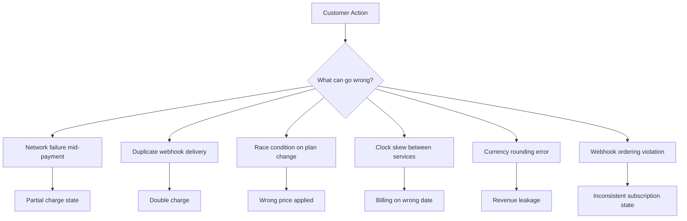
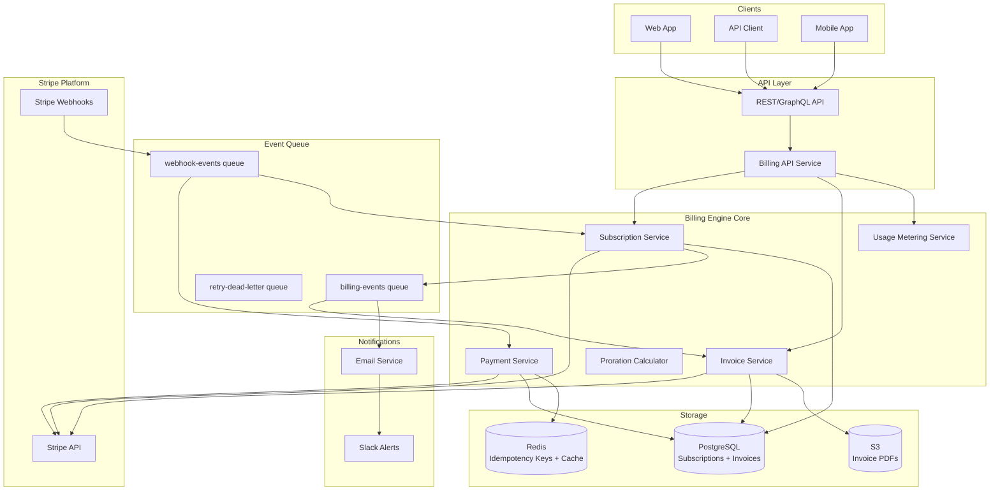

# Billing Engine: Overview

A billing engine is one of the most consequential systems in a SaaS product. Get it wrong and you lose revenue, anger customers, or face regulatory penalties. Get it right and it runs silently in the background, processing millions in payments without a single complaint.

This blueprint documents a production-grade billing engine built for a mid-size SaaS company processing $2M+ MRR across 15,000 subscriptions. Every architectural decision here was made after experiencing real production failures.

## Why Billing Engines Are Hard

Most engineers assume billing is just "call Stripe, store the result." That works until it doesn't.

**The fundamental tension:** Money requires exactness in an eventually-consistent distributed system.

Problems that destroy naive billing implementations:

- **Double charging**: A webhook fires twice because your endpoint returns 500. Stripe retries. Customer is charged twice.
- **Lost payments**: You process a payment but crash before persisting the result. Customer paid, but you have no record.
- **Race conditions**: A subscription upgrade fires simultaneously with a billing cycle. Which price applies?
- **Timezone bugs**: A monthly subscription started on January 31. When does it renew in February?
- **Currency precision**: `0.1 + 0.2 !== 0.3` in floating point. Use integer cents everywhere.
- **Proration miscalculations**: Mid-cycle plan changes that leave customers over- or under-charged.
- **Webhook ordering**: Stripe delivers `invoice.payment_succeeded` before `customer.subscription.updated`. Your handler assumes the wrong state.



## System Architecture

The billing engine follows an event-driven architecture with Stripe as the payment processor and your database as the source of truth for business state.



## Key Architectural Decisions

### Decision 1: Stripe-Managed vs. Custom Billing

**Options evaluated:**
1. Stripe Billing (subscriptions, invoices fully managed by Stripe)
2. Stripe Payments only (your own subscription state machine)
3. Hybrid (Stripe for payments, custom for subscription logic)

**Choice: Hybrid approach**

Stripe Billing handles subscription lifecycle well for simple cases but becomes a liability for:
- Complex proration rules (enterprise contracts)
- Usage-based billing with high cardinality (millions of events/day)
- Multi-currency with custom rounding rules
- Custom dunning logic tied to your CRM

We use Stripe for:
- Payment method storage (PCI compliance)
- Card charging and 3DS handling
- Basic subscription scheduling
- Invoice generation (PDF + hosted link)

We own:
- Subscription state machine
- Proration calculations
- Usage aggregation
- Dunning sequences
- Revenue recognition (ASC 606)

### Decision 2: Synchronous vs. Asynchronous Billing

**Choice: Asynchronous with synchronous confirmation**

The API immediately returns a `pending` state. A queue worker processes the actual Stripe API call. This prevents:
- Slow Stripe API responses blocking user-facing requests
- Timeout errors appearing as billing failures
- Database locks on subscription records during high traffic

For critical paths (initial checkout), we use a synchronous path with a tight timeout budget (3 seconds max), falling back to the async queue.

### Decision 3: Idempotency Strategy

**Choice: Client-generated idempotency keys stored in Redis with TTL**

Every billing operation generates a deterministic idempotency key based on:
- `operationType + subscriptionId + periodStart + requestId`

Keys are stored in Redis with 24-hour TTL. Before processing any billing operation:
1. Check Redis for existing key
2. If exists: return cached result (do not re-process)
3. If not exists: process, then store result

This handles Stripe webhook retries, network failures, and duplicate API calls without double-charging.

### Decision 4: Invoice Storage

**Choice: PostgreSQL as source of truth, S3 for PDFs**

All invoice data lives in PostgreSQL with a denormalized snapshot of pricing at time of invoice creation. This is critical — if you change your pricing later, old invoices must reflect the price at time of billing.

PDFs are generated asynchronously and stored in S3 with a signed URL returned to the customer. We regenerate PDFs if they expire rather than storing indefinitely.

## Pricing Models Supported

| Model | Description | Complexity |
|-------|-------------|------------|
| Flat Rate | Fixed monthly fee | Low |
| Per Seat | Price × active users | Medium |
| Usage-Based | Price × consumed units | High |
| Tiered (Volume) | Rate drops at volume thresholds | High |
| Tiered (Graduated) | Each tier applies to units in that range | High |
| Hybrid | Base fee + usage charges | Very High |

See [Subscription Models](./subscription-models.md) for complete implementation.

## Critical Numbers

These are real numbers from production that should inform your architecture:

| Metric | Value |
|--------|-------|
| Stripe API p99 latency | 800ms |
| Stripe API p50 latency | 120ms |
| Webhook delivery SLA | Within 30 seconds of event |
| Webhook retry intervals | 1h, 1h, 1h, 1h, 1h (5 attempts over 5 hours) |
| Maximum idempotency key TTL | 24 hours |
| Stripe rate limit (live mode) | 100 requests/second |
| Invoice PDF generation time | 200-500ms |
| Revenue recognition lag (acceptable) | < 1 hour |

## Module Map

```
billing-engine/
├── index.md                   ← You are here
├── architecture.md            ← Full service architecture + event flow
├── stripe-integration.md      ← Stripe SDK, API design, TypeScript types
├── subscription-models.md     ← Flat, per-seat, usage, tiered pricing
├── webhook-handling.md        ← Webhook processor, signature verification
└── idempotency.md             ← Exactly-once processing design
```

## Before You Build: Compliance Checklist

::: warning Legal Requirements
Billing systems touch financial data. Before shipping to production, verify:
:::

- [ ] **PCI DSS Scope**: Never store raw card numbers. Use Stripe.js/Elements to tokenize client-side.
- [ ] **VAT/GST Handling**: European customers require VAT on digital services. Stripe Tax handles this.
- [ ] **Invoice Requirements**: Many jurisdictions require invoice number sequences with no gaps.
- [ ] **Refund Policy**: Document your refund policy in your Terms of Service before enabling refunds.
- [ ] **Revenue Recognition**: Work with your accountant on ASC 606 / IFRS 15 compliance.
- [ ] **Data Retention**: Payment records often have 7-year legal retention requirements.
- [ ] **GDPR/CCPA**: Right to deletion is complicated when financial records can't be deleted.

::: info War Story
We launched billing in Europe without implementing VAT. Three months in, a German enterprise customer flagged that we hadn't been collecting VAT on their invoices. We had to issue corrected invoices for 90 days of billing, refund the difference to them, and pay the VAT liability ourselves since we couldn't retroactively collect from customers. Cost: ~$40k in surprise VAT payments and 2 weeks of engineering time on retroactive corrections. Implement tax handling before your first European customer.
:::

## Quick Start

For teams starting from scratch, the recommended implementation order:

1. **Week 1-2**: Stripe account setup, webhook endpoint, basic subscription create/cancel
2. **Week 3-4**: Idempotency layer, invoice storage schema, email notifications
3. **Week 5-6**: Usage metering, proration calculations, upgrade/downgrade flows
4. **Week 7-8**: Dunning, failed payment recovery, admin dashboard
5. **Week 9+**: Advanced features (tiered pricing, annual plans, multi-currency)

Start with the [Architecture](./architecture.md) page for full service design, then move to [Stripe Integration](./stripe-integration.md) for the TypeScript implementation.
