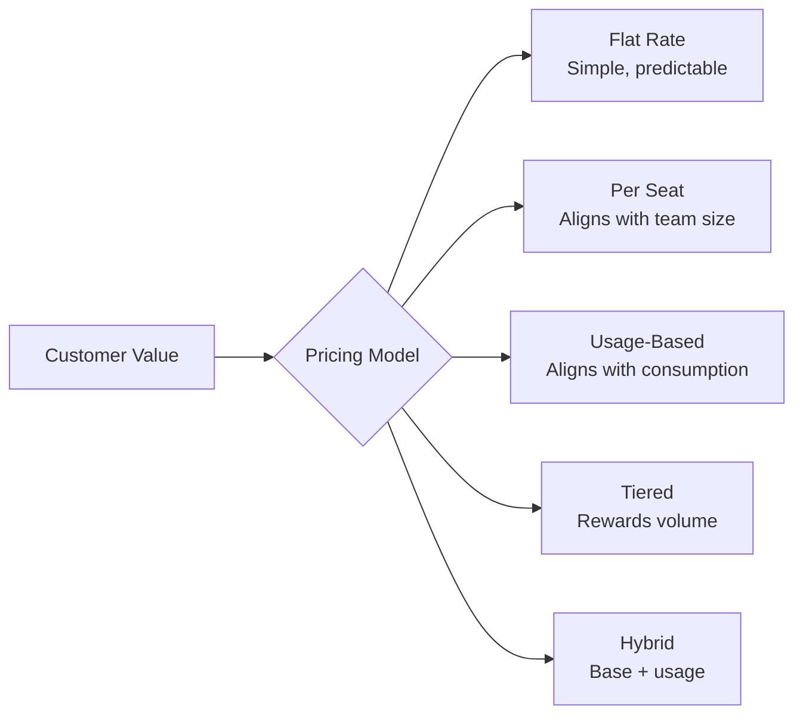

# Subscription Models

## Why Pricing Model Matters

Your pricing model is not just a billing concern — it's a growth lever. The right model aligns your revenue with customer value delivery. The wrong model creates friction, churn, or leaves money on the table.



## Mathematical Foundations

### Flat Rate

$$
\text{MRR} = N_{\text{customers}} \times P_{\text{flat}}
$$

### Per Seat

$$
\text{charge} = \text{seats} \times P_{\text{per\_seat}}
$$

For mid-cycle seat additions (proration):

$$
\text{proration} = P_{\text{per\_seat}} \times \text{seats\_added} \times \frac{D_{\text{remaining}}}{D_{\text{period}}}
$$

where $D_{\text{remaining}}$ is days left in billing period and $D_{\text{period}}$ is total days in period.

### Usage-Based (Tiered Volume)

In **volume pricing**, the price per unit drops for the entire order once you hit a threshold:

$$
\text{charge} = Q \times P_{\text{tier}}(Q)
$$

where $P_{\text{tier}}(Q)$ is the price for the tier containing $Q$.

### Graduated Pricing

In **graduated pricing**, each unit is priced at the rate for its specific tier:

$$
\text{charge} = \sum_{i=1}^{n} \min(Q, T_i^{\text{upper}}) - T_i^{\text{lower}} \times P_i
$$

### Annual Discount

$$
P_{\text{annual}} = P_{\text{monthly}} \times 12 \times (1 - d)
$$

Common discounts: 15-20% for annual commitment.

## Pricing Model Implementations

### 1. Flat Rate

The simplest model. Fixed price regardless of usage or seats.

```typescript
export interface FlatRatePlan {
  id: string;
  name: string;
  amountCents: number;
  currency: string;
  interval: 'month' | 'year';
  features: Record<string, boolean | number | string>;
}

export class FlatRateCalculator {
  calculateCharge(plan: FlatRatePlan): number {
    return plan.amountCents;
  }

  // Prorated charge for mid-cycle plan change
  calculateProration(params: {
    currentPlan: FlatRatePlan;
    newPlan: FlatRatePlan;
    changeDate: Date;
    periodStart: Date;
    periodEnd: Date;
  }): number {
    const totalDays = Math.ceil(
      (params.periodEnd.getTime() - params.periodStart.getTime()) /
      (1000 * 60 * 60 * 24)
    );
    const remainingDays = Math.ceil(
      (params.periodEnd.getTime() - params.changeDate.getTime()) /
      (1000 * 60 * 60 * 24)
    );

    // Credit for unused time on current plan
    const credit = Math.floor(
      (params.currentPlan.amountCents * remainingDays) / totalDays
    );

    // Charge for new plan for remaining time
    const charge = Math.floor(
      (params.newPlan.amountCents * remainingDays) / totalDays
    );

    return charge - credit;  // Can be negative (credit) or positive (charge)
  }
}
```

### 2. Per-Seat Pricing

Price scales with number of active users/seats. Common in B2B SaaS.

```typescript
export interface PerSeatPlan {
  id: string;
  name: string;
  pricePerSeatCents: number;
  currency: string;
  interval: 'month' | 'year';
  minSeats?: number;
  maxSeats?: number;
  includedSeats?: number;  // Free seats before billing starts
}

export class PerSeatCalculator {
  calculateCharge(plan: PerSeatPlan, seats: number): number {
    const billableSeats = plan.includedSeats
      ? Math.max(0, seats - plan.includedSeats)
      : seats;

    const effectiveSeats = plan.minSeats
      ? Math.max(billableSeats, plan.minSeats)
      : billableSeats;

    return effectiveSeats * plan.pricePerSeatCents;
  }

  // Calculate proration for adding/removing seats mid-period
  calculateSeatChangeProration(params: {
    plan: PerSeatPlan;
    seatsAdded: number;     // Positive = adding, negative = removing
    changeDate: Date;
    periodStart: Date;
    periodEnd: Date;
  }): number {
    const { plan, seatsAdded, changeDate, periodStart, periodEnd } = params;

    const totalPeriodMs = periodEnd.getTime() - periodStart.getTime();
    const remainingMs = periodEnd.getTime() - changeDate.getTime();

    const fraction = remainingMs / totalPeriodMs;

    // Prorate to nearest cent, round up for charges, round down for credits
    if (seatsAdded > 0) {
      return Math.ceil(
        plan.pricePerSeatCents * seatsAdded * fraction
      );
    } else {
      return Math.floor(
        plan.pricePerSeatCents * seatsAdded * fraction  // Will be negative
      );
    }
  }
}

// Seat management service
export class SeatManagementService {
  constructor(
    private readonly subscriptionRepo: SubscriptionRepository,
    private readonly stripeService: StripeSubscriptionService,
    private readonly calculator: PerSeatCalculator
  ) {}

  async addSeats(params: {
    subscriptionId: string;
    seatsToAdd: number;
    idempotencyKey: string;
  }): Promise<{ subscription: Subscription; prorationCents: number }> {
    const subscription = await this.subscriptionRepo.getById(params.subscriptionId);
    if (!subscription) throw new Error('Subscription not found');
    if (subscription.status !== 'active') {
      throw new Error(`Cannot add seats to ${subscription.status} subscription`);
    }

    const plan = await this.subscriptionRepo.getPlan(subscription.planId);
    const newQuantity = subscription.quantity + params.seatsToAdd;

    if (plan.maxSeats && newQuantity > plan.maxSeats) {
      throw new Error(
        `Cannot exceed maximum seats (${plan.maxSeats}). ` +
        `Contact sales for enterprise pricing.`
      );
    }

    // Calculate proration for display (Stripe will also calculate this)
    const prorationCents = this.calculator.calculateSeatChangeProration({
      plan,
      seatsAdded: params.seatsToAdd,
      changeDate: new Date(),
      periodStart: subscription.currentPeriodStart,
      periodEnd: subscription.currentPeriodEnd,
    });

    // Update Stripe subscription (Stripe handles the actual proration)
    await this.stripeService.updateSubscription({
      stripeSubscriptionId: subscription.stripeSubscriptionId!,
      quantity: newQuantity,
      prorationBehavior: 'always_invoice',  // Charge proration immediately
      idempotencyKey: params.idempotencyKey,
    });

    const updated = await this.subscriptionRepo.update(
      params.subscriptionId,
      { quantity: newQuantity }
    );

    return { subscription: updated, prorationCents };
  }
}
```

### 3. Usage-Based Billing

Price based on actual consumption. Requires usage tracking and metering.

```typescript
export interface UsageMetric {
  name: string;
  unit: string;
  stripeMeterEventName?: string;
}

export interface UsagePlan {
  id: string;
  name: string;
  metrics: UsageMetric[];
  pricingTiers: UsagePricingTier[];
  currency: string;
  interval: 'month' | 'year';
}

export interface UsagePricingTier {
  upTo: number | null;    // null = unlimited (last tier)
  unitAmountCents: number;
  flatFeeCents?: number;  // Fixed fee for this tier
}

export class UsageBasedCalculator {
  // Volume pricing: entire quantity billed at tier rate
  calculateVolumePrice(
    quantity: number,
    tiers: UsagePricingTier[]
  ): number {
    for (const tier of tiers) {
      if (tier.upTo === null || quantity <= tier.upTo) {
        const unitCharge = quantity * tier.unitAmountCents;
        const flatFee = tier.flatFeeCents ?? 0;
        return unitCharge + flatFee;
      }
    }
    // Should never reach here if tiers are configured correctly
    throw new Error('No matching pricing tier found');
  }

  // Graduated pricing: each range of units priced separately
  calculateGraduatedPrice(
    quantity: number,
    tiers: UsagePricingTier[]
  ): number {
    let totalCents = 0;
    let remainingQuantity = quantity;
    let previousTierUpper = 0;

    for (const tier of tiers) {
      if (remainingQuantity <= 0) break;

      const tierUpper = tier.upTo ?? Infinity;
      const tierCapacity = tier.upTo
        ? tier.upTo - previousTierUpper
        : remainingQuantity;

      const unitsInTier = Math.min(remainingQuantity, tierCapacity);
      totalCents += unitsInTier * tier.unitAmountCents;

      if (tier.flatFeeCents) {
        totalCents += tier.flatFeeCents;
      }

      remainingQuantity -= unitsInTier;
      previousTierUpper = tier.upTo ?? 0;
    }

    return totalCents;
  }
}

// Usage aggregation for billing period
export class UsageAggregationService {
  constructor(private readonly usageRepo: UsageRecordRepository) {}

  async aggregateForPeriod(params: {
    subscriptionId: string;
    metric: string;
    periodStart: Date;
    periodEnd: Date;
  }): Promise<number> {
    // Sum all usage records in the billing period
    const result = await this.usageRepo.sumByPeriod({
      subscriptionId: params.subscriptionId,
      metric: params.metric,
      from: params.periodStart,
      to: params.periodEnd,
    });

    return result ?? 0;
  }

  // Get daily breakdown for analytics
  async getDailyBreakdown(params: {
    subscriptionId: string;
    metric: string;
    periodStart: Date;
    periodEnd: Date;
  }): Promise<Array<{ date: Date; quantity: number }>> {
    return this.usageRepo.groupByDay(params);
  }
}
```

### 4. Tiered Volume Pricing

Common in API billing. Price per unit drops at volume thresholds.

```typescript
// Example: Starter 0-10k calls @ $0.001, Growth 10k-100k @ $0.0008, Scale 100k+ @ $0.0005
const API_PRICING_TIERS: UsagePricingTier[] = [
  { upTo: 10_000,    unitAmountCents: 0.1  },  // $0.001 per call
  { upTo: 100_000,   unitAmountCents: 0.08 },  // $0.0008 per call
  { upTo: 1_000_000, unitAmountCents: 0.05 },  // $0.0005 per call
  { upTo: null,      unitAmountCents: 0.02 },  // $0.0002 per call (enterprise)
];

// Test: 150,000 API calls, graduated pricing
function testGraduatedPricing(): void {
  const calculator = new UsageBasedCalculator();
  const quantity = 150_000;

  const price = calculator.calculateGraduatedPrice(quantity, API_PRICING_TIERS);

  // Expected:
  // First 10,000:  10,000 × 0.1  = 1,000 cents ($10.00)
  // Next 90,000:   90,000 × 0.08 = 7,200 cents ($72.00)
  // Next 50,000:   50,000 × 0.05 = 2,500 cents ($25.00)
  // Total: 10,700 cents ($107.00)
  console.assert(price === 10700, `Expected 10700, got ${price}`);
}
```

### 5. Hybrid Pricing (Base + Usage)

Combines a flat base fee with usage charges. Popular for "platform" models.

```typescript
export interface HybridPlan {
  id: string;
  name: string;
  baseFeeMonthly: number;        // Cents
  includedUnits: number;         // Free units included in base fee
  overagePerUnit: number;        // Cents per unit over included
  currency: string;
}

export class HybridPricingCalculator {
  calculateMonthlyCharge(params: {
    plan: HybridPlan;
    actualUsage: number;
  }): { baseFee: number; overageFee: number; total: number } {
    const { plan, actualUsage } = params;

    const overageUnits = Math.max(0, actualUsage - plan.includedUnits);
    const overageFee = overageUnits * plan.overagePerUnit;
    const total = plan.baseFeeMonthly + overageFee;

    return {
      baseFee: plan.baseFeeMonthly,
      overageFee,
      total,
    };
  }

  // Calculate the break-even vs. pure usage pricing
  calculateBreakEven(params: {
    hybridPlan: HybridPlan;
    pureUsagePricePerUnit: number;  // Cents
  }): number {
    // base_fee + (usage - included) * overage_rate = usage * pure_rate
    // base_fee - included * overage_rate = usage * pure_rate - usage * overage_rate
    // base_fee - included * overage_rate = usage * (pure_rate - overage_rate)
    // usage = (base_fee - included * overage_rate) / (pure_rate - overage_rate)

    const { hybridPlan, pureUsagePricePerUnit } = params;

    const numerator =
      hybridPlan.baseFeeMonthly -
      hybridPlan.includedUnits * hybridPlan.overagePerUnit;

    const denominator =
      pureUsagePricePerUnit - hybridPlan.overagePerUnit;

    if (denominator === 0) return Infinity;

    return Math.ceil(numerator / denominator);
  }
}
```

## Annual vs. Monthly Plans

```typescript
export interface PlanVariant {
  interval: 'month' | 'year';
  amountCents: number;
  stripePriceId: string;
}

export class AnnualPlanCalculator {
  // Calculate effective monthly rate for annual plan
  effectiveMonthlyRate(annualPlan: PlanVariant): number {
    return Math.floor(annualPlan.amountCents / 12);
  }

  // Calculate savings vs. monthly plan
  annualSavings(monthly: PlanVariant, annual: PlanVariant): {
    savingsCents: number;
    savingsPercent: number;
  } {
    const monthlyCostAnnualized = monthly.amountCents * 12;
    const savingsCents = monthlyCostAnnualized - annual.amountCents;
    const savingsPercent =
      (savingsCents / monthlyCostAnnualized) * 100;

    return {
      savingsCents,
      savingsPercent: Math.round(savingsPercent * 10) / 10,  // 1 decimal place
    };
  }

  // Handle annual plan upgrade mid-year
  calculateMidYearUpgradeProration(params: {
    currentPlanAnnualCents: number;
    newPlanAnnualCents: number;
    periodStart: Date;
    upgradeDate: Date;
    periodEnd: Date;
  }): number {
    const { currentPlanAnnualCents, newPlanAnnualCents, periodStart, upgradeDate, periodEnd } = params;

    const totalMs = periodEnd.getTime() - periodStart.getTime();
    const usedMs = upgradeDate.getTime() - periodStart.getTime();
    const remainingMs = periodEnd.getTime() - upgradeDate.getTime();

    const fractionUsed = usedMs / totalMs;
    const fractionRemaining = remainingMs / totalMs;

    // Credit for unused portion of current plan
    const credit = Math.floor(currentPlanAnnualCents * fractionRemaining);

    // Charge for new plan for remaining time
    const charge = Math.ceil(newPlanAnnualCents * fractionRemaining);

    return charge - credit;  // Amount to charge/credit customer
  }
}
```

## Plan Comparison Table

```typescript
export interface PlanComparisonFeature {
  name: string;
  plans: Record<string, string | boolean | number>;
}

// Example plan configuration
export const PLAN_FEATURES: PlanComparisonFeature[] = [
  {
    name: 'API calls/month',
    plans: {
      starter: '10,000',
      growth: '100,000',
      scale: '1,000,000',
      enterprise: 'Unlimited',
    },
  },
  {
    name: 'Seats',
    plans: {
      starter: 3,
      growth: 10,
      scale: 50,
      enterprise: 'Unlimited',
    },
  },
  {
    name: 'Custom domain',
    plans: {
      starter: false,
      growth: true,
      scale: true,
      enterprise: true,
    },
  },
  {
    name: 'SLA',
    plans: {
      starter: 'Best effort',
      growth: '99.9%',
      scale: '99.95%',
      enterprise: '99.99%',
    },
  },
];
```

## Dunning Logic for Failed Payments

```typescript
export interface DunningConfig {
  maxAttempts: number;
  attemptIntervalDays: number[];  // Days after first failure
  gracePeriodDays: number;        // Days before access revocation
}

export const DEFAULT_DUNNING_CONFIG: DunningConfig = {
  maxAttempts: 4,
  attemptIntervalDays: [0, 3, 7, 14],  // Day 0, 3, 7, 14
  gracePeriodDays: 7,
};

export class DunningEngine {
  constructor(
    private readonly config: DunningConfig,
    private readonly emailService: EmailService,
    private readonly subscriptionRepo: SubscriptionRepository
  ) {}

  async handlePaymentFailure(params: {
    subscriptionId: string;
    invoiceId: string;
    attemptNumber: number;  // 1-based
    declineCode?: string;
  }): Promise<void> {
    const { subscriptionId, invoiceId, attemptNumber } = params;
    const subscription = await this.subscriptionRepo.getById(subscriptionId);
    if (!subscription) return;

    if (attemptNumber === 1) {
      // First failure: update status, send initial email
      await this.subscriptionRepo.updateStatus(subscriptionId, 'past_due');
      await this.emailService.send({
        template: 'payment_failed_1',
        to: subscription.customerEmail,
        data: { invoiceId, declineCode: params.declineCode },
      });
    } else if (attemptNumber < this.config.maxAttempts) {
      // Intermediate failures: send escalating emails
      await this.emailService.send({
        template: `payment_failed_${attemptNumber}`,
        to: subscription.customerEmail,
        data: { invoiceId, daysUntilSuspension: this.config.gracePeriodDays },
      });
    } else {
      // Final failure: suspend access
      await this.subscriptionRepo.updateStatus(subscriptionId, 'unpaid');
      await this.subscriptionRepo.revokeFeatureAccess(subscriptionId);
      await this.emailService.send({
        template: 'account_suspended',
        to: subscription.customerEmail,
        data: { invoiceId },
      });
    }
  }
}
```

## Edge Cases in Subscription Models

### Timezone Edge Cases

::: danger February 31 Problem
A subscription starting on January 31 that renews monthly. February has 28 or 29 days. What happens?

Stripe anchors the billing date. If you bill on the 31st, Stripe bills on the last day of the month for months that don't have the 31st. This is correct behavior but can surprise customers.

Document this in your Terms of Service and handle it in your proration calculations.
:::

### Currency Precision

Different currencies have different minor unit scales:

| Currency | Minor Unit | Example |
|----------|-----------|---------|
| USD | 1/100 cent | 1000 = $10.00 |
| JPY | 1 yen (no minor unit) | 1000 = ¥1000 |
| KWD | 1/1000 fils | 1000 = 1.000 KWD |
| BHD | 1/1000 fils | 1000 = 1.000 BHD |

```typescript
export const CURRENCY_EXPONENTS: Record<string, number> = {
  usd: 2, eur: 2, gbp: 2, cad: 2, aud: 2,
  jpy: 0, krw: 0, clp: 0,
  kwd: 3, bhd: 3, omr: 3,
};

export function toCurrencyMinorUnits(
  amount: number,
  currency: string
): number {
  const exponent = CURRENCY_EXPONENTS[currency.toLowerCase()] ?? 2;
  return Math.round(amount * Math.pow(10, exponent));
}

export function fromCurrencyMinorUnits(
  amount: number,
  currency: string
): number {
  const exponent = CURRENCY_EXPONENTS[currency.toLowerCase()] ?? 2;
  return amount / Math.pow(10, exponent);
}
```

### Free Plan Edge Cases

Free plans still need subscription records for entitlement management:

```typescript
export function isFreePlan(plan: Plan): boolean {
  return plan.amountCents === 0 && plan.pricingModel === 'flat';
}

// Free plans don't need Stripe subscriptions
// but should still have subscription records in your DB
export async function createFreeSubscription(params: {
  customerId: string;
  planId: string;
}): Promise<Subscription> {
  return subscriptionRepo.create({
    customerId: params.customerId,
    planId: params.planId,
    stripeSubscriptionId: null,  // No Stripe subscription for free plans
    status: 'active',
    quantity: 1,
    currentPeriodStart: new Date(),
    currentPeriodEnd: addMonths(new Date(), 1),
  });
}
```

::: info War Story
We allowed free plan users without creating subscription records. When we launched a new feature that queried `subscriptions` to check feature access, free users got 403 errors on everything. Emergency fix at 2am: backfill 8,000 missing subscription records and restart the feature flag service.

Always create subscription records for every customer, even free tier. The subscription record is the source of truth for entitlements.
:::

## Performance Characteristics

| Operation | Latency | Notes |
|-----------|---------|-------|
| `calculateFlatRate` | < 0.01ms | Pure calculation |
| `calculateGraduatedPrice` | < 0.1ms | O(tiers) loop |
| `aggregateUsageForPeriod` | 10-500ms | Database aggregation query |
| `updateStripeQuantity` | 200-800ms | Stripe API call |
| `generateProrationPreview` | 300-1200ms | Stripe API call |

Precompute and cache usage aggregates for the current billing period. Recalculate only on new usage records, not on every API request.
