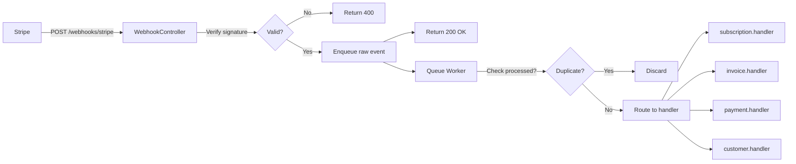

# Stripe Webhook Handling

## Why Webhooks Are Hard

Webhooks seem simple: receive HTTP POST, process event, return 200. In reality, they are one of the hardest parts of a billing system:

1. **At-least-once delivery**: Stripe retries failed webhooks up to 5 times over 5 hours. You must be idempotent.
2. **Out-of-order delivery**: `invoice.payment_succeeded` can arrive before `customer.subscription.updated`. Your handlers must not assume ordering.
3. **Backfill events**: Stripe can replay historical events. Handlers must handle events from the past.
4. **Concurrency**: Multiple webhook workers may receive the same event simultaneously.
5. **The 30-second rule**: Stripe marks your endpoint as failed if you don't return 2xx within 30 seconds. Heavy processing must be async.

## Stripe's Retry Policy

```
Delivery attempt | Delay after failure
----------------|--------------------
1               | Immediate
2               | 1 hour
3               | 1 hour
4               | 1 hour
5               | 1 hour
```

After 5 failed attempts, Stripe marks the webhook endpoint as "disabled" and stops sending to it. You must re-enable it in the Stripe Dashboard.

This is why your endpoint must:
1. **Ack immediately** (return 200 fast)
2. **Process asynchronously** (enqueue to a queue)
3. **Never lose events** (the queue must be durable)

## Architecture



## Webhook Endpoint

```typescript
import express from 'express';
import Stripe from 'stripe';
import { stripe } from './stripe-client';
import { BillingQueue } from './billing-queue';
import { logger } from './logger';
import { metrics } from './metrics';

const router = express.Router();

// CRITICAL: Must use raw body for signature verification
// Express body-parser must NOT parse this route as JSON
router.post(
  '/webhooks/stripe',
  express.raw({ type: 'application/json' }),  // Raw body middleware
  async (req, res) => {
    const signature = req.headers['stripe-signature'];

    if (!signature) {
      logger.warn('Stripe webhook missing signature header');
      return res.status(400).json({ error: 'Missing stripe-signature header' });
    }

    let event: Stripe.Event;

    try {
      event = stripe.webhooks.constructEvent(
        req.body,                              // Raw Buffer (NOT parsed JSON)
        signature,
        process.env.STRIPE_WEBHOOK_SECRET!
      );
    } catch (error) {
      const message = (error as Error).message;
      logger.warn(`Stripe webhook signature verification failed: ${message}`);
      metrics.increment('stripe_webhook_signature_failure_total');
      return res.status(400).json({ error: `Webhook signature invalid: ${message}` });
    }

    // Log receipt immediately
    logger.info({
      msg: 'Stripe webhook received',
      eventId: event.id,
      eventType: event.type,
      liveMode: event.livemode,
      apiVersion: event.api_version,
    });

    // Enqueue for async processing — respond to Stripe ASAP
    try {
      await BillingQueue.enqueue('stripe-webhook', {
        eventId: event.id,
        eventType: event.type,
        payload: event,
        receivedAt: new Date().toISOString(),
      });

      metrics.increment('stripe_webhook_received_total', {
        event_type: event.type,
      });
    } catch (queueError) {
      // If we can't enqueue, return 500 so Stripe will retry
      logger.error({
        msg: 'Failed to enqueue webhook event',
        eventId: event.id,
        error: (queueError as Error).message,
      });
      return res.status(500).json({ error: 'Failed to process webhook' });
    }

    // Return 200 immediately — processing happens async
    return res.status(200).json({ received: true, eventId: event.id });
  }
);

export { router as webhookRouter };
```

## Queue Worker

```typescript
import Stripe from 'stripe';
import { BillingQueue } from './billing-queue';
import { WebhookEventRepository } from './repositories/webhook-event-repository';
import { SubscriptionWebhookHandler } from './handlers/subscription-handler';
import { InvoiceWebhookHandler } from './handlers/invoice-handler';
import { CustomerWebhookHandler } from './handlers/customer-handler';
import { logger } from './logger';
import { metrics } from './metrics';

interface WebhookJobData {
  eventId: string;
  eventType: string;
  payload: Stripe.Event;
  receivedAt: string;
}

export class StripeWebhookWorker {
  constructor(
    private readonly webhookRepo: WebhookEventRepository,
    private readonly subscriptionHandler: SubscriptionWebhookHandler,
    private readonly invoiceHandler: InvoiceWebhookHandler,
    private readonly customerHandler: CustomerWebhookHandler
  ) {}

  async processJob(data: WebhookJobData): Promise<void> {
    const { eventId, eventType, payload } = data;
    const timer = metrics.startTimer('stripe_webhook_processing_duration_ms', {
      event_type: eventType,
    });

    try {
      // Check for duplicate processing (idempotency)
      const alreadyProcessed = await this.webhookRepo.hasBeenProcessed(eventId);
      if (alreadyProcessed) {
        logger.info({
          msg: 'Duplicate webhook event ignored',
          eventId,
          eventType,
        });
        metrics.increment('stripe_webhook_duplicate_total', { event_type: eventType });
        return;
      }

      // Mark as processing (distributed lock via DB row)
      await this.webhookRepo.markProcessing(eventId, eventType);

      // Route to appropriate handler
      await this.routeEvent(payload);

      // Mark as successfully processed
      await this.webhookRepo.markCompleted(eventId);

      metrics.increment('stripe_webhook_processed_total', { event_type: eventType });
    } catch (error) {
      const errorMessage = (error as Error).message;

      logger.error({
        msg: 'Webhook processing failed',
        eventId,
        eventType,
        error: errorMessage,
      });

      // Mark as failed — will be retried by queue
      await this.webhookRepo.markFailed(eventId, errorMessage);
      metrics.increment('stripe_webhook_failed_total', { event_type: eventType });

      throw error;  // Re-throw to trigger queue retry
    } finally {
      timer.end();
    }
  }

  private async routeEvent(event: Stripe.Event): Promise<void> {
    const { type } = event;

    if (type.startsWith('customer.subscription.')) {
      await this.subscriptionHandler.handle(event);
    } else if (type.startsWith('invoice.')) {
      await this.invoiceHandler.handle(event);
    } else if (type.startsWith('customer.') && !type.startsWith('customer.subscription.')) {
      await this.customerHandler.handle(event);
    } else if (type.startsWith('payment_intent.')) {
      await this.handlePaymentIntent(event);
    } else {
      logger.debug({ msg: 'Unhandled webhook event type', type });
    }
  }

  private async handlePaymentIntent(event: Stripe.Event): Promise<void> {
    // Handle payment intent events (3DS completion, etc.)
    const paymentIntent = event.data.object as Stripe.PaymentIntent;
    logger.info({
      msg: 'Payment intent event',
      type: event.type,
      paymentIntentId: paymentIntent.id,
      status: paymentIntent.status,
    });
  }
}
```

## Subscription Event Handler

```typescript
import Stripe from 'stripe';
import { SubscriptionRepository } from '../repositories/subscription-repository';
import { mapStripeSubscriptionStatus } from '../mappers/subscription-mapper';
import { EmailService } from '../email-service';
import { logger } from '../logger';

export class SubscriptionWebhookHandler {
  constructor(
    private readonly subscriptionRepo: SubscriptionRepository,
    private readonly emailService: EmailService
  ) {}

  async handle(event: Stripe.Event): Promise<void> {
    switch (event.type) {
      case 'customer.subscription.created':
        await this.handleCreated(event.data.object as Stripe.Subscription);
        break;
      case 'customer.subscription.updated':
        await this.handleUpdated(
          event.data.object as Stripe.Subscription,
          event.data.previous_attributes as Partial<Stripe.Subscription>
        );
        break;
      case 'customer.subscription.deleted':
        await this.handleDeleted(event.data.object as Stripe.Subscription);
        break;
      case 'customer.subscription.trial_will_end':
        await this.handleTrialWillEnd(event.data.object as Stripe.Subscription);
        break;
      case 'customer.subscription.paused':
        await this.handlePaused(event.data.object as Stripe.Subscription);
        break;
      case 'customer.subscription.resumed':
        await this.handleResumed(event.data.object as Stripe.Subscription);
        break;
      default:
        logger.warn({ msg: 'Unknown subscription event', type: event.type });
    }
  }

  private async handleCreated(stripeSubscription: Stripe.Subscription): Promise<void> {
    // Find our local subscription record (created before Stripe subscription)
    const existing = await this.subscriptionRepo.getByStripeId(
      stripeSubscription.id
    );

    if (existing) {
      // Update with confirmed Stripe data
      await this.subscriptionRepo.update(existing.id, {
        status: mapStripeSubscriptionStatus(stripeSubscription.status),
        currentPeriodStart: new Date(stripeSubscription.current_period_start * 1000),
        currentPeriodEnd: new Date(stripeSubscription.current_period_end * 1000),
        trialStart: stripeSubscription.trial_start
          ? new Date(stripeSubscription.trial_start * 1000)
          : null,
        trialEnd: stripeSubscription.trial_end
          ? new Date(stripeSubscription.trial_end * 1000)
          : null,
      });
    } else {
      // Subscription created directly in Stripe (e.g., via dashboard)
      // Create local record to stay in sync
      logger.warn({
        msg: 'Subscription created in Stripe without local record',
        stripeSubscriptionId: stripeSubscription.id,
      });
      // Handle this case based on your architecture
    }
  }

  private async handleUpdated(
    stripeSubscription: Stripe.Subscription,
    previousAttributes: Partial<Stripe.Subscription>
  ): Promise<void> {
    const subscription = await this.subscriptionRepo.getByStripeId(
      stripeSubscription.id
    );
    if (!subscription) {
      logger.error({
        msg: 'Received update for unknown subscription',
        stripeSubscriptionId: stripeSubscription.id,
      });
      return;
    }

    const newStatus = mapStripeSubscriptionStatus(stripeSubscription.status);
    const previousStatus = previousAttributes.status
      ? mapStripeSubscriptionStatus(previousAttributes.status)
      : subscription.status;

    await this.subscriptionRepo.update(subscription.id, {
      status: newStatus,
      quantity: stripeSubscription.items.data[0]?.quantity ?? 1,
      currentPeriodStart: new Date(stripeSubscription.current_period_start * 1000),
      currentPeriodEnd: new Date(stripeSubscription.current_period_end * 1000),
      cancelAtPeriodEnd: stripeSubscription.cancel_at_period_end,
      cancelAt: stripeSubscription.cancel_at
        ? new Date(stripeSubscription.cancel_at * 1000)
        : null,
    });

    // Log state transition
    await this.subscriptionRepo.addEvent({
      subscriptionId: subscription.id,
      eventType: 'updated',
      fromStatus: previousStatus,
      toStatus: newStatus,
      metadata: { stripeEventData: JSON.stringify(previousAttributes) },
      createdBy: 'webhook:stripe',
    });

    // Handle specific transitions
    if (previousStatus === 'past_due' && newStatus === 'active') {
      await this.emailService.send({
        template: 'payment_recovered',
        to: subscription.customerEmail,
        data: { subscriptionId: subscription.id },
      });
    }

    if (!previousAttributes.cancel_at_period_end && stripeSubscription.cancel_at_period_end) {
      await this.emailService.send({
        template: 'subscription_cancellation_scheduled',
        to: subscription.customerEmail,
        data: {
          cancelAt: new Date(stripeSubscription.current_period_end * 1000),
        },
      });
    }
  }

  private async handleDeleted(stripeSubscription: Stripe.Subscription): Promise<void> {
    const subscription = await this.subscriptionRepo.getByStripeId(
      stripeSubscription.id
    );
    if (!subscription) return;

    await this.subscriptionRepo.update(subscription.id, {
      status: 'canceled',
      canceledAt: new Date(),
    });

    // Revoke feature access
    await this.subscriptionRepo.revokeFeatureAccess(subscription.id);

    await this.emailService.send({
      template: 'subscription_canceled',
      to: subscription.customerEmail,
      data: {
        canceledAt: new Date(),
        reason: (stripeSubscription as any).cancellation_details?.reason,
      },
    });
  }

  private async handleTrialWillEnd(stripeSubscription: Stripe.Subscription): Promise<void> {
    const subscription = await this.subscriptionRepo.getByStripeId(
      stripeSubscription.id
    );
    if (!subscription) return;

    const trialEndDate = stripeSubscription.trial_end
      ? new Date(stripeSubscription.trial_end * 1000)
      : null;

    if (!trialEndDate) return;

    await this.emailService.send({
      template: 'trial_ending_soon',
      to: subscription.customerEmail,
      data: {
        trialEndDate,
        planName: subscription.planName,
        chargeAmount: subscription.planAmountCents,
      },
    });
  }

  private async handlePaused(stripeSubscription: Stripe.Subscription): Promise<void> {
    const subscription = await this.subscriptionRepo.getByStripeId(stripeSubscription.id);
    if (!subscription) return;

    await this.subscriptionRepo.update(subscription.id, { status: 'paused' });
  }

  private async handleResumed(stripeSubscription: Stripe.Subscription): Promise<void> {
    const subscription = await this.subscriptionRepo.getByStripeId(stripeSubscription.id);
    if (!subscription) return;

    await this.subscriptionRepo.update(subscription.id, { status: 'active' });
  }
}
```

## Invoice Event Handler

```typescript
export class InvoiceWebhookHandler {
  constructor(
    private readonly invoiceRepo: InvoiceRepository,
    private readonly subscriptionRepo: SubscriptionRepository,
    private readonly dunningEngine: DunningEngine,
    private readonly emailService: EmailService
  ) {}

  async handle(event: Stripe.Event): Promise<void> {
    switch (event.type) {
      case 'invoice.created':
        await this.handleCreated(event.data.object as Stripe.Invoice);
        break;
      case 'invoice.finalized':
        await this.handleFinalized(event.data.object as Stripe.Invoice);
        break;
      case 'invoice.payment_succeeded':
        await this.handlePaymentSucceeded(event.data.object as Stripe.Invoice);
        break;
      case 'invoice.payment_failed':
        await this.handlePaymentFailed(event.data.object as Stripe.Invoice);
        break;
      case 'invoice.payment_action_required':
        await this.handleActionRequired(event.data.object as Stripe.Invoice);
        break;
      case 'invoice.voided':
        await this.handleVoided(event.data.object as Stripe.Invoice);
        break;
      case 'invoice.marked_uncollectible':
        await this.handleUncollectible(event.data.object as Stripe.Invoice);
        break;
    }
  }

  private async handlePaymentSucceeded(stripeInvoice: Stripe.Invoice): Promise<void> {
    // Upsert invoice record
    await this.invoiceRepo.upsertFromStripe(stripeInvoice);

    if (stripeInvoice.subscription) {
      // Restore subscription to active if it was past_due
      const subscription = await this.subscriptionRepo.getByStripeId(
        stripeInvoice.subscription as string
      );

      if (subscription?.status === 'past_due') {
        await this.subscriptionRepo.update(subscription.id, {
          status: 'active',
        });
        await this.subscriptionRepo.restoreFeatureAccess(subscription.id);
      }
    }

    // Send receipt
    await this.emailService.send({
      template: 'payment_receipt',
      to: stripeInvoice.customer_email!,
      data: {
        invoiceId: stripeInvoice.id,
        amountPaid: stripeInvoice.amount_paid,
        currency: stripeInvoice.currency,
        invoicePdfUrl: stripeInvoice.invoice_pdf,
      },
    });
  }

  private async handlePaymentFailed(stripeInvoice: Stripe.Invoice): Promise<void> {
    await this.invoiceRepo.upsertFromStripe(stripeInvoice);

    if (!stripeInvoice.subscription) return;

    const subscription = await this.subscriptionRepo.getByStripeId(
      stripeInvoice.subscription as string
    );
    if (!subscription) return;

    const attemptNumber = stripeInvoice.attempt_count ?? 1;

    await this.dunningEngine.handlePaymentFailure({
      subscriptionId: subscription.id,
      invoiceId: stripeInvoice.id!,
      attemptNumber,
      declineCode: (stripeInvoice.payment_intent as Stripe.PaymentIntent)
        ?.last_payment_error?.decline_code ?? undefined,
    });
  }

  private async handleActionRequired(stripeInvoice: Stripe.Invoice): Promise<void> {
    // 3DS authentication required
    const paymentIntent = stripeInvoice.payment_intent as Stripe.PaymentIntent;
    if (!paymentIntent?.client_secret) return;

    await this.emailService.send({
      template: 'payment_action_required',
      to: stripeInvoice.customer_email!,
      data: {
        actionUrl: stripeInvoice.hosted_invoice_url,
        amount: stripeInvoice.amount_due,
        currency: stripeInvoice.currency,
      },
    });
  }

  private async handleVoided(stripeInvoice: Stripe.Invoice): Promise<void> {
    await this.invoiceRepo.updateStatus(stripeInvoice.id!, 'void');
  }

  private async handleUncollectible(stripeInvoice: Stripe.Invoice): Promise<void> {
    await this.invoiceRepo.updateStatus(stripeInvoice.id!, 'uncollectible');

    // Final write-off — this is a bad debt
    if (stripeInvoice.subscription) {
      const sub = await this.subscriptionRepo.getByStripeId(
        stripeInvoice.subscription as string
      );
      if (sub) {
        await this.subscriptionRepo.update(sub.id, { status: 'canceled' });
        await this.subscriptionRepo.revokeFeatureAccess(sub.id);
      }
    }
  }

  private async handleCreated(stripeInvoice: Stripe.Invoice): Promise<void> {
    // Sync draft invoice to DB
    await this.invoiceRepo.upsertFromStripe(stripeInvoice);
  }

  private async handleFinalized(stripeInvoice: Stripe.Invoice): Promise<void> {
    // Invoice finalized — update status and trigger PDF generation
    await this.invoiceRepo.updateStatus(stripeInvoice.id!, 'open');
  }
}
```

## Webhook Event Deduplication

```typescript
// Database schema for webhook deduplication
/*
CREATE TABLE webhook_events (
    stripe_event_id     TEXT PRIMARY KEY,
    event_type          TEXT NOT NULL,
    status              TEXT NOT NULL CHECK (status IN ('processing', 'completed', 'failed')),
    attempts            INTEGER NOT NULL DEFAULT 0,
    error_message       TEXT,
    processed_at        TIMESTAMPTZ,
    created_at          TIMESTAMPTZ NOT NULL DEFAULT NOW()
);

CREATE INDEX idx_webhook_events_created_at ON webhook_events(created_at);
*/

export class WebhookEventRepository {
  constructor(private readonly db: Database) {}

  async hasBeenProcessed(stripeEventId: string): Promise<boolean> {
    const result = await this.db.queryOne<{ status: string }>(
      `SELECT status FROM webhook_events WHERE stripe_event_id = $1`,
      [stripeEventId]
    );

    // If completed, it's a duplicate
    return result?.status === 'completed';
  }

  async markProcessing(stripeEventId: string, eventType: string): Promise<void> {
    // INSERT ... ON CONFLICT handles concurrent workers
    await this.db.execute(
      `INSERT INTO webhook_events (stripe_event_id, event_type, status, attempts)
       VALUES ($1, $2, 'processing', 1)
       ON CONFLICT (stripe_event_id) DO UPDATE
         SET status = 'processing',
             attempts = webhook_events.attempts + 1`,
      [stripeEventId, eventType]
    );
  }

  async markCompleted(stripeEventId: string): Promise<void> {
    await this.db.execute(
      `UPDATE webhook_events
       SET status = 'completed', processed_at = NOW()
       WHERE stripe_event_id = $1`,
      [stripeEventId]
    );
  }

  async markFailed(stripeEventId: string, errorMessage: string): Promise<void> {
    await this.db.execute(
      `UPDATE webhook_events
       SET status = 'failed', error_message = $2
       WHERE stripe_event_id = $1`,
      [stripeEventId, errorMessage]
    );
  }

  // Cleanup old events (run daily)
  async pruneOldEvents(olderThanDays: number = 30): Promise<number> {
    const result = await this.db.execute(
      `DELETE FROM webhook_events
       WHERE created_at < NOW() - INTERVAL '${olderThanDays} days'
         AND status = 'completed'`
    );
    return result.rowCount ?? 0;
  }
}
```

## Testing Webhooks Locally

Use Stripe CLI for local development:

```bash
# Install Stripe CLI
brew install stripe/stripe-cli/stripe

# Login
stripe login

# Forward webhooks to local server
stripe listen \
  --forward-to localhost:3000/webhooks/stripe \
  --events customer.subscription.created,invoice.payment_failed

# Trigger test events
stripe trigger customer.subscription.created
stripe trigger invoice.payment_failed
```

For integration tests, use Stripe's test fixtures:

```typescript
import Stripe from 'stripe';

// Build a fake Stripe event for testing
function buildFakeStripeEvent(
  type: string,
  object: Record<string, unknown>
): Stripe.Event {
  return {
    id: `evt_test_${Date.now()}`,
    object: 'event',
    api_version: '2024-06-20',
    created: Math.floor(Date.now() / 1000),
    type: type as Stripe.Event['type'],
    livemode: false,
    pending_webhooks: 1,
    request: null,
    data: {
      object: object as Stripe.Event.Data['object'],
    },
  };
}

// Test signature generation for webhook tests
function buildSignedWebhookBody(
  payload: string,
  secret: string,
  timestamp: number = Math.floor(Date.now() / 1000)
): { body: Buffer; signature: string } {
  const crypto = require('crypto');
  const signedPayload = `${timestamp}.${payload}`;
  const signature = crypto
    .createHmac('sha256', secret)
    .update(signedPayload)
    .digest('hex');

  return {
    body: Buffer.from(payload),
    signature: `t=${timestamp},v1=${signature}`,
  };
}
```

::: info War Story
We had a bug where our webhook handler assumed `invoice.payment_succeeded` always arrived after `customer.subscription.updated`. For 99% of events, this was true. For 1% — specifically when Stripe's delivery was under high load — they arrived in reverse order.

The bug: we checked the subscription status before updating it. When `payment_succeeded` arrived first with `past_due` status still in DB, we sent a "payment failed" email even though the payment had succeeded. Customer received contradictory emails.

The fix: handlers must be state-independent. Always apply the state from the event payload, never read-then-check from the database. The event's data IS the new state.
:::

## Monitoring and Alerting

```typescript
// Alert if webhook processing falls behind
export async function checkWebhookHealth(): Promise<HealthStatus> {
  const unprocessedCount = await db.queryOne<{ count: number }>(
    `SELECT COUNT(*) as count
     FROM webhook_events
     WHERE status = 'processing'
       AND created_at < NOW() - INTERVAL '5 minutes'`
  );

  const failedCount = await db.queryOne<{ count: number }>(
    `SELECT COUNT(*) as count
     FROM webhook_events
     WHERE status = 'failed'
       AND created_at > NOW() - INTERVAL '1 hour'`
  );

  const stuck = (unprocessedCount?.count ?? 0) > 10;
  const failing = (failedCount?.count ?? 0) > 5;

  return {
    healthy: !stuck && !failing,
    stuckEvents: unprocessedCount?.count ?? 0,
    recentFailures: failedCount?.count ?? 0,
  };
}
```
