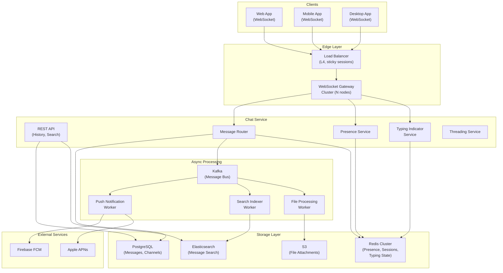
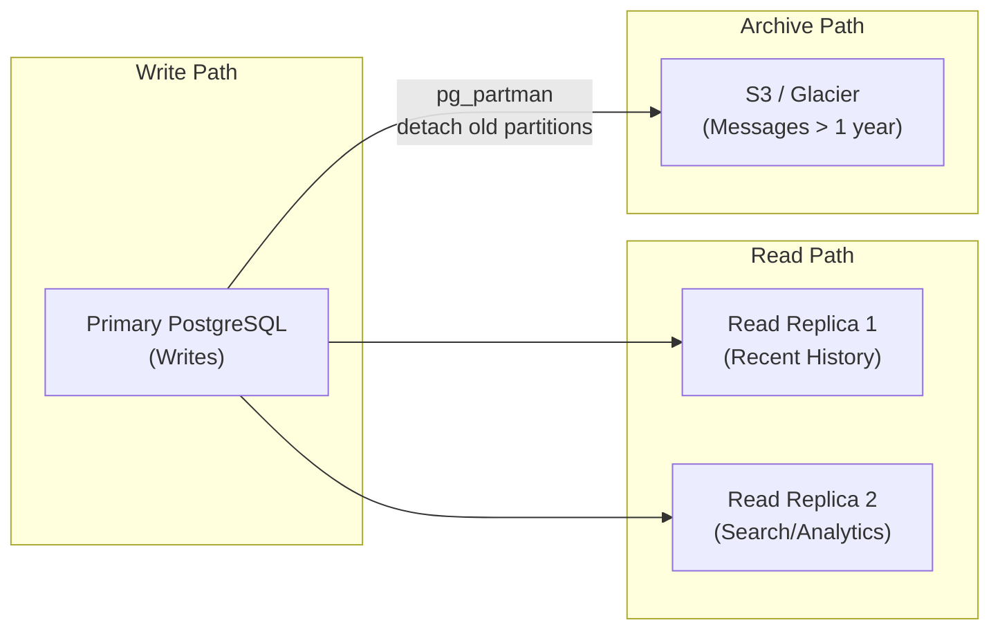
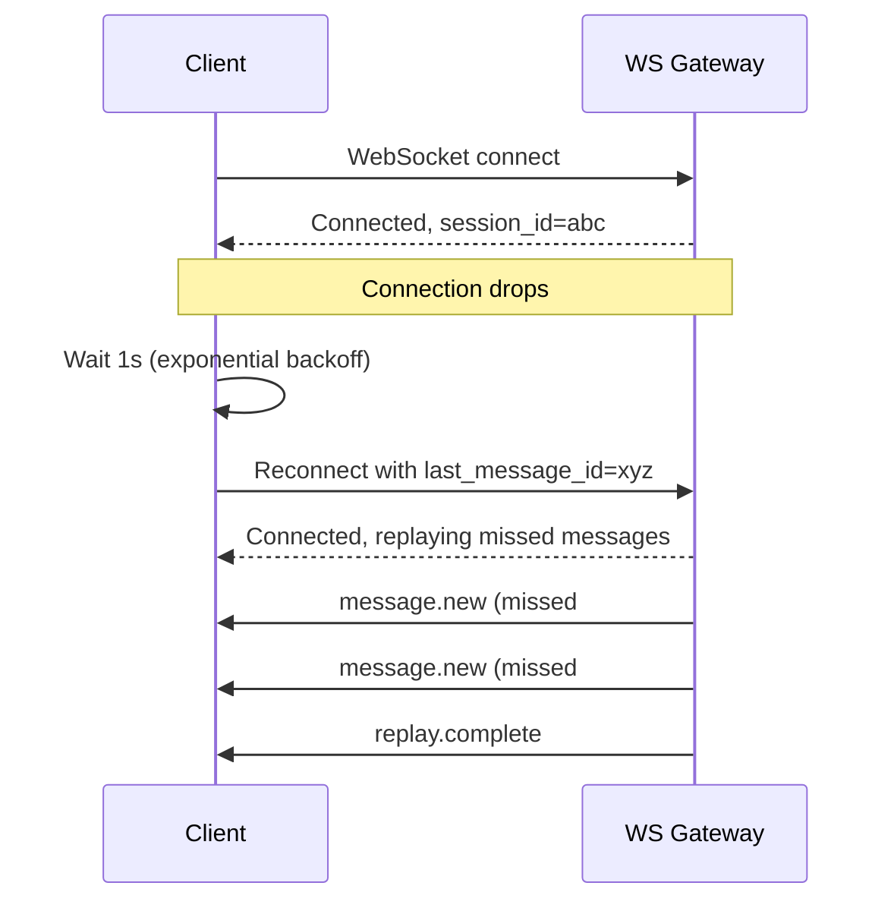

# Chat Service Blueprint

Real-time chat is one of the most technically demanding features a product can have. It combines the challenges of WebSocket connection management, message ordering, offline delivery, read receipts, typing indicators, group fan-out, and file uploads into a single system that users expect to feel instantaneous.

This blueprint covers a production-grade chat service handling 1:1 conversations, group chats, message threading, read receipts, typing indicators, file attachments, and offline message delivery. It draws on architecture patterns used by Slack, Discord, and WhatsApp.

## Overview & Requirements

### Functional Requirements

| Requirement | Description |
|---|---|
| 1:1 messaging | Direct messages between two users |
| Group chat | Conversations with up to 500 participants |
| Message persistence | Messages stored permanently, searchable |
| Read receipts | "Seen by" indicators per message |
| Typing indicators | Show when someone is typing |
| Threading | Reply to specific messages in a thread |
| File attachments | Images, documents, videos up to 100 MB |
| Reactions | Emoji reactions on messages |
| Message editing | Edit and delete with history |
| Offline delivery | Messages delivered when user reconnects |
| Push notifications | Notify users on mobile when app is backgrounded |

### Non-Functional Requirements

| Requirement | Target |
|---|---|
| Message delivery latency | < 100ms (same region) |
| Concurrent WebSocket connections | 500,000+ |
| Message throughput | 50,000 messages/second |
| Message storage | Indefinite (cold storage after 1 year) |
| Availability | 99.99% |
| Connection reliability | Automatic reconnection with message replay |

## Architecture Diagram



## Core Components Deep Dive

### WebSocket Gateway

The WebSocket Gateway manages long-lived connections. Each gateway node holds thousands of connections and must know which users are connected to which node for message routing.

```typescript
// ws-gateway.ts
class WebSocketGateway {
  private connections = new Map<string, WebSocket>(); // userId -> WebSocket
  private redisSubscriber: Redis;

  async handleConnection(ws: WebSocket, userId: string): Promise<void> {
    // Register connection
    this.connections.set(userId, ws);

    // Track which gateway node this user is on
    await this.redis.hset('user:connections', userId, this.nodeId);
    await this.redis.sadd(`node:${this.nodeId}:users`, userId);

    // Publish presence update
    await this.redis.publish('presence', JSON.stringify({
      userId, status: 'online', nodeId: this.nodeId,
    }));

    // Deliver any messages queued while user was offline
    await this.deliverPendingMessages(userId, ws);

    ws.on('message', (data) => this.handleMessage(userId, data));
    ws.on('close', () => this.handleDisconnect(userId));
    ws.on('pong', () => this.updateHeartbeat(userId));

    // Start heartbeat
    const heartbeat = setInterval(() => ws.ping(), 30_000);
    ws.on('close', () => clearInterval(heartbeat));
  }

  /**
   * Route a message to a user. If they are connected to this node,
   * send directly. If connected to another node, publish to Redis.
   * If offline, queue for later delivery.
   */
  async routeToUser(userId: string, payload: object): Promise<void> {
    const localWs = this.connections.get(userId);
    if (localWs && localWs.readyState === WebSocket.OPEN) {
      localWs.send(JSON.stringify(payload));
      return;
    }

    // Check if user is connected to another gateway node
    const targetNode = await this.redis.hget('user:connections', userId);
    if (targetNode) {
      await this.redis.publish(`node:${targetNode}:messages`, JSON.stringify({
        userId,
        payload,
      }));
      return;
    }

    // User is offline — queue the message
    await this.redis.lpush(`user:${userId}:pending`, JSON.stringify(payload));
    await this.redis.expire(`user:${userId}:pending`, 7 * 24 * 3600); // 7 days
  }

  private async deliverPendingMessages(userId: string, ws: WebSocket): Promise<void> {
    const pending = await this.redis.lrange(`user:${userId}:pending`, 0, -1);
    for (const msg of pending.reverse()) {
      ws.send(msg);
    }
    await this.redis.del(`user:${userId}:pending`);
  }

  private async handleDisconnect(userId: string): Promise<void> {
    this.connections.delete(userId);
    await this.redis.hdel('user:connections', userId);
    await this.redis.srem(`node:${this.nodeId}:users`, userId);
    await this.redis.publish('presence', JSON.stringify({
      userId, status: 'offline', nodeId: this.nodeId,
    }));
  }
}
```

::: warning Sticky Sessions and WebSocket Load Balancing
WebSocket connections are long-lived and stateful. You need L4 load balancing (TCP level, not HTTP level) so the load balancer does not terminate the WebSocket upgrade. Use source-IP hashing or connection-ID hashing for session affinity. See [L4 vs L7 Load Balancing](/system-design/load-balancing/l4-vs-l7) and [Session Affinity](/system-design/load-balancing/session-affinity) for details.
:::

### Message Router

The Message Router handles the core send-message flow: validate, persist, fan out, and acknowledge.

```typescript
// message-router.ts
class MessageRouter {
  async sendMessage(senderId: string, request: SendMessageRequest): Promise<Message> {
    // 1. Validate sender is a member of the channel
    const membership = await this.db.query(
      'SELECT role FROM channel_members WHERE channel_id = $1 AND user_id = $2',
      [request.channelId, senderId],
    );
    if (!membership.rows.length) throw new ForbiddenError('Not a channel member');

    // 2. Generate message with server timestamp and ordering ID
    const message: Message = {
      id: uuidv7(),          // Time-ordered UUID for natural sort
      channelId: request.channelId,
      senderId,
      content: this.sanitize(request.content),
      type: request.type ?? 'text',
      threadId: request.threadId ?? null,
      attachments: request.attachments ?? [],
      createdAt: new Date(),
      editedAt: null,
      reactions: {},
    };

    // 3. Persist to PostgreSQL
    await this.db.query(
      `INSERT INTO messages (id, channel_id, sender_id, content, type, thread_id, attachments, created_at)
       VALUES ($1, $2, $3, $4, $5, $6, $7, $8)`,
      [message.id, message.channelId, message.senderId, message.content,
       message.type, message.threadId, JSON.stringify(message.attachments), message.createdAt],
    );

    // 4. Publish to Kafka for async processing (push notifications, search indexing)
    await this.kafka.produce('chat.messages', {
      key: message.channelId,
      value: JSON.stringify(message),
    });

    // 5. Fan out to all online channel members
    const members = await this.getChannelMembers(request.channelId);
    for (const memberId of members) {
      if (memberId === senderId) continue;
      await this.gateway.routeToUser(memberId, {
        type: 'message.new',
        data: message,
      });
    }

    // 6. Update channel's last_message metadata
    await this.redis.hset(`channel:${request.channelId}`, {
      lastMessageId: message.id,
      lastMessageAt: message.createdAt.toISOString(),
      lastMessagePreview: message.content.substring(0, 100),
    });

    return message;
  }
}
```

### Typing Indicators

Typing indicators need to be fast and cheap. They are ephemeral — a typing event is irrelevant after 5 seconds. Never persist typing state to a database.

```typescript
// typing-indicator.ts
class TypingIndicatorService {
  /**
   * User started typing. Broadcast to channel, debounce to prevent spam.
   * Typing state auto-expires after 5 seconds.
   */
  async handleTyping(userId: string, channelId: string): Promise<void> {
    const key = `typing:${channelId}:${userId}`;

    // Debounce: ignore if we published within the last 2 seconds
    const exists = await this.redis.exists(key);
    if (exists) return;

    // Set typing state with 5-second expiry
    await this.redis.setex(key, 5, '1');

    // Broadcast to channel members (except sender)
    const members = await this.getOnlineChannelMembers(channelId);
    for (const memberId of members) {
      if (memberId === userId) continue;
      await this.gateway.routeToUser(memberId, {
        type: 'typing.start',
        data: { channelId, userId },
      });
    }
  }

  async handleStopTyping(userId: string, channelId: string): Promise<void> {
    await this.redis.del(`typing:${channelId}:${userId}`);

    const members = await this.getOnlineChannelMembers(channelId);
    for (const memberId of members) {
      if (memberId === userId) continue;
      await this.gateway.routeToUser(memberId, {
        type: 'typing.stop',
        data: { channelId, userId },
      });
    }
  }
}
```

### Read Receipts

```typescript
// read-receipts.ts
class ReadReceiptService {
  /**
   * Mark all messages up to a given message ID as read.
   * We track the "high-water mark" — the last message a user has seen.
   */
  async markAsRead(userId: string, channelId: string, messageId: string): Promise<void> {
    // Update the high-water mark (upsert)
    await this.db.query(
      `INSERT INTO read_receipts (user_id, channel_id, last_read_message_id, read_at)
       VALUES ($1, $2, $3, now())
       ON CONFLICT (user_id, channel_id)
       DO UPDATE SET last_read_message_id = EXCLUDED.last_read_message_id,
                     read_at = now()
       WHERE EXCLUDED.last_read_message_id > read_receipts.last_read_message_id`,
      [userId, channelId, messageId],
    );

    // Update unread count in Redis (for badge display)
    await this.redis.hset(`unread:${userId}`, channelId, '0');

    // Notify other channel members that this user has read up to this point
    const members = await this.getOnlineChannelMembers(channelId);
    for (const memberId of members) {
      if (memberId === userId) continue;
      await this.gateway.routeToUser(memberId, {
        type: 'read_receipt.update',
        data: { channelId, userId, lastReadMessageId: messageId },
      });
    }
  }

  async getUnreadCounts(userId: string): Promise<Record<string, number>> {
    const counts = await this.redis.hgetall(`unread:${userId}`);
    return counts;
  }
}
```

## Data Model / Schema

```sql
-- Channels (conversations)
CREATE TABLE channels (
    id              UUID PRIMARY KEY DEFAULT gen_random_uuid(),
    type            TEXT NOT NULL CHECK (type IN ('direct', 'group', 'public')),
    name            TEXT,           -- NULL for DMs
    description     TEXT,
    avatar_url      TEXT,
    created_by      UUID NOT NULL REFERENCES users(id),
    created_at      TIMESTAMPTZ NOT NULL DEFAULT now(),
    updated_at      TIMESTAMPTZ NOT NULL DEFAULT now()
);

-- Channel membership
CREATE TABLE channel_members (
    channel_id      UUID NOT NULL REFERENCES channels(id) ON DELETE CASCADE,
    user_id         UUID NOT NULL REFERENCES users(id),
    role            TEXT NOT NULL DEFAULT 'member'
                    CHECK (role IN ('owner', 'admin', 'member')),
    muted           BOOLEAN NOT NULL DEFAULT false,
    joined_at       TIMESTAMPTZ NOT NULL DEFAULT now(),
    PRIMARY KEY (channel_id, user_id)
);

-- Messages (partitioned by month for performance)
CREATE TABLE messages (
    id              UUID NOT NULL,        -- UUIDv7 for time-ordered IDs
    channel_id      UUID NOT NULL REFERENCES channels(id),
    sender_id       UUID NOT NULL REFERENCES users(id),
    content         TEXT,
    type            TEXT NOT NULL DEFAULT 'text'
                    CHECK (type IN ('text', 'image', 'file', 'system', 'reply')),
    thread_id       UUID,                 -- Parent message ID for threading
    attachments     JSONB DEFAULT '[]',
    edited_at       TIMESTAMPTZ,
    deleted_at      TIMESTAMPTZ,          -- Soft delete
    created_at      TIMESTAMPTZ NOT NULL DEFAULT now(),
    PRIMARY KEY (id, created_at)
) PARTITION BY RANGE (created_at);

-- Create monthly partitions
CREATE TABLE messages_2026_01 PARTITION OF messages
    FOR VALUES FROM ('2026-01-01') TO ('2026-02-01');
CREATE TABLE messages_2026_02 PARTITION OF messages
    FOR VALUES FROM ('2026-02-01') TO ('2026-03-01');
CREATE TABLE messages_2026_03 PARTITION OF messages
    FOR VALUES FROM ('2026-03-01') TO ('2026-04-01');

-- Read receipts (high-water mark per user per channel)
CREATE TABLE read_receipts (
    user_id             UUID NOT NULL REFERENCES users(id),
    channel_id          UUID NOT NULL REFERENCES channels(id),
    last_read_message_id UUID NOT NULL,
    read_at             TIMESTAMPTZ NOT NULL DEFAULT now(),
    PRIMARY KEY (user_id, channel_id)
);

-- Reactions
CREATE TABLE reactions (
    message_id      UUID NOT NULL,
    user_id         UUID NOT NULL REFERENCES users(id),
    emoji           TEXT NOT NULL,
    created_at      TIMESTAMPTZ NOT NULL DEFAULT now(),
    PRIMARY KEY (message_id, user_id, emoji)
);

-- Indexes
CREATE INDEX idx_messages_channel_created ON messages(channel_id, created_at DESC);
CREATE INDEX idx_messages_thread ON messages(thread_id) WHERE thread_id IS NOT NULL;
CREATE INDEX idx_channel_members_user ON channel_members(user_id);
```

::: tip UUIDv7 for Message IDs
Use UUIDv7 (time-ordered UUIDs) for message IDs. They sort naturally by creation time, which means `ORDER BY id DESC` is equivalent to `ORDER BY created_at DESC` but avoids the need for a composite index. They also work as cursor-based pagination keys. See [PostgreSQL Internals](/system-design/databases/postgres-internals) for how index ordering affects query performance.
:::

## API Design

### WebSocket Protocol

Messages between client and server follow a typed envelope:

```typescript
// Client -> Server
interface ClientMessage {
  type: 'message.send' | 'typing.start' | 'typing.stop' | 'read_receipt' | 'ping';
  data: any;
  requestId?: string; // For client-side ack correlation
}

// Server -> Client
interface ServerMessage {
  type: 'message.new' | 'message.updated' | 'message.deleted'
      | 'typing.start' | 'typing.stop'
      | 'read_receipt.update' | 'presence.update'
      | 'ack' | 'error' | 'pong';
  data: any;
  requestId?: string;
}
```

### REST API (History and Search)

```
GET /api/v1/channels/{channelId}/messages?cursor={lastMessageId}&limit=50

Response:
{
  "messages": [
    {
      "id": "01914a77-8a1a-7000-b000-000000000001",
      "senderId": "user_abc",
      "content": "Has anyone tested the new search feature?",
      "type": "text",
      "threadId": null,
      "reactions": { "thumbsup": ["user_def", "user_ghi"] },
      "createdAt": "2026-03-20T10:30:00Z",
      "editedAt": null
    }
  ],
  "hasMore": true,
  "nextCursor": "01914a77-5e3a-7000-b000-000000000000"
}
```

```
POST /api/v1/channels

{
  "type": "group",
  "name": "Project Alpha",
  "memberIds": ["user_abc", "user_def", "user_ghi"]
}
```

## Scaling Considerations

### Connection Management

| Scale | WebSocket Nodes | Connections/Node | Total Connections |
|---|---|---|---|
| Startup | 2 | 10,000 | 20,000 |
| Growth | 5 | 50,000 | 250,000 |
| Scale | 10 | 65,000 | 650,000 |
| Large | 20+ | 65,000 | 1,300,000+ |

Each WebSocket node can handle ~65,000 connections (limited by file descriptors and memory). Use Redis Pub/Sub to route messages between nodes. At very large scale (>1M connections), shard Redis by channel ID.

### Message Fan-Out

For group chats, every message must be delivered to every online member. This is the most expensive operation.

| Group Size | Strategy |
|---|---|
| 1:1 DM | Direct routing — no fan-out |
| Small group (< 50) | Fan out in the Message Router |
| Large group (50-500) | Async fan-out via Kafka consumer group |
| Broadcast channel (500+) | Pub/Sub topic per channel, clients subscribe directly |

### Database Scaling



- **Partitioning**: Messages partitioned by month. Old partitions can be detached and archived to S3.
- **Read replicas**: Use replicas for message history reads. Write path is only for new messages.
- **Sharding**: If a single PostgreSQL instance cannot handle write volume, shard by `channel_id`. See [Sharding](/system-design/databases/sharding) for partitioning strategies.

::: warning Message Ordering
Messages within a channel must be totally ordered. UUIDv7 provides time-based ordering, but two messages sent in the same millisecond from different servers could be out of order. For strict ordering, use a per-channel sequence number from Redis (`INCR channel:{id}:seq`) or rely on Kafka partition ordering (one partition per channel).
:::

## Deployment

### Infrastructure

| Component | Instance Type | Count | Notes |
|---|---|---|---|
| WebSocket Gateway | c6g.xlarge | 5 | 65K connections each, L4 LB |
| Chat API (REST) | t3.large | 3 | Behind ALB |
| Message Router | t3.large | 3 | Stateless |
| Kafka | kafka.m5.large | 3 | 3-node cluster, 50 partitions |
| PostgreSQL | db.r6g.2xlarge | 1 primary + 2 replicas | Partitioned by month |
| Redis Cluster | r6g.xlarge | 3 nodes | Presence, typing, routing |
| Elasticsearch | r6g.xlarge | 3 | Message search |
| S3 | — | — | File attachments |

### Monitoring & Alerting

| Metric | Warning | Critical |
|---|---|---|
| Message delivery latency p99 | > 200ms | > 500ms |
| WebSocket connections | > 80% capacity | > 90% capacity |
| Message send failures | > 0.1% | > 1% |
| Undelivered messages (queued) | > 10,000 | > 100,000 |
| Kafka consumer lag | > 5,000 | > 50,000 |
| PostgreSQL replication lag | > 5s | > 30s |

Monitor with [Prometheus](/devops/monitoring/prometheus-deep-dive) and [Grafana](/devops/monitoring/grafana-dashboards). Set up [Correlation IDs](/devops/logging/correlation-ids) to trace a single message from send to delivery across all services.

### Client Reconnection Protocol



## Related Pages

- [WebSockets Deep Dive](/system-design/networking/websockets) — Protocol internals, framing, and heartbeats
- [Realtime Pipeline Blueprint](/production-blueprints/realtime-pipeline/) — Lower-level real-time infrastructure
- [Kafka Internals](/system-design/message-queues/kafka-internals) — Message bus for fan-out
- [Redis Caching Patterns](/system-design/caching/redis-caching-patterns) — Presence and ephemeral state
- [File Storage Blueprint](/production-blueprints/file-storage/) — Handling chat attachments
- [Notification Service Blueprint](/production-blueprints/notification-service/) — Push notifications for offline users
- [Chat System Interview](/system-design-interviews/chat-system) — Interview walkthrough of this problem

---

> *"Chat is the easiest feature to demo and the hardest feature to operate. Every edge case you ignore — reconnection, ordering, offline delivery — becomes a bug report from your most active users."*
