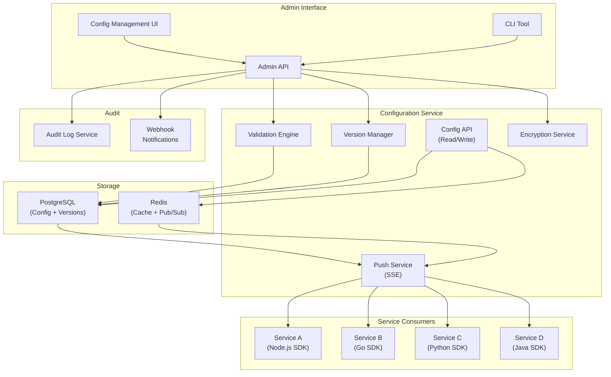
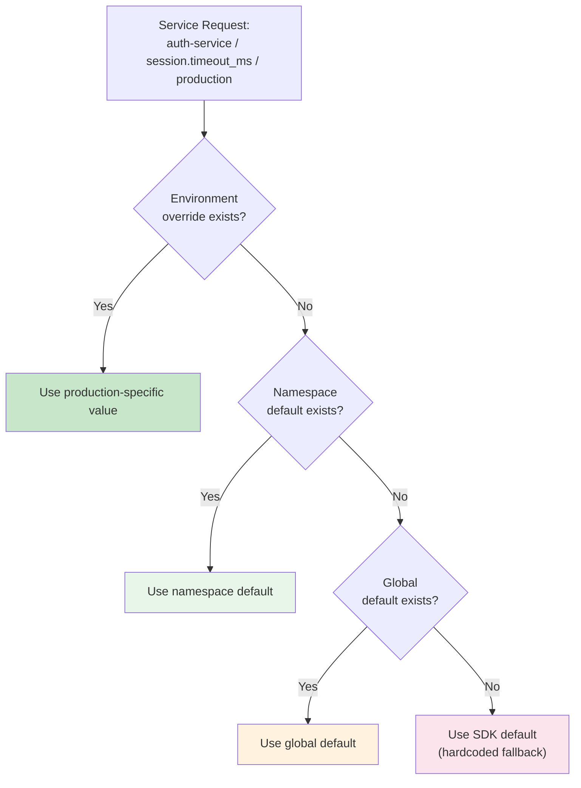

# Configuration Service Blueprint

Every application has configuration: database connection strings, feature toggles, rate limits, API keys, UI text, pricing tiers, timeout values. The question is not whether you need configuration management — it is whether you manage it well or let it become a source of outages.

This blueprint covers a production-grade configuration service that handles dynamic configuration (changes without redeployment), environment-specific overrides, config versioning with rollback, real-time push to running services, and safe change management with validation and approval workflows.

## Overview & Requirements

### Static vs Dynamic Config

| Aspect | Static Config | Dynamic Config |
|---|---|---|
| Change requires | Redeploy | API call or UI toggle |
| Propagation time | Minutes (CI/CD pipeline) | Seconds (real-time push) |
| Examples | DB host, S3 bucket, service URLs | Rate limits, feature text, timeouts |
| Risk | Low (tested in CI) | Medium (can break production live) |
| Rollback | Git revert + redeploy | Instant via API |

Static config belongs in environment variables or config files baked into the deployment. Dynamic config belongs in a configuration service. This blueprint covers dynamic config.

### Functional Requirements

| Requirement | Description |
|---|---|
| Key-value storage | Store config as typed key-value pairs (string, number, boolean, JSON) |
| Environment overrides | Same key can have different values in dev, staging, production |
| Versioning | Every change creates a new version; full history available |
| Rollback | Instantly revert to any previous version |
| Validation | Schema-based validation prevents invalid config values |
| Real-time push | Services receive config changes within 5 seconds |
| Approval workflow | Production changes require approval |
| Namespaces | Config organized by service or domain |
| Encryption | Sensitive values encrypted at rest |

### Non-Functional Requirements

| Requirement | Target |
|---|---|
| Config read latency (SDK) | < 1ms (local cache) |
| Config push latency | < 5 seconds from change to all services |
| API availability | 99.99% |
| Config history retention | Indefinite |
| Maximum config entries | 100,000+ |

## Architecture Diagram



## Core Components Deep Dive

### Config Data Model

Configuration entries are typed key-value pairs organized into namespaces:

```typescript
// config-types.ts
interface ConfigEntry {
  key: string;              // Dot-notation: "service.timeout_ms", "pricing.free_tier_limit"
  namespace: string;        // "auth-service", "billing", "global"
  type: 'string' | 'number' | 'boolean' | 'json';
  value: any;               // The current value
  description: string;      // Human-readable description
  schema?: object;          // JSON Schema for validation
  sensitive: boolean;       // If true, value is encrypted and masked in UI
  tags: string[];           // For organization: ["performance", "billing", "experiment"]
}

interface ConfigVersion {
  id: string;
  configKey: string;
  namespace: string;
  environment: string;
  value: any;
  previousValue: any;
  version: number;
  changedBy: string;
  changeReason: string;
  approvedBy?: string;
  createdAt: string;
}

interface ConfigEnvironment {
  key: string;
  namespace: string;
  environments: {
    development: any;
    staging: any;
    production: any;
  };
  // Resolution order: environment-specific -> namespace default -> global default
}
```

### Validation Engine

Every config change passes through validation before being applied. This prevents catastrophic misconfigurations.

```typescript
// validation-engine.ts
import Ajv from 'ajv';

class ConfigValidationEngine {
  private ajv = new Ajv({ allErrors: true });

  async validate(entry: ConfigEntry, newValue: any): Promise<ValidationResult> {
    const errors: string[] = [];

    // 1. Type check
    if (!this.matchesType(entry.type, newValue)) {
      errors.push(`Expected type ${entry.type}, got ${typeof newValue}`);
    }

    // 2. JSON Schema validation (if schema defined)
    if (entry.schema) {
      const valid = this.ajv.validate(entry.schema, newValue);
      if (!valid) {
        errors.push(...this.ajv.errors!.map((e) => `${e.instancePath}: ${e.message}`));
      }
    }

    // 3. Custom validators per config key
    const customValidator = this.customValidators.get(entry.key);
    if (customValidator) {
      const customErrors = await customValidator(newValue, entry);
      errors.push(...customErrors);
    }

    // 4. Safety checks
    errors.push(...this.safeguardChecks(entry, newValue));

    return {
      valid: errors.length === 0,
      errors,
    };
  }

  private safeguardChecks(entry: ConfigEntry, newValue: any): string[] {
    const errors: string[] = [];

    // Prevent setting timeouts to 0
    if (entry.key.includes('timeout') && newValue === 0) {
      errors.push('Timeout cannot be 0 — this would cause immediate failures');
    }

    // Prevent setting rate limits to unreasonably low values
    if (entry.key.includes('rate_limit') && typeof newValue === 'number' && newValue < 1) {
      errors.push('Rate limit cannot be less than 1');
    }

    // Warn about large percentage changes
    if (entry.type === 'number' && typeof newValue === 'number') {
      const oldValue = entry.value as number;
      if (oldValue > 0) {
        const changePercent = Math.abs((newValue - oldValue) / oldValue) * 100;
        if (changePercent > 50) {
          errors.push(
            `Warning: ${changePercent.toFixed(0)}% change from ${oldValue} to ${newValue}. ` +
            'Large changes should be reviewed carefully.',
          );
        }
      }
    }

    return errors;
  }
}
```

::: warning Config Changes Break Production
The most dangerous production incidents often come from config changes, not code changes. A mistyped timeout value, a rate limit set to 0, or a typo in a connection string can take down your entire platform. Always validate, always require a reason, and always have instant rollback.
:::

### Version Manager

Every config change creates a new version. The full history is preserved for auditing and rollback.

```typescript
// version-manager.ts
class ConfigVersionManager {
  async updateConfig(
    key: string,
    namespace: string,
    environment: string,
    newValue: any,
    changedBy: string,
    changeReason: string,
  ): Promise<ConfigVersion> {
    return await this.db.transaction(async (tx) => {
      // Lock the config entry
      const current = await tx.query(
        `SELECT * FROM config_entries
         WHERE key = $1 AND namespace = $2 AND environment = $3
         FOR UPDATE`,
        [key, namespace, environment],
      );

      if (!current.rows.length) {
        throw new NotFoundError(`Config key ${namespace}/${key} not found`);
      }

      const previousValue = current.rows[0].value;
      const newVersion = current.rows[0].version + 1;

      // Create version record
      await tx.query(
        `INSERT INTO config_versions
         (config_key, namespace, environment, value, previous_value, version, changed_by, change_reason)
         VALUES ($1, $2, $3, $4, $5, $6, $7, $8)`,
        [key, namespace, environment, JSON.stringify(newValue),
         JSON.stringify(previousValue), newVersion, changedBy, changeReason],
      );

      // Update current value
      await tx.query(
        `UPDATE config_entries
         SET value = $1, version = $2, updated_at = now()
         WHERE key = $3 AND namespace = $4 AND environment = $5`,
        [JSON.stringify(newValue), newVersion, key, namespace, environment],
      );

      // Publish change event
      await this.redis.publish('config:changes', JSON.stringify({
        key, namespace, environment, value: newValue, version: newVersion,
      }));

      return {
        id: uuidv7(),
        configKey: key,
        namespace,
        environment,
        value: newValue,
        previousValue,
        version: newVersion,
        changedBy,
        changeReason,
        createdAt: new Date().toISOString(),
      };
    });
  }

  async rollback(
    key: string,
    namespace: string,
    environment: string,
    targetVersion: number,
    rolledBackBy: string,
  ): Promise<ConfigVersion> {
    const target = await this.db.query(
      `SELECT * FROM config_versions
       WHERE config_key = $1 AND namespace = $2 AND environment = $3 AND version = $4`,
      [key, namespace, environment, targetVersion],
    );

    if (!target.rows.length) {
      throw new NotFoundError(`Version ${targetVersion} not found`);
    }

    return this.updateConfig(
      key, namespace, environment,
      JSON.parse(target.rows[0].value),
      rolledBackBy,
      `Rollback to version ${targetVersion}`,
    );
  }
}
```

### Real-Time Push Service

Services receive config updates in real-time via Server-Sent Events (SSE). This eliminates polling and ensures changes propagate within seconds.

```typescript
// push-service.ts
class ConfigPushService {
  private clients = new Map<string, Set<Response>>(); // namespace -> SSE connections

  /**
   * SSE endpoint for services to subscribe to config changes.
   */
  handleSSEConnection(req: Request, res: Response): void {
    const namespace = req.query.namespace as string;
    const environment = req.query.environment as string;

    res.writeHead(200, {
      'Content-Type': 'text/event-stream',
      'Cache-Control': 'no-cache',
      Connection: 'keep-alive',
      'X-Accel-Buffering': 'no', // Disable nginx buffering
    });

    // Send initial heartbeat
    res.write('event: connected\ndata: {}\n\n');

    // Register client
    const key = `${namespace}:${environment}`;
    if (!this.clients.has(key)) this.clients.set(key, new Set());
    this.clients.get(key)!.add(res);

    // Heartbeat every 30 seconds
    const heartbeat = setInterval(() => {
      res.write('event: heartbeat\ndata: {}\n\n');
    }, 30_000);

    req.on('close', () => {
      this.clients.get(key)?.delete(res);
      clearInterval(heartbeat);
    });
  }

  /**
   * Called when a config value changes. Pushes to all subscribed services.
   */
  async broadcastChange(change: ConfigChangeEvent): Promise<void> {
    const key = `${change.namespace}:${change.environment}`;
    const clients = this.clients.get(key);
    if (!clients || clients.size === 0) return;

    const payload = `event: config-update\ndata: ${JSON.stringify(change)}\n\n`;

    for (const client of clients) {
      try {
        client.write(payload);
      } catch {
        clients.delete(client);
      }
    }

    this.metrics.gauge('config.push.connected_clients', clients.size, { namespace: change.namespace });
  }
}
```

### Client SDK

The SDK caches all config locally and updates in real-time via SSE. Config reads are always local — zero network latency.

```typescript
// sdk/config-sdk.ts
class ConfigClient {
  private config = new Map<string, any>();
  private listeners = new Map<string, Set<(value: any) => void>>();
  private eventSource: EventSource | null = null;

  constructor(private options: ConfigSDKOptions) {}

  async initialize(): Promise<void> {
    // Bootstrap: fetch all config for this namespace
    const response = await fetch(
      `${this.options.apiUrl}/api/v1/config/${this.options.namespace}?env=${this.options.environment}`,
      { headers: { Authorization: `Bearer ${this.options.apiKey}` } },
    );
    const data = await response.json();

    for (const entry of data.entries) {
      this.config.set(entry.key, entry.value);
    }

    // Persist to disk for offline bootstrap
    await this.persistToFile();

    // Connect SSE for real-time updates
    this.connectSSE();
  }

  /**
   * Get a config value. Always returns from local cache — zero latency.
   */
  get<T>(key: string, defaultValue: T): T {
    const value = this.config.get(key);
    return value !== undefined ? (value as T) : defaultValue;
  }

  getString(key: string, defaultValue = ''): string {
    return this.get(key, defaultValue);
  }

  getNumber(key: string, defaultValue = 0): number {
    return this.get(key, defaultValue);
  }

  getBoolean(key: string, defaultValue = false): boolean {
    return this.get(key, defaultValue);
  }

  getJSON<T>(key: string, defaultValue: T): T {
    return this.get(key, defaultValue);
  }

  /**
   * Subscribe to changes for a specific key.
   */
  onChange(key: string, callback: (newValue: any, oldValue: any) => void): () => void {
    if (!this.listeners.has(key)) this.listeners.set(key, new Set());
    this.listeners.get(key)!.add(callback);
    return () => this.listeners.get(key)?.delete(callback);
  }

  private connectSSE(): void {
    const url = `${this.options.apiUrl}/api/v1/config/stream?namespace=${this.options.namespace}&environment=${this.options.environment}`;
    this.eventSource = new EventSource(url);

    this.eventSource.addEventListener('config-update', (event) => {
      const change = JSON.parse(event.data);
      const oldValue = this.config.get(change.key);
      this.config.set(change.key, change.value);

      // Notify listeners
      const listeners = this.listeners.get(change.key);
      if (listeners) {
        for (const callback of listeners) {
          callback(change.value, oldValue);
        }
      }

      this.persistToFile();
    });

    this.eventSource.onerror = () => {
      // Reconnect with exponential backoff — SSE handles this natively
      this.metrics.increment('config.sdk.sse_reconnect');
    };
  }

  private async persistToFile(): Promise<void> {
    const data = Object.fromEntries(this.config);
    await fs.writeFile(this.options.cacheFile, JSON.stringify(data), 'utf-8');
  }
}

// Usage
const config = new ConfigClient({
  apiUrl: 'https://config.internal.example.com',
  apiKey: process.env.CONFIG_API_KEY!,
  namespace: 'auth-service',
  environment: 'production',
  cacheFile: '/tmp/config-cache.json',
});

await config.initialize();

const timeout = config.getNumber('request.timeout_ms', 5000);
const maxRetries = config.getNumber('request.max_retries', 3);

// React to changes
config.onChange('request.timeout_ms', (newValue) => {
  httpClient.defaults.timeout = newValue;
  logger.info('Timeout updated', { newValue });
});
```

## Data Model / Schema

```sql
-- Config entries (current values)
CREATE TABLE config_entries (
    key             TEXT NOT NULL,
    namespace       TEXT NOT NULL,
    environment     TEXT NOT NULL CHECK (environment IN ('development', 'staging', 'production')),
    type            TEXT NOT NULL CHECK (type IN ('string', 'number', 'boolean', 'json')),
    value           JSONB NOT NULL,
    description     TEXT,
    schema          JSONB,           -- JSON Schema for validation
    sensitive       BOOLEAN NOT NULL DEFAULT false,
    tags            TEXT[] DEFAULT '{}',
    version         INTEGER NOT NULL DEFAULT 1,
    created_at      TIMESTAMPTZ NOT NULL DEFAULT now(),
    updated_at      TIMESTAMPTZ NOT NULL DEFAULT now(),
    PRIMARY KEY (key, namespace, environment)
);

-- Config version history
CREATE TABLE config_versions (
    id              UUID PRIMARY KEY DEFAULT gen_random_uuid(),
    config_key      TEXT NOT NULL,
    namespace       TEXT NOT NULL,
    environment     TEXT NOT NULL,
    value           JSONB NOT NULL,
    previous_value  JSONB,
    version         INTEGER NOT NULL,
    changed_by      TEXT NOT NULL,
    change_reason   TEXT NOT NULL,
    approved_by     TEXT,
    created_at      TIMESTAMPTZ NOT NULL DEFAULT now()
);

-- Config namespaces
CREATE TABLE config_namespaces (
    name            TEXT PRIMARY KEY,
    description     TEXT,
    owners          TEXT[] NOT NULL,     -- Team or individuals
    require_approval BOOLEAN NOT NULL DEFAULT false, -- For production changes
    created_at      TIMESTAMPTZ NOT NULL DEFAULT now()
);

CREATE INDEX idx_config_versions_key ON config_versions(config_key, namespace, environment, version DESC);
CREATE INDEX idx_config_entries_namespace ON config_entries(namespace);
CREATE INDEX idx_config_entries_tags ON config_entries USING GIN(tags);
```

## API Design

### Get All Config for a Namespace

```
GET /api/v1/config/auth-service?env=production
Authorization: Bearer <sdk-key>

Response:
{
  "namespace": "auth-service",
  "environment": "production",
  "entries": [
    {
      "key": "session.timeout_minutes",
      "type": "number",
      "value": 30,
      "version": 5,
      "updatedAt": "2026-03-19T10:00:00Z"
    },
    {
      "key": "mfa.required_for_admin",
      "type": "boolean",
      "value": true,
      "version": 2,
      "updatedAt": "2026-02-15T08:00:00Z"
    },
    {
      "key": "oauth.google.client_id",
      "type": "string",
      "value": "***REDACTED***",
      "version": 1,
      "sensitive": true
    }
  ],
  "configVersion": 42
}
```

### Update a Config Value

```
PATCH /api/v1/config/auth-service/session.timeout_minutes
Authorization: Bearer <admin-token>

{
  "environment": "production",
  "value": 60,
  "reason": "Extending session timeout after user feedback about frequent logouts"
}

Response (200):
{
  "key": "session.timeout_minutes",
  "value": 60,
  "previousValue": 30,
  "version": 6,
  "changedBy": "admin@example.com"
}
```

### Rollback

```
POST /api/v1/config/auth-service/session.timeout_minutes/rollback
Authorization: Bearer <admin-token>

{
  "environment": "production",
  "targetVersion": 5,
  "reason": "Reverting timeout change — causing session issues"
}
```

### Config History

```
GET /api/v1/config/auth-service/session.timeout_minutes/history?env=production&limit=10

Response:
{
  "versions": [
    { "version": 6, "value": 60, "changedBy": "admin@example.com", "createdAt": "2026-03-20T14:00:00Z" },
    { "version": 5, "value": 30, "changedBy": "ops@example.com", "createdAt": "2026-03-19T10:00:00Z" },
    { "version": 4, "value": 15, "changedBy": "admin@example.com", "createdAt": "2026-03-01T09:00:00Z" }
  ]
}
```

## Environment Override Resolution

Config values resolve using a cascade:



This cascade means you can set sane defaults at the namespace level and only override specific values per environment. For example, `request.timeout_ms` might be `5000` as the namespace default, `10000` in development (to allow debugging), and `3000` in production (fail fast).

## Scaling Considerations

### Config Service vs Feature Flags

The configuration service and [Feature Flag Service](/production-blueprints/feature-flag-service/) are closely related but serve different purposes:

| Aspect | Config Service | Feature Flag Service |
|---|---|---|
| Target | Service-level settings | User-level targeting |
| Evaluation | Same value for all requests | Different value per user |
| Changes | Operations/engineering | Product/engineering |
| Examples | Timeouts, limits, URLs | UI experiments, rollouts |
| SDK | Simple key-value lookup | Rule evaluation engine |

In practice, many teams combine them into a single service. The key difference is whether the value depends on user context.

### Failure Modes

| Failure | Impact | Mitigation |
|---|---|---|
| Config service down | Services cannot bootstrap | SDK falls back to local file cache |
| SSE disconnects | Config changes not propagated | SDK reconnects automatically, polls as fallback |
| Bad config deployed | Service misbehaves | Instant rollback via API, validation prevents most issues |
| Redis cache stale | Outdated config served | SSE push bypasses cache, TTL ensures freshness |

::: danger The Local Cache Is Everything
If the config service goes down, services must continue operating with their last-known config. The SDK must persist config to local disk and bootstrap from the file if the API is unreachable. Never design a system where a config service outage cascades to a product outage.
:::

## Deployment

### Infrastructure

| Component | Service | Count | Notes |
|---|---|---|---|
| Config API | ECS Fargate | 2 | Stateless, behind ALB |
| Push Service (SSE) | EC2 | 2 | Long-lived connections, sticky sessions |
| PostgreSQL | RDS (db.t3.large) | 1 + read replica | Config + version history |
| Redis | ElastiCache | 1 | Cache + Pub/Sub |
| Admin UI | S3 + CloudFront | — | React SPA |

### Monitoring

| Metric | Warning | Critical |
|---|---|---|
| SSE connected services | < 90% expected | < 70% expected |
| Config read latency (API) | > 50ms | > 200ms |
| Config push latency | > 10s | > 30s |
| Validation failures | > 5/hour | > 20/hour |
| Rollback count | > 2/day | > 5/day |

High rollback rates indicate that the validation and approval process needs strengthening. Track with [Metrics Design](/devops/monitoring/metrics-design) patterns.

## Related Pages

- [Feature Flag Service Blueprint](/production-blueprints/feature-flag-service/) — User-targeted configuration
- [Secrets Management](/security/secrets-management/) — Secure storage for sensitive config values
- [HashiCorp Vault](/security/secrets-management/vault-deep-dive) — Enterprise secrets management
- [Environment Promotion](/infrastructure/ci-cd/environment-promotion) — Promoting config across environments
- [Rollback Procedures](/devops/deployment-strategies/rollback-procedures) — General rollback patterns

---

> *"The most common cause of production incidents is not bad code — it is bad configuration. Validate every change. Version every change. Make rollback one button press away."*
