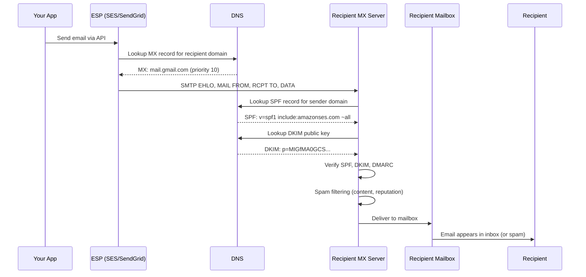
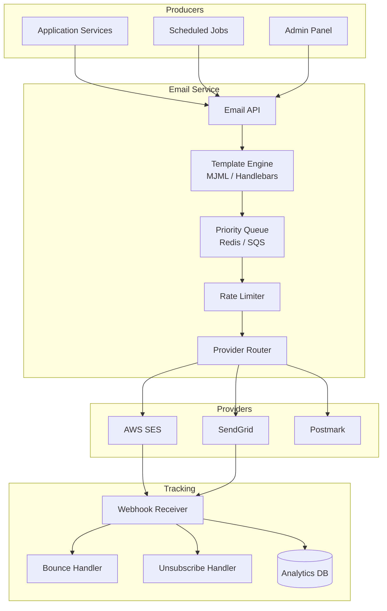

# Email Service Blueprint

Email is the most reliable notification channel you have — it works without app installs, survives device changes, and is legally required for transactional communications (receipts, password resets, account verification). It is also the most abused channel on the internet, which means getting emails into inboxes (not spam folders) requires understanding authentication protocols, reputation management, and deliverability engineering that most developers never encounter.

This blueprint covers the complete email service lifecycle: from SMTP fundamentals through authentication protocols (DKIM, SPF, DMARC), to production architecture with SES/SendGrid, template management, bounce handling, and deliverability monitoring.

**Related**: [Notification Service](/production-blueprints/notification-service/) | [Design Email Service (interview)](/system-design-interviews/email-service)

---

## How Email Actually Works

Before building an email service, you must understand the protocol stack. Most developers treat email as "call an API, email appears" — this hides critical failure modes.



### SMTP — The Protocol

SMTP (Simple Mail Transfer Protocol) is a text-based protocol from 1982. It works like a postal system:

```
Client:  EHLO sender.example.com
Server:  250-mail.gmail.com Hello
Client:  MAIL FROM:<noreply@example.com>
Server:  250 OK
Client:  RCPT TO:<user@gmail.com>
Server:  250 OK
Client:  DATA
Server:  354 Start mail input
Client:  Subject: Your receipt
Client:  From: Example <noreply@example.com>
Client:  To: user@gmail.com
Client:  ...email body...
Client:  .
Server:  250 Message accepted for delivery
Client:  QUIT
```

::: warning You Should NOT Run Your Own SMTP Server
Running a mail server (Postfix, Sendmail) is operationally brutal. IP reputation takes months to build, blacklists are easy to get on and hard to get off, and deliverability requires constant monitoring. Use a managed ESP (SES, SendGrid, Postmark) unless you have a dedicated email operations team.
:::

---

## Email Authentication: DKIM, SPF, DMARC

These three protocols prevent spoofing and are **mandatory** for inbox delivery in 2026. Gmail and Yahoo now reject unauthenticated bulk email.

### SPF (Sender Policy Framework)

SPF declares which IP addresses are authorized to send email for your domain.

```
# DNS TXT record for example.com
v=spf1 include:amazonses.com include:sendgrid.net ~all
```

| Qualifier | Meaning |
|-----------|---------|
| `+all` | Allow all (defeats purpose — never use) |
| `-all` | Hard fail: reject unauthorized senders |
| `~all` | Soft fail: accept but flag (recommended during rollout) |
| `?all` | Neutral: no opinion |

### DKIM (DomainKeys Identified Mail)

DKIM cryptographically signs each email. The receiving server verifies the signature against a public key in your DNS.

```
# DNS TXT record: selector._domainkey.example.com
v=DKIM1; k=rsa; p=MIGfMA0GCSqGSIb3DQEBAQUAA4GNADCBiQKBgQ...
```

The ESP signs the email with its private key. The recipient fetches the public key from DNS and verifies the signature covers the headers and body. If someone modifies the email in transit, verification fails.

### DMARC (Domain-based Message Authentication, Reporting & Conformance)

DMARC ties SPF and DKIM together and tells receivers what to do when authentication fails.

```
# DNS TXT record: _dmarc.example.com
v=DMARC1; p=reject; rua=mailto:dmarc-reports@example.com; pct=100
```

| Policy | Action on Failure |
|--------|-------------------|
| `p=none` | Monitor only (start here) |
| `p=quarantine` | Send to spam folder |
| `p=reject` | Reject outright |

::: tip DMARC Rollout Strategy
1. Start with `p=none` and collect reports for 2-4 weeks
2. Review reports: identify legitimate senders failing authentication
3. Fix authentication for all legitimate senders
4. Move to `p=quarantine` with `pct=10` (10% of failing emails quarantined)
5. Gradually increase `pct` to 100
6. Move to `p=reject` once confident
:::

---

## Architecture



### Provider Selection

| Provider | Best For | Pricing | Deliverability |
|----------|---------|---------|----------------|
| **AWS SES** | High volume, cost-sensitive | $0.10/1000 emails | Good (requires warm-up) |
| **SendGrid** | Marketing + transactional | $0.50-1.50/1000 | Good |
| **Postmark** | Transactional only | $1.25/1000 | Excellent |
| **Mailgun** | Developer-friendly | $0.80/1000 | Good |

::: tip Multi-Provider Strategy
Use **two providers**: a primary (SES for cost) and a failover (Postmark for deliverability). Route transactional emails through both with automatic failover. This protects against provider outages and gives you leverage in vendor negotiations.
:::

---

## Template Management

### MJML for Responsive Emails

Raw HTML email is a nightmare — every client renders differently. MJML compiles to cross-client-compatible HTML.

```html
<!-- MJML template (templates/receipt.mjml) -->
<mjml>
  <mj-body>
    <mj-section>
      <mj-column>
        <mj-text font-size="20px" font-weight="bold">
          Your Receipt
        </mj-text>
        <mj-text>
          Hi {​{userName}}, your payment of ${​{amount}} was processed.
        </mj-text>
        <mj-table>
          <tr><td>Order ID</td><td>{​{orderId}}</td></tr>
          <tr><td>Date</td><td>{​{date}}</td></tr>
          <tr><td>Amount</td><td>${​{amount}}</td></tr>
        </mj-table>
        <mj-button href="{​{receiptUrl}}">
          View Full Receipt
        </mj-button>
      </mj-column>
    </mj-section>
  </mj-body>
</mjml>
```

```typescript
class EmailTemplateEngine {
  private compiledTemplates: Map<string, HandlebarsTemplateDelegate> = new Map();

  async renderEmail(templateId: string, data: Record<string, unknown>): Promise<RenderedEmail> {
    // 1. Get compiled template (cached)
    let template = this.compiledTemplates.get(templateId);
    if (!template) {
      const mjml = await this.loadTemplate(templateId);
      const html = mjml2html(mjml).html;
      template = Handlebars.compile(html);
      this.compiledTemplates.set(templateId, template);
    }

    // 2. Render with data
    const html = template(data);

    // 3. Generate plain text fallback
    const text = htmlToText(html);

    return { html, text };
  }

  private async loadTemplate(id: string): Promise<string> {
    // Load from database or file system
    return '';
  }
}
```

---

## Deliverability Engineering

### IP Warm-Up

New sending IPs have no reputation. Sending 100,000 emails on day one from a new IP will trigger spam filters.

| Day | Daily Volume | Notes |
|-----|-------------|-------|
| 1-3 | 200 | Send to most engaged users only |
| 4-7 | 1,000 | Monitor bounce rate |
| 8-14 | 5,000 | Check spam folder placement |
| 15-21 | 20,000 | Review DMARC reports |
| 22-30 | 50,000 | Approaching full volume |
| 31+ | Full volume | Continue monitoring |

::: warning Bounce Rate Thresholds
- **Bounce rate > 5%**: Major red flag. Pause sending. Clean your list.
- **Spam complaint rate > 0.1%**: Gmail will throttle you.
- **Unsubscribe rate > 1%**: Content problem, not a technical one.
:::

### Bounce Handling

```typescript
class BounceHandler {
  async processBounce(event: BounceEvent): Promise<void> {
    const { recipientEmail, bounceType, bounceSubType, timestamp } = event;

    if (bounceType === 'Permanent') {
      // Hard bounce: email address doesn't exist
      await this.suppressEmail(recipientEmail, 'hard_bounce');
      await this.removeFromAllLists(recipientEmail);
    } else if (bounceType === 'Transient') {
      // Soft bounce: temporary issue (full mailbox, server down)
      const bounceCount = await this.incrementBounceCount(recipientEmail);
      if (bounceCount >= 3) {
        // 3 soft bounces = treat as permanent
        await this.suppressEmail(recipientEmail, 'repeated_soft_bounce');
      }
    }
  }

  async processComplaint(event: ComplaintEvent): Promise<void> {
    // User marked email as spam — IMMEDIATELY stop sending
    await this.suppressEmail(event.recipientEmail, 'complaint');
    await this.removeFromAllLists(event.recipientEmail);
    // Log for reputation monitoring
    await this.logComplaint(event);
  }

  private async suppressEmail(email: string, reason: string): Promise<void> {
    await this.db.query(
      `INSERT INTO suppression_list (email, reason, created_at)
       VALUES ($1, $2, NOW())
       ON CONFLICT (email) DO UPDATE SET reason = $2`,
      [email, reason]
    );
  }
}
```

### Suppression List Check

Every outbound email must be checked against the suppression list. Sending to a suppressed address damages your reputation.

```typescript
class EmailSender {
  async send(email: OutboundEmail): Promise<SendResult> {
    // 1. Check suppression list
    const isSuppressed = await this.checkSuppression(email.to);
    if (isSuppressed) {
      return { status: 'suppressed', reason: isSuppressed.reason };
    }

    // 2. Check unsubscribe preferences
    const prefs = await this.getPreferences(email.to);
    if (!prefs.allowsCategory(email.category)) {
      return { status: 'unsubscribed' };
    }

    // 3. Rate limit per recipient domain
    await this.rateLimiter.acquire(`domain:${this.getDomain(email.to)}`);

    // 4. Send via provider
    try {
      const result = await this.provider.send(email);
      return { status: 'sent', messageId: result.messageId };
    } catch (err) {
      // Failover to backup provider
      return this.failoverProvider.send(email);
    }
  }

  private getDomain(email: string): string {
    return email.split('@')[1];
  }
}
```

---

## Monitoring & Alerting

| Metric | Healthy Range | Alert Threshold |
|--------|--------------|-----------------|
| Delivery rate | > 95% | < 90% |
| Bounce rate (hard) | < 2% | > 5% |
| Spam complaint rate | < 0.05% | > 0.1% |
| Open rate (marketing) | > 20% | < 10% |
| Send latency (p99) | < 5s | > 30s |
| Queue depth | < 1,000 | > 10,000 |
| Provider error rate | < 0.1% | > 1% |

```typescript
class EmailMetrics {
  async checkHealth(): Promise<HealthReport> {
    const last24h = await this.getStats(24);

    return {
      deliveryRate: last24h.delivered / last24h.sent,
      bounceRate: last24h.bounced / last24h.sent,
      complaintRate: last24h.complaints / last24h.delivered,
      openRate: last24h.opened / last24h.delivered,
      avgLatencyMs: last24h.avgLatencyMs,
      queueDepth: await this.getQueueDepth(),
    };
  }
}
```

::: warning Reputation is Fragile
It takes months to build a good sending reputation and minutes to destroy it. A single batch of emails to a purchased list (full of spam traps) can get your domain blacklisted across all major providers. Always use double opt-in and clean your list regularly.
:::

---

## Common Pitfalls

| Pitfall | Consequence | Prevention |
|---------|-------------|------------|
| No suppression list | Repeat-sending to bounced addresses | Check before every send |
| Missing unsubscribe header | CAN-SPAM violation, spam folder | `List-Unsubscribe` header on every marketing email |
| HTML-only email | Marked as spam by some filters | Always include plain text alternative |
| No IP warm-up | Bulk emails land in spam | Gradual volume increase over 30 days |
| Shared IP reputation | Another tenant's spam hurts you | Use dedicated IP at > 50K/day volume |
| Template injection | XSS in email content | Sanitize all user-provided data |
| Missing `Reply-To` | Replies go to `noreply@` and bounce | Set `Reply-To: support@example.com` |

---

## Summary

| Component | Technology | Purpose |
|-----------|-----------|---------|
| Email API | REST + queue-based | Decouple send from delivery |
| Template Engine | MJML + Handlebars | Cross-client responsive emails |
| Primary Provider | AWS SES | Cost-effective bulk sending |
| Failover Provider | Postmark | High-deliverability fallback |
| Bounce Handler | Webhook consumer | Maintain suppression list |
| Suppression List | PostgreSQL | Prevent reputation damage |
| Analytics | ClickHouse / TimescaleDB | Track delivery, opens, clicks |
| Authentication | DKIM + SPF + DMARC | Inbox placement, anti-spoofing |
