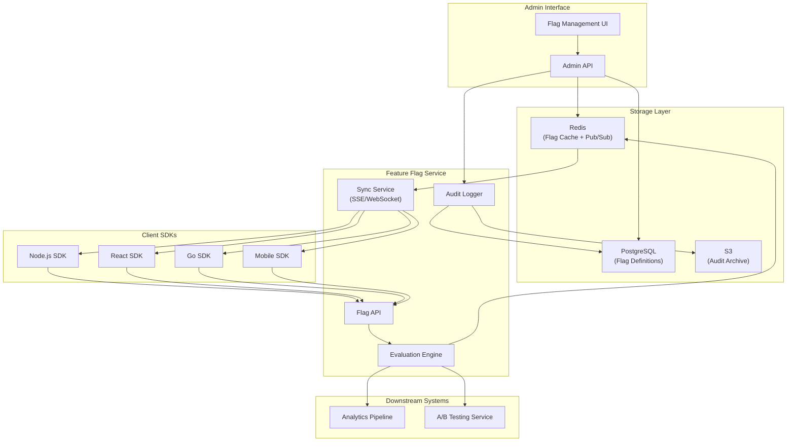
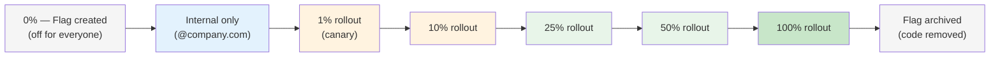

# Feature Flag Service Blueprint

Feature flags decouple deployment from release. They let you ship code to production without exposing it to users, then gradually roll it out by percentage, user segment, or individual account. When something goes wrong, you flip a flag instead of rolling back a deployment.

This blueprint covers a production-grade feature flag service that handles boolean flags, percentage rollouts, user-segment targeting, mutual exclusions, and integration with [A/B testing](/production-blueprints/ab-testing/). It draws from patterns used by LaunchDarkly, Unleash, and internal systems at companies like Meta, Netflix, and Google.

## Overview & Requirements

### Flag Types

| Type | Description | Example |
|---|---|---|
| **Boolean** | On or off for everyone | `maintenance_mode` |
| **Percentage** | On for X% of users, deterministic by user ID | `new_checkout: 10%` |
| **User segment** | On for users matching rules (plan, region, age) | `beta_features: plan=enterprise` |
| **Multi-variant** | Returns a string variant (for A/B/C testing) | `button_color: 'blue' | 'green' | 'red'` |
| **Operational** | Circuit breaker flags toggled by ops | `disable_recommendations` |

### Functional Requirements

| Requirement | Description |
|---|---|
| Flag evaluation | Evaluate flags in < 5ms at the SDK level (local evaluation) |
| Targeting rules | Support AND/OR rules on user attributes |
| Progressive rollout | Gradually increase percentage over time |
| Kill switch | Instantly disable any feature globally |
| Audit trail | Log every flag change with who, when, and why |
| Environments | Support dev, staging, production with different flag states |
| Stale flag detection | Identify flags that have been 100% on for > 30 days |

### Non-Functional Requirements

| Requirement | Target |
|---|---|
| SDK evaluation latency | < 5ms (local, no network) |
| Flag sync latency | < 10 seconds from change to all SDKs |
| API availability | 99.99% |
| Flag definitions served | 100,000+ evaluations/second per SDK instance |
| Total flags supported | Up to 10,000 active flags |

## Architecture Diagram



## Core Components Deep Dive

### Evaluation Engine

The evaluation engine is the heart of the system. It takes a flag key and a user context, evaluates the targeting rules, and returns the flag value. This logic runs both server-side and inside the SDK (for local evaluation).

```typescript
// evaluation-engine.ts
interface UserContext {
  userId: string;
  email?: string;
  plan?: string;
  country?: string;
  createdAt?: string;
  custom?: Record<string, string | number | boolean>;
}

interface FlagDefinition {
  key: string;
  type: 'boolean' | 'percentage' | 'multivariant';
  enabled: boolean;          // Global kill switch
  defaultValue: any;
  rules: TargetingRule[];
  fallthrough: FallthroughConfig;
  salt: string;              // For deterministic hashing
}

interface TargetingRule {
  id: string;
  description: string;
  conditions: Condition[];   // AND logic within a rule
  serve: ServeConfig;
}

interface Condition {
  attribute: string;         // e.g., "plan", "country", "userId"
  operator: 'eq' | 'neq' | 'in' | 'notIn' | 'gt' | 'lt' | 'contains' | 'regex';
  value: any;
}

class EvaluationEngine {
  evaluate(flag: FlagDefinition, user: UserContext): EvaluationResult {
    // Step 1: Check kill switch
    if (!flag.enabled) {
      return { value: flag.defaultValue, reason: 'FLAG_DISABLED' };
    }

    // Step 2: Evaluate targeting rules in order (first match wins)
    for (const rule of flag.rules) {
      if (this.matchesRule(rule, user)) {
        const value = this.resolveServe(rule.serve, flag, user);
        return { value, reason: 'RULE_MATCH', ruleId: rule.id };
      }
    }

    // Step 3: Fallthrough — percentage rollout or default
    const value = this.resolveServe(flag.fallthrough, flag, user);
    return { value, reason: 'FALLTHROUGH' };
  }

  private matchesRule(rule: TargetingRule, user: UserContext): boolean {
    // All conditions must match (AND logic)
    return rule.conditions.every((c) => this.evaluateCondition(c, user));
  }

  private evaluateCondition(condition: Condition, user: UserContext): boolean {
    const attrValue = this.getAttribute(user, condition.attribute);
    if (attrValue === undefined) return false;

    switch (condition.operator) {
      case 'eq': return attrValue === condition.value;
      case 'neq': return attrValue !== condition.value;
      case 'in': return condition.value.includes(attrValue);
      case 'notIn': return !condition.value.includes(attrValue);
      case 'gt': return attrValue > condition.value;
      case 'lt': return attrValue < condition.value;
      case 'contains': return String(attrValue).includes(condition.value);
      case 'regex': return new RegExp(condition.value).test(String(attrValue));
      default: return false;
    }
  }

  private resolveServe(
    serve: ServeConfig,
    flag: FlagDefinition,
    user: UserContext,
  ): any {
    if (serve.type === 'fixed') return serve.value;

    // Percentage rollout — deterministic by user ID + flag salt
    const hash = this.hashPercentage(user.userId, flag.key, flag.salt);

    if (serve.type === 'percentage') {
      return hash < serve.percentage;
    }

    // Multi-variant: distribute across variants by percentage
    let cumulative = 0;
    for (const variant of serve.variants) {
      cumulative += variant.weight;
      if (hash < cumulative) return variant.value;
    }

    return flag.defaultValue;
  }

  /**
   * Deterministic percentage hash.
   * Same user + flag always returns same value (0-100).
   * Uses MurmurHash3 for uniform distribution.
   */
  private hashPercentage(userId: string, flagKey: string, salt: string): number {
    const input = `${salt}:${flagKey}:${userId}`;
    const hash = murmurhash3(input);
    return (hash % 10000) / 100; // 0.00 to 99.99
  }
}
```

::: tip Deterministic Hashing Is Critical
The percentage hash must be deterministic — the same user must always get the same flag value for a given flag, across all SDK instances and server restarts. This is why we hash `userId + flagKey + salt` instead of using `Math.random()`. Changing the salt redistributes all users, which is useful for re-randomizing an experiment.
:::

### SDK Design

The SDK is a local evaluation library that downloads all flag definitions, caches them in memory, and evaluates flags without any network call. This guarantees sub-5ms evaluation.

```typescript
// sdk/node-sdk.ts
class FeatureFlagClient {
  private flags: Map<string, FlagDefinition> = new Map();
  private engine = new EvaluationEngine();
  private eventSource: EventSource | null = null;

  constructor(private config: SDKConfig) {}

  async initialize(): Promise<void> {
    // Bootstrap: fetch all flag definitions
    const response = await fetch(`${this.config.apiUrl}/api/v1/flags`, {
      headers: { Authorization: `Bearer ${this.config.sdkKey}` },
    });
    const data = await response.json();
    for (const flag of data.flags) {
      this.flags.set(flag.key, flag);
    }

    // Subscribe to real-time updates via SSE
    this.connectStream();
  }

  /**
   * Evaluate a boolean flag. No network call — pure in-memory evaluation.
   */
  boolVariation(flagKey: string, user: UserContext, defaultValue = false): boolean {
    const flag = this.flags.get(flagKey);
    if (!flag) {
      this.trackEvaluation(flagKey, user, defaultValue, 'FLAG_NOT_FOUND');
      return defaultValue;
    }

    const result = this.engine.evaluate(flag, user);
    this.trackEvaluation(flagKey, user, result.value, result.reason);
    return result.value;
  }

  /**
   * Evaluate a multi-variant flag.
   */
  stringVariation(flagKey: string, user: UserContext, defaultValue: string): string {
    const flag = this.flags.get(flagKey);
    if (!flag) return defaultValue;

    const result = this.engine.evaluate(flag, user);
    this.trackEvaluation(flagKey, user, result.value, result.reason);
    return result.value;
  }

  private connectStream(): void {
    this.eventSource = new EventSource(
      `${this.config.apiUrl}/api/v1/flags/stream`,
      { headers: { Authorization: `Bearer ${this.config.sdkKey}` } },
    );

    this.eventSource.addEventListener('flag-update', (event) => {
      const flag = JSON.parse(event.data);
      this.flags.set(flag.key, flag);
    });

    this.eventSource.addEventListener('flag-delete', (event) => {
      const { key } = JSON.parse(event.data);
      this.flags.delete(key);
    });
  }

  private trackEvaluation(
    flagKey: string,
    user: UserContext,
    value: any,
    reason: string,
  ): void {
    // Buffer evaluations and send in batches to analytics
    this.eventBuffer.push({
      flagKey,
      userId: user.userId,
      value,
      reason,
      timestamp: Date.now(),
    });
  }
}
```

### React SDK (Frontend)

```tsx
// sdk/react-sdk.tsx
import { createContext, useContext, useEffect, useState } from 'react';

const FeatureFlagContext = createContext<FeatureFlagClient | null>(null);

export function FeatureFlagProvider({
  sdkKey,
  user,
  children,
}: {
  sdkKey: string;
  user: UserContext;
  children: React.ReactNode;
}) {
  const [client, setClient] = useState<FeatureFlagClient | null>(null);

  useEffect(() => {
    const ffClient = new FeatureFlagClient({ sdkKey, apiUrl: '/api/flags' });
    ffClient.initialize().then(() => setClient(ffClient));
    return () => ffClient.close();
  }, [sdkKey]);

  if (!client) return null; // Or a loading state

  return (
    <FeatureFlagContext.Provider value={client}>
      {children}
    </FeatureFlagContext.Provider>
  );
}

export function useFeatureFlag(flagKey: string, defaultValue = false): boolean {
  const client = useContext(FeatureFlagContext);
  const user = useUser(); // Your auth context
  if (!client) return defaultValue;
  return client.boolVariation(flagKey, user, defaultValue);
}

// Usage in components:
function CheckoutPage() {
  const showNewCheckout = useFeatureFlag('new_checkout_flow');

  return showNewCheckout ? <NewCheckout /> : <LegacyCheckout />;
}
```

## Data Model / Schema

```sql
-- Flag definitions
CREATE TABLE flags (
    id              UUID PRIMARY KEY DEFAULT gen_random_uuid(),
    key             TEXT NOT NULL UNIQUE,
    name            TEXT NOT NULL,
    description     TEXT,
    type            TEXT NOT NULL CHECK (type IN ('boolean', 'percentage', 'multivariant')),
    enabled         BOOLEAN NOT NULL DEFAULT false,
    default_value   JSONB NOT NULL,
    salt            TEXT NOT NULL DEFAULT encode(gen_random_bytes(16), 'hex'),
    tags            TEXT[] DEFAULT '{}',
    owner           TEXT,   -- team or person responsible
    created_at      TIMESTAMPTZ NOT NULL DEFAULT now(),
    updated_at      TIMESTAMPTZ NOT NULL DEFAULT now()
);

-- Environment-specific flag configurations
CREATE TABLE flag_environments (
    id              UUID PRIMARY KEY DEFAULT gen_random_uuid(),
    flag_id         UUID NOT NULL REFERENCES flags(id) ON DELETE CASCADE,
    environment     TEXT NOT NULL CHECK (environment IN ('development', 'staging', 'production')),
    enabled         BOOLEAN NOT NULL DEFAULT false,
    rules           JSONB NOT NULL DEFAULT '[]',
    fallthrough     JSONB NOT NULL DEFAULT '{"type": "fixed", "value": false}',
    updated_at      TIMESTAMPTZ NOT NULL DEFAULT now(),
    UNIQUE (flag_id, environment)
);

-- Audit log for flag changes
CREATE TABLE flag_audit_log (
    id              UUID PRIMARY KEY DEFAULT gen_random_uuid(),
    flag_id         UUID NOT NULL REFERENCES flags(id),
    environment     TEXT NOT NULL,
    action          TEXT NOT NULL CHECK (action IN (
        'created', 'updated', 'enabled', 'disabled',
        'rule_added', 'rule_removed', 'rule_updated',
        'percentage_changed', 'archived'
    )),
    previous_value  JSONB,
    new_value       JSONB,
    changed_by      TEXT NOT NULL,
    change_reason   TEXT,   -- Required for production changes
    created_at      TIMESTAMPTZ NOT NULL DEFAULT now()
);

-- User overrides (force a specific value for a user)
CREATE TABLE flag_overrides (
    id              UUID PRIMARY KEY DEFAULT gen_random_uuid(),
    flag_id         UUID NOT NULL REFERENCES flags(id) ON DELETE CASCADE,
    environment     TEXT NOT NULL,
    user_id         TEXT NOT NULL,
    value           JSONB NOT NULL,
    reason          TEXT,
    created_by      TEXT NOT NULL,
    expires_at      TIMESTAMPTZ,
    created_at      TIMESTAMPTZ NOT NULL DEFAULT now(),
    UNIQUE (flag_id, environment, user_id)
);

CREATE INDEX idx_flag_audit_flag_id ON flag_audit_log(flag_id);
CREATE INDEX idx_flag_audit_created_at ON flag_audit_log(created_at);
CREATE INDEX idx_flag_overrides_user ON flag_overrides(user_id, environment);
```

## API Design

### Get All Flags (SDK Bootstrap)

```
GET /api/v1/flags
Authorization: Bearer <sdk-key>

Response:
{
  "flags": [
    {
      "key": "new_checkout",
      "type": "percentage",
      "enabled": true,
      "defaultValue": false,
      "rules": [
        {
          "id": "rule_1",
          "description": "Enterprise users get it immediately",
          "conditions": [{ "attribute": "plan", "operator": "eq", "value": "enterprise" }],
          "serve": { "type": "fixed", "value": true }
        }
      ],
      "fallthrough": { "type": "percentage", "percentage": 25 },
      "salt": "a1b2c3d4"
    }
  ],
  "version": 42
}
```

### Create / Update a Flag (Admin)

```
POST /api/v1/admin/flags
Authorization: Bearer <admin-token>

{
  "key": "dark_mode_v2",
  "name": "Dark Mode V2",
  "type": "percentage",
  "description": "Redesigned dark mode with OLED-friendly colors",
  "owner": "team-frontend",
  "tags": ["ui", "experiment"]
}
```

### Update Flag Rules (Admin)

```
PATCH /api/v1/admin/flags/dark_mode_v2/environments/production
Authorization: Bearer <admin-token>

{
  "enabled": true,
  "rules": [
    {
      "description": "Internal dogfooding",
      "conditions": [{ "attribute": "email", "operator": "contains", "value": "@ourcompany.com" }],
      "serve": { "type": "fixed", "value": true }
    }
  ],
  "fallthrough": { "type": "percentage", "percentage": 10 },
  "changeReason": "Starting 10% rollout after successful staging test"
}
```

### Real-Time Flag Updates (SSE)

```
GET /api/v1/flags/stream
Authorization: Bearer <sdk-key>
Accept: text/event-stream

event: flag-update
data: {"key":"dark_mode_v2","enabled":true,"fallthrough":{"type":"percentage","percentage":25},...}

event: flag-update
data: {"key":"dark_mode_v2","fallthrough":{"type":"percentage","percentage":50},...}
```

## Progressive Rollout Strategy

A safe rollout follows this pattern:



At each stage, monitor:

- Error rates (compare flagged vs unflagged users)
- Latency (p50, p95, p99)
- Business metrics (conversion, engagement)
- User feedback channels

If any metric degrades, roll back by setting the percentage to 0. This is why feature flags are safer than deployment rollbacks — see [Feature Flags as Deployment](/devops/deployment-strategies/feature-flags-deployment) and [Canary Deployment](/devops/deployment-strategies/canary) for deeper coverage.

::: warning Stale Flag Hygiene
Feature flags are technical debt. A flag that has been at 100% for over 30 days should be removed from the codebase. Track flag lifecycle: created, rolling out, fully on, code removed. Set up automated alerts for stale flags. The worst production incidents often involve forgotten flags with complex targeting rules that nobody understands anymore.
:::

## Scaling Considerations

### Performance at Scale

| Scenario | Strategy |
|---|---|
| High evaluation volume | Local SDK evaluation (no network), flag definitions cached in memory |
| Many flag changes | SSE/WebSocket push to all SDK instances, Redis Pub/Sub for server coordination |
| Large number of flags | Segment flags by project/team, lazy-load only relevant flags |
| Global distribution | Deploy flag API in multiple regions, use Redis replication for sync |

### Failure Modes

| Failure | Impact | Mitigation |
|---|---|---|
| Flag API down | SDKs cannot bootstrap | SDKs cache last-known flags to disk; stale flags are better than no flags |
| SSE connection drops | SDKs miss updates | SDK reconnects with exponential backoff, polls as fallback |
| Redis down | Flag changes not propagated | Fall through to PostgreSQL, accept higher latency |
| Bad flag rule deployed | Wrong users see feature | Require approval for production changes, instant kill switch |

::: danger SDK Resilience
The SDK must never throw an exception or crash the host application. If evaluation fails for any reason, return the default value. Never let a flag service outage become a product outage. This is the single most important design constraint.
:::

## Deployment

### Infrastructure

| Component | Instance Type | Count | Notes |
|---|---|---|---|
| Flag API | t3.medium | 2 | Behind ALB, auto-scaling |
| Redis | r6g.large | 1 (+ replica) | Flag cache + Pub/Sub |
| PostgreSQL | db.r6g.large | 1 (+ read replica) | Flag definitions + audit log |
| Admin UI | Static (S3 + CloudFront) | — | React SPA |

### Monitoring

| Metric | Warning | Critical |
|---|---|---|
| SDK evaluation errors | > 0.1% | > 1% |
| SSE connection count | < 80% of expected | < 50% of expected |
| Flag sync lag | > 30s | > 60s |
| API latency p99 | > 100ms | > 500ms |
| Stale flags (100% > 30 days) | > 5 | > 15 |

Set up dashboards with [Grafana](/devops/monitoring/grafana-dashboards) and alerting following [Alert Design](/devops/alerting/alert-design) patterns.

## Integration with A/B Testing

Feature flags naturally extend into experimentation. When a flag uses percentage rollout, the "on" group is the treatment and the "off" group is the control. To run a proper experiment:

1. Create a flag with `type: multivariant` and multiple variants
2. Log every evaluation to the [Analytics Pipeline](/production-blueprints/analytics-pipeline/)
3. Connect evaluation events to outcome events (conversion, revenue, engagement)
4. Use statistical significance testing from the [A/B Testing](/production-blueprints/ab-testing/) blueprint

See the [A/B Testing blueprint](/production-blueprints/ab-testing/) for the full statistical framework.

## Related Pages

- [Feature Flags as Deployment](/devops/deployment-strategies/feature-flags-deployment) — Using flags for safe deployments
- [Canary Deployment](/devops/deployment-strategies/canary) — Gradual rollout at the infrastructure level
- [A/B Testing Blueprint](/production-blueprints/ab-testing/) — Experimentation framework
- [Configuration Service Blueprint](/production-blueprints/config-service/) — Related: dynamic config management
- [Circuit Breaker](/system-design/distributed-systems/circuit-breaker) — Operational flags as circuit breakers

---

> *"Feature flags are not a feature. They are an engineering discipline. The flag itself is trivial — the culture of safe, incremental rollouts it enables is transformative."*
