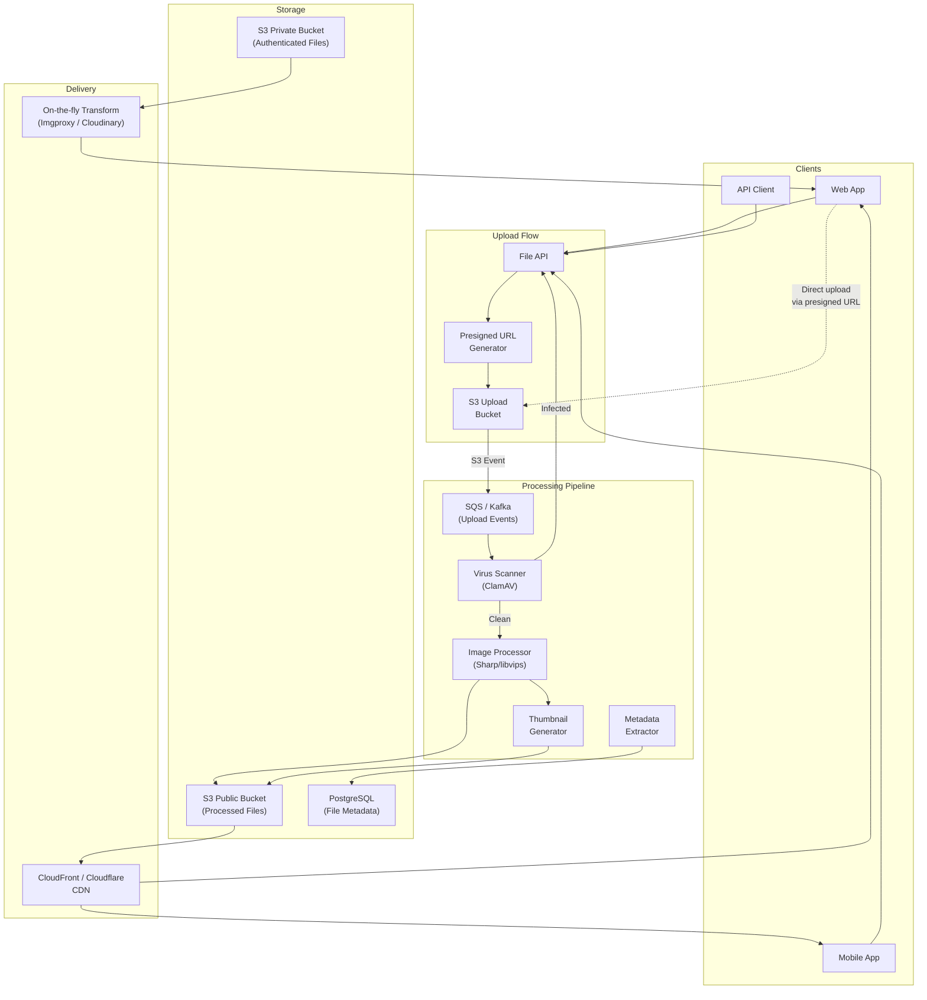
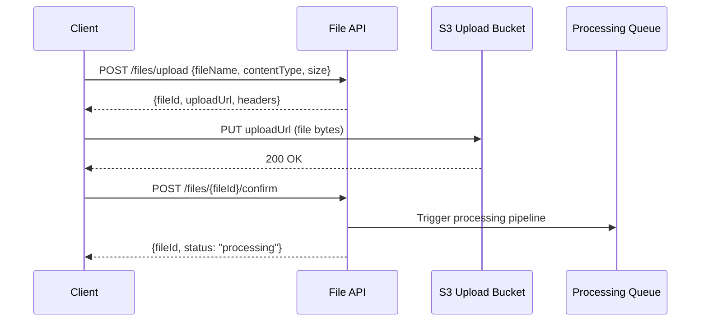
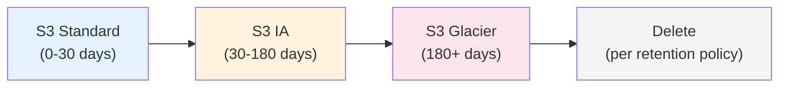

# File Storage Service Blueprint

Every product eventually needs file storage: profile photos, document uploads, chat attachments, CSV imports, video thumbnails. It sounds simple — save a file, serve it back — but production file storage involves content-type validation, virus scanning, image resizing, chunked uploads for large files, CDN distribution, presigned URLs for secure direct uploads, and storage lifecycle management.

This blueprint covers a production-grade file storage service built on S3-compatible object storage with a processing pipeline for images and documents.

## Overview & Requirements

### Functional Requirements

| Requirement | Description |
|---|---|
| File upload | Upload files up to 5 GB with progress tracking |
| Chunked upload | Multi-part upload for files > 10 MB |
| Presigned URLs | Client uploads directly to S3, bypassing the API server |
| Image processing | Resize, crop, format conversion (WebP, AVIF) on upload |
| CDN delivery | Serve files through a CDN with cache headers |
| Virus scanning | Scan every uploaded file before making it accessible |
| Access control | Private files (authenticated), public files (CDN), time-limited access |
| Metadata | Store file metadata (owner, type, dimensions, checksum) |
| Storage lifecycle | Move files to cheaper storage tiers after N days |

### Non-Functional Requirements

| Requirement | Target |
|---|---|
| Upload latency (< 10 MB) | < 2 seconds |
| Download latency (CDN hit) | < 50ms |
| Processing time (image resize) | < 5 seconds |
| Availability | 99.95% |
| Durability | 99.999999999% (S3 standard) |
| Max file size | 5 GB |
| Concurrent uploads | 10,000+ |

## Architecture Diagram



## Core Components Deep Dive

### Upload Flow: Presigned URLs

The recommended upload pattern uses presigned URLs. The client requests a presigned URL from the API, then uploads directly to S3. This avoids routing multi-megabyte files through your API servers.

```typescript
// file-api.ts — Presigned URL generation
import { S3Client, PutObjectCommand } from '@aws-sdk/client-s3';
import { getSignedUrl } from '@aws-sdk/s3-request-presigner';

class FileAPI {
  private s3 = new S3Client({ region: 'us-east-1' });

  /**
   * Step 1: Client requests a presigned URL
   */
  async createUpload(userId: string, request: CreateUploadRequest): Promise<UploadTicket> {
    // Validate file type
    const allowedTypes = ['image/jpeg', 'image/png', 'image/webp',
                          'application/pdf', 'video/mp4'];
    if (!allowedTypes.includes(request.contentType)) {
      throw new BadRequestError(`Unsupported file type: ${request.contentType}`);
    }

    // Validate file size
    if (request.fileSize > 5 * 1024 * 1024 * 1024) { // 5 GB
      throw new BadRequestError('File too large. Maximum size is 5 GB.');
    }

    // Generate a unique key
    const fileId = uuidv7();
    const extension = mime.extension(request.contentType);
    const key = `uploads/${userId}/${fileId}.${extension}`;

    // Create presigned URL (expires in 15 minutes)
    const command = new PutObjectCommand({
      Bucket: 'app-uploads-raw',
      Key: key,
      ContentType: request.contentType,
      ContentLength: request.fileSize,
      Metadata: {
        'x-user-id': userId,
        'x-file-id': fileId,
        'x-original-name': request.fileName,
      },
    });

    const presignedUrl = await getSignedUrl(this.s3, command, { expiresIn: 900 });

    // Create metadata record (status: pending)
    await this.db.query(
      `INSERT INTO files (id, user_id, original_name, content_type, size_bytes, s3_key, status)
       VALUES ($1, $2, $3, $4, $5, $6, 'pending')`,
      [fileId, userId, request.fileName, request.contentType, request.fileSize, key],
    );

    return {
      fileId,
      uploadUrl: presignedUrl,
      method: 'PUT',
      headers: {
        'Content-Type': request.contentType,
      },
      expiresAt: new Date(Date.now() + 900_000).toISOString(),
    };
  }

  /**
   * Step 3: Client confirms upload is complete
   */
  async confirmUpload(userId: string, fileId: string): Promise<FileRecord> {
    // Verify the file exists in S3
    const file = await this.db.query(
      'SELECT * FROM files WHERE id = $1 AND user_id = $2',
      [fileId, userId],
    );
    if (!file.rows.length) throw new NotFoundError('File not found');

    // Update status to trigger processing pipeline
    await this.db.query(
      "UPDATE files SET status = 'processing' WHERE id = $1",
      [fileId],
    );

    return file.rows[0];
  }
}
```



::: tip Why Presigned URLs?
Direct-to-S3 uploads eliminate the API server as a bottleneck. A t3.medium instance uploading 100 files simultaneously would saturate its network bandwidth. With presigned URLs, the client uploads directly to S3 at S3's bandwidth, and your API server only handles lightweight metadata requests. See [S3 & CloudFront](/infrastructure/aws/s3-cloudfront) for S3 performance characteristics.
:::

### Chunked Upload for Large Files

For files larger than 10 MB, use S3 multipart upload:

```typescript
// chunked-upload.ts
class ChunkedUploadService {
  private readonly chunkSize = 10 * 1024 * 1024; // 10 MB per chunk

  async initiateMultipartUpload(
    userId: string,
    request: CreateUploadRequest,
  ): Promise<MultipartUploadTicket> {
    const fileId = uuidv7();
    const key = `uploads/${userId}/${fileId}`;

    // Initiate S3 multipart upload
    const { UploadId } = await this.s3.send(new CreateMultipartUploadCommand({
      Bucket: 'app-uploads-raw',
      Key: key,
      ContentType: request.contentType,
    }));

    const totalChunks = Math.ceil(request.fileSize / this.chunkSize);

    // Generate presigned URLs for each chunk
    const parts: ChunkUploadInfo[] = [];
    for (let i = 1; i <= totalChunks; i++) {
      const command = new UploadPartCommand({
        Bucket: 'app-uploads-raw',
        Key: key,
        UploadId,
        PartNumber: i,
      });
      const url = await getSignedUrl(this.s3, command, { expiresIn: 3600 });
      parts.push({ partNumber: i, uploadUrl: url });
    }

    return { fileId, uploadId: UploadId!, parts, totalChunks };
  }

  async completeMultipartUpload(
    fileId: string,
    uploadId: string,
    parts: CompletedPart[],
  ): Promise<void> {
    await this.s3.send(new CompleteMultipartUploadCommand({
      Bucket: 'app-uploads-raw',
      Key: `uploads/${fileId}`,
      UploadId: uploadId,
      MultipartUpload: { Parts: parts },
    }));
  }
}
```

### Image Processing Pipeline

When a file upload is confirmed, an S3 event triggers the processing pipeline. For images, this means generating thumbnails, converting to modern formats, and extracting metadata.

```typescript
// image-processor.ts
import sharp from 'sharp';

class ImageProcessor {
  private readonly variants: ImageVariant[] = [
    { name: 'thumbnail', width: 150, height: 150, fit: 'cover', format: 'webp' },
    { name: 'small', width: 400, height: null, fit: 'inside', format: 'webp' },
    { name: 'medium', width: 800, height: null, fit: 'inside', format: 'webp' },
    { name: 'large', width: 1600, height: null, fit: 'inside', format: 'webp' },
    { name: 'original', width: null, height: null, fit: null, format: 'webp' },
  ];

  async process(fileId: string, s3Key: string): Promise<ProcessedFile> {
    // Download original from upload bucket
    const original = await this.s3.getObject('app-uploads-raw', s3Key);
    const buffer = Buffer.from(await original.Body!.transformToByteArray());

    // Extract metadata
    const metadata = await sharp(buffer).metadata();
    const dimensions = { width: metadata.width!, height: metadata.height! };
    const dominantColor = await this.extractDominantColor(buffer);

    // Generate variants in parallel
    const results = await Promise.all(
      this.variants.map(async (variant) => {
        let pipeline = sharp(buffer);

        if (variant.width || variant.height) {
          pipeline = pipeline.resize(variant.width, variant.height, {
            fit: variant.fit as any,
            withoutEnlargement: true,
          });
        }

        if (variant.format === 'webp') {
          pipeline = pipeline.webp({ quality: 80 });
        }

        const processed = await pipeline.toBuffer();
        const key = `files/${fileId}/${variant.name}.webp`;

        await this.s3.putObject('app-files-public', key, processed, 'image/webp');

        return {
          variant: variant.name,
          s3Key: key,
          sizeBytes: processed.length,
          width: variant.width ?? dimensions.width,
        };
      }),
    );

    // Update metadata in PostgreSQL
    await this.db.query(
      `UPDATE files SET
        status = 'ready',
        variants = $1,
        width = $2, height = $3,
        dominant_color = $4,
        processed_at = now()
       WHERE id = $5`,
      [JSON.stringify(results), dimensions.width, dimensions.height, dominantColor, fileId],
    );

    return { fileId, variants: results, dimensions, dominantColor };
  }
}
```

### Virus Scanning

Every uploaded file passes through virus scanning before processing.

```typescript
// virus-scanner.ts
import NodeClam from 'clamscan';

class VirusScanner {
  private clam: NodeClam;

  async initialize(): Promise<void> {
    this.clam = await new NodeClam().init({
      clamdscan: {
        socket: '/var/run/clamav/clamd.ctl',
        timeout: 60_000,
      },
    });
  }

  async scan(fileId: string, s3Key: string): Promise<ScanResult> {
    // Download to temp file
    const tempPath = `/tmp/scan-${fileId}`;
    await this.s3.downloadToFile('app-uploads-raw', s3Key, tempPath);

    try {
      const { isInfected, viruses } = await this.clam.scanFile(tempPath);

      if (isInfected) {
        // Quarantine the file
        await this.s3.copyObject('app-uploads-raw', s3Key, 'app-quarantine', s3Key);
        await this.s3.deleteObject('app-uploads-raw', s3Key);
        await this.db.query(
          "UPDATE files SET status = 'quarantined', scan_result = $1 WHERE id = $2",
          [JSON.stringify({ infected: true, viruses }), fileId],
        );
        this.alerting.notify('file.virus_detected', { fileId, viruses });
        return { clean: false, viruses };
      }

      return { clean: true, viruses: [] };
    } finally {
      await fs.unlink(tempPath).catch(() => {});
    }
  }
}
```

::: danger Never Serve Unscanned Files
Files in the upload bucket must never be directly accessible to users. Only after virus scanning and processing are complete should files be moved to the public bucket behind the CDN. A presigned URL to the upload bucket is for uploading only — downloads must always come from the processed/public bucket.
:::

## Data Model / Schema

```sql
CREATE TABLE files (
    id              UUID PRIMARY KEY DEFAULT gen_random_uuid(),
    user_id         UUID NOT NULL REFERENCES users(id),
    original_name   TEXT NOT NULL,
    content_type    TEXT NOT NULL,
    size_bytes      BIGINT NOT NULL,
    s3_key          TEXT NOT NULL,
    status          TEXT NOT NULL DEFAULT 'pending'
                    CHECK (status IN ('pending', 'processing', 'ready', 'quarantined', 'failed')),

    -- Image-specific metadata
    width           INTEGER,
    height          INTEGER,
    dominant_color  TEXT,         -- Hex color for placeholder
    variants        JSONB,       -- Array of generated variants

    -- Processing
    scan_result     JSONB,
    processed_at    TIMESTAMPTZ,

    -- Lifecycle
    access_level    TEXT NOT NULL DEFAULT 'private'
                    CHECK (access_level IN ('public', 'private', 'restricted')),
    expires_at      TIMESTAMPTZ,  -- For temporary files

    created_at      TIMESTAMPTZ NOT NULL DEFAULT now(),
    updated_at      TIMESTAMPTZ NOT NULL DEFAULT now()
);

CREATE INDEX idx_files_user_id ON files(user_id);
CREATE INDEX idx_files_status ON files(status) WHERE status != 'ready';
CREATE INDEX idx_files_expires ON files(expires_at) WHERE expires_at IS NOT NULL;
```

## API Design

### Upload Flow

```
POST /api/v1/files/upload
Authorization: Bearer <token>

Request:
{
  "fileName": "profile-photo.jpg",
  "contentType": "image/jpeg",
  "fileSize": 2457600,
  "accessLevel": "public"
}

Response (200):
{
  "fileId": "file_abc123",
  "uploadUrl": "https://s3.amazonaws.com/app-uploads-raw/uploads/...",
  "method": "PUT",
  "headers": { "Content-Type": "image/jpeg" },
  "expiresAt": "2026-03-20T12:15:00Z"
}
```

### Confirm Upload

```
POST /api/v1/files/file_abc123/confirm
Authorization: Bearer <token>

Response (200):
{
  "fileId": "file_abc123",
  "status": "processing",
  "estimatedProcessingTime": 5
}
```

### Get File Metadata

```
GET /api/v1/files/file_abc123
Authorization: Bearer <token>

Response (200):
{
  "fileId": "file_abc123",
  "originalName": "profile-photo.jpg",
  "contentType": "image/jpeg",
  "sizeBytes": 2457600,
  "status": "ready",
  "dimensions": { "width": 2400, "height": 1600 },
  "dominantColor": "#3a7bd5",
  "urls": {
    "thumbnail": "https://cdn.example.com/files/file_abc123/thumbnail.webp",
    "small": "https://cdn.example.com/files/file_abc123/small.webp",
    "medium": "https://cdn.example.com/files/file_abc123/medium.webp",
    "large": "https://cdn.example.com/files/file_abc123/large.webp",
    "original": "https://cdn.example.com/files/file_abc123/original.webp"
  },
  "createdAt": "2026-03-20T12:00:00Z"
}
```

### Download Private File (Presigned)

```
GET /api/v1/files/file_abc123/download
Authorization: Bearer <token>

Response (302):
Location: https://s3.amazonaws.com/app-files-private/files/file_abc123/original.webp?X-Amz-...&Expires=3600
```

## Scaling Considerations

### CDN Configuration

| Aspect | Configuration |
|---|---|
| Cache-Control | `public, max-age=31536000, immutable` (files are content-addressed) |
| Origin | S3 public bucket via OAI (Origin Access Identity) |
| Compression | Brotli for text files, skip for images/video |
| Error pages | Custom 404 with fallback to origin |
| Price class | All edge locations for global delivery |

Use immutable content-addressed URLs (`/files/{fileId}/variant.webp`). The file ID never changes, so CDN caching is trivially effective. See [CDN Deep Dive](/system-design/caching/cdn-deep-dive) for cache invalidation strategies.

### Storage Lifecycle



Configure S3 Lifecycle rules to automatically transition files to cheaper storage tiers. Files accessed frequently stay on S3 Standard; files rarely accessed move to Infrequent Access and eventually Glacier.

### Processing at Scale

| Processing Tier | Concurrency | Use Case |
|---|---|---|
| Lambda functions | 1000 concurrent | Images < 10 MB |
| ECS Fargate tasks | 50 concurrent | Video processing, large files |
| GPU instances | 5 concurrent | AI-based processing (NSFW detection) |

For image processing, AWS Lambda with Sharp is cost-effective for most workloads. For video transcoding, use dedicated ECS tasks or managed services like AWS MediaConvert.

## Deployment

### Infrastructure

| Component | Service | Notes |
|---|---|---|
| File API | ECS Fargate / EC2 | 3 instances behind ALB |
| Upload bucket | S3 Standard | Lifecycle: delete after 24h if unconfirmed |
| Public bucket | S3 Standard | CDN origin, OAI protected |
| Private bucket | S3 Standard | Presigned URL access only |
| CDN | CloudFront | All edge locations |
| Image processor | Lambda | 1024 MB memory, 30s timeout |
| Virus scanner | ECS Fargate | ClamAV container, auto-scaling |
| PostgreSQL | RDS | File metadata |

### Monitoring

| Metric | Warning | Critical |
|---|---|---|
| Upload success rate | < 98% | < 95% |
| Processing queue depth | > 1,000 | > 10,000 |
| Virus scan failures | > 0 | > 10 |
| CDN cache hit rate | < 90% | < 80% |
| S3 4xx errors | > 1% | > 5% |
| Processing duration p99 | > 10s | > 30s |

Use [Structured Logging](/devops/logging/structured-logging) to track the full lifecycle of each file from upload to delivery. Set up alerting with [Alert Design](/devops/alerting/alert-design) patterns.

## Related Pages

- [S3 & CloudFront](/infrastructure/aws/s3-cloudfront) — S3 internals and CloudFront configuration
- [CDN Deep Dive](/system-design/caching/cdn-deep-dive) — Edge caching and invalidation
- [Chat Service Blueprint](/production-blueprints/chat-service/) — File attachments in chat
- [Notification Service Blueprint](/production-blueprints/notification-service/) — Notify users when processing completes
- [Job Queue Blueprint](/production-blueprints/job-queue/) — Background processing patterns
- [Dropbox Interview](/system-design-interviews/dropbox) — Interview walkthrough of file storage

---

> *"File storage is the sleeper service. It seems trivial until you are debugging a virus scanner that quarantined your CEO's profile photo, or explaining to a customer why their 3 GB upload failed silently at 99%."*
