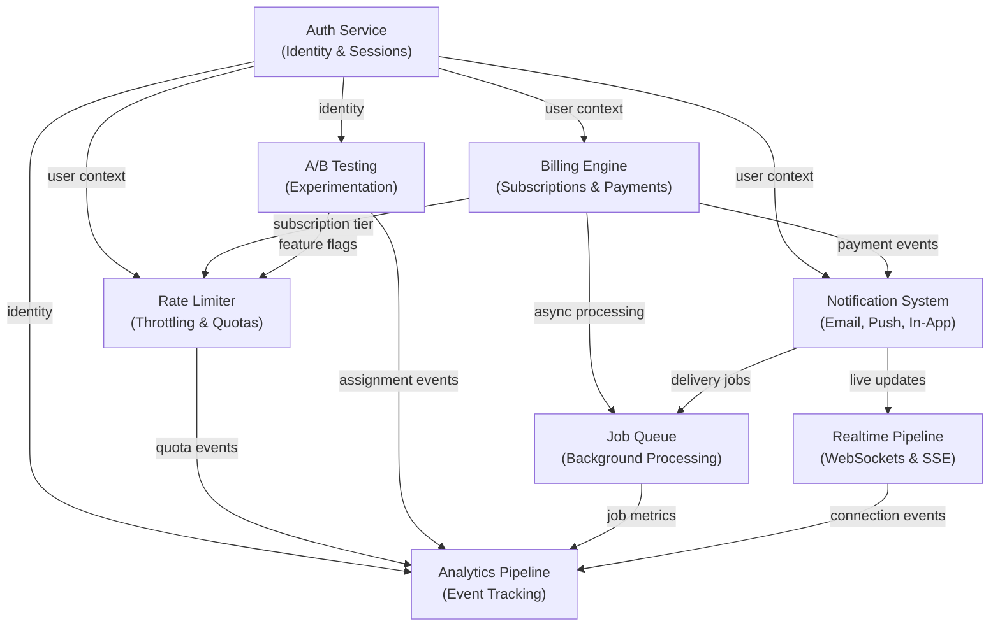

# Production Blueprints

This section is different from everything else in the Knowledge Vault. While other sections teach concepts and patterns, Production Blueprints give you **complete system designs** — the kind of thing a senior engineer would sketch on a whiteboard, then spend weeks turning into production code.

Each blueprint includes a system architecture diagram, data models, API contracts, failure mode analysis, scaling strategy, and deployment configuration. They are not toy examples. They are the systems that run real products.

## Why This Section Exists

Every startup and every team builds the same 8-10 systems: authentication, billing, notifications, real-time features, rate limiting, background jobs, experimentation, and analytics. Yet each team builds them from scratch, making the same mistakes and rediscovering the same solutions.

These blueprints encode collective engineering knowledge. They won't give you copy-paste code for your exact stack, but they will give you something more valuable: **a proven architecture with documented trade-offs** so you can adapt the design to your constraints instead of inventing it blind.

## What Makes a Good Blueprint

Each blueprint in this section follows a consistent structure:

1. **Problem Statement** — What exactly are we solving, and what are the hard requirements?
2. **Architecture Overview** — High-level component diagram with data flow
3. **Data Model** — Schema design with entity relationships and migration strategy
4. **API Design** — REST or GraphQL contracts with error handling patterns
5. **Failure Modes** — What breaks, how you detect it, and how you recover
6. **Scaling Strategy** — How the system evolves from 100 to 100,000 to 10M users
7. **Security Considerations** — Threat model specific to this system
8. **Deployment & Operations** — Infrastructure, monitoring, and runbook

## Blueprint Overview

| Blueprint | Primary Tech Stack | Database | Complexity | Est. Build Time |
|---|---|---|---|---|
| **Auth Service** | Node.js, Passport/Auth.js, JWT, OIDC | PostgreSQL + Redis | High | 3-4 weeks |
| **Billing Engine** | Node.js, Stripe SDK, Webhooks | PostgreSQL | Very High | 4-6 weeks |
| **Notification System** | Node.js, SQS/SNS, FCM/APNs, SendGrid | PostgreSQL + DynamoDB | High | 3-4 weeks |
| **Realtime Pipeline** | Node.js, WebSockets, Redis Pub/Sub | Redis + PostgreSQL | High | 2-3 weeks |
| **Rate Limiter** | Node.js/Go, Redis, Lua scripts | Redis | Medium | 1-2 weeks |
| **Job Queue** | Node.js, BullMQ/Temporal, Redis | Redis + PostgreSQL | Medium-High | 2-3 weeks |
| **A/B Testing** | Node.js, Feature flags, Stats engine | PostgreSQL + ClickHouse | High | 3-4 weeks |
| **Analytics Pipeline** | Node.js, Kafka, ClickHouse | ClickHouse + S3 | Very High | 4-6 weeks |

## System Interconnection

These blueprints are not isolated. In a real product, they interact constantly. Understanding the dependencies helps you decide build order and integration strategy:

## Recommended Build Order

Not all blueprints are equal in terms of dependencies. If you are building a product from scratch, this order minimizes rework:

1. **Auth Service** — Everything depends on identity. Build this first.
2. **Job Queue** — Many systems need async processing. Stand this up early.
3. **Rate Limiter** — Protect your APIs before they go public.
4. **Notification System** — Users need to know things happened.
5. **Realtime Pipeline** — Live updates elevate the user experience.
6. **Billing Engine** — Monetize once you have users.
7. **Analytics Pipeline** — Measure what matters.
8. **A/B Testing** — Optimize once you have enough traffic.

## Learning Path

| Order | Topic | Difficulty | Time |
|-------|-------|------------|------|
| 1 | Auth service blueprint | Advanced | 4 hr |
| 2 | Job queue blueprint | Intermediate | 2.5 hr |
| 3 | Rate limiter blueprint | Intermediate | 2 hr |
| 4 | Notification system blueprint | Advanced | 3.5 hr |
| 5 | Realtime pipeline blueprint | Advanced | 3 hr |
| 6 | Billing engine blueprint | Advanced | 4 hr |
| 7 | Analytics pipeline blueprint | Advanced | 4 hr |
| 8 | A/B testing blueprint | Advanced | 3.5 hr |

## Subsections

- **[Auth Service](/production-blueprints/auth/)** — Session management, OAuth2/OIDC, MFA, and token architecture
- **[Billing Engine](/production-blueprints/billing/)** — Stripe integration, subscription lifecycle, invoicing, and metered billing
- **[Notification System](/production-blueprints/notifications/)** — Multi-channel delivery, preference management, and template rendering
- **[Realtime Pipeline](/production-blueprints/realtime/)** — WebSocket infrastructure, presence, and fan-out patterns
- **[Rate Limiter](/production-blueprints/rate-limiting/)** — Token bucket, sliding window, distributed rate limiting with Redis
- **[Job Queue](/production-blueprints/job-queue/)** — Reliable background processing, retries, dead letter queues, and priorities
- **[A/B Testing](/production-blueprints/ab-testing/)** — Experiment design, assignment, statistical significance, and feature flags
- **[Analytics Pipeline](/production-blueprints/analytics/)** — Event collection, processing, storage, and querying at scale

---

> *"The best architecture is the one you understand completely. Don't adopt a blueprint you can't debug at 3 AM."*
