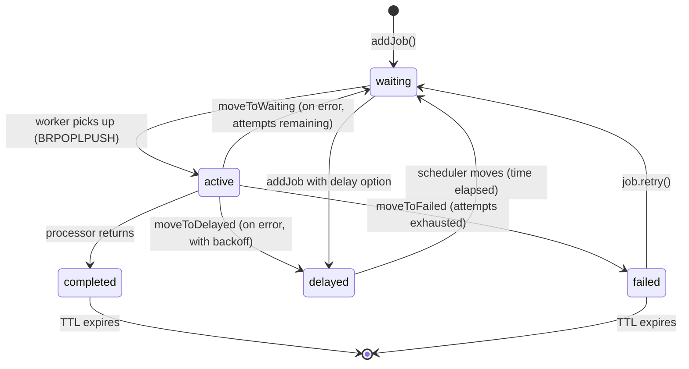
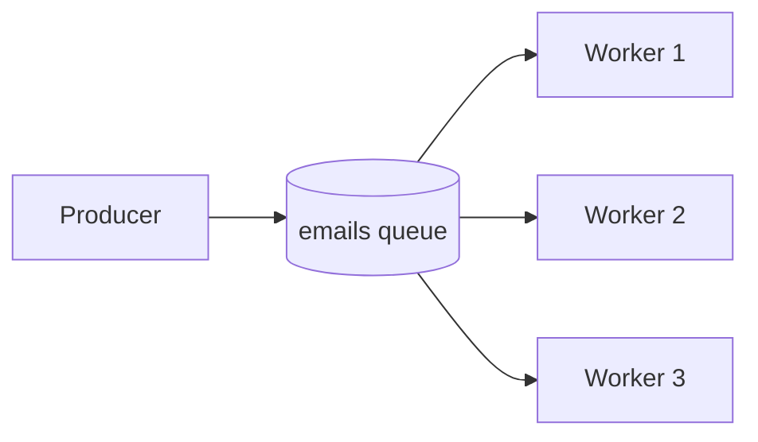
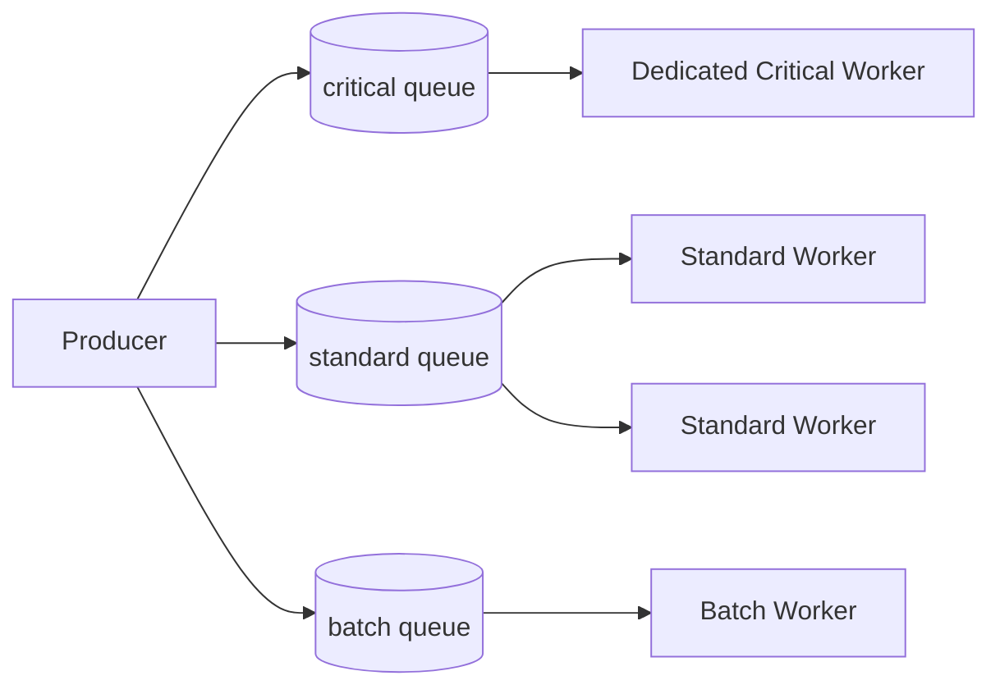
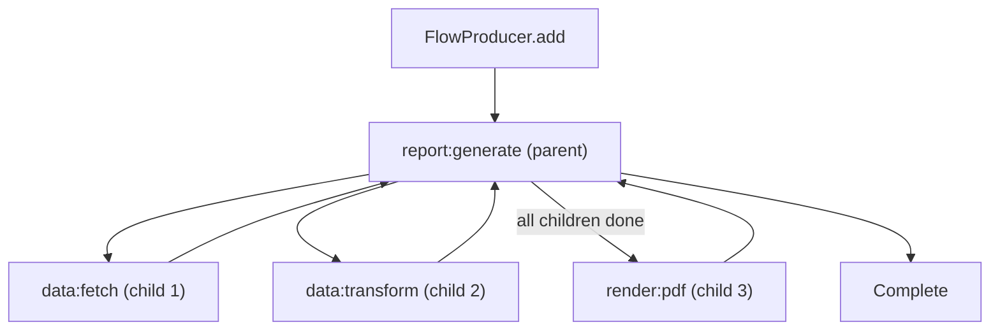
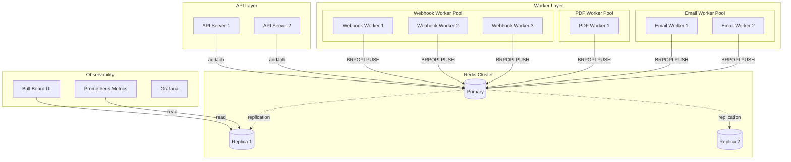
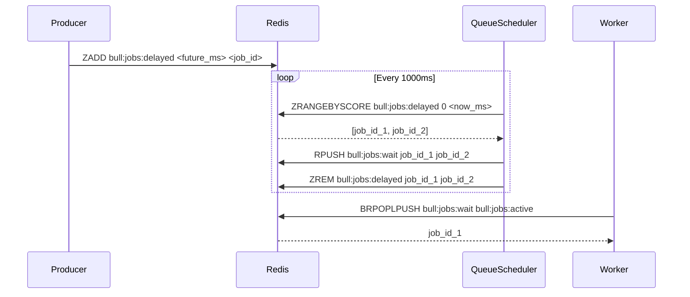
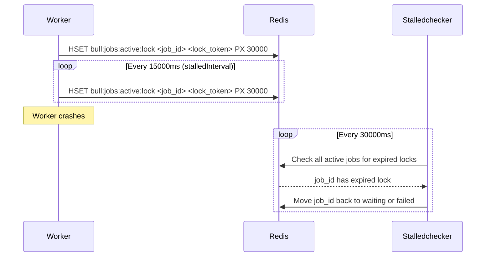

# Job Queue Architecture

## BullMQ's Redis Data Model

BullMQ maps its queue semantics onto Redis primitives. Understanding this mapping is essential for debugging, performance tuning, and operating queues at scale.

### Key Naming Convention

All BullMQ keys follow the pattern `bull:<queue-name>:<key-type>`:

```
bull:emails:id              → String (atomic counter for job IDs)
bull:emails:wait            → List (FIFO queue of waiting job IDs)
bull:emails:active          → List (currently processing job IDs)
bull:emails:delayed         → Sorted Set (jobs waiting for future time, score = unix ms)
bull:emails:priority        → Sorted Set (priority jobs, score = priority * time)
bull:emails:completed       → Sorted Set (completed job IDs, score = completion time)
bull:emails:failed          → Sorted Set (failed job IDs, score = failure time)
bull:emails:paused          → List (jobs in paused state)
bull:emails:meta            → Hash (queue metadata: paused, drained)
bull:emails:events          → Stream (event log: add, process, complete, fail)
bull:emails:<id>            → Hash (job data: name, data, opts, timestamp, etc.)
bull:emails:repeat          → Sorted Set (repeatable job definitions)
```

### Job Lifecycle State Machine



### Redis Operations per Job

**Adding a job:**
```
MULTI
  HSET bull:emails:<id> name "welcome-email" data {...} opts {...} timestamp <ms>
  LPUSH bull:emails:wait <id>
  PUBLISH bull:emails:events "added:<id>"
EXEC
```

**Worker claiming a job (atomic):**
```lua
-- BullMQ uses Lua for atomic claim
local job_id = redis.call('RPOPLPUSH', 'bull:emails:wait', 'bull:emails:active')
if job_id then
  redis.call('HSET', 'bull:emails:' .. job_id, 'processedOn', ARGV[1])
  redis.call('PUBLISH', 'bull:emails:events', 'active:' .. job_id)
end
return job_id
```

**Completing a job:**
```lua
-- Move from active to completed
redis.call('LREM', 'bull:emails:active', 0, job_id)
redis.call('ZADD', 'bull:emails:completed', timestamp, job_id)
redis.call('HSET', 'bull:emails:' .. job_id, 'finishedOn', timestamp, 'returnvalue', result)
-- Apply TTL if configured
if ttl > 0 then
  redis.call('EXPIRE', 'bull:emails:' .. job_id, ttl)
end
```

## Queue Topology Patterns

### Single Queue, Multiple Workers

The simplest topology. All workers compete for jobs from a single queue.



```typescript
import { Queue, Worker } from 'bullmq';
import Redis from 'ioredis';

const connection = { host: 'localhost', port: 6379 };

// One queue, three workers (could be on separate machines)
const workers = Array.from({ length: 3 }, (_, i) =>
  new Worker('emails', processEmail, {
    connection,
    concurrency: 10, // Each worker handles 10 jobs concurrently
  })
);
```

**Use when:** Job types are homogeneous, workers are identical.

### Multiple Queues by Priority/Type

Separate queues for different job types allow independent scaling and prioritization.



```typescript
// Critical jobs get dedicated high-concurrency workers
const criticalWorker = new Worker('critical', processCritical, {
  connection,
  concurrency: 20,
  limiter: { max: 100, duration: 1000 }, // max 100/s
});

// Standard jobs
const standardWorkers = Array.from({ length: 4 }, () =>
  new Worker('standard', processStandard, {
    connection,
    concurrency: 5,
  })
);

// Batch jobs throttled to avoid overwhelming downstream
const batchWorker = new Worker('batch', processBatch, {
  connection,
  concurrency: 2,
  limiter: { max: 10, duration: 1000 }, // max 10/s
});
```

### Flow Queues (Job Dependencies)

BullMQ v2+ supports job flows: a parent job that completes only after all children complete.



```typescript
import { FlowProducer } from 'bullmq';

const flow = new FlowProducer({ connection });

const report = await flow.add({
  name: 'generate-report',
  queueName: 'reports',
  data: { reportId: 'rpt-123' },
  children: [
    {
      name: 'fetch-data',
      queueName: 'data-fetch',
      data: { source: 'postgres', query: 'SELECT ...' },
    },
    {
      name: 'fetch-metadata',
      queueName: 'data-fetch',
      data: { source: 'elasticsearch' },
    },
  ],
});

// The 'generate-report' job waits for all children before processing
```

## Production Architecture

### Multi-Service Queue Architecture



### Queue Setup Code

```typescript
// src/queues/setup.ts
import { Queue, QueueScheduler, QueueEvents } from 'bullmq';
import Redis from 'ioredis';

export interface QueueConfig {
  name: string;
  defaultJobOptions?: {
    attempts?: number;
    backoff?: { type: 'exponential' | 'fixed'; delay: number };
    removeOnComplete?: number | boolean;
    removeOnFail?: number | boolean;
    timeout?: number;
  };
}

const QUEUE_CONFIGS: QueueConfig[] = [
  {
    name: 'emails',
    defaultJobOptions: {
      attempts: 3,
      backoff: { type: 'exponential', delay: 2000 },
      removeOnComplete: 100,  // Keep last 100 completed
      removeOnFail: 500,      // Keep last 500 failed for debugging
      timeout: 30_000,        // 30s max per job
    },
  },
  {
    name: 'pdf-generation',
    defaultJobOptions: {
      attempts: 2,
      backoff: { type: 'fixed', delay: 5000 },
      removeOnComplete: 50,
      removeOnFail: 200,
      timeout: 300_000,       // 5 minutes for PDF
    },
  },
  {
    name: 'webhooks',
    defaultJobOptions: {
      attempts: 5,
      backoff: { type: 'exponential', delay: 1000 },
      removeOnComplete: 500,
      removeOnFail: 1000,
      timeout: 15_000,
    },
  },
];

export class QueueRegistry {
  private queues = new Map<string, Queue>();
  private schedulers = new Map<string, QueueScheduler>();
  private events = new Map<string, QueueEvents>();

  constructor(private connection: Redis) {}

  async initialize(): Promise<void> {
    for (const config of QUEUE_CONFIGS) {
      const queue = new Queue(config.name, {
        connection: this.connection,
        defaultJobOptions: config.defaultJobOptions,
      });

      // QueueScheduler is required for delayed jobs and retries
      const scheduler = new QueueScheduler(config.name, {
        connection: this.connection,
      });

      // QueueEvents for monitoring
      const queueEvents = new QueueEvents(config.name, {
        connection: this.connection,
      });

      this.queues.set(config.name, queue);
      this.schedulers.set(config.name, scheduler);
      this.events.set(config.name, queueEvents);

      // Setup event listeners for monitoring
      queueEvents.on('completed', ({ jobId, returnvalue }) => {
        console.log(`[${config.name}] Job ${jobId} completed`);
      });

      queueEvents.on('failed', ({ jobId, failedReason }) => {
        console.error(`[${config.name}] Job ${jobId} failed: ${failedReason}`);
      });

      queueEvents.on('stalled', ({ jobId }) => {
        console.warn(`[${config.name}] Job ${jobId} stalled — worker died?`);
      });
    }
  }

  getQueue(name: string): Queue {
    const queue = this.queues.get(name);
    if (!queue) throw new Error(`Queue not found: ${name}`);
    return queue;
  }

  async shutdown(): Promise<void> {
    await Promise.all([
      ...Array.from(this.queues.values()).map((q) => q.close()),
      ...Array.from(this.schedulers.values()).map((s) => s.close()),
      ...Array.from(this.events.values()).map((e) => e.close()),
    ]);
  }
}
```

## Delayed Jobs and the QueueScheduler

The `QueueScheduler` is a BullMQ process that moves delayed jobs to the waiting queue when their time arrives. It uses a polling loop:



::: warning
**One QueueScheduler per queue, not per process.** If you run multiple QueueSchedulers for the same queue (e.g., one per API server instance), they compete and may duplicate job promotions. Run the scheduler as a dedicated process or use Redis locks to ensure only one is active.

BullMQ v4+ merged QueueScheduler into the Worker. Upgrade if you can.
:::

## Job Data and Serialization

### Schema Design

Job data is serialized to JSON and stored in Redis. Keep it minimal:

```typescript
// GOOD: Store IDs, fetch data in worker
interface EmailJobData {
  userId: string;
  templateId: string;
  triggeredBy: 'signup' | 'purchase' | 'reset';
}

// BAD: Store full objects
interface EmailJobDataBad {
  user: {
    id: string;
    email: string;
    name: string;
    preferences: Record<string, unknown>;
    billingInfo: Record<string, unknown>;
  };
  // Large objects waste Redis memory and serialization time
}
```

**Why IDs over objects:**
1. Data may change between enqueue and processing — fetch fresh data in the worker
2. Large job payloads (> 1MB) are slow to serialize/deserialize
3. Sensitive data in job payloads appears in logs, monitoring UIs

### TypeScript Job Type Safety

```typescript
// src/queues/types.ts
import type { Job } from 'bullmq';

// Define all job types
export interface EmailJobData {
  userId: string;
  templateId: string;
  triggeredBy: string;
}

export interface PdfJobData {
  reportId: string;
  format: 'a4' | 'letter';
  includeCharts: boolean;
}

export interface WebhookJobData {
  webhookId: string;
  eventType: string;
  payload: Record<string, unknown>;
  targetUrl: string;
}

// Discriminated union of all jobs
export type JobDataMap = {
  'send-email': EmailJobData;
  'generate-pdf': PdfJobData;
  'send-webhook': WebhookJobData;
};

// Typed job accessor
export type TypedJob<T extends keyof JobDataMap> = Job<JobDataMap[T]>;

// Processor type
export type JobProcessor<T extends keyof JobDataMap> = (
  job: TypedJob<T>
) => Promise<unknown>;
```

## Stalled Jobs

When a worker crashes mid-job, the job remains in the `active` list indefinitely — a "stalled" job. BullMQ detects stalled jobs by having workers renew a "lock" in Redis every `stalledInterval` milliseconds.



```typescript
const worker = new Worker('jobs', processor, {
  connection,
  stalledInterval: 30_000,    // Check for stalled jobs every 30s
  maxStalledCount: 2,         // Allow 2 stall recoveries before marking failed
  lockDuration: 30_000,       // Lock TTL: worker must renew within this time
  lockRenewTime: 15_000,      // Renew lock every 15s
});
```

## Redis Memory Management

### Completed/Failed Job Retention

Without limits, completed and failed jobs accumulate indefinitely. Configure TTLs:

```typescript
await queue.add('process', data, {
  removeOnComplete: {
    count: 1000,    // Keep last 1000 completed jobs
    age: 86400,     // Remove completed jobs older than 24h
  },
  removeOnFail: {
    count: 5000,    // Keep last 5000 failed jobs
    age: 604800,    // Remove failed jobs older than 7 days
  },
});
```

### Memory Estimation

```typescript
// Estimate Redis memory for queue sizing
function estimateQueueMemory(params: {
  avgJobDataBytes: number;
  throughputPerSecond: number;
  avgProcessingSeconds: number;
  retainCompleted: number;
  retainFailed: number;
}): { activeBytes: number; completedBytes: number; totalMB: number } {
  const { avgJobDataBytes, throughputPerSecond, avgProcessingSeconds, retainCompleted, retainFailed } = params;

  // Jobs in active state at any time
  const activeJobs = throughputPerSecond * avgProcessingSeconds;

  // Per-job overhead: key name (50 bytes) + hash fields (200 bytes) + data
  const perJobBytes = 250 + avgJobDataBytes;

  const activeBytes = activeJobs * perJobBytes;
  const completedBytes = retainCompleted * perJobBytes;
  const failedBytes = retainFailed * perJobBytes;

  const totalBytes = activeBytes + completedBytes + failedBytes;

  return {
    activeBytes,
    completedBytes,
    totalMB: Math.ceil(totalBytes / 1024 / 1024),
  };
}

// Example: 100 req/s, 500 bytes/job, 2s avg processing
const estimate = estimateQueueMemory({
  avgJobDataBytes: 500,
  throughputPerSecond: 100,
  avgProcessingSeconds: 2,
  retainCompleted: 1000,
  retainFailed: 5000,
});
// totalMB ≈ 4 MB — Redis memory is not the constraint
```

## Performance Characteristics

### Throughput Limits

| Scenario | Jobs/second | Notes |
|----------|------------|-------|
| Single Redis, single worker | 1,000–2,000 | Network bound |
| Single Redis, 10 workers | 5,000–10,000 | Redis CPU bound |
| Redis Cluster, 10 workers | 20,000–50,000 | Horizontal scale |
| With job data > 1KB | 30–40% lower | Serialization overhead |

### Latency from Enqueue to Processing

| Queue depth | Pickup latency | Notes |
|-------------|---------------|-------|
| Empty | < 1ms | BRPOPLPUSH is O(1) |
| 1,000 jobs | < 5ms | Still O(1) |
| 100,000 jobs | < 10ms | Redis list ops are O(1) |
| Delayed jobs | ±100ms | QueueScheduler polling interval |

The pickup latency is nearly constant regardless of queue depth because Redis lists are O(1) for push/pop. This is a key advantage over database-backed queues (PostgreSQL advisory locks are O(log n)).

::: info War Story
**The Runaway QueueScheduler**

A team deployed their API servers with QueueScheduler embedded in each server process. With 8 API servers, they had 8 QueueSchedulers competing over the same queues.

The symptom: jobs were processed multiple times. A user would receive 8 welcome emails. The cause: each scheduler independently detected a delayed job ready to be promoted, and all 8 raced to RPUSH it to the wait queue. BullMQ's Lua scripts aren't atomic across the scheduler-move and worker-claim operations.

The fix: a dedicated scheduler service running as a single replica, separate from the API servers. This is now documented prominently in BullMQ's migration guides.
:::

## Mathematical Foundations

### Queue Depth at Steady State (Little's Law)

Given arrival rate $\lambda$ (jobs/second) and service rate $\mu$ (jobs/second per worker):

$$L = \lambda \cdot W$$

where $L$ is average queue length and $W$ is average time in system.

$$W = \frac{1}{\mu - \lambda} \text{ (for M/M/1 queue)}$$

For a system with $c$ workers (M/M/c):

$$\rho = \frac{\lambda}{c \cdot \mu}$$

The system is stable only when $\rho < 1$. At $\rho = 0.8$, queue depth grows linearly. At $\rho > 0.95$, queue depth grows exponentially.

**Practical implication:** If your queue depth is growing, you have $\lambda > c \cdot \mu$. Either:
1. Increase worker count ($c$)
2. Reduce processing time per job (increase $\mu$)
3. Reduce incoming rate with backpressure

### Optimal Worker Concurrency

For I/O-bound workers (most cases):

$$c_{opt} = \frac{\text{target latency}}{\text{avg I/O wait time}}$$

Example: target 500ms job latency, 50ms avg I/O wait:

$$c_{opt} = \frac{500}{50} = 10 \text{ concurrent jobs per worker}$$

For CPU-bound workers:

$$c_{opt} = \text{CPU cores} - 1$$

Never set concurrency > CPU cores for CPU-bound work — context switching overhead dominates.
