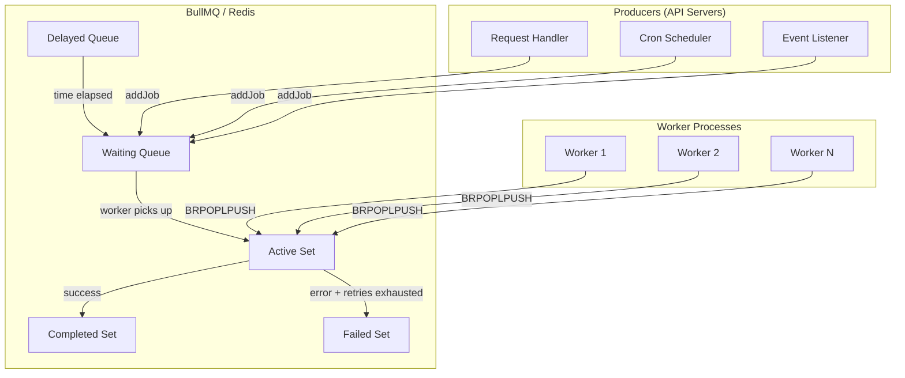
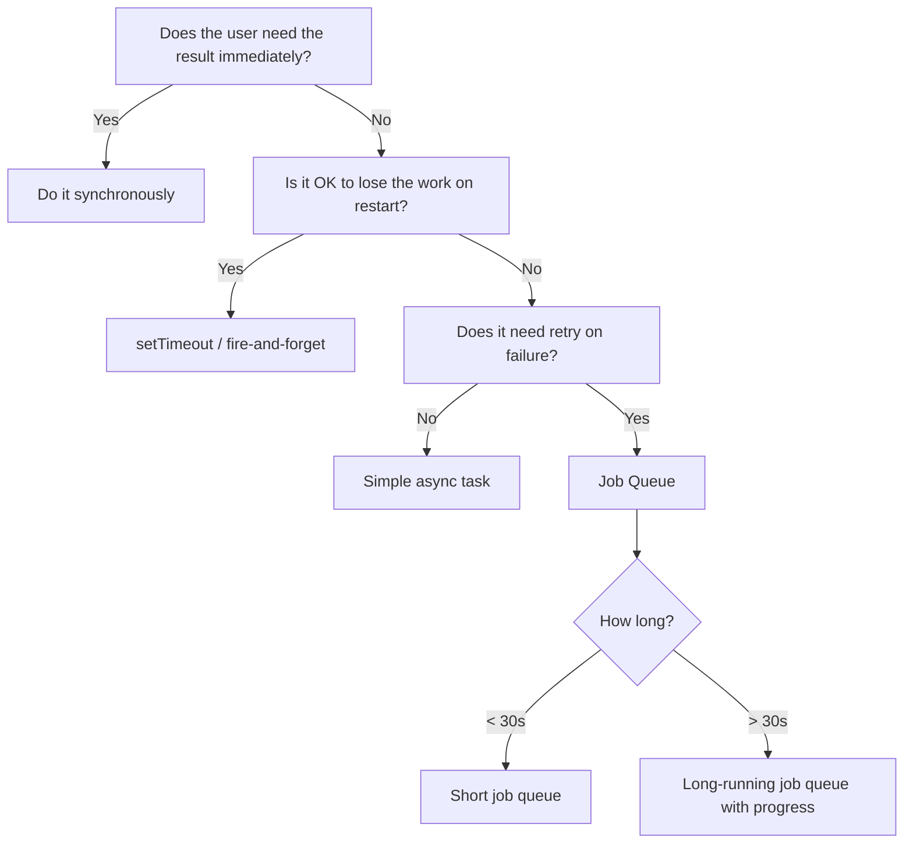

# Job Queue System

## The Problem Queues Solve

HTTP request handlers have a hard constraint: the client is waiting. Every millisecond the handler runs is a millisecond of user-perceived latency. Yet many operations are inherently slow, unreliable, or shouldn't block the user:

- Sending a welcome email (200–800ms, depends on external SMTP)
- Generating a PDF report (2–30 seconds)
- Resizing uploaded images (500ms–5s per image)
- Sending webhooks to customer endpoints (potentially timed out or unreachable)
- Indexing content in Elasticsearch (100ms–2s)
- Charging a credit card (300ms–3s, with retries)

Without a queue, you have three bad options:
1. **Do it synchronously** — user waits, timeouts occur, server threads are exhausted
2. **Fire and forget (`setTimeout`)** — no retries, no observability, lost on server restart
3. **Spawn a child process** — no persistence, no retry, no backpressure

A job queue gives you:
- **Persistence** — jobs survive server restarts (stored in Redis)
- **Retries** — automatic retry with configurable backoff on failure
- **Observability** — queue depth, processing rates, failure tracking
- **Backpressure** — workers control their own concurrency
- **Scheduling** — delayed jobs, cron-style repeating jobs

## Architecture Overview



## Why BullMQ

BullMQ is the modern rewrite of the original Bull library. Key improvements:

| Feature | Bull | BullMQ |
|---------|------|--------|
| TypeScript support | External types | First-class |
| Job dependencies | No | Yes (flows) |
| Sandboxed workers | Limited | Full |
| Cluster support | Problematic | Robust |
| Telemetry hooks | None | OpenTelemetry |
| Maintenance | Limited | Active |

BullMQ uses Redis data structures directly:
- **Sorted sets** for delayed and priority queues (scored by timestamp/priority)
- **Lists** for waiting/active job queues (FIFO)
- **Hashes** for job data and metadata
- **Streams** for event publishing

## When to Use a Job Queue



**Use a job queue when:**
- Work takes > 200ms
- Work can fail and needs retry
- Work must not be lost on restart
- Work needs to be scheduled in the future
- Work rate needs to be controlled (don't overwhelm downstream services)
- Work needs observability (how many pending, failed, succeeded?)

**Don't use a job queue when:**
- Work is < 50ms and rarely fails (in-process async is fine)
- Work needs a synchronous response (use caching instead)
- You need sub-millisecond scheduling (use `setImmediate`)

## Section Contents

This section covers the complete job queue system:

| Page | Topics |
|------|--------|
| [Architecture](./architecture) | BullMQ internals, Redis data structures, queue topology |
| [Worker Patterns](./worker-patterns) | Concurrency models, sandboxed workers, TypeScript workers |
| [Retry Strategies](./retry-strategies) | Exponential backoff, dead letter queues, poison pills |
| [Priority Queues](./priority-queues) | Priority levels, starvation prevention, weighted fair queuing |
| [Monitoring](./monitoring) | Queue depth metrics, Prometheus, Grafana, alerting |

## Quick Start

```typescript
import { Queue, Worker } from 'bullmq';
import Redis from 'ioredis';

const connection = new Redis({ host: 'localhost', port: 6379 });

// Producer: add jobs
const emailQueue = new Queue('emails', { connection });

await emailQueue.add('welcome-email', {
  to: 'user@example.com',
  template: 'welcome',
  userId: '123',
});

// Consumer: process jobs
const worker = new Worker(
  'emails',
  async (job) => {
    const { to, template, userId } = job.data;
    await sendEmail({ to, template, userId });
    return { sent: true, timestamp: Date.now() };
  },
  {
    connection,
    concurrency: 5,
  }
);

worker.on('completed', (job, result) => {
  console.log(`Job ${job.id} completed:`, result);
});

worker.on('failed', (job, error) => {
  console.error(`Job ${job?.id} failed:`, error.message);
});
```

## Production Checklist

Before going to production, verify:

- [ ] Redis persistence enabled (`appendonly yes` or RDB snapshots)
- [ ] Worker concurrency tuned to available CPU/IO
- [ ] Dead letter queue configured for failed jobs
- [ ] Queue depth alerting set up
- [ ] Worker health checks implemented
- [ ] Graceful shutdown handling (drain in-progress jobs)
- [ ] Job TTL configured (don't accumulate completed jobs indefinitely)
- [ ] Separate Redis instance from session/cache Redis

::: tip
Use a separate Redis instance (or at minimum a separate database number) for job queues. Queue operations generate significant write volume that can interfere with cache hit rates.
:::

::: warning
BullMQ requires Redis 5.0+. For production, use Redis 6.2+ for ACL support, and Redis 7+ for better memory efficiency with sorted sets.
:::
