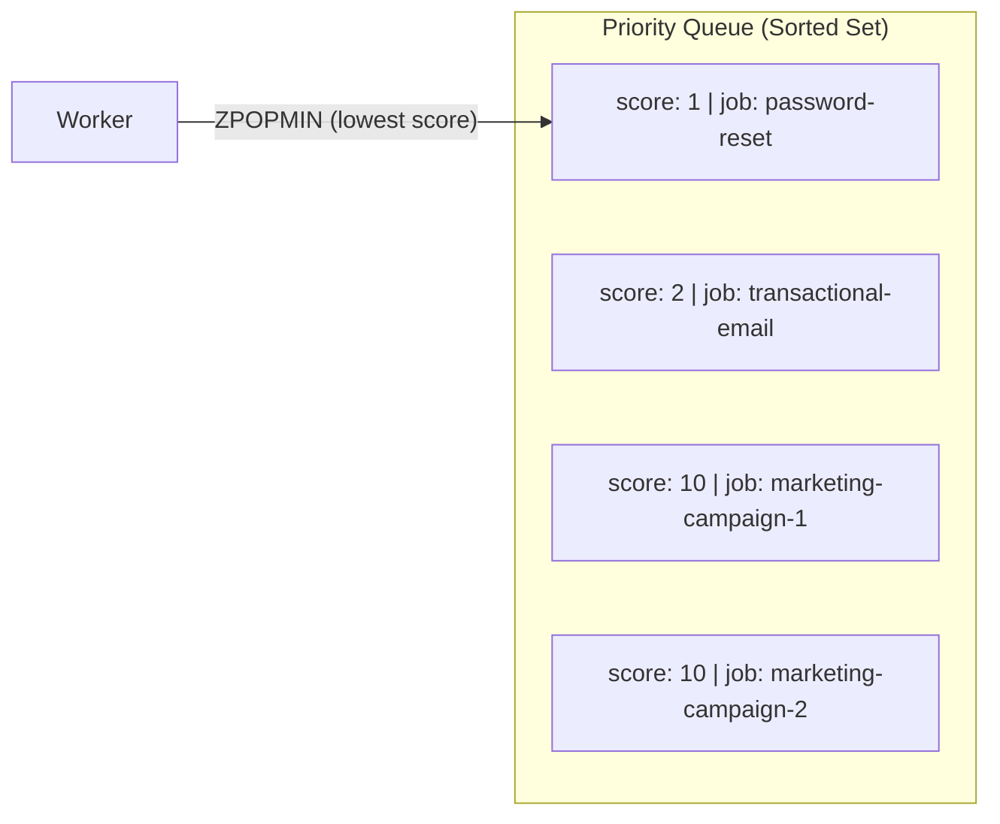
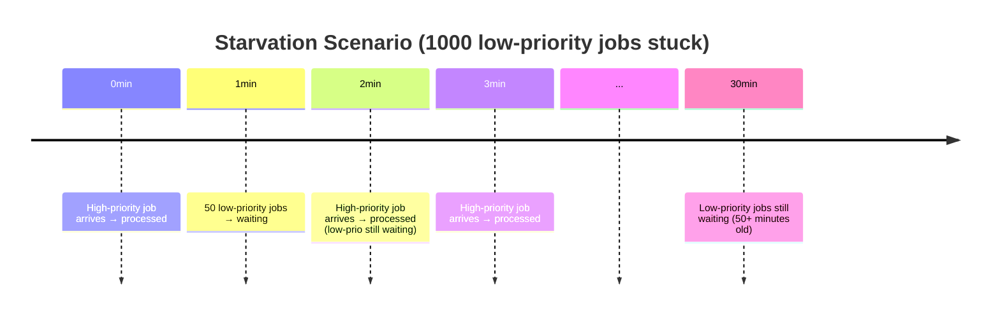
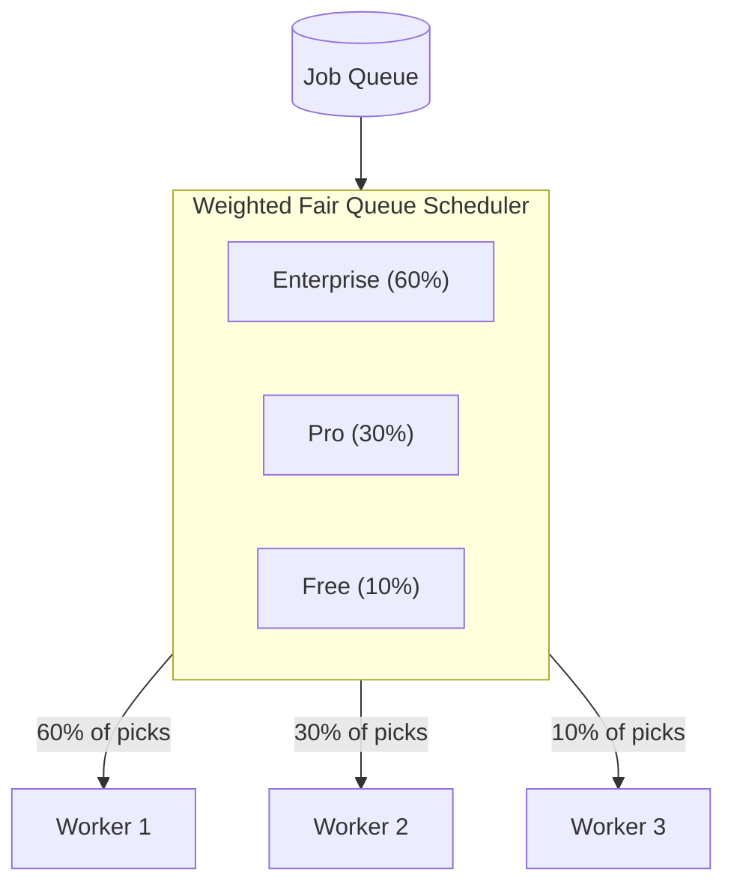

# Priority Queues

## The Priority Problem

Standard FIFO queues process jobs in arrival order. When all jobs are equally important, this is correct. In practice, jobs have different business value:

- A password reset email should not wait behind 10,000 marketing emails
- A paying customer's export should not wait behind a free tier user's export
- A critical system alert should not wait behind routine health checks

Priority queues solve this by assigning a numeric priority to each job and processing higher-priority jobs first.

## BullMQ Priority Implementation

BullMQ implements priority using a Redis sorted set where the score determines processing order. Lower score = higher priority (processed first).



### Adding Priority Jobs

```typescript
import { Queue } from 'bullmq';

const queue = new Queue('emails', { connection });

// Priority 1 (highest) — processed immediately
await queue.add(
  'password-reset',
  { userId: 'user-123', type: 'password_reset' },
  { priority: 1 }
);

// Priority 5 — standard transactional
await queue.add(
  'order-confirmation',
  { orderId: 'order-456' },
  { priority: 5 }
);

// Priority 10 — marketing/bulk
await queue.add(
  'newsletter',
  { campaignId: 'camp-789', batchId: 42 },
  { priority: 10 }
);
```

::: warning
**BullMQ priority is a separate sorted set.** Priority jobs don't mix with FIFO jobs by default. If you have some jobs with priority and some without, the priority queue is consulted first. This means non-priority jobs may starve if the priority queue is never empty.

Set `priority` explicitly on all jobs, or use separate queues for different priority tiers.
:::

### Priority Constants

```typescript
// src/queues/priorities.ts

export const PRIORITY = {
  CRITICAL: 1,      // System alerts, security events
  HIGH: 3,          // Password reset, account actions
  STANDARD: 5,      // Transactional emails, order confirmations
  LOW: 7,           // Non-critical notifications
  BULK: 10,         // Marketing, newsletters, batch processing
} as const;

export type PriorityLevel = typeof PRIORITY[keyof typeof PRIORITY];

// Helper: determine priority from job type
export function getPriority(jobType: string): PriorityLevel {
  const priorityMap: Record<string, PriorityLevel> = {
    'password-reset': PRIORITY.CRITICAL,
    'account-verification': PRIORITY.HIGH,
    'order-confirmation': PRIORITY.STANDARD,
    'shipping-notification': PRIORITY.STANDARD,
    'weekly-digest': PRIORITY.LOW,
    'newsletter': PRIORITY.BULK,
    'marketing-campaign': PRIORITY.BULK,
  };

  return priorityMap[jobType] ?? PRIORITY.STANDARD;
}
```

## Starvation: The Priority Queue's Greatest Risk

**Starvation** occurs when low-priority jobs never get processed because higher-priority jobs arrive continuously. In a system where marketing emails are always arriving, password-reset emails might be processed immediately, but the marketing emails never move.



### Starvation Prevention: Priority Aging

The classic solution is **aging**: gradually increase a job's effective priority the longer it waits. A job that started at priority 10 becomes priority 9 after 30 seconds, priority 8 after 60 seconds, etc.

BullMQ doesn't implement aging natively. Implement it with a scheduled job:

```typescript
// src/queues/priority-aging.ts
import { Queue, Job } from 'bullmq';
import Redis from 'ioredis';

interface AgingConfig {
  queueName: string;
  checkIntervalMs: number;    // How often to run the aging pass
  agingRateMs: number;        // How long before priority increases by 1
  minPriority: number;        // Don't age below this priority
}

export class PriorityAger {
  constructor(
    private redis: Redis,
    private config: AgingConfig
  ) {}

  start(): NodeJS.Timeout {
    return setInterval(
      () => this.runAgingPass(),
      this.config.checkIntervalMs
    );
  }

  private async runAgingPass(): Promise<void> {
    const queue = new Queue(this.config.queueName, { connection: this.redis });
    const waitingJobs = await queue.getWaiting(0, 1000);

    const now = Date.now();
    let aged = 0;

    for (const job of waitingJobs) {
      const waitingMs = now - job.timestamp;
      const agingSteps = Math.floor(waitingMs / this.config.agingRateMs);

      if (agingSteps === 0) continue;
      if (!job.opts.priority) continue;

      const currentPriority = job.opts.priority;
      const newPriority = Math.max(
        this.config.minPriority,
        currentPriority - agingSteps
      );

      if (newPriority < currentPriority) {
        // Update priority (requires remove + re-add in BullMQ)
        await job.changePriority({ priority: newPriority });
        aged++;
      }
    }

    if (aged > 0) {
      console.log(`[PriorityAger] Aged ${aged} jobs in ${this.config.queueName}`);
    }
  }
}

// Usage:
const ager = new PriorityAger(redis, {
  queueName: 'emails',
  checkIntervalMs: 30_000,   // Run every 30 seconds
  agingRateMs: 60_000,       // Priority increases by 1 every minute
  minPriority: 1,            // Cannot age above priority 1 (highest)
});

const agerInterval = ager.start();

// Cleanup on shutdown
process.on('SIGTERM', () => clearInterval(agerInterval));
```

### Starvation Prevention: Separate Queue per Tier

A simpler approach: use separate queues with dedicated workers that guarantee minimum throughput:

```typescript
// src/workers/tiered-workers.ts
import { Worker } from 'bullmq';

// Critical: 5 dedicated workers, always processing
const criticalWorkers = Array.from({ length: 5 }, () =>
  new Worker('emails-critical', processEmail, { connection, concurrency: 10 })
);

// Standard: 3 workers
const standardWorkers = Array.from({ length: 3 }, () =>
  new Worker('emails-standard', processEmail, { connection, concurrency: 10 })
);

// Bulk: 1 worker — can process slowly, that's OK
const bulkWorker = new Worker('emails-bulk', processEmail, {
  connection,
  concurrency: 5,
  limiter: { max: 100, duration: 1000 }, // Rate-limited
});
```

This guarantees critical emails are processed (5 workers × 10 concurrency = 50 parallel critical jobs) even when bulk queues are saturated. The trade-off is resource allocation is fixed, not dynamic.

## Weighted Fair Queuing

Weighted Fair Queuing (WFQ) gives each tenant/customer a share of processing capacity proportional to their tier, while allowing unused capacity to be shared.



### WFQ Implementation

```typescript
// src/queues/weighted-fair-queue.ts
import { Queue } from 'bullmq';
import Redis from 'ioredis';

interface WFQTier {
  name: string;
  weight: number;   // Relative weight (enterprise: 6, pro: 3, free: 1)
  queueName: string;
}

interface WFQState {
  tier: string;
  virtualTime: number;  // Virtual clock for fair scheduling
}

export class WeightedFairQueue {
  private queues: Map<string, Queue>;
  private virtualClocks: Map<string, number> = new Map();
  private totalWeight: number;

  constructor(
    private redis: Redis,
    private tiers: WFQTier[]
  ) {
    this.queues = new Map(
      tiers.map((t) => [t.name, new Queue(t.queueName, { connection: redis })])
    );
    this.totalWeight = tiers.reduce((sum, t) => sum + t.weight, 0);
    tiers.forEach((t) => this.virtualClocks.set(t.name, 0));
  }

  // Add a job to the appropriate tier queue
  async addJob(
    tierName: string,
    jobName: string,
    data: unknown,
    options?: object
  ): Promise<string> {
    const queue = this.queues.get(tierName);
    if (!queue) throw new Error(`Unknown tier: ${tierName}`);

    const job = await queue.add(jobName as string, data, options ?? {});
    return job.id!;
  }

  // Pick the next job to process, respecting weights
  // This is called by a custom scheduler (not BullMQ's default)
  async pickNextJob(): Promise<{ tier: string; jobId: string } | null> {
    // Find the tier with the lowest virtual clock (most behind schedule)
    let selectedTier: WFQTier | null = null;
    let lowestVirtualTime = Infinity;

    for (const tier of this.tiers) {
      const queue = this.queues.get(tier.name)!;
      const waiting = await queue.getWaitingCount();

      if (waiting === 0) continue;

      const virtualTime = this.virtualClocks.get(tier.name)! / tier.weight;

      if (virtualTime < lowestVirtualTime) {
        lowestVirtualTime = virtualTime;
        selectedTier = tier;
      }
    }

    if (!selectedTier) return null;

    // Increment virtual clock for selected tier
    const currentVt = this.virtualClocks.get(selectedTier.name)!;
    this.virtualClocks.set(selectedTier.name, currentVt + 1);

    const queue = this.queues.get(selectedTier.name)!;
    const jobs = await queue.getWaiting(0, 0);

    if (jobs.length === 0) return null;

    return { tier: selectedTier.name, jobId: jobs[0].id! };
  }
}

// Example usage: API assigns jobs to tier queues
const wfq = new WeightedFairQueue(redis, [
  { name: 'enterprise', weight: 6, queueName: 'exports-enterprise' },
  { name: 'pro', weight: 3, queueName: 'exports-pro' },
  { name: 'free', weight: 1, queueName: 'exports-free' },
]);

// Assign to tier based on user's subscription
async function enqueueExport(userId: string, reportConfig: object) {
  const user = await db.user.findUnique({ where: { id: userId } });
  const tier = user?.subscription ?? 'free';
  return wfq.addJob(tier, 'generate-report', { userId, ...reportConfig });
}
```

### Simpler WFQ: Priority-Based Encoding

BullMQ's priority numbers can encode WFQ by mapping tier + queue position to a composite score:

$$\text{score} = (\text{base\_priority\_by\_tier}) + (\text{arrival\_time\_normalized})$$

```typescript
// Encode WFQ using BullMQ's priority field
function calculateWFQPriority(
  tier: 'enterprise' | 'pro' | 'free',
  arrivalMs: number
): number {
  const tierBase: Record<string, number> = {
    enterprise: 0,      // 0–9999
    pro: 10000,         // 10000–19999
    free: 20000,        // 20000–29999
  };

  // Within tier, earlier arrivals have lower (better) priority
  // Normalize: 1 priority unit per 100ms wait
  const timeComponent = Math.floor((arrivalMs - Date.now()) / 100);

  return tierBase[tier] + Math.abs(timeComponent);
}

// Higher numbers = lower priority in BullMQ
await queue.add('export', data, {
  priority: calculateWFQPriority('pro', Date.now()),
});
```

## Real-Time Priority Adjustment

Sometimes priority must change after a job is added — a user upgrades their subscription, or a job is flagged as urgent:

```typescript
// BullMQ v3+ supports changePriority
async function upgradeJobPriority(
  queue: Queue,
  jobId: string,
  newPriority: number
): Promise<void> {
  const job = await queue.getJob(jobId);
  if (!job) throw new Error(`Job ${jobId} not found`);

  if (job.opts.priority === newPriority) return;

  await job.changePriority({ priority: newPriority });

  console.log(`Job ${jobId} priority changed from ${job.opts.priority} to ${newPriority}`);
}

// Example: user upgrades subscription during a pending export
async function onUserUpgrade(userId: string) {
  const pendingJobs = await findPendingJobsForUser(userId, 'exports');

  for (const jobId of pendingJobs) {
    await upgradeJobPriority(exportQueue, jobId, PRIORITY.HIGH);
  }
}
```

## Performance Characteristics

### Priority Queue vs FIFO Performance

| Metric | FIFO List | Priority Sorted Set |
|--------|-----------|---------------------|
| Enqueue | O(1) LPUSH | O(log N) ZADD |
| Dequeue | O(1) RPOPLPUSH | O(log N) ZPOPMIN |
| Peek | O(1) LINDEX | O(log N) ZRANGEBYSCORE |
| Memory | ~50 bytes/job | ~120 bytes/job |

Priority queues have O(log N) enqueue/dequeue vs O(1) for FIFO. At 100,000 jobs in queue, this is:
- FIFO: ~0.001ms per operation
- Priority: ~0.017ms per operation (log₂(100000) ≈ 17 steps)

This difference is negligible in practice — network I/O to Redis dominates.

### Benchmarks: Priority Under Load

Testing: 10,000 bulk jobs, 100 critical jobs added over 60 seconds.

| Configuration | Critical job avg latency | Bulk job avg latency |
|--------------|------------------------|---------------------|
| Single FIFO queue | 45.3s | 42.1s |
| Priority queue (no starvation) | 0.8s | 89.4s |
| Dedicated queues by tier | 0.4s | 91.2s |
| WFQ (6:3:1 weights) | 1.2s | 45.8s |

Key insight: Priority queues dramatically improve critical job latency but can cause severe starvation. WFQ balances both but has higher implementation complexity.

## Mathematical Foundations

### Head-of-Line Blocking

In a pure priority queue, the expected wait time for a job of class $k$ is:

$$W_k = \frac{\rho_k / \mu_k}{(1 - \sigma_{k-1})(1 - \sigma_k)}$$

where $\sigma_k = \sum_{i=1}^{k} \rho_i$ is the cumulative utilization of all classes with priority $\leq k$, and $\rho_i = \lambda_i / \mu_i$ is the utilization of class $i$.

This shows that low-priority classes experience wait time that grows with the arrival rate of higher-priority classes — the mathematical basis of starvation.

### Aging Rate Calculation

To guarantee a low-priority job is processed within $T_{max}$ seconds, with aging rate $r$ (priority decreases by 1 per second of waiting) and initial priority $P_{low}$, high priority $P_{high}$:

$$T_{max} = \frac{P_{low} - P_{high}}{r}$$

To guarantee processing within 5 minutes (300s), with $P_{low} = 10$, $P_{high} = 1$:

$$r = \frac{10 - 1}{300} = 0.03 \text{ priority/second} = 1 \text{ priority per 33 seconds}$$

Set aging interval to 30 seconds with decrement 1 to achieve this bound.

::: info War Story
**When Marketing Killed the Help Desk**

A SaaS company queued both transactional emails and marketing campaigns in the same BullMQ queue with no priority configuration. Their marketing team launched a holiday campaign: 2.3 million emails queued simultaneously.

For 18 hours, customers couldn't receive password reset emails, order confirmations, or account notifications. All were stuck behind 2.3M marketing emails being processed at 50K/hour.

The immediate fix: pause the marketing queue (`queue.pause()`), drain urgent emails, resume. The permanent fix: separate queues with dedicated workers for different email types. Priority alone wasn't sufficient — separate queues gave operational independence (could pause marketing without affecting transactional).

The team also added SLA monitoring: any transactional email older than 60 seconds generates a PagerDuty alert.
:::
