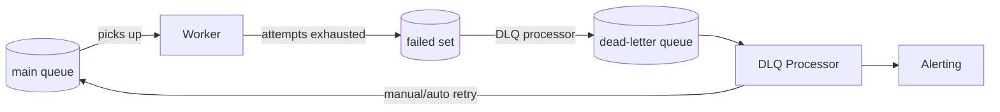

# Retry Strategies

## Why Retries Are Dangerous Without Strategy

Naive retry logic — "if it fails, try again" — creates systems that fail catastrophically under load. Three specific failure modes:

**1. Retry storms:** 1,000 jobs fail simultaneously. All retry immediately. The downstream service sees 1,000 requests at once, fails again. All 1,000 retry again. The cycle repeats.

**2. Thundering herd on recovery:** A database goes down for 5 minutes. 50,000 jobs accumulate in the failed state. When the database recovers, all 50,000 retry simultaneously, overwhelming the now-recovering database.

**3. Poison pills:** One job always crashes the worker process (OOM, infinite loop). Without detection, the worker crashes, restarts, picks up the same job, crashes again — consuming all worker capacity.

The solution is a multi-layer strategy: exponential backoff with jitter for individual retries, dead letter queues for permanent failures, and poison pill detection for system-level protection.

## Exponential Backoff

### The Algorithm

Wait time grows exponentially with each attempt:

$$T_n = \text{base} \times 2^{n-1}$$

where $n$ is the attempt number (1-indexed).

| Attempt | Base=1000ms | Base=2000ms |
|---------|------------|------------|
| 1 | 1s | 2s |
| 2 | 2s | 4s |
| 3 | 4s | 8s |
| 4 | 8s | 16s |
| 5 | 16s | 32s |

### Adding Jitter

Without jitter, all jobs that fail at the same time retry at the same time. BullMQ's built-in jitter:

$$T_n = \text{base} \times 2^{n-1} + \text{Uniform}(0,\ \text{jitter})$$

BullMQ adds jitter automatically when you use exponential backoff. The actual implementation uses a random multiplier:

```typescript
// BullMQ's internal backoff calculation (simplified)
function calculateDelay(attempt: number, backoff: BackoffOptions): number {
  if (backoff.type === 'exponential') {
    const base = backoff.delay;
    const exp = Math.pow(2, attempt - 1);
    // BullMQ adds ±10% jitter
    const jitter = base * exp * 0.1 * (Math.random() * 2 - 1);
    return Math.floor(base * exp + jitter);
  }
  return backoff.delay;
}
```

### BullMQ Backoff Configuration

```typescript
// src/queues/backoff-configs.ts
import type { BackoffOptions } from 'bullmq';

export const BACKOFF_STRATEGIES = {
  // For transient HTTP errors, database timeouts
  standard: {
    type: 'exponential' as const,
    delay: 2000,  // Start at 2s, grows: 2s, 4s, 8s, 16s
  } satisfies BackoffOptions,

  // For external payment gateways (more conservative)
  aggressive: {
    type: 'exponential' as const,
    delay: 5000,  // Start at 5s, grows: 5s, 10s, 20s, 40s
  } satisfies BackoffOptions,

  // For rate-limited APIs (fixed delay is better when Retry-After is known)
  fixed: {
    type: 'fixed' as const,
    delay: 60_000,  // Retry after 1 minute
  } satisfies BackoffOptions,
} as const;

export const JOB_DEFAULTS = {
  emails: {
    attempts: 4,
    backoff: BACKOFF_STRATEGIES.standard,
    removeOnComplete: { count: 100 },
    removeOnFail: { count: 500 },
  },
  webhooks: {
    attempts: 6,
    backoff: BACKOFF_STRATEGIES.aggressive,
    removeOnComplete: { count: 500 },
    removeOnFail: { count: 1000 },
  },
  payments: {
    attempts: 3,
    backoff: BACKOFF_STRATEGIES.fixed,
    removeOnComplete: { count: 1000 },
    removeOnFail: { count: 5000 },
  },
} as const;
```

### Custom Backoff Strategy

BullMQ supports custom backoff functions for cases where you need control:

```typescript
import { Worker, Job } from 'bullmq';

// Custom backoff with max cap
const worker = new Worker(
  'webhooks',
  async (job) => sendWebhook(job.data),
  {
    connection,
    settings: {
      backoffStrategy: (attemptsMade, type, err, job) => {
        // Parse Retry-After header from error if available
        if (err instanceof RateLimitError && err.retryAfterMs) {
          // Add 20% jitter to Retry-After
          const jitter = err.retryAfterMs * 0.2 * Math.random();
          return Math.floor(err.retryAfterMs + jitter);
        }

        // Exponential with cap at 5 minutes
        const base = 2000;
        const exponential = Math.pow(2, attemptsMade - 1);
        const withJitter = base * exponential * (1 + Math.random() * 0.1);
        return Math.min(withJitter, 300_000); // Cap at 5 minutes
      },
    },
  }
);
```

## Dead Letter Queue (DLQ)

A DLQ is a separate queue that receives jobs that have exhausted all retry attempts. This separates "in-progress failures" from "permanently failed" jobs, enabling:
- Independent monitoring and alerting
- Manual review and re-processing
- Audit trail of all failures



### Implementing a Dead Letter Queue

BullMQ doesn't have native DLQ support, but you can implement it with a failed event handler:

```typescript
// src/queues/dead-letter-queue.ts
import { Queue, QueueEvents, Job } from 'bullmq';
import Redis from 'ioredis';

interface DeadLetterJob {
  originalQueue: string;
  originalJobId: string;
  originalJobName: string;
  originalData: unknown;
  originalOptions: unknown;
  failureReason: string;
  failureStack?: string;
  attemptsMade: number;
  failedAt: string;
}

export class DeadLetterQueue {
  private dlq: Queue<DeadLetterJob>;

  constructor(
    private connection: Redis,
    private dlqName = 'dead-letter'
  ) {
    this.dlq = new Queue(dlqName, { connection });
  }

  // Subscribe to failures on a source queue
  watchQueue(sourceQueueName: string): void {
    const events = new QueueEvents(sourceQueueName, {
      connection: this.connection,
    });

    events.on('failed', async ({ jobId, failedReason }) => {
      try {
        // Get the full job to check if attempts are exhausted
        const sourceQueue = new Queue(sourceQueueName, {
          connection: this.connection,
        });
        const job = await sourceQueue.getJob(jobId);

        if (!job) return;

        // Only move to DLQ if all attempts exhausted
        const maxAttempts = job.opts.attempts ?? 1;
        if (job.attemptsMade < maxAttempts) return;

        await this.dlq.add(
          'failed-job',
          {
            originalQueue: sourceQueueName,
            originalJobId: jobId,
            originalJobName: job.name,
            originalData: job.data,
            originalOptions: job.opts,
            failureReason: failedReason,
            failureStack: job.stacktrace?.join('\n'),
            attemptsMade: job.attemptsMade,
            failedAt: new Date().toISOString(),
          },
          {
            removeOnComplete: false,   // Never auto-remove DLQ jobs
            removeOnFail: false,
            // No retries for DLQ jobs — humans review these
            attempts: 1,
          }
        );

        console.error(`[DLQ] Moved job ${jobId} from ${sourceQueueName} to DLQ`, {
          reason: failedReason,
          attempts: job.attemptsMade,
        });
      } catch (err) {
        console.error('[DLQ] Failed to move job to dead letter queue:', err);
      }
    });
  }

  // Re-process a DLQ job (move back to original queue)
  async reprocess(dlqJobId: string): Promise<string> {
    const dlqJob = await this.dlq.getJob(dlqJobId);
    if (!dlqJob) throw new Error(`DLQ job ${dlqJobId} not found`);

    const { originalQueue, originalJobName, originalData, originalOptions } =
      dlqJob.data;

    const originalQ = new Queue(originalQueue, { connection: this.connection });

    const newJob = await originalQ.add(originalJobName, originalData, {
      ...(originalOptions as object),
      attempts: 3,  // Give it another chance with fresh retries
    });

    await dlqJob.remove();

    return newJob.id!;
  }

  // Bulk re-process all DLQ jobs matching a filter
  async reprocessBulk(filter?: (job: Job<DeadLetterJob>) => boolean): Promise<number> {
    const jobs = await this.dlq.getJobs(['waiting', 'failed']);
    let reprocessed = 0;

    for (const job of jobs) {
      if (!filter || filter(job)) {
        await this.reprocess(job.id!);
        reprocessed++;
      }
    }

    return reprocessed;
  }
}
```

### DLQ Monitoring and Alerting

```typescript
// src/queues/dlq-monitor.ts
import { Queue } from 'bullmq';
import { Counter, Gauge } from 'prom-client';

const dlqJobsTotal = new Counter({
  name: 'job_queue_dlq_jobs_total',
  help: 'Total jobs moved to dead letter queue',
  labelNames: ['source_queue', 'job_name'],
});

const dlqDepth = new Gauge({
  name: 'job_queue_dlq_depth',
  help: 'Number of jobs currently in dead letter queue',
});

export async function monitorDlq(
  dlq: Queue,
  alertThreshold = 100
): Promise<void> {
  const depth = await dlq.getWaitingCount() + await dlq.getFailedCount();
  dlqDepth.set(depth);

  if (depth > alertThreshold) {
    await sendAlert({
      severity: 'warning',
      title: 'Dead Letter Queue Growing',
      message: `DLQ has ${depth} jobs (threshold: ${alertThreshold})`,
      runbook: 'https://runbooks.example.com/dlq',
    });
  }
}
```

## Poison Pill Detection

A poison pill is a job that always crashes the worker process — not just fails with an error, but causes an unhandled exception, OOM kill, or infinite loop that requires process restart.

Without detection:
1. Worker picks up job → crashes
2. Kubernetes/PM2 restarts worker
3. BullMQ marks job as stalled → moves back to waiting
4. Worker picks up same job → crashes
5. Repeat forever — worker never processes any other jobs

### Detecting Poison Pills

```typescript
// src/queues/poison-pill-detector.ts
import { Queue, QueueEvents } from 'bullmq';
import Redis from 'ioredis';

interface PoisonPillRecord {
  jobId: string;
  crashCount: number;
  firstCrashAt: string;
  lastCrashAt: string;
}

export class PoisonPillDetector {
  private redis: Redis;

  constructor(
    private connection: Redis,
    private options = {
      crashThreshold: 3,       // Mark as poison after 3 crashes
      crashWindowMs: 300_000,  // Within 5-minute window
      quarantineQueueName: 'quarantine',
    }
  ) {
    this.redis = connection;
  }

  // Track worker crashes and detect poison pills
  async recordWorkerCrash(jobId: string, queueName: string): Promise<boolean> {
    const key = `poison:${queueName}:${jobId}`;
    const record = await this.redis.get(key);

    let pill: PoisonPillRecord;
    const now = new Date().toISOString();

    if (record) {
      pill = JSON.parse(record);
      pill.crashCount++;
      pill.lastCrashAt = now;
    } else {
      pill = { jobId, crashCount: 1, firstCrashAt: now, lastCrashAt: now };
    }

    await this.redis.setex(
      key,
      Math.ceil(this.options.crashWindowMs / 1000),
      JSON.stringify(pill)
    );

    if (pill.crashCount >= this.options.crashThreshold) {
      // This job is a poison pill
      await this.quarantine(jobId, queueName, pill);
      return true;
    }

    return false;
  }

  private async quarantine(
    jobId: string,
    queueName: string,
    pill: PoisonPillRecord
  ): Promise<void> {
    const sourceQueue = new Queue(queueName, { connection: this.redis });
    const job = await sourceQueue.getJob(jobId);

    if (!job) return;

    const quarantineQueue = new Queue(this.options.quarantineQueueName, {
      connection: this.redis,
    });

    // Move to quarantine with metadata
    await quarantineQueue.add(
      'quarantined-job',
      {
        originalQueue: queueName,
        originalJobId: jobId,
        originalData: job.data,
        poisonPillRecord: pill,
        quarantinedAt: new Date().toISOString(),
      },
      { attempts: 1, removeOnFail: false }
    );

    // Remove from source queue to unblock workers
    await job.remove();

    console.error(`[PoisonPill] Job ${jobId} quarantined after ${pill.crashCount} crashes`, pill);

    await sendAlert({
      severity: 'critical',
      title: 'Poison Pill Job Quarantined',
      message: `Job ${jobId} in queue ${queueName} caused ${pill.crashCount} worker crashes`,
      metadata: pill,
    });
  }
}
```

### Process-Level Crash Detection

```typescript
// src/workers/crash-tracker.ts
import { Worker } from 'bullmq';
import { PoisonPillDetector } from '../queues/poison-pill-detector';

export function withPoisonPillDetection(
  worker: Worker,
  detector: PoisonPillDetector
): Worker {
  // Track which job is currently active in this process
  let currentJobId: string | undefined;

  worker.on('active', (job) => {
    currentJobId = job.id;
  });

  worker.on('completed', () => {
    currentJobId = undefined;
  });

  worker.on('failed', () => {
    currentJobId = undefined;
  });

  // On unhandled exceptions (potential process crash)
  process.on('uncaughtException', async (err) => {
    console.error('[WorkerCrash] Uncaught exception:', err);

    if (currentJobId) {
      const isPoisonPill = await detector.recordWorkerCrash(
        currentJobId,
        worker.name
      );

      if (isPoisonPill) {
        console.error(`[WorkerCrash] Job ${currentJobId} is a poison pill — quarantined`);
      }
    }

    // Always exit — let process manager restart
    process.exit(1);
  });

  process.on('unhandledRejection', async (reason) => {
    console.error('[WorkerCrash] Unhandled rejection:', reason);

    if (currentJobId) {
      await detector.recordWorkerCrash(currentJobId, worker.name);
    }

    process.exit(1);
  });

  return worker;
}
```

## Retry Budget Pattern

Instead of per-job retry counts, use a global retry budget to prevent cascading failures:

```typescript
// src/queues/retry-budget.ts
import Redis from 'ioredis';

interface RetryBudgetConfig {
  maxRetriesPerMinute: number;
  windowMs: number;
  queueName: string;
}

export class RetryBudget {
  constructor(
    private redis: Redis,
    private config: RetryBudgetConfig
  ) {}

  async canRetry(): Promise<boolean> {
    const key = `retry-budget:${this.config.queueName}:${Math.floor(Date.now() / this.config.windowMs)}`;
    const count = await this.redis.incr(key);

    if (count === 1) {
      await this.redis.pexpire(key, this.config.windowMs);
    }

    return count <= this.config.maxRetriesPerMinute;
  }

  async getRemainingBudget(): Promise<number> {
    const key = `retry-budget:${this.config.queueName}:${Math.floor(Date.now() / this.config.windowMs)}`;
    const count = await this.redis.get(key);
    return Math.max(0, this.config.maxRetriesPerMinute - parseInt(count ?? '0'));
  }
}

// Circuit-breaker-style retry control
const retryBudget = new RetryBudget(redis, {
  maxRetriesPerMinute: 100,
  windowMs: 60_000,
  queueName: 'payments',
});

worker.on('failed', async (job, err) => {
  if (!job) return;

  const hasbudget = await retryBudget.canRetry();

  if (!hasbudget) {
    // Retry budget exhausted — move directly to DLQ
    console.warn(`[RetryBudget] Budget exhausted for ${job.id}. Moving to DLQ.`);
    await moveToDeadLetterQueue(job);
    await job.discard();
  }
  // Otherwise BullMQ handles retry normally
});
```

## Mathematical Foundations

### Expected Total Retry Delay

Given $N$ attempts with exponential backoff (base $b$, multiplier 2):

$$D_{total} = \sum_{k=1}^{N-1} b \cdot 2^{k-1} = b \cdot (2^{N-1} - 1)$$

For $b = 2000ms$, $N = 5$ attempts:

$$D_{total} = 2000 \cdot (2^4 - 1) = 2000 \cdot 15 = 30{,}000ms = 30s$$

The last attempt happens 30 seconds after the first — enough time for most transient failures to resolve.

### Jitter Effectiveness

Without jitter, $N$ concurrent failures create a burst of $N$ retries at time $D_k$. With full jitter, the expected number of collisions per second:

$$\text{collisions/sec} = \frac{N^2}{2 \cdot D_k}$$

For $N = 1000$ failures, $D_k = 2000ms$:

Without jitter: all 1000 retry at exactly $t = 2000ms$. Collision density: infinite.

With jitter ($[0, D_k]$ range): expected retries per second = $\frac{1000}{2} = 500/s$.

This is still high. For truly large-scale systems, use exponential jitter with a cap:

$$T_n = \text{Uniform}\!\left(0,\ \min\!\left(cap,\ b \cdot 2^n\right)\right)$$

This distributes retries across a much wider time range.

### Poison Pill Probability

Given $M$ total jobs and one poison pill, the expected number of worker crashes before detection with threshold $k$:

$$E[\text{crashes}] = k \cdot \frac{M}{M} = k$$

You'll see exactly $k$ crashes (one per detection threshold). With $k = 3$ and restart time $r = 10s$:

$$\text{lost capacity} = k \cdot r = 3 \cdot 10 = 30s \text{ of worker downtime}$$

Lower $k$ means faster detection but more false positives (a job that fails due to a transient issue 3 times in a row is not necessarily a poison pill).

::: info War Story
**The Retry Storm That Took Down Production**

A webhooks queue had 5 retries configured with exponential backoff starting at 1 second. On a Tuesday morning, a customer's endpoint returned 500 errors for all webhooks (their database migration ran over time).

Over 4 hours, 45,000 webhook jobs accumulated in the waiting state, each having already made 1–2 failed attempts. When the customer's endpoint recovered, BullMQ moved all 45,000 jobs to a "ready to retry" state simultaneously.

Within 30 seconds, the workers were sending 45,000 requests to the customer's endpoint. The endpoint, still warming up from the migration, couldn't handle the traffic and went down again. The cycle repeated 3 times before the team intervened.

The fix: added a per-customer concurrency limiter (Bottleneck, max 5 concurrent) and staggered the retry of bulk-recovered jobs using a delayed re-queue with jitter. Lesson: backoff protects against retrying too fast, but bulk recovery still requires spread.
:::
