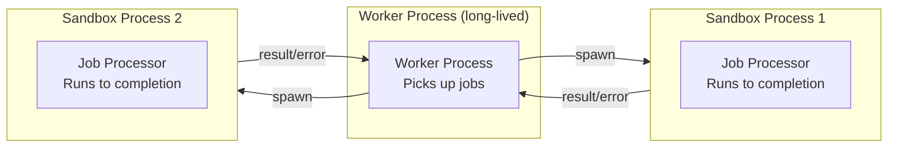

# Worker Patterns

## Concurrency Models

BullMQ workers support three concurrency models:

1. **Single-threaded concurrent** — One Node.js process, multiple in-flight jobs via async/await
2. **Multi-process** — Multiple Node.js processes, each handling jobs independently
3. **Sandboxed** — Jobs run in isolated child processes (for CPU-bound or untrusted code)

### Single-Threaded Concurrent Workers

Best for I/O-bound work (HTTP requests, database queries, Redis operations). Node.js's event loop handles many concurrent operations efficiently.

```typescript
// src/workers/email-worker.ts
import { Worker, Job } from 'bullmq';
import { getRedisConnection } from '../redis';
import { sendTransactionalEmail } from '../services/email';
import { getUserById } from '../db/users';

interface EmailJobData {
  userId: string;
  templateId: string;
  variables?: Record<string, string>;
}

interface EmailJobResult {
  messageId: string;
  sentAt: string;
  recipient: string;
}

async function processEmailJob(job: Job<EmailJobData>): Promise<EmailJobResult> {
  const { userId, templateId, variables = {} } = job.data;

  // Update progress (visible in monitoring UIs)
  await job.updateProgress(10);

  // Fetch fresh data in the worker — don't trust stale job payload
  const user = await getUserById(userId);
  if (!user) {
    // Throw with meaningful message — appears in failed job details
    throw new Error(`User ${userId} not found — may have been deleted`);
  }

  await job.updateProgress(30);

  // Log job-specific context
  job.log(`Sending ${templateId} to ${user.email}`);

  const result = await sendTransactionalEmail({
    to: user.email,
    templateId,
    variables: {
      name: user.name,
      ...variables,
    },
  });

  await job.updateProgress(100);

  return {
    messageId: result.messageId,
    sentAt: new Date().toISOString(),
    recipient: user.email,
  };
}

export function startEmailWorker() {
  const worker = new Worker<EmailJobData, EmailJobResult>(
    'emails',
    processEmailJob,
    {
      connection: getRedisConnection(),
      concurrency: 20,          // 20 jobs in-flight simultaneously
      limiter: {
        max: 50,                // Max 50 jobs per second (protect SMTP service)
        duration: 1000,
      },
    }
  );

  // Lifecycle events
  worker.on('active', (job) => {
    console.log(`[email-worker] Processing job ${job.id}: ${job.name}`);
  });

  worker.on('completed', (job, result) => {
    console.log(`[email-worker] Job ${job.id} completed. MessageId: ${result.messageId}`);
  });

  worker.on('failed', (job, err) => {
    console.error(`[email-worker] Job ${job?.id} failed:`, {
      error: err.message,
      stack: err.stack,
      attempts: job?.attemptsMade,
    });
  });

  worker.on('error', (err) => {
    // Redis connection errors, etc.
    console.error('[email-worker] Worker error:', err);
  });

  // Graceful shutdown
  process.on('SIGTERM', async () => {
    console.log('[email-worker] Shutting down gracefully...');
    await worker.close();
    console.log('[email-worker] Worker closed');
    process.exit(0);
  });

  return worker;
}
```

### Sequential Processing (Concurrency = 1)

For jobs that cannot run in parallel — database migrations, sequential file processing, resource-limited operations:

```typescript
// src/workers/migration-worker.ts
import { Worker, Job } from 'bullmq';

interface MigrationJobData {
  migrationId: string;
  direction: 'up' | 'down';
  targetVersion: string;
}

// concurrency: 1 guarantees sequential processing
const migrationWorker = new Worker<MigrationJobData>(
  'migrations',
  async (job) => {
    const { migrationId, direction } = job.data;

    // This is safe because only one job runs at a time
    console.log(`Running migration ${migrationId} (${direction})`);

    await runMigration(migrationId, direction);

    return { migratedAt: new Date().toISOString() };
  },
  {
    connection: getRedisConnection(),
    concurrency: 1,  // Sequential
  }
);
```

### Multi-Process Workers

For maximum throughput, run multiple worker processes. Each process is independent — crashes don't affect others.

```typescript
// src/workers/worker-cluster.ts
import cluster from 'cluster';
import os from 'os';
import { startEmailWorker } from './email-worker';
import { startWebhookWorker } from './webhook-worker';

if (cluster.isPrimary) {
  const cpuCount = os.cpus().length;

  console.log(`Starting ${cpuCount} worker processes`);

  for (let i = 0; i < cpuCount; i++) {
    const worker = cluster.fork({ WORKER_TYPE: 'email' });
    worker.on('exit', (code, signal) => {
      console.log(`Worker ${worker.process.pid} died (${signal || code}). Restarting...`);
      cluster.fork({ WORKER_TYPE: 'email' });
    });
  }

  cluster.on('online', (worker) => {
    console.log(`Worker ${worker.process.pid} online`);
  });
} else {
  const workerType = process.env.WORKER_TYPE;

  switch (workerType) {
    case 'email':
      startEmailWorker();
      break;
    case 'webhook':
      startWebhookWorker();
      break;
    default:
      console.error(`Unknown worker type: ${workerType}`);
      process.exit(1);
  }
}
```

## Sandboxed Workers

Sandboxed workers run the processor function in a separate Node.js process per job. This provides:
- **Isolation** — a crashing job doesn't kill the worker
- **Memory limits** — each process has its own heap
- **CPU isolation** — CPU-bound work doesn't block the event loop



```typescript
// src/workers/pdf-worker.ts — The worker file
import { SandboxedJob } from 'bullmq';

// This file is the sandbox — it's required in a separate process
// Do NOT import anything heavy at the module level

interface PdfJobData {
  reportId: string;
  templatePath: string;
  data: Record<string, unknown>;
}

export default async function processPdfJob(
  job: SandboxedJob<PdfJobData>
): Promise<{ pdfPath: string; pages: number }> {
  // Heavy imports inside the function — loaded fresh per sandbox
  const puppeteer = await import('puppeteer');
  const { readFileSync } = await import('fs');

  await job.updateProgress(5);

  const browser = await puppeteer.default.launch({
    headless: true,
    args: ['--no-sandbox', '--disable-setuid-sandbox'],
  });

  try {
    const page = await browser.newPage();
    const template = readFileSync(job.data.templatePath, 'utf-8');

    // Render template with data
    const html = renderTemplate(template, job.data.data);
    await page.setContent(html, { waitUntil: 'networkidle0' });

    await job.updateProgress(50);

    const pdfBuffer = await page.pdf({ format: 'A4' });
    const outputPath = `/tmp/reports/${job.data.reportId}.pdf`;

    await import('fs/promises').then(({ writeFile }) =>
      writeFile(outputPath, pdfBuffer)
    );

    await job.updateProgress(90);

    const pdfLib = await import('pdf-lib');
    const pdfDoc = await pdfLib.PDFDocument.load(pdfBuffer);

    return {
      pdfPath: outputPath,
      pages: pdfDoc.getPageCount(),
    };
  } finally {
    await browser.close();
  }
}

function renderTemplate(template: string, data: Record<string, unknown>): string {
  return template.replace(/\{\{(\w+)\}\}/g, (_, key) =>
    String(data[key] ?? '')
  );
}
```

```typescript
// src/workers/pdf-worker-runner.ts — Start the sandboxed worker
import { Worker } from 'bullmq';
import path from 'path';

const pdfWorker = new Worker(
  'pdf-generation',
  path.resolve(__dirname, './pdf-worker'),  // Path to processor file
  {
    connection: getRedisConnection(),
    concurrency: 4,           // 4 sandbox processes in parallel
    useWorkerThreads: false,  // Use processes, not threads
  }
);
```

::: warning
Sandboxed workers have significant overhead: ~200–500ms to spawn a new process. For jobs < 1s, this overhead dominates. Use sandboxed workers only for jobs > 5 seconds or truly CPU-intensive work.
:::

## Worker Lifecycle Management

### Graceful Shutdown

Workers in the middle of a job should finish before the process exits:

```typescript
// src/workers/graceful-shutdown.ts
import { Worker } from 'bullmq';

export function setupGracefulShutdown(workers: Worker[]): void {
  let isShuttingDown = false;

  const shutdown = async (signal: string) => {
    if (isShuttingDown) return;
    isShuttingDown = true;

    console.log(`[${signal}] Graceful shutdown initiated`);

    // Stop accepting new jobs
    await Promise.all(workers.map((w) => w.pause(true)));

    // Wait for in-progress jobs to complete (with timeout)
    const shutdownTimeout = parseInt(process.env.SHUTDOWN_TIMEOUT ?? '30000');
    const shutdownDeadline = Date.now() + shutdownTimeout;

    await Promise.all(
      workers.map(async (worker) => {
        // Check if worker has active jobs
        while (Date.now() < shutdownDeadline) {
          const activeCount = await worker.getActiveCount();
          if (activeCount === 0) break;
          console.log(`Waiting for ${activeCount} active jobs...`);
          await new Promise((resolve) => setTimeout(resolve, 1000));
        }
        await worker.close();
      })
    );

    console.log('All workers closed. Exiting.');
    process.exit(0);
  };

  process.on('SIGTERM', () => shutdown('SIGTERM'));
  process.on('SIGINT', () => shutdown('SIGINT'));
}
```

### Health Checks

```typescript
// src/workers/health.ts
import http from 'http';
import { Worker } from 'bullmq';

export function startHealthServer(workers: Worker[], port = 9090): void {
  const server = http.createServer(async (req, res) => {
    if (req.url !== '/health') {
      res.writeHead(404).end();
      return;
    }

    const health = await Promise.all(
      workers.map(async (worker) => ({
        name: worker.name,
        isRunning: worker.isRunning(),
        isPaused: worker.isPaused(),
        concurrency: worker.opts.concurrency,
        activeCount: await worker.getActiveCount(),
      }))
    );

    const allRunning = health.every((w) => w.isRunning && !w.isPaused);

    res.writeHead(allRunning ? 200 : 503, {
      'Content-Type': 'application/json',
    });
    res.end(JSON.stringify({ status: allRunning ? 'ok' : 'degraded', workers: health }));
  });

  server.listen(port, () => {
    console.log(`Health server listening on :${port}`);
  });
}
```

## Job Context and Dependency Injection

Workers need access to database connections, external service clients, etc. Two patterns:

### Module-Level Singletons

```typescript
// src/workers/context.ts
import { PrismaClient } from '@prisma/client';
import { S3Client } from '@aws-sdk/client-s3';
import Redis from 'ioredis';

// Initialized once per process, shared across all jobs
let db: PrismaClient;
let s3: S3Client;
let redis: Redis;

export function initializeWorkerContext(): void {
  db = new PrismaClient({ log: ['error'] });
  s3 = new S3Client({ region: process.env.AWS_REGION });
  redis = new Redis({ host: process.env.REDIS_HOST });
}

export function getDb(): PrismaClient {
  if (!db) throw new Error('Worker context not initialized');
  return db;
}

export function getS3(): S3Client {
  if (!s3) throw new Error('Worker context not initialized');
  return s3;
}
```

### Processor Factory Pattern

```typescript
// src/workers/processor-factory.ts
import type { Processor } from 'bullmq';

interface WorkerDeps {
  db: PrismaClient;
  s3: S3Client;
  emailService: EmailService;
}

// Factory function injects dependencies at startup
export function createEmailProcessor(deps: WorkerDeps): Processor {
  return async (job) => {
    const { db, emailService } = deps;
    const user = await db.user.findUnique({ where: { id: job.data.userId } });
    if (!user) throw new Error(`User not found: ${job.data.userId}`);
    return emailService.send({ to: user.email, ...job.data });
  };
}

// Usage
const emailProcessor = createEmailProcessor({ db, s3, emailService });
const worker = new Worker('emails', emailProcessor, { connection });
```

## Rate-Limited Workers

When downstream services have their own rate limits, use BullMQ's built-in rate limiter:

```typescript
const webhookWorker = new Worker(
  'webhooks',
  async (job) => {
    // This processor is called at most `max` times per `duration` ms
    return sendWebhook(job.data);
  },
  {
    connection,
    concurrency: 10,
    limiter: {
      max: 100,      // Max 100 jobs processed
      duration: 1000, // Per 1000ms (1 second)
      // Equivalent to: 100 req/s rate limit
    },
  }
);
```

For more complex rate limiting (per-customer, per-endpoint):

```typescript
// src/workers/rate-limited-processor.ts
import { Bottleneck } from 'bottleneck';

// Per-customer rate limiters
const limiters = new Map<string, Bottleneck>();

function getCustomerLimiter(customerId: string): Bottleneck {
  if (!limiters.has(customerId)) {
    limiters.set(
      customerId,
      new Bottleneck({
        maxConcurrent: 1,
        minTime: 100, // At least 100ms between requests per customer
      })
    );
  }
  return limiters.get(customerId)!;
}

async function processWebhookJob(job: Job<WebhookJobData>) {
  const limiter = getCustomerLimiter(job.data.customerId);
  return limiter.schedule(() => sendWebhookRequest(job.data));
}
```

## Error Handling Patterns

### Transient vs Permanent Errors

```typescript
// src/workers/errors.ts

export class PermanentJobError extends Error {
  readonly isPermanent = true;
  constructor(message: string) {
    super(message);
    this.name = 'PermanentJobError';
  }
}

export class TransientJobError extends Error {
  readonly isPermanent = false;
  constructor(message: string, public readonly retryAfterMs?: number) {
    super(message);
    this.name = 'TransientJobError';
  }
}

// In processor:
async function processOrder(job: Job<OrderData>) {
  const order = await db.order.findUnique({ where: { id: job.data.orderId } });

  if (!order) {
    // Permanent: don't retry, the order doesn't exist
    throw new PermanentJobError(`Order ${job.data.orderId} not found`);
  }

  if (order.status === 'cancelled') {
    // Permanent: job is no longer relevant
    throw new PermanentJobError(`Order ${job.data.orderId} was cancelled`);
  }

  try {
    return await chargePayment(order);
  } catch (err: unknown) {
    if (err instanceof PaymentGatewayError && err.code === 'CARD_DECLINED') {
      // Permanent: retry won't help
      throw new PermanentJobError(`Card declined: ${err.message}`);
    }

    if (err instanceof PaymentGatewayError && err.code === 'RATE_LIMITED') {
      // Transient: retry after gateway's suggested delay
      throw new TransientJobError('Payment gateway rate limited', err.retryAfter);
    }

    // Unknown error — let BullMQ retry with backoff
    throw err;
  }
}

// Worker error handler that respects permanent errors
const worker = new Worker('orders', processOrder, { connection });

worker.on('failed', async (job, err) => {
  if (job && err instanceof PermanentJobError) {
    // Mark as permanently failed — don't let BullMQ retry
    // We've already exhausted all retries or the error is unrecoverable
    await job.discard();
    await notifySlack(`Order job permanently failed: ${err.message}`, job.data);
  }
});
```

## Performance Benchmarks

### Throughput by Concurrency

Testing on: Node.js 20, Redis 7.2, 1Gbps LAN, simple noop jobs:

| Concurrency | Jobs/sec | CPU % | Redis CPU % |
|-------------|---------|-------|------------|
| 1 | 850 | 8% | 12% |
| 5 | 3,800 | 28% | 45% |
| 10 | 6,500 | 42% | 68% |
| 20 | 10,200 | 58% | 88% |
| 50 | 12,000 | 72% | 96% |
| 100 | 11,500 | 85% | 98% |

Diminishing returns above concurrency 20 — Redis becomes the bottleneck.

### Job Data Size Impact

| Job Data Size | Jobs/sec | Notes |
|--------------|---------|-------|
| 100 bytes | 10,200 | Baseline |
| 1 KB | 9,100 | -11% |
| 10 KB | 5,800 | -43% |
| 100 KB | 1,200 | -88% |
| 1 MB | 140 | Avoid at all costs |

Keep job data small. Use references (IDs) not objects.

::: info War Story
**The Concurrency Cliff**

An engineering team was seeing strange behavior: their email workers processed jobs normally most of the time, but occasionally would process the same job 3–4 times. Users received duplicate emails.

After days of debugging, they found the issue: their concurrency was set to 100, but their processor was making sequential database queries (N+1 problem) instead of batching. Each job took 5–8 seconds, which exceeded the worker's `lockDuration` (30 seconds was fine, but they had accidentally set it to 5 seconds in a config migration).

When a job exceeded its lock duration, BullMQ considered it stalled, promoted a new worker to claim it, and started a second copy. The original was still running. Fix: increase `lockDuration` to match realistic job completion time, plus set `maxStalledCount: 1`.
:::

## Advanced: Worker Threads for CPU-Bound Work

For CPU-bound tasks (image processing, cryptography, compression) use Node.js worker threads to avoid blocking the event loop:

```typescript
// src/workers/image-processor-thread.ts — runs in worker thread
import { workerData, parentPort } from 'worker_threads';
import sharp from 'sharp';

async function processImage() {
  const { inputPath, outputPath, width, height } = workerData;

  const result = await sharp(inputPath)
    .resize(width, height, { fit: 'cover' })
    .webp({ quality: 85 })
    .toFile(outputPath);

  parentPort?.postMessage({ success: true, info: result });
}

processImage().catch((err) => {
  parentPort?.postMessage({ success: false, error: err.message });
});
```

```typescript
// src/workers/image-worker.ts — BullMQ worker using threads
import { Worker as BullWorker } from 'bullmq';
import { Worker as NodeWorker } from 'worker_threads';
import path from 'path';

const imageWorker = new BullWorker(
  'image-processing',
  async (job) => {
    return new Promise((resolve, reject) => {
      // Offload CPU work to a thread
      const thread = new NodeWorker(
        path.resolve(__dirname, './image-processor-thread'),
        { workerData: job.data }
      );

      thread.on('message', (result) => {
        if (result.success) resolve(result.info);
        else reject(new Error(result.error));
      });

      thread.on('error', reject);
    });
  },
  {
    connection: getRedisConnection(),
    concurrency: os.cpus().length, // One thread per CPU
  }
);
```
