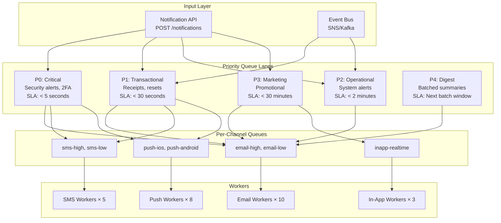
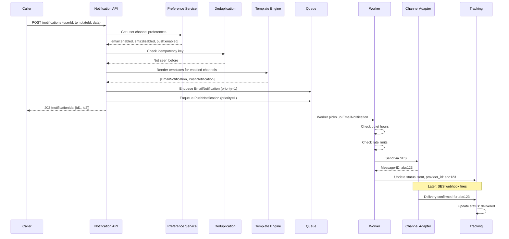

# Notification Service: Architecture

## Architecture Philosophy

The notification service has one job: reliably deliver messages to users on their preferred channels. The architecture must handle:

- **Volume spikes**: A product launch email to 500k users. A system incident alert to all customers. These must not starve time-sensitive transactional notifications.
- **Provider failures**: SendGrid is down. Traffic must automatically failover to SES.
- **Channel failures**: APNs rejects a push token. Don't retry — remove the invalid token.
- **Partial failures**: A batch of 100 emails where 3 fail. The 97 successes must be acknowledged without re-sending them.

## Queue Architecture



### Queue Priority Design

Priority levels map to SLA requirements, not channel types. A security alert email is P0. A promotional push notification is P3.

```typescript
export type NotificationPriority = 0 | 1 | 2 | 3 | 4;

export const PRIORITY_CONFIG: Record<NotificationPriority, {
  label: string;
  slaSeconds: number;
  workerConcurrency: number;
  maxRetries: number;
}> = {
  0: { label: 'critical',      slaSeconds: 5,    workerConcurrency: 5,  maxRetries: 10 },
  1: { label: 'transactional', slaSeconds: 30,   workerConcurrency: 20, maxRetries: 5  },
  2: { label: 'operational',   slaSeconds: 120,  workerConcurrency: 10, maxRetries: 3  },
  3: { label: 'marketing',     slaSeconds: 1800, workerConcurrency: 5,  maxRetries: 2  },
  4: { label: 'digest',        slaSeconds: 3600, workerConcurrency: 2,  maxRetries: 1  },
};
```

## Database Schema

```sql
-- User notification preferences
CREATE TABLE notification_preferences (
    id              UUID PRIMARY KEY DEFAULT gen_random_uuid(),
    user_id         UUID NOT NULL,
    channel         TEXT NOT NULL CHECK (channel IN ('email', 'sms', 'push', 'inapp', 'slack')),
    category        TEXT NOT NULL,  -- 'security', 'billing', 'product', 'marketing'
    enabled         BOOLEAN NOT NULL DEFAULT TRUE,
    quiet_hours_start TIME,          -- e.g., '22:00'
    quiet_hours_end   TIME,          -- e.g., '08:00'
    timezone        TEXT DEFAULT 'UTC',
    created_at      TIMESTAMPTZ NOT NULL DEFAULT NOW(),
    updated_at      TIMESTAMPTZ NOT NULL DEFAULT NOW(),
    UNIQUE(user_id, channel, category)
);

-- Global unsubscribes (email unsubscribe list)
CREATE TABLE email_suppressions (
    email           TEXT PRIMARY KEY,
    reason          TEXT NOT NULL CHECK (reason IN ('unsubscribe', 'bounce', 'complaint', 'admin')),
    suppressed_at   TIMESTAMPTZ NOT NULL DEFAULT NOW(),
    metadata        JSONB DEFAULT '{}'
);

-- Notification records (full audit trail)
CREATE TABLE notifications (
    id              UUID PRIMARY KEY DEFAULT gen_random_uuid(),
    idempotency_key TEXT UNIQUE,
    user_id         UUID,
    channel         TEXT NOT NULL,
    category        TEXT NOT NULL,
    priority        INTEGER NOT NULL,
    template_id     TEXT NOT NULL,
    template_version TEXT NOT NULL,
    recipient       TEXT NOT NULL,  -- email, phone, device token, user_id
    subject         TEXT,           -- For email
    body_preview    TEXT,           -- First 200 chars for audit/debug
    status          TEXT NOT NULL DEFAULT 'queued',
    provider        TEXT,           -- Which provider was used
    provider_message_id TEXT,       -- Provider's message ID for tracking
    attempts        INTEGER NOT NULL DEFAULT 0,
    last_error      TEXT,
    queued_at       TIMESTAMPTZ NOT NULL DEFAULT NOW(),
    sent_at         TIMESTAMPTZ,
    delivered_at    TIMESTAMPTZ,
    opened_at       TIMESTAMPTZ,
    clicked_at      TIMESTAMPTZ,
    failed_at       TIMESTAMPTZ,
    metadata        JSONB DEFAULT '{}'
);

-- Device tokens for push notifications
CREATE TABLE device_tokens (
    id              UUID PRIMARY KEY DEFAULT gen_random_uuid(),
    user_id         UUID NOT NULL,
    platform        TEXT NOT NULL CHECK (platform IN ('ios', 'android', 'web')),
    token           TEXT NOT NULL,
    app_version     TEXT,
    device_model    TEXT,
    active          BOOLEAN NOT NULL DEFAULT TRUE,
    last_seen       TIMESTAMPTZ NOT NULL DEFAULT NOW(),
    created_at      TIMESTAMPTZ NOT NULL DEFAULT NOW(),
    UNIQUE(user_id, token)
);

CREATE INDEX idx_notifications_user_id ON notifications(user_id);
CREATE INDEX idx_notifications_status ON notifications(status) WHERE status IN ('queued', 'processing');
CREATE INDEX idx_notifications_queued_at ON notifications(queued_at DESC);
CREATE INDEX idx_device_tokens_user_id ON device_tokens(user_id) WHERE active = TRUE;
```

## Core Domain Types

```typescript
export type NotificationChannel = 'email' | 'sms' | 'push' | 'inapp' | 'slack';
export type NotificationCategory =
  | 'security'
  | 'billing'
  | 'product'
  | 'marketing'
  | 'system';
export type NotificationStatus =
  | 'queued'
  | 'processing'
  | 'sent'
  | 'delivered'
  | 'failed'
  | 'bounced'
  | 'suppressed';

export interface NotificationRequest {
  // Who to notify
  userId?: string;           // If known (resolved to channels by preference service)
  recipients?: NotificationRecipient[];  // Direct recipients (bypasses preferences)

  // What to send
  templateId: string;
  templateVersion?: string;   // Specific version; omit for latest
  data: Record<string, unknown>;  // Template variables

  // How to route
  channels?: NotificationChannel[];  // Omit to use all enabled channels for user
  category: NotificationCategory;
  priority?: NotificationPriority;

  // Reliability
  idempotencyKey?: string;    // Omit to auto-generate

  // Scheduling
  sendAt?: Date;              // Scheduled send time
  expiresAt?: Date;           // Don't send after this time

  metadata?: Record<string, string>;
}

export interface NotificationRecipient {
  channel: NotificationChannel;
  address: string;  // Email, phone, device token, etc.
}

export interface Notification {
  id: string;
  idempotencyKey: string;
  userId: string | null;
  channel: NotificationChannel;
  category: NotificationCategory;
  priority: NotificationPriority;
  templateId: string;
  templateVersion: string;
  recipient: string;
  subject: string | null;
  status: NotificationStatus;
  provider: string | null;
  providerMessageId: string | null;
  attempts: number;
  lastError: string | null;
  queuedAt: Date;
  sentAt: Date | null;
  deliveredAt: Date | null;
  openedAt: Date | null;
  clickedAt: Date | null;
  failedAt: Date | null;
  metadata: Record<string, string>;
}
```

## The Notification Pipeline



## Worker Implementation

```typescript
import Bull from 'bull';
import { NotificationWorker } from './worker';
import { EmailAdapter } from './adapters/email-adapter';
import { SmsAdapter } from './adapters/sms-adapter';
import { PushAdapter } from './adapters/push-adapter';
import { NotificationRepository } from './repositories/notification-repository';
import { RateLimiter } from './rate-limiter';
import { QuietHoursService } from './quiet-hours-service';
import { logger } from './logger';
import { metrics } from './metrics';

interface NotificationJob {
  notificationId: string;
  channel: NotificationChannel;
  recipient: string;
  renderedContent: RenderedNotification;
  userId: string | null;
  priority: number;
}

export class NotificationWorkerService {
  constructor(
    private readonly notificationRepo: NotificationRepository,
    private readonly emailAdapter: EmailAdapter,
    private readonly smsAdapter: SmsAdapter,
    private readonly pushAdapter: PushAdapter,
    private readonly rateLimiter: RateLimiter,
    private readonly quietHours: QuietHoursService
  ) {}

  async processJob(job: Bull.Job<NotificationJob>): Promise<void> {
    const { notificationId, channel, recipient, renderedContent, userId, priority } = job.data;

    const timer = metrics.startTimer('notification_processing_duration_ms', { channel });

    try {
      // Check if still valid (not expired)
      const notification = await this.notificationRepo.getById(notificationId);
      if (!notification) {
        logger.warn({ msg: 'Notification not found', notificationId });
        return;
      }

      if (notification.status === 'sent' || notification.status === 'delivered') {
        logger.info({ msg: 'Notification already sent, skipping', notificationId });
        return;
      }

      // Check quiet hours (except P0 critical)
      if (priority > 0 && userId) {
        const inQuietHours = await this.quietHours.isInQuietHours(userId, channel);
        if (inQuietHours) {
          // Reschedule for after quiet hours
          const nextAllowedTime = await this.quietHours.getNextAllowedTime(userId, channel);
          await job.moveToDelayed(nextAllowedTime.getTime());
          logger.info({ msg: 'Notification delayed for quiet hours', notificationId, nextAllowedTime });
          return;
        }
      }

      // Check rate limits (except P0 critical)
      if (priority > 0 && userId) {
        const allowed = await this.rateLimiter.checkAndConsume({
          userId,
          channel,
          category: notification.category,
        });

        if (!allowed) {
          // For marketing, drop. For transactional, delay.
          if (priority >= 3) {
            await this.notificationRepo.updateStatus(notificationId, 'suppressed');
            logger.info({ msg: 'Notification suppressed by rate limiter', notificationId });
            return;
          } else {
            // Delay 1 hour and retry
            await job.moveToDelayed(Date.now() + 3600000);
            return;
          }
        }
      }

      // Mark as processing
      await this.notificationRepo.updateStatus(notificationId, 'processing');
      await this.notificationRepo.incrementAttempts(notificationId);

      // Send via appropriate adapter
      let providerMessageId: string;

      switch (channel) {
        case 'email':
          providerMessageId = await this.emailAdapter.send(recipient, renderedContent as RenderedEmail);
          break;
        case 'sms':
          providerMessageId = await this.smsAdapter.send(recipient, renderedContent as RenderedSms);
          break;
        case 'push':
          providerMessageId = await this.pushAdapter.send(recipient, renderedContent as RenderedPush);
          break;
        default:
          throw new Error(`Unknown channel: ${channel}`);
      }

      // Update to sent
      await this.notificationRepo.markSent(notificationId, {
        provider: this.getProviderName(channel),
        providerMessageId,
        sentAt: new Date(),
      });

      metrics.increment('notifications_sent_total', { channel, priority: String(priority) });
    } catch (error) {
      const errorMessage = (error as Error).message;

      logger.error({
        msg: 'Notification send failed',
        notificationId,
        channel,
        error: errorMessage,
        attempt: job.attemptsMade,
      });

      await this.notificationRepo.markFailed(notificationId, errorMessage);
      metrics.increment('notifications_failed_total', { channel });

      // Re-throw to trigger Bull retry
      throw error;
    } finally {
      timer.end();
    }
  }

  private getProviderName(channel: NotificationChannel): string {
    switch (channel) {
      case 'email': return 'ses';
      case 'sms': return 'twilio';
      case 'push': return 'fcm';
      default: return channel;
    }
  }
}
```

## Provider Failover

```typescript
export class FailoverEmailAdapter {
  private readonly providers: EmailProvider[];
  private currentProviderIndex = 0;

  constructor(providers: EmailProvider[]) {
    this.providers = providers;
    // Providers ordered by preference: [SES, SendGrid, Mailgun]
  }

  async send(recipient: string, content: RenderedEmail): Promise<string> {
    const errors: Error[] = [];

    // Try each provider in order
    for (let i = 0; i < this.providers.length; i++) {
      const providerIndex = (this.currentProviderIndex + i) % this.providers.length;
      const provider = this.providers[providerIndex];

      try {
        const messageId = await provider.send(recipient, content);
        // Success — update current provider for sticky routing
        this.currentProviderIndex = providerIndex;
        return messageId;
      } catch (error) {
        logger.warn({
          msg: 'Email provider failed, trying next',
          provider: provider.name,
          error: (error as Error).message,
        });
        errors.push(error as Error);

        // If this is the provider we're currently using, rotate
        if (providerIndex === this.currentProviderIndex) {
          this.currentProviderIndex =
            (this.currentProviderIndex + 1) % this.providers.length;
        }
      }
    }

    throw new Error(
      `All email providers failed: ${errors.map(e => e.message).join(', ')}`
    );
  }
}
```

## Backpressure Handling

When queues grow too large, the system applies backpressure:

```typescript
export class QueueHealthMonitor {
  private readonly MAX_QUEUE_DEPTH = 100_000;
  private readonly WARNING_QUEUE_DEPTH = 50_000;

  async checkHealth(queueName: string): Promise<QueueHealth> {
    const waiting = await queue.getWaitingCount();
    const active = await queue.getActiveCount();
    const delayed = await queue.getDelayedCount();

    const depth = waiting + delayed;

    if (depth > this.MAX_QUEUE_DEPTH) {
      // Start shedding P3/P4 load
      logger.error({ msg: 'Queue overloaded — shedding low-priority notifications', queueName, depth });
      metrics.gauge('notification_queue_depth', depth, { queue: queueName });

      return {
        status: 'overloaded',
        depth,
        recommendation: 'shed_low_priority',
      };
    }

    if (depth > this.WARNING_QUEUE_DEPTH) {
      logger.warn({ msg: 'Queue depth warning', queueName, depth });
      return { status: 'degraded', depth, recommendation: 'scale_workers' };
    }

    return { status: 'healthy', depth, recommendation: 'none' };
  }
}
```

::: info War Story
We launched a major product feature and sent a "check out our new feature" email to 800k users at 9am. Our email queue depth hit 800k jobs at once. At our normal throughput of 200 emails/second, this would take 66 minutes to clear.

The problem: we had 2FA emails in the same queue. Users who forgot their password during the blast couldn't receive reset emails for up to 66 minutes.

The fix: strict queue separation by priority. P0/P1 queues are isolated from P2/P3/P4. Marketing blasts can only use the low-priority queues. This took 2 days to re-architect but ended a class of user support tickets permanently.
:::

## Configuration Schema

```typescript
export interface NotificationServiceConfig {
  queues: {
    redis: {
      host: string;
      port: number;
      password?: string;
    };
    priorities: {
      [P in NotificationPriority]: {
        concurrency: number;
        maxRetries: number;
        retryBackoffMs: number;
      };
    };
  };
  providers: {
    email: {
      primary: 'ses' | 'sendgrid';
      fallback?: 'ses' | 'sendgrid' | 'mailgun';
      ses?: { region: string };
      sendgrid?: { apiKey: string };
    };
    sms: {
      accountSid: string;
      authToken: string;
      fromNumber: string;
    };
    push: {
      fcm: { serviceAccountKey: string };
      apns: {
        keyId: string;
        teamId: string;
        privateKey: string;
        bundleId: string;
      };
    };
  };
  rateLimiting: {
    defaultLimits: Record<string, Record<NotificationChannel, number>>;
    windowSeconds: number;
  };
  templates: {
    s3Bucket: string;
    cacheEnabled: boolean;
    cacheTtlSeconds: number;
  };
}
```
