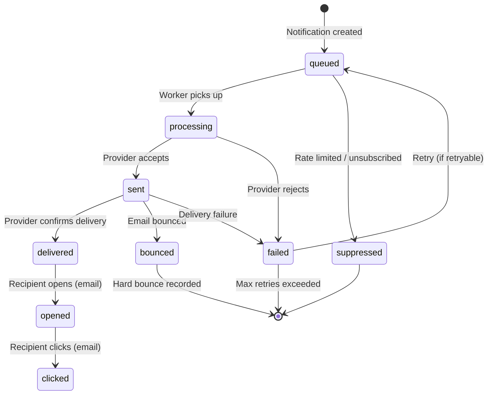

# Notification Delivery Tracking

## The Delivery Status Lifecycle

Every notification goes through a well-defined state machine:



## Status Update Sources

Different channels update delivery status differently:

| Channel | How Status Updates Arrive |
|---------|--------------------------|
| Email (SES) | SNS webhooks → your endpoint |
| Email (SendGrid) | SendGrid Event Webhook |
| SMS (Twilio) | Twilio Status Callback URL |
| Push (FCM) | Synchronous response + Data messages |
| Push (APNs) | Synchronous response |
| In-App | Client-side read receipts via API |

## Email Delivery Tracking: AWS SES + SNS

SES delivers events via SNS. Set up an SNS subscription that posts to your webhook endpoint:

```typescript
import express from 'express';
import { SNSClient, ConfirmSubscriptionCommand } from '@aws-sdk/client-sns';

const sesWebhookRouter = express.Router();

interface SNSEmailEvent {
  Type: 'Notification' | 'SubscriptionConfirmation' | 'UnsubscribeConfirmation';
  MessageId: string;
  Message: string;   // JSON string
  SubscribeURL?: string;  // For SubscriptionConfirmation
  TopicArn: string;
  Timestamp: string;
}

interface SESEmailNotification {
  notificationType: 'Bounce' | 'Complaint' | 'Delivery';
  mail: {
    messageId: string;
    destination: string[];
  };
  bounce?: {
    bounceType: 'Permanent' | 'Transient' | 'Undetermined';
    bounceSubType: string;
    bouncedRecipients: Array<{
      emailAddress: string;
      action: string;
      status: string;
      diagnosticCode: string;
    }>;
  };
  complaint?: {
    complainedRecipients: Array<{ emailAddress: string }>;
    feedbackId: string;
    userAgent: string;
  };
  delivery?: {
    recipients: string[];
    processingTimeMillis: number;
    reportingMTA: string;
  };
}

sesWebhookRouter.post('/webhooks/ses', express.json(), async (req, res) => {
  const snsMessage: SNSEmailEvent = req.body;

  // Handle SNS subscription confirmation
  if (snsMessage.Type === 'SubscriptionConfirmation') {
    const client = new SNSClient({ region: process.env.AWS_REGION });
    await client.send(new ConfirmSubscriptionCommand({
      TopicArn: snsMessage.TopicArn,
      Token: new URL(snsMessage.SubscribeURL!).searchParams.get('Token')!,
    }));
    return res.status(200).send('OK');
  }

  if (snsMessage.Type !== 'Notification') {
    return res.status(200).send('OK');
  }

  const notification: SESEmailNotification = JSON.parse(snsMessage.Message);

  switch (notification.notificationType) {
    case 'Delivery':
      await handleEmailDelivered(notification);
      break;
    case 'Bounce':
      await handleEmailBounce(notification);
      break;
    case 'Complaint':
      await handleEmailComplaint(notification);
      break;
  }

  res.status(200).send('OK');
});

async function handleEmailDelivered(notification: SESEmailNotification): Promise<void> {
  const { messageId } = notification.mail;

  await notificationRepo.updateByProviderMessageId(messageId, {
    status: 'delivered',
    deliveredAt: new Date(),
  });
}

async function handleEmailBounce(notification: SESEmailNotification): Promise<void> {
  const { bounceType } = notification.bounce!;

  for (const recipient of notification.bounce!.bouncedRecipients) {
    // Update notification status
    await notificationRepo.updateByRecipient(
      notification.mail.messageId,
      recipient.emailAddress,
      {
        status: 'bounced',
        lastError: `${bounceType}: ${recipient.diagnosticCode}`,
      }
    );

    if (bounceType === 'Permanent') {
      // Hard bounce: never send to this email again
      await suppressionRepo.addSuppression({
        email: recipient.emailAddress,
        reason: 'bounce',
        metadata: {
          bounceSubType: notification.bounce!.bounceSubType,
          diagnosticCode: recipient.diagnosticCode,
        },
      });

      logger.warn({
        msg: 'Hard email bounce — email suppressed',
        email: recipient.emailAddress,
        diagnosticCode: recipient.diagnosticCode,
      });
    }
    // Transient bounces (temporary) — don't suppress, allow retry
  }
}

async function handleEmailComplaint(notification: SESEmailNotification): Promise<void> {
  for (const recipient of notification.complaint!.complainedRecipients) {
    // Suppress immediately on complaint
    await suppressionRepo.addSuppression({
      email: recipient.emailAddress,
      reason: 'complaint',
      metadata: {
        feedbackId: notification.complaint!.feedbackId,
        userAgent: notification.complaint!.userAgent,
      },
    });

    // Update user preferences to unsubscribe from marketing
    const user = await userRepo.getByEmail(recipient.emailAddress);
    if (user) {
      await preferenceRepo.unsubscribeFromMarketing(user.id, 'email');
    }

    metrics.increment('email_complaint_total');
    logger.warn({
      msg: 'Email complaint received — user suppressed',
      email: recipient.emailAddress,
    });
  }
}
```

## SendGrid Event Webhook

```typescript
import sgMail from '@sendgrid/mail';

interface SendGridEvent {
  email: string;
  timestamp: number;
  event: 'delivered' | 'open' | 'click' | 'bounce' | 'spamreport' | 'unsubscribe' | 'dropped';
  sg_message_id: string;
  url?: string;      // For click events
  reason?: string;   // For bounce events
  type?: string;     // For bounce: 'bounce' or 'blocked'
  'smtp-id'?: string;
  useragent?: string;
}

const sendgridWebhookRouter = express.Router();

sendgridWebhookRouter.post(
  '/webhooks/sendgrid',
  express.json(),
  async (req, res) => {
    // Verify SendGrid webhook signature
    const signature = req.headers['x-twilio-email-event-webhook-signature'] as string;
    const timestamp = req.headers['x-twilio-email-event-webhook-timestamp'] as string;

    const isValid = sgMail.EventWebhook.verifySignature(
      process.env.SENDGRID_WEBHOOK_KEY!,
      req.body,
      signature,
      timestamp
    );

    if (!isValid) {
      return res.status(403).json({ error: 'Invalid signature' });
    }

    const events: SendGridEvent[] = req.body;

    for (const event of events) {
      await processSendGridEvent(event);
    }

    res.status(200).send('OK');
  }
);

async function processSendGridEvent(event: SendGridEvent): Promise<void> {
  const messageId = event['smtp-id'] ?? event.sg_message_id;

  switch (event.event) {
    case 'delivered':
      await notificationRepo.updateByProviderMessageId(messageId, {
        status: 'delivered',
        deliveredAt: new Date(event.timestamp * 1000),
      });
      break;

    case 'open':
      await notificationRepo.updateByProviderMessageId(messageId, {
        openedAt: new Date(event.timestamp * 1000),
      });
      metrics.increment('email_opened_total');
      break;

    case 'click':
      await notificationRepo.updateByProviderMessageId(messageId, {
        clickedAt: new Date(event.timestamp * 1000),
      });
      metrics.increment('email_clicked_total');
      break;

    case 'bounce':
      if (event.type === 'bounce') {
        // Hard bounce
        await suppressionRepo.addSuppression({
          email: event.email,
          reason: 'bounce',
          metadata: { reason: event.reason },
        });
      }
      break;

    case 'spamreport':
      await suppressionRepo.addSuppression({
        email: event.email,
        reason: 'complaint',
      });
      metrics.increment('email_spam_report_total');
      break;

    case 'unsubscribe':
      await handleUnsubscribe(event.email, 'email');
      break;
  }
}
```

## Twilio SMS Status Callbacks

Configure Twilio to POST status updates to your endpoint:

```typescript
const twilioWebhookRouter = express.Router();

twilioWebhookRouter.post(
  '/webhooks/twilio/status',
  express.urlencoded({ extended: false }),  // Twilio sends URL-encoded
  async (req, res) => {
    // Verify Twilio signature
    const authToken = process.env.TWILIO_AUTH_TOKEN!;
    const twilioSignature = req.headers['x-twilio-signature'] as string;
    const url = `${process.env.BASE_URL}/webhooks/twilio/status`;

    const isValid = twilio.validateRequest(
      authToken,
      twilioSignature,
      url,
      req.body
    );

    if (!isValid) {
      return res.status(403).send('Forbidden');
    }

    const { MessageSid, MessageStatus, ErrorCode, To } = req.body;

    switch (MessageStatus) {
      case 'delivered':
        await notificationRepo.updateByProviderMessageId(MessageSid, {
          status: 'delivered',
          deliveredAt: new Date(),
        });
        break;

      case 'failed':
      case 'undelivered': {
        const isUnsubscribed = ErrorCode === '30007';  // Carrier violation (STOP)
        const isInvalidNumber = ['30003', '30004', '30005'].includes(ErrorCode);

        await notificationRepo.updateByProviderMessageId(MessageSid, {
          status: 'failed',
          lastError: `Twilio error ${ErrorCode}`,
        });

        if (isUnsubscribed) {
          await handleUnsubscribe(To, 'sms');
        }

        if (isInvalidNumber) {
          await suppressionRepo.addPhoneSuppression({
            phone: To,
            reason: 'invalid',
            metadata: { errorCode: ErrorCode },
          });
        }
        break;
      }
    }

    // Twilio expects TwiML or empty 200
    res.status(200).send('<Response/>');
  }
);
```

## Unsubscribe Management

Unsubscribe must be immediate and permanent (< 10 seconds per CAN-SPAM):

```typescript
export class UnsubscribeService {
  constructor(
    private readonly preferenceRepo: NotificationPreferenceRepository,
    private readonly suppressionRepo: EmailSuppressionRepository,
    private readonly phoneSuppressionRepo: PhoneSuppressionRepository,
    private readonly auditRepo: AuditRepository
  ) {}

  async unsubscribe(params: {
    userId?: string;
    email?: string;
    phone?: string;
    channel: NotificationChannel;
    scope: 'all' | 'marketing' | 'product';
    source: 'link' | 'reply' | 'report' | 'admin';
    ipAddress?: string;
  }): Promise<void> {
    const { channel, scope } = params;

    if (channel === 'email' && params.email) {
      if (scope === 'all') {
        // Global unsubscribe — add to suppression list
        await this.suppressionRepo.addSuppression({
          email: params.email,
          reason: 'unsubscribe',
          metadata: { source: params.source, ipAddress: params.ipAddress },
        });
      }

      if (params.userId) {
        // Update preferences for known users
        const categories = scope === 'all'
          ? ['security', 'billing', 'product', 'marketing'] as const
          : [scope] as const;

        for (const category of categories) {
          // Never block security notifications (2FA, password reset)
          if (category === 'security') continue;

          await this.preferenceRepo.upsert({
            userId: params.userId,
            channel: 'email',
            category,
            enabled: false,
          });
        }
      }
    }

    if (channel === 'sms' && params.phone) {
      // SMS unsubscribe via STOP reply
      await this.phoneSuppressionRepo.addSuppression({
        phone: params.phone,
        reason: 'unsubscribe',
      });

      if (params.userId) {
        await this.preferenceRepo.upsert({
          userId: params.userId,
          channel: 'sms',
          category: 'marketing',
          enabled: false,
        });
      }
    }

    // Audit the unsubscribe
    await this.auditRepo.log({
      action: 'unsubscribe',
      userId: params.userId,
      channel,
      scope,
      source: params.source,
      email: params.email,
      phone: params.phone,
      ipAddress: params.ipAddress,
      timestamp: new Date(),
    });

    logger.info({
      msg: 'User unsubscribed',
      userId: params.userId,
      channel,
      scope,
      source: params.source,
    });

    metrics.increment('notifications_unsubscribed_total', {
      channel,
      scope,
      source: params.source,
    });
  }

  // Generate a signed unsubscribe link (no login required)
  generateUnsubscribeUrl(params: {
    userId: string;
    email: string;
    category: string;
    baseUrl: string;
  }): string {
    const token = this.signUnsubscribeToken({
      userId: params.userId,
      email: params.email,
      category: params.category,
    });

    return `${params.baseUrl}/unsubscribe?token=${token}`;
  }

  private signUnsubscribeToken(payload: object): string {
    const jwt = require('jsonwebtoken');
    return jwt.sign(payload, process.env.UNSUBSCRIBE_SECRET!, {
      expiresIn: '90d',  // Long-lived — must work from old emails
    });
  }

  async processUnsubscribeToken(token: string): Promise<void> {
    const jwt = require('jsonwebtoken');
    const payload = jwt.verify(token, process.env.UNSUBSCRIBE_SECRET!) as {
      userId: string;
      email: string;
      category: string;
    };

    await this.unsubscribe({
      userId: payload.userId,
      email: payload.email,
      channel: 'email',
      scope: payload.category === 'all' ? 'all' : 'marketing',
      source: 'link',
    });
  }
}
```

## Delivery Analytics

```typescript
export interface DeliveryMetrics {
  sent: number;
  delivered: number;
  opened: number;
  clicked: number;
  bounced: number;
  complained: number;
  unsubscribed: number;
  deliveryRate: number;   // delivered / sent
  openRate: number;       // opened / delivered
  clickRate: number;      // clicked / opened
  complaintRate: number;  // complained / sent
}

export class DeliveryAnalyticsService {
  async getMetrics(params: {
    templateId?: string;
    channel?: NotificationChannel;
    from: Date;
    to: Date;
  }): Promise<DeliveryMetrics> {
    const counts = await notificationRepo.aggregateMetrics(params);

    const sent = counts.sent ?? 0;
    const delivered = counts.delivered ?? 0;
    const opened = counts.opened ?? 0;

    return {
      sent,
      delivered,
      opened,
      clicked: counts.clicked ?? 0,
      bounced: counts.bounced ?? 0,
      complained: counts.complained ?? 0,
      unsubscribed: counts.unsubscribed ?? 0,
      deliveryRate: sent > 0 ? delivered / sent : 0,
      openRate: delivered > 0 ? opened / delivered : 0,
      clickRate: opened > 0 ? (counts.clicked ?? 0) / opened : 0,
      complaintRate: sent > 0 ? (counts.complained ?? 0) / sent : 0,
    };
  }

  // Alert if deliverability metrics cross thresholds
  async checkDeliverabilityHealth(): Promise<HealthAlert[]> {
    const alerts: HealthAlert[] = [];
    const last24h = new Date(Date.now() - 86400000);

    const metrics = await this.getMetrics({
      channel: 'email',
      from: last24h,
      to: new Date(),
    });

    if (metrics.complaintRate > 0.001) {
      alerts.push({
        severity: 'critical',
        metric: 'complaint_rate',
        value: metrics.complaintRate,
        threshold: 0.001,
        message: `Email complaint rate ${(metrics.complaintRate * 100).toFixed(3)}% exceeds 0.1% threshold. Gmail may start filtering your emails to spam.`,
      });
    }

    if (metrics.deliveryRate < 0.95) {
      alerts.push({
        severity: 'warning',
        metric: 'delivery_rate',
        value: metrics.deliveryRate,
        threshold: 0.95,
        message: `Email delivery rate ${(metrics.deliveryRate * 100).toFixed(1)}% below 95% threshold.`,
      });
    }

    return alerts;
  }
}
```

## Suppression List Management

```typescript
export class SuppressionRepository {
  // Check before every email send
  async isSuppressed(email: string): Promise<boolean> {
    const result = await db.queryOne(
      `SELECT 1 FROM email_suppressions WHERE email = $1`,
      [email.toLowerCase()]
    );
    return !!result;
  }

  // Bulk suppression check for batch sends
  async filterSuppressed(emails: string[]): Promise<string[]> {
    const normalized = emails.map(e => e.toLowerCase());
    const result = await db.query<{ email: string }>(
      `SELECT email FROM email_suppressions WHERE email = ANY($1)`,
      [normalized]
    );
    const suppressedSet = new Set(result.rows.map(r => r.email));
    return emails.filter(e => !suppressedSet.has(e.toLowerCase()));
  }

  async addSuppression(params: {
    email: string;
    reason: 'unsubscribe' | 'bounce' | 'complaint' | 'admin';
    metadata?: Record<string, string>;
  }): Promise<void> {
    await db.execute(
      `INSERT INTO email_suppressions (email, reason, metadata)
       VALUES ($1, $2, $3)
       ON CONFLICT (email) DO UPDATE
         SET reason = EXCLUDED.reason,
             suppressed_at = NOW(),
             metadata = EXCLUDED.metadata`,
      [params.email.toLowerCase(), params.reason, JSON.stringify(params.metadata ?? {})]
    );
  }
}
```

::: info War Story
We discovered our spam complaint rate had spiked to 0.4% over a 3-day period. At 0.4%, Gmail was actively filtering our transactional emails (password resets, invoices) to spam. This is a reputation crisis — once you're in Google's "spammy sender" bucket, it can take weeks to recover.

Root cause: a marketing email went out to all users including free-tier users who had signed up years ago and never engaged. 8,000 of them marked it as spam in Gmail.

Recovery steps:
1. Immediately suppressed all users with no email opens in 12+ months
2. Set up a re-engagement campaign with explicit "still interested?" confirmation before sending
3. Added complaint rate monitoring with alerts at 0.05% (before hitting danger zone)
4. Moved all marketing sends to a separate subdomain/IP from transactional sends

The lesson: your transactional sending reputation is too valuable to share with marketing sends. Use separate IP pools, separate subdomains, and monitor complaint rates daily.
:::
