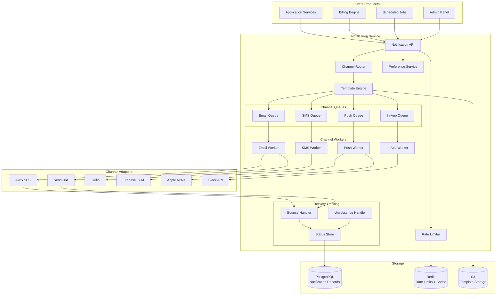

# Notification Service: Overview

A notification service is the communication backbone of your application. It is deceptively simple to start — "just send an email" — and becomes one of the most complex services you own at scale.

## What Goes Wrong Without a Proper Notification Service

Common failure patterns in naive notification systems:

1. **Email loops**: A "send notification on user event" hook triggers another user event, which triggers another notification...
2. **Thundering herd**: 100,000 users trigger notifications simultaneously. Your SMTP provider blocks you for rate limit violations.
3. **Lost notifications**: Background job crashes after dequeuing but before sending. Notification never sent.
4. **Duplicate notifications**: Retry logic sends the same email 3 times because the send succeeded but the ack failed.
5. **Template drift**: Marketing updated the email template in production. Engineers had a cached version. Different users see different emails.
6. **No unsubscribe**: You send marketing emails without a working unsubscribe. EU regulators knock on your door.
7. **Invalid tokens**: Push notifications sent to stale device tokens. Firebase silently drops them. You think they were delivered.
8. **Quiet hours ignored**: System sends password reset at 3am. User wakes up to 47 notifications. They churn.

## System Capabilities

This blueprint covers a notification service that handles:

| Channel | Provider | Use Cases |
|---------|----------|-----------|
| Email (transactional) | AWS SES / SendGrid | Password reset, receipts, alerts |
| Email (marketing) | SendGrid / Mailchimp | Newsletters, feature announcements |
| SMS | Twilio | 2FA, critical alerts, appointment reminders |
| Push (mobile) | FCM + APNs | App notifications, real-time updates |
| In-app | WebSockets / SSE | Real-time activity feed |
| Slack | Slack API | Team alerts, ops notifications |

## High-Level Architecture



## Core Principles

### 1. Asynchronous by Default

No notification should block an application request. All sends go through a queue. The API returns a notification ID immediately. Status can be polled or pushed via webhook.

Exception: Real-time in-app notifications use WebSockets but still go through the queue first for persistence.

### 2. Idempotent Sends

Each notification has a unique `notificationKey` (similar to billing idempotency keys). Sending the same key twice produces only one notification. This handles:
- Application-level retries
- Queue worker restarts
- At-least-once delivery from upstream event queues

### 3. Preference-Aware

Every notification goes through a preference check before sending. Users can opt out of specific notification types per channel. The service respects:
- Global unsubscribe (never send any marketing)
- Per-category opt-out (don't send product updates)
- Per-channel opt-out (no SMS, email only)
- Quiet hours (no non-critical notifications between 10pm-8am user-local time)

### 4. Deliverability-First

Email deliverability is a reputation problem. The service:
- Manages sending reputation per domain/IP
- Suppresses sends to bounced addresses automatically
- Processes unsubscribe requests immediately (< 10 seconds)
- Includes List-Unsubscribe headers in all marketing emails
- Monitors spam complaint rates

### 5. Observability

Every notification event is tracked:
- `queued` → `sent` → `delivered` → `opened` → `clicked` (email)
- `queued` → `sent` → `delivered` / `failed` (SMS/push)
- Failed notifications include the error code and retry state

## Critical Metrics

| Metric | Target | Alert Threshold |
|--------|--------|----------------|
| Email delivery rate | > 98% | < 95% |
| Email open rate | > 20% (transactional) | < 10% |
| Spam complaint rate | < 0.08% | > 0.1% (Google will block you) |
| SMS delivery rate | > 97% | < 95% |
| Push delivery rate | > 90% | < 85% |
| Notification queue lag | < 30 seconds | > 5 minutes |
| API p99 latency | < 50ms | > 200ms |

## Module Map

```
notification-service/
├── index.md                   ← You are here
├── architecture.md            ← Full architecture, queue design, worker model
├── channel-adapters.md        ← Email, SMS, push, in-app, Slack implementations
├── template-engine.md         ← Handlebars, i18n, versioning, preview
├── rate-limiting.md           ← Per-user limits, quiet hours, digest batching
└── delivery-tracking.md       ← Status tracking, bounce/complaint handling
```

## When to Build vs. Buy

::: tip Decision Framework
Before building a custom notification service, consider:
- **< 10k notifications/day**: Use a single provider directly (SendGrid, Mailchimp). Don't build.
- **10k-1M notifications/day**: Build a thin orchestration layer. Use managed queue (SQS, Cloud Tasks).
- **> 1M notifications/day**: Full custom service with multiple provider failover, warm IP pools, dedicated infrastructure.
:::

Also consider [Customer.io](https://customer.io), [Braze](https://www.braze.com), or [Iterable](https://iterable.com) for marketing automation — they handle preference management, A/B testing, and journey orchestration that would take months to build.

## Regulatory Landscape

| Region | Regulation | Key Requirements |
|--------|-----------|-----------------|
| EU/EEA | GDPR + ePrivacy | Explicit consent, unsubscribe, data deletion |
| USA | CAN-SPAM (email) | Unsubscribe, physical address in email |
| USA | TCPA (SMS) | Written consent for marketing SMS, opt-out |
| Canada | CASL | Express consent for commercial messages |
| Australia | Spam Act | Consent, identify sender, unsubscribe |

::: danger TCPA (USA SMS)
Sending unsolicited marketing SMS in the USA can result in $500-$1,500 per message in statutory damages. A class action with 10,000 recipients = $5M-$15M in liability.

Always get explicit written consent before sending marketing SMS. Store the consent timestamp, IP address, and consent language.
:::
