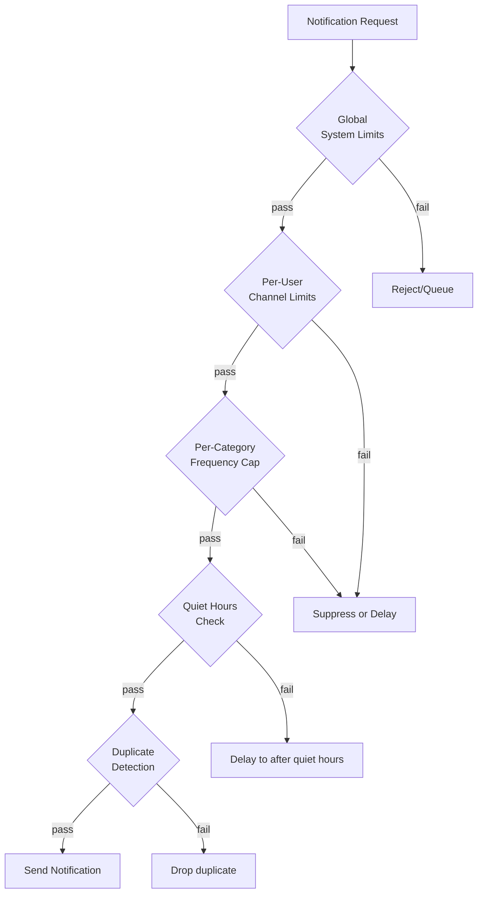

# Notification Rate Limiting

## Why Notification Rate Limiting Is Different

API rate limiting protects your infrastructure from being overloaded. Notification rate limiting protects your users from being overwhelmed — and protects your deliverability from being destroyed.

The costs of over-notifying:
- **User churn**: Users unsubscribe or disable notifications entirely
- **Spam complaints**: Gmail/Outlook users marking email as spam destroys your sender reputation
- **App uninstalls**: Too many push notifications = app deleted
- **Legal risk**: Excessive SMS in regulated jurisdictions = TCPA exposure

## Rate Limiting Dimensions

Notification rate limiting operates across multiple dimensions simultaneously:



## Implementation: Sliding Window Rate Limiter

Uses Redis sorted sets for precise sliding window counts:

```typescript
import Redis from 'ioredis';

export interface RateLimitRule {
  maxCount: number;
  windowSeconds: number;
}

export interface RateLimitCheck {
  allowed: boolean;
  remaining: number;
  resetAt: Date;
  rule: string;
}

export class NotificationRateLimiter {
  constructor(private readonly redis: Redis) {}

  // Check and consume from a sliding window counter
  async checkAndConsume(params: {
    userId: string;
    channel: NotificationChannel;
    category: NotificationCategory;
  }): Promise<RateLimitCheck> {
    const rules = this.getRulesForCategory(params.category, params.channel);

    // Check all rules — reject if ANY rule is exceeded
    for (const [ruleName, rule] of Object.entries(rules)) {
      const key = this.buildKey(params.userId, params.channel, params.category, ruleName);
      const result = await this.slidingWindowCheck(key, rule);

      if (!result.allowed) {
        return { ...result, rule: ruleName };
      }
    }

    // All rules passed — consume a token from all
    for (const [ruleName, rule] of Object.entries(rules)) {
      const key = this.buildKey(params.userId, params.channel, params.category, ruleName);
      await this.slidingWindowConsume(key, rule);
    }

    const mostRestrictiveRule = Object.values(rules)[0];
    const key = this.buildKey(
      params.userId, params.channel, params.category,
      Object.keys(rules)[0]
    );
    const status = await this.getStatus(key, mostRestrictiveRule);

    return { allowed: true, remaining: status.remaining, resetAt: status.resetAt, rule: 'all' };
  }

  private async slidingWindowCheck(
    key: string,
    rule: RateLimitRule
  ): Promise<{ allowed: boolean; remaining: number; resetAt: Date }> {
    const now = Date.now();
    const windowStart = now - rule.windowSeconds * 1000;

    // Count events in the current window
    const count = await this.redis.zcount(key, windowStart, '+inf');

    const remaining = Math.max(0, rule.maxCount - count);
    const resetAt = new Date(now + rule.windowSeconds * 1000);

    return {
      allowed: count < rule.maxCount,
      remaining,
      resetAt,
    };
  }

  private async slidingWindowConsume(key: string, rule: RateLimitRule): Promise<void> {
    const now = Date.now();
    const windowStart = now - rule.windowSeconds * 1000;

    const pipeline = this.redis.pipeline();

    // Remove old entries outside the window
    pipeline.zremrangebyscore(key, '-inf', windowStart - 1);

    // Add current timestamp
    pipeline.zadd(key, now, `${now}-${Math.random()}`);

    // Set expiry to window size + buffer
    pipeline.expire(key, rule.windowSeconds + 60);

    await pipeline.exec();
  }

  private async getStatus(key: string, rule: RateLimitRule): Promise<{
    remaining: number;
    resetAt: Date;
  }> {
    const now = Date.now();
    const windowStart = now - rule.windowSeconds * 1000;
    const count = await this.redis.zcount(key, windowStart, '+inf');

    return {
      remaining: Math.max(0, rule.maxCount - count),
      resetAt: new Date(now + rule.windowSeconds * 1000),
    };
  }

  private buildKey(
    userId: string,
    channel: string,
    category: string,
    rule: string
  ): string {
    return `ratelimit:notif:${userId}:${channel}:${category}:${rule}`;
  }

  private getRulesForCategory(
    category: NotificationCategory,
    channel: NotificationChannel
  ): Record<string, RateLimitRule> {
    // Separate rate limits per category and channel
    const rules: Record<string, Record<string, Record<string, RateLimitRule>>> = {
      security: {
        email: {
          per_hour:  { maxCount: 10, windowSeconds: 3600 },
          per_day:   { maxCount: 50, windowSeconds: 86400 },
        },
        sms: {
          per_hour:  { maxCount: 5, windowSeconds: 3600 },
          per_day:   { maxCount: 20, windowSeconds: 86400 },
        },
        push: {
          per_hour:  { maxCount: 20, windowSeconds: 3600 },
          per_day:   { maxCount: 100, windowSeconds: 86400 },
        },
      },
      billing: {
        email: {
          per_day:   { maxCount: 3,  windowSeconds: 86400 },
          per_week:  { maxCount: 10, windowSeconds: 604800 },
        },
        sms: {
          per_day:   { maxCount: 2, windowSeconds: 86400 },
          per_week:  { maxCount: 5, windowSeconds: 604800 },
        },
      },
      marketing: {
        email: {
          per_day:   { maxCount: 2,  windowSeconds: 86400 },
          per_week:  { maxCount: 5,  windowSeconds: 604800 },
          per_month: { maxCount: 10, windowSeconds: 2592000 },
        },
        sms: {
          per_day:   { maxCount: 1, windowSeconds: 86400 },
          per_week:  { maxCount: 3, windowSeconds: 604800 },
          per_month: { maxCount: 8, windowSeconds: 2592000 },
        },
        push: {
          per_day:   { maxCount: 3,  windowSeconds: 86400 },
          per_week:  { maxCount: 10, windowSeconds: 604800 },
        },
      },
      product: {
        email: {
          per_day:  { maxCount: 5,  windowSeconds: 86400 },
          per_week: { maxCount: 15, windowSeconds: 604800 },
        },
        push: {
          per_hour: { maxCount: 5,  windowSeconds: 3600 },
          per_day:  { maxCount: 20, windowSeconds: 86400 },
        },
      },
    };

    return rules[category]?.[channel] ?? {
      per_day: { maxCount: 5, windowSeconds: 86400 },
    };
  }
}
```

## Quiet Hours

```typescript
export interface QuietHoursConfig {
  start: string;   // HH:MM in user's timezone (e.g., "22:00")
  end: string;     // HH:MM in user's timezone (e.g., "08:00")
}

export class QuietHoursService {
  constructor(
    private readonly preferenceRepo: NotificationPreferenceRepository
  ) {}

  async isInQuietHours(
    userId: string,
    channel: NotificationChannel
  ): Promise<boolean> {
    const prefs = await this.preferenceRepo.getByUserAndChannel(userId, channel);
    if (!prefs?.quietHoursStart || !prefs?.quietHoursEnd) return false;

    const timezone = prefs.timezone ?? 'UTC';
    const now = new Date();

    // Convert current time to user's timezone
    const userTime = new Date(
      now.toLocaleString('en-US', { timeZone: timezone })
    );

    const currentMinutes =
      userTime.getHours() * 60 + userTime.getMinutes();

    const [startHour, startMin] = prefs.quietHoursStart.split(':').map(Number);
    const [endHour, endMin] = prefs.quietHoursEnd.split(':').map(Number);

    const startMinutes = startHour * 60 + startMin;
    const endMinutes = endHour * 60 + endMin;

    // Handle overnight quiet hours (e.g., 22:00 - 08:00)
    if (startMinutes > endMinutes) {
      // Overnight: in quiet hours if after start OR before end
      return currentMinutes >= startMinutes || currentMinutes < endMinutes;
    } else {
      // Same-day: in quiet hours if between start and end
      return currentMinutes >= startMinutes && currentMinutes < endMinutes;
    }
  }

  async getNextAllowedTime(
    userId: string,
    channel: NotificationChannel
  ): Promise<Date> {
    const prefs = await this.preferenceRepo.getByUserAndChannel(userId, channel);
    if (!prefs?.quietHoursEnd) return new Date();

    const timezone = prefs.timezone ?? 'UTC';
    const [endHour, endMin] = prefs.quietHoursEnd.split(':').map(Number);

    // Find next occurrence of quiet hours end time in user's timezone
    const now = new Date();
    const userNow = new Date(now.toLocaleString('en-US', { timeZone: timezone }));

    const nextAllowed = new Date(userNow);
    nextAllowed.setHours(endHour, endMin, 0, 0);

    // If end time has already passed today, use tomorrow
    if (nextAllowed <= userNow) {
      nextAllowed.setDate(nextAllowed.getDate() + 1);
    }

    // Convert back to UTC
    const utcNextAllowed = new Date(
      nextAllowed.toLocaleString('en-US', { timeZone: 'UTC' })
    );

    return utcNextAllowed;
  }
}
```

## Digest Batching

Instead of sending 10 separate "new comment" notifications, batch them into a single digest:

```typescript
export interface DigestConfig {
  templateId: string;
  windowMinutes: number;    // How long to accumulate before sending
  maxItems: number;         // Max items in a single digest
  minItems: number;         // Don't send digest with fewer items (send individual instead)
}

export const DIGEST_CONFIGS: Record<string, DigestConfig> = {
  'new-comment': {
    templateId: 'activity-digest',
    windowMinutes: 60,
    maxItems: 50,
    minItems: 3,      // < 3 comments = send individually
  },
  'new-follower': {
    templateId: 'follower-digest',
    windowMinutes: 1440,  // Daily digest
    maxItems: 100,
    minItems: 5,
  },
};

export class DigestService {
  constructor(
    private readonly redis: Redis,
    private readonly notificationApi: NotificationApiClient,
    private readonly templateEngine: TemplateEngine
  ) {}

  async addToDigest(params: {
    userId: string;
    digestType: string;
    item: Record<string, unknown>;
  }): Promise<void> {
    const config = DIGEST_CONFIGS[params.digestType];
    if (!config) throw new Error(`Unknown digest type: ${params.digestType}`);

    const key = `digest:${params.digestType}:${params.userId}`;
    const now = Date.now();

    // Add item to sorted set (score = timestamp for ordering)
    await this.redis.zadd(key, now, JSON.stringify(params.item));

    // Set expiry for cleanup (window + buffer)
    await this.redis.expire(key, config.windowMinutes * 60 + 3600);

    // Count items in window
    const windowStart = now - config.windowMinutes * 60 * 1000;
    const count = await this.redis.zcount(key, windowStart, '+inf');

    if (count >= config.minItems) {
      // Schedule a digest job if not already scheduled
      await this.scheduleDigestIfNeeded(params.userId, params.digestType, config);
    }
  }

  async sendDigest(params: {
    userId: string;
    digestType: string;
  }): Promise<void> {
    const config = DIGEST_CONFIGS[params.digestType];
    const key = `digest:${params.digestType}:${params.userId}`;

    const now = Date.now();
    const windowStart = now - config.windowMinutes * 60 * 1000;

    // Get all items in the window
    const rawItems = await this.redis.zrangebyscore(key, windowStart, '+inf');
    const items = rawItems.map(r => JSON.parse(r));

    if (items.length < config.minItems) {
      // Not enough items for a digest — send individually
      for (const item of items) {
        await this.notificationApi.send({
          userId: params.userId,
          templateId: item.templateId,
          data: item,
          category: 'product',
          priority: 2,
        });
      }
    } else {
      // Send as digest
      await this.notificationApi.send({
        userId: params.userId,
        templateId: config.templateId,
        data: {
          items: items.slice(0, config.maxItems),
          totalCount: items.length,
          hasMore: items.length > config.maxItems,
        },
        category: 'product',
        priority: 2,
      });
    }

    // Remove sent items from the digest queue
    await this.redis.zremrangebyscore(key, windowStart, now);
  }

  private async scheduleDigestIfNeeded(
    userId: string,
    digestType: string,
    config: DigestConfig
  ): Promise<void> {
    const scheduledKey = `digest:scheduled:${digestType}:${userId}`;
    const alreadyScheduled = await this.redis.exists(scheduledKey);

    if (!alreadyScheduled) {
      const sendAt = Date.now() + config.windowMinutes * 60 * 1000;
      await this.redis.set(scheduledKey, '1', 'PX', config.windowMinutes * 60 * 1000);
      await digestQueue.add(
        'send-digest',
        { userId, digestType },
        { delay: config.windowMinutes * 60 * 1000 }
      );
    }
  }
}
```

## Global System Rate Limits

Protect your sending infrastructure from quota violations:

```typescript
export interface ProviderLimits {
  emailPerSecond: number;
  emailPerHour: number;
  smsPerSecond: number;
  pushPerSecond: number;
}

export const PROVIDER_LIMITS: ProviderLimits = {
  emailPerSecond: 100,    // SES default: 14 per second; increase via AWS support
  emailPerHour: 50_000,   // SES default limit
  smsPerSecond: 10,       // Twilio: varies by account
  pushPerSecond: 500,     // FCM: very high, use batch sends
};

export class GlobalRateLimiter {
  constructor(private readonly redis: Redis) {}

  async checkEmailQuota(): Promise<boolean> {
    return this.tokenBucketCheck('global:email:per_second', PROVIDER_LIMITS.emailPerSecond, 1);
  }

  async checkSmsQuota(): Promise<boolean> {
    return this.tokenBucketCheck('global:sms:per_second', PROVIDER_LIMITS.smsPerSecond, 1);
  }

  // Token bucket algorithm using Redis atomic operations
  private async tokenBucketCheck(
    key: string,
    capacity: number,
    refillPerSecond: number
  ): Promise<boolean> {
    const now = Date.now() / 1000;  // Seconds

    // Lua script for atomic token bucket
    const script = `
      local key = KEYS[1]
      local capacity = tonumber(ARGV[1])
      local refill_rate = tonumber(ARGV[2])
      local now = tonumber(ARGV[3])
      local requested = tonumber(ARGV[4])

      local bucket = redis.call('HMGET', key, 'tokens', 'last_refill')
      local tokens = tonumber(bucket[1]) or capacity
      local last_refill = tonumber(bucket[2]) or now

      -- Refill based on elapsed time
      local elapsed = now - last_refill
      tokens = math.min(capacity, tokens + elapsed * refill_rate)

      if tokens >= requested then
        tokens = tokens - requested
        redis.call('HMSET', key, 'tokens', tokens, 'last_refill', now)
        redis.call('EXPIRE', key, 60)
        return 1
      else
        redis.call('HMSET', key, 'tokens', tokens, 'last_refill', now)
        redis.call('EXPIRE', key, 60)
        return 0
      end
    `;

    const result = await this.redis.eval(
      script, 1, key, capacity, refillPerSecond, now, 1
    );

    return result === 1;
  }
}
```

## Frequency Deduplication

Prevent sending the exact same notification twice in a short window:

```typescript
export class NotificationDeduplicator {
  constructor(
    private readonly redis: Redis,
    private readonly deduplicationWindowSeconds = 3600  // 1 hour
  ) {}

  async isDuplicate(params: {
    userId: string;
    templateId: string;
    contentHash: string;  // Hash of rendered content
  }): Promise<boolean> {
    const key = `dedup:notif:${params.userId}:${params.templateId}:${params.contentHash}`;
    const exists = await this.redis.exists(key);
    return exists === 1;
  }

  async markSent(params: {
    userId: string;
    templateId: string;
    contentHash: string;
  }): Promise<void> {
    const key = `dedup:notif:${params.userId}:${params.templateId}:${params.contentHash}`;
    await this.redis.set(key, '1', 'EX', this.deduplicationWindowSeconds);
  }

  // Generate a stable content hash from notification data
  static hashContent(templateId: string, data: Record<string, unknown>): string {
    const crypto = require('crypto');
    const content = JSON.stringify({ templateId, ...data }, Object.keys({ templateId, ...data }).sort());
    return crypto.createHash('sha256').update(content).digest('hex').substring(0, 16);
  }
}
```

## Mathematical Analysis

### Email Deliverability

Google starts filtering to spam when complaint rate exceeds 0.1%:

$$
P(\text{spam filter}) = \begin{cases}
\text{low} & \text{if } r_c < 0.001 \\
\text{medium} & \text{if } 0.001 \le r_c < 0.002 \\
\text{high} & \text{if } r_c \ge 0.002
\end{cases}
$$

where $r_c$ = complaint rate = (complaints) / (sent emails).

To maintain $r_c < 0.001$ with 1 complaint per 1000 emails requires filtering every user who is likely to complain. The rate limiter prevents over-sending which drives complaints.

### Optimal Notification Frequency

The optimal frequency $f^*$ balances engagement against churn:

$$
\text{Value}(f) = \text{engagement}(f) - \text{churn}(f)
$$

Empirically, engagement follows a log curve while churn follows an exponential:

$$
\text{engagement}(f) \approx \alpha \ln(1 + f)
$$

$$
\text{churn}(f) \approx \beta e^{\gamma f}
$$

This gives optimal $f^*$ by solving $\frac{d}{df}\text{Value}(f) = 0$, which yields approximately 1-3 marketing notifications per week for typical B2B SaaS.

::: info War Story
We launched a real-time activity feed that triggered a push notification for every activity event. Popular users with 10k followers would generate 10k push notifications per activity.

User A posts content → 10,000 followers receive a push notification. User A posts again 30 seconds later → 10,000 more push notifications.

We had an active creator who posted 47 times in one day. Their followers received 47 push notifications. Open rate: 2% (normal is 20%). Uninstall rate for that day: 8x normal.

The fix: digest batching for follow activity with a 4-hour window, and a hard cap of 3 activity notifications per day per creator per follower. Engagement improved because users trusted the notification to be meaningful.
:::
