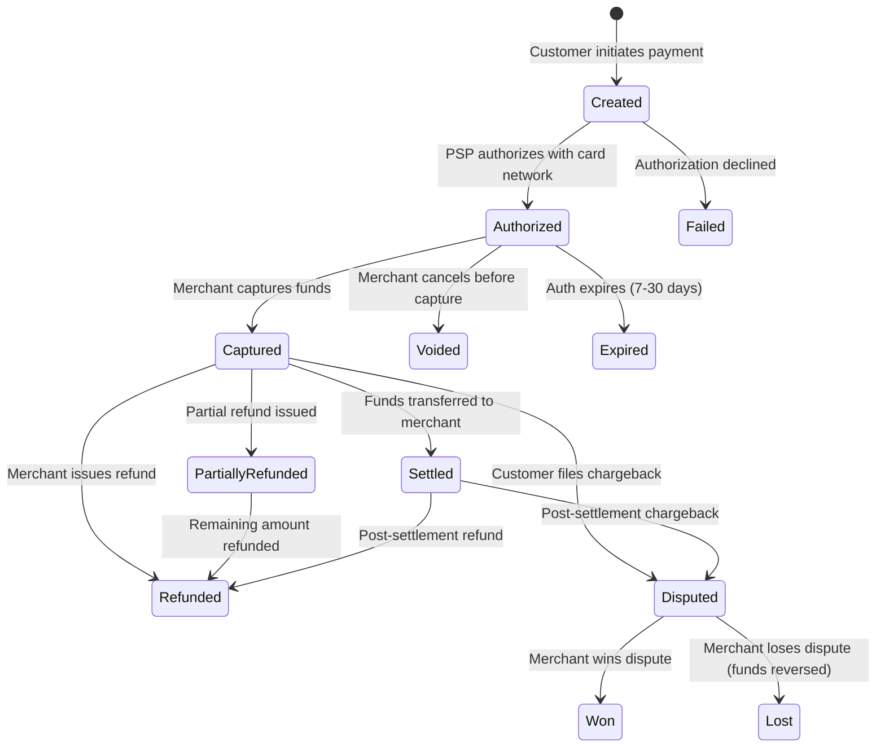

# Payment Engineering Overview

Payment engineering is the discipline of building software systems that move money. It is among the most demanding areas of software engineering because the requirements are unforgiving: every transaction must be exactly right (no off-by-one cents), every failure must be handled gracefully (no lost payments, no double charges), every action must be auditable (regulators will ask), and the system must work 24/7 because money never sleeps.

Most engineering teams encounter payments when they integrate Stripe, Adyen, or PayPal. This is the tip of the iceberg. Behind that API call lies a complex ecosystem of acquiring banks, card networks, issuing banks, fraud detection systems, compliance frameworks, and settlement processes. Understanding this ecosystem is essential for building payment systems that work correctly — not just in the happy path, but in the failure modes that keep fintech engineers up at night.

## The Payment Processing Landscape


### Key Players

| Entity | Role | Examples |
|---|---|---|
| **Customer** | Person or business making a payment | Your users |
| **Merchant** | Business receiving the payment | Your company |
| **PSP (Payment Service Provider)** | Provides payment processing APIs, handles PCI compliance | Stripe, Adyen, Braintree, Square |
| **Payment Gateway** | Routes transactions between merchant and acquirer | Often bundled with PSP |
| **Acquiring Bank** | Bank that processes payments on behalf of the merchant | Chase Paymentech, First Data |
| **Card Network** | Routes authorization requests between acquirer and issuer | Visa, Mastercard, Amex, Discover |
| **Issuing Bank** | Bank that issued the customer's card | Customer's bank |
| **Payment Orchestrator** | Routes across multiple PSPs for optimization | Spreedly, Primer, your own |

::: tip PSP vs Payment Gateway vs Acquirer
These terms are often confused. A **gateway** is the technology that routes transactions. An **acquirer** is the bank that holds the merchant account. A **PSP** bundles both (and more) into a single API. Stripe is a PSP that acts as gateway and aggregates acquiring relationships so you do not need your own merchant account.
:::

## The Payment Lifecycle

Every payment goes through a series of states. Understanding this lifecycle is critical for building correct payment systems.



### Authorization vs Capture

The two-phase flow (authorize then capture) is important for many business models:

| Phase | What Happens | When Funds Move |
|---|---|---|
| **Authorization** | Card network verifies funds are available and places a hold | No funds move yet |
| **Capture** | Merchant claims the authorized funds | Funds move from customer to merchant |

```typescript
// Two-phase payment flow with Stripe
import Stripe from 'stripe';

const stripe = new Stripe(process.env.STRIPE_SECRET_KEY!);

// Step 1: Authorize (hold funds)
const paymentIntent = await stripe.paymentIntents.create({
  amount: 5000,  // $50.00 in cents
  currency: 'usd',
  payment_method: paymentMethodId,
  capture_method: 'manual',  // Don't capture immediately
  confirm: true,
  idempotency_key: `auth_${orderId}`,
});
// Status: 'requires_capture'

// Step 2: Capture (claim funds) — e.g., when order ships
const captured = await stripe.paymentIntents.capture(
  paymentIntent.id,
  {
    amount_to_capture: 4500,  // Can capture less than authorized
    idempotency_key: `capture_${orderId}`,
  }
);
// Status: 'succeeded'
```

**When to use two-phase:**
- E-commerce (authorize at checkout, capture at shipment)
- Hotels and car rentals (authorize at booking, capture at checkout)
- Marketplaces (authorize buyer, capture when seller confirms)

**When to use single-phase (auth + capture together):**
- Digital goods (immediate delivery)
- Subscriptions (known recurring amount)
- Donations

## Payment Methods

The world of payment methods extends far beyond credit cards:

| Category | Methods | Regions | Settlement Time |
|---|---|---|---|
| **Cards** | Visa, Mastercard, Amex, Discover | Global | 1-3 business days |
| **Digital Wallets** | Apple Pay, Google Pay, Samsung Pay | Global | 1-3 business days |
| **Bank Transfers** | ACH (US), SEPA (EU), Faster Payments (UK) | Regional | Instant to 3 days |
| **Buy Now Pay Later** | Klarna, Affirm, Afterpay | Regional | Varies |
| **Real-Time Payments** | UPI (India), PIX (Brazil), FPS (UK) | Country-specific | Instant |
| **Alternative** | PayPal, Venmo, Cash App | Regional | 1-3 days |
| **Crypto** | Bitcoin, USDC, various tokens | Global | Minutes to hours |
| **Invoicing** | Net-30, Net-60 B2B invoices | B2B | 30-60 days |

### Supporting Multiple Payment Methods

```typescript
// Payment method abstraction
interface PaymentMethodHandler {
  type: string;
  authorize(params: AuthorizeParams): Promise<PaymentResult>;
  capture(paymentId: string, amount: number): Promise<PaymentResult>;
  refund(paymentId: string, amount: number): Promise<RefundResult>;
  supportsPartialCapture: boolean;
  supportsPartialRefund: boolean;
}

// Registry pattern for payment methods
class PaymentMethodRegistry {
  private handlers = new Map<string, PaymentMethodHandler>();

  register(handler: PaymentMethodHandler): void {
    this.handlers.set(handler.type, handler);
  }

  getHandler(type: string): PaymentMethodHandler {
    const handler = this.handlers.get(type);
    if (!handler) {
      throw new Error(`Unsupported payment method: ${type}`);
    }
    return handler;
  }
}

const registry = new PaymentMethodRegistry();
registry.register(new StripeCardHandler());
registry.register(new StripeACHHandler());
registry.register(new PayPalHandler());
registry.register(new AdyenSEPAHandler());
```

## Idempotency: The Cardinal Rule

In payment engineering, idempotency is not optional. Network failures, timeouts, and retries mean that your system will inevitably send the same request more than once. Without idempotency, you charge the customer twice.

```typescript
// Idempotent payment processing
async function processPayment(
  orderId: string,
  amount: number,
  currency: string,
  paymentMethodId: string
): Promise<PaymentResult> {
  // Generate a deterministic idempotency key from business identifiers
  const idempotencyKey = `payment_${orderId}_${amount}_${currency}`;

  // Check if we already processed this payment
  const existing = await db.query(
    'SELECT * FROM payments WHERE idempotency_key = $1',
    [idempotencyKey]
  );

  if (existing.rows[0]) {
    // Return the existing result — do NOT process again
    return existing.rows[0];
  }

  // Create payment record BEFORE calling PSP
  const paymentId = generateULID();
  await db.query(
    `INSERT INTO payments (id, order_id, amount, currency, status, idempotency_key)
     VALUES ($1, $2, $3, $4, 'pending', $5)`,
    [paymentId, orderId, amount, currency, idempotencyKey]
  );

  try {
    // Call PSP with idempotency key
    const result = await stripe.paymentIntents.create(
      {
        amount,
        currency,
        payment_method: paymentMethodId,
        confirm: true,
      },
      { idempotencyKey }
    );

    // Update payment record with result
    await db.query(
      `UPDATE payments SET status = $1, psp_id = $2, psp_response = $3
       WHERE id = $4`,
      [result.status === 'succeeded' ? 'captured' : 'failed',
       result.id, JSON.stringify(result), paymentId]
    );

    return { paymentId, status: result.status, pspId: result.id };
  } catch (error) {
    await db.query(
      `UPDATE payments SET status = 'failed', error = $1 WHERE id = $2`,
      [error.message, paymentId]
    );
    throw error;
  }
}
```

::: danger The Idempotency Key Must Be Deterministic
Never use random UUIDs as idempotency keys. The key must be derived from the business operation so that retries produce the same key. `payment_${orderId}` is good. `payment_${uuid()}` defeats the purpose.
:::

## Payment Data Model

```sql
-- Core payment tables
CREATE TABLE payments (
    id UUID PRIMARY KEY,
    tenant_id UUID NOT NULL,
    order_id UUID NOT NULL,
    customer_id UUID NOT NULL,
    amount_cents BIGINT NOT NULL CHECK (amount_cents > 0),
    currency TEXT NOT NULL CHECK (length(currency) = 3),
    status TEXT NOT NULL DEFAULT 'pending'
        CHECK (status IN ('pending', 'authorized', 'captured',
                         'failed', 'voided', 'refunded',
                         'partially_refunded', 'disputed')),
    payment_method_type TEXT NOT NULL,
    psp_id TEXT,                    -- Stripe/Adyen ID
    psp_response JSONB,
    idempotency_key TEXT NOT NULL UNIQUE,
    error_code TEXT,
    error_message TEXT,
    authorized_at TIMESTAMPTZ,
    captured_at TIMESTAMPTZ,
    created_at TIMESTAMPTZ NOT NULL DEFAULT now(),
    updated_at TIMESTAMPTZ NOT NULL DEFAULT now()
);

CREATE TABLE refunds (
    id UUID PRIMARY KEY,
    payment_id UUID NOT NULL REFERENCES payments(id),
    amount_cents BIGINT NOT NULL CHECK (amount_cents > 0),
    reason TEXT,
    status TEXT NOT NULL DEFAULT 'pending'
        CHECK (status IN ('pending', 'succeeded', 'failed')),
    psp_refund_id TEXT,
    idempotency_key TEXT NOT NULL UNIQUE,
    created_at TIMESTAMPTZ NOT NULL DEFAULT now()
);

CREATE TABLE payment_events (
    id UUID PRIMARY KEY DEFAULT gen_random_uuid(),
    payment_id UUID NOT NULL REFERENCES payments(id),
    event_type TEXT NOT NULL,
    event_data JSONB NOT NULL,
    source TEXT NOT NULL,          -- 'application', 'webhook', 'manual'
    created_at TIMESTAMPTZ NOT NULL DEFAULT now()
);

-- Always use BIGINT for money, never FLOAT
-- Store amounts in smallest currency unit (cents for USD)
-- Store currency as ISO 4217 code
```

::: warning Never Use Floating Point for Money
`0.1 + 0.2 = 0.30000000000000004` in IEEE 754 floating point. Use integers (cents) or a decimal type. A one-cent rounding error across millions of transactions becomes a real financial discrepancy.
:::

## PCI DSS Compliance

The Payment Card Industry Data Security Standard (PCI DSS) governs how organizations handle credit card data. The compliance level depends on how much card data your system touches:

| Level | Card Data Exposure | Compliance Effort | Example |
|---|---|---|---|
| **SAQ-A** | No card data touches your servers (hosted payment page) | Minimal — questionnaire only | Stripe Checkout, PayPal hosted buttons |
| **SAQ-A-EP** | Card data passes through your servers but is not stored | Moderate — more controls required | Stripe.js / Elements (client-side tokenization) |
| **SAQ-D** | You store, process, or transmit card data | Extensive — full PCI audit | Building your own payment gateway |

::: tip Minimize PCI Scope
Always use client-side tokenization (Stripe Elements, Adyen Drop-in) to keep card numbers off your servers. This reduces your PCI scope from SAQ-D to SAQ-A or SAQ-A-EP, saving months of compliance work.
:::

## Error Handling: Decline Codes

Payment failures are not generic errors. Each failure has a specific decline code that determines what action to take:

```typescript
// Smart decline handling
interface DeclineAction {
  retryable: boolean;
  customerMessage: string;
  internalAction: string;
}

const DECLINE_ACTIONS: Record<string, DeclineAction> = {
  'card_declined': {
    retryable: false,
    customerMessage: 'Your card was declined. Please try a different payment method.',
    internalAction: 'log',
  },
  'insufficient_funds': {
    retryable: true,
    customerMessage: 'Insufficient funds. Please try again or use a different card.',
    internalAction: 'retry_later',
  },
  'expired_card': {
    retryable: false,
    customerMessage: 'Your card has expired. Please update your payment method.',
    internalAction: 'request_card_update',
  },
  'processing_error': {
    retryable: true,
    customerMessage: 'A temporary error occurred. Please try again in a moment.',
    internalAction: 'retry_with_backoff',
  },
  'fraudulent': {
    retryable: false,
    customerMessage: 'This transaction cannot be processed.',
    internalAction: 'flag_for_review',
  },
  'rate_limit': {
    retryable: true,
    customerMessage: 'Please try again in a moment.',
    internalAction: 'retry_with_backoff',
  },
};

async function handlePaymentFailure(
  paymentId: string,
  declineCode: string
): Promise<DeclineAction> {
  const action = DECLINE_ACTIONS[declineCode] || {
    retryable: false,
    customerMessage: 'Payment failed. Please contact support.',
    internalAction: 'escalate',
  };

  // Log for analytics and fraud detection
  await db.query(
    `INSERT INTO payment_events (payment_id, event_type, event_data, source)
     VALUES ($1, 'decline', $2, 'application')`,
    [paymentId, JSON.stringify({ declineCode, action: action.internalAction })]
  );

  return action;
}
```

## Webhook Processing

PSPs communicate asynchronous events (successful captures, disputes, refunds) via webhooks. Webhook processing must be:

1. **Idempotent** — the same event may be delivered multiple times
2. **Order-independent** — events may arrive out of order
3. **Verified** — always validate webhook signatures

```typescript
import Stripe from 'stripe';

const stripe = new Stripe(process.env.STRIPE_SECRET_KEY!);

app.post('/webhooks/stripe',
  express.raw({ type: 'application/json' }),
  async (req, res) => {
    const sig = req.headers['stripe-signature'] as string;

    let event: Stripe.Event;
    try {
      // ALWAYS verify webhook signatures
      event = stripe.webhooks.constructEvent(
        req.body,
        sig,
        process.env.STRIPE_WEBHOOK_SECRET!
      );
    } catch (err) {
      return res.status(400).json({ error: 'Invalid signature' });
    }

    // Idempotency check
    const existing = await db.query(
      'SELECT id FROM processed_webhooks WHERE event_id = $1',
      [event.id]
    );
    if (existing.rows[0]) {
      return res.json({ received: true }); // Already processed
    }

    // Process the event
    try {
      await handleWebhookEvent(event);

      // Mark as processed
      await db.query(
        'INSERT INTO processed_webhooks (event_id, event_type, processed_at) VALUES ($1, $2, now())',
        [event.id, event.type]
      );
    } catch (err) {
      // Return 500 so Stripe retries
      return res.status(500).json({ error: 'Processing failed' });
    }

    res.json({ received: true });
  }
);
```

## Section Contents

| Page | What You'll Learn |
|---|---|
| [Ledger Design & Double-Entry Accounting](/production-blueprints/payment-engineering/ledger-design) | Why double-entry matters, account types, journal entries, PostgreSQL implementation |
| [Payment Reconciliation](/production-blueprints/payment-engineering/reconciliation) | Three-way reconciliation, automated pipelines, handling discrepancies |

## Further Reading

- [Billing Engine Blueprint](/production-blueprints/billing-engine/) — Subscription billing and invoicing
- [Rate Limiter](/production-blueprints/rate-limiter/) — Protecting payment endpoints
- [Event-Driven Architecture](/architecture-patterns/event-driven/) — Event sourcing for payment state machines
- [Multi-Tenancy](/architecture-patterns/multi-tenancy/) — Multi-tenant payment systems
- Stripe documentation (stripe.com/docs) — Best-in-class PSP documentation
- PCI DSS v4.0 standard
- "Payments Systems in the U.S." by Carol Coye Benson
