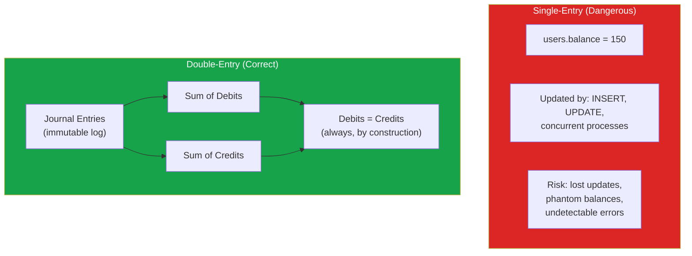

# Ledger Design & Double-Entry Accounting

Every company that moves money needs a ledger. A ledger is the authoritative record of all financial transactions in a system. It answers questions like: How much money does each customer have? How much revenue did we generate this month? Where did that $500 go? If your payment system is the engine, the ledger is the odometer — it records every mile.

Most engineers first encounter ledgers when they discover that tracking balances with a single `balance` column is dangerously wrong. A single column can be incremented or decremented by multiple concurrent processes, leading to lost updates, phantom balances, and reconciliation nightmares. When your balance does not match the sum of your transactions, you have no way to find the discrepancy.

Double-entry bookkeeping, invented over 500 years ago, solves this problem with a simple invariant: **every transaction must have equal debits and credits**. This constraint makes errors immediately detectable and ensures that money cannot appear from or disappear into thin air.

## Why Double-Entry Matters for Software

The single-entry approach (just update a balance) seems simpler but fails in critical ways:

| Problem | Single-Entry | Double-Entry |
|---|---|---|
| Lost update | Two concurrent updates can overwrite each other | Each entry is an immutable row — no overwrites |
| Mystery discrepancy | Balance does not match; no way to find why | Sum of debits always equals sum of credits |
| Audit trail | Must reconstruct from logs | Complete, ordered transaction history |
| Reconciliation | Compare balance to... what? | Compare internal ledger to external records |
| Multi-currency | Balance in which currency? | Each account has a currency; conversions are explicit |
| Platform balance | Track platform fees, payouts, reserves separately | Each is a distinct account |



## Core Concepts

### Accounts

An account is a named bucket that accumulates value. Every transaction involves at least two accounts — one is debited, the other is credited.

There are five fundamental account types in accounting:

| Account Type | Normal Balance | Increases With | Decreases With | Examples |
|---|---|---|---|---|
| **Asset** | Debit | Debit | Credit | Cash, accounts receivable, inventory |
| **Liability** | Credit | Credit | Debit | Accounts payable, customer deposits |
| **Equity** | Credit | Credit | Debit | Owner's equity, retained earnings |
| **Revenue** | Credit | Credit | Debit | Sales revenue, subscription fees |
| **Expense** | Debit | Debit | Credit | Processing fees, refunds, chargebacks |

The fundamental accounting equation:

```
Assets = Liabilities + Equity + (Revenue - Expenses)
```

::: tip Debit vs Credit in Software
Forget the everyday meaning of "debit" and "credit." In accounting: **debit** means left side of the ledger entry, **credit** means right side. Whether a debit increases or decreases an account depends on the account type. Assets increase with debits. Liabilities increase with credits.
:::

### Journal Entries

A journal entry is a single transaction record that contains two or more lines. The sum of all debit amounts must equal the sum of all credit amounts.

```
# Customer pays $50 for a subscription
+---------------------------------------------------+
| Journal Entry #1001                                |
| Date: 2026-03-20                                   |
| Description: Subscription payment - Acme Corp      |
+---------------------------------------------------+
| Account                    | Debit   | Credit      |
|----------------------------|---------|-------------|
| Cash (Asset)               | $50.00  |             |
| Revenue: Subscriptions     |         | $47.10      |
| Liability: Sales Tax       |         | $2.90       |
+---------------------------------------------------+
| Total                      | $50.00  | $50.00      |
+---------------------------------------------------+
```

### Chart of Accounts

A chart of accounts is the organized list of all accounts in your system. For a SaaS platform that processes payments:

```typescript
// Chart of accounts for a SaaS payment platform
const CHART_OF_ACCOUNTS = {
  // Assets (1xxx)
  '1000': { name: 'Cash - Operating',       type: 'asset' },
  '1010': { name: 'Cash - Stripe Balance',  type: 'asset' },
  '1020': { name: 'Cash - Reserve',         type: 'asset' },
  '1100': { name: 'Accounts Receivable',    type: 'asset' },

  // Liabilities (2xxx)
  '2000': { name: 'Customer Deposits',      type: 'liability' },
  '2010': { name: 'Pending Payouts',        type: 'liability' },
  '2020': { name: 'Sales Tax Payable',      type: 'liability' },
  '2030': { name: 'Refunds Payable',        type: 'liability' },

  // Revenue (4xxx)
  '4000': { name: 'Subscription Revenue',   type: 'revenue' },
  '4010': { name: 'Transaction Fees',       type: 'revenue' },
  '4020': { name: 'Platform Commission',    type: 'revenue' },

  // Expenses (5xxx)
  '5000': { name: 'Payment Processing Fees',type: 'expense' },
  '5010': { name: 'Chargeback Losses',      type: 'expense' },
  '5020': { name: 'Refund Costs',           type: 'expense' },
};
```

## PostgreSQL Ledger Implementation

### Schema

```sql
-- Accounts table
CREATE TABLE ledger_accounts (
    id UUID PRIMARY KEY DEFAULT gen_random_uuid(),
    tenant_id UUID NOT NULL,
    code TEXT NOT NULL,
    name TEXT NOT NULL,
    account_type TEXT NOT NULL
        CHECK (account_type IN ('asset', 'liability', 'equity', 'revenue', 'expense')),
    currency TEXT NOT NULL DEFAULT 'USD' CHECK (length(currency) = 3),
    is_active BOOLEAN NOT NULL DEFAULT true,
    metadata JSONB DEFAULT '{}',
    created_at TIMESTAMPTZ NOT NULL DEFAULT now(),
    UNIQUE (tenant_id, code)
);

-- Journal entries (the header)
CREATE TABLE journal_entries (
    id UUID PRIMARY KEY DEFAULT gen_random_uuid(),
    tenant_id UUID NOT NULL,
    entry_date DATE NOT NULL DEFAULT CURRENT_DATE,
    description TEXT NOT NULL,
    reference_type TEXT,          -- 'payment', 'refund', 'payout', 'adjustment'
    reference_id TEXT,            -- ID of the related business object
    idempotency_key TEXT NOT NULL UNIQUE,
    status TEXT NOT NULL DEFAULT 'posted'
        CHECK (status IN ('pending', 'posted', 'reversed')),
    metadata JSONB DEFAULT '{}',
    created_at TIMESTAMPTZ NOT NULL DEFAULT now(),
    created_by TEXT NOT NULL      -- user or system that created the entry
);

-- Journal entry lines (the individual debits and credits)
CREATE TABLE journal_lines (
    id UUID PRIMARY KEY DEFAULT gen_random_uuid(),
    journal_entry_id UUID NOT NULL REFERENCES journal_entries(id),
    account_id UUID NOT NULL REFERENCES ledger_accounts(id),
    amount_cents BIGINT NOT NULL CHECK (amount_cents > 0),
    direction TEXT NOT NULL CHECK (direction IN ('debit', 'credit')),
    description TEXT,
    created_at TIMESTAMPTZ NOT NULL DEFAULT now()
);

-- Enforce double-entry invariant with a constraint trigger
CREATE OR REPLACE FUNCTION check_journal_balance()
RETURNS TRIGGER AS $$
DECLARE
    total_debits BIGINT;
    total_credits BIGINT;
BEGIN
    SELECT
        COALESCE(SUM(CASE WHEN direction = 'debit' THEN amount_cents ELSE 0 END), 0),
        COALESCE(SUM(CASE WHEN direction = 'credit' THEN amount_cents ELSE 0 END), 0)
    INTO total_debits, total_credits
    FROM journal_lines
    WHERE journal_entry_id = NEW.journal_entry_id;

    IF total_debits != total_credits THEN
        RAISE EXCEPTION 'Journal entry % is unbalanced: debits=% credits=%',
            NEW.journal_entry_id, total_debits, total_credits;
    END IF;

    RETURN NEW;
END;
$$ LANGUAGE plpgsql;

-- This trigger fires AFTER all lines are inserted via a deferred constraint
CREATE CONSTRAINT TRIGGER ensure_balanced_entry
    AFTER INSERT ON journal_lines
    DEFERRABLE INITIALLY DEFERRED
    FOR EACH ROW
    EXECUTE FUNCTION check_journal_balance();

-- Indexes
CREATE INDEX idx_journal_entries_tenant ON journal_entries(tenant_id, entry_date);
CREATE INDEX idx_journal_entries_reference ON journal_entries(reference_type, reference_id);
CREATE INDEX idx_journal_entries_idempotency ON journal_entries(idempotency_key);
CREATE INDEX idx_journal_lines_account ON journal_lines(account_id, created_at);
```

::: warning Immutability Is Non-Negotiable
Journal entries are **append-only**. Never update or delete a journal entry. To correct an error, create a **reversal entry** — a new journal entry with the debits and credits swapped. This preserves the complete audit trail.
:::

### Recording Transactions

```typescript
import { Pool, PoolClient } from 'pg';

interface JournalLine {
  accountCode: string;
  amountCents: number;
  direction: 'debit' | 'credit';
  description?: string;
}

interface CreateJournalEntry {
  tenantId: string;
  description: string;
  referenceType: string;
  referenceId: string;
  idempotencyKey: string;
  lines: JournalLine[];
  createdBy: string;
}

async function createJournalEntry(
  pool: Pool,
  entry: CreateJournalEntry
): Promise<string> {
  const client = await pool.connect();

  try {
    await client.query('BEGIN');

    // Validate: debits must equal credits
    const totalDebits = entry.lines
      .filter(l => l.direction === 'debit')
      .reduce((sum, l) => sum + l.amountCents, 0);
    const totalCredits = entry.lines
      .filter(l => l.direction === 'credit')
      .reduce((sum, l) => sum + l.amountCents, 0);

    if (totalDebits !== totalCredits) {
      throw new Error(
        `Unbalanced entry: debits=${totalDebits}, credits=${totalCredits}`
      );
    }

    // Insert journal entry header
    const { rows } = await client.query(
      `INSERT INTO journal_entries
        (tenant_id, description, reference_type, reference_id,
         idempotency_key, created_by)
       VALUES ($1, $2, $3, $4, $5, $6)
       ON CONFLICT (idempotency_key) DO NOTHING
       RETURNING id`,
      [entry.tenantId, entry.description, entry.referenceType,
       entry.referenceId, entry.idempotencyKey, entry.createdBy]
    );

    if (rows.length === 0) {
      // Idempotent: entry already exists
      await client.query('ROLLBACK');
      const existing = await pool.query(
        'SELECT id FROM journal_entries WHERE idempotency_key = $1',
        [entry.idempotencyKey]
      );
      return existing.rows[0].id;
    }

    const entryId = rows[0].id;

    // Insert journal lines
    for (const line of entry.lines) {
      const account = await client.query(
        'SELECT id FROM ledger_accounts WHERE tenant_id = $1 AND code = $2',
        [entry.tenantId, line.accountCode]
      );

      if (!account.rows[0]) {
        throw new Error(`Account not found: ${line.accountCode}`);
      }

      await client.query(
        `INSERT INTO journal_lines
          (journal_entry_id, account_id, amount_cents, direction, description)
         VALUES ($1, $2, $3, $4, $5)`,
        [entryId, account.rows[0].id, line.amountCents,
         line.direction, line.description]
      );
    }

    await client.query('COMMIT');
    return entryId;

  } catch (error) {
    await client.query('ROLLBACK');
    throw error;
  } finally {
    client.release();
  }
}
```

### Real-World Transaction Examples

```typescript
// Example 1: Customer payment of $100 with 2.9% + 30c processing fee
await createJournalEntry(pool, {
  tenantId,
  description: 'Customer payment - Order #1234',
  referenceType: 'payment',
  referenceId: 'pay_abc123',
  idempotencyKey: 'payment_order_1234',
  createdBy: 'payment_service',
  lines: [
    { accountCode: '1010', amountCents: 10000, direction: 'debit',
      description: 'Stripe balance increase' },
    { accountCode: '5000', amountCents: 320, direction: 'debit',
      description: 'Stripe processing fee (2.9% + 30c)' },
    { accountCode: '4000', amountCents: 10320, direction: 'credit',
      description: 'Subscription revenue' },
  ],
});

// Actually, let's fix this. Revenue should be the net amount the customer paid.
// The fee reduces what we receive. Correct entry:
await createJournalEntry(pool, {
  tenantId,
  description: 'Customer payment - Order #1234',
  referenceType: 'payment',
  referenceId: 'pay_abc123',
  idempotencyKey: 'payment_order_1234',
  createdBy: 'payment_service',
  lines: [
    // We receive $96.80 in Stripe after fees
    { accountCode: '1010', amountCents: 9680, direction: 'debit',
      description: 'Stripe balance (net of fees)' },
    // Processing fee is an expense
    { accountCode: '5000', amountCents: 320, direction: 'debit',
      description: 'Stripe processing fee' },
    // Customer paid $100 in revenue
    { accountCode: '4000', amountCents: 10000, direction: 'credit',
      description: 'Subscription revenue' },
  ],
});

// Example 2: Refund of $50
await createJournalEntry(pool, {
  tenantId,
  description: 'Partial refund - Order #1234',
  referenceType: 'refund',
  referenceId: 'ref_xyz789',
  idempotencyKey: 'refund_order_1234_50',
  createdBy: 'payment_service',
  lines: [
    // Revenue decreases
    { accountCode: '4000', amountCents: 5000, direction: 'debit',
      description: 'Revenue reversal' },
    // Cash decreases
    { accountCode: '1010', amountCents: 5000, direction: 'credit',
      description: 'Stripe balance decrease' },
  ],
});

// Example 3: Marketplace — customer pays $100, platform takes 15% commission
await createJournalEntry(pool, {
  tenantId,
  description: 'Marketplace sale - Order #5678',
  referenceType: 'payment',
  referenceId: 'pay_mkt_456',
  idempotencyKey: 'payment_order_5678',
  createdBy: 'payment_service',
  lines: [
    // Cash comes in
    { accountCode: '1010', amountCents: 9680, direction: 'debit',
      description: 'Stripe balance (net of fees)' },
    // Processing fee
    { accountCode: '5000', amountCents: 320, direction: 'debit',
      description: 'Stripe processing fee' },
    // Platform commission (15% of $100)
    { accountCode: '4020', amountCents: 1500, direction: 'credit',
      description: 'Platform commission' },
    // Seller payout owed (85% of $100)
    { accountCode: '2010', amountCents: 8500, direction: 'credit',
      description: 'Pending seller payout' },
  ],
});
```

### Computing Balances

Account balances are computed, never stored. The balance is always the sum of all debit and credit entries:

```sql
-- Get account balance
CREATE OR REPLACE FUNCTION get_account_balance(
    p_account_id UUID,
    p_as_of TIMESTAMPTZ DEFAULT now()
)
RETURNS BIGINT AS $$
DECLARE
    v_account_type TEXT;
    v_total_debits BIGINT;
    v_total_credits BIGINT;
    v_balance BIGINT;
BEGIN
    SELECT account_type INTO v_account_type
    FROM ledger_accounts WHERE id = p_account_id;

    SELECT
        COALESCE(SUM(CASE WHEN direction = 'debit' THEN amount_cents ELSE 0 END), 0),
        COALESCE(SUM(CASE WHEN direction = 'credit' THEN amount_cents ELSE 0 END), 0)
    INTO v_total_debits, v_total_credits
    FROM journal_lines jl
    JOIN journal_entries je ON je.id = jl.journal_entry_id
    WHERE jl.account_id = p_account_id
      AND je.status = 'posted'
      AND je.created_at <= p_as_of;

    -- Balance depends on account type
    -- Asset and Expense: debit-normal (balance = debits - credits)
    -- Liability, Equity, Revenue: credit-normal (balance = credits - debits)
    IF v_account_type IN ('asset', 'expense') THEN
        v_balance := v_total_debits - v_total_credits;
    ELSE
        v_balance := v_total_credits - v_total_debits;
    END IF;

    RETURN v_balance;
END;
$$ LANGUAGE plpgsql;

-- Usage
SELECT
    la.code,
    la.name,
    la.account_type,
    get_account_balance(la.id) AS balance_cents
FROM ledger_accounts la
WHERE la.tenant_id = 'tenant-123'
ORDER BY la.code;
```

### Balance Caching for Performance

Computing balances from scratch is O(n) where n is the number of entries. For accounts with millions of entries, use periodic snapshots:

```sql
-- Balance snapshots for performance
CREATE TABLE account_balance_snapshots (
    account_id UUID NOT NULL REFERENCES ledger_accounts(id),
    snapshot_date DATE NOT NULL,
    balance_cents BIGINT NOT NULL,
    total_debits_cents BIGINT NOT NULL,
    total_credits_cents BIGINT NOT NULL,
    entry_count BIGINT NOT NULL,
    created_at TIMESTAMPTZ NOT NULL DEFAULT now(),
    PRIMARY KEY (account_id, snapshot_date)
);

-- Compute balance using snapshot + recent entries
CREATE OR REPLACE FUNCTION get_balance_fast(
    p_account_id UUID
) RETURNS BIGINT AS $$
DECLARE
    v_account_type TEXT;
    v_snapshot RECORD;
    v_recent_debits BIGINT;
    v_recent_credits BIGINT;
BEGIN
    SELECT account_type INTO v_account_type
    FROM ledger_accounts WHERE id = p_account_id;

    -- Get most recent snapshot
    SELECT * INTO v_snapshot
    FROM account_balance_snapshots
    WHERE account_id = p_account_id
    ORDER BY snapshot_date DESC
    LIMIT 1;

    IF v_snapshot IS NULL THEN
        RETURN get_account_balance(p_account_id);
    END IF;

    -- Sum only entries after the snapshot
    SELECT
        COALESCE(SUM(CASE WHEN jl.direction = 'debit' THEN jl.amount_cents ELSE 0 END), 0),
        COALESCE(SUM(CASE WHEN jl.direction = 'credit' THEN jl.amount_cents ELSE 0 END), 0)
    INTO v_recent_debits, v_recent_credits
    FROM journal_lines jl
    JOIN journal_entries je ON je.id = jl.journal_entry_id
    WHERE jl.account_id = p_account_id
      AND je.status = 'posted'
      AND je.created_at > v_snapshot.snapshot_date + interval '1 day';

    IF v_account_type IN ('asset', 'expense') THEN
        RETURN v_snapshot.balance_cents + (v_recent_debits - v_recent_credits);
    ELSE
        RETURN v_snapshot.balance_cents + (v_recent_credits - v_recent_debits);
    END IF;
END;
$$ LANGUAGE plpgsql;
```

## Reversals, Not Deletions

When a transaction needs to be corrected, create a reversal entry — never modify or delete the original:

```typescript
async function reverseJournalEntry(
  pool: Pool,
  originalEntryId: string,
  reason: string,
  reversedBy: string
): Promise<string> {
  const client = await pool.connect();

  try {
    await client.query('BEGIN');

    // Load original entry and lines
    const { rows: [originalEntry] } = await client.query(
      'SELECT * FROM journal_entries WHERE id = $1',
      [originalEntryId]
    );

    if (originalEntry.status === 'reversed') {
      throw new Error('Entry already reversed');
    }

    const { rows: originalLines } = await client.query(
      'SELECT * FROM journal_lines WHERE journal_entry_id = $1',
      [originalEntryId]
    );

    // Create reversal entry with swapped debits/credits
    const reversalLines: JournalLine[] = originalLines.map(line => ({
      accountCode: line.account_code,
      amountCents: line.amount_cents,
      direction: line.direction === 'debit' ? 'credit' : 'debit',
      description: `REVERSAL: ${line.description || ''}`,
    }));

    const reversalId = await createJournalEntry(pool, {
      tenantId: originalEntry.tenant_id,
      description: `REVERSAL of ${originalEntry.description} — ${reason}`,
      referenceType: 'reversal',
      referenceId: originalEntryId,
      idempotencyKey: `reversal_${originalEntryId}`,
      lines: reversalLines,
      createdBy: reversedBy,
    });

    // Mark original as reversed
    await client.query(
      `UPDATE journal_entries SET status = 'reversed' WHERE id = $1`,
      [originalEntryId]
    );

    await client.query('COMMIT');
    return reversalId;

  } catch (error) {
    await client.query('ROLLBACK');
    throw error;
  } finally {
    client.release();
  }
}
```

## Multi-Currency Ledger

For international payments, each account has a single currency. Currency conversions are explicit journal entries:

```typescript
// Multi-currency payment: customer pays EUR, we report in USD
await createJournalEntry(pool, {
  tenantId,
  description: 'EUR payment with FX conversion',
  referenceType: 'payment',
  referenceId: 'pay_eur_123',
  idempotencyKey: 'payment_eur_123',
  createdBy: 'payment_service',
  lines: [
    // EUR cash account increases
    { accountCode: '1011', amountCents: 8500, direction: 'debit',
      description: 'EUR cash received (EUR 85.00)' },
    // EUR revenue
    { accountCode: '4001', amountCents: 8500, direction: 'credit',
      description: 'Revenue in EUR' },
  ],
});

// Separate FX entry when converting to USD (rate: 1 EUR = 1.08 USD)
await createJournalEntry(pool, {
  tenantId,
  description: 'FX conversion EUR to USD at 1.08',
  referenceType: 'fx_conversion',
  referenceId: 'fx_eur_usd_123',
  idempotencyKey: 'fx_payment_eur_123',
  createdBy: 'treasury_service',
  lines: [
    // USD cash increases
    { accountCode: '1000', amountCents: 9180, direction: 'debit',
      description: 'USD received (EUR 85.00 x 1.08)' },
    // EUR cash decreases
    { accountCode: '1011', amountCents: 8500, direction: 'credit',
      description: 'EUR converted out' },
    // FX gain/loss
    { accountCode: '4030', amountCents: 680, direction: 'credit',
      description: 'FX gain' },
  ],
});
```

## Trial Balance Report

The trial balance is the foundational financial report. If debits do not equal credits, your ledger has a bug:

```sql
-- Trial balance report
SELECT
    la.code,
    la.name,
    la.account_type,
    SUM(CASE WHEN jl.direction = 'debit' THEN jl.amount_cents ELSE 0 END) AS total_debits,
    SUM(CASE WHEN jl.direction = 'credit' THEN jl.amount_cents ELSE 0 END) AS total_credits,
    get_account_balance(la.id) AS balance
FROM ledger_accounts la
LEFT JOIN journal_lines jl ON jl.account_id = la.id
LEFT JOIN journal_entries je ON je.id = jl.journal_entry_id AND je.status = 'posted'
WHERE la.tenant_id = 'tenant-123'
GROUP BY la.id, la.code, la.name, la.account_type
ORDER BY la.code;

-- Verify the fundamental equation
SELECT
    SUM(CASE WHEN la.account_type IN ('asset', 'expense')
         THEN get_account_balance(la.id) ELSE 0 END) AS debit_normal_total,
    SUM(CASE WHEN la.account_type IN ('liability', 'equity', 'revenue')
         THEN get_account_balance(la.id) ELSE 0 END) AS credit_normal_total
FROM ledger_accounts la
WHERE la.tenant_id = 'tenant-123';
-- These two numbers MUST be equal
```

::: danger If Your Trial Balance Is Unbalanced
A trial balance that does not balance means data corruption. Stop processing transactions and investigate immediately. Common causes: direct SQL manipulation of journal_lines, missing constraint triggers, bugs in multi-entry creation. The deferred constraint trigger approach prevents this at the database level.
:::

## Further Reading

- [Payment Engineering Overview](/production-blueprints/payment-engineering/) — Payment lifecycle and PSP architecture
- [Payment Reconciliation](/production-blueprints/payment-engineering/reconciliation) — Verifying ledger accuracy against external sources
- [Multi-Tenant Database Strategies](/architecture-patterns/multi-tenancy/database-strategies) — Multi-tenant ledger considerations
- [Event-Driven Architecture](/architecture-patterns/event-driven/) — Event sourcing for transaction histories
- "Financial Intelligence for Entrepreneurs" by Karen Berman and Joe Knight
- Martin Fowler's "Accounting Patterns" — foundational patterns for financial software
- Square's "Books" blog series on ledger engineering
- Stripe's engineering blog on double-entry bookkeeping
