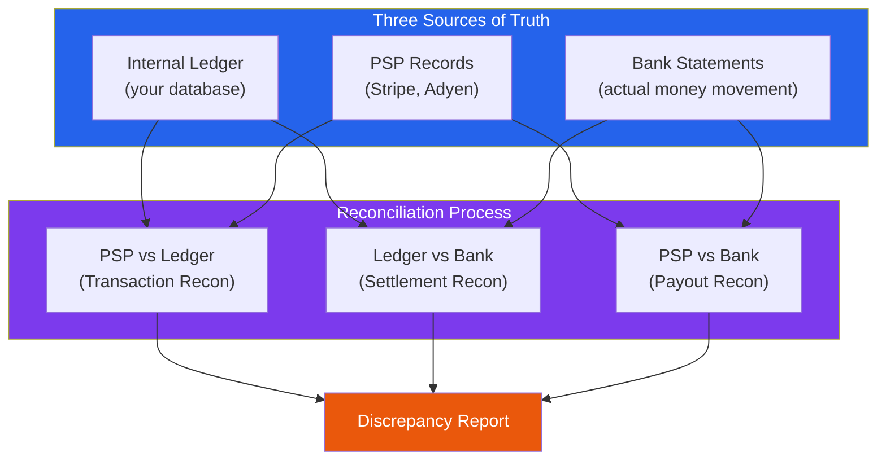
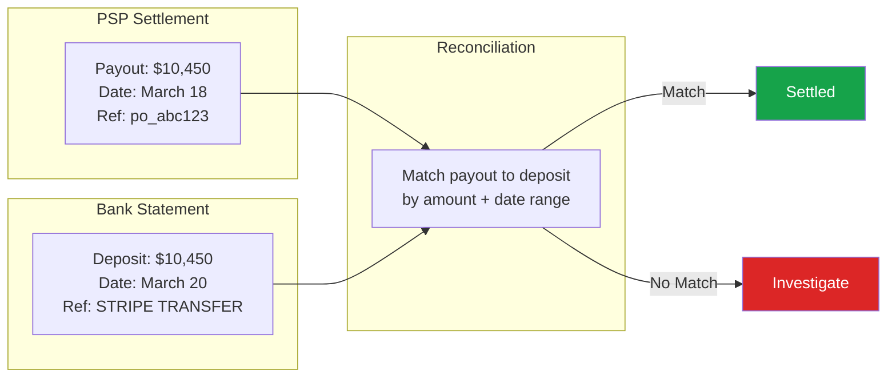
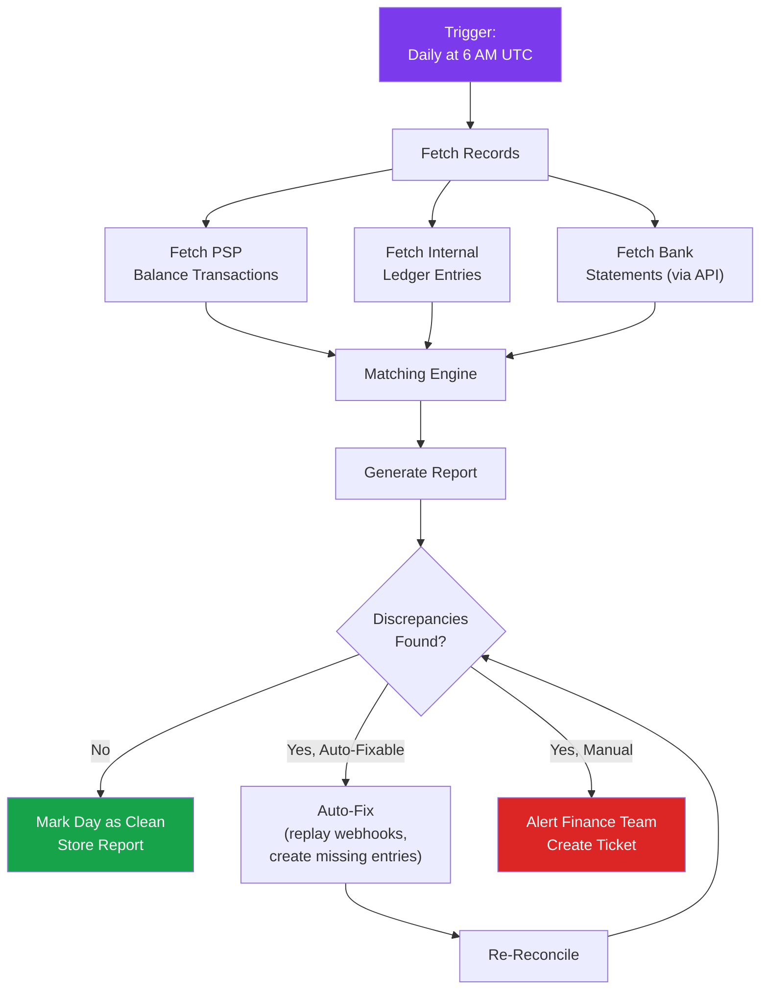

# Payment Reconciliation

Reconciliation is the process of verifying that independent records of the same transactions agree with each other. In payment systems, it means ensuring that what your internal ledger says happened actually matches what the payment service provider (PSP) says happened and what your bank statement shows. When these three sources of truth disagree, you have a problem — and finding that problem before it compounds is what reconciliation is for.

Every company that processes payments needs reconciliation. Without it, you are flying blind. You could be charging customers without recording revenue. You could be issuing refunds that never reach the customer. Your PSP could be settling less money than expected. Your bank balance could drift from your ledger balance by hundreds of dollars a day — and by thousands within a month.

The good news is that reconciliation is a solved problem. The bad news is that most teams underestimate the engineering effort required to automate it reliably. This page gives you the complete picture: what to reconcile, how to reconcile, and how to handle the discrepancies you will inevitably find.

## What Is Reconciliation?

At its core, reconciliation answers one question: **Do all records of the same transaction agree on the amount, status, and timing?**



### Why Three-Way Reconciliation?

| Reconciliation | What It Catches |
|---|---|
| **PSP vs Ledger** | Missing webhook events, duplicate records, wrong amounts, status mismatches |
| **Ledger vs Bank** | Settlement delays, bank processing errors, missing payouts |
| **PSP vs Bank** | PSP settlement errors, fee calculation discrepancies, payout timing issues |

::: tip Start With PSP vs Ledger
If you can only implement one reconciliation, start with PSP vs Ledger. It catches the most common and most dangerous errors (missing payments, duplicate charges, status mismatches). Bank reconciliation can come later.
:::

## Transaction Reconciliation (PSP vs Ledger)

This is the most critical reconciliation. It compares every transaction in your internal ledger against the corresponding record in your PSP.

### Step 1: Fetch PSP Records

```typescript
import Stripe from 'stripe';

const stripe = new Stripe(process.env.STRIPE_SECRET_KEY!);

interface PSPTransaction {
  pspId: string;
  amount: number;
  currency: string;
  status: string;
  type: 'charge' | 'refund' | 'payout' | 'adjustment';
  createdAt: Date;
  fee: number;
  net: number;
  metadata: Record<string, string>;
}

async function fetchStripeTxns(
  startDate: Date,
  endDate: Date
): Promise<PSPTransaction[]> {
  const transactions: PSPTransaction[] = [];

  // Use Balance Transactions for comprehensive records
  for await (const txn of stripe.balanceTransactions.list({
    created: {
      gte: Math.floor(startDate.getTime() / 1000),
      lt: Math.floor(endDate.getTime() / 1000),
    },
    limit: 100,
  })) {
    transactions.push({
      pspId: txn.id,
      amount: txn.amount,
      currency: txn.currency,
      status: txn.status,
      type: txn.type as PSPTransaction['type'],
      createdAt: new Date(txn.created * 1000),
      fee: txn.fee,
      net: txn.net,
      metadata: (txn.source as any)?.metadata || {},
    });
  }

  return transactions;
}
```

### Step 2: Load Internal Ledger Records

```typescript
interface LedgerTransaction {
  paymentId: string;
  pspId: string;
  amount: number;
  currency: string;
  status: string;
  type: string;
  createdAt: Date;
  journalEntryId: string;
}

async function fetchLedgerTxns(
  tenantId: string,
  startDate: Date,
  endDate: Date
): Promise<LedgerTransaction[]> {
  const { rows } = await db.query(`
    SELECT
      p.id AS payment_id,
      p.psp_id,
      p.amount_cents AS amount,
      p.currency,
      p.status,
      CASE
        WHEN p.status IN ('captured', 'authorized') THEN 'charge'
        WHEN p.status = 'refunded' THEN 'refund'
        ELSE p.status
      END AS type,
      p.created_at,
      je.id AS journal_entry_id
    FROM payments p
    LEFT JOIN journal_entries je
      ON je.reference_id = p.psp_id
      AND je.reference_type IN ('payment', 'refund')
    WHERE p.tenant_id = $1
      AND p.created_at >= $2
      AND p.created_at < $3
  `, [tenantId, startDate, endDate]);

  return rows;
}
```

### Step 3: Match and Compare

```typescript
interface ReconciliationResult {
  matched: MatchedTransaction[];
  pspOnly: PSPTransaction[];       // In PSP but not in ledger
  ledgerOnly: LedgerTransaction[]; // In ledger but not in PSP
  discrepancies: Discrepancy[];    // Both exist but disagree
  summary: ReconciliationSummary;
}

interface MatchedTransaction {
  pspId: string;
  pspAmount: number;
  ledgerAmount: number;
  status: string;
}

interface Discrepancy {
  pspId: string;
  type: 'amount_mismatch' | 'status_mismatch' | 'missing_journal_entry';
  pspRecord: Partial<PSPTransaction>;
  ledgerRecord: Partial<LedgerTransaction>;
  details: string;
  severity: 'low' | 'medium' | 'high' | 'critical';
}

async function reconcile(
  tenantId: string,
  date: Date
): Promise<ReconciliationResult> {
  const startDate = new Date(date);
  startDate.setHours(0, 0, 0, 0);
  const endDate = new Date(startDate);
  endDate.setDate(endDate.getDate() + 1);

  const pspTxns = await fetchStripeTxns(startDate, endDate);
  const ledgerTxns = await fetchLedgerTxns(tenantId, startDate, endDate);

  // Index by PSP ID for fast lookup
  const pspMap = new Map(pspTxns.map(t => [t.pspId, t]));
  const ledgerMap = new Map(ledgerTxns.map(t => [t.pspId, t]));

  const matched: MatchedTransaction[] = [];
  const discrepancies: Discrepancy[] = [];
  const pspOnly: PSPTransaction[] = [];
  const ledgerOnly: LedgerTransaction[] = [];

  // Check every PSP transaction against ledger
  for (const [pspId, pspTxn] of pspMap) {
    const ledgerTxn = ledgerMap.get(pspId);

    if (!ledgerTxn) {
      pspOnly.push(pspTxn);
      continue;
    }

    // Check amount match
    if (pspTxn.amount !== ledgerTxn.amount) {
      discrepancies.push({
        pspId,
        type: 'amount_mismatch',
        pspRecord: { amount: pspTxn.amount, currency: pspTxn.currency },
        ledgerRecord: { amount: ledgerTxn.amount, currency: ledgerTxn.currency },
        details: `PSP amount ${pspTxn.amount} != ledger amount ${ledgerTxn.amount}`,
        severity: 'critical',
      });
      continue;
    }

    // Check status match
    const statusMatch = mapStatuses(pspTxn.status, ledgerTxn.status);
    if (!statusMatch) {
      discrepancies.push({
        pspId,
        type: 'status_mismatch',
        pspRecord: { status: pspTxn.status },
        ledgerRecord: { status: ledgerTxn.status },
        details: `PSP status '${pspTxn.status}' != ledger status '${ledgerTxn.status}'`,
        severity: 'high',
      });
      continue;
    }

    // Check journal entry exists
    if (!ledgerTxn.journalEntryId) {
      discrepancies.push({
        pspId,
        type: 'missing_journal_entry',
        pspRecord: { amount: pspTxn.amount },
        ledgerRecord: { paymentId: ledgerTxn.paymentId },
        details: `Payment exists but no journal entry recorded`,
        severity: 'high',
      });
      continue;
    }

    matched.push({
      pspId,
      pspAmount: pspTxn.amount,
      ledgerAmount: ledgerTxn.amount,
      status: ledgerTxn.status,
    });
  }

  // Check for ledger transactions not in PSP
  for (const [pspId, ledgerTxn] of ledgerMap) {
    if (!pspMap.has(pspId)) {
      ledgerOnly.push(ledgerTxn);
    }
  }

  const summary = {
    date: startDate,
    totalPSP: pspTxns.length,
    totalLedger: ledgerTxns.length,
    matched: matched.length,
    pspOnly: pspOnly.length,
    ledgerOnly: ledgerOnly.length,
    discrepancies: discrepancies.length,
    matchRate: matched.length / Math.max(pspTxns.length, 1) * 100,
    status: discrepancies.length === 0 && pspOnly.length === 0 && ledgerOnly.length === 0
      ? 'clean' : 'needs_review',
  };

  return { matched, pspOnly, ledgerOnly, discrepancies, summary };
}
```

## Settlement Reconciliation (Ledger vs Bank)

Settlement reconciliation verifies that the money your PSP says it sent actually arrived in your bank account.



```typescript
interface BankTransaction {
  transactionId: string;
  date: Date;
  amount: number;       // in cents
  description: string;
  type: 'credit' | 'debit';
  reference: string;
}

interface PSPPayout {
  payoutId: string;
  amount: number;
  arrivalDate: Date;
  status: string;
  transactionIds: string[];  // individual charges included in payout
}

async function reconcileSettlements(
  payouts: PSPPayout[],
  bankTxns: BankTransaction[]
): Promise<{
  matched: { payout: PSPPayout; bankTxn: BankTransaction }[];
  unmatchedPayouts: PSPPayout[];
  unmatchedBankTxns: BankTransaction[];
}> {
  const matched: { payout: PSPPayout; bankTxn: BankTransaction }[] = [];
  const matchedBankIds = new Set<string>();

  for (const payout of payouts) {
    // Find matching bank transaction:
    // Same amount, within 3 business days of expected arrival
    const match = bankTxns.find(bt => {
      if (matchedBankIds.has(bt.transactionId)) return false;
      if (bt.type !== 'credit') return false;
      if (bt.amount !== payout.amount) return false;

      const daysDiff = Math.abs(
        (bt.date.getTime() - payout.arrivalDate.getTime()) / (1000 * 60 * 60 * 24)
      );
      return daysDiff <= 3; // Allow 3 days tolerance for bank processing
    });

    if (match) {
      matched.push({ payout, bankTxn: match });
      matchedBankIds.add(match.transactionId);
    }
  }

  const unmatchedPayouts = payouts.filter(
    p => !matched.some(m => m.payout.payoutId === p.payoutId)
  );

  const unmatchedBankTxns = bankTxns.filter(
    bt => !matchedBankIds.has(bt.transactionId) && bt.type === 'credit'
  );

  return { matched, unmatchedPayouts, unmatchedBankTxns };
}
```

## Automated Reconciliation Pipeline



### Pipeline Implementation

```typescript
// Reconciliation job — runs daily
import { CronJob } from 'cron';

interface ReconciliationReport {
  id: string;
  tenantId: string;
  date: Date;
  transactionRecon: ReconciliationResult;
  settlementRecon: SettlementResult | null;
  status: 'clean' | 'auto_fixed' | 'needs_review' | 'escalated';
  autoFixActions: AutoFixAction[];
  createdAt: Date;
}

interface AutoFixAction {
  type: 'replay_webhook' | 'create_journal_entry' | 'update_status';
  transactionId: string;
  details: string;
  applied: boolean;
  result?: string;
}

class ReconciliationPipeline {
  async run(tenantId: string, date: Date): Promise<ReconciliationReport> {
    const reportId = generateULID();
    console.log(`[Recon ${reportId}] Starting reconciliation for ${date.toISOString()}`);

    // Step 1: Transaction reconciliation
    const txnResult = await reconcile(tenantId, date);
    console.log(`[Recon ${reportId}] Transaction recon: ${txnResult.summary.matchRate}% match rate`);

    // Step 2: Attempt auto-fixes
    const autoFixes: AutoFixAction[] = [];

    // Auto-fix: PSP-only transactions (missed webhooks)
    for (const pspTxn of txnResult.pspOnly) {
      if (pspTxn.type === 'charge' && pspTxn.status === 'available') {
        autoFixes.push({
          type: 'replay_webhook',
          transactionId: pspTxn.pspId,
          details: `Payment ${pspTxn.pspId} exists in Stripe but not in ledger. Replaying.`,
          applied: false,
        });

        try {
          await this.replayPayment(tenantId, pspTxn);
          autoFixes[autoFixes.length - 1].applied = true;
          autoFixes[autoFixes.length - 1].result = 'success';
        } catch (error) {
          autoFixes[autoFixes.length - 1].result = error.message;
        }
      }
    }

    // Auto-fix: Missing journal entries
    for (const disc of txnResult.discrepancies) {
      if (disc.type === 'missing_journal_entry') {
        autoFixes.push({
          type: 'create_journal_entry',
          transactionId: disc.pspId,
          details: `Payment exists but journal entry missing. Creating.`,
          applied: false,
        });

        try {
          await this.createMissingJournalEntry(tenantId, disc);
          autoFixes[autoFixes.length - 1].applied = true;
          autoFixes[autoFixes.length - 1].result = 'success';
        } catch (error) {
          autoFixes[autoFixes.length - 1].result = error.message;
        }
      }
    }

    // Step 3: Determine final status
    const remainingIssues =
      txnResult.discrepancies.filter(d => d.type !== 'missing_journal_entry').length +
      txnResult.ledgerOnly.length +
      txnResult.pspOnly.filter(t => !autoFixes.some(a => a.transactionId === t.pspId && a.applied)).length;

    let status: ReconciliationReport['status'];
    if (remainingIssues === 0 && autoFixes.every(a => a.applied)) {
      status = autoFixes.length > 0 ? 'auto_fixed' : 'clean';
    } else if (txnResult.discrepancies.some(d => d.severity === 'critical')) {
      status = 'escalated';
    } else {
      status = 'needs_review';
    }

    // Step 4: Store report
    const report: ReconciliationReport = {
      id: reportId,
      tenantId,
      date,
      transactionRecon: txnResult,
      settlementRecon: null, // Add when bank API is integrated
      status,
      autoFixActions: autoFixes,
      createdAt: new Date(),
    };

    await this.storeReport(report);

    // Step 5: Alert if needed
    if (status === 'needs_review' || status === 'escalated') {
      await this.alertFinanceTeam(report);
    }

    return report;
  }

  private async replayPayment(
    tenantId: string,
    pspTxn: PSPTransaction
  ): Promise<void> {
    // Fetch full payment details from Stripe
    const paymentIntent = await stripe.paymentIntents.retrieve(
      pspTxn.metadata.payment_intent_id
    );

    // Create payment record and journal entry
    await processPayment(
      paymentIntent.metadata.order_id,
      paymentIntent.amount,
      paymentIntent.currency,
      paymentIntent.payment_method as string
    );
  }

  private async createMissingJournalEntry(
    tenantId: string,
    disc: Discrepancy
  ): Promise<void> {
    const payment = await db.query(
      'SELECT * FROM payments WHERE psp_id = $1',
      [disc.pspId]
    );

    if (!payment.rows[0]) return;

    await createJournalEntry(pool, {
      tenantId,
      description: `Auto-reconciliation: Payment ${disc.pspId}`,
      referenceType: 'payment',
      referenceId: disc.pspId,
      idempotencyKey: `recon_journal_${disc.pspId}`,
      createdBy: 'reconciliation_pipeline',
      lines: [
        { accountCode: '1010', amountCents: payment.rows[0].amount_cents,
          direction: 'debit', description: 'Stripe balance' },
        { accountCode: '4000', amountCents: payment.rows[0].amount_cents,
          direction: 'credit', description: 'Revenue (auto-reconciled)' },
      ],
    });
  }

  private async storeReport(report: ReconciliationReport): Promise<void> {
    await db.query(
      `INSERT INTO reconciliation_reports
        (id, tenant_id, recon_date, status, report_data, created_at)
       VALUES ($1, $2, $3, $4, $5, $6)`,
      [report.id, report.tenantId, report.date, report.status,
       JSON.stringify(report), report.createdAt]
    );
  }

  private async alertFinanceTeam(report: ReconciliationReport): Promise<void> {
    const criticalCount = report.transactionRecon.discrepancies
      .filter(d => d.severity === 'critical').length;
    const totalIssues =
      report.transactionRecon.discrepancies.length +
      report.transactionRecon.pspOnly.length +
      report.transactionRecon.ledgerOnly.length;

    await sendSlackAlert({
      channel: '#finance-ops',
      text: `Reconciliation Alert for ${report.date.toISOString().split('T')[0]}`,
      blocks: [
        {
          type: 'section',
          text: {
            type: 'mrkdwn',
            text: [
              `*Reconciliation Report* — ${report.date.toISOString().split('T')[0]}`,
              `Status: *${report.status}*`,
              `Match Rate: ${report.transactionRecon.summary.matchRate.toFixed(1)}%`,
              `Total Issues: ${totalIssues} (${criticalCount} critical)`,
              `PSP-only: ${report.transactionRecon.pspOnly.length}`,
              `Ledger-only: ${report.transactionRecon.ledgerOnly.length}`,
              `Discrepancies: ${report.transactionRecon.discrepancies.length}`,
            ].join('\n'),
          },
        },
      ],
    });
  }
}

// Schedule daily reconciliation
const pipeline = new ReconciliationPipeline();
new CronJob('0 6 * * *', async () => {
  const yesterday = new Date();
  yesterday.setDate(yesterday.getDate() - 1);

  const tenants = await db.query('SELECT id FROM tenants WHERE is_active = true');
  for (const tenant of tenants.rows) {
    try {
      await pipeline.run(tenant.id, yesterday);
    } catch (error) {
      console.error(`Reconciliation failed for tenant ${tenant.id}:`, error);
    }
  }
}).start();
```

## Handling Discrepancies

### Discrepancy Classification

| Type | Severity | Common Cause | Resolution |
|---|---|---|---|
| PSP-only transaction | High | Missed webhook, application error | Replay webhook, create missing records |
| Ledger-only transaction | Critical | PSP rejected but ledger recorded success | Reverse journal entry, investigate |
| Amount mismatch | Critical | Currency conversion error, partial capture | Manual investigation |
| Status mismatch | Medium | Webhook ordering, async processing delay | Wait and re-check, or update status |
| Missing journal entry | High | Bug in payment processing code | Create journal entry |
| Fee discrepancy | Low | PSP fee schedule change | Update fee calculations |
| Timing difference | Low | Settlement delay, timezone mismatch | Widen reconciliation window |

### Reconciliation Database Schema

```sql
CREATE TABLE reconciliation_reports (
    id UUID PRIMARY KEY,
    tenant_id UUID NOT NULL,
    recon_date DATE NOT NULL,
    status TEXT NOT NULL CHECK (status IN ('clean', 'auto_fixed', 'needs_review', 'escalated', 'resolved')),
    match_rate DECIMAL(5,2),
    total_psp_transactions INT,
    total_ledger_transactions INT,
    matched_count INT,
    psp_only_count INT,
    ledger_only_count INT,
    discrepancy_count INT,
    report_data JSONB NOT NULL,
    resolved_by TEXT,
    resolved_at TIMESTAMPTZ,
    resolution_notes TEXT,
    created_at TIMESTAMPTZ NOT NULL DEFAULT now(),
    UNIQUE (tenant_id, recon_date)
);

CREATE TABLE reconciliation_discrepancies (
    id UUID PRIMARY KEY DEFAULT gen_random_uuid(),
    report_id UUID NOT NULL REFERENCES reconciliation_reports(id),
    psp_transaction_id TEXT,
    ledger_payment_id UUID,
    discrepancy_type TEXT NOT NULL,
    severity TEXT NOT NULL CHECK (severity IN ('low', 'medium', 'high', 'critical')),
    psp_amount_cents BIGINT,
    ledger_amount_cents BIGINT,
    difference_cents BIGINT,
    details TEXT NOT NULL,
    status TEXT NOT NULL DEFAULT 'open'
        CHECK (status IN ('open', 'auto_fixed', 'manually_resolved', 'ignored', 'escalated')),
    resolution_action TEXT,
    resolved_by TEXT,
    resolved_at TIMESTAMPTZ,
    created_at TIMESTAMPTZ NOT NULL DEFAULT now()
);

-- Monitoring queries
-- Daily reconciliation health
SELECT
    recon_date,
    status,
    match_rate,
    discrepancy_count,
    psp_only_count + ledger_only_count AS unmatched_count
FROM reconciliation_reports
WHERE tenant_id = $1
ORDER BY recon_date DESC
LIMIT 30;

-- Open discrepancies by severity
SELECT
    severity,
    COUNT(*) AS count,
    SUM(ABS(COALESCE(difference_cents, 0))) AS total_difference_cents
FROM reconciliation_discrepancies
WHERE status = 'open'
GROUP BY severity
ORDER BY
    CASE severity
        WHEN 'critical' THEN 1
        WHEN 'high' THEN 2
        WHEN 'medium' THEN 3
        WHEN 'low' THEN 4
    END;
```

## Reconciliation Metrics and Monitoring

Track these metrics to ensure your reconciliation system is healthy:

```typescript
import { Counter, Gauge, Histogram } from 'prom-client';

// Key reconciliation metrics
const reconMatchRate = new Gauge({
  name: 'reconciliation_match_rate',
  help: 'Percentage of transactions that matched',
  labelNames: ['tenant_id'],
});

const reconDiscrepancies = new Counter({
  name: 'reconciliation_discrepancies_total',
  help: 'Total discrepancies found',
  labelNames: ['tenant_id', 'type', 'severity'],
});

const reconDuration = new Histogram({
  name: 'reconciliation_duration_seconds',
  help: 'Time taken to run reconciliation',
  labelNames: ['tenant_id'],
  buckets: [1, 5, 10, 30, 60, 120, 300],
});

const openDiscrepancies = new Gauge({
  name: 'reconciliation_open_discrepancies',
  help: 'Number of unresolved discrepancies',
  labelNames: ['tenant_id', 'severity'],
});
```

### Alerting Rules

```yaml
# Prometheus alerting rules for reconciliation
groups:
  - name: reconciliation
    rules:
      - alert: ReconciliationMatchRateLow
        expr: reconciliation_match_rate < 99
        for: 1h
        labels:
          severity: warning
        annotations:
          summary: "Reconciliation match rate below 99%"

      - alert: ReconciliationCriticalDiscrepancy
        expr: reconciliation_open_discrepancies{severity="critical"} > 0
        for: 30m
        labels:
          severity: critical
        annotations:
          summary: "Critical reconciliation discrepancy unresolved"

      - alert: ReconciliationNotRun
        expr: time() - reconciliation_last_run_timestamp > 86400 * 2
        labels:
          severity: warning
        annotations:
          summary: "Reconciliation has not run in over 2 days"
```

## Best Practices

::: tip Reconciliation Best Practices
1. **Run daily, not weekly** — Discrepancies compound. A missing $50 payment is easy to find on day 1. After 30 days of transactions, it is buried.
2. **Reconcile T+1** — Always reconcile yesterday's transactions. Same-day reconciliation misses async events still in flight.
3. **Automate everything possible** — Manual reconciliation does not scale. Auto-fix the easy cases (missing webhooks, status updates) and only escalate genuine anomalies.
4. **Track match rate over time** — A healthy system should have >99.5% match rate. Drops indicate systemic issues.
5. **Handle timezone differences explicitly** — Your system uses UTC, Stripe uses UTC, but your bank might report in local time. Normalize everything to UTC before comparing.
6. **Keep reconciliation reports immutable** — Store the full report as a point-in-time snapshot. Do not overwrite old reports.
7. **Separate reconciliation from correction** — The reconciliation pipeline detects discrepancies. A separate process (with proper approvals) resolves them.
:::

::: danger Common Reconciliation Pitfalls
1. **Reconciling amounts without currency** — $100 USD is not the same as 100 EUR. Always compare amount AND currency together.
2. **Ignoring PSP fees** — A $100 charge results in ~$96.80 net. Your ledger must track both gross and net amounts to reconcile correctly with bank deposits.
3. **Not handling partial captures/refunds** — A $100 authorization captured for $80 will not match if you only track the original authorization amount.
4. **Assuming webhook delivery** — Webhooks can fail, arrive late, or arrive out of order. Reconciliation is your safety net for webhook reliability.
5. **No alerting on reconciliation failures** — If the reconciliation pipeline itself fails silently, you lose your safety net.
:::

## Further Reading

- [Payment Engineering Overview](/production-blueprints/payment-engineering/) — Payment lifecycle and PSP architecture
- [Ledger Design & Double-Entry Accounting](/production-blueprints/payment-engineering/ledger-design) — The ledger that reconciliation verifies
- [Billing Engine Blueprint](/production-blueprints/billing-engine/) — Subscription billing reconciliation
- [Observability](/infrastructure/observability/) — Monitoring and alerting infrastructure
- [Event-Driven Architecture](/architecture-patterns/event-driven/) — Event sourcing for payment audit trails
- Stripe's documentation on Balance Transactions and Payouts
- "Payment Systems in the US" by Carol Coye Benson et al.
- Modern Treasury engineering blog — reconciliation at scale
