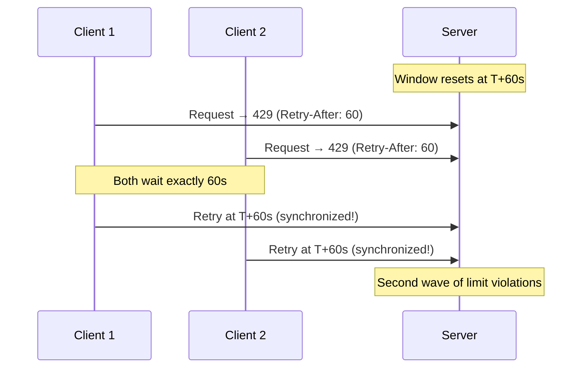
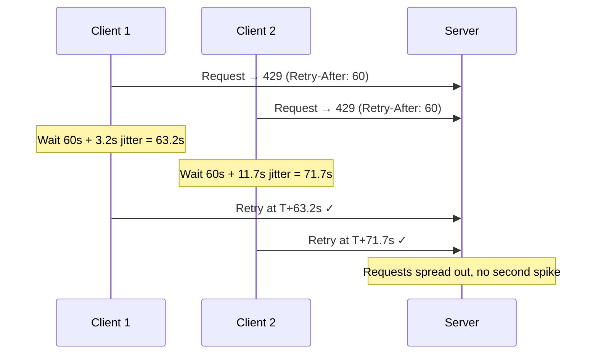

# Rate Limit API Design

## Why This Matters

Rate limiting is invisible when it works. When it breaks — when clients don't understand how to handle 429 responses, when headers are inconsistent, when `Retry-After` is missing — it cascades into retry storms, user complaints, and support tickets.

Good rate limit API design has three layers:
1. **Headers on every response** — communicate current state before limits are hit
2. **Clear 429 responses** — explain what happened and when to retry
3. **Client documentation** — help integrators implement backoff correctly

The IETF has been standardizing rate limit headers since 2019. The draft RFC (draft-ietf-httpapi-ratelimit-headers) reached widespread adoption by major APIs (GitHub, Stripe, Cloudflare) before formal publication.

## The IETF Rate Limit Headers Standard

### Draft RFC: `RateLimit` Header Fields

The IETF draft defines three response header fields:

```
RateLimit-Limit: 100
RateLimit-Remaining: 73
RateLimit-Reset: 1711324800
```

As of 2024, the draft consolidated these into a single `RateLimit` header:

```
RateLimit: limit=100, remaining=73, reset=1711324800
```

Both forms are in use. The split headers are more widely supported by existing tooling (curl, Postman, monitoring). Use split headers for maximum compatibility.

### Header Semantics

```
RateLimit-Limit: <limit> [; w=<window>]
```
- `limit`: Maximum requests allowed in the window
- `w`: Window size in seconds (optional but recommended)

```
RateLimit-Remaining: <count>
```
- Requests remaining in current window
- Always `>= 0` — never negative

```
RateLimit-Reset: <timestamp>
```
- Unix timestamp (seconds) when the window resets
- **Not** a countdown — absolute timestamp

```
Retry-After: <seconds> | <http-date>
```
- Present only on 429 responses
- How long to wait before retrying
- Defined in RFC 7231 (HTTP/1.1 semantics)

### Practical Header Implementation

```typescript
// src/rate-limiter/headers.ts

interface RateLimitHeaderConfig {
  // Use IETF draft standard header names
  standard: boolean;
  // Include window size in RateLimit-Limit header
  includeWindowSize: boolean;
  // Policy name for multi-policy responses
  policyName?: string;
}

export function buildRateLimitHeaders(
  result: {
    limit: number;
    remaining: number;
    resetMs: number;
    retryAfterMs?: number;
    windowMs: number;
  },
  config: RateLimitHeaderConfig = { standard: true, includeWindowSize: true }
): Record<string, string> {
  const headers: Record<string, string> = {};
  const resetSeconds = Math.ceil(result.resetMs / 1000);

  if (config.standard) {
    // IETF draft format
    const limitValue = config.includeWindowSize
      ? `${result.limit}; w=${Math.floor(result.windowMs / 1000)}`
      : `${result.limit}`;

    headers['RateLimit-Limit'] = limitValue;
    headers['RateLimit-Remaining'] = Math.max(0, result.remaining).toString();
    headers['RateLimit-Reset'] = resetSeconds.toString();
  } else {
    // GitHub/Twitter legacy format
    headers['X-RateLimit-Limit'] = result.limit.toString();
    headers['X-RateLimit-Remaining'] = Math.max(0, result.remaining).toString();
    headers['X-RateLimit-Reset'] = resetSeconds.toString();
    // Some APIs add used count
    headers['X-RateLimit-Used'] = (result.limit - Math.max(0, result.remaining)).toString();
  }

  if (result.retryAfterMs !== undefined) {
    headers['Retry-After'] = Math.ceil(result.retryAfterMs / 1000).toString();
  }

  return headers;
}

// Multiple policy headers (IETF draft extension)
export function buildMultiPolicyHeaders(
  policies: Array<{
    name: string;
    limit: number;
    remaining: number;
    resetMs: number;
    windowMs: number;
  }>
): Record<string, string> {
  // Example output:
  // RateLimit: ("per-second" "per-day");l=10;r=8;t=1, ("per-day");l=1000;r=950;t=86400
  const parts = policies.map(({ name, limit, remaining, resetMs, windowMs }) => {
    const resetSeconds = Math.ceil(resetMs / 1000);
    return `("${name}");l=${limit};r=${Math.max(0, remaining)};t=${resetSeconds}`;
  });

  return {
    RateLimit: parts.join(', '),
  };
}
```

### Header Comparison: Major APIs

| API | Limit Header | Remaining | Reset | Notes |
|-----|-------------|-----------|-------|-------|
| GitHub | `X-RateLimit-Limit` | `X-RateLimit-Remaining` | `X-RateLimit-Reset` | Unix timestamp |
| Twitter/X | `x-rate-limit-limit` | `x-rate-limit-remaining` | `x-rate-limit-reset` | Unix timestamp, lowercase |
| Stripe | `RateLimit-Limit` | `RateLimit-Remaining` | `RateLimit-Reset` | IETF draft |
| Cloudflare | `X-RateLimit-Limit` | `X-RateLimit-Remaining` | `X-RateLimit-Reset` | Countdown seconds |
| Reddit | `X-Ratelimit-Limit` | `X-Ratelimit-Remaining` | `X-Ratelimit-Reset` | Seconds until reset |
| Spotify | `X-RateLimit-Limit` | `X-RateLimit-Remaining` | `Retry-After` | Only on 429 |

::: tip
Choose one format and document it clearly. The inconsistency across APIs is a developer experience problem. For new APIs, use the IETF draft format.
:::

## 429 Response Design

### HTTP Status Code Semantics

RFC 6585 defines `429 Too Many Requests`:
> The user has sent too many requests in a given amount of time ("rate limiting").

Key requirements:
- **Must** include `Retry-After` header
- **Should** include explanatory body
- **Must not** include a body with credentials or internal details

### Response Body Schema

```typescript
// src/rate-limiter/errors.ts

interface RateLimitError {
  // Standard error envelope
  error: {
    code: 'RATE_LIMIT_EXCEEDED';
    message: string;
    // Machine-readable details
    details: {
      limit: number;
      window: string;  // Human-readable: "15 minutes"
      retryAfter: number;  // Seconds
      retryAt: string;     // ISO 8601 timestamp
      // Which policy triggered the limit
      policy?: string;
      // Scope: 'user' | 'ip' | 'api-key' | 'global'
      scope: string;
    };
    // Link to documentation
    docs?: string;
  };
}

// Example 429 response body:
const rateLimitErrorResponse: RateLimitError = {
  error: {
    code: 'RATE_LIMIT_EXCEEDED',
    message: 'You have exceeded the rate limit of 100 requests per 15 minutes.',
    details: {
      limit: 100,
      window: '15 minutes',
      retryAfter: 847,
      retryAt: '2026-03-18T14:23:15Z',
      policy: 'authenticated-user',
      scope: 'user',
    },
    docs: 'https://docs.example.com/api/rate-limits',
  },
};
```

### Express 429 Handler

```typescript
// src/rate-limiter/handlers/express-429.ts
import type { Request, Response } from 'express';
import type { RateLimitResult } from '../types';

export function send429(
  req: Request,
  res: Response,
  result: RateLimitResult
): void {
  const retryAfterSeconds = Math.ceil((result.retryAfterMs ?? 60000) / 1000);
  const retryAt = new Date(Date.now() + (result.retryAfterMs ?? 60000)).toISOString();

  // Determine scope from identifier
  const scope = result.identifier.startsWith('user:')
    ? 'user'
    : result.identifier.startsWith('ip:')
    ? 'ip'
    : 'unknown';

  res
    .status(429)
    .setHeader('Retry-After', retryAfterSeconds.toString())
    .setHeader('X-RateLimit-Limit', result.limit.toString())
    .setHeader('X-RateLimit-Remaining', '0')
    .setHeader('X-RateLimit-Reset', Math.ceil(result.resetMs / 1000).toString())
    .json({
      error: {
        code: 'RATE_LIMIT_EXCEEDED',
        message: `Rate limit of ${result.limit} requests exceeded. Retry in ${retryAfterSeconds} seconds.`,
        details: {
          limit: result.limit,
          window: formatWindow(result.resetMs - Date.now()),
          retryAfter: retryAfterSeconds,
          retryAt,
          scope,
        },
        docs: `${process.env.DOCS_URL ?? ''}/rate-limits`,
      },
    });
}

function formatWindow(ms: number): string {
  const seconds = Math.ceil(ms / 1000);
  if (seconds < 60) return `${seconds} seconds`;
  const minutes = Math.floor(seconds / 60);
  if (minutes < 60) return `${minutes} minute${minutes !== 1 ? 's' : ''}`;
  const hours = Math.floor(minutes / 60);
  return `${hours} hour${hours !== 1 ? 's' : ''}`;
}
```

## Client Backoff Strategies

### Exponential Backoff with Jitter

The naive retry strategy — wait the exact `Retry-After` value — causes synchronized retries (thundering herd) when many clients hit the limit simultaneously.



With jitter:



### TypeScript Client SDK

```typescript
// src/client/rate-limit-aware-client.ts

interface RetryConfig {
  maxRetries: number;
  baseDelayMs: number;
  maxDelayMs: number;
  jitterFactor: number;  // 0–1, fraction of delay to randomize
}

interface RateLimitHeaders {
  limit?: number;
  remaining?: number;
  resetAt?: Date;
  retryAfter?: number;
}

export class RateLimitAwareClient {
  private retryConfig: Required<RetryConfig>;

  constructor(
    private baseUrl: string,
    retryConfig: Partial<RetryConfig> = {}
  ) {
    this.retryConfig = {
      maxRetries: 3,
      baseDelayMs: 1000,
      maxDelayMs: 30000,
      jitterFactor: 0.3,
      ...retryConfig,
    };
  }

  async request<T>(
    path: string,
    options: RequestInit = {}
  ): Promise<{ data: T; rateLimits: RateLimitHeaders }> {
    let lastError: Error | undefined;

    for (let attempt = 0; attempt <= this.retryConfig.maxRetries; attempt++) {
      const response = await fetch(`${this.baseUrl}${path}`, options);
      const rateLimits = this.parseRateLimitHeaders(response.headers);

      if (response.ok) {
        const data = await response.json() as T;
        return { data, rateLimits };
      }

      if (response.status === 429) {
        const retryAfterSeconds = rateLimits.retryAfter;

        if (attempt === this.retryConfig.maxRetries) {
          throw new RateLimitError(
            'Rate limit exceeded after max retries',
            rateLimits
          );
        }

        // Calculate wait time with jitter
        const waitMs = this.calculateWaitTime(attempt, retryAfterSeconds);
        console.log(
          `[Rate Limit] Hit limit. Waiting ${waitMs}ms before retry ${attempt + 1}/${this.retryConfig.maxRetries}`
        );

        await this.sleep(waitMs);
        continue;
      }

      // Non-retryable error
      const body = await response.text();
      throw new Error(`HTTP ${response.status}: ${body}`);
    }

    throw lastError ?? new Error('Max retries exceeded');
  }

  private parseRateLimitHeaders(headers: Headers): RateLimitHeaders {
    // Support both standard and X- prefix variants
    const limit =
      headers.get('RateLimit-Limit') ??
      headers.get('X-RateLimit-Limit');
    const remaining =
      headers.get('RateLimit-Remaining') ??
      headers.get('X-RateLimit-Remaining');
    const reset =
      headers.get('RateLimit-Reset') ??
      headers.get('X-RateLimit-Reset');
    const retryAfter = headers.get('Retry-After');

    return {
      limit: limit ? parseInt(limit) : undefined,
      remaining: remaining ? parseInt(remaining) : undefined,
      resetAt: reset ? new Date(parseInt(reset) * 1000) : undefined,
      retryAfter: retryAfter ? parseInt(retryAfter) : undefined,
    };
  }

  private calculateWaitTime(
    attempt: number,
    retryAfterSeconds?: number
  ): number {
    const { baseDelayMs, maxDelayMs, jitterFactor } = this.retryConfig;

    // Start with Retry-After header if available
    let baseWait: number;
    if (retryAfterSeconds !== undefined && retryAfterSeconds > 0) {
      baseWait = retryAfterSeconds * 1000;
    } else {
      // Exponential backoff: base * 2^attempt
      baseWait = Math.min(baseDelayMs * Math.pow(2, attempt), maxDelayMs);
    }

    // Add jitter: uniform random in [0, jitterFactor * baseWait]
    const jitter = Math.random() * jitterFactor * baseWait;
    return Math.floor(baseWait + jitter);
  }

  private sleep(ms: number): Promise<void> {
    return new Promise((resolve) => setTimeout(resolve, ms));
  }

  // Proactive throttling: check remaining before it's 0
  shouldSlowDown(rateLimits: RateLimitHeaders, threshold = 0.1): boolean {
    if (
      rateLimits.remaining === undefined ||
      rateLimits.limit === undefined
    ) {
      return false;
    }
    return rateLimits.remaining / rateLimits.limit < threshold;
  }
}

class RateLimitError extends Error {
  constructor(
    message: string,
    public readonly rateLimits: RateLimitHeaders
  ) {
    super(message);
    this.name = 'RateLimitError';
  }
}
```

### Adaptive Request Spacing

For batch operations, space requests to stay within limits:

```typescript
// src/client/rate-limiter-client.ts

export class ThrottledBatchClient {
  private requestQueue: Array<() => Promise<unknown>> = [];
  private processing = false;
  private lastRequestMs = 0;
  private currentRemaining: number;
  private windowResetMs: number;

  constructor(
    private client: RateLimitAwareClient,
    private rateLimit: { limit: number; windowMs: number }
  ) {
    this.currentRemaining = rateLimit.limit;
    this.windowResetMs = Date.now() + rateLimit.windowMs;
  }

  async processBatch<T>(
    items: T[],
    processor: (item: T) => Promise<unknown>
  ): Promise<void> {
    const minIntervalMs = this.rateLimit.windowMs / this.rateLimit.limit;

    for (const item of items) {
      // Check if we're approaching the limit
      if (this.currentRemaining < 5) {
        const waitMs = this.windowResetMs - Date.now();
        if (waitMs > 0) {
          console.log(`Approaching rate limit. Waiting ${waitMs}ms for window reset.`);
          await new Promise((resolve) => setTimeout(resolve, waitMs + 100));
          this.currentRemaining = this.rateLimit.limit;
          this.windowResetMs = Date.now() + this.rateLimit.windowMs;
        }
      }

      // Enforce minimum spacing between requests
      const elapsed = Date.now() - this.lastRequestMs;
      if (elapsed < minIntervalMs) {
        await new Promise((resolve) =>
          setTimeout(resolve, minIntervalMs - elapsed)
        );
      }

      try {
        const result = await this.client.request(
          '/api/process',
          {
            method: 'POST',
            body: JSON.stringify(item),
          }
        );

        // Update tracking from response headers
        if (result.rateLimits.remaining !== undefined) {
          this.currentRemaining = result.rateLimits.remaining;
        }
        if (result.rateLimits.resetAt) {
          this.windowResetMs = result.rateLimits.resetAt.getTime();
        }
      } catch (err) {
        if (err instanceof RateLimitError) {
          // Back off and retry this item
          const retryMs = (err.rateLimits.retryAfter ?? 60) * 1000;
          await new Promise((resolve) => setTimeout(resolve, retryMs));
          // Re-queue this item
          await processor(item);
        } else {
          throw err;
        }
      }

      this.lastRequestMs = Date.now();
    }
  }
}
```

## Documentation Template for API Consumers

Below is the documentation template you should publish for your rate-limited API:

---

### Rate Limiting Documentation Template

**Rate Limit Headers**

Every API response includes rate limit information:

| Header | Type | Description |
|--------|------|-------------|
| `X-RateLimit-Limit` | Integer | Maximum requests per window |
| `X-RateLimit-Remaining` | Integer | Requests remaining in current window |
| `X-RateLimit-Reset` | Unix Timestamp | When the window resets (UTC) |
| `Retry-After` | Integer | Seconds to wait (only on 429 responses) |

**Example response headers:**

```
HTTP/1.1 200 OK
X-RateLimit-Limit: 1000
X-RateLimit-Remaining: 847
X-RateLimit-Reset: 1711324800
```

**Rate Limit Tiers**

| Tier | Requests/Minute | Requests/Hour | Requests/Day |
|------|----------------|---------------|--------------|
| Free | 60 | 500 | 5,000 |
| Pro | 600 | 5,000 | 100,000 |
| Enterprise | 6,000 | 100,000 | Unlimited |

**Handling 429 Responses**

When you exceed the rate limit, the API returns `429 Too Many Requests`:

```json
{
  "error": {
    "code": "RATE_LIMIT_EXCEEDED",
    "message": "You have exceeded the rate limit of 1000 requests per hour.",
    "details": {
      "limit": 1000,
      "window": "1 hour",
      "retryAfter": 847,
      "retryAt": "2026-03-18T15:00:00Z",
      "scope": "user"
    },
    "docs": "https://docs.example.com/rate-limits"
  }
}
```

**Recommended Retry Logic**

```python
import time
import random
import requests

def api_request_with_retry(url, max_retries=3):
    for attempt in range(max_retries + 1):
        response = requests.get(url)

        if response.status_code == 200:
            return response.json()

        if response.status_code == 429:
            retry_after = int(response.headers.get('Retry-After', 60))
            # Add jitter: 0-20% of wait time
            jitter = random.uniform(0, retry_after * 0.2)
            wait_time = retry_after + jitter

            if attempt < max_retries:
                print(f"Rate limited. Waiting {wait_time:.1f}s (attempt {attempt+1}/{max_retries})")
                time.sleep(wait_time)
            else:
                raise Exception(f"Rate limit exceeded after {max_retries} retries")
        else:
            response.raise_for_status()
```

---

## Edge Cases

### Multiple Rate Limit Policies

When an API has both per-minute and per-day limits, a client might exhaust the per-day limit while the per-minute limit shows capacity:

```typescript
// Send policy-specific headers
function buildMultiPolicyResponse(
  perMinuteResult: RateLimitResult,
  perDayResult: RateLimitResult
): Record<string, string> {
  // Use the most restrictive policy for main headers
  const mostRestrictive = perMinuteResult.remaining < perDayResult.remaining
    ? perMinuteResult
    : perDayResult;

  return {
    'X-RateLimit-Limit': mostRestrictive.limit.toString(),
    'X-RateLimit-Remaining': mostRestrictive.remaining.toString(),
    'X-RateLimit-Reset': Math.ceil(mostRestrictive.resetMs / 1000).toString(),
    // Also expose per-policy headers for transparency
    'X-RateLimit-Limit-Minute': perMinuteResult.limit.toString(),
    'X-RateLimit-Remaining-Minute': perMinuteResult.remaining.toString(),
    'X-RateLimit-Limit-Day': perDayResult.limit.toString(),
    'X-RateLimit-Remaining-Day': perDayResult.remaining.toString(),
  };
}
```

### Idempotency and Rate Limiting

For POST requests with idempotency keys, don't count duplicates against the rate limit:

```typescript
async function checkWithIdempotency(
  req: Request,
  limiter: RedisRateLimiter
): Promise<{ allowed: boolean; isDuplicate: boolean }> {
  const idempotencyKey = req.headers['idempotency-key'] as string;

  if (idempotencyKey) {
    const cacheKey = `idempotent:${idempotencyKey}`;
    const existing = await redis.get(cacheKey);

    if (existing) {
      // Duplicate request — don't count against rate limit
      return { allowed: true, isDuplicate: true };
    }

    // Store idempotency key for 24 hours
    await redis.setex(cacheKey, 86400, '1');
  }

  const result = await limiter.check(req);
  return { allowed: result.allowed, isDuplicate: false };
}
```

### Rate Limiting WebSocket Connections

HTTP rate limiting doesn't apply to WebSocket frames. Implement per-connection and per-message limits:

```typescript
import { WebSocket, WebSocketServer } from 'ws';
import Redis from 'ioredis';

interface WsConnectionState {
  userId: string;
  messageCount: number;
  windowStart: number;
  limit: number;
  windowMs: number;
}

const connectionStates = new Map<WebSocket, WsConnectionState>();

wss.on('connection', (ws, req) => {
  const userId = extractUserId(req);

  connectionStates.set(ws, {
    userId,
    messageCount: 0,
    windowStart: Date.now(),
    limit: 100,        // 100 messages per window
    windowMs: 10_000,  // 10-second window
  });

  ws.on('message', (data) => {
    const state = connectionStates.get(ws);
    if (!state) return;

    const now = Date.now();
    // Reset window if expired
    if (now - state.windowStart > state.windowMs) {
      state.messageCount = 0;
      state.windowStart = now;
    }

    state.messageCount++;

    if (state.messageCount > state.limit) {
      ws.send(JSON.stringify({
        type: 'error',
        code: 'RATE_LIMIT_EXCEEDED',
        message: 'Too many messages. Slow down.',
        retryAfter: Math.ceil((state.windowStart + state.windowMs - now) / 1000),
      }));
      return;
    }

    // Process message
    handleMessage(ws, data, state.userId);
  });

  ws.on('close', () => connectionStates.delete(ws));
});
```

## Mathematical Foundations

### Optimal Retry Delay Distribution

The goal of jitter is to spread retries across time to avoid synchronized bursts. Full jitter (uniform random in `[0, base_delay]`) provides the best distribution:

$$T_{retry} = \text{Uniform}(0,\ \min(cap,\ base \cdot 2^{attempt}))$$

The expected wait time for attempt $k$ with cap $C$:

$$E[T_k] = \frac{\min(C,\ base \cdot 2^k)}{2}$$

Compared to "equal jitter" (half fixed + half random):

$$T_{retry}^{equal} = \frac{\min(C,\ base \cdot 2^k)}{2} + \text{Uniform}\!\left(0,\ \frac{\min(C,\ base \cdot 2^k)}{2}\right)$$

Full jitter has lower expected wait time (faster recovery) and better spread (lower collision probability). The AWS Architecture Blog (2015) popularized this analysis for distributed retry systems.

### Thundering Herd Probability

With $N$ clients hitting a rate limit simultaneously, all with `Retry-After: R` seconds, if each adds uniform jitter $J \sim \text{Uniform}(0, R \cdot \alpha)$, the probability that any two clients retry in the same 1-second window:

$$P(\text{collision}) \approx \frac{N^2}{2 \cdot R \cdot \alpha}$$

For $N = 1000$ clients, $R = 60s$, $\alpha = 0.2$:

$$P \approx \frac{1000^2}{2 \cdot 60 \cdot 0.2 \cdot 1} = \frac{1{,}000{,}000}{24} \approx 41{,}667 \text{ expected collisions}$$

This shows that 20% jitter is insufficient for large client populations. Either increase $\alpha$ (more jitter) or implement exponential backoff to spread clients across multiple retry windows.

::: info War Story
**The 3AM Retry Storm**

A popular developer API sent a mass email at 2AM announcing a new feature. By 3AM, 50,000 developers had updated their integration and were hitting the API. The API had a 1-hour window with daily limits.

At exactly 4AM, the 1-hour window reset. All 50,000 clients simultaneously retried their backed-up requests. The server saw a 50x traffic spike in under a second, overwhelming the rate limiter itself (Redis CPU hit 100%, causing timeouts).

The fix was a three-part change: (1) increase Redis capacity, (2) add 20% jitter to `Retry-After` at the server side, (3) implement client-side backoff in the official SDKs. The jitter was added at the server — not documenting it was intentional, to prevent clients from gaming the wait time.
:::

## Versioning Rate Limit APIs

When you change rate limits, communicate it clearly:

```typescript
// Include policy version in headers
headers['X-RateLimit-Policy'] = 'v2-authenticated';
headers['X-RateLimit-Policy-Docs'] = 'https://docs.example.com/rate-limits/v2';

// Add deprecation notice for old limits
if (isLegacyClient(req)) {
  headers['Deprecation'] = 'true';
  headers['Sunset'] = new Date('2026-12-31').toUTCString();
  headers['Link'] = '<https://docs.example.com/migration>; rel="deprecation"';
}
```

Always provide:
- 90-day notice before reducing limits
- Clear migration path for affected clients
- Grandfathering period for existing integrations
