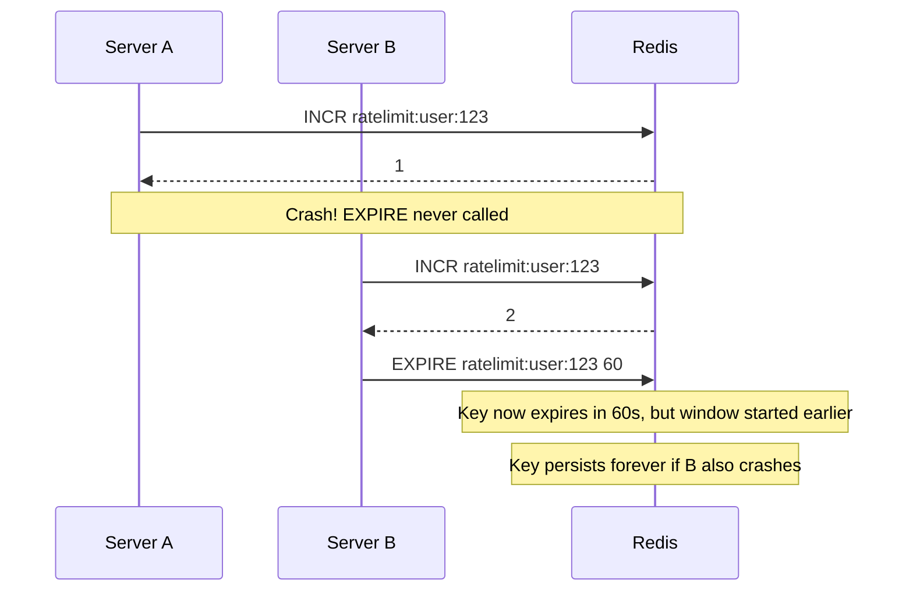
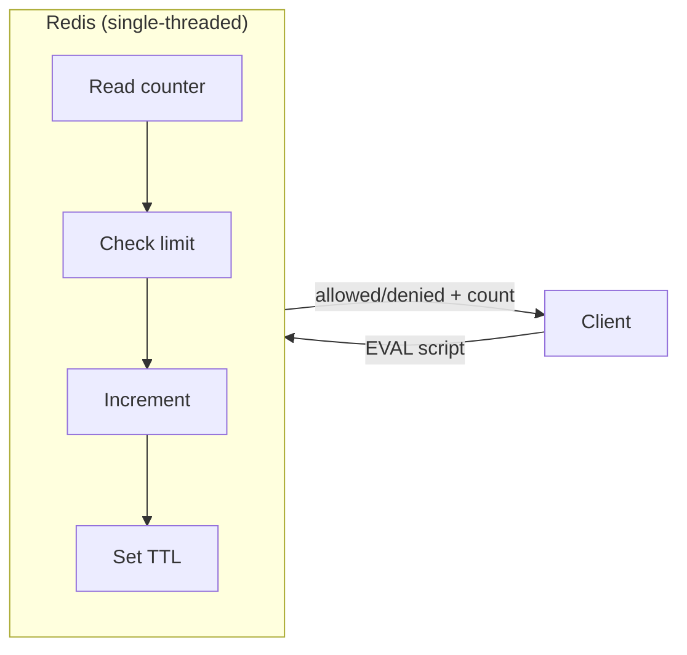
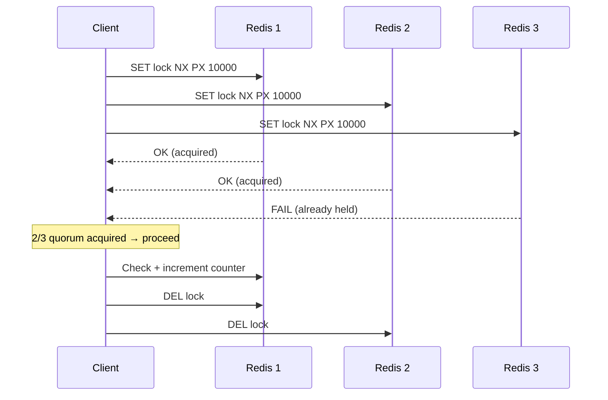
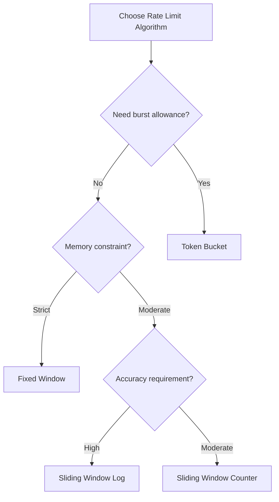

# Distributed Rate Limiting

## Why It Exists

Single-server rate limiting is a solved problem. The moment you add a second server, you've created a distributed systems problem. A user sending 99 requests to server A and 99 requests to server B has sent 198 total requests — yet both servers independently believe the limit of 100 has not been exceeded.

This isn't a hypothetical. Every horizontally scaled API faces this immediately. The naive fix — a shared database counter — introduces race conditions that allow limit overruns by a factor equal to your replica count.

**The history:** Early rate limiters (circa 2008–2012) used MySQL `UPDATE counters SET count = count + 1 WHERE count < limit`. Under load, this produces deadlocks and incorrect counts due to read-modify-write races. Redis emerged as the canonical solution around 2013, when Salvatore Sanfilippo added the `EVAL` command allowing atomic Lua execution. This eliminated the race condition entirely for single-node Redis. Cluster mode introduced new distributed consensus challenges that persist today.

## First Principles: Why Race Conditions Occur

The fundamental problem is the **check-then-act** antipattern:

```
Thread A: Read counter = 99
Thread B: Read counter = 99
Thread A: 99 < 100? Yes. Increment → write 100. Allow request.
Thread B: 99 < 100? Yes. Increment → write 100. Allow request.
```

Both threads allowed a request when only one should have been permitted. The window between read and write is a **TOCTOU (Time of Check to Time of Use)** race condition.

In distributed systems, this is compounded:
- Network latency means the write from Server A may not be visible to Server B for milliseconds
- Redis replication is asynchronous by default — a primary can accept writes before replicas confirm
- Redis Cluster shards keys across nodes — atomic operations only work within a single shard

## Core Mechanics

### The Atomicity Requirement

A correct rate limiter requires **read-increment-expire** as an atomic unit:

```
[READ current_count]──[INCREMENT]──[SET TTL if new]
         ↑                                    ↑
    These must be a single indivisible operation
```

Without atomicity, the window between steps allows races.

### Why INCR + EXPIRE is Still Broken

A common naive implementation:

```
INCR key        # returns new count
EXPIRE key 60   # set 1-minute window
```

**Race condition:** Between `INCR` and `EXPIRE`, another process can `INCR` the key. If the first process crashes before `EXPIRE`, the key lives forever. If a key already has an expiry set, calling `EXPIRE` resets it — so concurrent requests extend each other's windows.



### Lua Scripting: The Correct Solution

Redis `EVAL` executes Lua scripts atomically. The Redis server is single-threaded for command execution — a Lua script runs to completion without interruption. This is the **only** way to guarantee atomicity for multi-step operations in Redis.



## Implementation

### Fixed Window Counter (Lua)

```lua
-- fixed_window.lua
-- KEYS[1] = rate limit key (e.g., "rl:user:123:2024010112")
-- ARGV[1] = limit (maximum requests per window)
-- ARGV[2] = window size in seconds
-- Returns: {current_count, limit, remaining, reset_timestamp, allowed}

local key = KEYS[1]
local limit = tonumber(ARGV[1])
local window = tonumber(ARGV[2])

local current = redis.call('GET', key)

if current == false then
  -- Key doesn't exist: first request in this window
  redis.call('SET', key, 1, 'EX', window)
  return {1, limit, limit - 1, tonumber(redis.call('TTL', key)), 1}
end

current = tonumber(current)

if current >= limit then
  -- Limit exceeded
  local ttl = redis.call('TTL', key)
  return {current, limit, 0, ttl, 0}
end

-- Within limit: increment
local new_count = redis.call('INCR', key)
local ttl = redis.call('TTL', key)
return {new_count, limit, limit - new_count, ttl, 1}
```

### Sliding Window Log (Lua)

The sliding window log is more accurate but memory-intensive. It stores timestamps of every request in a sorted set, then counts requests within the rolling window.

```lua
-- sliding_window_log.lua
-- KEYS[1] = sorted set key
-- ARGV[1] = limit
-- ARGV[2] = window_ms (window size in milliseconds)
-- ARGV[3] = now_ms (current timestamp in ms)
-- Returns: {count, limit, remaining, oldest_ts, allowed}

local key = KEYS[1]
local limit = tonumber(ARGV[1])
local window_ms = tonumber(ARGV[2])
local now_ms = tonumber(ARGV[3])
local window_start = now_ms - window_ms

-- Remove entries older than the window
redis.call('ZREMRANGEBYSCORE', key, 0, window_start)

-- Count remaining entries
local count = redis.call('ZCARD', key)

if count >= limit then
  -- Get TTL of oldest entry to compute retry-after
  local oldest = redis.call('ZRANGE', key, 0, 0, 'WITHSCORES')
  local oldest_ts = oldest[2] and tonumber(oldest[2]) or now_ms
  local retry_after_ms = (oldest_ts + window_ms) - now_ms
  return {count, limit, 0, retry_after_ms, 0}
end

-- Add current request timestamp
redis.call('ZADD', key, now_ms, now_ms .. ':' .. math.random(1000000))
redis.call('PEXPIRE', key, window_ms)

local new_count = count + 1
return {new_count, limit, limit - new_count, window_ms, 1}
```

### Token Bucket (Lua)

Token bucket allows burst traffic while maintaining average rate. Tokens refill at a constant rate; each request consumes one token.

```lua
-- token_bucket.lua
-- KEYS[1] = bucket key
-- ARGV[1] = capacity (max tokens)
-- ARGV[2] = refill_rate (tokens per second)
-- ARGV[3] = now_ms (current time in milliseconds)
-- ARGV[4] = tokens_requested (usually 1)
-- Returns: {tokens_remaining, allowed, wait_ms}

local key = KEYS[1]
local capacity = tonumber(ARGV[1])
local refill_rate = tonumber(ARGV[2])  -- tokens per second
local now_ms = tonumber(ARGV[3])
local requested = tonumber(ARGV[4])

local bucket = redis.call('HMGET', key, 'tokens', 'last_refill')
local tokens = tonumber(bucket[1])
local last_refill = tonumber(bucket[2])

if tokens == nil then
  -- New bucket: start at capacity
  tokens = capacity
  last_refill = now_ms
end

-- Calculate tokens to add based on elapsed time
local elapsed_ms = now_ms - last_refill
local elapsed_seconds = elapsed_ms / 1000.0
local new_tokens = elapsed_seconds * refill_rate

-- Cap at capacity
tokens = math.min(capacity, tokens + new_tokens)
last_refill = now_ms

if tokens < requested then
  -- Not enough tokens
  local wait_seconds = (requested - tokens) / refill_rate
  local wait_ms = math.ceil(wait_seconds * 1000)
  redis.call('HMSET', key, 'tokens', tokens, 'last_refill', last_refill)
  redis.call('PEXPIRE', key, math.ceil(capacity / refill_rate * 1000) + 1000)
  return {tokens, 0, wait_ms}
end

-- Deduct tokens
tokens = tokens - requested
redis.call('HMSET', key, 'tokens', tokens, 'last_refill', last_refill)
redis.call('PEXPIRE', key, math.ceil(capacity / refill_rate * 1000) + 1000)

return {tokens, 1, 0}
```

### Production TypeScript Client

```typescript
import Redis, { Cluster } from 'ioredis';
import { readFileSync } from 'fs';
import { createHash } from 'crypto';

interface RateLimitResult {
  allowed: boolean;
  count: number;
  limit: number;
  remaining: number;
  resetMs: number;
  retryAfterMs?: number;
}

interface RateLimitConfig {
  limit: number;
  windowMs: number;
  algorithm: 'fixed-window' | 'sliding-window' | 'token-bucket';
  keyPrefix?: string;
}

// SHA1 hashes for EVALSHA (loaded once, reused)
const SCRIPT_HASHES: Record<string, string> = {};

// Lua scripts as strings
const FIXED_WINDOW_SCRIPT = `
local key = KEYS[1]
local limit = tonumber(ARGV[1])
local window = tonumber(ARGV[2])
local current = redis.call('GET', key)
if current == false then
  redis.call('SET', key, 1, 'EX', window)
  local ttl = redis.call('TTL', key)
  return {1, limit, limit - 1, ttl, 1}
end
current = tonumber(current)
if current >= limit then
  local ttl = redis.call('TTL', key)
  return {current, limit, 0, ttl, 0}
end
local new_count = redis.call('INCR', key)
local ttl = redis.call('TTL', key)
return {new_count, limit, limit - new_count, ttl, 1}
`;

const SLIDING_WINDOW_SCRIPT = `
local key = KEYS[1]
local limit = tonumber(ARGV[1])
local window_ms = tonumber(ARGV[2])
local now_ms = tonumber(ARGV[3])
local window_start = now_ms - window_ms
redis.call('ZREMRANGEBYSCORE', key, 0, window_start)
local count = redis.call('ZCARD', key)
if count >= limit then
  local oldest = redis.call('ZRANGE', key, 0, 0, 'WITHSCORES')
  local oldest_ts = oldest[2] and tonumber(oldest[2]) or now_ms
  local retry_after_ms = (oldest_ts + window_ms) - now_ms
  return {count, limit, 0, retry_after_ms, 0}
end
local member = now_ms .. ':' .. math.random(1000000)
redis.call('ZADD', key, now_ms, member)
redis.call('PEXPIRE', key, window_ms)
local new_count = count + 1
return {new_count, limit, limit - new_count, window_ms, 1}
`;

export class DistributedRateLimiter {
  private redis: Redis | Cluster;
  private scriptsLoaded = false;

  constructor(redis: Redis | Cluster) {
    this.redis = redis;
  }

  private async loadScripts(): Promise<void> {
    if (this.scriptsLoaded) return;

    // Load scripts and store SHA1 hashes for EVALSHA
    SCRIPT_HASHES['fixed-window'] = await (this.redis as Redis).script(
      'LOAD',
      FIXED_WINDOW_SCRIPT
    ) as string;

    SCRIPT_HASHES['sliding-window'] = await (this.redis as Redis).script(
      'LOAD',
      SLIDING_WINDOW_SCRIPT
    ) as string;

    this.scriptsLoaded = true;
  }

  async checkLimit(
    identifier: string,
    config: RateLimitConfig
  ): Promise<RateLimitResult> {
    await this.loadScripts();

    const prefix = config.keyPrefix ?? 'rl';
    const windowSeconds = Math.floor(config.windowMs / 1000);

    if (config.algorithm === 'fixed-window') {
      // Create time-bucketed key: changes every window
      const windowBucket = Math.floor(Date.now() / config.windowMs);
      const key = `${prefix}:fw:${identifier}:${windowBucket}`;

      const result = await this.evalWithFallback(
        'fixed-window',
        FIXED_WINDOW_SCRIPT,
        [key],
        [config.limit.toString(), windowSeconds.toString()]
      ) as number[];

      return {
        allowed: result[4] === 1,
        count: result[0],
        limit: result[1],
        remaining: result[2],
        resetMs: Date.now() + result[3] * 1000,
        retryAfterMs: result[4] === 0 ? result[3] * 1000 : undefined,
      };
    }

    if (config.algorithm === 'sliding-window') {
      const key = `${prefix}:sw:${identifier}`;
      const nowMs = Date.now();

      const result = await this.evalWithFallback(
        'sliding-window',
        SLIDING_WINDOW_SCRIPT,
        [key],
        [config.limit.toString(), config.windowMs.toString(), nowMs.toString()]
      ) as number[];

      return {
        allowed: result[4] === 1,
        count: result[0],
        limit: result[1],
        remaining: result[2],
        resetMs: nowMs + config.windowMs,
        retryAfterMs: result[4] === 0 ? result[3] : undefined,
      };
    }

    throw new Error(`Unknown algorithm: ${config.algorithm}`);
  }

  // EVALSHA with fallback to EVAL on NOSCRIPT error
  private async evalWithFallback(
    scriptName: string,
    script: string,
    keys: string[],
    args: string[]
  ): Promise<unknown> {
    const sha = SCRIPT_HASHES[scriptName];

    if (sha) {
      try {
        return await (this.redis as Redis).evalsha(sha, keys.length, ...keys, ...args);
      } catch (err: unknown) {
        if (err instanceof Error && err.message.includes('NOSCRIPT')) {
          // Script was evicted (Redis restarted). Reload and retry.
          delete SCRIPT_HASHES[scriptName];
          this.scriptsLoaded = false;
          await this.loadScripts();
          return await (this.redis as Redis).eval(script, keys.length, ...keys, ...args);
        }
        throw err;
      }
    }

    return await (this.redis as Redis).eval(script, keys.length, ...keys, ...args);
  }
}
```

## Redis Cluster: The Distributed Consensus Problem

Redis Cluster complicates atomic operations because Lua scripts can only operate on keys that hash to the same slot. By default, keys are distributed across 16,384 slots using CRC16.

### Hash Tags for Cluster Compatibility

Redis Cluster supports **hash tags**: if a key contains `{...}`, only the substring inside braces determines the slot. This forces keys to the same slot:

```typescript
// Without hash tags — may land on different slots (ERROR in Lua)
const key1 = `rl:user:123:tokens`;
const key2 = `rl:user:123:metadata`;

// With hash tags — guaranteed same slot
const key1 = `{user:123}:rl:tokens`;
const key2 = `{user:123}:rl:metadata`;
```

```lua
-- cluster_token_bucket.lua — uses hash tags
-- All KEYS must use {identifier} hash tag
local tokens_key = KEYS[1]  -- "{user:123}:tokens"
local meta_key = KEYS[2]    -- "{user:123}:meta"
-- Now safe in Redis Cluster: both keys hash to same slot
```

### The Replication Race: WAIT Command

Redis replication is asynchronous. After a write to primary:

```
Primary ──write──> Replica A (async, ~1ms lag)
                 > Replica B (async, ~2ms lag)
```

If primary fails before replicas receive the write, a promoted replica serves stale reads. For rate limiting, this means a user could exceed their limit if:

1. Request increments counter on primary
2. Primary fails before replicating
3. New primary (old replica) shows count as if increment never happened
4. Same user makes another request, which now appears to be within limit

**Mitigation using WAIT:**

```typescript
// After incrementing, wait for at least 1 replica to confirm
async function incrementWithReplication(
  redis: Redis,
  key: string,
  windowSeconds: number
): Promise<void> {
  await redis.incr(key);
  await redis.expire(key, windowSeconds);
  // Wait for 1 replica, timeout 50ms
  // Returns number of replicas that acknowledged
  const replicated = await redis.wait(1, 50);
  if (replicated === 0) {
    // Log warning: replication lag detected
    console.warn('Rate limit write not replicated to any replica');
  }
}
```

::: warning
`WAIT` increases latency by the replication lag (typically 1–5ms). Use only when the cost of overrun is high (e.g., billing systems).
:::

## Redlock for Critical Rate Limiting

For scenarios where even single-counter races are unacceptable (financial APIs, SMS sending), use the **Redlock algorithm** to acquire a distributed lock before modifying the counter.



```typescript
import Redlock from 'redlock';
import Redis from 'ioredis';

const redis1 = new Redis({ host: 'redis-1' });
const redis2 = new Redis({ host: 'redis-2' });
const redis3 = new Redis({ host: 'redis-3' });

const redlock = new Redlock([redis1, redis2, redis3], {
  driftFactor: 0.01,     // clock drift compensation
  retryCount: 3,
  retryDelay: 200,       // ms between retries
  retryJitter: 100,      // random jitter to prevent thundering herd
});

async function criticalRateLimit(
  userId: string,
  limit: number,
  windowSeconds: number
): Promise<boolean> {
  const lockKey = `lock:rl:${userId}`;
  const counterKey = `rl:${userId}`;

  let lock;
  try {
    // Acquire distributed lock with 5s TTL
    lock = await redlock.acquire([lockKey], 5000);

    const count = await redis1.get(counterKey);
    const current = count ? parseInt(count, 10) : 0;

    if (current >= limit) {
      return false;
    }

    if (current === 0) {
      await redis1.set(counterKey, 1, 'EX', windowSeconds);
    } else {
      await redis1.incr(counterKey);
    }

    return true;
  } finally {
    if (lock) {
      await lock.release();
    }
  }
}
```

::: warning
Redlock adds 5–20ms latency per request due to multi-node coordination. Only use for genuinely critical operations. For most APIs, atomic Lua on a single Redis node is sufficient.
:::

## Edge Cases and Failure Modes

### 1. Clock Skew Between Servers

Sliding window algorithms rely on timestamps. If server clocks differ by more than 100ms:

```typescript
// BAD: Uses server's local clock
const nowMs = Date.now();

// BETTER: Use Redis server time for consistency
async function getRedisTime(redis: Redis): Promise<number> {
  const [seconds, microseconds] = await redis.time();
  return parseInt(seconds) * 1000 + Math.floor(parseInt(microseconds) / 1000);
}
```

Redis `TIME` returns the Redis server's clock. All rate limit decisions use the same clock source, eliminating skew between application servers. This adds ~0.1ms per call but guarantees consistency.

### 2. Redis Unavailability: Fail Open vs Fail Closed

```typescript
enum FailureMode {
  OPEN = 'open',    // Allow all requests when Redis is down
  CLOSED = 'closed', // Deny all requests when Redis is down
}

async function checkWithFallback(
  identifier: string,
  config: RateLimitConfig,
  failureMode: FailureMode = FailureMode.OPEN
): Promise<RateLimitResult> {
  try {
    return await rateLimiter.checkLimit(identifier, config);
  } catch (err) {
    // Redis unavailable
    console.error('Rate limiter Redis error:', err);

    if (failureMode === FailureMode.OPEN) {
      // Fail open: allow request, log for audit
      return {
        allowed: true,
        count: 0,
        limit: config.limit,
        remaining: config.limit,
        resetMs: Date.now() + config.windowMs,
      };
    } else {
      // Fail closed: deny request
      return {
        allowed: false,
        count: config.limit,
        limit: config.limit,
        remaining: 0,
        resetMs: Date.now() + config.windowMs,
        retryAfterMs: 60000,
      };
    }
  }
}
```

**Decision guide:**
- Public API with SLA commitments → Fail open (availability > correctness)
- Financial transactions / SMS / email sending → Fail closed (correctness > availability)
- Authentication endpoints → Fail closed (security > availability)

### 3. Memory Exhaustion from Sliding Window

Sorted sets for sliding window logs store one entry per request. For high-traffic keys:

```
1000 req/s × 60s window = 60,000 entries per key
60,000 entries × ~64 bytes = ~3.8 MB per key
1,000 users × 3.8 MB = 3.8 GB RAM
```

**Mitigation: Sliding Window Counter**

Approximate sliding window using two fixed-window counters with weighted averaging:

```typescript
// Approximates sliding window with O(1) memory instead of O(requests)
async function slidingWindowCounter(
  redis: Redis,
  key: string,
  limit: number,
  windowMs: number
): Promise<RateLimitResult> {
  const nowMs = Date.now();
  const windowStart = Math.floor(nowMs / windowMs) * windowMs;
  const prevWindowStart = windowStart - windowMs;
  const elapsed = nowMs - windowStart;
  const elapsedFraction = elapsed / windowMs;

  const currentKey = `${key}:${windowStart}`;
  const prevKey = `${key}:${prevWindowStart}`;

  const [current, previous] = await redis.mget(currentKey, prevKey);
  const currentCount = current ? parseInt(current) : 0;
  const previousCount = previous ? parseInt(previous) : 0;

  // Weighted count: previous window contributes proportionally
  const weightedCount = previousCount * (1 - elapsedFraction) + currentCount;

  if (weightedCount >= limit) {
    const retryAfterMs = Math.ceil(
      ((limit - currentCount) / (previousCount || 1)) * windowMs
    );
    return { allowed: false, count: Math.ceil(weightedCount), limit, remaining: 0, resetMs: windowStart + windowMs, retryAfterMs };
  }

  // Increment current window
  const pipe = redis.pipeline();
  pipe.incr(currentKey);
  pipe.pexpire(currentKey, windowMs * 2);
  await pipe.exec();

  return {
    allowed: true,
    count: Math.ceil(weightedCount) + 1,
    limit,
    remaining: Math.floor(limit - weightedCount - 1),
    resetMs: windowStart + windowMs,
  };
}
```

### 4. Thundering Herd After Window Reset

When a rate limit window resets, all blocked clients may immediately retry:

```typescript
// Stagger retry times with jitter to prevent synchronized retries
function getRetryAfterWithJitter(baseRetryMs: number): number {
  // Add 0–20% random jitter
  const jitter = Math.random() * baseRetryMs * 0.2;
  return Math.floor(baseRetryMs + jitter);
}
```

## Performance Characteristics

### Latency Benchmarks

| Algorithm | Redis RTT | Lua Script Overhead | Total P99 |
|-----------|-----------|---------------------|-----------|
| Fixed Window | ~0.3ms | ~0.05ms | ~1ms |
| Sliding Window Log | ~0.5ms | ~0.2ms | ~2ms |
| Token Bucket | ~0.4ms | ~0.15ms | ~1.5ms |
| Sliding Window Counter | ~0.4ms | ~0.1ms | ~1.2ms |
| Redlock (3 nodes) | ~2ms | ~0.5ms | ~10ms |

### Memory Usage

| Algorithm | Memory per Key | 1M Keys |
|-----------|---------------|---------|
| Fixed Window | ~40 bytes | ~40 MB |
| Sliding Window Log | 64 bytes × count | Up to 3.8 GB |
| Token Bucket | ~96 bytes (hash) | ~96 MB |
| Sliding Window Counter | ~80 bytes (2 keys) | ~80 MB |

### Throughput

A single Redis node can sustain ~100,000 EVAL operations/second. This is typically not the bottleneck — network I/O to Redis is.

Pipeline if checking multiple identifiers:

```typescript
async function batchCheckLimits(
  checks: Array<{ identifier: string; config: RateLimitConfig }>
): Promise<RateLimitResult[]> {
  // Cannot pipeline Lua scripts that return different types
  // Instead, use Promise.all for concurrent (not batched) execution
  return Promise.all(
    checks.map(({ identifier, config }) =>
      rateLimiter.checkLimit(identifier, config)
    )
  );
}
```

## Mathematical Foundations

### Token Bucket Refill Rate

Given capacity $C$ tokens and refill rate $r$ tokens/second, the number of tokens at time $t$ given last refill at $t_0$ with $T_0$ tokens:

$$T(t) = \min\left(C,\ T_0 + r \cdot (t - t_0)\right)$$

Maximum burst allowed: $C$ requests in an instant.

Steady-state throughput (requests/second):

$$\text{throughput} = \min\left(r,\ \frac{C}{\Delta t}\right)$$

where $\Delta t$ is the time between requests.

### Sliding Window Counter Error Bound

The sliding window counter approximation assumes uniform request distribution within windows. The maximum overcount error:

$$\epsilon = \frac{R_{prev} \cdot (1 - f)}{W}$$

where $R_{prev}$ is the previous window count, $f$ is the elapsed fraction of current window, and $W$ is the window size.

In the worst case (all previous window requests at window boundary), the error can allow up to $R_{prev}$ extra requests. In practice, this is acceptable for most APIs (error is < 5% for typical traffic patterns).

### Redlock Safety Probability

With $N$ Redis nodes, acquiring locks on $\lceil N/2 \rceil + 1$ nodes (quorum), the probability of a split-brain scenario (two clients both acquiring quorum) is:

$$P(\text{split-brain}) \leq \left(\frac{\text{clock-drift} + \text{network-jitter}}{\text{lock-TTL}}\right)$$

For a 5-second lock TTL with 10ms drift + 5ms jitter:

$$P \leq \frac{0.015}{5} = 0.003 = 0.3\%$$

This is why Redlock requires careful TTL tuning — too short increases split-brain risk, too long increases latency on failure recovery.

## War Stories

::: info War Story
**The 10x Limit Overrun at a Payments Company**

A fintech startup ran rate limiting on AWS with an auto-scaling group of 10 API servers. Each server used in-memory rate limiting with a periodic sync to DynamoDB every 5 seconds.

During a traffic spike, the sync interval meant each server had a 5-second stale view. With 10 servers and a 100 req/5s limit, users could actually send 1,000 requests in 5 seconds before any server's sync caught the violation.

The fix was switching to Redis with atomic Lua — a half-day migration that reduced the overrun factor from 10x to essentially zero. But they discovered a new issue: under extreme load, Redis latency spiked to 50ms+, adding 50ms to every API response. The fix was connection pooling and a circuit breaker that failed open when Redis p99 exceeded 10ms.
:::

::: info War Story
**NOSCRIPT Errors Under Redis Restart**

A team deployed a new Redis version via rolling restart. During the restart window, some servers had scripts loaded and others didn't. Requests hitting servers without scripts received `NOSCRIPT` errors, which their error handler wasn't catching properly — instead of falling back to `EVAL`, it was returning 500 errors to users.

The fix was the EVALSHA-with-fallback pattern shown above. Additionally, they started preloading scripts on application startup and monitoring for NOSCRIPT error rates as a deployment health signal.
:::

## Decision Framework

### Which Algorithm to Choose



| Scenario | Algorithm | Reason |
|----------|-----------|--------|
| Simple API throttling | Fixed Window | Lowest complexity, minimal memory |
| Burstable compute resources | Token Bucket | Allows short bursts, smooth average |
| Exact SLA enforcement | Sliding Window Log | No boundary artifacts |
| High-traffic with memory constraints | Sliding Window Counter | O(1) memory, ~5% error acceptable |
| Multi-resource coordination | Redlock + Fixed Window | Atomic across independent systems |

### Redis vs Alternatives

| Solution | Latency | Accuracy | Operational Cost | Max Throughput |
|----------|---------|----------|-----------------|----------------|
| Redis Lua | ~1ms | 99.99%+ | Medium | 100K/s/node |
| Redis Cluster | ~2ms | 99.99%+ | High | 1M+/s |
| DynamoDB | 3–10ms | 99.9% | Low | Unlimited |
| PostgreSQL | 5–20ms | 100% | Low | 10K/s |
| Memcached CAS | ~1ms | 99%+ | Low | 100K/s |
| In-memory local | <0.1ms | Per-instance | None | Unlimited |

## Advanced Topics

### Hierarchical Rate Limiting

Layer multiple limiters for different granularities:

```typescript
interface HierarchicalLimits {
  perSecond: number;
  perMinute: number;
  perHour: number;
  perDay: number;
}

async function hierarchicalCheck(
  identifier: string,
  limits: HierarchicalLimits
): Promise<RateLimitResult> {
  const checks = [
    { limit: limits.perSecond, windowMs: 1_000 },
    { limit: limits.perMinute, windowMs: 60_000 },
    { limit: limits.perHour, windowMs: 3_600_000 },
    { limit: limits.perDay, windowMs: 86_400_000 },
  ];

  // Check all limits concurrently
  const results = await Promise.all(
    checks.map(({ limit, windowMs }) =>
      rateLimiter.checkLimit(identifier, {
        limit,
        windowMs,
        algorithm: 'fixed-window',
      })
    )
  );

  // Denied if any limit exceeded
  const denied = results.find((r) => !r.allowed);
  if (denied) return denied;

  // Return the most restrictive remaining
  return results.reduce((a, b) => (a.remaining < b.remaining ? a : b));
}
```

### Adaptive Rate Limiting

Adjust limits based on system load:

```typescript
async function adaptiveLimit(
  baseLimit: number,
  cpuUsagePercent: number
): Promise<number> {
  // Reduce limit linearly as CPU approaches threshold
  const cpuThreshold = 80;
  if (cpuUsagePercent < cpuThreshold) return baseLimit;

  const overload = (cpuUsagePercent - cpuThreshold) / (100 - cpuThreshold);
  const reductionFactor = 1 - overload * 0.5; // reduce by up to 50%
  return Math.max(1, Math.floor(baseLimit * reductionFactor));
}
```
