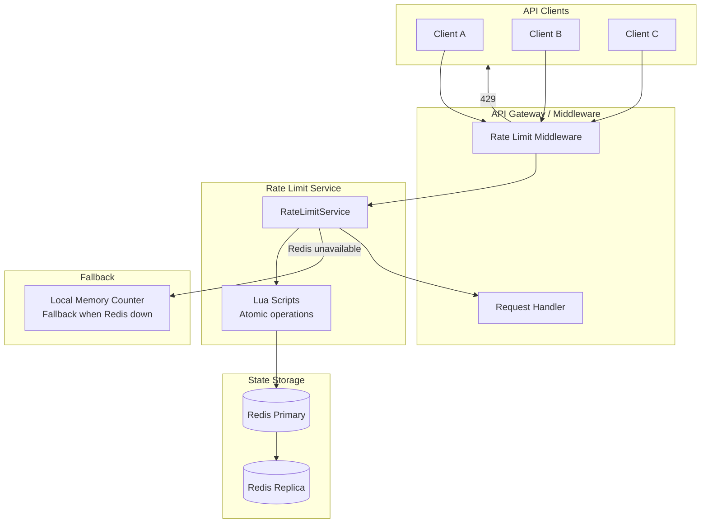

# Rate Limiter: Overview

A rate limiter controls the rate at which clients can make requests to a service. It is a fundamental building block for:
- **API protection**: Prevent abuse, ensure fair usage
- **Cost control**: Limit expensive downstream calls (LLM APIs, payment processors)
- **DDoS mitigation**: Reduce impact of volumetric attacks
- **SLA enforcement**: Guarantee service quality by preventing single clients from monopolizing resources

## Why Rate Limiting Is Hard

A naive counter works on a single server:

```typescript
const counters = new Map<string, number>();

function isAllowed(clientId: string, limit: number): boolean {
  const count = (counters.get(clientId) ?? 0) + 1;
  counters.set(clientId, count);
  return count <= limit;
}
```

This breaks in production because:
1. **Multiple servers**: Each server has its own counter. A client can send N requests per server.
2. **Server restart**: Counters are lost, limits reset.
3. **Race conditions**: Two requests checked simultaneously, both read count=99 with limit=100, both allowed. Counter becomes 101.
4. **Memory unbounded**: A counter per client for all clients ever = memory leak.

Production rate limiting requires:
- Centralized state (Redis)
- Atomic operations (Lua scripts or Redis transactions)
- TTL for automatic cleanup
- Choice of algorithm based on requirements

## Rate Limiting Algorithms

| Algorithm | Accuracy | Memory | Implementation | Best For |
|-----------|---------|--------|----------------|----------|
| Fixed Window Counter | Low (boundary burst) | O(1) | Simple | Coarse limits |
| Sliding Window Log | High | O(requests) | Medium | Accurate per-user |
| Sliding Window Counter | Medium-High | O(1) | Medium | High-throughput |
| Token Bucket | High | O(1) | Complex | Burst-friendly APIs |
| Leaky Bucket | High | O(1) | Complex | Smooth output rate |

See [Algorithms](./algorithms.md) for complete implementations of each.

## Architecture



## Key Design Decisions

### 1. What to Rate Limit On

| Key | Granularity | Use Case |
|-----|------------|---------|
| IP address | Per-IP | Anonymous API, DDoS protection |
| API key | Per-key | Developer APIs |
| User ID | Per-user | Authenticated endpoints |
| User + endpoint | Per-user-route | Different limits per endpoint |
| Organization ID | Per-org | Multi-tenant billing tiers |
| IP + User ID | Combined | Defense in depth |

### 2. Where to Enforce

**Options:**
- **API Gateway** (nginx, Kong, AWS API Gateway): Single enforcement point, language-agnostic, but limited customization
- **Middleware** in each service: Full customization, but must be consistent across services
- **Dedicated rate limit service**: Central policy, but extra network hop
- **Client-side**: Never — clients are untrusted

**Recommendation**: API Gateway for global limits + middleware for per-endpoint business logic limits.

### 3. What to Do When Limited

- **Return 429 Too Many Requests** with:
  - `Retry-After: <seconds>` header
  - `X-RateLimit-Limit: <total>`
  - `X-RateLimit-Remaining: <left>`
  - `X-RateLimit-Reset: <unix_timestamp>`
- **Queueing**: For non-latency-sensitive requests, queue instead of reject
- **Degraded service**: Return a simpler/cheaper version of the response

### 4. Failure Mode

When the rate limit store (Redis) is unavailable:
- **Fail open**: Allow all requests — safe for availability, risky for abuse
- **Fail closed**: Reject all requests — safe from abuse, kills legitimate traffic
- **Degrade to local**: Each server enforces 1/N of the limit locally

**Recommendation**: Fail open with alerting for short outages (< 30 seconds). Fail closed with automatic recovery detection for longer outages.

## Standard HTTP Headers

Per [RFC 6585](https://datatracker.ietf.org/doc/html/rfc6585) and [draft-ietf-httpapi-ratelimit-headers](https://datatracker.ietf.org/doc/html/draft-ietf-httpapi-ratelimit-headers):

```
HTTP/1.1 429 Too Many Requests
Content-Type: application/json
Retry-After: 30
X-RateLimit-Limit: 100
X-RateLimit-Remaining: 0
X-RateLimit-Reset: 1710288060
RateLimit-Policy: 100;w=60;burst=200;comment="token bucket"

{
  "error": "rate_limit_exceeded",
  "message": "You have exceeded the rate limit. Retry after 30 seconds.",
  "retryAfter": 30
}
```

## Configuration Schema

```typescript
export interface RateLimitConfig {
  // Global defaults
  defaultLimit: number;
  defaultWindowSeconds: number;
  defaultAlgorithm: 'token_bucket' | 'sliding_window_counter' | 'fixed_window';

  // Per-tier overrides
  tiers: Record<string, TierConfig>;

  // Per-endpoint overrides
  endpoints: Record<string, EndpointConfig>;

  // Behavior on storage failure
  failureMode: 'open' | 'closed' | 'local';

  // Response headers
  includeHeaders: boolean;
}

export interface TierConfig {
  requestsPerSecond?: number;
  requestsPerMinute?: number;
  requestsPerHour?: number;
  requestsPerDay?: number;
  burstMultiplier?: number;  // Allow burst up to limit × multiplier
}

export interface EndpointConfig {
  limit: number;
  windowSeconds: number;
  algorithm?: 'token_bucket' | 'sliding_window_counter';
  keyExtractor?: 'ip' | 'user' | 'api_key' | 'org';
}

// Example configuration
export const RATE_LIMIT_CONFIG: RateLimitConfig = {
  defaultLimit: 100,
  defaultWindowSeconds: 60,
  defaultAlgorithm: 'token_bucket',
  failureMode: 'open',
  includeHeaders: true,

  tiers: {
    free:       { requestsPerMinute: 60,    requestsPerHour: 1_000,    requestsPerDay: 10_000 },
    starter:    { requestsPerMinute: 300,   requestsPerHour: 10_000,   requestsPerDay: 100_000 },
    growth:     { requestsPerMinute: 1_000, requestsPerHour: 50_000,   requestsPerDay: 500_000 },
    enterprise: { requestsPerMinute: 10_000,requestsPerHour: 500_000,  requestsPerDay: 5_000_000 },
  },

  endpoints: {
    '/api/v1/ai/complete': {
      limit: 10,
      windowSeconds: 60,
      algorithm: 'token_bucket',
      keyExtractor: 'user',
    },
    '/api/v1/export': {
      limit: 5,
      windowSeconds: 3600,
      algorithm: 'sliding_window_counter',
      keyExtractor: 'user',
    },
    '/api/v1/webhooks': {
      limit: 1000,
      windowSeconds: 60,
      keyExtractor: 'ip',
    },
  },
};
```

## Express Middleware

```typescript
import express from 'express';
import { RateLimitService } from './rate-limit-service';

export function rateLimitMiddleware(
  service: RateLimitService,
  options: {
    keyExtractor: (req: express.Request) => string;
    limit: number;
    windowSeconds: number;
    algorithm: 'token_bucket' | 'sliding_window';
  }
) {
  return async (
    req: express.Request,
    res: express.Response,
    next: express.NextFunction
  ): Promise<void> => {
    const key = options.keyExtractor(req);

    const result = await service.checkAndConsume({
      key,
      limit: options.limit,
      windowSeconds: options.windowSeconds,
      algorithm: options.algorithm,
    });

    // Always set headers
    res.setHeader('X-RateLimit-Limit', options.limit);
    res.setHeader('X-RateLimit-Remaining', result.remaining);
    res.setHeader('X-RateLimit-Reset', result.resetAt);

    if (!result.allowed) {
      res.setHeader('Retry-After', result.retryAfterSeconds);
      res.status(429).json({
        error: 'rate_limit_exceeded',
        message: `Rate limit exceeded. Retry after ${result.retryAfterSeconds} seconds.`,
        retryAfter: result.retryAfterSeconds,
      });
      return;
    }

    next();
  };
}

// Helper key extractors
export const keyExtractors = {
  byIp: (req: express.Request) =>
    req.ip ?? req.connection.remoteAddress ?? 'unknown',

  byApiKey: (req: express.Request) =>
    (req.headers['x-api-key'] as string) ?? 'anonymous',

  byUserId: (req: express.Request) =>
    (req as any).user?.id ?? req.ip ?? 'anonymous',

  byOrgId: (req: express.Request) =>
    (req as any).user?.organizationId ?? req.ip ?? 'anonymous',
};
```

## Module Map

```
rate-limiter/
├── index.md        ← You are here
└── algorithms.md   ← Token bucket, leaky bucket, fixed window, sliding window
```

::: info War Story
We launched a public API and didn't implement rate limiting, assuming our authentication would prevent abuse. Within 48 hours, a single API key was making 10,000 requests/minute to a database-backed endpoint. Our PostgreSQL connection pool exhausted at 3am, bringing down the entire application — not just for the abusive client, but for all users.

The fix was emergency nginx rate limiting by IP (very blunt instrument). Proper rate limiting was implemented over the next week. Cost: 4 hours of downtime, $5k SLA credits to affected customers, and 1 security audit.

Rate limiting is not optional for any public API. Implement it before your first external customer.
:::
