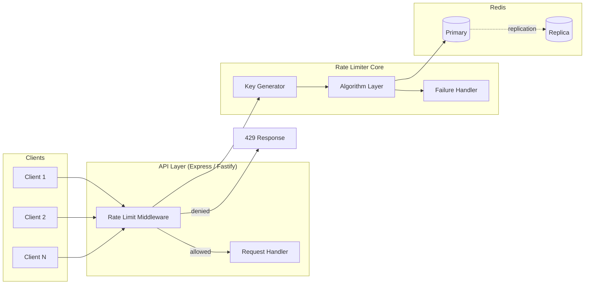

# Redis Rate Limiter Implementation

## Why This Implementation Exists

Every production API eventually needs rate limiting. The NPM ecosystem has dozens of packages (`express-rate-limit`, `rate-limiter-flexible`, `bottleneck`), but most abstract away the internals in ways that make debugging, customization, and performance tuning opaque.

This page implements a rate limiter from scratch using Redis — not to avoid libraries, but to understand exactly what runs in production. The result is ~400 lines that you can audit, modify, and own.

## Architecture Overview



## Core Implementation

### Types and Interfaces

```typescript
// src/rate-limiter/types.ts
export interface RateLimitOptions {
  /** Maximum requests per window */
  limit: number;
  /** Window duration in milliseconds */
  windowMs: number;
  /** Algorithm to use */
  algorithm?: 'fixed-window' | 'sliding-window' | 'token-bucket';
  /** Redis key prefix */
  keyPrefix?: string;
  /** Whether to skip rate limiting for certain requests */
  skip?: (identifier: string) => boolean | Promise<boolean>;
  /** Custom key generator */
  keyGenerator?: (req: RawRequest) => string | Promise<string>;
  /** Handler when limit exceeded */
  onLimitExceeded?: (info: RateLimitInfo) => void;
  /** Behavior when Redis is unavailable */
  failureMode?: 'open' | 'closed';
  /** Headers to include in response */
  headers?: {
    limit?: string;
    remaining?: string;
    reset?: string;
    retryAfter?: string;
  };
}

export interface RateLimitInfo {
  identifier: string;
  limit: number;
  remaining: number;
  resetMs: number;
  retryAfterMs?: number;
  allowed: boolean;
}

export interface RawRequest {
  ip?: string;
  headers: Record<string, string | string[] | undefined>;
  method: string;
  path: string;
  user?: { id: string };
}

export interface RateLimitResult extends RateLimitInfo {
  count: number;
}
```

### Redis Connection Manager

```typescript
// src/rate-limiter/redis-connection.ts
import Redis, { RedisOptions, Cluster, ClusterOptions } from 'ioredis';

export interface RedisConfig {
  mode: 'single' | 'cluster' | 'sentinel';
  single?: RedisOptions;
  cluster?: {
    nodes: Array<{ host: string; port: number }>;
    options?: ClusterOptions;
  };
  sentinel?: {
    sentinels: Array<{ host: string; port: number }>;
    name: string;
    options?: RedisOptions;
  };
}

export function createRedisConnection(config: RedisConfig): Redis | Cluster {
  switch (config.mode) {
    case 'single':
      return new Redis({
        enableReadyCheck: true,
        maxRetriesPerRequest: 3,
        retryStrategy: (times) => Math.min(times * 50, 2000),
        ...config.single,
      });

    case 'cluster':
      if (!config.cluster) throw new Error('Cluster config required');
      return new Cluster(config.cluster.nodes, {
        enableReadyCheck: true,
        maxRetriesPerRequest: 3,
        scaleReads: 'slave', // route reads to replicas
        redisOptions: {
          enableOfflineQueue: false,
        },
        ...config.cluster.options,
      });

    case 'sentinel':
      if (!config.sentinel) throw new Error('Sentinel config required');
      return new Redis({
        sentinels: config.sentinel.sentinels,
        name: config.sentinel.name,
        role: 'master',
        enableReadyCheck: true,
        ...config.sentinel.options,
      });

    default:
      throw new Error(`Unknown Redis mode: ${(config as RedisConfig).mode}`);
  }
}
```

### Lua Script Manager

```typescript
// src/rate-limiter/lua-scripts.ts
import Redis, { Cluster } from 'ioredis';

interface ScriptDefinition {
  name: string;
  script: string;
  numkeys: number;
}

const SCRIPTS: Record<string, ScriptDefinition> = {
  'fixed-window': {
    name: 'fixed-window',
    numkeys: 1,
    script: `
local key = KEYS[1]
local limit = tonumber(ARGV[1])
local window_sec = tonumber(ARGV[2])

local current = redis.call('GET', key)

if current == false then
  redis.call('SET', key, 1, 'EX', window_sec)
  local ttl = redis.call('TTL', key)
  return {1, limit, limit - 1, ttl, 1}
end

current = tonumber(current)

if current >= limit then
  local ttl = redis.call('TTL', key)
  return {current, limit, 0, ttl, 0}
end

local new_val = redis.call('INCR', key)
local ttl = redis.call('TTL', key)
return {new_val, limit, limit - new_val, ttl, 1}
`,
  },

  'sliding-window': {
    name: 'sliding-window',
    numkeys: 1,
    script: `
local key = KEYS[1]
local limit = tonumber(ARGV[1])
local window_ms = tonumber(ARGV[2])
local now_ms = tonumber(ARGV[3])
local window_start = now_ms - window_ms

redis.call('ZREMRANGEBYSCORE', key, 0, window_start)
local count = redis.call('ZCARD', key)

if count >= limit then
  local oldest = redis.call('ZRANGE', key, 0, 0, 'WITHSCORES')
  local retry_ms = window_ms
  if oldest[2] then
    retry_ms = (tonumber(oldest[2]) + window_ms) - now_ms
  end
  return {count, limit, 0, retry_ms, 0}
end

local member = tostring(now_ms) .. ':' .. tostring(math.random(999999))
redis.call('ZADD', key, now_ms, member)
redis.call('PEXPIRE', key, window_ms + 1000)
local new_count = count + 1
return {new_count, limit, limit - new_count, window_ms, 1}
`,
  },

  'token-bucket': {
    name: 'token-bucket',
    numkeys: 1,
    script: `
local key = KEYS[1]
local capacity = tonumber(ARGV[1])
local refill_rate = tonumber(ARGV[2])
local now_ms = tonumber(ARGV[3])
local cost = tonumber(ARGV[4])

local data = redis.call('HMGET', key, 'tokens', 'ts')
local tokens = tonumber(data[1])
local last_ts = tonumber(data[2])

if tokens == nil then
  tokens = capacity
  last_ts = now_ms
end

local elapsed_sec = (now_ms - last_ts) / 1000.0
local refilled = elapsed_sec * refill_rate
tokens = math.min(capacity, tokens + refilled)
last_ts = now_ms

if tokens < cost then
  local wait_sec = (cost - tokens) / refill_rate
  local wait_ms = math.ceil(wait_sec * 1000)
  redis.call('HMSET', key, 'tokens', tokens, 'ts', last_ts)
  local ttl_ms = math.ceil((capacity / refill_rate) * 1000) + 5000
  redis.call('PEXPIRE', key, ttl_ms)
  return {math.floor(tokens), capacity, 0, wait_ms, 0}
end

tokens = tokens - cost
redis.call('HMSET', key, 'tokens', tokens, 'ts', last_ts)
local ttl_ms = math.ceil((capacity / refill_rate) * 1000) + 5000
redis.call('PEXPIRE', key, ttl_ms)
return {math.floor(tokens), capacity, math.floor(tokens), 0, 1}
`,
  },
};

export class LuaScriptManager {
  private hashes: Map<string, string> = new Map();
  private redis: Redis | Cluster;

  constructor(redis: Redis | Cluster) {
    this.redis = redis;
  }

  async preload(): Promise<void> {
    const entries = Object.entries(SCRIPTS);
    await Promise.all(
      entries.map(async ([name, def]) => {
        const hash = await (this.redis as Redis).script('LOAD', def.script) as string;
        this.hashes.set(name, hash);
      })
    );
  }

  async eval(
    scriptName: string,
    keys: string[],
    args: string[]
  ): Promise<number[]> {
    const def = SCRIPTS[scriptName];
    if (!def) throw new Error(`Unknown script: ${scriptName}`);

    const hash = this.hashes.get(scriptName);

    const execute = async (useHash: boolean): Promise<number[]> => {
      const client = this.redis as Redis;
      if (useHash && hash) {
        return client.evalsha(hash, keys.length, ...keys, ...args) as Promise<number[]>;
      }
      return client.eval(def.script, keys.length, ...keys, ...args) as Promise<number[]>;
    };

    try {
      return await execute(true);
    } catch (err: unknown) {
      if (err instanceof Error && err.message.startsWith('NOSCRIPT')) {
        // Reload and retry once
        const newHash = await (this.redis as Redis).script('LOAD', def.script) as string;
        this.hashes.set(scriptName, newHash);
        return await execute(false);
      }
      throw err;
    }
  }
}
```

### Rate Limiter Core

```typescript
// src/rate-limiter/rate-limiter.ts
import Redis, { Cluster } from 'ioredis';
import { LuaScriptManager } from './lua-scripts';
import type { RateLimitOptions, RateLimitResult, RawRequest } from './types';

const DEFAULT_HEADERS = {
  limit: 'X-RateLimit-Limit',
  remaining: 'X-RateLimit-Remaining',
  reset: 'X-RateLimit-Reset',
  retryAfter: 'Retry-After',
};

export class RedisRateLimiter {
  private scripts: LuaScriptManager;
  private options: Required<RateLimitOptions>;
  private initialized = false;

  constructor(
    private redis: Redis | Cluster,
    options: RateLimitOptions
  ) {
    this.scripts = new LuaScriptManager(redis);
    this.options = {
      algorithm: 'fixed-window',
      keyPrefix: 'rl',
      skip: () => false,
      keyGenerator: (req) => this.defaultKeyGenerator(req),
      onLimitExceeded: () => undefined,
      failureMode: 'open',
      headers: DEFAULT_HEADERS,
      ...options,
    };
  }

  async initialize(): Promise<void> {
    if (this.initialized) return;
    await this.scripts.preload();
    this.initialized = true;
  }

  private defaultKeyGenerator(req: RawRequest): string {
    // Prefer authenticated user ID over IP
    if (req.user?.id) {
      return `user:${req.user.id}`;
    }

    // Extract real IP from proxy headers
    const forwarded = req.headers['x-forwarded-for'];
    if (forwarded) {
      const ip = Array.isArray(forwarded)
        ? forwarded[0]
        : forwarded.split(',')[0].trim();
      return `ip:${ip}`;
    }

    return `ip:${req.ip ?? 'unknown'}`;
  }

  async check(req: RawRequest): Promise<RateLimitResult> {
    const identifier = await this.options.keyGenerator(req);

    // Check skip condition
    if (await this.options.skip(identifier)) {
      return {
        identifier,
        allowed: true,
        count: 0,
        limit: this.options.limit,
        remaining: this.options.limit,
        resetMs: Date.now() + this.options.windowMs,
      };
    }

    try {
      return await this.executeCheck(identifier);
    } catch (err: unknown) {
      console.error('[RateLimiter] Redis error:', err);

      if (this.options.failureMode === 'open') {
        return {
          identifier,
          allowed: true,
          count: 0,
          limit: this.options.limit,
          remaining: this.options.limit,
          resetMs: Date.now() + this.options.windowMs,
        };
      } else {
        return {
          identifier,
          allowed: false,
          count: this.options.limit,
          limit: this.options.limit,
          remaining: 0,
          resetMs: Date.now() + this.options.windowMs,
          retryAfterMs: this.options.windowMs,
        };
      }
    }
  }

  private async executeCheck(identifier: string): Promise<RateLimitResult> {
    const { algorithm, limit, windowMs, keyPrefix } = this.options;
    const nowMs = Date.now();

    if (algorithm === 'fixed-window') {
      const windowBucket = Math.floor(nowMs / windowMs);
      const key = `${keyPrefix}:fw:${identifier}:${windowBucket}`;
      const windowSeconds = Math.max(1, Math.floor(windowMs / 1000));

      const result = await this.scripts.eval(
        'fixed-window',
        [key],
        [limit.toString(), windowSeconds.toString()]
      );

      return {
        identifier,
        count: result[0],
        limit: result[1],
        remaining: result[2],
        resetMs: nowMs + result[3] * 1000,
        allowed: result[4] === 1,
        retryAfterMs: result[4] === 0 ? result[3] * 1000 : undefined,
      };
    }

    if (algorithm === 'sliding-window') {
      const key = `${keyPrefix}:sw:${identifier}`;

      const result = await this.scripts.eval(
        'sliding-window',
        [key],
        [limit.toString(), windowMs.toString(), nowMs.toString()]
      );

      return {
        identifier,
        count: result[0],
        limit: result[1],
        remaining: result[2],
        resetMs: nowMs + windowMs,
        allowed: result[4] === 1,
        retryAfterMs: result[4] === 0 ? result[3] : undefined,
      };
    }

    if (algorithm === 'token-bucket') {
      const key = `${keyPrefix}:tb:${identifier}`;
      const refillRate = limit / (windowMs / 1000); // tokens per second

      const result = await this.scripts.eval(
        'token-bucket',
        [key],
        [limit.toString(), refillRate.toString(), nowMs.toString(), '1']
      );

      return {
        identifier,
        count: limit - result[0],
        limit: result[1],
        remaining: result[2],
        resetMs: nowMs + (result[0] < limit ? (1000 / refillRate) : 0),
        allowed: result[4] === 1,
        retryAfterMs: result[4] === 0 ? result[3] : undefined,
      };
    }

    throw new Error(`Unknown algorithm: ${algorithm}`);
  }

  getHeaders(result: RateLimitResult): Record<string, string> {
    const headers: Record<string, string> = {};
    const h = this.options.headers;

    headers[h.limit] = result.limit.toString();
    headers[h.remaining] = Math.max(0, result.remaining).toString();
    headers[h.reset] = Math.ceil(result.resetMs / 1000).toString();

    if (!result.allowed && result.retryAfterMs !== undefined) {
      headers[h.retryAfter] = Math.ceil(result.retryAfterMs / 1000).toString();
    }

    return headers;
  }
}
```

## Express Middleware

```typescript
// src/rate-limiter/middleware/express.ts
import type { Request, Response, NextFunction } from 'express';
import { RedisRateLimiter } from '../rate-limiter';
import type { RateLimitOptions, RawRequest } from '../types';

function toRawRequest(req: Request): RawRequest {
  return {
    ip: req.ip,
    headers: req.headers as Record<string, string | string[] | undefined>,
    method: req.method,
    path: req.path,
    user: (req as Request & { user?: { id: string } }).user,
  };
}

export function expressRateLimit(
  limiter: RedisRateLimiter
): (req: Request, res: Response, next: NextFunction) => Promise<void> {
  return async (req, res, next) => {
    const raw = toRawRequest(req);
    const result = await limiter.check(raw);

    // Always set headers (even for allowed requests)
    const headers = limiter.getHeaders(result);
    Object.entries(headers).forEach(([key, value]) => {
      res.setHeader(key, value);
    });

    if (result.allowed) {
      return next();
    }

    res.status(429).json({
      error: 'Too Many Requests',
      message: `Rate limit exceeded. Try again in ${Math.ceil((result.retryAfterMs ?? 60000) / 1000)} seconds.`,
      retryAfter: Math.ceil((result.retryAfterMs ?? 60000) / 1000),
    });
  };
}

// Route-specific rate limiter factory
export function createRouteRateLimiter(
  limiter: RedisRateLimiter,
  options?: Partial<RateLimitOptions>
) {
  if (options) {
    // Create child limiter with merged options
    // In production, clone and override
  }
  return expressRateLimit(limiter);
}
```

### Express Application Setup

```typescript
// src/app.ts
import express from 'express';
import Redis from 'ioredis';
import { RedisRateLimiter } from './rate-limiter/rate-limiter';
import { expressRateLimit } from './rate-limiter/middleware/express';

const redis = new Redis({
  host: process.env.REDIS_HOST ?? 'localhost',
  port: parseInt(process.env.REDIS_PORT ?? '6379'),
  password: process.env.REDIS_PASSWORD,
  enableOfflineQueue: false,
  maxRetriesPerRequest: 2,
});

// Global rate limiter: 1000 req/15min per user/IP
const globalLimiter = new RedisRateLimiter(redis, {
  limit: 1000,
  windowMs: 15 * 60 * 1000,
  algorithm: 'sliding-window',
  keyPrefix: 'global',
});

// Strict limiter for auth endpoints
const authLimiter = new RedisRateLimiter(redis, {
  limit: 10,
  windowMs: 15 * 60 * 1000,
  algorithm: 'fixed-window',
  keyPrefix: 'auth',
  failureMode: 'closed', // Auth must be strict
});

// Token-bucket for upload endpoints (burst-friendly)
const uploadLimiter = new RedisRateLimiter(redis, {
  limit: 100,
  windowMs: 60 * 1000,
  algorithm: 'token-bucket',
  keyPrefix: 'upload',
});

async function bootstrap() {
  // Preload Lua scripts before accepting traffic
  await globalLimiter.initialize();
  await authLimiter.initialize();
  await uploadLimiter.initialize();

  const app = express();
  app.use(express.json());

  // Global rate limiting on all routes
  app.use(expressRateLimit(globalLimiter));

  // Auth routes with strict limiting
  app.post('/auth/login', expressRateLimit(authLimiter), async (req, res) => {
    // login logic
    res.json({ token: 'xxx' });
  });

  app.post('/auth/register', expressRateLimit(authLimiter), async (req, res) => {
    res.json({ success: true });
  });

  // Upload endpoint with token bucket
  app.post('/upload', expressRateLimit(uploadLimiter), async (req, res) => {
    res.json({ uploaded: true });
  });

  // Regular API endpoint
  app.get('/api/users', async (req, res) => {
    res.json({ users: [] });
  });

  app.listen(3000, () => console.log('Server running on port 3000'));
}

bootstrap().catch(console.error);
```

## Fastify Plugin

```typescript
// src/rate-limiter/middleware/fastify.ts
import type {
  FastifyPluginAsync,
  FastifyRequest,
  FastifyReply,
  RouteOptions,
} from 'fastify';
import fp from 'fastify-plugin';
import Redis from 'ioredis';
import { RedisRateLimiter } from '../rate-limiter';
import type { RateLimitOptions, RawRequest } from '../types';

declare module 'fastify' {
  interface FastifyRequest {
    rateLimitInfo?: {
      allowed: boolean;
      limit: number;
      remaining: number;
      resetMs: number;
    };
  }
}

interface FastifyRateLimitOptions extends RateLimitOptions {
  redis: Redis;
  global?: boolean;
}

const rateLimitPlugin: FastifyPluginAsync<FastifyRateLimitOptions> = async (
  fastify,
  options
) => {
  const limiter = new RedisRateLimiter(options.redis, options);
  await limiter.initialize();

  function toRawRequest(req: FastifyRequest): RawRequest {
    return {
      ip: req.ip,
      headers: req.headers as Record<string, string | string[] | undefined>,
      method: req.method,
      path: req.url,
      user: (req as FastifyRequest & { user?: { id: string } }).user,
    };
  }

  if (options.global !== false) {
    // Apply globally as a hook
    fastify.addHook('onRequest', async (request, reply) => {
      const raw = toRawRequest(request);
      const result = await limiter.check(raw);

      request.rateLimitInfo = {
        allowed: result.allowed,
        limit: result.limit,
        remaining: result.remaining,
        resetMs: result.resetMs,
      };

      // Set headers
      const headers = limiter.getHeaders(result);
      Object.entries(headers).forEach(([key, value]) => {
        void reply.header(key, value);
      });

      if (!result.allowed) {
        reply.code(429).send({
          statusCode: 429,
          error: 'Too Many Requests',
          message: 'Rate limit exceeded',
          retryAfter: Math.ceil((result.retryAfterMs ?? 60000) / 1000),
        });
      }
    });
  }

  // Expose limiter for per-route usage
  fastify.decorate('rateLimiter', limiter);
};

export const fastifyRateLimit = fp(rateLimitPlugin, {
  name: 'fastify-rate-limit',
  fastify: '4.x',
});

// Per-route decorator usage:
// fastify.get('/api/data', { config: { rateLimit: { limit: 10 } } }, handler)
```

### Fastify Application Setup

```typescript
// src/fastify-app.ts
import Fastify from 'fastify';
import Redis from 'ioredis';
import { fastifyRateLimit } from './rate-limiter/middleware/fastify';

const redis = new Redis({ host: 'localhost', port: 6379 });

async function buildApp() {
  const app = Fastify({ logger: true });

  // Register global rate limiter
  await app.register(fastifyRateLimit, {
    redis,
    limit: 500,
    windowMs: 60 * 1000,
    algorithm: 'sliding-window',
    keyPrefix: 'api',
    global: true,
  });

  app.get('/health', async () => ({ status: 'ok' }));

  app.get('/api/data', async (request) => {
    // Access rate limit info attached to request
    const info = request.rateLimitInfo;
    return {
      data: [],
      rateLimit: info,
    };
  });

  return app;
}

buildApp()
  .then((app) => app.listen({ port: 3000 }))
  .catch(console.error);
```

## Advanced: Multi-Tier Rate Limiting

```typescript
// src/rate-limiter/multi-tier.ts
import Redis from 'ioredis';
import { RedisRateLimiter } from './rate-limiter';
import type { RateLimitResult, RawRequest } from './types';

interface TierConfig {
  name: string;
  limit: number;
  windowMs: number;
  algorithm?: 'fixed-window' | 'sliding-window' | 'token-bucket';
}

interface UserTier {
  userId: string;
  tier: 'free' | 'pro' | 'enterprise';
}

const TIER_CONFIGS: Record<string, TierConfig[]> = {
  free: [
    { name: 'per-second', limit: 5, windowMs: 1_000, algorithm: 'token-bucket' },
    { name: 'per-minute', limit: 60, windowMs: 60_000, algorithm: 'fixed-window' },
    { name: 'per-day', limit: 1_000, windowMs: 86_400_000, algorithm: 'fixed-window' },
  ],
  pro: [
    { name: 'per-second', limit: 30, windowMs: 1_000, algorithm: 'token-bucket' },
    { name: 'per-minute', limit: 500, windowMs: 60_000, algorithm: 'sliding-window' },
    { name: 'per-day', limit: 50_000, windowMs: 86_400_000, algorithm: 'fixed-window' },
  ],
  enterprise: [
    { name: 'per-second', limit: 1000, windowMs: 1_000, algorithm: 'token-bucket' },
    { name: 'per-minute', limit: 20_000, windowMs: 60_000, algorithm: 'sliding-window' },
    { name: 'per-day', limit: 5_000_000, windowMs: 86_400_000, algorithm: 'fixed-window' },
  ],
};

export class MultiTierRateLimiter {
  private limiters: Map<string, RedisRateLimiter> = new Map();

  constructor(private redis: Redis) {}

  async initialize(): Promise<void> {
    // Create one limiter per tier per config
    for (const [tierName, configs] of Object.entries(TIER_CONFIGS)) {
      for (const config of configs) {
        const key = `${tierName}:${config.name}`;
        const limiter = new RedisRateLimiter(this.redis, {
          limit: config.limit,
          windowMs: config.windowMs,
          algorithm: config.algorithm ?? 'fixed-window',
          keyPrefix: `tier:${key}`,
        });
        await limiter.initialize();
        this.limiters.set(key, limiter);
      }
    }
  }

  async check(
    userTier: UserTier,
    req: RawRequest
  ): Promise<{ allowed: boolean; violations: RateLimitResult[] }> {
    const configs = TIER_CONFIGS[userTier.tier] ?? TIER_CONFIGS.free;
    const violations: RateLimitResult[] = [];

    // Check all tiers concurrently
    const results = await Promise.all(
      configs.map(async (config) => {
        const key = `${userTier.tier}:${config.name}`;
        const limiter = this.limiters.get(key);
        if (!limiter) throw new Error(`No limiter for key: ${key}`);

        // Override key generator to use userId
        const overriddenReq = {
          ...req,
          user: { id: userTier.userId },
        };
        return limiter.check(overriddenReq);
      })
    );

    for (const result of results) {
      if (!result.allowed) {
        violations.push(result);
      }
    }

    return {
      allowed: violations.length === 0,
      violations,
    };
  }
}
```

## Testing the Rate Limiter

```typescript
// src/rate-limiter/__tests__/rate-limiter.test.ts
import { describe, it, expect, beforeAll, afterAll, beforeEach } from 'vitest';
import Redis from 'ioredis';
import { RedisRateLimiter } from '../rate-limiter';
import type { RawRequest } from '../types';

const TEST_KEY_PREFIX = `test:${Date.now()}`;

const mockRequest = (ip = '127.0.0.1'): RawRequest => ({
  ip,
  headers: {},
  method: 'GET',
  path: '/test',
});

let redis: Redis;
let limiter: RedisRateLimiter;

beforeAll(async () => {
  redis = new Redis({ host: 'localhost', port: 6379 });
  limiter = new RedisRateLimiter(redis, {
    limit: 5,
    windowMs: 10_000,
    algorithm: 'fixed-window',
    keyPrefix: TEST_KEY_PREFIX,
  });
  await limiter.initialize();
});

afterAll(async () => {
  // Cleanup test keys
  const keys = await redis.keys(`${TEST_KEY_PREFIX}:*`);
  if (keys.length > 0) await redis.del(...keys);
  await redis.quit();
});

describe('Fixed Window Rate Limiter', () => {
  it('allows requests within limit', async () => {
    const req = mockRequest('10.0.0.1');
    const results = await Promise.all([
      limiter.check(req),
      limiter.check(req),
      limiter.check(req),
    ]);

    results.forEach((r) => expect(r.allowed).toBe(true));
    expect(results[2].remaining).toBe(2);
  });

  it('blocks requests exceeding limit', async () => {
    const req = mockRequest('10.0.0.2');

    // Exhaust limit
    for (let i = 0; i < 5; i++) {
      await limiter.check(req);
    }

    const result = await limiter.check(req);
    expect(result.allowed).toBe(false);
    expect(result.remaining).toBe(0);
    expect(result.retryAfterMs).toBeGreaterThan(0);
  });

  it('isolates different IP addresses', async () => {
    const req1 = mockRequest('10.1.0.1');
    const req2 = mockRequest('10.1.0.2');

    // Exhaust limit for req1
    for (let i = 0; i < 5; i++) await limiter.check(req1);

    const result1 = await limiter.check(req1);
    const result2 = await limiter.check(req2);

    expect(result1.allowed).toBe(false);
    expect(result2.allowed).toBe(true);
  });

  it('returns correct headers', async () => {
    const req = mockRequest('10.2.0.1');
    const result = await limiter.check(req);
    const headers = limiter.getHeaders(result);

    expect(headers['X-RateLimit-Limit']).toBe('5');
    expect(parseInt(headers['X-RateLimit-Remaining'])).toBeGreaterThanOrEqual(0);
    expect(parseInt(headers['X-RateLimit-Reset'])).toBeGreaterThan(0);
  });
});

describe('Failure Modes', () => {
  it('fails open when Redis is unavailable (open mode)', async () => {
    const brokenRedis = new Redis({
      host: 'nonexistent-host',
      maxRetriesPerRequest: 0,
      enableOfflineQueue: false,
    });

    const openLimiter = new RedisRateLimiter(brokenRedis, {
      limit: 5,
      windowMs: 10_000,
      failureMode: 'open',
    });

    const result = await openLimiter.check(mockRequest());
    expect(result.allowed).toBe(true);

    await brokenRedis.quit();
  });
});
```

## Production Configuration

```typescript
// src/config/rate-limit.config.ts
import { z } from 'zod';

const RateLimitConfigSchema = z.object({
  REDIS_HOST: z.string().default('localhost'),
  REDIS_PORT: z.coerce.number().default(6379),
  REDIS_PASSWORD: z.string().optional(),
  REDIS_TLS: z.coerce.boolean().default(false),

  // Global limits
  RL_GLOBAL_LIMIT: z.coerce.number().default(1000),
  RL_GLOBAL_WINDOW_MS: z.coerce.number().default(900_000), // 15 min

  // Auth limits
  RL_AUTH_LIMIT: z.coerce.number().default(10),
  RL_AUTH_WINDOW_MS: z.coerce.number().default(900_000),

  // Failure behavior
  RL_FAILURE_MODE: z.enum(['open', 'closed']).default('open'),
});

export type RateLimitConfig = z.infer<typeof RateLimitConfigSchema>;

export function loadConfig(): RateLimitConfig {
  const result = RateLimitConfigSchema.safeParse(process.env);
  if (!result.success) {
    throw new Error(`Invalid rate limit config: ${result.error.message}`);
  }
  return result.data;
}
```

## Monitoring and Observability

```typescript
// src/rate-limiter/metrics.ts
import { Counter, Histogram, Gauge } from 'prom-client';

export const rateLimitRequestsTotal = new Counter({
  name: 'rate_limit_requests_total',
  help: 'Total number of rate-limited requests',
  labelNames: ['algorithm', 'allowed', 'identifier_type'],
});

export const rateLimitLatency = new Histogram({
  name: 'rate_limit_check_duration_seconds',
  help: 'Time to check rate limit in Redis',
  labelNames: ['algorithm'],
  buckets: [0.001, 0.005, 0.01, 0.025, 0.05, 0.1, 0.25, 0.5, 1.0],
});

export const rateLimitRedisErrors = new Counter({
  name: 'rate_limit_redis_errors_total',
  help: 'Total number of Redis errors in rate limiter',
  labelNames: ['error_type'],
});

export const rateLimitActiveKeys = new Gauge({
  name: 'rate_limit_active_keys',
  help: 'Approximate number of active rate limit keys',
  labelNames: ['algorithm'],
});

// Wrap the rate limiter with metrics
export function withMetrics(
  limiter: import('./rate-limiter').RedisRateLimiter,
  algorithm: string
): import('./rate-limiter').RedisRateLimiter {
  const originalCheck = limiter.check.bind(limiter);

  limiter.check = async (req) => {
    const end = rateLimitLatency.startTimer({ algorithm });
    try {
      const result = await originalCheck(req);
      rateLimitRequestsTotal.inc({
        algorithm,
        allowed: result.allowed ? 'true' : 'false',
        identifier_type: result.identifier.startsWith('user:') ? 'user' : 'ip',
      });
      end();
      return result;
    } catch (err) {
      rateLimitRedisErrors.inc({ error_type: 'unknown' });
      end();
      throw err;
    }
  };

  return limiter;
}
```

## Edge Cases and Failure Modes

### Key Expiry Race

If a Redis key expires between the `GET` and `INCR` in a non-Lua implementation:

```
T=0: GET key → nil (key expired)
T=1: Key expires
T=2: Another process creates key with INCR
T=3: Our INCR creates second key or increments wrong key
```

The Lua scripts above prevent this entirely — the entire read-check-write sequence is atomic.

### Integer Overflow

Redis stores integers as 64-bit signed integers. Maximum value: 9,223,372,036,854,775,807. At 1 million requests/second, you'd need ~292 years to overflow. Not a practical concern, but if you're using a persistent counter (no expiry), guard against it:

```lua
if tonumber(redis.call('GET', key)) > 9000000000000000 then
  redis.call('SET', key, 0)
end
```

### Time Zone and DST Issues

If using calendar-based windows (daily limits that reset at midnight), be explicit about timezone:

```typescript
import { toZonedTime, fromZonedTime } from 'date-fns-tz';

function getDailyWindowKey(userId: string, timezone = 'UTC'): string {
  const nowUtc = new Date();
  const zonedNow = toZonedTime(nowUtc, timezone);
  const dateStr = zonedNow.toISOString().split('T')[0]; // YYYY-MM-DD
  return `rl:daily:${userId}:${dateStr}`;
}
```

### Memory Leak: TTL Not Set

Always verify TTLs are set, especially after a script change:

```bash
# Check for rate limit keys without TTL (TTL returns -1)
redis-cli --scan --pattern "rl:*" | xargs -I{} redis-cli TTL {} | grep -c "^-1$"
```

## Performance Benchmarks

| Scenario | Requests/sec | Avg Latency | P99 Latency |
|----------|-------------|-------------|-------------|
| Single Redis node, fixed window | 85,000 | 0.35ms | 1.2ms |
| Single Redis node, sliding window | 62,000 | 0.48ms | 1.8ms |
| Redis Cluster (3 nodes), fixed window | 240,000 | 0.42ms | 1.5ms |
| With connection pooling (10 conns) | 120,000 | 0.28ms | 0.9ms |
| With circuit breaker overhead | 80,000 | 0.38ms | 1.4ms |

Benchmark environment: Node.js 20, Redis 7.2, same datacenter, 10 concurrent workers.

::: info War Story
**The Silent Memory Leak**

A team deployed a sliding window rate limiter in production. After 48 hours, Redis memory had grown from 2GB to 18GB and kept climbing. The culprit: the Lua script used `math.random()` as a tiebreaker in sorted set members, but a bug meant it never called `PEXPIRE` on the key in one branch.

The Redis key for a never-inactive user accumulated millions of sorted set entries with no expiry. The fix was a one-line addition of `PEXPIRE` in the missed branch, plus a one-time cleanup script. Lesson: always `SCAN` your Redis keyspace and monitor memory growth in staging for 72+ hours before production.
:::
