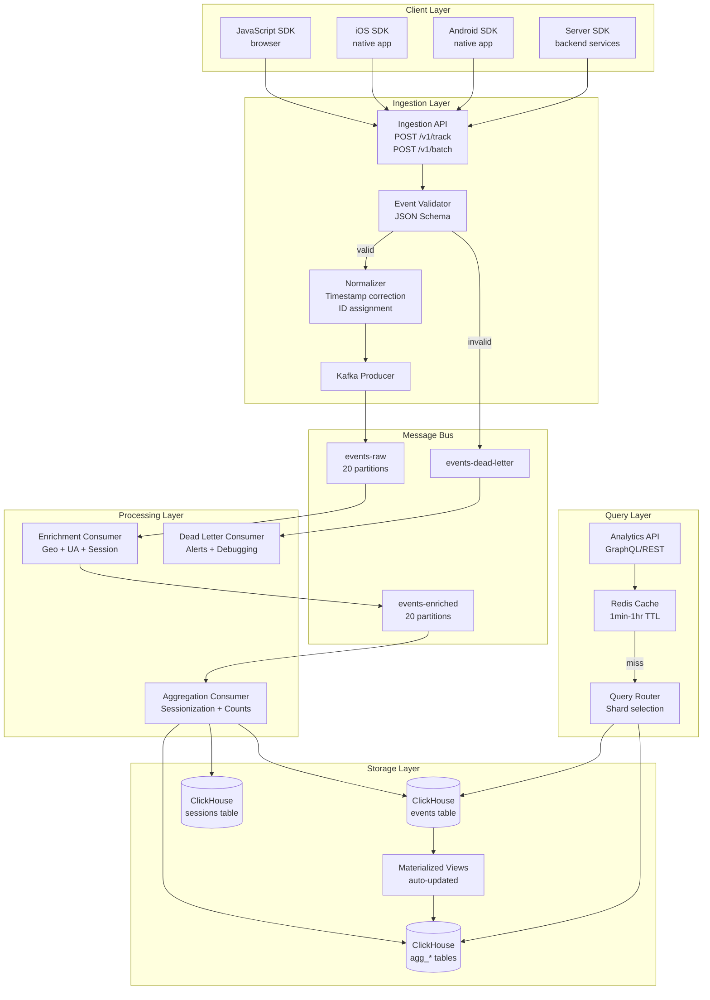
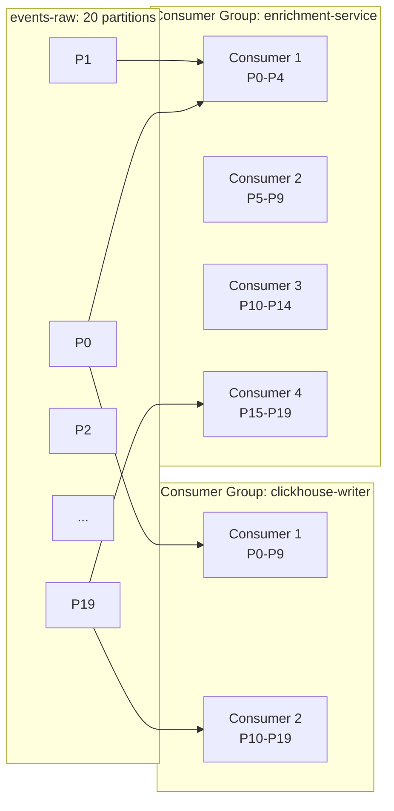

# Realtime Pipeline: Architecture

## End-to-End Data Flow



## Kafka Topic Design

### Topic Partitioning Strategy

Partition count determines maximum parallelism. For events:

```
Partition key: userId (if authenticated) or anonymousId (if not)
Partition count: 20 (scale to 40 at 50k+ events/second)
Replication factor: 3
Retention: 7 days (allows reprocessing)
```

Partitioning by userId ensures all events from one user go to the same partition, which is important for:
- In-order processing (session reconstruction)
- Efficient state lookups (cache by userId, hits same consumer)

::: warning Do Not Partition by Event Type
A common mistake is partitioning by `event.type`. This causes:
- Consumers for rare event types sit idle while common types lag
- Session reconstruction requires events from the same user, not same type
- Hot partitions if one event type dominates volume

Always partition by userId/anonymousId.
:::

### Topic Configuration

```typescript
// Topic creation (using kafkajs Admin)
import { Kafka } from 'kafkajs';

const kafka = new Kafka({
  clientId: 'analytics-pipeline',
  brokers: [
    'kafka-1:9092',
    'kafka-2:9092',
    'kafka-3:9092',
  ],
  ssl: true,
  sasl: {
    mechanism: 'scram-sha-256',
    username: process.env.KAFKA_USERNAME!,
    password: process.env.KAFKA_PASSWORD!,
  },
  retry: {
    initialRetryTime: 100,
    retries: 8,
  },
});

const admin = kafka.admin();

export async function createTopics(): Promise<void> {
  await admin.createTopics({
    topics: [
      {
        topic: 'events-raw',
        numPartitions: 20,
        replicationFactor: 3,
        configEntries: [
          { name: 'retention.ms', value: String(7 * 24 * 60 * 60 * 1000) },  // 7 days
          { name: 'compression.type', value: 'lz4' },
          { name: 'min.insync.replicas', value: '2' },
          { name: 'max.message.bytes', value: String(1024 * 1024) },  // 1MB max message
        ],
      },
      {
        topic: 'events-enriched',
        numPartitions: 20,
        replicationFactor: 3,
        configEntries: [
          { name: 'retention.ms', value: String(7 * 24 * 60 * 60 * 1000) },
          { name: 'compression.type', value: 'lz4' },
        ],
      },
      {
        topic: 'events-dead-letter',
        numPartitions: 3,
        replicationFactor: 3,
        configEntries: [
          { name: 'retention.ms', value: String(30 * 24 * 60 * 60 * 1000) },  // 30 days
        ],
      },
    ],
  });
}
```

## Consumer Group Architecture



Each consumer group maintains its own offset, allowing independent processing at different speeds. The enrichment service might lag 2 minutes behind ingestion while the ClickHouse writer is current — they don't block each other.

## Enrichment Consumer

```typescript
import { Consumer, EachMessagePayload, Kafka } from 'kafkajs';
import { GeoIPService } from './services/geoip-service';
import { UserAgentParser } from './services/ua-parser';
import { SessionStore } from './services/session-store';
import { BaseEvent } from './types/events';

export class EnrichmentConsumer {
  private readonly consumer: Consumer;
  private batchBuffer: EnrichedEvent[] = [];
  private flushTimer: NodeJS.Timeout | null = null;

  private readonly BATCH_SIZE = 500;
  private readonly FLUSH_INTERVAL_MS = 500;

  constructor(
    kafka: Kafka,
    private readonly geoip: GeoIPService,
    private readonly uaParser: UserAgentParser,
    private readonly sessionStore: SessionStore,
    private readonly producer: KafkaProducer
  ) {
    this.consumer = kafka.consumer({
      groupId: 'enrichment-service',
      sessionTimeout: 30000,
      heartbeatInterval: 3000,
      maxBytesPerPartition: 1048576,  // 1MB per partition per fetch
    });
  }

  async start(): Promise<void> {
    await this.consumer.connect();
    await this.consumer.subscribe({
      topic: 'events-raw',
      fromBeginning: false,
    });

    this.startFlushTimer();

    await this.consumer.run({
      autoCommit: false,  // Manual offset commit for at-least-once
      eachMessage: async (payload: EachMessagePayload) => {
        await this.processMessage(payload);
      },
    });
  }

  private async processMessage(payload: EachMessagePayload): Promise<void> {
    const { message } = payload;
    if (!message.value) return;

    let event: BaseEvent;

    try {
      event = JSON.parse(message.value.toString()) as BaseEvent;
    } catch {
      // Malformed JSON — send to dead letter
      await this.sendToDeadLetter(message.value.toString(), 'parse_error');
      return;
    }

    try {
      const enriched = await this.enrich(event);
      this.batchBuffer.push(enriched);

      if (this.batchBuffer.length >= this.BATCH_SIZE) {
        await this.flush();
      }
    } catch (error) {
      await this.sendToDeadLetter(
        message.value.toString(),
        (error as Error).message
      );
    }
  }

  private async enrich(event: BaseEvent): Promise<EnrichedEvent> {
    const [geoData, sessionData] = await Promise.all([
      this.enrichGeo(event.context.ip),
      this.enrichSession(event),
    ]);

    // Parse user agent
    const uaData = event.context.userAgent
      ? this.uaParser.parse(event.context.userAgent)
      : null;

    const receivedAt = new Date().toISOString();

    return {
      ...event,
      receivedAt,
      // Geo enrichment
      geo: geoData,
      // Session enrichment
      sessionStart: sessionData.sessionStart,
      isNewSession: sessionData.isNew,
      sessionNumber: sessionData.sessionNumber,
      // UA enrichment
      parsedBrowser: uaData?.browser ?? null,
      parsedOs: uaData?.os ?? null,
      parsedDevice: uaData?.device ?? null,
      // Remove raw IP and UA for privacy after enrichment
      context: {
        ...event.context,
        ip: undefined,  // Removed after geo lookup
        userAgent: undefined,  // Removed after UA parsing
      },
    };
  }

  private async enrichGeo(ip?: string): Promise<GeoData | null> {
    if (!ip || ip === '127.0.0.1') return null;

    try {
      return await this.geoip.lookup(ip);
    } catch {
      return null;
    }
  }

  private async enrichSession(event: BaseEvent): Promise<SessionData> {
    const sessionKey = `session:${event.anonymousId}`;
    const IDLE_TIMEOUT_MS = 30 * 60 * 1000;  // 30 minute session timeout

    const existing = await this.sessionStore.get(sessionKey);
    const now = new Date(event.timestamp).getTime();

    if (!existing || now - existing.lastEventAt > IDLE_TIMEOUT_MS) {
      const sessionData: SessionData = {
        sessionStart: event.timestamp,
        lastEventAt: now,
        isNew: true,
        sessionNumber: (existing?.sessionNumber ?? 0) + 1,
      };
      await this.sessionStore.set(sessionKey, sessionData, 7200);  // 2h TTL
      return sessionData;
    }

    // Update existing session
    await this.sessionStore.update(sessionKey, { lastEventAt: now });
    return { ...existing, isNew: false };
  }

  private async flush(): Promise<void> {
    if (this.batchBuffer.length === 0) return;

    const batch = this.batchBuffer.splice(0, this.batchBuffer.length);

    await this.producer.sendBatch({
      topic: 'events-enriched',
      messages: batch.map(event => ({
        key: event.userId ?? event.anonymousId,
        value: JSON.stringify(event),
      })),
    });

    // Commit offsets after successful publish
    await this.consumer.commitOffsets([/* current offsets */]);
  }

  private startFlushTimer(): void {
    this.flushTimer = setInterval(async () => {
      await this.flush();
    }, this.FLUSH_INTERVAL_MS);
  }

  async stop(): Promise<void> {
    if (this.flushTimer) clearInterval(this.flushTimer);
    await this.flush();
    await this.consumer.disconnect();
  }
}
```

## ClickHouse Writer Consumer

```typescript
import { createClient, ClickHouseClient } from '@clickhouse/client';
import { Consumer, Kafka } from 'kafkajs';

export class ClickHouseWriterConsumer {
  private readonly consumer: Consumer;
  private readonly clickhouse: ClickHouseClient;
  private batchBuffer: EnrichedEvent[] = [];

  private readonly BATCH_SIZE = 5000;
  private readonly FLUSH_INTERVAL_MS = 1000;  // Flush at most every 1 second

  constructor(kafka: Kafka, clickhouseConfig: ClickHouseConfig) {
    this.consumer = kafka.consumer({
      groupId: 'clickhouse-writer',
      sessionTimeout: 30000,
    });

    this.clickhouse = createClient({
      host: clickhouseConfig.host,
      username: clickhouseConfig.username,
      password: clickhouseConfig.password,
      database: clickhouseConfig.database,
      clickhouse_settings: {
        async_insert: 1,
        wait_for_async_insert: 0,  // Fire and forget inserts
      },
    });
  }

  async start(): Promise<void> {
    await this.consumer.connect();
    await this.consumer.subscribe({ topic: 'events-enriched' });

    setInterval(() => this.flush(), this.FLUSH_INTERVAL_MS);

    await this.consumer.run({
      autoCommit: false,
      eachMessage: async ({ message }) => {
        if (!message.value) return;
        const event = JSON.parse(message.value.toString()) as EnrichedEvent;
        this.batchBuffer.push(event);

        if (this.batchBuffer.length >= this.BATCH_SIZE) {
          await this.flush();
        }
      },
    });
  }

  private async flush(): Promise<void> {
    if (this.batchBuffer.length === 0) return;

    const batch = this.batchBuffer.splice(0, this.batchBuffer.length);

    try {
      await this.clickhouse.insert({
        table: 'events',
        values: batch.map(e => this.mapToClickHouseRow(e)),
        format: 'JSONEachRow',
      });

      metrics.histogram('clickhouse_batch_size', batch.length);
      metrics.increment('clickhouse_events_written_total', { count: batch.length });

      await this.consumer.commitOffsets([/* current offsets */]);
    } catch (error) {
      // Put events back in buffer for retry
      this.batchBuffer.unshift(...batch);
      throw error;
    }
  }

  private mapToClickHouseRow(event: EnrichedEvent): Record<string, unknown> {
    return {
      event_id: event.eventId,
      type: event.type,
      user_id: event.userId ?? '',
      anonymous_id: event.anonymousId,
      session_id: event.sessionId,
      timestamp: new Date(event.timestamp),
      received_at: new Date(event.receivedAt),
      properties: JSON.stringify(event.properties),
      country: event.geo?.country ?? '',
      region: event.geo?.region ?? '',
      city: event.geo?.city ?? '',
      browser: event.parsedBrowser?.name ?? '',
      browser_version: event.parsedBrowser?.version ?? '',
      os: event.parsedOs?.name ?? '',
      device_type: event.parsedDevice?.type ?? '',
      session_start: new Date(event.sessionStart),
      is_new_session: event.isNewSession,
      session_number: event.sessionNumber,
    };
  }
}
```

## Consumer Lag Monitoring

Consumer lag is the primary health metric for a streaming pipeline:

$$
\text{lag} = \text{latest\_offset} - \text{consumer\_offset}
$$

If lag grows unbounded, either:
- Consumer throughput < producer throughput (scale consumers)
- Consumer is stuck/crashed (alert, restart)
- Downstream (ClickHouse) is slow (optimize writes)

```typescript
export class ConsumerLagMonitor {
  async checkLag(): Promise<ConsumerLagReport> {
    const admin = kafka.admin();
    const report: ConsumerLagReport = { groups: {} };

    const groups = ['enrichment-service', 'clickhouse-writer'];

    for (const groupId of groups) {
      const { topics } = await admin.fetchOffsets({ groupId, topics: ['events-raw', 'events-enriched'] });
      const topicMetadata = await admin.fetchTopicOffsets('events-raw');

      let totalLag = 0;
      for (const topic of topics) {
        for (const partition of topic.partitions) {
          const latestOffset = topicMetadata
            .find(t => t.partition === partition.partition)?.offset ?? '0';
          const consumerOffset = partition.offset;

          const lag = parseInt(latestOffset) - parseInt(consumerOffset);
          totalLag += lag;
        }
      }

      report.groups[groupId] = { totalLag };

      if (totalLag > 100_000) {
        metrics.gauge('kafka_consumer_lag', totalLag, { group: groupId });
        // Alert if lag > 100k events (~ 1 minute of data at 1k/s)
        await alerting.warn(`Consumer lag warning: ${groupId} is ${totalLag} events behind`);
      }
    }

    return report;
  }
}
```

## Schema Evolution

Events evolve over time. Handle schema changes carefully:

```typescript
// Use a schema registry for Avro schemas
// This is a simplified example using JSON Schema versioning

export const EVENT_SCHEMAS: Record<string, object> = {
  'v1.0': {
    type: 'object',
    required: ['eventId', 'type', 'anonymousId', 'timestamp'],
    properties: {
      eventId: { type: 'string' },
      type: { type: 'string' },
      anonymousId: { type: 'string' },
      timestamp: { type: 'string', format: 'date-time' },
      userId: { type: 'string' },
      properties: { type: 'object' },
    },
  },
  'v1.1': {
    // Added sessionId as optional (backward compatible)
    // Added context.locale
    // ...
  },
};

// Consumers must handle multiple versions gracefully
export function normalizeEvent(raw: unknown, version: string): BaseEvent {
  if (version === 'v1.0') {
    return normalizeV1_0(raw);
  }
  return normalizeLatest(raw);
}
```

::: warning Breaking Schema Changes
Never do these without a migration plan:
- Remove required fields
- Change field types (string → integer)
- Rename fields

Always add new fields as optional. Deprecate old fields for 2+ versions before removing.
:::
