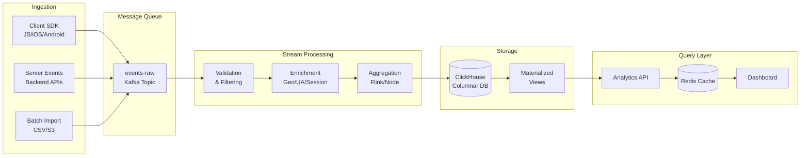

# Realtime Pipeline: Overview

A realtime analytics pipeline ingests user behavior events, enriches and aggregates them, and makes the results queryable within seconds. This powers product analytics dashboards, user funnel analysis, and real-time alerting.

## The Problem Space

Product analytics at scale has unique characteristics:

- **Write-heavy**: 100:1 write-to-read ratio for event ingestion
- **Append-only**: Events never change after recording
- **Time-series oriented**: Most queries filter by time range
- **Aggregation-heavy**: Count distinct users, funnel conversion rates, retention cohorts
- **High cardinality**: Millions of distinct user IDs, session IDs, event properties
- **Late-arriving data**: Mobile apps batch events and send when connectivity resumes

These characteristics make traditional RDBMS unsuitable. The pipeline uses purpose-built tools for each stage.

## Pipeline Overview



## Scale Reference Points

| Tier | Events/Second | Storage (90 days) | Query Latency |
|------|--------------|------------------|---------------|
| Startup | 100-1k | 50-500 GB | < 1 second |
| Growth | 1k-10k | 500 GB-5 TB | 1-5 seconds |
| Scale | 10k-100k | 5-50 TB | 2-10 seconds |
| Enterprise | 100k+ | 50 TB+ | Custom |

This blueprint targets the Growth-Scale tier (1k-100k events/second).

## Technology Choices

### Why Kafka?

- Persistent, replayable log (events can be reprocessed)
- At-least-once delivery with consumer offset management
- Horizontal scaling via partitions
- Consumer groups allow multiple independent pipeline stages
- Schema evolution via Schema Registry (Avro/Protobuf)

**Alternatives considered:**
- **AWS Kinesis**: Easier operations, but 7-day retention limit, no consumer groups
- **Redis Streams**: Great for low volume, but limited retention and reprocessing
- **RabbitMQ**: Message queue (not log), no replay capability
- **Google Pub/Sub**: Good managed option if already on GCP

### Why ClickHouse?

- Columnar storage: 100x faster than Postgres for analytical queries
- High compression: 10x storage reduction vs. row storage
- Vectorized query execution: SIMD instructions for aggregations
- MergeTree engine: optimized for time-series data
- Materialized views: pre-aggregate common queries at insert time

**Alternatives considered:**
- **Apache Druid**: More complex operations, Zookeeper dependency
- **TimescaleDB**: Better for SQL familiarity, but slower at ClickHouse's cardinality scale
- **BigQuery**: Managed, but 1-5 second query latency vs. ClickHouse's sub-second
- **Redshift**: Column-oriented but slower and more expensive per query

### Why Not Apache Spark/Flink?

For < 100k events/second, a simple Node.js consumer with ioredis for state is sufficient and dramatically simpler to operate. Apache Flink adds:
- Distributed operator state
- Exactly-once semantics via checkpointing
- Advanced windowing functions

Add Flink when you need exactly-once guarantees at > 50k events/second.

## Data Contract: Event Schema

All events must conform to a base schema. Custom properties go in the `properties` object:

```typescript
export interface BaseEvent {
  // Identity
  eventId: string;          // UUID v4, generated client-side
  type: string;             // e.g., 'page_view', 'button_click', 'purchase'

  // Actor
  userId?: string;          // Null for anonymous events
  anonymousId: string;      // Always present; persists pre-login
  sessionId: string;        // Browser/app session ID

  // Timing
  timestamp: string;        // ISO 8601 UTC, when event occurred
  receivedAt?: string;      // Server-set, when event was received
  sentAt?: string;          // Client-set, when client sent the batch

  // Context (auto-collected)
  context: EventContext;

  // Custom properties
  properties: Record<string, unknown>;
}

export interface EventContext {
  app?: {
    name: string;
    version: string;
    build?: string;
  };
  browser?: {
    name: string;
    version: string;
  };
  device?: {
    type: 'mobile' | 'tablet' | 'desktop';
    model?: string;
    manufacturer?: string;
  };
  os?: {
    name: string;
    version: string;
  };
  locale?: string;
  timezone?: string;
  screen?: {
    width: number;
    height: number;
    density?: number;
  };
  page?: {
    url: string;
    path: string;
    title: string;
    referrer?: string;
    search?: string;
  };
  campaign?: {
    source?: string;
    medium?: string;
    name?: string;
    term?: string;
    content?: string;
  };
  ip?: string;              // Stripped after geo-lookup for privacy
  userAgent?: string;       // Parsed to device/browser, raw retained briefly
}
```

## Module Map

```
realtime-pipeline/
├── index.md                   ← You are here
├── architecture.md            ← Kafka → Processing → ClickHouse → API
├── ingestion-layer.md         ← HTTP endpoints, SDK design, batching
├── processing-layer.md        ← Enrichment, sessionization, aggregation
├── storage-layer.md           ← ClickHouse schema, partitions, TTL
└── query-layer.md             ← Funnel queries, retention, caching
```

## Operational Characteristics

### Latency Budget

```
Client event → Kafka:        < 100ms (p99)
Kafka → Consumer:            < 500ms (batch window)
Consumer → ClickHouse:       < 200ms (insert)
Total ingestion latency:     < 800ms (p99)

ClickHouse query (simple):   < 500ms
ClickHouse query (complex):  1-5 seconds
Cached query:                < 10ms
```

### Failure Modes

| Failure | Impact | Recovery |
|---------|--------|---------|
| Ingestion API down | Events lost (no SDK buffering) | SDK local buffer + retry |
| Kafka partition leader fails | Brief delay (< 30s Kafka re-election) | Auto-recovery |
| Consumer crash | Lag builds up, replays from offset | Auto-recovery, monitor lag |
| ClickHouse overloaded | Query timeouts | Scale out, circuit breaker |
| ClickHouse crash | No new inserts, queries fail | Auto-recovery, replication |

::: info War Story
We launched realtime dashboards to our customers on a Monday morning. By noon, ClickHouse was consuming 95% CPU. The issue: our analytics dashboard was polling 5 expensive funnel queries every 30 seconds for each open dashboard tab. With 200 customers all looking at dashboards simultaneously, we had 1000 uncached queries per minute against ClickHouse.

ClickHouse was handling the query load fine — the CPU was the ClickHouse distributed query coordinator merging results from 3 shards. The fix: aggressive caching in front of the query API (1-minute TTL for dashboard queries), background refresh of popular funnels, and staggered polling with jitter so not all clients poll simultaneously. Query load dropped 95%.
:::
