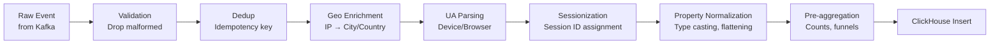

# Realtime Pipeline: Processing Layer

## Processing Pipeline Stages

The processing layer transforms raw events into enriched, queryable data:



## GeoIP Enrichment

Map IP addresses to geographic data. Use MaxMind GeoLite2 (free) or GeoIP2 City (paid, more accurate):

```typescript
import maxmind, { CityResponse, Reader } from 'maxmind';

export interface GeoData {
  country: string;         // 'US'
  countryName: string;     // 'United States'
  region: string;          // 'CA'
  regionName: string;      // 'California'
  city: string;            // 'San Francisco'
  postalCode: string;      // '94105'
  latitude: number;        // 37.7749
  longitude: number;       // -122.4194
  timezone: string;        // 'America/Los_Angeles'
}

export class GeoIPService {
  private reader: Reader<CityResponse> | null = null;
  private lastReload = 0;
  private readonly RELOAD_INTERVAL_MS = 24 * 60 * 60 * 1000;  // Reload daily

  async initialize(dbPath: string): Promise<void> {
    this.reader = await maxmind.open<CityResponse>(dbPath);
    this.lastReload = Date.now();
  }

  async lookup(ip: string): Promise<GeoData | null> {
    // Reload DB if outdated
    if (Date.now() - this.lastReload > this.RELOAD_INTERVAL_MS) {
      await this.initialize(process.env.GEOIP_DB_PATH!);
    }

    if (!this.reader) return null;

    // Private IP ranges — no geo data available
    if (this.isPrivateIP(ip)) return null;

    try {
      const result = this.reader.get(ip);
      if (!result) return null;

      return {
        country: result.country?.iso_code ?? '',
        countryName: result.country?.names?.en ?? '',
        region: result.subdivisions?.[0]?.iso_code ?? '',
        regionName: result.subdivisions?.[0]?.names?.en ?? '',
        city: result.city?.names?.en ?? '',
        postalCode: result.postal?.code ?? '',
        latitude: result.location?.latitude ?? 0,
        longitude: result.location?.longitude ?? 0,
        timezone: result.location?.time_zone ?? 'UTC',
      };
    } catch {
      return null;
    }
  }

  private isPrivateIP(ip: string): boolean {
    const privateRanges = [
      /^10\./,
      /^172\.(1[6-9]|2\d|3[0-1])\./,
      /^192\.168\./,
      /^127\./,
      /^::1$/,
      /^fc00:/,
    ];
    return privateRanges.some(r => r.test(ip));
  }
}
```

## User Agent Parsing

```typescript
import { UAParser } from 'ua-parser-js';

export interface ParsedUA {
  browser: { name: string; version: string };
  os: { name: string; version: string };
  device: {
    type: 'mobile' | 'tablet' | 'desktop' | 'tv' | 'console' | 'wearable' | 'unknown';
    model?: string;
    vendor?: string;
  };
  isBot: boolean;
}

// Known bot user agents
const BOT_PATTERNS = [
  /Googlebot/i,
  /bingbot/i,
  /Slurp/i,
  /DuckDuckBot/i,
  /LinkedInBot/i,
  /facebookexternalhit/i,
  /Twitterbot/i,
  /rogerbot/i,
  /semrushbot/i,
  /AhrefsBot/i,
  /crawler/i,
  /spider/i,
  /scraper/i,
];

export class UserAgentParser {
  parse(userAgent: string): ParsedUA {
    const isBot = BOT_PATTERNS.some(p => p.test(userAgent));

    if (isBot) {
      return {
        browser: { name: 'Bot', version: '' },
        os: { name: 'Bot', version: '' },
        device: { type: 'unknown' },
        isBot: true,
      };
    }

    const parser = new UAParser(userAgent);
    const result = parser.getResult();

    const deviceType = (result.device.type as string) ?? 'desktop';
    const normalizedDeviceType = ['mobile', 'tablet', 'tv', 'console', 'wearable'].includes(deviceType)
      ? (deviceType as ParsedUA['device']['type'])
      : 'desktop';

    return {
      browser: {
        name: result.browser.name ?? 'Unknown',
        version: result.browser.version ?? '',
      },
      os: {
        name: result.os.name ?? 'Unknown',
        version: result.os.version ?? '',
      },
      device: {
        type: normalizedDeviceType,
        model: result.device.model,
        vendor: result.device.vendor,
      },
      isBot: false,
    };
  }
}
```

## Sessionization

Sessions are time-bounded sequences of user events. A new session starts when the user has been idle for more than 30 minutes.

```typescript
import Redis from 'ioredis';

export interface SessionData {
  sessionId: string;
  anonymousId: string;
  userId?: string;
  projectId: string;
  sessionStart: string;      // ISO timestamp
  lastEventAt: number;       // Unix timestamp ms
  pageCount: number;
  eventCount: number;
  sessionNumber: number;     // Nth session for this user
  entryPage?: string;        // First page URL in session
  utmSource?: string;
  utmMedium?: string;
  utmCampaign?: string;
}

export class SessionizationService {
  private readonly SESSION_TIMEOUT_MS = 30 * 60 * 1000;  // 30 minutes
  private readonly SESSION_TTL_SECONDS = 7200;  // 2 hours (Redis TTL)

  constructor(private readonly redis: Redis) {}

  async processEvent(event: NormalizedEvent): Promise<{
    sessionId: string;
    sessionData: SessionData;
    isNewSession: boolean;
  }> {
    const sessionKey = `session:${event.projectId}:${event.anonymousId}`;
    const userKey = `user_session_count:${event.projectId}:${event.anonymousId}`;

    const [existingSession, sessionCount] = await Promise.all([
      this.redis.get(sessionKey),
      this.redis.get(userKey),
    ]);

    const now = new Date(event.timestamp).getTime();
    let isNewSession = false;
    let sessionData: SessionData;

    if (!existingSession) {
      isNewSession = true;
    } else {
      const existing = JSON.parse(existingSession) as SessionData;
      if (now - existing.lastEventAt > this.SESSION_TIMEOUT_MS) {
        isNewSession = true;
        // Persist the completed session to ClickHouse
        await this.flushCompletedSession(existing);
      }
    }

    if (isNewSession) {
      const newSessionNumber = parseInt(sessionCount ?? '0') + 1;
      const sessionId = generateSessionId(event.anonymousId, now);

      sessionData = {
        sessionId,
        anonymousId: event.anonymousId,
        userId: event.userId,
        projectId: event.projectId,
        sessionStart: event.timestamp,
        lastEventAt: now,
        pageCount: event.type === 'page' ? 1 : 0,
        eventCount: 1,
        sessionNumber: newSessionNumber,
        entryPage: event.properties?.url as string | undefined,
        utmSource: event.context?.campaign?.source,
        utmMedium: event.context?.campaign?.medium,
        utmCampaign: event.context?.campaign?.name,
      };

      // Atomically set session count and session data
      const pipeline = this.redis.pipeline();
      pipeline.set(userKey, String(newSessionNumber), 'EX', 365 * 24 * 3600);  // 1 year
      pipeline.set(sessionKey, JSON.stringify(sessionData), 'EX', this.SESSION_TTL_SECONDS);
      await pipeline.exec();
    } else {
      sessionData = JSON.parse(existingSession!) as SessionData;
      sessionData.lastEventAt = now;
      sessionData.eventCount++;
      if (event.type === 'page') sessionData.pageCount++;
      if (event.userId && !sessionData.userId) sessionData.userId = event.userId;

      await this.redis.set(
        sessionKey,
        JSON.stringify(sessionData),
        'EX',
        this.SESSION_TTL_SECONDS
      );
    }

    return { sessionId: sessionData.sessionId, sessionData, isNewSession };
  }

  private async flushCompletedSession(session: SessionData): Promise<void> {
    // Write completed session to ClickHouse sessions table
    await clickhouseClient.insert({
      table: 'sessions',
      values: [{
        session_id: session.sessionId,
        anonymous_id: session.anonymousId,
        user_id: session.userId ?? '',
        project_id: session.projectId,
        session_start: new Date(session.sessionStart),
        session_end: new Date(session.lastEventAt),
        duration_seconds: Math.floor((session.lastEventAt - new Date(session.sessionStart).getTime()) / 1000),
        page_count: session.pageCount,
        event_count: session.eventCount,
        session_number: session.sessionNumber,
        entry_page: session.entryPage ?? '',
        utm_source: session.utmSource ?? '',
        utm_medium: session.utmMedium ?? '',
        utm_campaign: session.utmCampaign ?? '',
      }],
      format: 'JSONEachRow',
    });
  }
}
```

## Event Enrichment Pipeline

```typescript
export class EventEnrichmentPipeline {
  constructor(
    private readonly geoip: GeoIPService,
    private readonly uaParser: UserAgentParser,
    private readonly sessionizer: SessionizationService,
    private readonly deduplicator: EventDeduplicator
  ) {}

  async process(rawEvent: NormalizedEvent): Promise<EnrichedEvent | null> {
    // 1. Deduplication
    const isDuplicate = await this.deduplicator.check(rawEvent.eventId);
    if (isDuplicate) {
      metrics.increment('processing_duplicate_events_total');
      return null;
    }

    // 2. Bot filtering
    const ua = rawEvent.context.userAgent
      ? this.uaParser.parse(rawEvent.context.userAgent)
      : null;

    if (ua?.isBot) {
      metrics.increment('processing_bot_events_filtered_total');
      return null;  // Drop bot events
    }

    // 3. Parallel enrichment
    const [geoData, sessionResult] = await Promise.all([
      rawEvent.context.ip ? this.geoip.lookup(rawEvent.context.ip) : null,
      this.sessionizer.processEvent(rawEvent),
    ]);

    // 4. Mark as processed
    await this.deduplicator.mark(rawEvent.eventId);

    return {
      ...rawEvent,
      // Geo enrichment
      country: geoData?.country ?? '',
      countryName: geoData?.countryName ?? '',
      region: geoData?.region ?? '',
      city: geoData?.city ?? '',
      timezone: geoData?.timezone ?? 'UTC',
      latitude: geoData?.latitude ?? 0,
      longitude: geoData?.longitude ?? 0,

      // UA enrichment
      browser: ua?.browser.name ?? '',
      browserVersion: ua?.browser.version ?? '',
      os: ua?.os.name ?? '',
      deviceType: ua?.device.type ?? 'desktop',

      // Session enrichment
      sessionId: sessionResult.sessionId,
      isNewSession: sessionResult.isNewSession,
      sessionNumber: sessionResult.sessionData.sessionNumber,
      sessionStart: sessionResult.sessionData.sessionStart,

      // Remove raw PII after enrichment
      context: {
        ...rawEvent.context,
        ip: undefined,
        userAgent: undefined,
      },
    };
  }
}
```

## Event Deduplication

Events can arrive multiple times due to SDK retries or Kafka redelivery:

```typescript
export class EventDeduplicator {
  private readonly TTL_SECONDS = 3600;  // 1 hour dedup window

  constructor(private readonly redis: Redis) {}

  async check(eventId: string): Promise<boolean> {
    const key = `dedup:event:${eventId}`;
    const exists = await this.redis.exists(key);
    return exists === 1;
  }

  async mark(eventId: string): Promise<void> {
    const key = `dedup:event:${eventId}`;
    await this.redis.set(key, '1', 'EX', this.TTL_SECONDS);
  }

  // Batch check for efficiency
  async checkBatch(eventIds: string[]): Promise<Set<string>> {
    if (eventIds.length === 0) return new Set();

    const keys = eventIds.map(id => `dedup:event:${id}`);
    const results = await this.redis.mget(...keys);

    return new Set(
      eventIds.filter((_, i) => results[i] !== null)
    );
  }
}
```

## Pre-Aggregation

Pre-aggregate common metrics at insert time to speed up queries:

```typescript
export class PreAggregationService {
  private counters: Map<string, number> = new Map();
  private flushInterval = 60_000;  // Flush aggregates every minute

  constructor(private readonly clickhouse: ClickHouseClient) {
    setInterval(() => this.flush(), this.flushInterval);
  }

  recordEvent(event: EnrichedEvent): void {
    // Increment daily active users counter
    const dauKey = `dau:${event.projectId}:${event.userId ?? event.anonymousId}:${toDateString(event.timestamp)}`;
    this.counters.set(dauKey, (this.counters.get(dauKey) ?? 0) + 1);

    // Increment event type counter
    const eventTypeKey = `event_count:${event.projectId}:${event.type}:${toDateString(event.timestamp)}`;
    this.counters.set(eventTypeKey, (this.counters.get(eventTypeKey) ?? 0) + 1);

    // Increment page view counter
    if (event.type === 'page') {
      const pvKey = `pv:${event.projectId}:${event.properties.path}:${toDateString(event.timestamp)}`;
      this.counters.set(pvKey, (this.counters.get(pvKey) ?? 0) + 1);
    }
  }

  private async flush(): Promise<void> {
    if (this.counters.size === 0) return;

    const snapshot = new Map(this.counters);
    this.counters.clear();

    const rows = Array.from(snapshot.entries()).map(([key, count]) => {
      const [type, ...rest] = key.split(':');
      return { type, key: rest.join(':'), count, date: new Date() };
    });

    await this.clickhouse.insert({
      table: 'event_aggregates',
      values: rows,
      format: 'JSONEachRow',
    });
  }
}

function toDateString(isoTimestamp: string): string {
  return isoTimestamp.substring(0, 10);  // 'YYYY-MM-DD'
}
```

## Processing Performance

| Stage | Latency | CPU | Memory |
|-------|---------|-----|--------|
| Validation | < 0.1ms | Low | Low |
| Deduplication (Redis) | 1-3ms | Low | Low |
| GeoIP lookup | < 0.1ms | Low (in-memory DB) | 50MB DB in RAM |
| UA parsing | < 0.5ms | Medium | Low |
| Sessionization (Redis) | 2-5ms | Low | ~100 bytes/active session |
| Total pipeline | 5-10ms | Medium | ~100MB |

At 10k events/second per consumer instance, this fits comfortably within a single Node.js process. Beyond 10k/s, add consumer instances (each handles a subset of partitions).

::: info War Story
Our sessionization Redis key pattern was `session:{anonymousId}`. One customer had 50,000 active anonymous visitors simultaneously. Each had a separate Redis key, which was fine.

The problem: we ran a batch job that re-anonymized all historical events (privacy cleanup), creating new anonymous IDs for all users. When these users' next events arrived, our sessionizer saw them as brand new — 50,000 new sessions fired simultaneously in one minute.

The session table insertion rate hit 50,000 rows/minute. ClickHouse handled it fine, but our session-start triggered marketing automation (welcome email to "new users"). 50,000 welcome emails went out to existing customers.

The lesson: batch operations that modify identity fields must account for downstream effects. Add a `reason: 're-anonymized'` flag that downstream services can check to suppress welcome events.
:::
