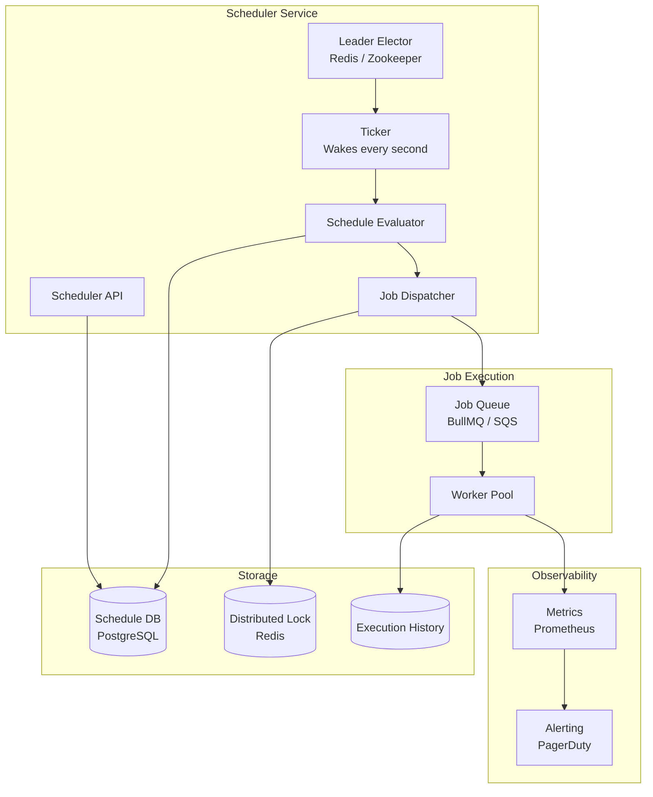
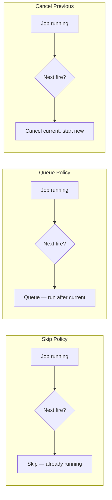

# Scheduler Service Blueprint

A scheduler service is a distributed cron system that triggers jobs at specified times or intervals. It sounds trivial — "just use cron" — until you deploy to multiple servers and discover that your nightly report runs 5 times (once per server), your timezone-aware reminder fires at the wrong hour, and a 30-second deploy window causes a job to be skipped entirely.

This blueprint covers the production-grade scheduler: leader election for single-fire guarantees, timezone-aware scheduling, missed job recovery, distributed coordination, and the operational patterns that prevent your 2 AM billing job from running at 2 AM UTC when your customers are in PST.

**Related**: [Job Queue](/production-blueprints/job-queue/) | [Release Engineering](/devops/release-engineering)

---

## The Problem with Cron at Scale

### Single-Server Cron Works Fine

```bash
# /etc/crontab on a single server
0 2 * * * /usr/bin/node /app/scripts/nightly-report.js
*/5 * * * * /usr/bin/node /app/scripts/health-check.js
0 0 1 * * /usr/bin/node /app/scripts/monthly-billing.js
```

This works perfectly when you have exactly one server. The moment you scale to 2+ servers:

| Problem | Symptom |
|---------|---------|
| **Double-fire** | Job runs N times (once per server) |
| **No-fire** | Deploy happens at the scheduled time; job missed |
| **Clock skew** | Servers disagree on what time it is |
| **No retry** | If the job fails, cron doesn't know |
| **No visibility** | No logs, no metrics, no alerts |
| **Timezone confusion** | "Daily at midnight" — whose midnight? |

---

## Architecture



### Core Design Principles

1. **Separation of scheduling from execution** — The scheduler decides WHEN a job runs. The job queue handles HOW (retries, concurrency, priority).
2. **Leader election** — Only one scheduler instance evaluates schedules at a time. Others are hot standby.
3. **Idempotent dispatch** — Even if the scheduler dispatches a job twice (unlikely but possible during leader failover), the job queue deduplicates.
4. **Missed job recovery** — If the scheduler was down during a scheduled time, it detects and fires the missed job on recovery.

---

## Data Model

### Schedule Definition

```sql
CREATE TABLE schedules (
    id              UUID PRIMARY KEY DEFAULT gen_random_uuid(),
    name            VARCHAR(200) NOT NULL,
    description     TEXT,
    cron_expression VARCHAR(100) NOT NULL,       -- '0 2 * * *'
    timezone        VARCHAR(50) NOT NULL DEFAULT 'UTC',  -- 'America/New_York'
    job_type        VARCHAR(100) NOT NULL,        -- 'nightly-report'
    job_payload     JSONB DEFAULT '{}',
    enabled         BOOLEAN DEFAULT TRUE,
    max_retries     INT DEFAULT 3,
    timeout_seconds INT DEFAULT 3600,
    overlap_policy  VARCHAR(20) DEFAULT 'skip',  -- 'skip', 'queue', 'cancel_previous'
    last_fired_at   TIMESTAMP WITH TIME ZONE,
    next_fire_at    TIMESTAMP WITH TIME ZONE,
    created_at      TIMESTAMP WITH TIME ZONE DEFAULT NOW(),
    updated_at      TIMESTAMP WITH TIME ZONE DEFAULT NOW(),
    created_by      VARCHAR(100)
);

CREATE INDEX idx_schedules_next ON schedules(next_fire_at)
    WHERE enabled = TRUE;
CREATE INDEX idx_schedules_type ON schedules(job_type);
```

### Execution History

```sql
CREATE TABLE schedule_executions (
    id              UUID PRIMARY KEY DEFAULT gen_random_uuid(),
    schedule_id     UUID NOT NULL REFERENCES schedules(id),
    scheduled_at    TIMESTAMP WITH TIME ZONE NOT NULL,
    fired_at        TIMESTAMP WITH TIME ZONE,
    completed_at    TIMESTAMP WITH TIME ZONE,
    status          VARCHAR(20) NOT NULL DEFAULT 'pending',
    -- 'pending', 'dispatched', 'running', 'completed', 'failed', 'skipped'
    error_message   TEXT,
    attempt_number  INT DEFAULT 1,
    duration_ms     INT,
    created_at      TIMESTAMP WITH TIME ZONE DEFAULT NOW()
);

CREATE INDEX idx_executions_schedule ON schedule_executions(schedule_id, scheduled_at DESC);
CREATE INDEX idx_executions_status ON schedule_executions(status)
    WHERE status IN ('pending', 'running');
```

---

## Detailed Design

### Leader Election

Only one scheduler instance should evaluate schedules. Use Redis-based leader election with a heartbeat lease.

```typescript
class LeaderElector {
  private readonly LEASE_TTL = 15;          // seconds
  private readonly HEARTBEAT_INTERVAL = 5;  // seconds
  private isLeader = false;
  private heartbeatTimer: NodeJS.Timeout | null = null;

  constructor(
    private redis: Redis,
    private instanceId: string
  ) {}

  async start(): Promise<void> {
    await this.tryAcquire();
    setInterval(() => this.tryAcquire(), this.HEARTBEAT_INTERVAL * 1000);
  }

  private async tryAcquire(): Promise<void> {
    // SET NX with TTL — atomic acquire
    const acquired = await this.redis.set(
      'scheduler:leader',
      this.instanceId,
      'EX', this.LEASE_TTL,
      'NX'
    );

    if (acquired) {
      if (!this.isLeader) {
        console.log(`[${this.instanceId}] Became leader`);
        this.isLeader = true;
        this.onBecomeLeader();
      }
      return;
    }

    // Check if we're the current leader (renew lease)
    const currentLeader = await this.redis.get('scheduler:leader');
    if (currentLeader === this.instanceId) {
      await this.redis.expire('scheduler:leader', this.LEASE_TTL);
    } else {
      if (this.isLeader) {
        console.log(`[${this.instanceId}] Lost leadership`);
        this.isLeader = false;
        this.onLoseLeadership();
      }
    }
  }

  private onBecomeLeader(): void {
    // Start the ticker
  }

  private onLoseLeadership(): void {
    // Stop the ticker
  }
}
```

### Ticker and Schedule Evaluator

```typescript
class SchedulerTicker {
  private readonly TICK_INTERVAL_MS = 1000; // Check every second

  constructor(
    private db: Database,
    private dispatcher: JobDispatcher,
    private leaderElector: LeaderElector
  ) {}

  start(): void {
    setInterval(() => this.tick(), this.TICK_INTERVAL_MS);
  }

  private async tick(): Promise<void> {
    if (!this.leaderElector.isLeader) return;

    const now = new Date();

    // Find all schedules whose next_fire_at <= now
    const dueSchedules = await this.db.query<Schedule>(
      `SELECT * FROM schedules
       WHERE enabled = TRUE
         AND next_fire_at <= $1
       ORDER BY next_fire_at ASC
       LIMIT 100`,
      [now]
    );

    for (const schedule of dueSchedules) {
      await this.fireSchedule(schedule, now);
    }
  }

  private async fireSchedule(schedule: Schedule, now: Date): Promise<void> {
    // 1. Check overlap policy
    if (schedule.overlapPolicy === 'skip') {
      const running = await this.hasRunningExecution(schedule.id);
      if (running) {
        await this.recordSkipped(schedule, now);
        await this.advanceNextFire(schedule);
        return;
      }
    }

    // 2. Dispatch the job
    await this.dispatcher.dispatch(schedule, now);

    // 3. Update next_fire_at
    await this.advanceNextFire(schedule);
  }

  private async advanceNextFire(schedule: Schedule): Promise<void> {
    const next = this.calculateNextFire(
      schedule.cronExpression,
      schedule.timezone
    );
    await this.db.query(
      `UPDATE schedules
       SET next_fire_at = $1, last_fired_at = NOW(), updated_at = NOW()
       WHERE id = $2`,
      [next, schedule.id]
    );
  }

  private calculateNextFire(cron: string, timezone: string): Date {
    // Use a cron parser that respects timezones
    // e.g., cron-parser with tz option
    const interval = cronParser.parseExpression(cron, {
      currentDate: new Date(),
      tz: timezone,
    });
    return interval.next().toDate();
  }

  private async hasRunningExecution(scheduleId: string): Promise<boolean> {
    const result = await this.db.query(
      `SELECT 1 FROM schedule_executions
       WHERE schedule_id = $1 AND status IN ('dispatched', 'running')
       LIMIT 1`,
      [scheduleId]
    );
    return result.rows.length > 0;
  }

  private async recordSkipped(schedule: Schedule, scheduledAt: Date): Promise<void> {
    await this.db.query(
      `INSERT INTO schedule_executions (schedule_id, scheduled_at, status)
       VALUES ($1, $2, 'skipped')`,
      [schedule.id, scheduledAt]
    );
  }
}
```

### No-Double-Fire: Distributed Locking

Even with leader election, a leader failover at the exact moment of evaluation could cause a double-dispatch. Use a per-schedule lock.

```typescript
class JobDispatcher {
  constructor(
    private redis: Redis,
    private queue: JobQueue,
    private db: Database
  ) {}

  async dispatch(schedule: Schedule, scheduledAt: Date): Promise<void> {
    // Idempotency key: schedule ID + scheduled time
    const lockKey = `sched:lock:${schedule.id}:${scheduledAt.toISOString()}`;

    // Try to acquire lock (prevents double-dispatch)
    const acquired = await this.redis.set(lockKey, '1', 'EX', 3600, 'NX');
    if (!acquired) {
      console.log(`Schedule ${schedule.id} already dispatched for ${scheduledAt}`);
      return;
    }

    // Record execution
    const executionId = await this.db.query(
      `INSERT INTO schedule_executions (schedule_id, scheduled_at, status, fired_at)
       VALUES ($1, $2, 'dispatched', NOW())
       RETURNING id`,
      [schedule.id, scheduledAt]
    );

    // Enqueue to job queue
    await this.queue.add(schedule.jobType, {
      ...schedule.jobPayload,
      _schedulerId: schedule.id,
      _executionId: executionId,
      _scheduledAt: scheduledAt.toISOString(),
    }, {
      attempts: schedule.maxRetries,
      timeout: schedule.timeoutSeconds * 1000,
      jobId: lockKey, // Ensures idempotency in the queue too
    });
  }
}
```

### Timezone Handling

::: warning Timezone Gotchas
The most dangerous timezone bugs:
1. **DST transitions** — "2 AM every day" might not exist on spring-forward day, or might exist twice on fall-back day.
2. **UTC assumption** — `0 2 * * *` in UTC fires at 9 PM EST the day before. Users expecting "2 AM their time" get a surprise.
3. **Timezone abbreviations** — "EST" vs "America/New_York" — abbreviations are ambiguous (CST = US Central, China Standard, or Cuba Standard).
:::

```typescript
class TimezoneAwareScheduler {
  calculateNextFire(cron: string, timezone: string, after: Date): Date {
    // ALWAYS use IANA timezone names, never abbreviations
    if (!Intl.supportedValuesOf('timeZone').includes(timezone)) {
      throw new Error(`Invalid timezone: ${timezone}. Use IANA format (e.g., America/New_York)`);
    }

    const interval = cronParser.parseExpression(cron, {
      currentDate: after,
      tz: timezone,
    });

    const next = interval.next().toDate();

    // DST guard: if the calculated time doesn't exist (spring forward),
    // the parser should advance to the next valid time.
    // If it exists twice (fall back), use the first occurrence.

    return next;
  }
}
```

### Missed Job Recovery

When the scheduler restarts after downtime, it must detect and fire missed schedules.

```typescript
class MissedJobRecovery {
  async recover(): Promise<number> {
    const now = new Date();

    // Find schedules where next_fire_at is in the past
    const missed = await this.db.query<Schedule>(
      `SELECT * FROM schedules
       WHERE enabled = TRUE
         AND next_fire_at < $1
         AND next_fire_at > $1 - INTERVAL '24 hours'
       ORDER BY next_fire_at ASC`,
      [now]
    );

    let recoveredCount = 0;

    for (const schedule of missed.rows) {
      // Check if this specific firing was already dispatched
      const alreadyFired = await this.db.query(
        `SELECT 1 FROM schedule_executions
         WHERE schedule_id = $1
           AND scheduled_at = $2
           AND status != 'skipped'
         LIMIT 1`,
        [schedule.id, schedule.nextFireAt]
      );

      if (alreadyFired.rows.length === 0) {
        console.log(`Recovering missed schedule: ${schedule.name} (was due at ${schedule.nextFireAt})`);
        await this.dispatcher.dispatch(schedule, schedule.nextFireAt);
        recoveredCount++;
      }

      // Advance to next fire time
      await this.advanceNextFire(schedule);
    }

    return recoveredCount;
  }
}
```

---

## Overlap Policies

When a scheduled job is still running at the next scheduled time:

| Policy | Behavior | Use Case |
|--------|----------|----------|
| `skip` | Skip the new execution | Long-running reports |
| `queue` | Queue the new execution, run after current finishes | Critical sequential jobs |
| `cancel_previous` | Cancel current execution, start new one | Data refreshes where latest wins |



---

## API Design

```typescript
// Create a schedule
// POST /api/v1/schedules
interface CreateScheduleRequest {
  name: string;
  cronExpression: string;         // '0 2 * * *'
  timezone: string;               // 'America/New_York'
  jobType: string;                // 'nightly-report'
  jobPayload?: Record<string, unknown>;
  maxRetries?: number;
  timeoutSeconds?: number;
  overlapPolicy?: 'skip' | 'queue' | 'cancel_previous';
  enabled?: boolean;
}

// List schedules
// GET /api/v1/schedules?enabled=true&jobType=nightly-report

// Pause/Resume
// POST /api/v1/schedules/:id/pause
// POST /api/v1/schedules/:id/resume

// Trigger manually (for testing / one-off runs)
// POST /api/v1/schedules/:id/trigger

// Get execution history
// GET /api/v1/schedules/:id/executions?limit=20&status=failed
```

---

## Monitoring & Alerting

| Metric | Healthy | Alert |
|--------|---------|-------|
| Schedule evaluation lag | < 5s | > 30s |
| Missed job count (last hour) | 0 | > 0 |
| Double-fire count | 0 | > 0 |
| Failed executions (last hour) | < 5% | > 10% |
| Leader election flaps (last hour) | < 2 | > 5 |
| Execution duration vs. timeout | < 80% | > 90% |
| Queue depth for scheduled jobs | < 100 | > 500 |

::: tip The Most Important Alert
**"Schedule not fired"** — if a schedule was expected to fire but no execution record exists, something is wrong. This catches leader election failures, clock skew, and database connectivity issues.
:::

---

## Comparison with Alternatives

| Tool | Distributed | Persistence | Timezone | Missed Recovery | Complexity |
|------|------------|-------------|----------|----------------|------------|
| **System cron** | No | No | System TZ only | No | Minimal |
| **BullMQ repeatable** | Yes (Redis) | Redis-based | Limited | No | Low |
| **node-cron** | No | No | Yes | No | Minimal |
| **Agenda (MongoDB)** | Yes | MongoDB | Yes | Yes | Medium |
| **Temporal** | Yes | DB + workflow | Yes | Yes | High |
| **Custom (this blueprint)** | Yes | PostgreSQL | Yes | Yes | Medium |

::: tip When to Use What
- **Single server, few jobs**: System cron or node-cron
- **Simple repeating jobs with Redis**: BullMQ repeatable jobs
- **Production distributed scheduler**: This blueprint or Agenda
- **Complex workflows with scheduling**: Temporal
:::

---

## Summary

| Component | Technology | Purpose |
|-----------|-----------|---------|
| Leader Election | Redis SET NX + TTL | Single-fire guarantee |
| Ticker | 1-second interval loop | Schedule evaluation |
| Schedule Store | PostgreSQL | Durable schedule definitions |
| Distributed Lock | Redis (per-schedule) | Prevent double-dispatch |
| Job Execution | BullMQ / SQS | Reliable job processing |
| Missed Recovery | Startup scan | Fire jobs missed during downtime |
| Timezone | IANA timezone database | Correct local-time scheduling |
| Monitoring | Prometheus + PagerDuty | Missed/double-fire alerts |
