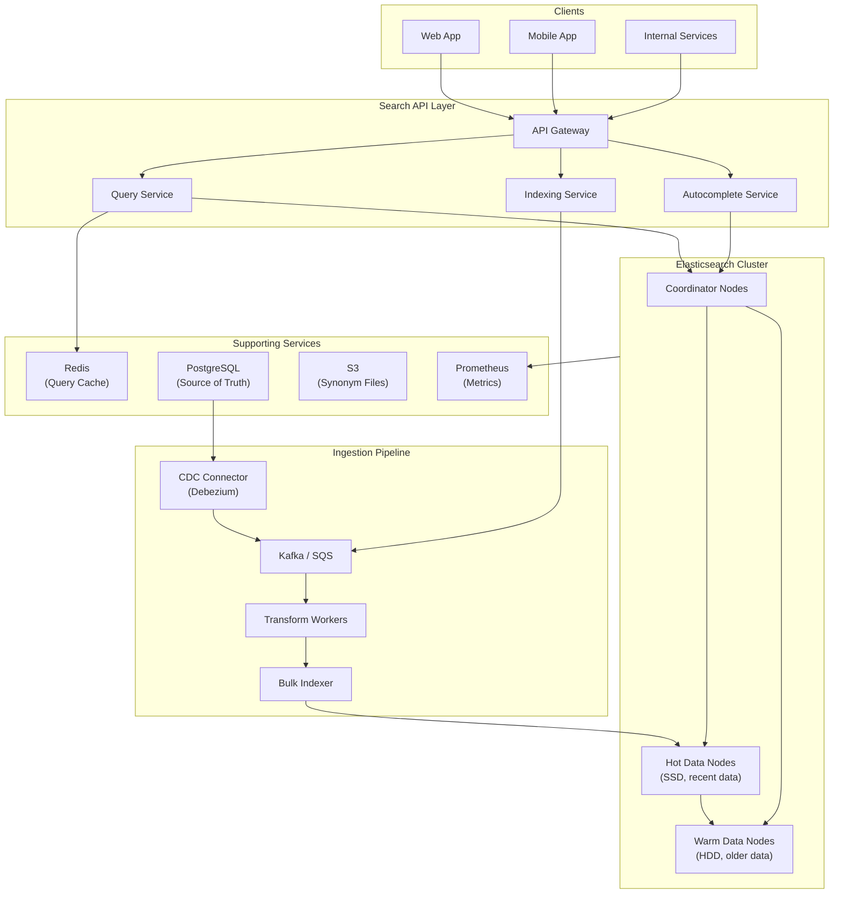
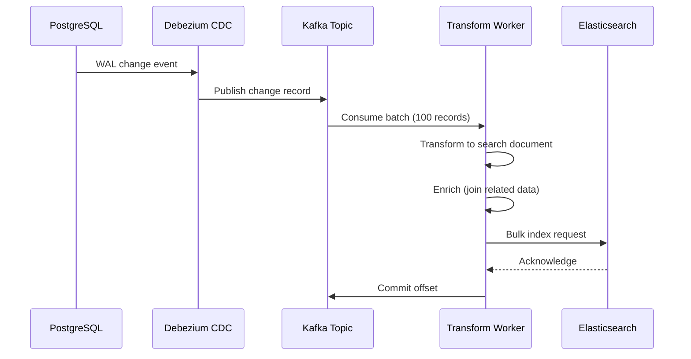
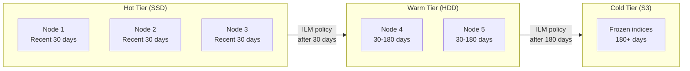

# Search Service Blueprint

Search is the feature users reach for when navigation fails. A bad search experience makes a product feel broken — results are irrelevant, latency is noticeable, typos return nothing. A great search experience is invisible: users type, results appear, the right document is in the first three hits.

This blueprint covers a production-grade search service built on Elasticsearch (or its open-source fork, OpenSearch). It handles full-text search, autocomplete, faceted filtering, synonym expansion, and relevance tuning — the same patterns powering search at companies like GitHub, Shopify, and Wikipedia.

## What This Blueprint Covers

1. **Architecture** — How the search service fits into a broader platform, ingestion pipeline, and query flow.
2. **Indexing Pipeline** — Real-time and batch indexing, data transformation, and index lifecycle management.
3. **Query Layer** — Query DSL composition, multi-match strategies, boosting, filters, and pagination.
4. **Relevance Engineering** — BM25 tuning, function scoring, learning-to-rank, and A/B testing search quality.
5. **Autocomplete & Suggestions** — Prefix matching, edge n-grams, completion suggesters, and "did you mean."
6. **Scaling** — Shard sizing, replica management, hot-warm architecture, and cross-cluster search.
7. **Deployment** — Infrastructure, monitoring, alerting, and operational runbooks.

## Overview & Requirements

### Functional Requirements

| Requirement | Description |
|---|---|
| Full-text search | Search across multiple entity types (products, articles, users) with relevance ranking |
| Autocomplete | Sub-100ms prefix suggestions as the user types |
| Faceted search | Filter by category, price range, date, status with counts |
| Synonym handling | "laptop" matches "notebook," "NYC" matches "New York City" |
| Typo tolerance | "iphne" still returns iPhone results |
| Highlighting | Show matched terms in context within results |
| Multi-language | Support English, Spanish, French with language-specific analyzers |

### Non-Functional Requirements

| Requirement | Target |
|---|---|
| Search latency (p99) | < 200ms |
| Autocomplete latency (p99) | < 50ms |
| Indexing lag (real-time) | < 5 seconds |
| Availability | 99.95% |
| Index size | Up to 500M documents |
| Query throughput | 5,000 queries/second |

## Architecture Diagram



## Core Components Deep Dive

### Query Service

The Query Service translates user intent into Elasticsearch queries. It is the most critical component — a poorly constructed query returns irrelevant results regardless of how good your data or index is.

```typescript
// query-service.ts — Query construction pipeline
interface SearchRequest {
  query: string;
  filters?: Record<string, string | string[]>;
  facets?: string[];
  page?: number;
  pageSize?: number;
  sort?: 'relevance' | 'date' | 'popularity';
  language?: string;
}

interface SearchResponse {
  hits: SearchHit[];
  total: number;
  facets: Record<string, FacetBucket[]>;
  took: number; // milliseconds
  suggestion?: string; // "did you mean"
}

class QueryBuilder {
  build(request: SearchRequest): object {
    const must: object[] = [];
    const filter: object[] = [];

    // Primary text query — multi_match across fields with boosting
    if (request.query) {
      must.push({
        multi_match: {
          query: request.query,
          type: 'best_fields',
          fields: [
            'title^3',        // Title matches weighted 3x
            'title.exact^5',  // Exact title matches weighted 5x
            'description^1.5',
            'body',
            'tags^2',
          ],
          fuzziness: 'AUTO',     // Typo tolerance
          prefix_length: 2,      // First 2 chars must match exactly
          minimum_should_match: '75%',
        },
      });
    }

    // Apply filters (non-scoring, cacheable)
    if (request.filters) {
      for (const [field, value] of Object.entries(request.filters)) {
        if (Array.isArray(value)) {
          filter.push({ terms: { [field]: value } });
        } else {
          filter.push({ term: { [field]: value } });
        }
      }
    }

    return {
      query: {
        bool: { must, filter },
      },
      aggs: this.buildFacets(request.facets),
      highlight: {
        fields: { title: {}, description: {} },
        pre_tags: ['<mark>'],
        post_tags: ['</mark>'],
      },
      from: ((request.page ?? 1) - 1) * (request.pageSize ?? 20),
      size: request.pageSize ?? 20,
      suggest: this.buildSuggestion(request.query),
    };
  }

  private buildFacets(facets?: string[]): object {
    if (!facets) return {};
    const aggs: Record<string, object> = {};
    for (const facet of facets) {
      aggs[facet] = { terms: { field: facet, size: 20 } };
    }
    return aggs;
  }

  private buildSuggestion(query?: string): object {
    if (!query) return {};
    return {
      text: query,
      did_you_mean: {
        phrase: {
          field: 'title.trigram',
          size: 1,
          gram_size: 3,
          direct_generator: [{
            field: 'title.trigram',
            suggest_mode: 'always',
          }],
        },
      },
    };
  }
}
```

::: tip Multi-Match Strategy
Use `best_fields` for searches where a single field should dominate (product search). Use `cross_fields` for searches where the query spans multiple fields (searching a person by "first last" across `first_name` and `last_name`). See the [Elasticsearch Internals](/system-design/databases/elasticsearch-internals) page for details on scoring mechanics.
:::

### Indexing Pipeline

The indexing pipeline ensures that every change in the source database appears in the search index within seconds. It uses Change Data Capture (CDC) to stream database mutations into Kafka, then transforms and bulk-indexes documents.



```typescript
// indexing-worker.ts — Transform and bulk index
class IndexingWorker {
  private readonly bulkSize = 500;
  private readonly flushInterval = 2000; // ms
  private buffer: IndexOperation[] = [];

  async processMessage(change: CDCChangeEvent): Promise<void> {
    const doc = await this.transform(change);

    if (change.operation === 'DELETE') {
      this.buffer.push({ delete: { _index: 'products', _id: doc.id } });
    } else {
      this.buffer.push(
        { index: { _index: 'products', _id: doc.id } },
        doc,
      );
    }

    if (this.buffer.length >= this.bulkSize) {
      await this.flush();
    }
  }

  private async transform(change: CDCChangeEvent): Promise<SearchDocument> {
    const record = change.after;

    // Enrich: fetch category name, brand, etc.
    const category = await this.categoryCache.get(record.category_id);
    const brand = await this.brandCache.get(record.brand_id);

    return {
      id: record.id,
      title: record.title,
      description: record.description,
      body: this.stripHtml(record.body),
      category: category.name,
      category_slug: category.slug,
      brand: brand.name,
      price: record.price_cents / 100,
      in_stock: record.stock_count > 0,
      created_at: record.created_at,
      popularity_score: record.view_count + record.purchase_count * 10,
    };
  }

  private async flush(): Promise<void> {
    if (this.buffer.length === 0) return;

    const response = await this.esClient.bulk({ body: this.buffer });

    if (response.errors) {
      const failed = response.items.filter(
        (item: any) => item.index?.error || item.delete?.error,
      );
      this.logger.error('Bulk index errors', { count: failed.length, failed });
      this.metrics.increment('search.index.errors', failed.length);
    }

    this.metrics.gauge('search.index.lag_ms', Date.now() - this.oldestInBatch);
    this.buffer = [];
  }
}
```

::: warning Indexing Lag vs Consistency
Real-time indexing via CDC introduces a lag window (typically 1-5 seconds). During this window, a user who just created a record might not see it in search results. Common mitigations: (1) inject the new record into the response client-side, (2) use a "read your own writes" flag that queries the source database for very recent records.
:::

### Autocomplete Service

Autocomplete requires sub-50ms response times — users expect results to appear as they type. The completion suggester in Elasticsearch is purpose-built for this, using an in-memory FST (finite state transducer) for prefix lookups.

```typescript
// autocomplete-service.ts
class AutocompleteService {
  async suggest(prefix: string, limit = 7): Promise<Suggestion[]> {
    // Try cache first — autocomplete queries are highly repetitive
    const cacheKey = `ac:${prefix.toLowerCase()}`;
    const cached = await this.redis.get(cacheKey);
    if (cached) return JSON.parse(cached);

    const response = await this.esClient.search({
      index: 'autocomplete',
      body: {
        suggest: {
          product_suggest: {
            prefix,
            completion: {
              field: 'suggest',
              size: limit,
              fuzzy: {
                fuzziness: 'AUTO',
                prefix_length: 2,
              },
              contexts: {
                category: [{ context: 'all' }],
              },
            },
          },
        },
      },
    });

    const suggestions = response.suggest.product_suggest[0].options.map(
      (opt: any) => ({
        text: opt.text,
        id: opt._source.id,
        category: opt._source.category,
        score: opt._score,
      }),
    );

    // Cache for 60 seconds
    await this.redis.setex(cacheKey, 60, JSON.stringify(suggestions));
    return suggestions;
  }
}
```

## Data Model / Schema

### Index Mapping

```json
{
  "mappings": {
    "properties": {
      "id": { "type": "keyword" },
      "title": {
        "type": "text",
        "analyzer": "custom_english",
        "fields": {
          "exact": { "type": "keyword" },
          "autocomplete": {
            "type": "text",
            "analyzer": "edge_ngram_analyzer",
            "search_analyzer": "standard"
          },
          "trigram": {
            "type": "text",
            "analyzer": "trigram_analyzer"
          }
        }
      },
      "description": {
        "type": "text",
        "analyzer": "custom_english"
      },
      "body": {
        "type": "text",
        "analyzer": "custom_english"
      },
      "category": { "type": "keyword" },
      "brand": { "type": "keyword" },
      "tags": { "type": "keyword" },
      "price": { "type": "float" },
      "in_stock": { "type": "boolean" },
      "created_at": { "type": "date" },
      "popularity_score": { "type": "float" },
      "language": { "type": "keyword" }
    }
  },
  "settings": {
    "number_of_shards": 5,
    "number_of_replicas": 1,
    "analysis": {
      "analyzer": {
        "custom_english": {
          "type": "custom",
          "tokenizer": "standard",
          "filter": [
            "lowercase",
            "english_stop",
            "english_stemmer",
            "synonym_filter"
          ]
        },
        "edge_ngram_analyzer": {
          "type": "custom",
          "tokenizer": "edge_ngram_tokenizer",
          "filter": ["lowercase"]
        },
        "trigram_analyzer": {
          "type": "custom",
          "tokenizer": "standard",
          "filter": ["lowercase", "shingle_filter"]
        }
      },
      "tokenizer": {
        "edge_ngram_tokenizer": {
          "type": "edge_ngram",
          "min_gram": 2,
          "max_gram": 15,
          "token_chars": ["letter", "digit"]
        }
      },
      "filter": {
        "english_stop": { "type": "stop", "stopwords": "_english_" },
        "english_stemmer": { "type": "stemmer", "language": "english" },
        "synonym_filter": {
          "type": "synonym_graph",
          "synonyms_path": "synonyms/english.txt",
          "updateable": true
        },
        "shingle_filter": {
          "type": "shingle",
          "min_shingle_size": 2,
          "max_shingle_size": 3
        }
      }
    }
  }
}
```

### Synonym File Format

```text
# synonyms/english.txt
# Format: synonym1, synonym2 => canonical_form
# Or: term1, term2 (bidirectional)

laptop, notebook, portable computer
NYC, New York City, New York
phone, mobile, cellphone, smartphone
cheap, affordable, budget, inexpensive
fast, quick, rapid, speedy
```

::: danger Synonym Pitfalls
Synonyms are applied at index time or query time — never both. Index-time synonyms produce smaller queries but require reindexing when synonyms change. Query-time synonyms are flexible but increase query complexity. For production systems, use `synonym_graph` with `updateable: true` and the reload API to update synonyms without reindexing.
:::

### Source Database Schema

The search index is derived from the source of truth in PostgreSQL:

```sql
CREATE TABLE products (
    id              UUID PRIMARY KEY DEFAULT gen_random_uuid(),
    title           TEXT NOT NULL,
    description     TEXT,
    body            TEXT,
    category_id     UUID NOT NULL REFERENCES categories(id),
    brand_id        UUID REFERENCES brands(id),
    price_cents     INTEGER NOT NULL,
    stock_count     INTEGER NOT NULL DEFAULT 0,
    view_count      BIGINT NOT NULL DEFAULT 0,
    purchase_count  BIGINT NOT NULL DEFAULT 0,
    status          TEXT NOT NULL DEFAULT 'draft'
                    CHECK (status IN ('draft', 'active', 'archived')),
    language        TEXT NOT NULL DEFAULT 'en',
    created_at      TIMESTAMPTZ NOT NULL DEFAULT now(),
    updated_at      TIMESTAMPTZ NOT NULL DEFAULT now()
);

-- Enable logical replication for CDC
ALTER TABLE products REPLICA IDENTITY FULL;
```

## API Design

### Search Endpoint

```
POST /api/v1/search
```

**Request Body:**

```json
{
  "query": "wireless headphones",
  "filters": {
    "category": "electronics",
    "in_stock": true,
    "price": { "gte": 50, "lte": 300 }
  },
  "facets": ["category", "brand", "price_range"],
  "sort": "relevance",
  "page": 1,
  "pageSize": 20
}
```

**Response:**

```json
{
  "hits": [
    {
      "id": "prod_abc123",
      "title": "Sony WH-1000XM5 <mark>Wireless</mark> <mark>Headphones</mark>",
      "description": "Industry-leading noise canceling...",
      "category": "Electronics",
      "brand": "Sony",
      "price": 298.00,
      "score": 12.45
    }
  ],
  "total": 1847,
  "facets": {
    "category": [
      { "key": "electronics", "count": 1200 },
      { "key": "accessories", "count": 647 }
    ],
    "brand": [
      { "key": "Sony", "count": 342 },
      { "key": "Bose", "count": 289 }
    ]
  },
  "suggestion": null,
  "took": 23,
  "page": 1,
  "pageSize": 20,
  "totalPages": 93
}
```

### Autocomplete Endpoint

```
GET /api/v1/autocomplete?q=wire&limit=5
```

**Response:**

```json
{
  "suggestions": [
    { "text": "wireless headphones", "category": "Electronics" },
    { "text": "wireless mouse", "category": "Electronics" },
    { "text": "wireless charger", "category": "Accessories" },
    { "text": "wire stripper", "category": "Tools" },
    { "text": "wireless router", "category": "Networking" }
  ],
  "took": 8
}
```

### Reindex Endpoint (Admin)

```
POST /api/v1/admin/reindex
Authorization: Bearer <admin-token>

{
  "index": "products",
  "strategy": "zero_downtime"
}
```

This triggers a full reindex using the alias swap pattern: create a new index, bulk-index all documents, then atomically swap the alias.

## Relevance Tuning

Relevance is the hardest part of search. BM25 (the default scoring algorithm) works well out of the box, but production search requires careful tuning.

### Function Score for Business Logic

```json
{
  "query": {
    "function_score": {
      "query": { "multi_match": { "query": "headphones", "fields": ["title^3", "description"] } },
      "functions": [
        {
          "field_value_factor": {
            "field": "popularity_score",
            "modifier": "log1p",
            "factor": 0.5
          }
        },
        {
          "filter": { "term": { "in_stock": true } },
          "weight": 2.0
        },
        {
          "gauss": {
            "created_at": {
              "origin": "now",
              "scale": "30d",
              "decay": 0.5
            }
          }
        }
      ],
      "score_mode": "sum",
      "boost_mode": "multiply"
    }
  }
}
```

### Relevance Quality Metrics

| Metric | What It Measures | Target |
|---|---|---|
| **MRR** (Mean Reciprocal Rank) | Position of first relevant result | > 0.6 |
| **NDCG@10** | Quality of top 10 results | > 0.7 |
| **Click-through rate** | % of searches that get a click | > 65% |
| **Zero-result rate** | % of searches returning nothing | < 5% |
| **Refinement rate** | % of searches followed by another search | < 30% |

Use these metrics with the [A/B Testing](/production-blueprints/ab-testing/) blueprint to experiment with scoring changes. Log every search query and its results to build a relevance judgment dataset.

## Scaling Considerations

### Shard Sizing Strategy

| Index Size | Shards | Shard Size | Replicas | Notes |
|---|---|---|---|---|
| < 10M docs | 1 | ~10 GB | 1 | Single shard, one replica |
| 10-100M docs | 5 | ~10-20 GB | 1 | Standard configuration |
| 100M-1B docs | 10-20 | ~20-30 GB | 1-2 | Consider hot-warm |
| > 1B docs | 20+ | ~30-40 GB | 2 | Hot-warm-cold, cross-cluster |

::: warning Shard Sizing Rules
Keep shards between 10 GB and 50 GB. Smaller shards waste resources (each shard is a Lucene index with fixed overhead). Larger shards slow down recovery and rebalancing. The formula: `number_of_shards = ceil(expected_data_size / 30GB)`. See [Elasticsearch Internals](/system-design/databases/elasticsearch-internals) for the mechanics of shard allocation and rebalancing.
:::

### Hot-Warm Architecture



### Query Caching Strategy

Layer caching to absorb repeated queries:

1. **Application cache** — Redis with 60-second TTL for top queries. Invalidate on index refresh.
2. **Elasticsearch request cache** — Caches full shard-level results. Automatically invalidated on refresh.
3. **Elasticsearch query cache** — Caches filter results (the non-scoring parts). Highly effective for faceted search.

See [Caching Strategies](/system-design/caching/caching-strategies) and [Redis Caching Patterns](/system-design/caching/redis-caching-patterns) for deeper coverage of caching architectures.

### Connection to Other Systems

The search service connects to several other production systems:

- **[Auth Service](/production-blueprints/auth-service/)** — User context for personalized results and access-controlled search
- **[Rate Limiter](/production-blueprints/rate-limiter/)** — Throttle search API to prevent abuse
- **[Analytics Pipeline](/production-blueprints/analytics-pipeline/)** — Log search queries for relevance analysis
- **[Job Queue](/production-blueprints/job-queue/)** — Schedule full reindexing jobs

## Deployment

### Infrastructure Requirements

| Component | Instance Type | Count | Storage |
|---|---|---|---|
| Coordinator nodes | r6g.xlarge | 2 | 100 GB SSD |
| Hot data nodes | r6g.2xlarge | 3 | 1 TB NVMe SSD |
| Warm data nodes | r6g.xlarge | 2 | 4 TB HDD |
| Query Service | t3.large | 3 | — |
| Indexing Workers | t3.large | 2 | — |
| Redis (query cache) | r6g.large | 1 | 25 GB |

### Monitoring & Alerting

| Metric | Warning | Critical |
|---|---|---|
| Search latency p99 | > 300ms | > 500ms |
| Indexing lag | > 10s | > 60s |
| Zero-result rate | > 8% | > 15% |
| Cluster health | Yellow | Red |
| JVM heap usage | > 75% | > 85% |
| Disk usage | > 75% | > 85% |

Set up monitoring with [Prometheus](/devops/monitoring/prometheus-deep-dive) and dashboards in [Grafana](/devops/monitoring/grafana-dashboards). Use the [Alert Design](/devops/alerting/alert-design) patterns from the DevOps section.

### Zero-Downtime Reindex

When you need to change the index mapping (add fields, change analyzers), use the alias swap pattern:

```bash
# 1. Create new index with updated mapping
PUT /products_v2
{ "mappings": { ... }, "settings": { ... } }

# 2. Bulk reindex from old to new
POST /_reindex
{ "source": { "index": "products_v1" }, "dest": { "index": "products_v2" } }

# 3. Atomic alias swap
POST /_aliases
{
  "actions": [
    { "remove": { "index": "products_v1", "alias": "products" } },
    { "add": { "index": "products_v2", "alias": "products" } }
  ]
}

# 4. Delete old index after validation
DELETE /products_v1
```

### Health Check

```typescript
// health-check.ts
async function searchHealthCheck(): Promise<HealthStatus> {
  const clusterHealth = await esClient.cluster.health();
  const indexStats = await esClient.indices.stats({ index: 'products' });

  return {
    status: clusterHealth.status === 'green' ? 'healthy' : 'degraded',
    cluster: clusterHealth.status,
    activeShards: clusterHealth.active_shards,
    documentCount: indexStats._all.primaries.docs.count,
    indexSizeBytes: indexStats._all.primaries.store.size_in_bytes,
  };
}
```

## Related Pages

- [Elasticsearch Internals](/system-design/databases/elasticsearch-internals) — How inverted indexes, segments, and scoring work under the hood
- [CDN Deep Dive](/system-design/caching/cdn-deep-dive) — Edge caching for autocomplete responses
- [Rate Limiting](/system-design/distributed-systems/rate-limiting) — Protecting search from abuse
- [Kafka Internals](/system-design/message-queues/kafka-internals) — The backbone of the indexing pipeline
- [Search Autocomplete Interview](/system-design-interviews/search-autocomplete) — System design interview version of this problem

---

> *"Search is not a feature. Search is the product. If your search is bad, your product is bad — and no amount of navigation design will save it."*
