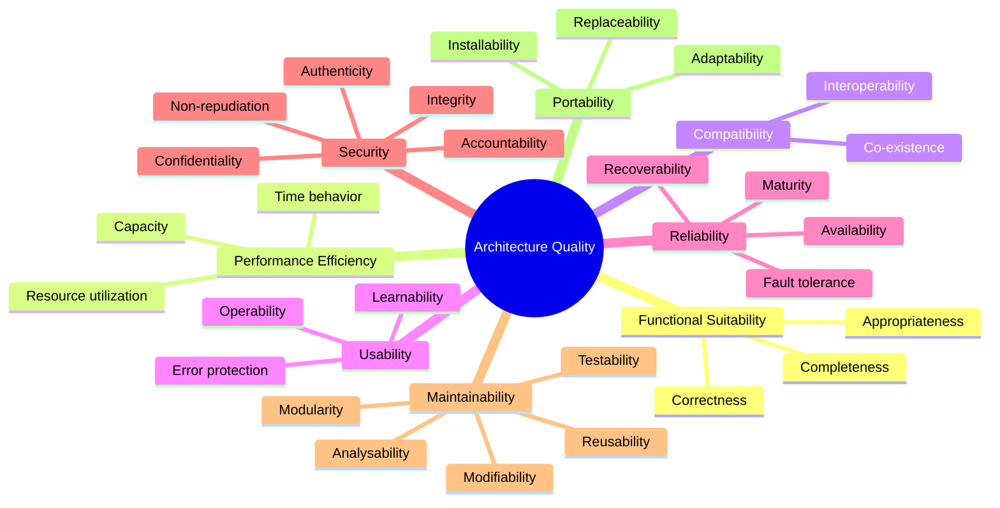
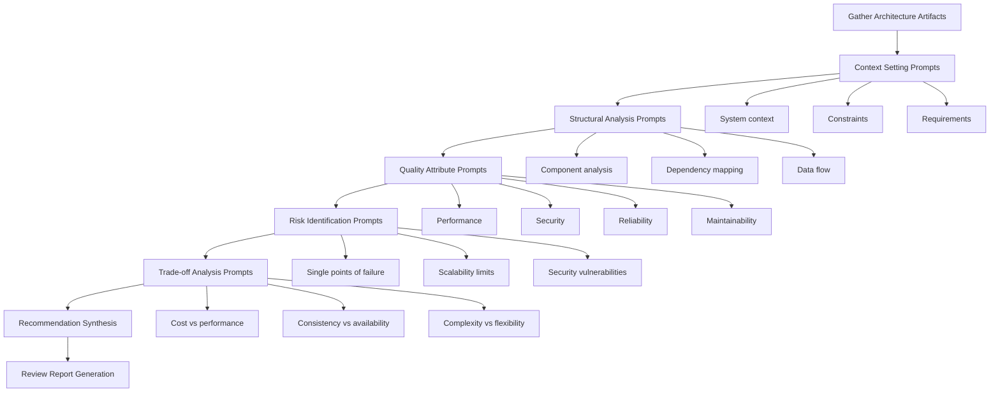

# Architecture Review Prompts

## Why Architecture Review Prompts Exist

Architecture reviews have historically been expensive, subjective, and inconsistent. A senior architect reviewing a system might catch different issues than another equally experienced architect — because each brings different biases, experiences, and mental models. Organizations like Google, Amazon, and Netflix formalized architecture review processes (Google's Design Docs, Amazon's PR/FAQ, Netflix's Architecture Review Board), but these still depend on the availability and attention of scarce senior engineers.

AI-assisted architecture reviews solve three fundamental problems:

1. **Availability gap** — Senior architects are bottlenecks; AI can review 24/7
2. **Consistency gap** — Humans miss different things each time; prompts enforce systematic coverage
3. **Knowledge gap** — No single human knows every failure mode; prompts encode collective wisdom

The prompts in this page are not meant to replace human judgment. They are meant to ensure that every architecture review covers the same ground, surfaces the same categories of risk, and produces structured, actionable feedback that humans can then prioritize.

::: tip Historical Context
The practice of formal architecture review traces back to the AT&T Architecture Review Board in the 1970s, which reviewed all new telecommunications system designs. The modern software equivalent emerged with the Architectural Tradeoff Analysis Method (ATAM) developed at the Software Engineering Institute (SEI) in the late 1990s. These prompts encode many of the quality attribute scenarios from ATAM into a format that AI assistants can systematically evaluate.
:::

## First Principles of Architecture Review

An architecture review is fundamentally an exercise in **risk identification**. Every architectural decision is a bet — a bet that the chosen approach will handle the expected (and unexpected) load, that the team can maintain and evolve the system, that the cost will remain acceptable, and that the system will remain secure.

The quality attributes that matter in architecture review can be formalized:

$$
\text{Architecture Quality} = \sum_{i=1}^{n} w_i \cdot Q_i(A)
$$

Where $Q_i$ represents each quality attribute (performance, security, maintainability, etc.), $w_i$ represents the weight/importance of each attribute for the given context, and $A$ represents the architecture being reviewed.

The key quality attributes from the ISO 25010 standard:



## Core Mechanics of Prompt-Driven Reviews

The architecture review process using AI follows a systematic flow:



### Prompt Template Structure

Every architecture review prompt follows a consistent structure:

```
[CONTEXT]: What the system does and its constraints
[ARCHITECTURE]: The specific design being reviewed
[FOCUS AREA]: What quality attribute or concern to evaluate
[OUTPUT FORMAT]: How to structure the response
[SEVERITY SCALE]: How to classify findings
```

## Implementation — The Complete Prompt Library

### Category 1: Context Setting & System Understanding (10 Prompts)

#### Prompt 1 — System Context Extraction

```text
You are a senior software architect conducting a formal architecture review.

I will provide you with a system description. Your task is to extract and
organize the following information:

SYSTEM DESCRIPTION:
[Paste system description, design doc, or README here]

Please extract:
1. **System Purpose**: What problem does this system solve? Who are the users?
2. **Key Functional Requirements**: List the top 10 functional requirements
3. **Quality Attribute Requirements**: For each, specify measurable targets
   - Performance (latency p50/p95/p99, throughput)
   - Availability (uptime SLA, RTO, RPO)
   - Scalability (current load, projected growth)
   - Security (compliance requirements, data classification)
   - Maintainability (team size, deployment frequency)
4. **Constraints**: Budget, technology mandates, team skills, timeline
5. **Assumptions**: What is being taken for granted?
6. **Dependencies**: External systems, third-party services, shared infrastructure

Format each section with specific, measurable values where possible.
Flag any missing information that would be critical for a thorough review.
```

#### Prompt 2 — Stakeholder Concern Mapping

```text
Given the following system architecture:

[ARCHITECTURE DESCRIPTION]

Map each stakeholder to their primary architectural concerns:

For each stakeholder type (end users, developers, operations, security,
business/product, compliance), identify:
1. Their top 3 quality attribute priorities
2. Specific measurable thresholds they care about
3. Risks that would be unacceptable to them
4. Trade-offs they would/wouldn't accept

Present as a stakeholder concern matrix with columns:
| Stakeholder | Priority Attributes | Success Metrics | Unacceptable Risks | Acceptable Trade-offs |
```

#### Prompt 3 — Architecture Decision Record (ADR) Review

```text
Review the following Architecture Decision Record:

[PASTE ADR]

Evaluate against these criteria:
1. **Problem Statement Clarity**: Is the problem well-defined? Are constraints explicit?
2. **Options Considered**: Were enough alternatives evaluated? (minimum 3)
3. **Evaluation Criteria**: Are the criteria measurable and weighted?
4. **Decision Rationale**: Does the chosen option clearly win against criteria?
5. **Consequences**: Are both positive and negative consequences documented?
6. **Reversibility Assessment**: How hard is it to change this decision later?
   Rate: [Easily Reversible | Costly to Reverse | Irreversible]
7. **Missing Considerations**: What was not evaluated that should have been?

Score each criterion 1-5 and provide an overall ADR quality score.
Rewrite any weak sections to demonstrate what "good" looks like.
```

#### Prompt 4 — Constraint Validation

```text
Given these system constraints:

Technical Constraints: [e.g., must run on AWS, must use PostgreSQL, etc.]
Business Constraints: [e.g., $50k/month budget, 3-person team, 6-month deadline]
Regulatory Constraints: [e.g., GDPR, HIPAA, SOC2, PCI-DSS]

And this proposed architecture:
[ARCHITECTURE DESCRIPTION]

Validate:
1. Does the architecture respect ALL stated constraints?
2. Are there implicit constraints not listed that the architecture assumes?
3. Which constraints are in tension with each other?
4. For each constraint conflict, propose a resolution strategy
5. Which constraints should be challenged/renegotiated and why?

Flag any constraint violations as CRITICAL findings.
```

#### Prompt 5 — Technology Stack Assessment

```text
Evaluate this technology stack for the described system:

SYSTEM: [Brief system description and scale requirements]

PROPOSED STACK:
- Language/Runtime: [e.g., Node.js 20, Go 1.22, etc.]
- Framework: [e.g., NestJS, Gin, etc.]
- Database: [e.g., PostgreSQL 16, MongoDB 7, etc.]
- Cache: [e.g., Redis 7, Memcached, etc.]
- Message Queue: [e.g., Kafka, RabbitMQ, SQS, etc.]
- Infrastructure: [e.g., AWS EKS, GCP Cloud Run, etc.]

For each technology choice, evaluate:
1. **Fitness for purpose**: Does it match the workload characteristics?
2. **Team capability**: Typical learning curve and hiring market
3. **Ecosystem maturity**: Community size, library availability, LTS status
4. **Operational complexity**: Deployment, monitoring, debugging difficulty
5. **Cost profile**: License, infrastructure, and operational costs at scale
6. **Lock-in risk**: How hard is it to migrate away? What is the blast radius?
7. **Security posture**: CVE history, update frequency, security tooling

Rate each: [Excellent | Good | Adequate | Concerning | Poor]
Suggest alternatives where rating is Concerning or Poor.
```

#### Prompt 6 — Requirements Traceability

```text
Given these requirements:

FUNCTIONAL REQUIREMENTS:
[List requirements]

NON-FUNCTIONAL REQUIREMENTS:
[List NFRs with measurable targets]

And this architecture:
[ARCHITECTURE DESCRIPTION WITH COMPONENTS]

Create a traceability matrix:

| Requirement | Implementing Component(s) | How It's Satisfied | Verification Method | Risk/Gap |
|------------|--------------------------|-------------------|--------------------|---------|

Flag:
- Requirements with no clear implementing component (ORPHANED)
- Components implementing no requirement (UNNECESSARY)
- Requirements satisfied by a single component (SINGLE POINT OF FAILURE)
- Requirements that conflict with each other (CONFLICT)
```

#### Prompt 7 — Scope and Boundary Definition

```text
Analyze the following system architecture:

[ARCHITECTURE DESCRIPTION]

Define and evaluate the system boundaries:

1. **System Boundary**: What is inside vs outside the system?
   Draw a clear line. List every external integration point.

2. **Trust Boundaries**: Where do trust levels change?
   Map every point where data crosses from trusted to untrusted (or vice versa).

3. **Consistency Boundaries**: Where can data be eventually consistent
   vs where must it be strongly consistent?

4. **Deployment Boundaries**: What deploys together vs independently?
   Identify coupling that prevents independent deployment.

5. **Team Boundaries**: Which teams own which components?
   Flag shared ownership (ownership ambiguity leads to quality decay).

For each boundary, assess:
- Is it clearly defined?
- Is it in the right place?
- What happens when something crosses it unexpectedly?
```

#### Prompt 8 — Evolution Readiness Assessment

```text
Given this architecture:

[ARCHITECTURE DESCRIPTION]

And these anticipated future requirements:
[LIST FUTURE REQUIREMENTS OR GROWTH SCENARIOS]

Assess evolution readiness:

1. **Extension Points**: Where can new functionality be added without
   modifying existing code? List specific extension mechanisms.

2. **Replacement Readiness**: For each major component, how hard is it
   to swap out? Rate: [Drop-in | Interface change | Significant refactor | Rewrite]

3. **Scaling Vectors**: Which dimensions can scale independently?
   - Horizontal (more instances)
   - Vertical (bigger instances)
   - Functional (new features)
   - Data (more data volume)
   - Geographic (new regions)

4. **Migration Paths**: For each anticipated change, describe the migration
   path. Flag any that require downtime or big-bang migrations.

5. **Technical Debt Trajectory**: Based on current architecture decisions,
   predict where technical debt will accumulate over 1, 2, and 5 years.
```

#### Prompt 9 — Integration Pattern Review

```text
Review the integration patterns in this architecture:

[ARCHITECTURE DESCRIPTION WITH INTEGRATION DETAILS]

For each integration point, evaluate:

1. **Pattern Choice**: Is the integration pattern appropriate?
   - Synchronous (REST, gRPC) vs Asynchronous (events, queues)
   - Point-to-point vs Pub/sub vs Choreography vs Orchestration

2. **Contract Management**: How are API contracts defined and versioned?
   - Schema validation
   - Backward/forward compatibility
   - Contract testing

3. **Failure Handling**: What happens when the integration fails?
   - Retry strategy (exponential backoff? circuit breaker?)
   - Fallback behavior
   - Dead letter handling
   - Timeout configuration

4. **Data Consistency**: How is consistency maintained across boundaries?
   - Saga pattern? Outbox pattern? Two-phase commit?

5. **Observability**: Can you trace a request across all integrations?
   - Distributed tracing
   - Correlation IDs
   - Integration health dashboards

Rate each integration: [Robust | Adequate | Fragile | Broken]
```

#### Prompt 10 — Architecture Fitness Functions

```text
For this system architecture:

[ARCHITECTURE DESCRIPTION]

Define architecture fitness functions — automated checks that verify
the architecture maintains its intended properties over time.

For each quality attribute, propose:

1. **Performance Fitness**:
   - Specific metrics to track (p99 latency, throughput, error rate)
   - Threshold values that trigger alerts
   - Automated load tests that run in CI/CD

2. **Structural Fitness**:
   - Dependency rules (what can depend on what)
   - Circular dependency detection
   - Component size limits (lines of code, complexity)

3. **Security Fitness**:
   - Dependency vulnerability scanning thresholds
   - API authentication coverage (% of endpoints protected)
   - Data encryption verification

4. **Operational Fitness**:
   - Deployment frequency targets
   - Mean time to recovery thresholds
   - Infrastructure drift detection

Provide implementation as code where possible (TypeScript/Go test examples).
Include CI/CD pipeline integration points.
```

### Category 2: Structural Analysis (10 Prompts)

#### Prompt 11 — Component Coupling Analysis

```text
Analyze the coupling between components in this architecture:

[ARCHITECTURE WITH COMPONENT DESCRIPTIONS AND INTERACTIONS]

For each pair of components that interact, evaluate:

1. **Coupling Type**:
   - Data coupling (sharing data via parameters)
   - Stamp coupling (sharing composite data structures)
   - Control coupling (one controls the flow of another)
   - Common coupling (sharing global data)
   - Content coupling (one modifies internals of another)

2. **Coupling Strength**: Rate 1-10 (1=loosely coupled, 10=tightly coupled)

3. **Afferent Coupling (Ca)**: Number of components that depend ON this component
4. **Efferent Coupling (Ce)**: Number of components this component depends ON
5. **Instability**: I = Ce / (Ca + Ce) — closer to 1 means more unstable

Create a dependency matrix and identify:
- Components with I close to 1 that contain business logic (RISK)
- Components with I close to 0 that change frequently (RISK)
- Circular dependencies (CRITICAL)
- God components (Ce > 5 or Ca > 10) (WARNING)

Suggest specific refactoring to reduce problematic coupling.
```

#### Prompt 12 — Data Flow Analysis

```text
Trace the data flow through this architecture:

[ARCHITECTURE DESCRIPTION]

For the following key user journeys:
[LIST 3-5 CRITICAL USER JOURNEYS]

For each journey, map:

1. **Data Path**: Every component the data touches, in order
2. **Data Transformations**: How data shape changes at each step
3. **Data Storage Points**: Where data is persisted (and why)
4. **Data Copies**: Where the same data exists in multiple places
5. **Latency Budget**: Time budget for each step, summing to total SLA

Present as a sequence diagram (Mermaid format) showing:
- Component interactions
- Data format at each boundary
- Synchronous vs asynchronous hops
- Caching layers
- Error paths

Identify:
- Unnecessary data copies (data duplication risk)
- Steps that could be parallelized
- Steps that are synchronous but could be async
- Missing data validation points
- PII/sensitive data in unexpected locations
```

#### Prompt 13 — Service Boundary Evaluation

```text
Evaluate the service boundaries in this microservices architecture:

[ARCHITECTURE WITH SERVICE DESCRIPTIONS]

For each service, assess:

1. **Domain Alignment**: Does the service map to a bounded context?
   - What business capability does it own?
   - Does it have a single, clear reason to change?

2. **Data Ownership**: Does the service own its data exclusively?
   - Shared databases between services (CRITICAL VIOLATION)
   - Data that logically belongs elsewhere

3. **Communication Patterns**:
   - Chatty interactions (>3 calls to complete one operation) (WARNING)
   - Distributed transactions spanning services (CRITICAL)
   - Synchronous chains longer than 3 services deep (WARNING)

4. **Size Assessment**:
   - Too small: Could be merged (nano-service anti-pattern)
   - Too large: Should be split (distributed monolith risk)
   - Criteria: team cognitive load, deployment independence, data cohesion

5. **Alternative Boundary Proposals**: If boundaries are wrong, propose better ones
   with a migration strategy.

Score each service boundary: [Well-defined | Acceptable | Needs Refinement | Misaligned]
```

#### Prompt 14 — API Design Review

```text
Review the API design for this system:

[API SPECIFICATION — OpenAPI/Swagger, gRPC proto, or description]

Evaluate against these dimensions:

1. **RESTfulness / Design Consistency**:
   - Resource naming (plural nouns, hierarchical)
   - HTTP method usage (GET idempotent, POST for creation, etc.)
   - Status code accuracy
   - HATEOAS adoption level

2. **Versioning Strategy**:
   - URL path vs header vs media type versioning
   - Backward compatibility guarantees
   - Deprecation policy

3. **Error Handling**:
   - Error response structure (RFC 7807 compliance)
   - Error categorization (client vs server)
   - Retry guidance in error responses

4. **Pagination & Filtering**:
   - Cursor vs offset pagination
   - Maximum page sizes
   - Filter and sort capabilities

5. **Security**:
   - Authentication mechanism
   - Authorization granularity
   - Rate limiting headers
   - Input validation

6. **Performance**:
   - Response payload sizes
   - N+1 query patterns in API design
   - Bulk operation support
   - Caching headers (ETag, Cache-Control)

7. **Developer Experience**:
   - Documentation completeness
   - Example requests/responses
   - SDK availability
   - Sandbox/testing environment

Provide specific fixes for each issue found, with before/after examples.
```

#### Prompt 15 — Database Schema Review

```text
Review this database schema for the described system:

SYSTEM CONTEXT: [What the system does, expected data volumes]
SCHEMA: [DDL, ER diagram description, or schema definition]

Evaluate:

1. **Normalization**:
   - Current normal form for each table
   - Intentional denormalization (justified?) vs accidental
   - Data anomaly risks (insert, update, delete anomalies)

2. **Index Strategy**:
   - Are all query patterns covered by indexes?
   - Over-indexing (write penalty)?
   - Missing composite indexes?
   - Index selectivity analysis

3. **Data Types**:
   - Appropriate type choices (VARCHAR(255) everywhere = red flag)
   - UUID vs auto-increment trade-offs
   - Timestamp timezone handling
   - Decimal precision for monetary values

4. **Referential Integrity**:
   - Foreign key constraints present and correct?
   - Cascade delete risks
   - Orphan record prevention

5. **Scale Readiness**:
   - Partition strategy for large tables
   - Sharding key selection
   - Read replica compatibility
   - Migration complexity for schema changes

6. **Security**:
   - PII column identification
   - Encryption at rest requirements
   - Row-level security needs
   - Audit trail columns

Estimate query performance for the top 5 most frequent queries.
```

#### Prompt 16 — Event-Driven Architecture Review

```text
Review the event-driven aspects of this architecture:

[ARCHITECTURE WITH EVENT DESCRIPTIONS]

Evaluate:

1. **Event Design**:
   - Event naming conventions (past tense domain events?)
   - Event schema structure (CloudEvents standard?)
   - Event versioning strategy
   - Event size (keep events small; reference large data)

2. **Event Flow**:
   - Map all event producers and consumers
   - Identify event chains longer than 5 hops (complexity risk)
   - Find circular event dependencies (CRITICAL)
   - Locate events with no consumers (dead events)

3. **Ordering Guarantees**:
   - Which events require ordering?
   - Partition key strategy for ordered events
   - Impact of out-of-order delivery

4. **Exactly-Once Processing**:
   - Idempotency strategy for each consumer
   - Deduplication mechanism
   - At-least-once vs at-most-once trade-offs

5. **Error Handling**:
   - Dead letter queue strategy
   - Poison message handling
   - Retry policy per event type
   - Monitoring and alerting on DLQ depth

6. **Event Store**:
   - Retention policy
   - Replay capability
   - Schema registry
   - Event sourcing considerations

Create an event flow diagram and identify the top 5 risks.
```

#### Prompt 17 — Dependency Graph Analysis

```text
Analyze the dependency graph of this system:

[LIST OF COMPONENTS AND THEIR DEPENDENCIES]
or
[ARCHITECTURE DIAGRAM DESCRIPTION]

Produce:

1. **Dependency Matrix**: NxN matrix showing all dependencies
   Direction: Row depends on Column

2. **Dependency Metrics**:
   - Total edges in graph
   - Average fan-in and fan-out
   - Maximum dependency depth
   - Circular dependency count

3. **Critical Path Analysis**:
   - Which component, if it fails, takes down the most other components?
   - Which dependency chain is the longest?
   - Which external dependency is the riskiest?

4. **Layering Violations**:
   - Does the architecture have clear layers?
   - Which dependencies skip layers?
   - Which dependencies go in the wrong direction?

5. **Stability Analysis**:
   Using Robert C. Martin's stability metrics:
   - Abstractness (A) = abstract classes / total classes
   - Instability (I) = Ce / (Ca + Ce)
   - Distance from main sequence: D = |A + I - 1|

   Flag components in the "Zone of Pain" (A=0, I=0) or
   "Zone of Uselessness" (A=1, I=1).

Visualize the dependency graph with risk-colored nodes.
```

#### Prompt 18 — Concurrency Architecture Review

```text
Review the concurrency model of this system:

[ARCHITECTURE DESCRIPTION WITH CONCURRENCY DETAILS]

Evaluate:

1. **Concurrency Model**:
   - Threading model (thread-per-request, event loop, actor model, etc.)
   - Async/await usage and potential pitfalls
   - Goroutine/coroutine management
   - Thread pool sizing rationale

2. **Shared State**:
   - What state is shared between concurrent operations?
   - Protection mechanisms (mutexes, channels, STM, immutability)
   - Lock contention risks
   - Lock ordering to prevent deadlocks

3. **Race Conditions**:
   - Check-then-act patterns (TOCTOU vulnerabilities)
   - Read-modify-write without atomicity
   - Double-checked locking correctness
   - Visibility guarantees (memory ordering)

4. **Resource Management**:
   - Connection pool sizing and starvation risks
   - File descriptor limits
   - Memory allocation under concurrency
   - Graceful shutdown with in-flight requests

5. **Distributed Concurrency**:
   - Distributed lock implementation
   - Leader election mechanism
   - Optimistic vs pessimistic concurrency control
   - Conflict resolution strategy

Identify the top 5 concurrency risks and propose mitigations.
```

#### Prompt 19 — State Management Review

```text
Analyze state management in this architecture:

[ARCHITECTURE DESCRIPTION]

Map all state in the system:

1. **State Inventory**:
   | State | Location | Lifetime | Size | Access Pattern | Consistency Req |
   |-------|----------|----------|------|---------------|----------------|

2. **State Categories**:
   - Session state: Where stored? Sticky sessions or shared?
   - Application state: Singletons? Configuration? Feature flags?
   - Cache state: Invalidation strategy? Stale read tolerance?
   - Database state: Source of truth? Replication lag impact?
   - Event state: Consumer offsets? Replay capability?

3. **Stateless Assessment**:
   - Which components are truly stateless? (can be killed/scaled freely)
   - Which components have hidden state? (local files, in-memory caches)
   - Which stateful components are scaling bottlenecks?

4. **State Synchronization**:
   - How is state kept consistent across replicas?
   - What is the maximum staleness window?
   - What happens during network partitions?

5. **State Recovery**:
   - For each stateful component, what is the recovery procedure?
   - What is the data loss window (RPO)?
   - How long does recovery take (RTO)?

Flag any state that exists in only one location with no backup as CRITICAL.
```

#### Prompt 20 — Cross-Cutting Concerns Review

```text
Evaluate how cross-cutting concerns are handled in this architecture:

[ARCHITECTURE DESCRIPTION]

For each cross-cutting concern, assess implementation quality:

1. **Logging**:
   - Structured logging format (JSON?)
   - Log levels usage consistency
   - Correlation ID propagation
   - PII in logs (CRITICAL if present)
   - Log aggregation strategy

2. **Monitoring & Observability**:
   - Metrics: RED (Rate, Errors, Duration) for services
   - Metrics: USE (Utilization, Saturation, Errors) for resources
   - Distributed tracing coverage
   - Custom business metrics
   - Dashboard and alerting strategy

3. **Authentication & Authorization**:
   - AuthN mechanism (JWT, OAuth2, mTLS)
   - AuthZ model (RBAC, ABAC, ReBAC)
   - Token management (refresh, rotation, revocation)
   - Service-to-service auth

4. **Configuration Management**:
   - Environment-specific configuration
   - Secret management
   - Feature flag system
   - Configuration change propagation

5. **Error Handling**:
   - Error categorization and codes
   - Error propagation across boundaries
   - User-facing error messages
   - Error recovery procedures

Rate each: [Excellent | Good | Adequate | Insufficient | Missing]
```

### Category 3: Quality Attribute Deep Dives (10 Prompts)

#### Prompt 21 — Performance Architecture Review

```text
Conduct a performance review of this architecture:

[ARCHITECTURE DESCRIPTION]
[PERFORMANCE REQUIREMENTS: target latency, throughput, concurrent users]

Analyze:

1. **Latency Budget**:
   For the critical path (most common user request), break down latency:
   | Step | Component | Expected Latency | Cumulative | Budget Remaining |

   Total must fit within p99 SLA.

2. **Throughput Analysis**:
   - What is the theoretical maximum throughput?
   - Where is the bottleneck? (apply Little's Law: L = lambda * W)
   - What is the throughput at each component?
   - Connection/thread pool limits

3. **Caching Strategy**:
   - What is cached? Cache hit ratio estimate?
   - Cache invalidation strategy (TTL, write-through, write-behind)
   - Cache stampede prevention
   - Cold cache behavior (system restart scenario)

4. **Database Performance**:
   - Query patterns and estimated costs
   - Index coverage for hot queries
   - Connection pool sizing: pool_size = (core_count * 2) + disk_spindles
   - Read/write split strategy

5. **Network Performance**:
   - Data serialization format efficiency
   - Request batching opportunities
   - CDN and edge caching
   - DNS resolution overhead

6. **Capacity Model**:
   Using Universal Scalability Law:
   C(N) = N / (1 + alpha * (N - 1) + beta * N * (N - 1))
   Estimate alpha (contention) and beta (coherence) parameters.

Provide specific optimization recommendations ranked by impact.
```

#### Prompt 22 — Security Architecture Review

```text
Conduct a security review of this architecture using the STRIDE threat model:

[ARCHITECTURE DESCRIPTION]
[DATA CLASSIFICATION: what sensitive data exists]
[COMPLIANCE REQUIREMENTS: GDPR, HIPAA, SOC2, PCI-DSS, etc.]

For each component and data flow, evaluate STRIDE threats:

1. **Spoofing** (Authentication):
   - How is identity verified at each entry point?
   - Multi-factor authentication coverage
   - Service-to-service identity verification
   - Certificate/key management

2. **Tampering** (Integrity):
   - Input validation at trust boundaries
   - Data integrity verification (checksums, signatures)
   - Audit log tamper protection
   - Code signing and deployment integrity

3. **Repudiation** (Non-repudiation):
   - Audit logging completeness
   - Tamper-evident logging
   - Digital signatures on critical operations

4. **Information Disclosure** (Confidentiality):
   - Data encryption in transit (TLS 1.3, mTLS)
   - Data encryption at rest (AES-256)
   - Key management (HSM, KMS, rotation)
   - PII exposure in logs, errors, URLs

5. **Denial of Service** (Availability):
   - Rate limiting at each entry point
   - Resource exhaustion protection
   - DDoS mitigation strategy
   - Graceful degradation under attack

6. **Elevation of Privilege** (Authorization):
   - Least privilege enforcement
   - Privilege escalation paths
   - Admin access controls
   - Multi-tenancy isolation

Create a threat model diagram. Prioritize findings by risk = likelihood x impact.
```

#### Prompt 23 — Reliability & Availability Review

```text
Review the reliability architecture:

[ARCHITECTURE DESCRIPTION]
[AVAILABILITY TARGET: e.g., 99.95% = 4.38 hours downtime/year]

Analyze:

1. **Availability Calculation**:
   For serial components: A_total = A1 * A2 * ... * An
   For parallel (redundant): A_total = 1 - (1-A1)(1-A2)...(1-An)

   Calculate the theoretical availability of the entire system.
   Does it meet the SLA?

2. **Single Points of Failure (SPOF)**:
   Identify every component that, if it fails, causes system failure.
   For each SPOF, propose a redundancy strategy:
   - Active-active
   - Active-passive
   - N+1 redundancy

3. **Failure Modes & Effects Analysis (FMEA)**:
   | Component | Failure Mode | Effect | Severity | Likelihood | Detection | RPN |

   RPN = Severity x Likelihood x Detection (higher = worse)

4. **Recovery Architecture**:
   - Automated failover mechanisms
   - Health check granularity (liveness vs readiness)
   - Circuit breaker configuration
   - Bulkhead isolation
   - Retry with backoff strategy

5. **Disaster Recovery**:
   - RTO (Recovery Time Objective) for each component
   - RPO (Recovery Point Objective) for each data store
   - Backup strategy and tested restore procedure
   - Multi-region failover capability
   - Chaos engineering practices

6. **Graceful Degradation**:
   - What features can be disabled under load?
   - Load shedding strategy
   - Feature flag-based degradation
   - User communication during incidents
```

#### Prompt 24 — Scalability Architecture Review

```text
Assess the scalability of this architecture:

[ARCHITECTURE DESCRIPTION]
[CURRENT SCALE: users, requests/sec, data volume]
[TARGET SCALE: growth projections for 1yr, 3yr, 5yr]

Evaluate:

1. **Horizontal Scalability**:
   For each component, can it scale horizontally?
   | Component | Horizontally Scalable? | Blocking Factor | Max Instances |

2. **Vertical Scalability Limits**:
   What are the single-machine limits?
   - CPU-bound components: core count limit
   - Memory-bound components: RAM limit
   - I/O-bound components: disk/network limit
   - Connection-bound: file descriptor / connection limit

3. **Data Scalability**:
   - Database growth projection (GB/month)
   - Sharding strategy and shard key selection
   - Hot spot risk analysis
   - Archive/purge strategy for old data

4. **Scaling Triggers & Automation**:
   - What metrics trigger scale-up?
   - How fast can the system scale? (scale-up time)
   - Minimum viable capacity (scale-down floor)
   - Cost implications at each scale level

5. **Scaling Bottlenecks**:
   Apply Amdahl's Law: Speedup = 1 / (s + (1-s)/N)
   Where s = serial fraction
   - What percentage of the workload is inherently serial?
   - What is the maximum theoretical speedup?

6. **Elasticity**:
   - Can the system scale down as well as up?
   - How quickly does it respond to load changes?
   - What is the cost during low-traffic periods?

Propose a scaling roadmap for the next 3 years.
```

#### Prompt 25 — Maintainability Review

```text
Assess the maintainability of this architecture:

[ARCHITECTURE DESCRIPTION]
[TEAM SIZE AND STRUCTURE]
[CODEBASE METRICS IF AVAILABLE]

Evaluate:

1. **Cognitive Load**:
   - Can a new team member understand a component in < 1 week?
   - How many components must someone understand to make a typical change?
   - Documentation quality and freshness
   - Onboarding time estimate

2. **Modularity**:
   - Clear module boundaries?
   - Interface stability (how often do interfaces change?)
   - Dependency direction (stable dependencies principle)
   - Module cohesion (Single Responsibility adherence)

3. **Testability**:
   - Unit test isolation (can test without external dependencies?)
   - Integration test strategy
   - Contract testing between services
   - Test environment parity with production

4. **Deployability**:
   - Deployment frequency capability
   - Deployment risk (blast radius)
   - Rollback capability and speed
   - Feature flag coverage for gradual rollouts

5. **Debuggability**:
   - Can you reproduce production issues locally?
   - Distributed tracing coverage
   - Log correlation across services
   - Error context richness

6. **Evolvability**:
   - How hard is it to add a new feature? (estimate typical feature time)
   - How hard is it to change the data model?
   - How hard is it to swap a technology component?
   - Technical debt quantification

Rate overall maintainability: [Excellent | Good | Adequate | Poor | Critical]
```

#### Prompt 26 — Operational Excellence Review

```text
Review operational readiness of this architecture:

[ARCHITECTURE DESCRIPTION]
[DEPLOYMENT MODEL]
[ON-CALL STRUCTURE]

Assess:

1. **Observability Stack**:
   - Metrics: Coverage, granularity, retention
   - Logs: Structure, aggregation, search capability
   - Traces: Coverage, sampling rate, correlation
   - Profiling: CPU, memory, goroutine/thread profiling capability
   - Are the "Four Golden Signals" covered? (latency, traffic, errors, saturation)

2. **Incident Response**:
   - Alerting rules: signal-to-noise ratio
   - Runbook availability for each alert
   - Escalation paths defined?
   - War room / incident channel automation
   - Post-incident review process

3. **Deployment Pipeline**:
   - CI/CD maturity (manual? semi-auto? fully automated?)
   - Deployment stages (dev -> staging -> canary -> production)
   - Canary analysis automation
   - Rollback mechanism and speed

4. **Capacity Planning**:
   - Resource utilization tracking
   - Growth forecasting accuracy
   - Provisioning lead time
   - Cost monitoring and optimization

5. **Security Operations**:
   - Vulnerability scanning frequency
   - Patch management SLA
   - Access review cadence
   - Secret rotation automation

6. **Toil Reduction**:
   - What manual operational tasks exist?
   - Estimate toil as percentage of on-call time
   - Automation opportunities ranked by ROI

Target: < 50% toil, > 99.9% deployment success rate, < 5 min MTTD.
```

#### Prompt 27 — Cost Architecture Review

```text
Review the cost efficiency of this architecture:

[ARCHITECTURE DESCRIPTION]
[CURRENT MONTHLY COST BREAKDOWN]
[EXPECTED TRAFFIC PATTERNS]

Analyze:

1. **Cost Per Transaction**:
   - Calculate total cost / total transactions
   - Break down by component
   - Identify most expensive component per transaction

2. **Resource Utilization**:
   - CPU utilization across instances (target: 60-70%)
   - Memory utilization (target: 70-80%)
   - Storage utilization and growth rate
   - Network data transfer costs

3. **Pricing Model Optimization**:
   - Reserved vs On-Demand vs Spot analysis
   - Savings Plans applicability
   - Committed Use Discounts
   - Right-sizing recommendations

4. **Architectural Cost Drivers**:
   - Synchronous calls that could be async (saves compute wait time)
   - Data transfer between regions/AZs
   - Over-replicated data
   - Idle resources during off-peak

5. **Cost Scaling Model**:
   Plot: Cost vs Load (linear? super-linear? sub-linear?)
   - At 2x load, does cost go to 2x? 3x? 1.5x?
   - Where are the cost cliffs? (e.g., need to add a database replica)

6. **Cost Optimization Roadmap**:
   | Optimization | Estimated Savings | Effort | Risk | Priority |

   Target: 20-30% cost reduction without performance impact.
```

#### Prompt 28 — Compliance Architecture Review

```text
Review this architecture for compliance requirements:

[ARCHITECTURE DESCRIPTION]
[APPLICABLE REGULATIONS: GDPR, HIPAA, SOC2, PCI-DSS, etc.]

For each regulation, verify:

1. **GDPR Compliance** (if applicable):
   - Data inventory: what personal data, where stored, how long retained
   - Lawful basis for processing each data category
   - Data subject rights implementation (access, deletion, portability)
   - Cross-border data transfer mechanisms (SCCs, adequacy decisions)
   - Data Protection Impact Assessment (DPIA) triggers
   - Breach notification capability (72-hour requirement)

2. **SOC 2 Type II** (if applicable):
   - Trust Service Criteria coverage:
     - Security (CC1-CC9)
     - Availability (A1)
     - Processing Integrity (PI1)
     - Confidentiality (C1)
     - Privacy (P1-P8)
   - Evidence collection automation
   - Continuous monitoring controls

3. **PCI-DSS** (if applicable):
   - Cardholder data environment (CDE) scope
   - Network segmentation from CDE
   - Encryption of cardholder data
   - Access control to CDE
   - Audit trail requirements

4. **Architecture Controls**:
   | Control | Requirement | Implementation | Evidence | Gap |

Flag CRITICAL for any compliance gap that could result in regulatory action.
```

#### Prompt 29 — Observability Architecture Review

```text
Deep-dive review of observability in this architecture:

[ARCHITECTURE DESCRIPTION]
[CURRENT OBSERVABILITY TOOLING]

Assess the three pillars plus additional signals:

1. **Metrics** (Quantitative):
   - RED metrics per service: Rate, Errors, Duration
   - USE metrics per resource: Utilization, Saturation, Errors
   - Business metrics: conversion rate, revenue, active users
   - Custom application metrics
   - Metric cardinality management (high cardinality = cost explosion)
   - Histogram vs summary for latency

2. **Logs** (Qualitative):
   - Structured format (JSON with consistent schema)
   - Severity levels used correctly?
   - Context enrichment (request ID, user ID, trace ID)
   - Sampling strategy for high-volume logs
   - Retention and search performance
   - PII scrubbing in logs

3. **Traces** (Causal):
   - Coverage: % of requests traced
   - Span naming conventions
   - Context propagation across async boundaries
   - Sampling strategy (head-based vs tail-based)
   - Trace-to-log and trace-to-metric correlation

4. **Profiling** (Resource):
   - Continuous profiling capability
   - CPU, memory, goroutine/thread profiling
   - Production profiling overhead (< 2% acceptable)

5. **Alerting**:
   - Alert on symptoms, not causes
   - Multi-window, multi-burn-rate alerts for SLOs
   - Alert fatigue assessment (pages per on-call shift)
   - Actionability: every alert has a runbook?

Calculate observability coverage score: % of failure modes detectable.
```

#### Prompt 30 — Testing Architecture Review

```text
Review the testing architecture:

[ARCHITECTURE DESCRIPTION]
[CURRENT TESTING STRATEGY]

Evaluate the test pyramid:

1. **Unit Tests**:
   - Coverage percentage and coverage quality
   - Test isolation (mocking strategy)
   - Execution speed (full suite < 5 minutes?)
   - Flakiness rate (< 1% acceptable)

2. **Integration Tests**:
   - Component integration coverage
   - Test data management strategy
   - External dependency stubbing (Testcontainers? WireMock?)
   - Database state management (migrations, seeds, cleanup)

3. **Contract Tests**:
   - Consumer-driven contract coverage
   - Pact or similar framework usage
   - Contract versioning strategy
   - Provider verification automation

4. **End-to-End Tests**:
   - Critical path coverage
   - Execution time (full suite < 30 minutes?)
   - Flakiness management
   - Environment parity with production

5. **Performance Tests**:
   - Load test scenarios matching production patterns
   - Stress test to find breaking points
   - Soak test for memory leaks
   - Benchmark regression detection

6. **Chaos Testing**:
   - Failure injection coverage
   - Game day cadence
   - Recovery verification
   - Steady state hypothesis definition

7. **Security Testing**:
   - SAST/DAST integration
   - Dependency vulnerability scanning
   - Penetration testing cadence

Test architecture anti-patterns to flag:
- Ice cream cone (too many E2E, too few unit tests)
- Flaky test tolerance
- Test environment divergence from production
```

### Category 4: Risk Identification (10 Prompts)

#### Prompt 31 — Single Points of Failure Audit

```text
Conduct a comprehensive SPOF audit:

[ARCHITECTURE DESCRIPTION]

For EVERY component, service, database, network path, and human process:

1. Ask: "If this fails completely right now, what happens?"
2. Ask: "If this degrades (slow but not dead), what happens?"
3. Ask: "If this returns wrong data silently, what happens?"

Categorize findings:

| Component | Failure Type | Impact | Current Mitigation | Redundancy Cost | Priority |
|-----------|-------------|--------|-------------------|-----------------|----------|

Severity levels:
- P0 (CRITICAL): System completely unusable, data loss possible
- P1 (HIGH): Major feature unavailable, significant user impact
- P2 (MEDIUM): Degraded experience, workaround exists
- P3 (LOW): Minor inconvenience, minimal user impact

Common SPOFs to explicitly check:
- Single database instance
- Single load balancer
- DNS provider
- Certificate authority
- Single cloud region
- Configuration management system
- Deployment pipeline
- Monitoring system itself
- Human knowledge (bus factor = 1)
- Third-party SaaS dependencies

For each P0/P1 finding, provide a specific redundancy recommendation with cost estimate.
```

#### Prompt 32 — Cascade Failure Analysis

```text
Analyze cascade failure scenarios in this architecture:

[ARCHITECTURE DESCRIPTION WITH ALL DEPENDENCIES]

For each external dependency and internal service:

1. **Simulate Failure**: What happens when this component becomes:
   a. Completely unavailable (connection refused)
   b. Slow (10x normal latency)
   c. Returning errors (500s for 50% of requests)
   d. Returning wrong data (200 with corrupt payload)

2. **Blast Radius Mapping**:
   - Direct dependents affected
   - Indirect dependents affected (second-order effects)
   - Estimated percentage of users impacted
   - Revenue impact estimate

3. **Protection Mechanisms**:
   For each failure scenario, verify existence of:
   - Circuit breaker (what are the thresholds?)
   - Timeout (what values? are they tuned?)
   - Bulkhead (is the failing component isolated?)
   - Fallback (what degraded behavior is provided?)
   - Retry with backoff (max retries? jitter?)

4. **Cascade Prevention Score**:
   Score each service 1-10 for cascade resilience.

5. **Thundering Herd Prevention**:
   After a failure is resolved, can the system handle the surge of
   retried requests? Is there request queuing, load shedding, or
   gradual recovery?

Create a failure propagation diagram showing cascade paths.
```

#### Prompt 33 — Data Loss Scenario Analysis

```text
Analyze all possible data loss scenarios:

[ARCHITECTURE DESCRIPTION]
[DATA STORES AND THEIR CONFIGURATIONS]

For each data store (databases, caches, queues, file systems, etc.):

1. **Loss Scenarios**:
   - Hardware failure (single disk, full node, full rack)
   - Software bug (corrupt write, schema migration error)
   - Human error (accidental DELETE, wrong deployment)
   - Security breach (ransomware, malicious deletion)
   - Cloud provider outage (single AZ, full region)
   - Split brain during network partition

2. **Current Protection**:
   | Data Store | Replication | Backup Frequency | Backup Location | Tested Restore? | RPO | RTO |

3. **Recovery Procedures**:
   For each scenario, document:
   - Step-by-step recovery procedure
   - Who can execute it? (bus factor for recovery)
   - Time to detect the loss
   - Time to recover
   - Data loss window

4. **Gap Analysis**:
   - Which scenarios have no protection?
   - Which backup procedures are untested?
   - Which RPO/RTO values exceed business requirements?
   - Is there a "break glass" procedure for catastrophic scenarios?

5. **Recommendation Priority**:
   | Gap | Risk | Effort | Cost | Priority |

Flag any unprotected data store as CRITICAL.
```

#### Prompt 34 — Security Threat Modeling

```text
Perform threat modeling using STRIDE + attack trees:

[ARCHITECTURE DESCRIPTION]
[ENTRY POINTS AND TRUST BOUNDARIES]
[DATA CLASSIFICATION]

1. **Attack Surface Mapping**:
   For each entry point:
   | Entry Point | Protocol | Authentication | Authorization | Input Validation | Risk |

2. **Attack Tree Analysis**:
   For the top 3 most valuable assets, build attack trees:

   Root: [Compromise Asset X]
   ├── Via Network Attack
   │   ├── Exploit public API vulnerability
   │   ├── Man-in-the-middle (if TLS misconfigured)
   │   └── DNS hijacking
   ├── Via Authentication Bypass
   │   ├── Credential stuffing
   │   ├── JWT forgery
   │   └── Session fixation
   ├── Via Insider Threat
   │   ├── Privileged user abuse
   │   ├── Compromised CI/CD pipeline
   │   └── Supply chain attack
   └── Via Social Engineering
       ├── Phishing for credentials
       └── Support channel manipulation

3. **OWASP Top 10 Check**:
   For each OWASP Top 10 vulnerability:
   | Vulnerability | Applicable? | Mitigation in Place? | Gap? |

4. **Supply Chain Security**:
   - Dependency audit (known vulnerabilities?)
   - Container base image security
   - CI/CD pipeline integrity
   - Third-party code review process

5. **Risk Register**:
   | Threat | Likelihood (1-5) | Impact (1-5) | Risk Score | Mitigation | Residual Risk |

Top 10 threats ranked by risk score with specific mitigations.
```

#### Prompt 35 — Scalability Limit Analysis

```text
Identify the scalability limits of this architecture:

[ARCHITECTURE DESCRIPTION]
[CURRENT METRICS: requests/sec, data volume, user count]
[GROWTH PROJECTIONS]

For each component, find the breaking point:

1. **Compute Limits**:
   - At what requests/sec does CPU saturation occur?
   - What is the thread/goroutine/connection limit?
   - Memory per request * max concurrent requests = memory limit

2. **Data Limits**:
   - At what data volume does the primary database struggle?
   - When do index sizes exceed memory?
   - When do query times become unacceptable?
   - When does backup/restore time exceed maintenance windows?

3. **Network Limits**:
   - Bandwidth saturation point
   - Connection limit per load balancer
   - DNS query rate limits
   - CDN cache hit ratio degradation with more content

4. **Architectural Limits**:
   - Single-leader write throughput ceiling
   - Cross-region replication lag at volume
   - Message queue throughput ceiling
   - Configuration propagation time at scale

5. **Cost Limits**:
   - At what scale does cost become prohibitive?
   - Where are the non-linear cost jumps?
   - Cost per user at 10x, 100x, 1000x scale

Present as a "Scaling Wall" diagram:
| Component | Current Load | Comfortable Limit | Hard Limit | Action Required |

For each limit < 5x current load, provide a scaling strategy.
```

#### Prompt 36 — Technical Debt Assessment

```text
Assess the technical debt in this architecture:

[ARCHITECTURE DESCRIPTION]
[KNOWN TECHNICAL DEBT ITEMS]
[SYSTEM AGE AND MAJOR MILESTONES]

Categorize debt:

1. **Deliberate Prudent Debt** (conscious trade-offs):
   - Decisions made knowingly for speed
   - Clear payoff timeline
   - Documented with ADRs

2. **Deliberate Reckless Debt** (shortcuts with known consequences):
   - "We don't have time for proper design"
   - Missing tests, hardcoded values
   - Copy-paste code

3. **Inadvertent Prudent Debt** (learned better since):
   - Architecture that was right at the time but is now outdated
   - Technology choices that haven't aged well
   - Patterns that don't match current scale

4. **Inadvertent Reckless Debt** (didn't know better):
   - Anti-patterns embedded in architecture
   - Missing fundamental capabilities (observability, security)
   - Architectural coupling that shouldn't exist

For each debt item:
| Debt | Category | Interest Rate | Principal | Impact if Unpaid | Fix Effort |

Interest Rate = How much slower does this make feature delivery?
Principal = How much effort to fix it completely?

5. **Debt Repayment Strategy**:
   - Quick wins (high interest, low principal) — fix immediately
   - Strategic investments (high interest, high principal) — plan for next quarter
   - Low priority (low interest, any principal) — track but don't prioritize
   - Accept (low interest, high principal) — document and move on

Total debt estimate in engineer-weeks. Recommended allocation: 20% of sprint capacity.
```

#### Prompt 37 — Vendor Lock-in Risk Assessment

```text
Assess vendor and technology lock-in risks:

[ARCHITECTURE DESCRIPTION]
[CLOUD PROVIDER AND MANAGED SERVICES USED]

For each vendor dependency:

1. **Lock-in Inventory**:
   | Vendor/Technology | Service Used | Abstraction Layer? | Migration Effort | Switching Cost |

2. **Lock-in Depth Analysis**:
   - **Shallow lock-in**: Standard APIs, easy to migrate (S3-compatible storage)
   - **Medium lock-in**: Proprietary features used but alternatives exist (Lambda -> Cloud Functions)
   - **Deep lock-in**: Deeply embedded, no clear alternative (DynamoDB Streams -> ?)
   - **Complete lock-in**: Would require full rewrite (Firestore data model -> ?)

3. **Portability Assessment**:
   - Infrastructure as Code portability (Terraform vs CloudFormation)
   - Container portability (Kubernetes vs ECS)
   - Data portability (standard formats? export capability?)
   - API portability (REST/gRPC vs proprietary SDKs)

4. **Risk Scenarios**:
   - Vendor price increase (what if costs double?)
   - Vendor discontinues service (sunset risk)
   - Vendor outage lasting days (business continuity)
   - Compliance requires data sovereignty change
   - Acquisition/merger forces platform change

5. **Mitigation Strategies**:
   - Abstraction layers worth implementing
   - Multi-cloud strategy cost/benefit
   - Data export automation
   - Alternative vendor evaluation cadence

Score overall lock-in risk: [Minimal | Moderate | Significant | Critical]
```

#### Prompt 38 — Operational Risk Assessment

```text
Identify operational risks in this architecture:

[ARCHITECTURE DESCRIPTION]
[DEPLOYMENT PROCESS]
[ON-CALL STRUCTURE]

Evaluate:

1. **Deployment Risks**:
   - Can a bad deployment take down production?
   - Is rollback automated and tested?
   - Canary deployment coverage
   - Blue-green or rolling update strategy
   - Database migration rollback capability
   - Feature flag coverage for new features

2. **Configuration Risks**:
   - Can a configuration change cause outage?
   - Configuration validation before apply?
   - Configuration change audit trail
   - Gradual configuration rollout
   - Emergency configuration override procedure

3. **Human Risks**:
   - Bus factor for critical systems
   - Runbook completeness and freshness
   - On-call engineer capability range
   - Training program for new on-call engineers
   - Dangerous manual procedures (DROP TABLE access?)

4. **Dependency Risks**:
   - Third-party SaaS downtime impact
   - Certificate expiration monitoring
   - Domain/DNS renewal tracking
   - License expiration tracking
   - API deprecation monitoring

5. **Recovery Risks**:
   - When was the last disaster recovery test?
   - Can the system be rebuilt from scratch? How long?
   - Are infrastructure-as-code definitions complete?
   - Secrets recovery procedure

Create an operational risk register with severity and likelihood scores.
```

#### Prompt 39 — Migration Risk Assessment

```text
Assess risks for this planned architectural migration:

FROM: [Current architecture description]
TO: [Target architecture description]
TIMELINE: [Planned timeline]
TEAM: [Team size and experience]

Evaluate:

1. **Scope Risk**:
   - Is the migration scope clearly defined?
   - What is being migrated vs replaced vs retired?
   - Hidden dependencies that will surface during migration?
   - Data migration complexity and volume

2. **Strategy Risk**:
   - Big bang vs strangler fig vs parallel run?
   - Can you migrate incrementally?
   - What is the rollback strategy at each stage?
   - How do you handle the "hybrid state" during migration?

3. **Data Migration Risk**:
   - Schema transformation complexity
   - Data volume and migration time
   - Data validation strategy (checksums, reconciliation)
   - Referential integrity during migration
   - Zero-downtime data migration feasibility

4. **Feature Parity Risk**:
   - Complete feature inventory of current system
   - Feature mapping to new system
   - Features that will work differently (user communication plan)
   - Features intentionally dropped (stakeholder alignment?)

5. **Performance Risk**:
   - Performance regression potential
   - Baseline metrics established?
   - Performance testing in migration stages
   - Capacity planning for new system

6. **Timeline Risk**:
   - Buffer for unknowns (recommend 50% buffer minimum)
   - Dependencies on other teams/systems
   - Parallel operation period cost
   - Cutover window and coordination

Score overall migration risk: [Low | Medium | High | Very High]
Recommend go/no-go decision framework.
```

#### Prompt 40 — Future-Proofing Assessment

```text
Assess how well this architecture handles future uncertainty:

[ARCHITECTURE DESCRIPTION]
[BUSINESS CONTEXT AND STRATEGY]
[INDUSTRY TRENDS]

Evaluate adaptability to:

1. **Traffic Pattern Changes**:
   - 10x traffic growth in 6 months
   - Spike to 100x normal (viral event)
   - Traffic shift from web to mobile to IoT
   - Geographic expansion to new regions

2. **Technology Evolution**:
   - Moving from REST to gRPC/GraphQL
   - Adopting edge computing
   - Integrating AI/ML pipelines
   - Moving to serverless or mesh architectures

3. **Business Model Changes**:
   - Multi-tenancy requirements
   - White-labeling / B2B2C
   - Marketplace / platform model
   - Real-time features (chat, collaboration)

4. **Regulatory Changes**:
   - New data residency requirements
   - Stricter privacy regulations
   - Industry-specific compliance (open banking, health data)
   - AI regulation (model explainability, bias auditing)

5. **Team Evolution**:
   - Team size doubles in 1 year
   - Team splits across time zones
   - Skill set shifts (e.g., adding ML engineers)
   - Organizational restructuring

For each scenario:
| Scenario | Current Readiness (1-5) | Effort to Adapt | Risk if Unprepared | Priority |

Architecture patterns that improve future-proofing:
- Clean architecture / hexagonal
- Event sourcing (replay any past state)
- API-first design (decouple front/back)
- Feature flags (runtime behavior changes)
- Plugin architecture (extend without modifying)
```

### Category 5: Synthesis & Recommendations (10+ Prompts)

#### Prompt 41 — Architecture Review Report Generation

```text
Based on the following architecture review findings:

[PASTE ALL FINDINGS FROM PREVIOUS PROMPTS]

Generate a comprehensive Architecture Review Report:

## Executive Summary
- Overall architecture health score (1-100)
- Top 3 strengths
- Top 3 critical risks
- Recommended immediate actions

## Findings by Category
For each finding:
- ID: [ARCH-001]
- Category: [Security | Performance | Reliability | etc.]
- Severity: [Critical | High | Medium | Low]
- Description: Clear explanation of the issue
- Impact: Business and technical impact
- Recommendation: Specific fix with effort estimate
- Timeline: Immediate | Next sprint | Next quarter | Backlog

## Risk Matrix
Plot all findings on a likelihood vs impact matrix.

## Recommended Roadmap
Phase 1 (0-30 days): Critical fixes
Phase 2 (30-90 days): High-priority improvements
Phase 3 (90-180 days): Strategic improvements
Phase 4 (180+ days): Long-term evolution

## Architecture Decision Records Needed
List ADRs that should be created to document decisions.

## Metrics to Track
Define success metrics to verify improvements.
```

#### Prompt 42 — Trade-off Analysis Matrix

```text
For this architectural decision:

[DECISION DESCRIPTION]
[OPTIONS BEING CONSIDERED: Option A, Option B, Option C]

Create a comprehensive trade-off analysis:

1. **Evaluation Criteria** (weighted):
   | Criterion | Weight | Description |

   Categories: Performance, Cost, Complexity, Time-to-Market,
   Maintainability, Scalability, Security, Team Expertise

2. **Options Evaluation**:
   | Criterion (Weight) | Option A | Option B | Option C |
   Score each 1-5, multiply by weight.

3. **Sensitivity Analysis**:
   How do results change if weights shift?
   - If performance matters 2x more?
   - If cost matters 2x more?
   - If time-to-market is critical?

4. **Risk Comparison**:
   | Risk | Option A | Option B | Option C |
   Include: implementation risk, operational risk, scaling risk

5. **Reversibility Assessment**:
   How hard is it to switch from each option to another?

6. **Recommendation**:
   Clear recommendation with reasoning.
   Conditions under which you would recommend differently.
```

#### Prompt 43 — Architecture Health Scorecard

```text
Score this architecture across all quality dimensions:

[ARCHITECTURE DESCRIPTION]

Use this scoring rubric (1-5 for each):

| Dimension | Score | Evidence | Improvement Action |
|-----------|-------|----------|-------------------|
| Performance | ? | | |
| Scalability | ? | | |
| Reliability | ? | | |
| Security | ? | | |
| Maintainability | ? | | |
| Operability | ? | | |
| Cost Efficiency | ? | | |
| Testability | ? | | |
| Observability | ? | | |
| Compliance | ? | | |
| Developer Experience | ? | | |
| Documentation | ? | | |

Scoring Guide:
5 = Excellent — Industry best practice, well beyond requirements
4 = Good — Meets all requirements, some best practices
3 = Adequate — Meets minimum requirements, notable gaps
2 = Below Standard — Significant gaps, risk to system health
1 = Critical — Fundamental issues, immediate action required

Overall Architecture Maturity Level:
- Level 1: Initial (ad hoc, reactive)
- Level 2: Managed (basic processes, some consistency)
- Level 3: Defined (standardized, documented)
- Level 4: Quantitatively Managed (measured, data-driven)
- Level 5: Optimizing (continuous improvement, innovative)

Radar chart visualization of scores.
```

#### Prompt 44 — Peer Architecture Comparison

```text
Compare this architecture against known patterns used by similar systems:

[ARCHITECTURE DESCRIPTION]
[SYSTEM TYPE: e-commerce, social media, fintech, SaaS, etc.]
[SCALE: startup, growth, enterprise]

Research comparison:

1. **Pattern Comparison**:
   How does this architecture compare to patterns used by:
   - Industry leaders in this domain
   - Open-source systems solving similar problems
   - Reference architectures from cloud providers

2. **Gap Analysis**:
   | Capability | This System | Industry Standard | Gap | Priority |

3. **Over-Engineering Assessment**:
   Is anything more complex than needed for current scale?
   - Premature microservices?
   - Unnecessary Kubernetes?
   - Over-sophisticated event-driven architecture?

4. **Under-Engineering Assessment**:
   Is anything too simple for current/projected scale?
   - Missing caching layer?
   - No read replicas?
   - Insufficient monitoring?

5. **Best Practice Adoption**:
   | Practice | Adopted? | Benefit | Effort to Adopt |
   - 12-factor app principles
   - Cloud-native patterns
   - Zero-trust security
   - GitOps deployment
   - Infrastructure as Code
```

#### Prompt 45 — Architecture Simplification

```text
Analyze this architecture for simplification opportunities:

[ARCHITECTURE DESCRIPTION]

Apply these simplification principles:

1. **Eliminate**: What components can be removed entirely?
   - Unused services or endpoints
   - Redundant caching layers
   - Over-abstracted interfaces
   - Dead code paths

2. **Combine**: What components should be merged?
   - Services with high coupling / low cohesion separately
   - Databases that could be consolidated
   - Duplicate functionality across services

3. **Standardize**: Where is unnecessary variety?
   - Multiple programming languages without justification
   - Different databases for similar workloads
   - Inconsistent authentication mechanisms
   - Multiple CI/CD systems

4. **Automate**: What manual processes can be eliminated?
   - Manual deployment steps
   - Manual scaling decisions
   - Manual incident response
   - Manual data maintenance

5. **Complexity Budget**:
   Every system has a "complexity budget."
   Current complexity: [estimate]
   Necessary complexity: [estimate]
   Unnecessary complexity: [difference]

   For each piece of unnecessary complexity:
   | Component/Pattern | Why It's Unnecessary | Simplification | Effort | Risk |

Target: reduce operational components by 20-30%.
```

#### Prompt 46 — Architecture Anti-Pattern Detection

```text
Scan this architecture for known anti-patterns:

[ARCHITECTURE DESCRIPTION]

Check for:

1. **Distributed Monolith**: Services that must deploy together
2. **Shared Database**: Multiple services writing to same tables
3. **Chatty Communication**: Excessive inter-service calls
4. **Circular Dependencies**: A -> B -> C -> A
5. **God Service**: One service that does everything
6. **Nano Services**: Services too small to justify overhead
7. **Smart Pipes**: Business logic in the communication layer
8. **Big Ball of Mud**: No discernible architecture
9. **Golden Hammer**: Using one technology for everything
10. **Premature Optimization**: Complexity without scale justification
11. **Resume-Driven Development**: Technologies chosen for hype, not fit
12. **Cargo Cult Architecture**: Copying patterns without understanding why
13. **Leaky Abstractions**: Implementation details escaping interfaces
14. **Vendor Lock-in Maximization**: Using every proprietary feature
15. **Observability Desert**: Flying blind in production

For each detected anti-pattern:
| Anti-Pattern | Where Detected | Severity | Evidence | Remediation |

Severity: [Critical | High | Medium | Low]
```

#### Prompt 47 — Architecture Review Checklist Generator

```text
Generate a customized architecture review checklist for:

SYSTEM TYPE: [e.g., real-time messaging, e-commerce, data pipeline]
SCALE: [startup MVP | growth stage | enterprise scale]
TEAM SIZE: [1-5 | 5-20 | 20-100 | 100+]
COMPLIANCE: [none | SOC2 | HIPAA | PCI-DSS | GDPR | multiple]
DEPLOYMENT: [single cloud | multi-cloud | hybrid | on-prem]

Generate a prioritized checklist with:

## Must Have (Block launch if missing)
- [ ] Item with specific acceptance criteria

## Should Have (Fix within 30 days of launch)
- [ ] Item with specific acceptance criteria

## Nice to Have (Plan for next quarter)
- [ ] Item with specific acceptance criteria

Categories:
- [ ] Functional Correctness
- [ ] Performance & Scalability
- [ ] Security & Compliance
- [ ] Reliability & Availability
- [ ] Observability & Operations
- [ ] Development Practices
- [ ] Documentation
- [ ] Cost Management

Include estimated effort for each item.
```

#### Prompt 48 — Incident Scenario Simulation

```text
Simulate production incidents against this architecture:

[ARCHITECTURE DESCRIPTION]

For each scenario, walk through what happens:

SCENARIO 1: Database primary fails during peak traffic
- T+0: What monitoring detects it?
- T+1m: What automated response triggers?
- T+5m: What is the user experience?
- T+15m: What manual intervention is needed?
- Resolution: How is full service restored?
- Post-incident: What was the blast radius?

SCENARIO 2: Third-party payment provider returns 500s
SCENARIO 3: Deployment introduces a memory leak (gradual, over 4 hours)
SCENARIO 4: DDoS attack at 50x normal traffic
SCENARIO 5: Data center power loss in primary region
SCENARIO 6: A developer accidentally deletes production data
SCENARIO 7: SSL certificate expires (undetected until failure)
SCENARIO 8: Kafka cluster loses a broker during rebalancing

For each scenario:
| Metric | Current Architecture | Ideal |
|--------|---------------------|-------|
| Detection Time | | < 1 min |
| User Impact Start | | |
| Automated Mitigation | | |
| Full Recovery Time | | |
| Data Loss | | Zero |
| Post-Incident Actions | | |

Identify scenarios where the architecture has no response plan.
```

#### Prompt 49 — Architecture Decision Impact Analysis

```text
Analyze the impact of this proposed architectural change:

CURRENT: [Current architecture/approach]
PROPOSED CHANGE: [What is being changed]
MOTIVATION: [Why the change is proposed]

Impact analysis:

1. **Direct Impact**:
   - Components that must change
   - APIs that will break/change
   - Data migrations required
   - Configuration changes needed

2. **Indirect Impact**:
   - Components that depend on changed components
   - Performance implications
   - Security implications
   - Cost implications

3. **Rollout Strategy**:
   - Can this be done incrementally?
   - Feature flag strategy
   - A/B testing plan
   - Rollback plan at each stage

4. **Risk Assessment**:
   | Risk | Likelihood | Impact | Mitigation |

5. **Success Criteria**:
   - How do we know the change worked?
   - Metrics to track
   - Timeline for evaluation
   - Decision criteria for proceeding vs rolling back

6. **Effort Estimate**:
   | Phase | Tasks | Effort | Dependencies |
   - Total estimated effort
   - Calendar time (accounting for dependencies)
   - Team allocation needed
```

#### Prompt 50 — Comprehensive Architecture Review Orchestrator

```text
You are conducting a full architecture review. I will provide the system
architecture, and you will systematically review it across ALL dimensions.

[COMPLETE ARCHITECTURE DESCRIPTION]
[TEAM CONTEXT]
[BUSINESS CONTEXT]
[SCALE AND GROWTH PROJECTIONS]

Execute this review in phases:

PHASE 1 — UNDERSTANDING
- Summarize what you understand about the system
- List your assumptions
- Identify information gaps
- Ask clarifying questions before proceeding

PHASE 2 — STRUCTURAL ANALYSIS
- Component analysis
- Dependency mapping
- Data flow tracing
- Service boundary evaluation

PHASE 3 — QUALITY ATTRIBUTES
- Performance assessment
- Security review (STRIDE)
- Reliability analysis
- Scalability limits
- Maintainability evaluation
- Operational readiness

PHASE 4 — RISK IDENTIFICATION
- Single points of failure
- Cascade failure scenarios
- Data loss scenarios
- Technical debt inventory
- Vendor lock-in assessment

PHASE 5 — SYNTHESIS
- Architecture health scorecard
- Top 10 findings (prioritized)
- Recommended architecture roadmap
- Quick wins (< 1 week effort, high impact)
- Strategic improvements (> 1 month effort)

For each finding use: [ARCH-XXX] ID, severity, evidence, recommendation.
Total output: Complete architecture review report.
```

## Edge Cases & Failure Modes

### When Prompts Fail

Prompts can fail in several predictable ways:

1. **Insufficient context**: The AI cannot review what it does not understand. Always provide complete architecture descriptions, not partial ones.

2. **Hallucinated findings**: AI may invent issues that do not exist. Always verify findings against actual architecture artifacts.

3. **Missed critical issues**: AI tends to find common issues but may miss novel or domain-specific risks. Use domain experts for final validation.

4. **Generic recommendations**: Without specific constraints (budget, team size, timeline), recommendations will be generic. Always include constraints.

::: warning Common Failure Mode
The most dangerous failure is **false confidence**. An AI-generated review that finds 20 issues may create the impression of thoroughness while missing the one critical issue that causes a production outage. AI reviews supplement, never replace, human expert judgment.
:::

### Prompt Customization for Specific Domains

| Domain | Additional Focus Areas |
|--------|----------------------|
| FinTech | Consistency models, audit trails, regulatory reporting, transaction integrity |
| HealthTech | HIPAA compliance, PHI handling, audit logging, consent management |
| E-commerce | Inventory consistency, payment idempotency, cart abandonment, peak traffic handling |
| Real-time | Latency budgets, WebSocket scaling, state synchronization, conflict resolution |
| Data Pipeline | Exactly-once processing, backpressure, schema evolution, data quality gates |
| IoT | Device management at scale, firmware updates, connectivity handling, edge compute |

## Performance Characteristics

Architecture reviews have their own performance considerations:

| Review Type | Prompts Used | Time Investment | Coverage |
|-------------|-------------|-----------------|----------|
| Quick Scan | 5-10 (Categories 1,4) | 2-4 hours | Surface-level risks |
| Standard Review | 15-25 (Categories 1-3) | 1-2 days | Comprehensive technical |
| Deep Review | 30-40 (Categories 1-4) | 3-5 days | Full risk assessment |
| Full Review | All 50 | 1-2 weeks | Complete with synthesis |

$$
\text{Review Thoroughness} = 1 - \prod_{i=1}^{n} (1 - c_i)
$$

Where $c_i$ is the coverage of each prompt category. Using all categories approaches but never reaches 100% coverage.

## Mathematical Foundations

### Architecture Complexity Metrics

The structural complexity of an architecture can be measured using graph theory:

$$
\text{Structural Complexity} = \frac{E}{N \cdot (N-1)}
$$

Where $E$ is the number of edges (dependencies) and $N$ is the number of nodes (components). A value above 0.3 typically indicates excessive coupling.

### Reliability Calculation

For a system with serial components:

$$
A_{system} = \prod_{i=1}^{n} A_i
$$

For redundant components (active-active):

$$
A_{redundant} = 1 - \prod_{i=1}^{k} (1 - A_i)
$$

Example: Two services at 99.9% in series = $0.999^2 = 99.8\%$. The same service with a hot standby = $1 - (0.001)^2 = 99.9999\%$.

::: info War Story
A fintech startup ran all 50 prompts against their payment processing architecture before launch. The review identified that their distributed transaction handling had no saga rollback for a specific failure mode: when the payment provider accepted the charge but the webhook delivery failed. This was a data consistency bug that would have resulted in customers being charged without orders being fulfilled. The prompt that caught it was the cascade failure analysis (Prompt 32), which specifically asked "what happens when the integration returns success but the callback fails?" The fix took 3 days. Without the review, they estimated it would have cost them approximately $50,000 in refunds and customer trust before being detected in production.
:::

## Decision Framework

### When to Use Architecture Review Prompts

| Situation | Recommended Prompts | Why |
|-----------|-------------------|-----|
| New system design | 1-10, 41-43 | Establish baseline and identify gaps early |
| Pre-launch review | 21-30, 31-40 | Ensure production readiness |
| Post-incident | 31-33, 48 | Understand what failed and why |
| Annual review | All 50 | Comprehensive health check |
| Technology migration | 39, 37, 49 | Risk assessment for change |
| Team onboarding | 1-7, 43 | Help new architects understand the system |
| Cost optimization | 27, 35, 45 | Find efficiency improvements |

### When NOT to Use These Prompts

- **For trivial systems**: A single-page CRUD app does not need 50 review prompts
- **As a replacement for domain expertise**: These prompts cannot evaluate business logic correctness
- **Without architecture artifacts**: Reviews require documentation; generate that first
- **In adversarial contexts**: Do not use AI reviews to score architects; use them to improve systems

## Advanced Topics

### Automated Architecture Review Pipelines

Integrate architecture review prompts into CI/CD:

```typescript
import { OpenAI } from 'openai';
import { readFileSync } from 'fs';
import { glob } from 'glob';

interface ArchReviewConfig {
  promptsDir: string;
  architectureDocPath: string;
  outputDir: string;
  severity_threshold: 'critical' | 'high' | 'medium' | 'low';
}

interface ReviewFinding {
  id: string;
  severity: 'critical' | 'high' | 'medium' | 'low';
  category: string;
  description: string;
  recommendation: string;
  effort: string;
}

interface ReviewReport {
  timestamp: string;
  overallScore: number;
  findings: ReviewFinding[];
  passesThreshold: boolean;
}

async function runArchitectureReview(
  config: ArchReviewConfig
): Promise<ReviewReport> {
  const client = new OpenAI();
  const archDoc = readFileSync(config.architectureDocPath, 'utf-8');
  const promptFiles = await glob(`${config.promptsDir}/*.txt`);

  const severityOrder: Record<string, number> = {
    critical: 0,
    high: 1,
    medium: 2,
    low: 3,
  };

  const findings: ReviewFinding[] = [];

  for (const promptFile of promptFiles) {
    const promptTemplate = readFileSync(promptFile, 'utf-8');
    const prompt = promptTemplate.replace('[ARCHITECTURE DESCRIPTION]', archDoc);

    const response = await client.chat.completions.create({
      model: 'gpt-4o',
      messages: [
        {
          role: 'system',
          content: `You are a senior architecture reviewer. Return findings as JSON array with fields: id, severity, category, description, recommendation, effort.`,
        },
        { role: 'user', content: prompt },
      ],
      response_format: { type: 'json_object' },
      temperature: 0.2,
    });

    const content = response.choices[0]?.message?.content;
    if (content) {
      const parsed = JSON.parse(content);
      if (Array.isArray(parsed.findings)) {
        findings.push(...parsed.findings);
      }
    }
  }

  findings.sort(
    (a, b) =>
      (severityOrder[a.severity] ?? 99) - (severityOrder[b.severity] ?? 99)
  );

  const thresholdLevel = severityOrder[config.severity_threshold] ?? 2;
  const blockingFindings = findings.filter(
    (f) => (severityOrder[f.severity] ?? 99) <= thresholdLevel
  );

  const overallScore = Math.max(
    0,
    100 -
      findings.filter((f) => f.severity === 'critical').length * 20 -
      findings.filter((f) => f.severity === 'high').length * 10 -
      findings.filter((f) => f.severity === 'medium').length * 3 -
      findings.filter((f) => f.severity === 'low').length * 1
  );

  return {
    timestamp: new Date().toISOString(),
    overallScore,
    findings,
    passesThreshold: blockingFindings.length === 0,
  };
}
```

### Architecture Review as Fitness Function

The concept of evolutionary architecture uses "fitness functions" — automated tests that verify architectural properties. Architecture review prompts can be converted to continuous fitness functions:

```typescript
interface FitnessFunction {
  name: string;
  category: 'structure' | 'performance' | 'security' | 'operational';
  evaluate: () => Promise<FitnessResult>;
  threshold: number;
}

interface FitnessResult {
  score: number; // 0-100
  details: string;
  violations: string[];
}

const architectureFitnessFunctions: FitnessFunction[] = [
  {
    name: 'Dependency Depth',
    category: 'structure',
    threshold: 80,
    evaluate: async () => {
      // Parse dependency graph from source code
      // Calculate maximum dependency depth
      // Score: 100 if depth <= 3, -10 per additional level
      const maxDepth = await calculateMaxDependencyDepth();
      const score = Math.max(0, 100 - (maxDepth - 3) * 10);
      return {
        score,
        details: `Maximum dependency depth: ${maxDepth}`,
        violations:
          maxDepth > 5
            ? [`Dependency chain too deep: ${maxDepth} levels`]
            : [],
      };
    },
  },
  {
    name: 'Circular Dependency Check',
    category: 'structure',
    threshold: 100,
    evaluate: async () => {
      const cycles = await detectCircularDependencies();
      return {
        score: cycles.length === 0 ? 100 : 0,
        details: `Found ${cycles.length} circular dependencies`,
        violations: cycles.map(
          (c) => `Circular dependency: ${c.join(' -> ')}`
        ),
      };
    },
  },
  {
    name: 'API Response Time',
    category: 'performance',
    threshold: 90,
    evaluate: async () => {
      const p99 = await measureP99Latency('/api/health');
      const score = p99 < 100 ? 100 : p99 < 500 ? 80 : p99 < 1000 ? 50 : 0;
      return {
        score,
        details: `P99 latency: ${p99}ms`,
        violations: p99 > 500 ? [`P99 latency ${p99}ms exceeds 500ms target`] : [],
      };
    },
  },
];

async function calculateMaxDependencyDepth(): Promise<number> {
  // Implementation would analyze import graph
  return 4;
}

async function detectCircularDependencies(): Promise<string[][]> {
  // Implementation would use topological sort
  return [];
}

async function measureP99Latency(endpoint: string): Promise<number> {
  // Implementation would hit the endpoint and measure
  return 85;
}
```

### Research-Level: Formal Architecture Verification

Formal methods can mathematically verify architecture properties. While full formal verification is impractical for most systems, lightweight formal methods can verify critical properties:

$$
\text{Safety Property: } \square \neg \text{bad\_state}
$$

(It is always the case that the bad state never occurs)

$$
\text{Liveness Property: } \square(\text{request} \implies \diamondsuit \text{response})
$$

(Every request eventually gets a response)

These can be checked using model checkers like TLA+ or Alloy. Architecture review prompts can generate TLA+ specifications for critical subsystems:

```text
Prompt: Generate a TLA+ specification for the following distributed
transaction flow, then check for safety (no money is lost) and
liveness (every transaction eventually completes or rolls back):

[TRANSACTION FLOW DESCRIPTION]
```

This bridges the gap between informal architecture review and formal verification, providing mathematical guarantees for the most critical system properties.

## Cross-References

- [System Design Prompts](../architecture-prompts/system-design-prompts.md) — For designing new systems
- [Scaling Prompts](../architecture-prompts/scaling-prompts.md) — For scaling architecture
- [Testing Prompts](./testing-prompts.md) — For test architecture review
- [Code Generation Prompts](./code-generation-prompts.md) — For implementing review findings
- [Migration Prompts](../architecture-prompts/migration-prompts.md) — For migration planning
