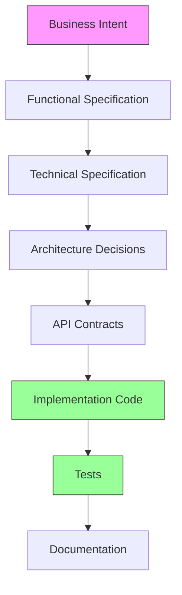
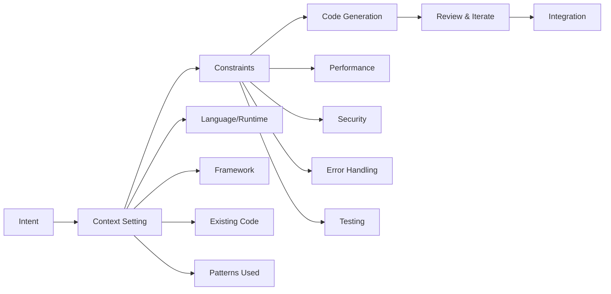
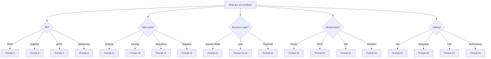

# Code Generation Prompts

## Why Code Generation Prompts Exist

Code generation has existed since the first compiler translated human-readable instructions into machine code. Every layer of abstraction — assembler, C, Python, TypeScript — is a form of code generation. AI-assisted code generation is the next layer: translating human intent (expressed in natural language) into working, production-grade code.

The fundamental problem is **specification ambiguity**. When a human says "build a user authentication system," that statement contains hundreds of implicit decisions: password hashing algorithm, session management strategy, token format, rate limiting, account lockout policy, and so on. Bad prompts produce bad code — not because the AI is incapable, but because the specification was incomplete.

These prompts solve the specification problem by encoding the decisions that experienced engineers make automatically into the prompt itself. Each prompt is a distillation of production experience, capturing edge cases, security concerns, performance requirements, and operational needs that a junior engineer might miss and that even a senior engineer might forget under time pressure.

::: tip Historical Context
The dream of generating code from specifications dates to the 1980s CASE (Computer-Aided Software Engineering) tools. They largely failed because natural language specifications were too ambiguous and the gap between specification and implementation was too large. Modern LLMs close that gap because they have been trained on millions of real codebases, understanding not just syntax but idioms, patterns, and best practices.
:::

## First Principles of Code Generation

Effective code generation requires understanding the **specification hierarchy**:



Each level adds specificity. A good code generation prompt operates at level C-E, providing enough specificity to generate unambiguous code while leaving implementation details (variable names, exact algorithms) to the AI.

### The Prompt Quality Equation

$$
\text{Code Quality} = f(\text{Prompt Specificity}, \text{Context Provided}, \text{Constraint Clarity})
$$

More formally, the probability of generating correct code:

$$
P(\text{correct}) = 1 - \prod_{i=1}^{n} P(\text{ambiguity}_i)
$$

Where each $P(\text{ambiguity}_i)$ represents the probability of misunderstanding a specific requirement. The more requirements you explicitly specify, the higher $P(\text{correct})$ becomes.

## Core Mechanics



### Prompt Template Structure

Every code generation prompt should include:

```
[ROLE]: What expertise the AI should bring
[CONTEXT]: System context, existing codebase patterns
[TASK]: Specific code to generate
[CONSTRAINTS]: Performance, security, style requirements
[OUTPUT FORMAT]: Code structure, file organization
[QUALITY GATES]: What "done" looks like
```

## Implementation — The Complete Prompt Library

### Category 1: API & Endpoint Generation (10 Prompts)

#### Prompt 1 — REST API Endpoint (Full CRUD)

```text
Generate a production-grade REST API for the [RESOURCE] resource.

TECH STACK: TypeScript, [Express/Fastify/NestJS], [Prisma/TypeORM/Drizzle]
DATABASE: [PostgreSQL/MySQL/MongoDB]

RESOURCE DEFINITION:
[Describe the resource fields, types, relationships]

REQUIREMENTS:
- Full CRUD operations (Create, Read, List, Update, Delete)
- Input validation using Zod schemas
- Proper HTTP status codes (201 for create, 204 for delete, etc.)
- Pagination for list endpoints (cursor-based, not offset)
- Filtering and sorting support
- Partial updates (PATCH) with field-level validation
- Soft delete with restore capability
- Optimistic concurrency control (version/ETag)
- Request/response DTOs (never expose database models directly)
- Structured error responses following RFC 7807

SECURITY:
- Authentication middleware (JWT Bearer token)
- Authorization checks (RBAC with roles: admin, editor, viewer)
- Rate limiting per endpoint (different limits for read vs write)
- Input sanitization (prevent XSS, SQL injection)

PERFORMANCE:
- Database query optimization (select only needed fields)
- Response compression
- ETag-based caching for GET requests
- Batch operations for bulk create/update/delete

ERROR HANDLING:
- Typed error hierarchy (NotFoundError, ValidationError, ConflictError, etc.)
- Error logging with request context
- Never expose stack traces to clients
- Idempotency key support for POST/PUT

OUTPUT:
1. Route definitions with OpenAPI JSDoc comments
2. Controller functions
3. Service layer (business logic)
4. Repository layer (database access)
5. Validation schemas (Zod)
6. Type definitions
7. Unit tests for service layer
8. Integration tests for API endpoints

Generate all files with proper imports and exports.
```

#### Prompt 2 — GraphQL Schema & Resolvers

```text
Generate a GraphQL API for the following domain:

DOMAIN: [Describe the domain and entities]

TECH STACK: TypeScript, Apollo Server v4, Prisma, PostgreSQL

SCHEMA REQUIREMENTS:
- Type definitions for all entities
- Input types for mutations (separate create/update inputs)
- Enum types where appropriate
- Custom scalars (DateTime, JSON, URL, EmailAddress)
- Interface types for shared fields (Node interface with id)
- Union types where applicable
- Pagination using Relay-style connections (edges, nodes, pageInfo)

QUERY REQUIREMENTS:
- Single entity by ID
- List with filtering, sorting, pagination
- Nested entity resolution with DataLoader (N+1 prevention)
- Full-text search where appropriate

MUTATION REQUIREMENTS:
- Create, update, delete operations
- Bulk operations
- Input validation with clear error messages
- Optimistic concurrency (version field)
- Return the modified entity in mutation response

SUBSCRIPTION REQUIREMENTS:
- Real-time updates for entity changes
- Filtered subscriptions (subscribe to specific entity IDs)
- Connection management (heartbeat, reconnection)

SECURITY:
- Field-level authorization using directives (@auth, @hasRole)
- Query complexity analysis and depth limiting
- Rate limiting per operation type
- Persisted queries for production

PERFORMANCE:
- DataLoader for all relationship fields
- Query cost analysis
- Response caching with cache control directives
- Automatic persisted queries (APQ)

OUTPUT:
1. SDL schema file
2. Resolver implementations
3. DataLoader factories
4. Custom scalar implementations
5. Auth directive implementation
6. Context type definition
7. Integration tests
```

#### Prompt 3 — gRPC Service Definition & Implementation

```text
Generate a gRPC service for [SERVICE_NAME]:

DOMAIN: [Describe the service responsibility]
LANGUAGE: Go (or TypeScript with @grpc/grpc-js)

PROTO FILE REQUIREMENTS:
- Service definition with all RPCs
- Message types with proper field numbers
- Enums for status/type fields
- Oneof for polymorphic fields
- Well-known types (Timestamp, Duration, FieldMask)
- Custom options for validation

RPC TYPES:
- Unary RPCs for simple request/response
- Server streaming for list/watch operations
- Client streaming for batch uploads
- Bidirectional streaming for real-time features

IMPLEMENTATION REQUIREMENTS:
- Interceptors for: logging, auth, metrics, error handling
- Deadline propagation
- Metadata handling (request ID, auth tokens)
- Health check service (grpc.health.v1)
- Reflection service for debugging
- Graceful shutdown

ERROR HANDLING:
- Proper gRPC status codes (NOT_FOUND, ALREADY_EXISTS, etc.)
- Rich error details using google.rpc.Status
- Error metadata for debugging
- Retry policies per RPC method

SECURITY:
- mTLS configuration
- Per-RPC authorization
- Rate limiting interceptor
- Request size limits

PERFORMANCE:
- Connection pooling configuration
- Keepalive settings
- Load balancing (round-robin vs pick-first)
- Compression (gzip)

OUTPUT:
1. Proto file(s)
2. Generated code (Go or TypeScript)
3. Server implementation
4. Client implementation with retry logic
5. Interceptor implementations
6. Integration tests
7. Buf configuration for linting
```

#### Prompt 4 — WebSocket Real-Time API

```text
Generate a WebSocket-based real-time API:

USE CASE: [Describe the real-time feature - chat, notifications, live updates, etc.]
TECH STACK: TypeScript, [ws/Socket.IO/uWebSockets.js], Redis (for pub/sub)

CONNECTION MANAGEMENT:
- Authentication during handshake (JWT in query params or first message)
- Connection lifecycle (connect, authenticate, subscribe, disconnect)
- Heartbeat/ping-pong with configurable intervals
- Automatic reconnection strategy (client-side)
- Connection metadata tracking (user ID, device, IP)
- Maximum connections per user limit

MESSAGE PROTOCOL:
- Typed message format: { type: string, payload: T, id: string, timestamp: number }
- Request-response pattern (with correlation IDs)
- Server-push pattern (subscriptions)
- Acknowledgment mechanism for critical messages
- Message ordering guarantees within a channel

ROOM/CHANNEL MANAGEMENT:
- Join/leave channels
- Channel authorization (who can join?)
- Channel-level message broadcasting
- Presence tracking (who is online in a channel?)
- Typing indicators

SCALING:
- Redis pub/sub for multi-instance support
- Sticky sessions or shared-nothing architecture
- Connection draining during deployments
- Horizontal scaling strategy

RELIABILITY:
- Message delivery guarantees (at-least-once for critical)
- Offline message queue
- Message deduplication
- Connection state recovery after reconnect
- Graceful degradation to polling

SECURITY:
- Origin validation
- Message size limits
- Rate limiting per connection
- XSS prevention in message content
- Binary message handling

OUTPUT:
1. WebSocket server implementation
2. Message type definitions
3. Connection manager
4. Room/channel manager
5. Redis pub/sub adapter
6. Client SDK (TypeScript)
7. Reconnection logic
8. Integration tests
```

#### Prompt 5 — Event-Driven API (Producer/Consumer)

```text
Generate an event-driven system with producers and consumers:

DOMAIN: [Describe the events and their business context]
TECH STACK: TypeScript, [Kafka/RabbitMQ/AWS SQS+SNS], [Avro/Protobuf/JSON Schema]

EVENT DEFINITIONS:
- Event naming convention: [domain].[entity].[action] (e.g., order.payment.completed)
- Event schema with all fields, types, and descriptions
- Event versioning strategy (schema registry)
- Event metadata: eventId, timestamp, source, correlationId, causationId

PRODUCER REQUIREMENTS:
- Transactional outbox pattern (guarantee event published if DB committed)
- Idempotent event publishing
- Event enrichment (add contextual data before publishing)
- Schema validation before publish
- Dead letter handling for publish failures
- Batch publishing for high-throughput scenarios

CONSUMER REQUIREMENTS:
- Idempotent processing (handle duplicate events)
- Ordering guarantees (partition key strategy)
- Error handling: retry with exponential backoff
- Dead letter queue for poison messages
- Consumer group management
- Graceful shutdown (finish in-flight before exit)
- Offset/acknowledgment management

OBSERVABILITY:
- Event flow tracing (correlation ID propagation)
- Consumer lag monitoring
- Processing time metrics
- Error rate tracking per event type
- DLQ depth alerting

TESTING:
- In-memory event bus for unit tests
- Contract testing for event schemas
- Integration tests with embedded broker
- Chaos testing helpers (simulate delays, failures)

OUTPUT:
1. Event type definitions (TypeScript interfaces + JSON Schema/Avro)
2. Producer implementation with outbox pattern
3. Consumer implementation with idempotency
4. Event router/dispatcher
5. Schema registry integration
6. Retry and DLQ handling
7. Monitoring hooks
8. Test utilities
9. Example producer and consumer
```

#### Prompt 6 — File Upload/Download API

```text
Generate a file upload and download system:

TECH STACK: TypeScript, [Express/Fastify], [S3/GCS/Azure Blob]
MAX FILE SIZE: [e.g., 100MB]
ALLOWED TYPES: [e.g., images, documents, videos]

UPLOAD REQUIREMENTS:
- Multipart upload for large files
- Resumable uploads (tus protocol or custom)
- Pre-signed URL generation for direct-to-storage upload
- File type validation (magic bytes, not just extension)
- File size validation
- Virus/malware scanning integration point
- Image processing pipeline (resize, thumbnail, optimize)
- Upload progress tracking
- Metadata extraction (EXIF, dimensions, duration)

DOWNLOAD REQUIREMENTS:
- Pre-signed URL generation with expiration
- Range requests for partial downloads (video streaming)
- Content-Disposition headers (inline vs download)
- CDN integration for public files
- Access control (who can download what?)
- Download tracking (analytics)

STORAGE:
- Storage abstraction layer (swap providers without code changes)
- Folder/path strategy (tenant/year/month/uuid.ext)
- Lifecycle policies (move to cold storage, auto-delete)
- Deduplication (content-hash based)

SECURITY:
- Authenticated uploads only
- File type whitelist enforcement
- Content-Type verification
- CORS configuration for browser uploads
- Signed URL expiration (short-lived)
- Anti-virus scanning before availability

OUTPUT:
1. Upload controller
2. Download controller
3. Storage abstraction layer (with S3 implementation)
4. File processing pipeline
5. Database models for file metadata
6. Pre-signed URL service
7. Tests
```

#### Prompt 7 — Webhook System

```text
Generate a webhook delivery system:

USE CASE: [Describe what events trigger webhooks and who consumes them]
TECH STACK: TypeScript, PostgreSQL, Redis (for queuing)

WEBHOOK REGISTRATION:
- CRUD API for webhook endpoints
- Event type subscription (subscribe to specific events)
- URL validation (must be HTTPS, must respond to verification)
- Secret key generation per webhook (for signature verification)
- Active/inactive toggle

DELIVERY ENGINE:
- Reliable delivery with retry (exponential backoff: 1s, 5s, 30s, 2m, 15m, 1h, 4h)
- Maximum retry count (configurable, default 10)
- HMAC-SHA256 request signing (X-Signature header)
- Delivery timeout (30 seconds max)
- Idempotency key per delivery attempt
- Rate limiting per webhook URL
- Concurrent delivery limits

PAYLOAD:
- Consistent payload structure across all event types
- Event type, timestamp, delivery attempt number
- Full event data (not just IDs)
- Request ID for tracking

MONITORING:
- Delivery success/failure tracking per webhook
- Automatic disabling after N consecutive failures
- Dashboard data: delivery rate, latency, error rate
- Alert on high failure rates

SECURITY:
- HMAC signature verification guide for consumers
- Webhook secret rotation support
- IP allowlisting option
- Replay attack prevention (timestamp validation)

OUTPUT:
1. Webhook registration API
2. Delivery engine (with retry logic)
3. Signature generation and verification utilities
4. Database schema (webhooks, deliveries, events)
5. Background job processor
6. Monitoring and alerting hooks
7. Consumer verification middleware (for webhook consumers)
8. API documentation with integration guide
```

#### Prompt 8 — Batch Processing API

```text
Generate a batch processing system:

USE CASE: [Describe the batch operation - data import, report generation, bulk updates]
TECH STACK: TypeScript, [BullMQ/Temporal/custom], PostgreSQL, Redis

BATCH JOB LIFECYCLE:
- Submit: Accept batch job with input data/parameters
- Validate: Pre-validate input before processing
- Queue: Add to processing queue with priority
- Process: Execute in chunks with progress tracking
- Complete/Fail: Final status with results/errors

API ENDPOINTS:
- POST /batches — Submit new batch job
- GET /batches/:id — Get job status and progress
- GET /batches/:id/results — Get results (paginated)
- GET /batches/:id/errors — Get error details
- DELETE /batches/:id — Cancel a running batch
- GET /batches — List jobs with status filter

PROCESSING REQUIREMENTS:
- Chunked processing (configurable chunk size)
- Progress tracking (percentage, items processed/total)
- Partial failure handling (continue on individual item failure)
- Checkpoint/resume capability (survive process restart)
- Concurrency control (max concurrent batches, max parallel chunks)
- Memory management (streaming for large datasets)
- Timeout per item and per batch

NOTIFICATION:
- Webhook callback on completion/failure
- Progress update events (via WebSocket or SSE)
- Email notification option

OUTPUT:
1. Batch API controller
2. Job queue implementation
3. Chunk processor with error handling
4. Progress tracker
5. Result aggregator
6. Database schema
7. Background worker
8. Tests
```

#### Prompt 9 — Search API

```text
Generate a search API:

DOMAIN: [Describe what is being searched and the data model]
TECH STACK: TypeScript, [Elasticsearch/Typesense/Meilisearch], PostgreSQL

SEARCH CAPABILITIES:
- Full-text search with relevance scoring
- Fuzzy matching for typo tolerance
- Faceted search (filters with counts)
- Autocomplete/typeahead suggestions
- Highlighting of matched terms
- Synonym support
- Multi-language support (stemming, stop words)
- Geo-spatial search (if applicable)
- Range filters (price, date, etc.)

INDEX MANAGEMENT:
- Index creation with proper mappings/schema
- Real-time indexing (on data change)
- Bulk indexing for initial data load
- Index aliasing for zero-downtime reindexing
- Index lifecycle management

QUERY DSL:
- Simple query string for user input
- Advanced query builder for programmatic use
- Aggregations for analytics/facets
- Sorting (relevance, date, custom fields)
- Pagination (cursor-based for deep pagination)

PERFORMANCE:
- Query caching strategy
- Index optimization (segment merging)
- Circuit breaker for expensive queries
- Query timeout enforcement
- Result size limits

SECURITY:
- Field-level security (don't expose internal fields)
- Query rate limiting
- Search log privacy (PII in search terms)
- Tenant isolation in multi-tenant setup

OUTPUT:
1. Search API controller
2. Search service with query builder
3. Index management service
4. Real-time sync service (DB to search engine)
5. Autocomplete endpoint
6. Search analytics (popular queries, no-results queries)
7. Type definitions
8. Tests
```

#### Prompt 10 — API Gateway Configuration

```text
Generate an API Gateway configuration:

SERVICES: [List of backend services with their endpoints]
TECH: [Kong/AWS API Gateway/custom Node.js proxy]

ROUTING:
- Path-based routing to backend services
- Header-based routing (version, tenant, feature flags)
- Request/response transformation
- URL rewriting
- Method override support

MIDDLEWARE PIPELINE:
1. Rate limiting (token bucket per API key)
2. Authentication (JWT validation)
3. Authorization (scope/permission check)
4. Request validation (JSON Schema)
5. Request logging (structured, with redaction)
6. CORS handling
7. Request ID generation
8. Compression

RESILIENCE:
- Circuit breaker per backend service
- Timeout configuration per route
- Retry with backoff for 5xx responses
- Health check endpoints per backend
- Fallback responses for circuit-open state

TRAFFIC MANAGEMENT:
- Canary routing (percentage-based)
- A/B testing support (header-based)
- Blue-green deployment support
- Request shadowing (mirror to new version)

OBSERVABILITY:
- Access logs with timing breakdown
- Metrics per route (latency, error rate, throughput)
- Distributed trace context propagation
- Real-time dashboard data

OUTPUT:
1. Gateway configuration
2. Middleware implementations
3. Route definitions
4. Health check service
5. Admin API for dynamic configuration
6. Monitoring dashboard config
7. Load test script
```

### Category 2: Data Layer Generation (10 Prompts)

#### Prompt 11 — Database Schema & Migration

```text
Generate a database schema and migration system:

DOMAIN: [Describe the domain entities and relationships]
DATABASE: PostgreSQL 16
ORM: [Prisma/Drizzle/TypeORM/raw SQL]

SCHEMA REQUIREMENTS:
- Properly normalized tables (3NF minimum)
- Appropriate data types (no VARCHAR(255) everywhere)
- UUID primary keys (v7 for time-sortability)
- Created/updated/deleted timestamps on all tables
- Version column for optimistic locking
- Proper indexes for all query patterns
- Foreign key constraints with appropriate ON DELETE
- Check constraints for domain invariants
- Partial indexes for common filtered queries
- GIN indexes for full-text search columns
- JSONB columns only where truly schema-less

QUERY PATTERNS (define the access patterns):
[List the main queries the application will run]

MIGRATION SYSTEM:
- Forward-only migrations (no down migrations in production)
- Idempotent migrations (safe to re-run)
- Data migrations separate from schema migrations
- Zero-downtime migration strategy
  - Phase 1: Add new column (nullable)
  - Phase 2: Backfill data
  - Phase 3: Add NOT NULL constraint
  - Phase 4: Remove old column (next release)

SEED DATA:
- Development seed data (realistic but not production data)
- Required reference data (countries, currencies, etc.)

OUTPUT:
1. Schema definition (Prisma schema or SQL DDL)
2. Migration files (ordered, timestamped)
3. Seed data script
4. Index analysis (query -> index mapping)
5. Repository layer with typed queries
6. Database connection configuration
7. Migration runner script
```

#### Prompt 12 — Caching Layer

```text
Generate a caching layer:

TECH STACK: TypeScript, Redis 7, [ioredis/node-redis]
CACHED DATA: [Describe what data is cached and access patterns]

CACHE STRATEGY:
- Cache-aside (lazy loading) for most read data
- Write-through for critical consistency data
- Write-behind for high-write-throughput data
- Read-through with automatic population

CACHE KEY DESIGN:
- Namespace: [app]:[entity]:[id]
- Version prefix for cache invalidation
- Tenant isolation in keys (multi-tenant)
- Consistent hashing for key distribution

TTL STRATEGY:
| Data Type | TTL | Reason |
|-----------|-----|--------|
| User profile | 5 min | Changes infrequently |
| Product listing | 1 min | Price changes |
| Session | 24 hr | Session duration |
| Rate limit counter | 1 min | Window size |

INVALIDATION:
- Event-based invalidation (on write, publish invalidation event)
- Pattern-based invalidation (delete all keys matching pattern)
- Tag-based invalidation (tag keys, invalidate by tag)
- Cache stampede prevention (lock-based, probabilistic early expiry)

SERIALIZATION:
- MessagePack for complex objects (faster than JSON)
- Raw strings for simple values
- Compression for large values (>1KB)
- Schema versioning for cached objects

RESILIENCE:
- Graceful degradation when Redis is down
- Circuit breaker on Redis connection
- Local in-memory L1 cache (LRU, 1000 items)
- Fallback to database on cache miss or failure

MONITORING:
- Hit/miss ratio tracking
- Cache size monitoring
- Eviction rate tracking
- Slow operation alerting (>10ms for cache ops)

OUTPUT:
1. Cache service with typed methods
2. Cache decorator/wrapper for repository methods
3. Invalidation event handlers
4. Cache warming script
5. Redis connection manager with failover
6. Cache health check endpoint
7. Monitoring utilities
8. Tests (with Redis mock)
```

#### Prompt 13 — Database Repository Pattern

```text
Generate a type-safe repository pattern implementation:

TECH STACK: TypeScript, PostgreSQL, [Prisma/Drizzle]
ENTITIES: [List entities with their fields and relationships]

REPOSITORY INTERFACE:
- Generic base repository with standard CRUD operations
- Typed query builder for complex queries
- Transaction support (unit of work pattern)
- Pagination (cursor-based and offset-based)
- Sorting with type-safe field references
- Filtering with type-safe predicates

BASE REPOSITORY METHODS:
```typescript
interface Repository<T, CreateDTO, UpdateDTO> {
  findById(id: string): Promise<T | null>;
  findByIds(ids: string[]): Promise<T[]>;
  findOne(filter: FilterQuery<T>): Promise<T | null>;
  findMany(query: QueryOptions<T>): Promise<PaginatedResult<T>>;
  create(data: CreateDTO): Promise<T>;
  createMany(data: CreateDTO[]): Promise<T[]>;
  update(id: string, data: UpdateDTO): Promise<T>;
  updateMany(filter: FilterQuery<T>, data: UpdateDTO): Promise<number>;
  delete(id: string): Promise<void>;
  deleteMany(filter: FilterQuery<T>): Promise<number>;
  count(filter?: FilterQuery<T>): Promise<number>;
  exists(filter: FilterQuery<T>): Promise<boolean>;
  transaction<R>(fn: (tx: TransactionContext) => Promise<R>): Promise<R>;
}
```

ADVANCED FEATURES:
- Soft delete with automatic filtering
- Audit logging (who changed what, when)
- Optimistic concurrency control
- Specification pattern for complex business rules
- Eager/lazy loading configuration
- Query result caching integration

TESTING:
- Repository contract tests (test interface compliance)
- In-memory repository for unit testing
- Test fixtures and factories

OUTPUT:
1. Base repository abstract class
2. Concrete repository for each entity
3. Query builder utilities
4. Transaction manager
5. In-memory repository for testing
6. Type definitions
7. Tests
```

#### Prompt 14 — Data Validation Layer

```text
Generate a comprehensive data validation layer:

TECH STACK: TypeScript, Zod
DOMAIN: [Describe the domain and data models]

VALIDATION REQUIREMENTS:
- Input validation (API requests)
- Domain validation (business rules)
- Output validation (API responses — trust but verify)
- Cross-field validation (field A depends on field B)
- Async validation (check uniqueness against database)

SCHEMA DEFINITIONS:
For each entity, generate:
1. Base schema (all fields with types and constraints)
2. Create schema (required fields for creation)
3. Update schema (all optional, at least one required)
4. Patch schema (individual field updates)
5. Query/filter schema (valid filter parameters)
6. Response schema (what the API returns)

VALIDATION RULES:
- String: min/max length, regex patterns, trim, lowercase
- Numbers: min/max, integer vs decimal, positive
- Dates: valid range, not in past/future, timezone handling
- Email: RFC 5322 compliant, disposable email detection
- URL: protocol whitelist, domain validation
- Phone: E.164 format validation
- Currency: decimal precision, valid currency codes
- Custom business rules (age >= 18, etc.)

ERROR FORMATTING:
- Structured error output with field path
- Human-readable error messages
- Machine-readable error codes
- i18n-ready error messages
- Nested object error paths (user.address.zipCode)

SECURITY:
- Strip unknown fields (prevent mass assignment)
- Maximum string lengths (prevent memory attacks)
- Maximum array lengths
- Maximum object depth
- HTML/script sanitization

OUTPUT:
1. Zod schemas for all entities
2. Validation middleware for Express/Fastify
3. Custom validators (async, cross-field)
4. Error formatter
5. Type inference utilities (z.infer)
6. Validation test suite
7. Schema documentation generator
```

#### Prompt 15 — Data Migration Script

```text
Generate a data migration for the following scenario:

FROM: [Source schema/format description]
TO: [Target schema/format description]
DATA VOLUME: [Approximate row count]
DOWNTIME TOLERANCE: [Zero-downtime / maintenance window / offline OK]

MIGRATION STRATEGY:
- Streaming/chunked processing (not load-all-in-memory)
- Checkpoint/resume capability
- Dry run mode (validate without writing)
- Verification/reconciliation step
- Rollback plan

DATA TRANSFORMATION RULES:
[List specific transformation rules]
- Field renames
- Type conversions
- Data enrichment
- Default values for new required fields
- Data cleanup/normalization

ERROR HANDLING:
- Log failed records with reason
- Continue on individual record failure
- Summary report at completion
- Error threshold (abort if >5% fail)

VALIDATION:
- Pre-migration validation (source data quality check)
- Post-migration validation (target data integrity check)
- Row count reconciliation
- Checksum comparison where applicable
- Referential integrity verification

PERFORMANCE:
- Batch size optimization
- Index management (disable during bulk insert, rebuild after)
- Transaction sizing (not one giant transaction)
- Progress reporting (ETA calculation)
- Resource throttling (don't overwhelm the database)

OUTPUT:
1. Migration script with checkpoint/resume
2. Validation script (pre and post)
3. Rollback script
4. Configuration (batch size, error threshold, etc.)
5. Monitoring queries (progress, errors)
6. Runbook (step-by-step execution guide)
```

#### Prompt 16 — ETL Pipeline

```text
Generate an ETL (Extract, Transform, Load) pipeline:

SOURCE: [Describe data source — API, database, file, stream]
DESTINATION: [Describe target — data warehouse, database, search engine]
SCHEDULE: [Real-time / hourly / daily / weekly]
TECH STACK: TypeScript/Go, [Node streams / Go channels]

EXTRACT PHASE:
- Connection management and retry logic
- Incremental extraction (watermark-based, CDC)
- Full extraction fallback
- Source schema detection
- Data type mapping from source
- Rate limiting against source

TRANSFORM PHASE:
- Data cleansing (nulls, duplicates, format normalization)
- Type casting and validation
- Business rule application
- Aggregation/denormalization
- Derived field computation
- PII detection and masking
- Schema evolution handling

LOAD PHASE:
- Upsert strategy (insert or update)
- Bulk loading optimization
- Schema management at destination
- Partition management (if applicable)
- Index management during load

RELIABILITY:
- Exactly-once semantics (deduplication)
- Checkpoint/restart capability
- Dead letter handling for transform failures
- Backpressure management
- Resource monitoring (memory, CPU)

MONITORING:
- Pipeline execution metrics (duration, row counts, error rates)
- Data quality metrics (null rates, outlier detection)
- SLA compliance tracking
- Alert on failures or anomalies

OUTPUT:
1. Pipeline orchestrator
2. Extractor implementations (per source type)
3. Transformer chain
4. Loader implementations (per destination type)
5. Pipeline configuration
6. Data quality checks
7. Monitoring dashboard definition
8. Tests with sample data
```

#### Prompt 17 — Queue/Worker System

```text
Generate a job queue and worker system:

USE CASE: [Describe background jobs — email sending, image processing, etc.]
TECH STACK: TypeScript, [BullMQ/Agenda/custom], Redis, PostgreSQL

JOB DEFINITION:
- Job types with typed payloads
- Priority levels (critical, high, normal, low)
- Scheduled jobs (cron expressions)
- Delayed jobs (run after X seconds)
- Recurring jobs with deduplication
- Job dependencies (job B runs after job A completes)

WORKER REQUIREMENTS:
- Concurrency control per job type
- Job timeout enforcement
- Graceful shutdown (finish current job before exit)
- Sandboxed execution (job crash doesn't kill worker)
- Memory limit per job
- CPU throttling for low-priority jobs

RELIABILITY:
- At-least-once processing guarantee
- Job deduplication (idempotency key)
- Retry strategy per job type (max retries, backoff)
- Dead letter queue for permanently failed jobs
- Job result storage with TTL
- Stale job detection and recovery

MONITORING:
- Queue depth per job type
- Processing rate and latency
- Worker utilization
- Job failure rate
- Stalled job detection
- Dashboard API endpoints

SCALING:
- Multiple worker instances
- Auto-scaling based on queue depth
- Job routing to specific workers
- Rate limiting per job type

OUTPUT:
1. Job type definitions with validation
2. Queue service (enqueue, schedule, cancel)
3. Worker implementation
4. Job handlers per job type
5. Retry and DLQ logic
6. Monitoring API
7. Admin API (pause, resume, drain, retry failed)
8. Tests
```

#### Prompt 18 — State Machine Implementation

```text
Generate a state machine for:

DOMAIN: [Describe the entity and its lifecycle — order, application, ticket, etc.]
TECH STACK: TypeScript, [XState/custom], PostgreSQL

STATE DEFINITION:
[List all states and valid transitions]
Example:
- draft -> submitted -> under_review -> approved -> active -> completed
- under_review -> rejected -> draft (revision)
- active -> suspended -> active (resumption)
- any -> cancelled (terminal)

REQUIREMENTS:
- Type-safe state and event definitions
- Guard conditions (can only transition if condition met)
- Side effects on transition (send email, create audit log, etc.)
- Transition history (audit trail)
- Time-based transitions (auto-expire after N days)
- Hierarchical states (nested sub-states)
- Parallel states (if applicable)

PERSISTENCE:
- Current state stored in database
- Transition history table
- Optimistic locking on transitions
- Idempotent transition application

VALIDATION:
- Validate transition is legal from current state
- Validate guard conditions
- Validate required data for target state
- Return clear error messages for invalid transitions

API:
- GET /[entity]/:id/state — Current state with available transitions
- POST /[entity]/:id/transitions — Execute transition
- GET /[entity]/:id/transitions — Transition history

VISUALIZATION:
- Generate Mermaid state diagram from definition
- State report (count of entities in each state)

OUTPUT:
1. State machine definition
2. Transition engine
3. Guard conditions
4. Side effect handlers
5. Database schema
6. API endpoints
7. Visualization generator
8. Tests for every valid and invalid transition
```

#### Prompt 19 — Audit Log System

```text
Generate an immutable audit log system:

TECH STACK: TypeScript, PostgreSQL (append-only table)
COMPLIANCE: [SOC2/HIPAA/GDPR requirements]

AUDIT EVENTS:
- Entity CRUD operations (who changed what, when)
- Authentication events (login, logout, failed attempts)
- Authorization events (access granted, denied)
- Data access events (who viewed sensitive data)
- Configuration changes
- Administrative actions

SCHEMA:
- Event ID (UUID v7, sortable by time)
- Timestamp (microsecond precision, UTC)
- Actor (user ID, service account, system)
- Action (verb: created, updated, deleted, accessed, etc.)
- Resource (type and ID of affected entity)
- Changes (before/after diff for updates)
- Context (IP address, user agent, request ID, session ID)
- Metadata (additional context specific to event type)

REQUIREMENTS:
- Append-only (no updates, no deletes)
- Tamper detection (hash chain or Merkle tree)
- Efficient querying by: actor, resource, time range, action
- Retention policy with archival to cold storage
- PII handling (redact or pseudonymize in logs)
- High-write throughput (buffered writes)

QUERY API:
- GET /audit-logs?actor=&resource=&action=&from=&to=
- Pagination with cursor
- Export (CSV, JSON)
- Aggregation (actions per user, changes per resource)

INTEGRITY:
- Each log entry includes hash of previous entry
- Periodic integrity verification job
- Alert on integrity violation

OUTPUT:
1. Audit log schema (append-only table with integrity chain)
2. Audit log service (write, query)
3. Middleware to auto-capture CRUD operations
4. Change diff calculator
5. Query API endpoints
6. Integrity verification job
7. Archival/retention job
8. Tests
```

#### Prompt 20 — Multi-Tenant Data Layer

```text
Generate a multi-tenant data architecture:

ISOLATION MODEL: [Shared database + row-level / schema-per-tenant / DB-per-tenant]
TECH STACK: TypeScript, PostgreSQL, Prisma
TENANT SCALE: [10-100 / 100-1000 / 1000+ tenants]

ROW-LEVEL ISOLATION:
- Tenant ID column on all tenant-scoped tables
- Row-Level Security (RLS) policies in PostgreSQL
- Automatic tenant context injection (middleware)
- Prevention of cross-tenant data access
- Tenant-aware unique constraints

SCHEMA:
- Tenant management tables (tenants, plans, features)
- Tenant-scoped tables (all business data)
- Shared tables (reference data, system config)
- Clear separation between shared and tenant data

QUERY LAYER:
- Automatic tenant filtering (developer can't forget it)
- Tenant context propagation through the call stack
- Cross-tenant queries for admin operations (explicit opt-in)
- Tenant-scoped database connection settings

PERFORMANCE:
- Tenant-aware caching (cache key includes tenant ID)
- Noisy neighbor prevention (per-tenant rate limiting)
- Tenant-specific index strategies
- Query performance monitoring per tenant

ONBOARDING/OFFBOARDING:
- Tenant provisioning workflow
- Data seeding for new tenants
- Tenant data export (GDPR portability)
- Tenant data deletion (GDPR erasure)
- Tenant data migration between isolation levels

OUTPUT:
1. Tenant middleware (extract tenant from request)
2. RLS policy definitions
3. Tenant-aware repository base class
4. Tenant management API
5. Tenant provisioning service
6. Data export/deletion utilities
7. Tests verifying tenant isolation
```

### Category 3: Business Logic & Domain (10 Prompts)

#### Prompt 21 — Domain Model with DDD

```text
Generate a domain model using Domain-Driven Design:

DOMAIN: [Describe the business domain in detail]
BOUNDED CONTEXT: [The specific subdomain]
TECH STACK: TypeScript

TACTICAL PATTERNS:
1. **Entities**: Objects with identity and lifecycle
   - Encapsulated business rules
   - Validation in constructor (always valid)
   - Rich behavior methods (not anemic data bags)

2. **Value Objects**: Immutable, compared by value
   - Money(amount, currency)
   - EmailAddress(value)
   - DateRange(start, end)

3. **Aggregates**: Consistency boundaries
   - One aggregate root per aggregate
   - References between aggregates by ID only
   - Invariant enforcement in aggregate root

4. **Domain Events**: Things that happened
   - Past tense naming
   - Immutable
   - Contain all necessary context

5. **Domain Services**: Logic that doesn't belong to one entity
   - Stateless
   - Named after the operation (TransferMoneyService)

6. **Repositories**: Persistence abstraction
   - One per aggregate
   - Return full aggregates

7. **Factories**: Complex object creation
   - Encapsulate creation logic
   - Ensure invariants on creation

IMPLEMENTATION RULES:
- No framework dependencies in domain layer
- No database/ORM types in domain entities
- Domain layer depends on nothing
- Application layer orchestrates domain objects
- Infrastructure layer implements interfaces defined by domain

OUTPUT:
1. Entity classes with business logic
2. Value object classes (immutable, with equality)
3. Aggregate roots with invariant enforcement
4. Domain event definitions
5. Domain service implementations
6. Repository interfaces (defined in domain)
7. Factory implementations
8. Unit tests for all business rules
```

#### Prompt 22 — Authentication System

```text
Generate a complete authentication system:

TECH STACK: TypeScript, [Express/Fastify/NestJS], PostgreSQL, Redis
AUTH METHODS: [Email/Password, OAuth2 (Google, GitHub), Magic Link, TOTP 2FA]

EMAIL/PASSWORD:
- Registration with email verification
- Password hashing (argon2id, not bcrypt)
- Password strength validation (zxcvbn or custom)
- Secure password reset flow (time-limited token)
- Account lockout after failed attempts (5 attempts, 15 min lockout)

JWT TOKEN MANAGEMENT:
- Access token (short-lived: 15 minutes)
- Refresh token (long-lived: 7 days, stored in DB)
- Token rotation on refresh (invalidate old refresh token)
- Token revocation (logout, password change)
- JWT payload: { sub, email, roles, permissions, iat, exp }

SESSION MANAGEMENT:
- Active session tracking (device, IP, last activity)
- Session listing for user (see all active sessions)
- Remote session revocation
- Concurrent session limits (optional)

OAUTH2 INTEGRATION:
- Authorization code flow with PKCE
- Account linking (connect social to existing account)
- Profile sync from OAuth provider
- Handle: email conflict, unverified email from provider

TWO-FACTOR AUTHENTICATION:
- TOTP setup with QR code generation
- Backup codes (10 single-use codes)
- 2FA enforcement for sensitive operations
- Recovery flow when 2FA device is lost

SECURITY:
- Timing-safe comparison for tokens
- CSRF protection
- Secure cookie settings (httpOnly, secure, sameSite)
- Login throttling (per-IP and per-account)
- Suspicious activity detection (new device, new location)

OUTPUT:
1. Auth controller (all endpoints)
2. Auth service (business logic)
3. Token service (JWT creation, validation, refresh)
4. Password service (hash, verify, strength check)
5. OAuth2 service (provider integration)
6. 2FA service (TOTP, backup codes)
7. Database schema (users, sessions, refresh_tokens)
8. Auth middleware
9. Security utilities
10. Tests
```

#### Prompt 23 — Authorization System (RBAC/ABAC)

```text
Generate an authorization system:

MODEL: [RBAC / ABAC / ReBAC / hybrid]
TECH STACK: TypeScript, PostgreSQL, Redis (for caching)

RBAC COMPONENTS:
- Roles: [admin, manager, editor, viewer, custom]
- Permissions: resource.action (e.g., posts.create, users.delete)
- Role-permission mapping (many-to-many)
- User-role assignment (per-tenant in multi-tenant)
- Role hierarchy (admin inherits all manager permissions)
- Permission grouping (permission sets for common bundles)

ABAC COMPONENTS (if applicable):
- Attribute-based policies
- Subject attributes (role, department, clearance level)
- Resource attributes (classification, owner, status)
- Environment attributes (time, IP, location)
- Policy evaluation engine

ENFORCEMENT:
- Middleware-level enforcement (route-based)
- Method-level enforcement (decorators/annotations)
- Field-level enforcement (hide sensitive fields)
- Data-level enforcement (row-level filtering)

API:
- Assign/revoke roles to users
- Create/update/delete custom roles
- List permissions for a role
- Check user has permission (optimized for hot path)
- List all permissions for current user
- Audit log for permission changes

CACHING:
- Cache permission sets per user (invalidate on role change)
- TTL-based cache refresh
- Event-based cache invalidation

PERFORMANCE:
- Permission check must be < 1ms (from cache)
- Bitmap-based permission storage for fast lookups
- Bloom filter for quick negative checks

OUTPUT:
1. Permission and role type definitions
2. Authorization middleware
3. Authorization decorator for methods
4. Policy engine (for ABAC)
5. Permission caching service
6. Admin API for role/permission management
7. Database schema
8. Tests (every permission combination)
```

#### Prompt 24 — Payment Processing Integration

```text
Generate a payment processing integration:

PROVIDER: [Stripe/Braintree/Adyen/custom]
TECH STACK: TypeScript, PostgreSQL
PAYMENT METHODS: [Cards, ACH, Wire, Wallets]

CHECKOUT FLOW:
- Payment intent creation
- Client-side tokenization (never handle raw card data)
- Server-side payment confirmation
- 3D Secure / SCA handling
- Idempotency for all payment operations
- Currency conversion handling

PAYMENT OPERATIONS:
- Single payment (one-time charge)
- Subscription payments (recurring)
- Split payments (marketplace, multiple recipients)
- Refunds (full and partial)
- Payment holds and captures (authorize then capture)
- Payment method management (add, remove, set default)

DATA MODEL:
- Payments table (with idempotency key, status, provider reference)
- Payment methods table (tokenized references only)
- Transactions table (every financial movement)
- Ledger table (double-entry accounting)

WEBHOOK HANDLING:
- Webhook signature verification
- Idempotent webhook processing
- Event type handling (payment_succeeded, failed, refunded, disputed)
- Reconciliation between webhooks and API calls

ERROR HANDLING:
- Declined payment handling (insufficient funds, expired card)
- Network failure during payment (unknown state handling)
- Duplicate payment prevention
- Partial failure in split payments

COMPLIANCE:
- PCI-DSS scope minimization
- Transaction logging for audit
- Receipts and invoices
- Tax calculation integration point

OUTPUT:
1. Payment service
2. Checkout controller
3. Webhook handler
4. Payment method manager
5. Subscription manager
6. Refund service
7. Database schema (payments, transactions, ledger)
8. Reconciliation utilities
9. Tests (with mock provider)
```

#### Prompt 25 — Notification System

```text
Generate a multi-channel notification system:

CHANNELS: [Email, SMS, Push (iOS/Android/Web), In-App, Slack/Teams]
TECH STACK: TypeScript, PostgreSQL, Redis, BullMQ

NOTIFICATION LIFECYCLE:
- Trigger: Event occurs that requires notification
- Template: Select and render template with data
- Route: Determine channels based on user preferences
- Deliver: Send via appropriate channel provider
- Track: Record delivery status and engagement

TEMPLATE SYSTEM:
- Template storage (database, version controlled)
- Variable interpolation (Handlebars/Liquid)
- Multi-language support (i18n)
- Template preview and testing
- Template versioning

CHANNEL ROUTING:
- User notification preferences (per notification type per channel)
- Channel priority and fallback (try push, fallback to email)
- Quiet hours enforcement
- Frequency capping (max N notifications per hour)
- Batching/digest (collect multiple and send as one)

DELIVERY:
- Provider abstraction per channel
- Retry with exponential backoff
- Provider failover (if SendGrid fails, try SES)
- Rate limiting per provider
- Bulk sending optimization

TRACKING:
- Delivery status (sent, delivered, failed, bounced)
- Engagement tracking (opened, clicked) for email
- Read status for in-app notifications
- Unsubscribe handling

API:
- POST /notifications/send — Send notification
- GET /notifications — User's notification inbox
- PATCH /notifications/:id/read — Mark as read
- PUT /notifications/preferences — Update preferences
- GET /notifications/preferences — Get preferences

OUTPUT:
1. Notification service (orchestrator)
2. Template engine
3. Channel providers (email, SMS, push, in-app)
4. User preference service
5. Delivery tracker
6. Queue workers per channel
7. API endpoints
8. Database schema
9. Tests
```

#### Prompt 26 — Rate Limiter

```text
Generate a production-grade rate limiter:

TECH STACK: TypeScript, Redis
ALGORITHMS: Token bucket, Sliding window, Fixed window

RATE LIMIT RULES:
- Per API key / user / IP
- Per endpoint (different limits for different routes)
- Global rate limit (across all endpoints)
- Tiered limits (free: 100/hr, pro: 10000/hr, enterprise: unlimited)

IMPLEMENTATION:
1. **Token Bucket** (for burst-friendly limits):
   - Configurable bucket size and refill rate
   - Atomic token consumption
   - Token return on request failure

2. **Sliding Window Log** (for precise rate limiting):
   - Per-second precision
   - Memory-efficient sorted set implementation
   - Automatic cleanup of old entries

3. **Fixed Window Counter** (for simple high-throughput):
   - Counter per window
   - Handle window boundaries correctly

RESPONSE HEADERS:
- X-RateLimit-Limit: Maximum requests in window
- X-RateLimit-Remaining: Requests remaining
- X-RateLimit-Reset: Timestamp when limit resets
- Retry-After: Seconds until next request allowed (on 429)

DISTRIBUTED:
- Redis-based for multi-instance consistency
- Lua scripts for atomic operations
- Fallback behavior when Redis is unavailable
- Approximate counting for ultra-high throughput

SECURITY:
- Prevent rate limit bypass via header manipulation
- IP spoofing resistance
- Account-level limits (not just IP)
- DDoS protection integration

OUTPUT:
1. Rate limiter core (multiple algorithms)
2. Express/Fastify middleware
3. Redis Lua scripts for atomicity
4. Configuration system (per-route, per-tier)
5. Rate limit response handler
6. Dashboard data API
7. Tests
```

#### Prompt 27 — Feature Flag System

```text
Generate a feature flag system:

TECH STACK: TypeScript, PostgreSQL, Redis
EVALUATION CONTEXT: user ID, email, role, plan, location, custom attributes

FLAG TYPES:
1. **Boolean**: Simple on/off
2. **Percentage**: Gradual rollout (0-100%)
3. **User Segment**: Targeting specific user groups
4. **Multivariate**: Multiple variants (A/B/C testing)
5. **Time-based**: Active during specific time windows

TARGETING RULES:
- User ID inclusion/exclusion lists
- Attribute matching (role == 'admin', plan == 'enterprise')
- Percentage-based (consistent hashing for sticky assignment)
- Environment-based (dev/staging/production)
- Combinable rules (AND/OR logic)

EVALUATION:
- Fast evaluation (< 1ms from cache)
- Consistent results (same user always gets same variant)
- Default value when flag not found
- Type-safe flag access

API:
- CRUD for feature flags
- Bulk evaluation for client-side SDK
- Flag history and change audit
- Flag usage tracking (which flags are evaluated, never evaluated)

SDK:
- Server-side SDK (TypeScript)
- React SDK (useFeatureFlag hook)
- Local evaluation (no network call per check)
- Polling for flag updates
- Event-driven updates (SSE/WebSocket)

LIFECYCLE:
- Flag creation with description and owner
- Temporary vs permanent flag tracking
- Stale flag detection (created > 30 days, never fully rolled out)
- Flag removal checklist

OUTPUT:
1. Flag evaluation engine
2. Targeting rule engine
3. Admin API (CRUD, targeting, rollout)
4. Server SDK
5. React SDK
6. Database schema
7. Cache layer
8. Tests
```

#### Prompt 28 — Error Handling Framework

```text
Generate a comprehensive error handling framework:

TECH STACK: TypeScript, [Express/Fastify/NestJS]

ERROR HIERARCHY:
```typescript
// Base error class
abstract class AppError extends Error {
  abstract readonly statusCode: number;
  abstract readonly code: string;
  abstract readonly isOperational: boolean;
}
```

ERROR TYPES:
- ValidationError (400) — Invalid input
- AuthenticationError (401) — Not authenticated
- AuthorizationError (403) — Not authorized
- NotFoundError (404) — Resource not found
- ConflictError (409) — State conflict
- RateLimitError (429) — Too many requests
- InternalError (500) — Unexpected error
- ExternalServiceError (502) — Upstream failure
- ServiceUnavailableError (503) — Temporarily unavailable

FEATURES:
- Error wrapping (preserve original error as cause)
- Error context (add metadata without losing stack)
- Error serialization (to API response, to log)
- Error correlation (tie errors to request IDs)
- Operational vs programmer errors (handle differently)

API RESPONSE FORMAT (RFC 7807):
```json
{
  "type": "https://api.example.com/errors/validation",
  "title": "Validation Error",
  "status": 400,
  "detail": "The request body contains invalid fields",
  "instance": "/api/users/123",
  "errors": [
    {
      "field": "email",
      "code": "INVALID_FORMAT",
      "message": "Must be a valid email address"
    }
  ],
  "traceId": "abc-123"
}
```

ERROR HANDLING MIDDLEWARE:
- Catch all unhandled errors
- Log with appropriate severity
- Never expose stack traces in production
- Sanitize error messages (no SQL, no internal paths)
- Map known errors to proper HTTP responses
- Handle async errors (unhandled promise rejections)

MONITORING:
- Error rate tracking by type
- Error grouping for similar errors
- Alert on new error types
- Error budget tracking

OUTPUT:
1. Error class hierarchy
2. Error factory functions
3. Error handling middleware
4. Error logging utilities
5. Error serialization (to API, to log)
6. Error monitoring hooks
7. Tests for every error type
```

#### Prompt 29 — Configuration Management System

```text
Generate a configuration management system:

TECH STACK: TypeScript
SOURCES: Environment variables, .env files, config files, remote config

REQUIREMENTS:
- Type-safe configuration access
- Environment-specific overrides (dev/staging/production)
- Validation on startup (fail fast on invalid config)
- Secret management integration (AWS Secrets Manager, Vault)
- Hot reload for non-sensitive configuration
- Default values with documentation

SCHEMA:
```typescript
// Define configuration schema with validation
const configSchema = {
  server: {
    port: { type: 'number', default: 3000, env: 'PORT' },
    host: { type: 'string', default: '0.0.0.0', env: 'HOST' },
    shutdownTimeout: { type: 'number', default: 30000, env: 'SHUTDOWN_TIMEOUT_MS' },
  },
  database: {
    url: { type: 'string', required: true, env: 'DATABASE_URL', secret: true },
    poolSize: { type: 'number', default: 20, env: 'DB_POOL_SIZE' },
    ssl: { type: 'boolean', default: true, env: 'DB_SSL' },
  },
  redis: {
    url: { type: 'string', required: true, env: 'REDIS_URL', secret: true },
    ttl: { type: 'number', default: 3600, env: 'REDIS_DEFAULT_TTL' },
  },
  auth: {
    jwtSecret: { type: 'string', required: true, env: 'JWT_SECRET', secret: true },
    tokenExpiry: { type: 'string', default: '15m', env: 'JWT_TOKEN_EXPIRY' },
    refreshExpiry: { type: 'string', default: '7d', env: 'JWT_REFRESH_EXPIRY' },
  },
};
```

FEATURES:
- Frozen config object (prevent runtime mutation)
- Config diff logging on startup (non-secret values)
- Config documentation generation
- Config validation with descriptive errors
- Namespace support for modular configs
- Override priority: env vars > .env file > config file > defaults

SECURITY:
- Never log secret values
- Mask secrets in debug output
- Separate secret retrieval from config parsing
- Encrypt secrets at rest in config files

OUTPUT:
1. Config loader with validation
2. Type-safe config accessor
3. Secret provider integration
4. Environment detection
5. Config documentation generator
6. Tests
```

#### Prompt 30 — Scheduled Task System

```text
Generate a distributed scheduled task system:

TECH STACK: TypeScript, PostgreSQL, Redis
REQUIREMENTS: Multi-instance safe (no duplicate execution)

TASK DEFINITION:
- Cron expression (standard 5-field or 6-field with seconds)
- One-time scheduled tasks (run at specific datetime)
- Recurring tasks with configuration
- Task dependencies (run B after A completes)

DISTRIBUTED LOCKING:
- Only one instance runs a given task at a time
- Redis-based distributed lock (Redlock algorithm)
- Lock expiry (prevent deadlock from crashed instance)
- Lock extension for long-running tasks

TASK LIFECYCLE:
- Scheduled -> Locked -> Running -> Completed/Failed
- Timeout detection and recovery
- Missed execution handling (run immediately or skip)
- Overlap prevention (if previous run still going)

TASK MANAGEMENT API:
- List all scheduled tasks with next run time
- Trigger immediate execution
- Pause/resume individual tasks
- View execution history
- Configure task parameters

MONITORING:
- Execution duration tracking
- Success/failure rate per task
- Overdue task detection
- Next execution time display
- Alert on consecutive failures

OUTPUT:
1. Task scheduler engine
2. Distributed lock manager
3. Task definition system
4. Cron parser
5. Task execution tracker
6. Management API
7. Database schema
8. Tests
```

### Category 4: Infrastructure & DevOps Code (10 Prompts)

#### Prompt 31 — Docker Configuration

```text
Generate production-grade Docker configuration:

APPLICATION: [Describe the application type and tech stack]
DEPLOYMENT: [Kubernetes / ECS / Docker Compose / standalone]

DOCKERFILE:
- Multi-stage build (builder + runtime)
- Minimal base image (distroless or alpine)
- Non-root user
- Layer caching optimization (dependencies first, code second)
- Build arguments for environment-specific builds
- Health check command
- Signal handling (SIGTERM for graceful shutdown)
- No secrets in image layers

.dockerignore:
- node_modules, .git, test files, documentation
- Environment files (.env*)
- IDE configuration

DOCKER COMPOSE (for development):
- Application service
- Database service (with data persistence)
- Redis service
- Local email service (Mailhog/Mailpit)
- Observability stack (optional: Grafana, Prometheus, Jaeger)
- Network configuration
- Volume mounts for hot reload
- Environment variable management

SECURITY:
- No root user in container
- Read-only filesystem where possible
- Drop all capabilities, add only needed ones
- Resource limits (memory, CPU)
- No package managers in production image
- Vulnerability scanning (Trivy integration)

OPTIMIZATION:
- Image size minimization (< 100MB target for Node.js)
- Build cache utilization
- Multi-platform builds (amd64, arm64)

OUTPUT:
1. Dockerfile (multi-stage, production-ready)
2. .dockerignore
3. docker-compose.yml (development)
4. docker-compose.prod.yml (production-like)
5. entrypoint.sh (signal handling, health checks)
6. Build and push scripts
```

#### Prompt 32 — CI/CD Pipeline

```text
Generate a CI/CD pipeline:

PLATFORM: [GitHub Actions / GitLab CI / CircleCI]
APPLICATION: [Describe tech stack]
DEPLOYMENT TARGET: [Kubernetes / ECS / Lambda / Cloud Run]

PIPELINE STAGES:

1. **Lint & Format Check**:
   - ESLint / Biome
   - Prettier check
   - Commit message validation (conventional commits)

2. **Security Scan**:
   - Dependency vulnerability scan (npm audit, Snyk)
   - SAST (static application security testing)
   - Secret detection (gitleaks, trufflehog)
   - Container image scan

3. **Build**:
   - TypeScript compilation
   - Docker image build
   - Build artifact caching

4. **Test**:
   - Unit tests (with coverage threshold: 80%)
   - Integration tests (with Testcontainers)
   - Contract tests
   - API tests

5. **Deploy to Staging**:
   - Automatic on main branch merge
   - Database migration execution
   - Smoke test after deploy
   - Staging environment validation

6. **Deploy to Production**:
   - Manual approval gate
   - Canary deployment (5% -> 25% -> 100%)
   - Automated canary analysis (error rate, latency)
   - Automatic rollback on degradation

OPTIMIZATIONS:
- Parallel job execution where possible
- Dependency caching (node_modules, Docker layers)
- Skip unchanged services (monorepo support)
- Artifact sharing between stages

NOTIFICATIONS:
- Slack notification on failure
- Deployment status in PR comments
- Release notes generation

OUTPUT:
1. Pipeline configuration file(s)
2. Reusable workflow definitions
3. Environment-specific configurations
4. Deployment scripts
5. Rollback scripts
6. Notification configuration
```

#### Prompt 33 — Kubernetes Manifests

```text
Generate production Kubernetes manifests:

APPLICATION: [Describe the application]
NAMESPACE: [Application namespace]
CLUSTER: [EKS/GKE/AKS]

CORE RESOURCES:
1. **Deployment**:
   - Rolling update strategy (maxSurge: 1, maxUnavailable: 0)
   - Resource requests and limits (CPU, memory)
   - Liveness and readiness probes (separate endpoints)
   - Startup probe for slow-starting apps
   - Pod disruption budget (minAvailable: 1)
   - Anti-affinity (spread across nodes/zones)
   - Topology spread constraints
   - Security context (non-root, read-only root filesystem)
   - Service account with minimal permissions

2. **Service**:
   - ClusterIP for internal services
   - Service mesh annotations if applicable

3. **Ingress/Gateway**:
   - TLS termination
   - Path-based routing
   - Rate limiting annotations
   - CORS configuration
   - Health check path

4. **HPA (Horizontal Pod Autoscaler)**:
   - CPU-based scaling (target: 70%)
   - Memory-based scaling
   - Custom metrics scaling (requests per second)
   - Scale-up/down stabilization windows

5. **ConfigMap & Secrets**:
   - Non-sensitive configuration in ConfigMap
   - Secrets via External Secrets Operator
   - Environment variable injection
   - File mount for complex configuration

6. **NetworkPolicy**:
   - Deny all by default
   - Allow only required ingress/egress
   - Namespace isolation

7. **ServiceAccount**:
   - Minimal RBAC permissions
   - IAM role association (IRSA for EKS)

KUSTOMIZE/HELM:
- Base + overlays for environments (dev, staging, production)
- Value overrides per environment
- Secret management strategy

OUTPUT:
1. All Kubernetes manifest files
2. Kustomize base and overlays (or Helm chart)
3. Resource sizing recommendations
4. Deployment documentation
```

#### Prompt 34 — Infrastructure as Code (Terraform)

```text
Generate Terraform configuration:

CLOUD: [AWS/GCP/Azure]
COMPONENTS: [List infrastructure components needed]
ENVIRONMENT: [dev/staging/production]

STRUCTURE:
```
terraform/
  modules/
    networking/    # VPC, subnets, security groups
    database/      # RDS/CloudSQL instances
    cache/         # ElastiCache/Memorystore
    compute/       # EKS/GKE/App Service
    storage/       # S3/GCS buckets
    monitoring/    # CloudWatch/Stackdriver
  environments/
    dev/
    staging/
    production/
```

REQUIREMENTS:
- Modular design (reusable modules)
- Remote state (S3 + DynamoDB / GCS)
- State locking
- Workspace or directory-based environment isolation
- Least-privilege IAM roles
- Encryption at rest for all data stores
- VPC with public/private subnets
- NAT Gateway for private subnet internet access
- Tagging strategy for cost allocation

BEST PRACTICES:
- No hardcoded values (use variables)
- Sensitive values from SSM/Secrets Manager
- Lifecycle rules (prevent_destroy for databases)
- Output useful values (endpoint URLs, ARNs)
- Data sources for existing resources
- Dependency management (depends_on where implicit doesn't work)

SECURITY:
- Security groups (minimal ingress/egress)
- KMS keys for encryption
- SSL/TLS for all connections
- VPC endpoints for AWS services
- Private subnets for databases

OUTPUT:
1. Module definitions
2. Environment configurations
3. Variable definitions with descriptions
4. Output definitions
5. Backend configuration
6. Provider configuration
7. Terraform workspace scripts
8. README with apply instructions
```

#### Prompt 35 — Monitoring & Alerting Configuration

```text
Generate monitoring and alerting configuration:

STACK: [Prometheus+Grafana / Datadog / CloudWatch / New Relic]
APPLICATION: [Describe services and infrastructure]

METRICS:
1. **Application Metrics** (RED):
   - Request rate per endpoint
   - Error rate per endpoint (4xx, 5xx separate)
   - Duration/latency per endpoint (p50, p95, p99)
   - Active connections/requests

2. **Resource Metrics** (USE):
   - CPU utilization per instance
   - Memory utilization per instance
   - Disk I/O and utilization
   - Network I/O

3. **Business Metrics**:
   - User registrations per hour
   - Transactions per minute
   - Revenue per hour
   - Feature usage rates

4. **Dependency Metrics**:
   - Database connection pool utilization
   - Cache hit/miss ratio
   - Queue depth and processing rate
   - External API response times

DASHBOARDS:
- Service overview (all services at a glance)
- Per-service deep dive
- Infrastructure overview
- Business metrics overview
- On-call dashboard (current health + recent incidents)

ALERTS:
For each alert:
- Alert name and description
- Query/condition
- Threshold and duration
- Severity (critical/warning/info)
- Runbook link
- Notification channel

ALERT RULES:
- Error rate > 5% for 5 minutes (critical)
- P99 latency > 2s for 10 minutes (warning)
- CPU > 80% for 15 minutes (warning)
- Disk > 90% (critical)
- No successful health check for 2 minutes (critical)
- Queue depth growing for 30 minutes (warning)
- Certificate expiry < 30 days (warning)

SLO DEFINITION:
- Availability SLO: 99.9%
- Latency SLO: 99% of requests < 500ms
- Error budget calculation and tracking
- Burn rate alerts (fast burn, slow burn)

OUTPUT:
1. Prometheus recording rules / metric definitions
2. Grafana dashboard JSON / dashboard-as-code
3. Alert rules configuration
4. Notification channel setup
5. SLO configuration
6. On-call rotation configuration
7. Runbook templates for each alert
```

#### Prompt 36 — Load Testing Script

```text
Generate a load testing suite:

TOOL: [k6 / Artillery / Locust / custom]
APPLICATION: [Describe the API endpoints and typical user flows]

TEST SCENARIOS:

1. **Smoke Test** (sanity check):
   - 1 virtual user
   - All critical endpoints
   - Assert response codes and basic response structure
   - Duration: 1 minute

2. **Average Load Test**:
   - Simulate expected daily traffic
   - Ramp up: 0 -> target VUs over 5 minutes
   - Steady: Hold at target for 30 minutes
   - Ramp down: Target -> 0 over 5 minutes

3. **Stress Test** (find breaking point):
   - Gradually increase load until errors appear
   - Steps: 1x -> 2x -> 5x -> 10x normal load
   - Hold each step for 5 minutes
   - Record where performance degrades

4. **Spike Test** (sudden traffic burst):
   - Normal load for 5 minutes
   - Spike to 10x for 2 minutes
   - Return to normal load
   - Verify recovery

5. **Soak Test** (memory leaks, resource exhaustion):
   - Normal load for 4-8 hours
   - Monitor memory growth
   - Monitor response time degradation
   - Monitor connection pool health

USER FLOWS (weighted):
- Browse products (40%)
- Search (20%)
- View product detail (20%)
- Add to cart (10%)
- Checkout (5%)
- Account management (5%)

PERFORMANCE THRESHOLDS:
- P95 response time < 500ms
- P99 response time < 2000ms
- Error rate < 1%
- Request throughput > [target] rps

DATA MANAGEMENT:
- Test data generation (realistic usernames, emails, etc.)
- Data parameterization from CSV/JSON
- Dynamic data correlation (use response data in next request)

OUTPUT:
1. Test scripts for each scenario
2. Test data files
3. Threshold definitions
4. CI/CD integration script
5. Results analysis and comparison script
6. HTML report generation
```

#### Prompt 37 — Database Backup & Recovery Scripts

```text
Generate database backup and recovery automation:

DATABASE: [PostgreSQL/MySQL/MongoDB]
STORAGE: [S3/GCS/Azure Blob]
ENVIRONMENT: [Production/Staging]

BACKUP TYPES:
1. **Full Backup**: Complete database dump
   - Schedule: Daily at 2 AM UTC
   - Retention: 30 days
   - Compression: gzip (or zstd for speed)

2. **Incremental/WAL Backup**: Transaction log archiving
   - Schedule: Continuous (every WAL segment)
   - Retention: 7 days
   - Point-in-time recovery capability

3. **Logical Backup**: Schema + data in portable format
   - Schedule: Weekly
   - Retention: 90 days
   - Use: Cross-version migration

BACKUP SCRIPT REQUIREMENTS:
- Pre-backup validation (connectivity, disk space)
- Backup execution with progress reporting
- Post-backup verification (checksum, restore test)
- Upload to remote storage
- Encryption at rest (AES-256)
- Compression for storage efficiency
- Notification on success/failure
- Backup catalog maintenance

RECOVERY SCRIPTS:
- Full restore from latest backup
- Point-in-time recovery (to specific timestamp)
- Single table/collection restore
- Cross-region restore
- Restore to different instance (for testing)
- Automated restore verification (monthly test)

MONITORING:
- Backup duration tracking
- Backup size tracking
- Last successful backup timestamp
- Alert if backup is overdue
- Alert if backup size changes dramatically
- Storage cost tracking

OUTPUT:
1. Full backup script
2. Incremental backup script
3. Restore script (full and point-in-time)
4. Backup verification script
5. Cron job configuration
6. Monitoring configuration
7. Disaster recovery runbook
8. Restore test automation
```

#### Prompt 38 — Log Aggregation Pipeline

```text
Generate a structured logging and aggregation pipeline:

APPLICATION: [Describe services]
DESTINATION: [ELK Stack / Loki / CloudWatch Logs / Datadog]

STRUCTURED LOGGING:
- JSON format for all log output
- Consistent field naming across services
- Correlation ID propagation
- Request context enrichment

LOG SCHEMA:
```json
{
  "timestamp": "2026-03-18T10:30:00.000Z",
  "level": "info",
  "service": "user-service",
  "version": "1.2.3",
  "traceId": "abc-123",
  "spanId": "def-456",
  "requestId": "req-789",
  "userId": "usr-012",
  "message": "User login successful",
  "data": {},
  "error": {
    "name": "ValidationError",
    "message": "Invalid email format",
    "stack": "...",
    "code": "VALIDATION_ERROR"
  },
  "duration": 45,
  "httpMethod": "POST",
  "httpPath": "/api/auth/login",
  "httpStatus": 200,
  "clientIp": "192.168.1.1",
  "userAgent": "Mozilla/5.0..."
}
```

LOGGER IMPLEMENTATION:
- Log levels: trace, debug, info, warn, error, fatal
- Child loggers with inherited context
- Automatic HTTP request/response logging
- Automatic error logging with stack traces
- Performance logging (slow queries, slow requests)
- PII redaction (email, phone, SSN patterns)
- Sampling for high-volume debug logs

PIPELINE:
- Application -> stdout (structured JSON)
- Container runtime -> log collector (Fluentd/Vector/Filebeat)
- Collector -> aggregation service
- Aggregation -> storage with indexing
- Storage -> query interface

OUTPUT:
1. Logger library with structured output
2. HTTP request logging middleware
3. Error logging utilities
4. PII redaction filters
5. Log collector configuration
6. Index/mapping configuration for storage
7. Sample queries for common investigations
8. Dashboard configurations
```

#### Prompt 39 — Health Check System

```text
Generate a comprehensive health check system:

APPLICATION: [Describe services and dependencies]
TECH STACK: TypeScript, [Express/Fastify]

HEALTH CHECK TYPES:

1. **Liveness** (/health/live):
   - Is the process alive and responsive?
   - Minimal check (returns 200 immediately)
   - Used by: Kubernetes liveness probe
   - Response: { status: 'ok', timestamp: '...' }

2. **Readiness** (/health/ready):
   - Can the service handle requests?
   - Check all critical dependencies
   - Used by: Kubernetes readiness probe, load balancer
   - Response includes dependency status

3. **Startup** (/health/startup):
   - Has the service finished initialization?
   - Check: migrations complete, caches warmed, connections established
   - Used by: Kubernetes startup probe

4. **Deep Health** (/health/deep):
   - Comprehensive dependency check (all dependencies)
   - Used by: monitoring systems (not load balancers — too expensive)
   - Cached for 10 seconds (avoid dependency storm)

DEPENDENCY CHECKS:
- Database: connection + simple query
- Redis: ping + set/get
- Message queue: connection + publish test
- External APIs: health endpoint or lightweight call
- File system: write test
- DNS resolution: resolve critical hostnames

RESPONSE FORMAT:
```json
{
  "status": "healthy",
  "version": "1.2.3",
  "uptime": 86400,
  "timestamp": "2026-03-18T10:30:00.000Z",
  "checks": {
    "database": { "status": "healthy", "latency": 5 },
    "redis": { "status": "healthy", "latency": 1 },
    "externalApi": { "status": "degraded", "latency": 500, "message": "Slow response" }
  }
}
```

STATUS MAPPING:
- All healthy -> 200 (healthy)
- Non-critical degraded -> 200 (degraded)
- Critical dependency down -> 503 (unhealthy)

OUTPUT:
1. Health check router
2. Dependency checker implementations
3. Health aggregator
4. Caching layer for expensive checks
5. Configuration (which checks, timeouts, criticality)
6. Kubernetes probe configuration
7. Tests
```

#### Prompt 40 — Graceful Shutdown Handler

```text
Generate a graceful shutdown system:

TECH STACK: TypeScript, [Express/Fastify], PostgreSQL, Redis, BullMQ

SHUTDOWN TRIGGERS:
- SIGTERM (Kubernetes pod termination)
- SIGINT (Ctrl+C in development)
- Unhandled exception (crash)
- Unhandled promise rejection

SHUTDOWN SEQUENCE:
1. Log shutdown initiated with reason
2. Stop accepting new requests (server.close())
3. Set readiness probe to unhealthy (drain from load balancer)
4. Wait for in-flight requests to complete (with timeout)
5. Stop accepting new background jobs
6. Wait for in-flight background jobs to complete (with timeout)
7. Close message queue connections
8. Flush metrics and logs
9. Close database connections
10. Close Redis connections
11. Exit process with appropriate code

REQUIREMENTS:
- Maximum shutdown time: 30 seconds (configurable)
- Force exit if graceful shutdown exceeds timeout
- Proper exit codes (0 for graceful, 1 for error)
- Double-signal handling (second SIGTERM forces exit)
- Resource cleanup in correct order (reverse of startup)
- Shutdown progress logging

KUBERNETES INTEGRATION:
- PreStop hook (small delay for load balancer drain)
- terminationGracePeriodSeconds alignment
- Readiness probe failure during shutdown

OUTPUT:
1. Shutdown handler class
2. Signal handler setup
3. HTTP server shutdown
4. Background job shutdown
5. Connection pool cleanup
6. Integration with application lifecycle
7. Tests (simulating shutdown scenarios)
```

### Category 5: Testing & Quality (10 Prompts)

#### Prompt 41 — Unit Test Suite

```text
Generate a comprehensive unit test suite for:

CODE TO TEST: [Paste the module/class/function to test]
TECH STACK: TypeScript, [Vitest/Jest], [Testing Library if UI]

TEST CATEGORIES:
1. **Happy Path**: Normal input, expected output
2. **Edge Cases**: Boundary values, empty inputs, max values
3. **Error Cases**: Invalid input, null/undefined, type errors
4. **Async Behavior**: Promises, timeouts, race conditions
5. **State Transitions**: Before/after state verification
6. **Integration Points**: Mock verification (called with correct args)

TEST STRUCTURE:
- Arrange-Act-Assert pattern
- One assertion per test (when practical)
- Descriptive test names that read as specifications
- Proper setup/teardown (beforeEach/afterEach)
- Test isolation (no shared mutable state between tests)

MOCKING STRATEGY:
- Mock external dependencies (database, API calls, file system)
- Don't mock the unit under test
- Use dependency injection for testability
- Verify mock interactions (called once, called with args)
- Typed mocks (no type assertions to 'any')

COVERAGE TARGETS:
- Line coverage: > 90%
- Branch coverage: > 85%
- Function coverage: > 95%
- Meaningful coverage (not just lines hit, but behavior verified)

OUTPUT:
1. Test file with all test cases
2. Mock/stub implementations
3. Test fixtures/factories
4. Test utility functions
5. Coverage configuration
```

#### Prompt 42 — Integration Test Suite

```text
Generate integration tests for:

SYSTEM: [Describe the system and its integration points]
TECH STACK: TypeScript, Vitest, Testcontainers, Supertest

TEST INFRASTRUCTURE:
- PostgreSQL container (Testcontainers)
- Redis container (Testcontainers)
- Application server (in-process for speed)
- Test database with migrations applied
- Seed data for test scenarios

TEST SCENARIOS:
1. **API Integration Tests**:
   - Full request/response cycle
   - Authentication and authorization
   - Validation error responses
   - Pagination and filtering
   - Error handling

2. **Database Integration Tests**:
   - Repository methods with real database
   - Transaction behavior
   - Constraint enforcement
   - Migration verification
   - Query performance assertions

3. **Cache Integration Tests**:
   - Cache hit/miss behavior
   - Cache invalidation
   - Fallback on cache failure

4. **Event Integration Tests**:
   - Event publishing and consuming
   - Event ordering
   - Dead letter handling

TEST DATA MANAGEMENT:
- Factory pattern for test entities
- Database cleanup between tests (truncate, not drop)
- Deterministic test data (no random unless testing randomness)
- Test data builder with sensible defaults

OUTPUT:
1. Test setup/teardown (containers, migrations)
2. Test factories (entity builders)
3. Integration test files per feature
4. Test utilities (authenticated request helper, etc.)
5. CI/CD configuration for integration tests
```

#### Prompt 43 — E2E Test Suite

```text
Generate end-to-end tests:

APPLICATION: [Describe the application and critical user flows]
TOOL: [Playwright/Cypress]

CRITICAL USER FLOWS:
[List the most important user journeys]

Example flows:
1. User Registration -> Email Verification -> Login
2. Browse Products -> Search -> Filter -> View Detail
3. Add to Cart -> Checkout -> Payment -> Order Confirmation
4. Admin: Create Product -> Edit -> Publish -> Verify on frontend

TEST REQUIREMENTS:
- Page Object Model (or modern equivalent)
- Data-testid selectors (not CSS selectors that break on redesign)
- Visual regression testing for key pages
- Accessibility assertions (axe-core)
- Network request interception for external services
- Screenshot on failure
- Video recording option

TEST RESILIENCE:
- Retry flaky assertions (built-in wait mechanisms)
- No hard-coded waits (use proper locator strategies)
- Unique test data per run (prevent conflicts)
- Parallel test execution support
- Independent tests (no test ordering dependencies)

ENVIRONMENT:
- Seed database before test suite
- Clean state between tests
- Mock external services (payment provider, email)
- Consistent test data

OUTPUT:
1. Page object / component classes
2. Test files for each user flow
3. Test fixtures and data setup
4. Configuration (browsers, viewports, timeouts)
5. CI/CD integration
6. Visual regression baseline setup
7. Accessibility test utilities
```

#### Prompt 44 — Contract Test Suite

```text
Generate contract tests between services:

CONSUMER: [Service that calls the API]
PROVIDER: [Service that provides the API]
TOOL: [Pact / Spring Cloud Contract / custom]

CONSUMER-SIDE TESTS:
- Define expected interactions
- Request: method, path, headers, body
- Response: status, headers, body (with matchers)
- State setup descriptions for provider

PROVIDER-SIDE TESTS:
- Verify all consumer contracts
- State handlers (set up test data for each state)
- Provider state management
- Missing interaction detection

CONTRACTS TO DEFINE:
[List key API interactions between services]

MATCHERS:
- Type matching (any string, any number)
- Regex matching (date formats, UUIDs)
- Array content matching (at least one item like...)
- Nullable fields
- Optional fields

CI/CD INTEGRATION:
- Consumer publishes contracts to broker
- Provider verifies on every build
- Can-I-Deploy check before deployment
- Contract versioning with git tags

OUTPUT:
1. Consumer test file with interactions
2. Provider verification test
3. State handlers
4. Pact broker configuration
5. CI/CD pipeline integration
6. Contract documentation
```

#### Prompt 45 — Performance Test Suite

```text
Generate performance tests:

APPLICATION: [Describe the API and expected load]
TOOL: TypeScript with k6 or Artillery

BENCHMARKS:
For each critical endpoint:
| Endpoint | Expected RPS | P50 Target | P95 Target | P99 Target |

TEST TYPES:
1. **Baseline Benchmark**:
   - Single user, sequential requests
   - Establish per-request latency baseline
   - Compare against previous baseline (regression detection)

2. **Concurrency Test**:
   - Increase concurrent users: 1, 10, 50, 100, 500
   - Measure latency at each level
   - Find concurrency limit

3. **Throughput Test**:
   - Maximize requests per second
   - Find sustainable maximum throughput
   - Record resource utilization at max throughput

4. **Database Query Performance**:
   - Benchmark critical queries with EXPLAIN ANALYZE
   - Test with realistic data volumes
   - Index effectiveness verification

5. **Memory Leak Detection**:
   - Sustained load for 1 hour
   - Track memory allocation over time
   - Detect growing memory trend
   - Check for unclosed connections/handlers

ANALYSIS:
- Latency distribution (not just averages)
- Throughput over time (stability check)
- Resource utilization correlation
- Bottleneck identification

OUTPUT:
1. Performance test scripts
2. Baseline recording script
3. Regression detection logic
4. Performance budget configuration
5. Results analysis and reporting
6. CI/CD integration for performance gates
```

#### Prompt 46 — Security Test Suite

```text
Generate security tests:

APPLICATION: [Describe the API and authentication]
TECH STACK: TypeScript, Vitest

TEST CATEGORIES:

1. **Authentication Tests**:
   - Missing auth token returns 401
   - Expired token returns 401
   - Invalid signature returns 401
   - Revoked token returns 401
   - Token for deleted user returns 401
   - Brute force protection triggers after N attempts

2. **Authorization Tests**:
   - User can only access own resources
   - Role-based access enforcement
   - Privilege escalation prevention
   - Admin endpoints blocked for non-admins
   - Cross-tenant data access prevention

3. **Input Validation Tests**:
   - SQL injection payloads rejected
   - XSS payloads sanitized
   - Path traversal blocked
   - Command injection blocked
   - Oversized payloads rejected
   - Malformed JSON handled gracefully

4. **Data Protection Tests**:
   - Passwords never in response bodies
   - Sensitive fields filtered from logs
   - PII not in URLs
   - Proper error messages (no stack traces)

5. **Rate Limiting Tests**:
   - Rate limit enforced per endpoint
   - Proper 429 response with Retry-After
   - Rate limit not bypassable via header manipulation

6. **CORS Tests**:
   - Only allowed origins accepted
   - Credentials only with specific origins
   - Preflight requests handled correctly

7. **Header Security Tests**:
   - Strict-Transport-Security present
   - X-Content-Type-Options: nosniff
   - X-Frame-Options or CSP frame-ancestors
   - No server version disclosure

OUTPUT:
1. Security test suite
2. Attack payload datasets
3. Security test utilities
4. CI/CD integration
5. Security scan configuration
```

#### Prompt 47 — Test Data Factory

```text
Generate a test data factory system:

ENTITIES: [List all domain entities with their fields]
TECH STACK: TypeScript, [Faker.js / custom]

REQUIREMENTS:
- Type-safe factory functions
- Sensible defaults (valid data by default)
- Override any field
- Trait system (factory.build('user', { trait: 'admin' }))
- Relationship building (create user with orders)
- Sequence counters for unique values
- Deterministic mode (seed-based for reproducibility)
- Database insertion (create) vs plain object (build)

FACTORY API:
```typescript
// Build in-memory object
const user = UserFactory.build();
const adminUser = UserFactory.build({ role: 'admin' });
const users = UserFactory.buildList(10);

// Create in database (async)
const user = await UserFactory.create();
const userWithOrders = await UserFactory.create({
  include: { orders: 3 }
});

// Traits
const verifiedUser = UserFactory.build({ traits: ['verified', 'premium'] });

// Sequences
const user1 = UserFactory.build(); // user-1@test.com
const user2 = UserFactory.build(); // user-2@test.com
```

GENERATED DATA QUALITY:
- Realistic names, emails, addresses
- Valid phone numbers (E.164)
- Proper date ranges
- Consistent relationships (order.userId matches user.id)
- Domain-valid values (status from enum, valid currency codes)

OUTPUT:
1. Factory base class
2. Factory definitions for each entity
3. Trait definitions
4. Sequence utilities
5. Database creation helpers
6. Cleanup utilities
7. Tests for factory correctness
```

#### Prompt 48 — Snapshot & Visual Regression Tests

```text
Generate snapshot and visual regression tests:

APPLICATION: [Describe UI components and pages]
TOOL: [Storybook + Chromatic / Playwright / Percy]

SNAPSHOT TESTS:
- Component rendering snapshots
- Different prop combinations
- Different states (loading, error, empty, populated)
- Different viewport sizes
- Dark mode vs light mode

VISUAL REGRESSION:
- Pixel-level comparison with tolerance
- Component-level screenshots
- Full-page screenshots for critical pages
- Interactive state screenshots (hover, focus, active)

TEST MATRIX:
| Component | States | Viewports | Themes | Total Snapshots |
|-----------|--------|-----------|--------|----------------|

ANTI-FLAKE MEASURES:
- Disable animations during screenshot
- Wait for fonts to load
- Wait for images to load
- Consistent datetime (freeze time)
- Hide dynamic content (timestamps, random IDs)
- Consistent viewport sizes

REVIEW WORKFLOW:
- Automated baseline comparison
- Visual diff highlighting
- Approval workflow for intentional changes
- Automatic baseline update on approval

OUTPUT:
1. Visual test configuration
2. Test files per component/page
3. Baseline management scripts
4. CI/CD integration
5. Review workflow documentation
```

#### Prompt 49 — Chaos Engineering Tests

```text
Generate chaos engineering experiments:

SYSTEM: [Describe the system architecture]
TOOL: [Litmus / Chaos Monkey / Gremlin / custom scripts]

EXPERIMENTS:

1. **Pod Failure**:
   - Kill random pods
   - Hypothesis: System recovers within 30 seconds
   - Verify: No user-facing errors during recovery
   - Steady state: Error rate < 0.1%

2. **Network Latency Injection**:
   - Add 500ms latency to database calls
   - Hypothesis: Timeouts and circuit breakers activate
   - Verify: Degraded but functional response
   - Steady state: P99 < 5s (degraded SLA)

3. **Network Partition**:
   - Isolate service from its database
   - Hypothesis: Circuit breaker opens, cached data served
   - Verify: No cascading failures
   - Steady state: Dependent features unavailable, others work

4. **CPU Stress**:
   - Consume 90% CPU on service instances
   - Hypothesis: Auto-scaler adds instances, traffic balanced
   - Verify: Latency increases but no errors
   - Steady state: Throughput maintained after scaling

5. **Memory Exhaustion**:
   - Gradually consume memory until OOM
   - Hypothesis: Container restarts, no data corruption
   - Verify: Other containers unaffected
   - Steady state: Service recovers within 60 seconds

6. **Dependency Failure**:
   - Simulate third-party API returning 500s
   - Hypothesis: Fallback behavior activates
   - Verify: User sees degraded but functional experience
   - Steady state: Core features available

SAFETY:
- Run in staging first, then production
- Canary scope (affect small % of traffic)
- Kill switch (abort experiment immediately)
- Business hour restrictions
- Notification to on-call before experiment

OUTPUT:
1. Experiment definitions
2. Steady state verification scripts
3. Chaos injection scripts
4. Safety controls
5. Results analysis templates
6. Incident response integration
7. Experiment scheduling
```

#### Prompt 50 — API Documentation Generator

```text
Generate comprehensive API documentation:

API SPECIFICATION: [OpenAPI spec, route definitions, or code]
STYLE: [Developer portal / internal docs / quick reference]

DOCUMENTATION SECTIONS:

1. **Getting Started**:
   - Authentication setup
   - Base URL and environments
   - Quick start example (curl + SDK)
   - Rate limiting information

2. **Authentication Guide**:
   - How to obtain API keys / tokens
   - Authentication header format
   - Token refresh flow
   - Scopes and permissions

3. **Endpoint Reference**:
   For each endpoint:
   - Method and URL
   - Description
   - Request parameters (path, query, header, body)
   - Request example (curl, TypeScript, Python)
   - Response schema
   - Response examples (success and error)
   - Status codes
   - Rate limit information

4. **Error Reference**:
   - Error response format
   - Error codes and meanings
   - Troubleshooting guide per error

5. **Webhook Guide**:
   - Available events
   - Payload format per event
   - Signature verification code example
   - Best practices

6. **SDK Usage**:
   - Installation
   - Initialization
   - CRUD examples
   - Error handling
   - Pagination
   - Filtering

7. **Changelog**:
   - Version history
   - Breaking changes
   - Migration guides

OUTPUT:
1. OpenAPI specification (if not provided)
2. Markdown documentation pages
3. Code examples in multiple languages
4. Postman collection / Insomnia workspace
5. SDK type definitions
```

## Edge Cases & Failure Modes

### Common Code Generation Failures

| Failure Mode | Cause | Prevention |
|-------------|-------|------------|
| Type unsafety | Prompt didn't specify strict TypeScript | Always include "strict TypeScript, no 'any'" |
| Missing error handling | Prompt focused on happy path | Always include error handling requirements |
| Security gaps | Prompt didn't mention security | Always include security checklist |
| Untestable code | No dependency injection | Always require DI and testability |
| Memory leaks | Prompt didn't mention cleanup | Always include resource management |
| Race conditions | Prompt didn't mention concurrency | Always specify concurrency requirements |

::: danger Critical Failure Mode
Never use generated code in production without review. AI-generated code may contain subtle bugs, security vulnerabilities, or performance issues that are not immediately apparent. Always have a human review generated code, run tests, and verify security properties before deployment.
:::

## Performance Characteristics

Code generation prompt performance depends on prompt complexity:

| Prompt Complexity | Typical Token Count | Generation Time | Review Time |
|------------------|--------------------|--------------------|------------|
| Simple function | 200-500 | 5-15 seconds | 5 minutes |
| API endpoint | 500-1500 | 15-45 seconds | 15 minutes |
| Full service | 2000-5000 | 1-3 minutes | 1-2 hours |
| System architecture | 5000-10000 | 3-10 minutes | 4-8 hours |

The relationship between prompt specificity and output quality follows a logarithmic curve:

$$
Q(s) = Q_{max} \cdot \left(1 - e^{-\lambda s}\right)
$$

Where $Q$ is quality, $s$ is specificity (measured in constraint count), and $\lambda$ is the model capability factor. After approximately 15-20 explicit constraints, additional specificity has diminishing returns.

## Mathematical Foundations

### Information Theory of Prompts

A prompt is fundamentally an information-theoretic compression of a specification. The mutual information between the prompt $P$ and the desired code $C$ determines generation quality:

$$
I(P; C) = H(C) - H(C|P)
$$

Where $H(C)$ is the entropy of possible correct implementations, and $H(C|P)$ is the remaining uncertainty after reading the prompt. A perfect prompt reduces $H(C|P)$ to zero — there is only one correct implementation given the prompt.

In practice, $H(C|P) > 0$ always, because natural language is inherently ambiguous. The prompts in this library minimize $H(C|P)$ by:

1. Specifying concrete types and interfaces (reduces implementation ambiguity)
2. Providing explicit constraints (reduces design space)
3. Including examples (anchors expected behavior)
4. Specifying anti-requirements (eliminates unwanted approaches)

::: info War Story
A team at a growth-stage startup used code generation prompts to build their entire API layer — 47 endpoints across 8 services. The prompts were well-structured, but they missed one critical detail: the generated code used `new Date()` extensively without timezone handling. Every date was stored in server-local time instead of UTC. This caused bugs when they expanded to a second AWS region. The fix required touching every service. Lesson: prompts must explicitly specify timezone handling in their constraints. The updated prompts now include "All dates must be stored and transmitted in UTC (ISO 8601 with Z suffix). Use `Date.toISOString()` for serialization. Accept timezone-aware input and convert to UTC on receipt."
:::

## Decision Framework

### When to Use Code Generation Prompts

| Scenario | Use Prompts? | Why |
|----------|-------------|-----|
| Greenfield CRUD APIs | Yes | Well-defined patterns, high productivity gain |
| Complex business logic | Partially | Use for structure, hand-write logic |
| Performance-critical code | No | Requires manual optimization |
| Security-critical code | Review heavily | Generated code needs expert security review |
| Prototype/MVP | Yes | Speed is priority, refactor later |
| Learning new technology | Yes | Accelerates learning, but understand the code |

### Prompt Selection Guide



## Advanced Topics

### Prompt Chaining for Complex Systems

For building complete systems, chain prompts in a specific order:

1. **Architecture first** — Use system design prompts to establish the structure
2. **Data layer** — Generate schemas, repositories, and caching
3. **Business logic** — Domain models, services, and workflows
4. **API layer** — Controllers, validation, and serialization
5. **Infrastructure** — Docker, CI/CD, Kubernetes
6. **Testing** — Unit, integration, E2E tests
7. **Documentation** — API docs, runbooks, architecture docs

Each subsequent prompt references outputs from previous prompts, creating a coherent system.

### Self-Improving Prompts

Track which prompts produce the best code for your team and iterate:

```typescript
interface PromptMetrics {
  promptId: string;
  version: number;
  usageCount: number;
  avgReviewChanges: number; // lines changed during review
  avgBugsFound: number; // bugs found in generated code
  avgTimeToProduction: number; // hours from generation to deploy
  teamSatisfaction: number; // 1-5 rating
}

// Track and improve prompts over time
function evaluatePromptEffectiveness(
  metrics: PromptMetrics[]
): PromptImprovement[] {
  return metrics
    .filter((m) => m.avgReviewChanges > 20 || m.avgBugsFound > 2)
    .map((m) => ({
      promptId: m.promptId,
      issue:
        m.avgReviewChanges > 20
          ? 'High review change rate — prompt is underspecified'
          : 'High bug rate — prompt is missing edge cases',
      recommendation: 'Add more constraints and edge case requirements',
    }));
}
```

## Cross-References

- [Architecture Review Prompts](./architecture-review-prompts.md) — Review generated architecture
- [Testing Prompts](./testing-prompts.md) — Test generated code
- [Refactoring Prompts](./refactoring-prompts.md) — Improve generated code
- [System Design Prompts](../architecture-prompts/system-design-prompts.md) — Design before generating
- [Component Generation Prompts](../ui-prompts/component-generation-prompts.md) — UI code generation
