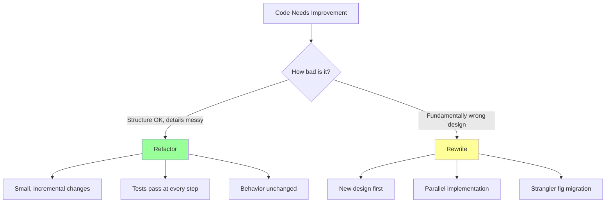
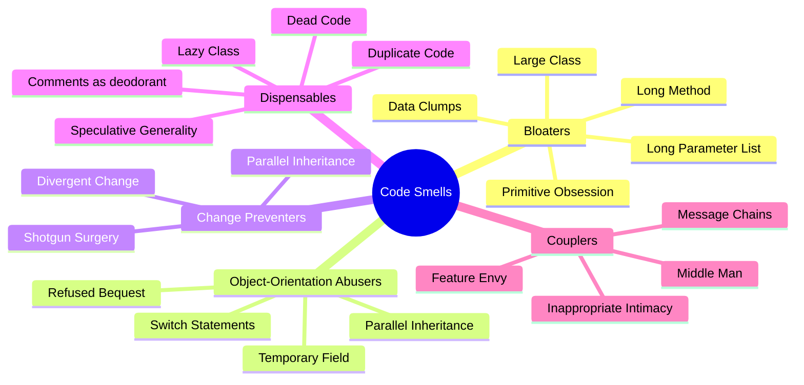
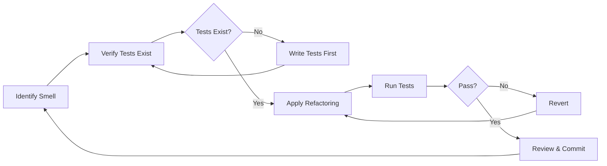
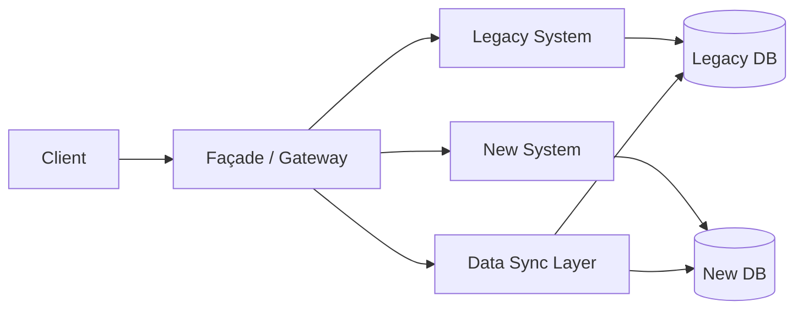
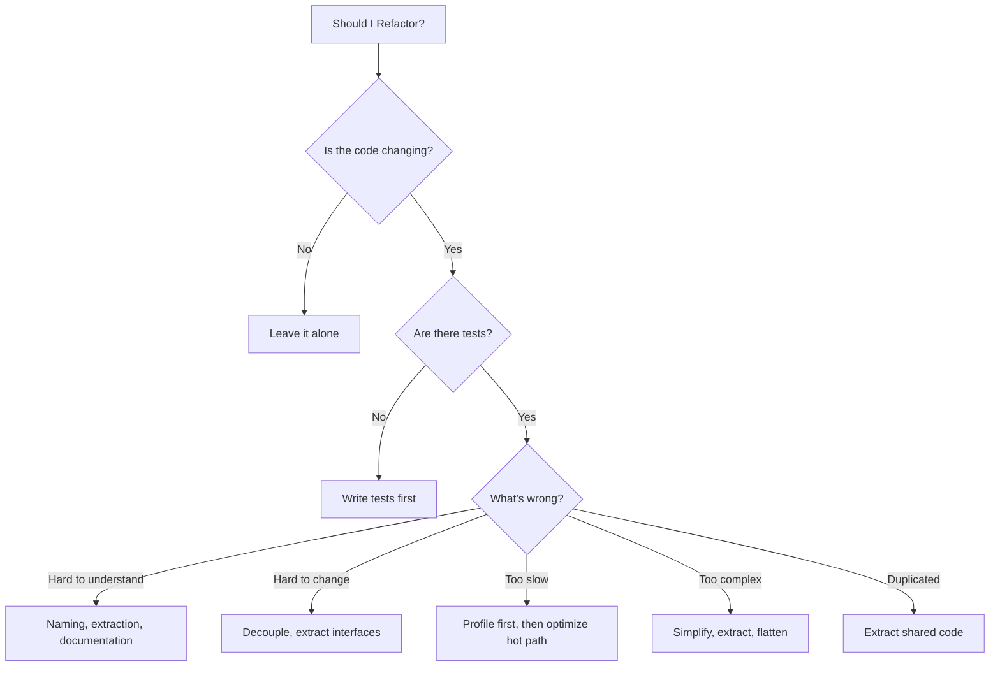

# Refactoring Prompts

## Why Refactoring Prompts Exist

Refactoring — changing code's internal structure without changing its external behavior — is one of the most important and undervalued engineering activities. Martin Fowler formalized the practice in his 1999 book, but the concept goes back to the earliest days of programming. Every codebase accumulates entropy over time: quick fixes, changing requirements, team turnover, and evolving best practices all contribute to structural decay.

The cost of not refactoring follows an exponential curve. A study by Stripe in 2018 estimated that developers spend 42% of their time dealing with technical debt and maintenance. The longer debt accumulates, the more expensive it becomes:

$$
\text{Cost}(t) = C_0 \cdot e^{r \cdot t}
$$

Where $C_0$ is the initial cost of the debt, $r$ is the interest rate (how much it slows development), and $t$ is time. A function that takes 2 hours to refactor today might take 2 weeks in a year when 15 other functions depend on it.

AI-assisted refactoring solves three problems:

1. **Pattern recognition** — AI can identify code smells and anti-patterns systematically across an entire codebase
2. **Transformation execution** — AI can apply mechanical refactoring transformations reliably
3. **Knowledge application** — AI encodes refactoring patterns from thousands of codebases, applying solutions a developer might not have seen

::: warning Critical Principle
Refactoring requires tests. Never refactor without a safety net of tests that verify the code's behavior before and after the change. If tests don't exist, write them first (see [Testing Prompts](./testing-prompts.md)).
:::

## First Principles of Refactoring

Refactoring is governed by a few fundamental principles:

### The Boy Scout Rule

> "Leave the code cleaner than you found it." — Robert C. Martin

### Refactoring vs Rewriting



### Code Smell Taxonomy



### The Refactoring Safety Net

$$
P(\text{safe refactoring}) = P(\text{tests pass before}) \cdot P(\text{tests pass after}) \cdot P(\text{behavior preserved})
$$

If any factor is low, the refactoring is risky. The prompts below include test requirements to maximize all three factors.

## Core Mechanics

The refactoring workflow with AI follows a disciplined cycle:



## Implementation — The Complete Prompt Library

### Category 1: Code Smell Detection (5 Prompts)

#### Prompt 1 — Comprehensive Code Smell Audit

```text
You are a senior software engineer specializing in code quality.
Analyze the following code for ALL code smells:

```typescript
[PASTE CODE HERE]
```

For each code smell found, provide:

1. **Smell Name**: The standard name (from Fowler's catalog)
2. **Location**: File, class, method, line range
3. **Severity**: Critical / High / Medium / Low
4. **Description**: Why this is a problem
5. **Impact**: How it affects maintainability, readability, or performance
6. **Refactoring**: The specific refactoring technique to apply
7. **Before/After**: Show the code transformation

Check for ALL of these categories:

**Bloaters**:
- Methods longer than 20 lines
- Classes with more than 200 lines or 5+ responsibilities
- Functions with more than 3 parameters
- Data clumps (same group of variables passed together)
- Primitive obsession (using primitives instead of small objects)

**Object-Orientation Abusers**:
- Switch/if-else chains on type (replace with polymorphism)
- Type checking (instanceof, typeof for business logic)
- Refused bequest (inheriting but not using parent behavior)
- Temporary fields (fields only used in some scenarios)

**Change Preventers**:
- Divergent change (class changes for multiple reasons)
- Shotgun surgery (one change requires modifying many classes)
- Parallel inheritance hierarchies

**Dispensables**:
- Duplicate code (even near-duplicates)
- Dead code (unreachable or unused)
- Speculative generality (abstractions without use cases)
- Comments explaining bad code (instead of fixing the code)

**Couplers**:
- Feature envy (method uses another class more than its own)
- Inappropriate intimacy (classes accessing each other's internals)
- Message chains (a.getB().getC().getD())
- Middle man (class that only delegates)

Present findings as a prioritized table:
| # | Smell | Location | Severity | Refactoring | Effort |
|---|-------|----------|----------|-------------|--------|

Then provide a recommended refactoring order (highest ROI first).
```

#### Prompt 2 — Complexity Analysis

```text
Analyze the cyclomatic and cognitive complexity of this code:

```typescript
[PASTE CODE HERE]
```

For each function/method:

1. **Cyclomatic Complexity** (CC):
   Count: if, else, &&, ||, ?, case, catch, for, while, do
   CC = edges - nodes + 2 (or shortcut: count decision points + 1)

   Rating:
   - 1-5: Simple, low risk
   - 6-10: Moderate, some risk
   - 11-20: Complex, high risk
   - 21+: Very complex, critical risk

2. **Cognitive Complexity**:
   Count nesting depth increments (harder to understand)
   - Each nesting level adds to base increment
   - Breaks in linear flow add increments
   - Recursion adds increment

3. **Halstead Metrics**:
   - Volume: N * log2(n) where N=total operators+operands, n=unique
   - Difficulty: (n1/2) * (N2/n2)
   - Effort: Difficulty * Volume

4. **Lines of Code Metrics**:
   - Total lines
   - Logical lines (statements)
   - Comment ratio
   - Blank line ratio

For each function with CC > 10 or cognitive complexity > 15:

Provide a specific refactoring plan to reduce complexity:
- Extract Method for each independent block
- Replace Conditional with Polymorphism for type switching
- Introduce Guard Clauses to reduce nesting
- Replace Nested Conditionals with early returns
- Decompose using Strategy or Command pattern

Show before and after complexity scores.
```

#### Prompt 3 — Dependency Analysis

```text
Analyze the dependency structure of this codebase:

```typescript
[PASTE CODE OR DESCRIBE MODULE STRUCTURE]
```

Produce:

1. **Import Graph**: Map all imports between modules
   - Direction: who depends on whom
   - Type: what is imported (types only? implementations?)

2. **Coupling Metrics**:
   For each module:
   - Afferent coupling (Ca): How many modules depend on this one
   - Efferent coupling (Ce): How many modules this one depends on
   - Instability: I = Ce / (Ca + Ce)
   - Abstractness: A = abstract exports / total exports

3. **Violations**:
   - Circular dependencies (A -> B -> C -> A)
   - Layer violations (presentation depending on data access)
   - Stable dependency principle violations
     (unstable module depending on another unstable module)
   - Dependency on concrete implementations (instead of interfaces)

4. **Dependency Graph Visualization**:
   Create a Mermaid diagram showing the dependency graph.
   Color-code by instability:
   - Green: Stable (I < 0.3)
   - Yellow: Moderate (0.3 <= I <= 0.7)
   - Red: Unstable (I > 0.7)

5. **Refactoring Recommendations**:
   For each violation:
   - What pattern to apply (Dependency Inversion, Mediator, etc.)
   - Specific code changes needed
   - Impact on other modules
```

#### Prompt 4 — Duplicate Code Detection

```text
Find all duplicate and near-duplicate code in these files:

```typescript
[PASTE MULTIPLE FILES OR DESCRIBE CODEBASE]
```

Detection levels:

1. **Type 1 — Exact Clones**: Identical code (ignoring whitespace/comments)
2. **Type 2 — Renamed Clones**: Same structure, different variable/function names
3. **Type 3 — Near-Miss Clones**: Similar structure with some modifications
4. **Type 4 — Semantic Clones**: Different code, same functionality

For each duplicate found:

| Clone Type | Location 1 | Location 2 | Similarity % | Lines |
|-----------|-----------|-----------|-------------|-------|

For each group of duplicates, provide a refactoring strategy:

1. **Extract Method**: Pull common code into a shared function
2. **Extract Class**: Create a new class for shared behavior
3. **Template Method**: If the duplicates differ in specific steps
4. **Strategy Pattern**: If the duplicates differ in algorithm choice
5. **Parameterize Function**: If the duplicates differ only in values

For each recommended extraction:
- Show the new shared code
- Show how each call site changes
- Estimate effort (hours)
- Assess risk (what could break)
```

#### Prompt 5 — API Surface Area Audit

```text
Audit the public API surface of this module/library/service:

```typescript
[PASTE CODE OR API DEFINITION]
```

Evaluate:

1. **Surface Area Size**:
   - Number of public functions/methods
   - Number of public types/interfaces
   - Number of configuration options
   - Compare to similar libraries (is it too large? too small?)

2. **Naming Consistency**:
   - Do similar operations use similar names?
   - Are verbs used consistently? (get vs fetch vs retrieve)
   - Is the naming convention consistent? (camelCase vs snake_case)
   - Are abbreviations consistent?

3. **API Usability**:
   - Can common tasks be done in 1-2 calls? (pit of success)
   - Are defaults sensible? (zero-configuration for common case)
   - Are error messages helpful?
   - Is the API discoverable? (IDE autocomplete works well?)

4. **API Stability Risk**:
   - Which public methods are likely to change?
   - What is exposed that should be internal?
   - Are implementation details leaking through the API?

5. **Refactoring Recommendations**:
   - Methods to make private/internal
   - Methods to rename for consistency
   - Methods to combine (reduce surface area)
   - Methods to split (single responsibility)
   - New abstractions to introduce (simplify common usage)

Propose a minimal API that covers 90% of use cases.
```

### Category 2: Structural Refactoring (8 Prompts)

#### Prompt 6 — Extract Service / Module

```text
Refactor this monolithic code into well-defined services/modules:

```typescript
[PASTE LARGE FILE OR CLASS]
```

CONTEXT:
- This code currently handles: [list responsibilities]
- It should be split into: [suggested module boundaries, or let AI determine]

REFACTORING PROCESS:
1. **Identify Responsibilities**: List each distinct responsibility
2. **Group by Cohesion**: Which responsibilities belong together?
3. **Define Interfaces**: What does each module expose?
4. **Map Dependencies**: Which modules depend on which?
5. **Execute Split**: Produce the refactored code

REQUIREMENTS:
- Each module has a single, clear purpose
- Modules communicate through defined interfaces (not shared state)
- Circular dependencies between modules are not allowed
- Each module is independently testable
- Existing tests still pass (show test modifications needed)

OUTPUT:
1. Module boundary diagram (Mermaid)
2. Interface definitions for each module
3. Refactored code for each module
4. Updated imports and dependency injection setup
5. Migration guide (what moved where)
6. Updated tests
```

#### Prompt 7 — Replace Inheritance with Composition

```text
Refactor this inheritance hierarchy to use composition:

```typescript
[PASTE INHERITANCE HIERARCHY]
```

CURRENT PROBLEMS:
- Deep inheritance tree (>2 levels)
- Subclasses override methods to do nothing (refused bequest)
- Hard to understand which method runs due to overriding
- Can't combine behaviors from different branches
- Adding new variations requires new subclasses

REFACTORING STEPS:
1. **Extract Interfaces**: Define the behaviors that vary
2. **Create Strategy Classes**: Implement each behavior variation
3. **Compose in Host Class**: Use composition to mix behaviors
4. **Eliminate Inheritance**: Replace extends with has-a relationships

BEFORE:
```
Animal
├── Bird
│   ├── Eagle (can fly, can hunt)
│   └── Penguin (can't fly, can swim)
├── Fish
│   └── FlyingFish (can swim, can "fly")
└── Mammal
    ├── Bat (can fly)
    └── Whale (can swim)
```

AFTER:
```
Animal has MovementStrategy, HuntingStrategy, etc.
- FlyingMovement, SwimmingMovement, WalkingMovement
- Behaviors composed at construction time
```

OUTPUT:
1. Interface definitions (strategies/behaviors)
2. Strategy implementations
3. Refactored host class with composition
4. Factory for creating configured instances
5. Updated tests
6. Comparison of before/after flexibility
```

#### Prompt 8 — Introduce Domain Types (Eliminate Primitive Obsession)

```text
Refactor this code to replace primitive types with domain types:

```typescript
[PASTE CODE WITH PRIMITIVE OBSESSION]
```

COMMON PRIMITIVES TO REPLACE:
- string for email -> EmailAddress value object
- string for money -> Money value object (amount + currency)
- string for phone -> PhoneNumber value object
- number for percentage -> Percentage value object (0-100)
- string for URL -> URL value object
- string for ID -> typed ID (UserId, OrderId)
- Date for time range -> DateRange value object
- number[] for coordinates -> GeoPoint value object

FOR EACH NEW DOMAIN TYPE:

1. **Value Object Implementation**:
   - Immutable (readonly properties)
   - Self-validating (constructor throws on invalid)
   - Equality by value (not reference)
   - Meaningful methods (Money.add(), EmailAddress.getDomain())
   - String representation (toString())

2. **Type Safety Benefits**:
   - Cannot accidentally pass an email where a phone is expected
   - Cannot have an invalid email in the system
   - Business rules live with the data they protect

Example:
```typescript
// BEFORE: primitive obsession
function sendEmail(to: string, subject: string, body: string): void

// AFTER: domain types
function sendEmail(to: EmailAddress, subject: EmailSubject, body: EmailBody): void
```

OUTPUT:
1. Value object implementations (with validation)
2. Refactored code using value objects
3. Type adapter utilities (from/to primitive)
4. Serialization/deserialization support
5. Tests for each value object
6. Migration guide for existing callers
```

#### Prompt 9 — Replace Conditional with Polymorphism

```text
Refactor these conditional chains into polymorphic designs:

```typescript
[PASTE CODE WITH SWITCH/IF-ELSE CHAINS ON TYPE]
```

PATTERN:
Current code has:
```typescript
if (type === 'A') { /* behavior for A */ }
else if (type === 'B') { /* behavior for B */ }
else if (type === 'C') { /* behavior for C */ }
```

REFACTORING OPTIONS (choose the best fit):

1. **Strategy Pattern** (algorithm varies):
   - Interface defines the operation
   - Each strategy implements the interface
   - Context holds a reference to the strategy
   - Strategy selected at construction or runtime

2. **Factory + Polymorphism** (object creation varies):
   - Base class/interface defines common behavior
   - Subclasses implement variations
   - Factory creates the right subclass from the type

3. **Registry/Map Pattern** (simple dispatch):
   - Map from type to handler function
   - Extensible without modifying existing code
   - Good for simple dispatch without state

4. **Visitor Pattern** (operations on type hierarchy):
   - When you frequently add new operations
   - Double dispatch for type-safe visiting

FOR EACH CONDITIONAL CHAIN:
- Identify what varies (the algorithm, the data, the behavior)
- Choose the right pattern
- Show the complete refactored code
- Verify the Open/Closed Principle: new types don't modify existing code

OUTPUT:
1. Interface/abstract class definition
2. Concrete implementations for each case
3. Factory or registry for construction
4. Refactored calling code
5. Tests for each implementation
6. Migration checklist
```

#### Prompt 10 — Flatten Deeply Nested Code

```text
Refactor this deeply nested code to be flat and readable:

```typescript
[PASTE DEEPLY NESTED CODE]
```

TECHNIQUES TO APPLY:

1. **Guard Clauses** (early return):
   ```typescript
   // BEFORE
   function process(data) {
     if (data) {
       if (data.isValid) {
         if (data.items.length > 0) {
           // actual logic here at 3 levels deep
         }
       }
     }
   }

   // AFTER
   function process(data) {
     if (!data) return;
     if (!data.isValid) return;
     if (data.items.length === 0) return;
     // actual logic at top level
   }
   ```

2. **Extract Method** (give names to blocks):
   Extract each nesting level into a named function

3. **Replace Loop with Pipeline**:
   Replace for loops with .filter().map().reduce()

4. **Introduce Explaining Variable**:
   Extract complex conditions into named booleans

5. **Replace Exception-Based Control Flow**:
   Use Result/Either pattern instead of try/catch for expected failures

6. **Table-Driven Methods**:
   Replace complex conditionals with lookup tables

CONSTRAINTS:
- Maximum nesting depth: 2 levels
- Maximum function length: 20 lines
- Each function does one thing
- Function name describes what it does (not how)

OUTPUT:
1. Refactored code with maximum 2-level nesting
2. Extracted helper functions with clear names
3. Before/after complexity scores
4. Tests verifying preserved behavior
```

#### Prompt 11 — Introduce Repository Pattern

```text
Refactor data access code to use the Repository pattern:

```typescript
[PASTE CODE WITH INLINE DATABASE QUERIES]
```

CURRENT PROBLEMS:
- SQL/ORM calls scattered throughout business logic
- Same queries duplicated in multiple places
- Hard to test business logic without a database
- Hard to switch databases or add caching

REFACTORING STEPS:
1. **Define Repository Interface**:
   - CRUD methods appropriate for the domain
   - Query methods that match business use cases
   - No database-specific types in the interface

2. **Implement Repository**:
   - Database-specific implementation
   - Query optimization
   - Connection management

3. **Add Unit of Work** (if needed):
   - Transaction management
   - Change tracking
   - Batch operations

4. **Inject Repository**:
   - Constructor injection in service classes
   - DI container registration
   - Test with mock repository

RULES:
- Repository methods named after domain concepts (findActiveUsers, not findByStatusEquals1)
- Repository returns domain objects, not database rows
- Repository interface lives in domain layer, implementation in infrastructure
- One repository per aggregate root

OUTPUT:
1. Repository interface definitions
2. Database implementation
3. In-memory implementation (for tests)
4. Refactored service code using repository
5. DI configuration
6. Tests (using in-memory repository)
```

#### Prompt 12 — Introduce Error Handling Strategy

```text
Refactor error handling throughout this codebase:

```typescript
[PASTE CODE WITH INCONSISTENT ERROR HANDLING]
```

CURRENT PROBLEMS:
- Inconsistent error handling (some throw, some return null, some swallow)
- Generic catch blocks that hide real errors
- No error hierarchy (everything is Error or string)
- Error messages not helpful for debugging
- No distinction between operational and programmer errors

REFACTORING PLAN:

1. **Error Hierarchy**:
   ```typescript
   abstract class AppError extends Error {
     abstract readonly code: string;
     abstract readonly statusCode: number;
     abstract readonly isOperational: boolean;
   }

   class NotFoundError extends AppError { /* ... */ }
   class ValidationError extends AppError { /* ... */ }
   class ExternalServiceError extends AppError { /* ... */ }
   ```

2. **Result Type** (for expected failures):
   ```typescript
   type Result<T, E = AppError> =
     | { success: true; data: T }
     | { success: false; error: E };
   ```

3. **Error Boundary Pattern**:
   - Each module boundary catches and wraps errors
   - Add context at each level (error cause chain)
   - Top-level handler converts to API response

4. **Error Recovery**:
   - Retry for transient errors
   - Fallback for degraded service
   - Circuit breaker for repeated failures

RULES:
- Never swallow errors silently
- Never throw strings
- Always add context when re-throwing
- Separate user-facing messages from developer details
- Log with appropriate severity

OUTPUT:
1. Error class hierarchy
2. Result type utilities
3. Refactored code with proper error handling
4. Error handler middleware
5. Tests for error scenarios
```

#### Prompt 13 — Extract Configuration from Code

```text
Refactor hardcoded values out of this code:

```typescript
[PASTE CODE WITH HARDCODED VALUES]
```

IDENTIFY:
- Hardcoded URLs, ports, hostnames
- Magic numbers (timeouts, limits, thresholds)
- Feature toggles embedded as booleans
- Environment-specific values
- Credentials or API keys (CRITICAL SECURITY ISSUE)
- Default values that should be configurable

REFACTORING:
1. **Extract to Configuration**:
   - Environment variables for deployment-specific values
   - Config files for application defaults
   - Feature flag system for toggles
   - Secret manager for credentials

2. **Named Constants**:
   - Replace magic numbers with named constants
   - Group related constants in enum or const object
   - Document what each value means and why it was chosen

3. **Configuration Validation**:
   - Validate all config on startup (fail fast)
   - Type-safe configuration access
   - Default values with documentation
   - Required vs optional config distinction

OUTPUT:
1. Configuration schema definition
2. Refactored code using configuration
3. Default configuration file
4. Environment variable documentation
5. Validation logic
6. Tests (with different configurations)
```

### Category 3: Performance Refactoring (5 Prompts)

#### Prompt 14 — Optimize Database Queries

```text
Optimize the database queries in this code:

```typescript
[PASTE CODE WITH DATABASE QUERIES]
```

DATABASE: [PostgreSQL/MySQL/MongoDB]
TABLE SIZES: [Approximate row counts for relevant tables]

ANALYZE:

1. **N+1 Query Detection**:
   Find loops that execute queries inside them.
   Refactor to: batch queries, JOINs, or DataLoader pattern.

2. **Missing Indexes**:
   For each query, determine:
   - Is there an index covering the WHERE clause?
   - Is there an index covering ORDER BY?
   - Would a composite index be better?
   - Is the index selective enough?

3. **Over-fetching**:
   - SELECT * where only 2 columns are needed
   - Loading relationships that aren't used
   - Fetching 1000 rows when UI shows 10

4. **Under-caching**:
   - Queries that return the same data for the same parameters
   - Queries that could use materialized views
   - Expensive aggregations that could be pre-computed

5. **Query Rewriting**:
   - Subqueries that should be JOINs (or vice versa)
   - Correlated subqueries (very expensive)
   - LIKE '%term%' without full-text search index
   - Unnecessary DISTINCT

6. **Connection Pool**:
   - Pool size appropriate for load?
   - Connection timeout configured?
   - Idle connection cleanup?

OUTPUT:
1. Optimized queries with EXPLAIN ANALYZE comparison
2. Index creation statements
3. Refactored code (batch queries, proper SELECTs)
4. Caching strategy for repeated queries
5. Before/after performance estimates
```

#### Prompt 15 — Optimize Memory Usage

```text
Analyze and optimize memory usage in this code:

```typescript
[PASTE CODE]
```

EXPECTED LOAD: [Concurrent users, data sizes]

ANALYZE:

1. **Memory Leak Detection**:
   - Event listeners not removed
   - Closures capturing large objects
   - Growing collections without bounds
   - Global/module-level caches without eviction
   - Unresolved promises
   - setInterval/setTimeout not cleared

2. **Excessive Allocation**:
   - Object creation in hot loops
   - String concatenation in loops (use join)
   - Array spreading that copies large arrays
   - Unnecessary JSON.parse/JSON.stringify cycles
   - Creating intermediate arrays (use generators)

3. **Large Object Handling**:
   - Loading entire files into memory
   - Buffering entire HTTP responses
   - Holding large datasets in memory
   - Refactor to: streams, pagination, lazy loading

4. **Data Structure Optimization**:
   - Map instead of object for frequent add/delete
   - Set instead of array for membership checks
   - TypedArray for numeric data
   - Buffer reuse for binary operations

5. **Garbage Collection Pressure**:
   - Short-lived object allocation rate
   - Object pool for frequently allocated types
   - Pre-allocated buffers for known sizes

OUTPUT:
1. Memory issues identified with severity
2. Refactored code with fixes
3. Streaming alternatives for large data
4. Object pool implementations where beneficial
5. Memory usage estimates before/after
6. Memory leak prevention guidelines
```

#### Prompt 16 — Optimize Async Operations

```text
Optimize asynchronous operations in this code:

```typescript
[PASTE CODE WITH ASYNC OPERATIONS]
```

ANALYZE:

1. **Sequential vs Parallel**:
   Find async operations that are sequential but could be parallel:
   ```typescript
   // BEFORE: Sequential (slow)
   const users = await getUsers();
   const orders = await getOrders();
   const products = await getProducts();

   // AFTER: Parallel (fast)
   const [users, orders, products] = await Promise.all([
     getUsers(),
     getOrders(),
     getProducts(),
   ]);
   ```

2. **Missing Error Handling**:
   - Unhandled promise rejections
   - Promise.all failing fast on first error (use Promise.allSettled when appropriate)
   - Missing try/catch in async functions

3. **Unnecessary Serialization**:
   - await in loops (should batch or parallelize)
   - Awaiting values that aren't promises
   - Async functions that don't need to be async

4. **Resource Management**:
   - Connections not released on error
   - Missing finally blocks
   - Using async dispose pattern

5. **Concurrency Control**:
   - Promise.all with 1000 items (overload risk)
   - Need for concurrency limiter (p-limit, p-queue)
   - Semaphore pattern for resource-constrained operations

6. **Cancellation**:
   - AbortController for cancellable operations
   - Cleanup on cancellation
   - Timeout enforcement

OUTPUT:
1. Parallelized operations
2. Proper error handling
3. Concurrency limiters where needed
4. Resource cleanup (using/dispose pattern)
5. Before/after timing estimates
6. Tests for async edge cases
```

#### Prompt 17 — Reduce Bundle Size (Frontend)

```text
Analyze and reduce the bundle size of this frontend code:

```typescript
[PASTE CODE OR DESCRIBE THE APPLICATION]
```

CURRENT BUNDLE SIZE: [If known]
TARGET BUNDLE SIZE: [e.g., <200KB gzipped]

ANALYZE:

1. **Large Dependencies**:
   - Identify npm packages that are large (>50KB)
   - For each, consider:
     - Lighter alternative? (moment -> dayjs, lodash -> lodash-es/native)
     - Only using 5% of the library? (tree-shake or import individual modules)
     - Can be lazy-loaded? (load on first use)

2. **Dead Code**:
   - Unused exports
   - Unused imports
   - Feature-flagged code that's always off
   - Legacy code paths

3. **Code Splitting**:
   - Route-based splitting (each page loads its own code)
   - Component-level splitting (heavy components lazy-loaded)
   - Split vendor code from application code
   - Identify the critical rendering path

4. **Asset Optimization**:
   - Image optimization and lazy loading
   - Font subsetting
   - SVG optimization
   - CSS purging

5. **Tree Shaking**:
   - Named imports instead of default imports
   - ESM instead of CJS for better tree shaking
   - Side-effect-free package.json configuration
   - Pure function annotations

OUTPUT:
1. Dependency audit with alternatives
2. Code splitting strategy
3. Lazy loading implementations
4. Tree shaking improvements
5. Bundle analysis comparison
6. Performance budget configuration
```

#### Prompt 18 — Optimize Hot Path

```text
Optimize the performance-critical hot path in this code:

```typescript
[PASTE HOT PATH CODE]
```

CONTEXT:
- This code runs [N] times per second
- Current execution time: [X]ms per call
- Target: [Y]ms per call
- Called from: [describe the calling context]

OPTIMIZATION TECHNIQUES TO APPLY:

1. **Algorithm Optimization**:
   - Is the algorithm optimal for this data size?
   - Can O(n^2) be reduced to O(n log n) or O(n)?
   - Can a different data structure improve lookups?

2. **Micro-optimizations**:
   - Avoid allocation in the hot path
   - Use pre-computed lookup tables
   - Short-circuit evaluation
   - Avoid unnecessary type conversions
   - Bit operations for integer math

3. **Caching**:
   - Memoize pure function results
   - LRU cache for repeated computations
   - Pre-compute values that don't change per request

4. **Batch Processing**:
   - Batch I/O operations
   - Buffer writes
   - Amortize expensive setup costs

5. **Concurrency**:
   - Worker threads for CPU-bound work
   - Non-blocking I/O
   - Connection reuse

BENCHMARK:
Write a benchmark comparing before and after:
- Warmup iterations: 1000
- Measured iterations: 10000
- Report: mean, p50, p95, p99, std deviation
- Memory: allocation count, peak memory

OUTPUT:
1. Optimized code
2. Benchmark script
3. Before/after comparison table
4. Explanation of each optimization
5. Risk assessment (correctness trade-offs?)
```

### Category 4: Architectural Refactoring (5 Prompts)

#### Prompt 19 — Introduce Clean Architecture Layers

```text
Refactor this codebase to follow Clean Architecture:

```typescript
[PASTE CURRENT CODE OR DESCRIBE CURRENT STRUCTURE]
```

CURRENT PROBLEMS:
- Business logic mixed with infrastructure
- Database queries in controllers
- Framework-dependent domain code
- Hard to test without spinning up infrastructure

TARGET ARCHITECTURE:
```
src/
├── domain/           # Enterprise Business Rules
│   ├── entities/     # Domain entities with business logic
│   ├── value-objects/ # Immutable value types
│   ├── events/       # Domain events
│   ├── errors/       # Domain-specific errors
│   └── ports/        # Interfaces (repository, services)
├── application/      # Application Business Rules
│   ├── use-cases/    # Application-specific logic
│   ├── dtos/         # Data transfer objects
│   └── services/     # Application services
├── infrastructure/   # Frameworks & Drivers
│   ├── database/     # Repository implementations, migrations
│   ├── http/         # Controllers, middleware, routes
│   ├── messaging/    # Event bus, queue implementations
│   └── external/     # Third-party service adapters
└── config/           # Dependency injection, configuration
```

DEPENDENCY RULE:
- Domain depends on nothing
- Application depends on Domain only
- Infrastructure depends on Application and Domain
- NEVER violate this rule

REFACTORING STEPS:
1. Extract domain entities (remove framework annotations)
2. Define port interfaces in domain
3. Extract use cases from controllers
4. Move infrastructure to adapters implementing ports
5. Wire with dependency injection

OUTPUT:
1. Refactored directory structure
2. Domain layer (entities, value objects, ports)
3. Application layer (use cases, DTOs)
4. Infrastructure layer (adapters)
5. DI container configuration
6. Migration checklist
7. Tests at each layer
```

#### Prompt 20 — Strangler Fig Migration

```text
Plan a Strangler Fig migration for this system:

LEGACY SYSTEM: [Describe the legacy system]
TARGET SYSTEM: [Describe the target architecture]
CONSTRAINTS: [Timeline, team, risk tolerance]

MIGRATION STRATEGY:

1. **Inventory Phase**:
   - List all features/endpoints in the legacy system
   - Categorize by complexity and business criticality
   - Map dependencies between features
   - Identify shared state and databases

2. **Façade Setup**:
   - Introduce a routing layer (API gateway, proxy)
   - All traffic goes through the façade
   - Initially, façade routes everything to legacy
   - No behavior change at this step

3. **Incremental Migration**:
   Priority order for migration:
   | Feature | Complexity | Dependencies | Risk | Migration Order |

   For each feature:
   a. Implement in new system
   b. Route traffic through façade to new implementation
   c. Run both in parallel, compare results
   d. Switch to new implementation
   e. Remove legacy implementation

4. **Data Migration**:
   - Synchronize data between old and new
   - Change Data Capture for real-time sync
   - Reconciliation checks
   - Cutover strategy

5. **Risk Mitigation**:
   - Feature flags for each migrated feature
   - Instant rollback capability
   - A/B testing during parallel run
   - Monitoring for behavior differences



OUTPUT:
1. Migration roadmap with phases
2. Façade implementation
3. Data sync strategy
4. Feature flag configuration
5. Testing strategy for parallel run
6. Rollback procedures
7. Success criteria for each phase
```

#### Prompt 21 — Convert Monolith to Modular Monolith

```text
Refactor this monolith into a modular monolith:

[DESCRIBE OR PASTE THE CURRENT MONOLITH]

Note: This is NOT about microservices. A modular monolith has:
- Clear module boundaries within a single deployable
- Explicit interfaces between modules
- Independent data ownership per module
- Ability to extract to services later if needed

STEP 1 — Module Identification:
Using domain analysis, identify 4-8 bounded contexts.
Each becomes a module.

STEP 2 — Module Structure:
```
src/
├── modules/
│   ├── users/
│   │   ├── public/       # Module's public API (only exports)
│   │   ├── internal/     # Module internals (not importable by others)
│   │   ├── events/       # Events this module publishes
│   │   └── tests/
│   ├── orders/
│   │   ├── public/
│   │   ├── internal/
│   │   ├── events/
│   │   └── tests/
│   └── payments/
│       ├── public/
│       ├── internal/
│       ├── events/
│       └── tests/
├── shared/               # Truly shared utilities (minimal)
└── infrastructure/       # Framework, database, messaging
```

STEP 3 — Module Rules:
- Module internals are NOT importable from outside
- Modules communicate through public interfaces or events
- Each module owns its database tables (no cross-module JOINs)
- Shared kernel is minimal and stable

STEP 4 — Enforcement:
- TypeScript path aliases to prevent illegal imports
- Architecture tests (ArchUnit equivalent)
- CI check for import violations

OUTPUT:
1. Module boundary definitions with justification
2. Public API for each module
3. Event definitions for inter-module communication
4. Refactored code in modular structure
5. Architecture fitness tests (enforce boundaries)
6. Module dependency diagram
```

#### Prompt 22 — Introduce Event-Driven Communication

```text
Refactor direct synchronous calls to event-driven communication:

CURRENT: [Code with synchronous inter-module/inter-service calls]

PROBLEM:
- Temporal coupling (caller waits for callee)
- Failure coupling (callee failure breaks caller)
- Knowledge coupling (caller knows about callee)

TARGET:
- Publish events instead of direct calls
- Subscribe to events for reactions
- Eventual consistency where acceptable

REFACTORING DECISIONS:

For each current synchronous call, determine:

| Call | Must Be Sync? | Event Name | Consistency Req | Pattern |
|------|---------------|-----------|----------------|---------|

Patterns:
1. **Fire and Forget**: Publish event, don't wait
2. **Request/Reply**: Publish event, wait for response event
3. **Saga**: Multi-step process with compensation
4. **CQRS**: Separate read/write with eventual consistency

For calls that MUST remain synchronous:
- Document why (data consistency, user experience, regulatory)
- Consider if the design can change to make async possible

IMPLEMENTATION:
- Event bus (in-process for modular monolith, or message broker)
- Event schema definitions
- Idempotent event handlers
- Error handling and dead letter strategy
- Event ordering guarantees where needed

OUTPUT:
1. Event definitions (name, schema, metadata)
2. Event publisher implementations
3. Event handler implementations
4. Saga orchestrator (if needed)
5. Refactored code (sync -> event-driven)
6. Consistency model documentation
7. Tests
```

#### Prompt 23 — Introduce CQRS (Command Query Responsibility Segregation)

```text
Refactor this system to use CQRS:

CURRENT: [Code with mixed read/write operations]

WHEN CQRS IS JUSTIFIED:
- Read and write patterns differ significantly
- Read model needs denormalization for performance
- Different scaling requirements for reads vs writes
- Event sourcing is being introduced

REFACTORING:

1. **Separate Command and Query Models**:
   ```
   BEFORE:
   UserService.getUser(id) — reads
   UserService.updateUser(id, data) — writes
   UserService.listUsers(filter) — reads with complex joins

   AFTER:
   Commands: CreateUser, UpdateUser, DeleteUser
   Queries: GetUser, ListUsers, SearchUsers
   ```

2. **Command Side**:
   - Command handlers (validate, execute, publish event)
   - Write model (optimized for consistency)
   - Domain events on every state change
   - Command validation (before execution)

3. **Query Side**:
   - Query handlers (optimized read model)
   - Read model (denormalized for query patterns)
   - Projection builders (event -> read model updates)
   - Cache-friendly design

4. **Synchronization**:
   - Events from command side update query side
   - Eventual consistency window
   - Consistency guarantees documentation
   - Stale read handling in UI

OUTPUT:
1. Command definitions and handlers
2. Query definitions and handlers
3. Read model projections
4. Event-to-read-model synchronization
5. API layer changes (command endpoints, query endpoints)
6. Consistency model documentation
7. Tests for both sides
```

### Category 5: Testing & Safety Refactoring (5 Prompts)

#### Prompt 24 — Make Legacy Code Testable

```text
Refactor this untestable legacy code to be testable:

```typescript
[PASTE UNTESTABLE CODE]
```

COMMON TESTABILITY PROBLEMS:
1. **Hard-coded dependencies** (new inside methods)
2. **Global state** (singletons, module-level variables)
3. **Direct I/O** (file system, network, database in business logic)
4. **Non-deterministic behavior** (Date.now(), Math.random())
5. **Deep inheritance** (can't test subclass without superclass)
6. **Large constructors** (too many dependencies)

REFACTORING SEQUENCE:
(Michael Feathers' "Working Effectively with Legacy Code" approach)

1. **Identify Change Points**: What behavior needs to change?
2. **Find Test Points**: Where can tests observe behavior?
3. **Break Dependencies**: Use these techniques:
   - Extract Interface (dependency inversion)
   - Parameterize Constructor (inject dependencies)
   - Extract Method (isolate testable logic)
   - Introduce Seam (place to inject test behavior)
   - Replace Global with Injection
   - Wrap Static Method

4. **Write Characterization Tests**: Tests that capture current behavior
   (even if the behavior might be wrong — document what it does NOW)

5. **Make the Change**: With tests as safety net

6. **Refactor**: Clean up the code with tests protecting you

OUTPUT:
1. Refactored code with dependency injection
2. Interface definitions for dependencies
3. Characterization tests (capture current behavior)
4. Unit tests for refactored code
5. Mock/stub implementations
6. Migration notes (what changed, what didn't)
```

#### Prompt 25 — Refactor Tests

```text
Refactor these tests to be maintainable, reliable, and fast:

```typescript
[PASTE TEST CODE]
```

COMMON TEST SMELLS:

1. **Fragile Tests**:
   - Tests break when implementation changes (not behavior)
   - Testing implementation details instead of behavior
   - Fix: Test public API, not internals

2. **Slow Tests**:
   - Real database/network calls in unit tests
   - Unnecessary setup/teardown
   - Fix: Mock I/O, use in-memory implementations

3. **Flaky Tests**:
   - Time-dependent tests
   - Order-dependent tests
   - Non-deterministic data
   - Fix: Inject time, isolate tests, use deterministic data

4. **Mystery Tests**:
   - Test name doesn't describe what's tested
   - Can't understand purpose from reading the test
   - Fix: Descriptive names, Arrange-Act-Assert structure

5. **Duplicate Tests**:
   - Same scenario tested multiple ways
   - Copy-paste test variations
   - Fix: Parameterized tests, test helpers

6. **Missing Tests**:
   - Happy path only, no edge cases
   - No error handling tests
   - No boundary value tests
   - Fix: Add missing scenarios systematically

REFACTORING:
- Introduce test helpers/fixtures
- Apply test patterns (Builder, Mother, Fixture)
- Organize with describe/it nesting
- Add missing coverage
- Remove redundant tests
- Fix naming conventions

OUTPUT:
1. Refactored test suite
2. Test helper utilities
3. Test fixtures/factories
4. Coverage gap analysis
5. Before/after test quality comparison
```

#### Prompt 26 — Type Safety Hardening

```text
Harden the type safety of this TypeScript code:

```typescript
[PASTE CODE]
```

FIND AND FIX:

1. **any usage**: Replace every 'any' with proper types
2. **Type assertions**: Remove 'as' casts, use type guards instead
3. **Optional chaining overuse**: Excessive '?' hides potential bugs
4. **Non-null assertions**: Remove '!' with proper null checks
5. **Implicit any**: Enable strict mode, fix all inferred 'any'
6. **Missing return types**: Add explicit return types to functions
7. **Loose union types**: string | number where specific type should be used
8. **Generic constraints**: Add constraints to generic parameters
9. **Discriminated unions**: Replace type assertions with narrowing
10. **Branded types**: For IDs and special strings

STRICT TYPESCRIPT CONFIG:
```json
{
  "compilerOptions": {
    "strict": true,
    "noUncheckedIndexedAccess": true,
    "exactOptionalPropertyTypes": true,
    "noImplicitReturns": true,
    "noFallthroughCasesInSwitch": true,
    "noPropertyAccessFromIndexSignature": true
  }
}
```

For each 'any' found:
- What should the type be?
- Why was 'any' used? (legitimate reason or laziness?)
- If legitimate, use 'unknown' with type narrowing instead

OUTPUT:
1. Fully typed code (zero 'any')
2. Type guard functions
3. Utility types created
4. Branded type definitions
5. Before/after type coverage comparison
6. TSConfig strictness recommendations
```

## Edge Cases & Failure Modes

### When Refactoring Goes Wrong

::: danger Common Refactoring Failures
1. **Big Bang Refactoring**: Changing everything at once. Always refactor incrementally.
2. **Refactoring Without Tests**: You will introduce bugs. Write tests first.
3. **Premature Abstraction**: Don't abstract until you have 3+ concrete examples.
4. **Ignoring the Team**: Refactoring patterns the team doesn't understand creates different problems.
5. **Gold Plating**: Refactoring beyond what's needed for the current task.
:::

### The Refactoring Decision Matrix

| Situation | Refactor? | Why |
|-----------|-----------|-----|
| Code works, rarely changes | No | Leave it alone |
| Code works, changes frequently | Yes | Reduce change cost |
| Code is broken | Fix, then refactor | Fix first |
| Code is thrown away in 3 months | No | Not worth the investment |
| New team member can't understand it | Yes | Knowledge sharing critical |
| Performance is acceptable | Only if maintainability is poor | Don't optimize prematurely |

## Performance Characteristics

Refactoring effort follows a power law distribution:

$$
\text{Effort}(n) = k \cdot n^{\alpha}
$$

Where $n$ is the number of files affected, $k$ is a constant depending on codebase complexity, and $\alpha$ is typically 1.3-1.8 (super-linear — it gets harder as scope increases).

| Refactoring Scope | Typical Effort | Risk Level | Approach |
|-------------------|---------------|------------|----------|
| Single function | 30 min - 2 hrs | Low | Just do it |
| Single class/module | 2 hrs - 1 day | Low-Medium | Branch + PR |
| Cross-module | 1 day - 1 week | Medium | Feature flag |
| Architectural | 1 week - 1 month | High | Strangler fig |
| Full rewrite | 1 month+ | Very High | Parallel implementation |

## Mathematical Foundations

### Technical Debt Interest Model

Technical debt accumulates interest, making future work more expensive:

$$
\text{Total Cost} = D_0 + \sum_{t=1}^{T} D_0 \cdot r^t = D_0 \cdot \frac{1 - r^{T+1}}{1 - r}
$$

Where $D_0$ is the initial debt cost, $r$ is the interest rate per period, and $T$ is the number of periods. For $r > 1$, the cost grows without bound — this is why some codebases become unmaintainable.

### Refactoring ROI Calculation

$$
\text{ROI} = \frac{\text{Time Saved Per Change} \times \text{Expected Number of Changes}}{\text{Refactoring Effort}} - 1
$$

If ROI > 0, the refactoring pays for itself. A function touched 50 times per year that saves 30 minutes per touch after a 10-hour refactoring yields ROI = (50 * 0.5) / 10 - 1 = 1.5 (150% return).

::: info War Story
A SaaS company had a 40,000-line "GodService" class that handled user management, billing, permissions, and audit logging. Every developer had to understand the entire class to make any change. Using the "Extract Service/Module" prompt (Prompt 6), they broke it into 7 focused modules over 3 sprints. After the refactoring, average PR review time dropped from 4 hours to 45 minutes, and the number of production incidents caused by user management changes dropped from 3 per month to zero. The refactoring took 6 weeks of engineering time but paid for itself within 2 months through reduced incident costs and faster development velocity.
:::

## Decision Framework



## Advanced Topics

### Automated Refactoring with AST Manipulation

For large-scale mechanical refactoring, use Abstract Syntax Tree (AST) tools:

```typescript
import { Project, SyntaxKind } from 'ts-morph';

// Example: Find all functions returning 'any' and flag them
const project = new Project({ tsConfigFilePath: 'tsconfig.json' });

for (const sourceFile of project.getSourceFiles()) {
  const functions = sourceFile.getFunctions();
  for (const fn of functions) {
    const returnType = fn.getReturnType();
    if (returnType.getText() === 'any') {
      console.log(
        `${sourceFile.getFilePath()}:${fn.getStartLineNumber()} ` +
        `- Function "${fn.getName()}" returns 'any'`
      );
    }
  }
}
```

### Refactoring Metrics Dashboard

Track refactoring impact over time:

```typescript
interface RefactoringMetrics {
  cyclomaticComplexity: { before: number; after: number };
  linesOfCode: { before: number; after: number };
  testCoverage: { before: number; after: number };
  dependencies: { before: number; after: number };
  buildTime: { before: number; after: number };
  prReviewTime: { before: number; after: number };
  incidentRate: { before: number; after: number };
}
```

## Cross-References

- [Code Generation Prompts](./code-generation-prompts.md) — Generate clean code from the start
- [Testing Prompts](./testing-prompts.md) — Write tests before refactoring
- [Architecture Review Prompts](./architecture-review-prompts.md) — Identify what needs refactoring
- [Design System Prompts](../ui-prompts/design-system-prompts.md) — Refactoring UI code
- [Migration Prompts](../architecture-prompts/migration-prompts.md) — Large-scale refactoring

## Related Deep Dives

- [Clean Architecture](/architecture-patterns/clean-architecture/) — Layers, boundaries, and use case patterns that serve as target structures when refactoring toward clean architecture
- [Domain-Driven Design](/architecture-patterns/domain-driven-design/) — Strategic and tactical design patterns for refactoring business logic into well-defined domain models
- [Hexagonal Architecture](/architecture-patterns/hexagonal/) — Ports-and-adapters pattern and dependency inversion techniques for decoupling infrastructure from domain logic
- [Performance Optimization](/performance/optimization/) — Profiling techniques and optimization patterns for performance-focused refactoring
