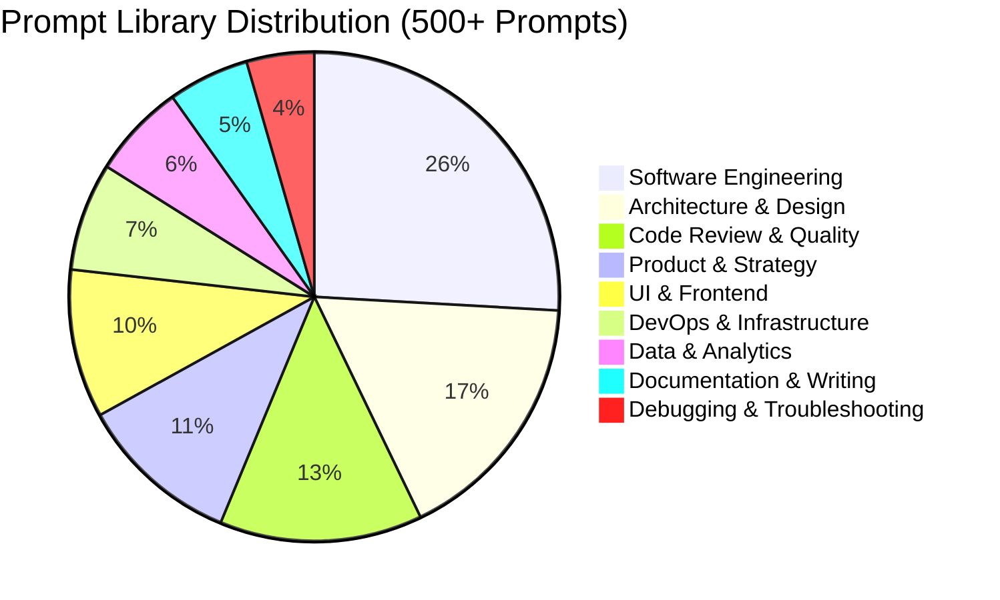

# Prompt Engineering

This is not a collection of party tricks. It is a structured library of **500+ prompts** designed by engineers, for engineers — each one refined through real-world use, tested across multiple LLMs, and documented with the context you need to adapt it to your situation.

## Why This Section Exists

The gap between "using AI" and "using AI effectively" is enormous. Most developers type a vague question, get a mediocre answer, and conclude that LLMs are overhyped. Meanwhile, engineers who understand prompt structure, context windows, and output steering are shipping features in half the time.

This section is your shortcut past the trial-and-error phase. Every prompt here comes with an explanation of **why** it works, not just the text to copy-paste. You will learn the underlying principles so you can craft your own prompts when none of ours fit.

## How to Use Prompts Effectively

### The Anatomy of a Great Prompt

A well-structured prompt has five components. Not every prompt needs all five, but knowing them lets you diagnose why a prompt is underperforming:

```
1. ROLE        — Who should the AI act as? (Sets expertise level and vocabulary)
2. CONTEXT     — What background does the AI need? (Constraints, codebase info, tech stack)
3. TASK        — What exactly should it do? (Be specific and unambiguous)
4. FORMAT      — How should the output look? (Code, table, list, diff, JSON)
5. GUARDRAILS  — What should it avoid? (No deprecated APIs, no external deps, etc.)
```

### Prompt Quality Multipliers

- **Specificity beats length.** "Review this function for SQL injection vulnerabilities" outperforms "review this code" even though it is only slightly longer.
- **Examples are powerful.** Showing the AI one example of desired output (few-shot prompting) is often worth more than three paragraphs of instructions.
- **Iterate, don't restart.** When a response is 70% right, refine the prompt rather than rewriting from scratch. Tell the AI what to keep and what to change.
- **Chain complex tasks.** Break multi-step work into sequential prompts. Use the output of step N as input to step N+1.
- **Set the evaluation criteria.** Tell the AI how you will judge success: "I'll evaluate this on correctness, readability, and test coverage."

### Common Anti-Patterns

| Anti-Pattern | Why It Fails | Fix |
|---|---|---|
| "Make it better" | No success criteria defined | Specify what "better" means |
| Dumping 2000 lines of code | Overwhelms context, dilutes focus | Isolate the relevant 50 lines |
| No role assignment | Generic, unfocused responses | Set a specific expert persona |
| Asking 5 questions at once | AI addresses each superficially | One question per prompt |
| Skipping constraints | Gets answers using wrong stack | State your tech stack and limits |

## Category Breakdown



### Software Engineering — 145 prompts
Code generation, refactoring, algorithm design, API design, testing strategies, dependency management, migration scripts, and performance optimization prompts.

### Architecture & Design — 95 prompts
System design interviews, microservice decomposition, database schema design, event-driven architecture, API gateway patterns, and trade-off analysis prompts.

### Code Review & Quality — 75 prompts
Security audits, performance reviews, accessibility checks, code smell detection, PR review assistance, and technical debt assessment prompts.

### Product & Strategy — 60 prompts
PRD generation, user story writing, competitive analysis, feature prioritization, technical feasibility assessment, and go-to-market planning prompts.

### UI & Frontend — 55 prompts
Component design, responsive layout, animation, design system tokens, accessibility testing, and design-to-code translation prompts.

### DevOps & Infrastructure — 40 prompts
Terraform modules, Dockerfile optimization, CI/CD pipeline design, monitoring setup, incident response, and cloud cost analysis prompts.

### Data & Analytics — 35 prompts
SQL query optimization, dashboard design, data modeling, ETL pipeline generation, and statistical analysis prompts.

### Documentation & Writing — 30 prompts
API documentation, architecture decision records, runbooks, onboarding guides, and technical blog post drafting prompts.

### Debugging & Troubleshooting — 25 prompts
Error diagnosis, log analysis, memory leak investigation, performance bottleneck identification, and root cause analysis prompts.

## Learning Path

| Order | Topic | Difficulty | Time |
|-------|-------|------------|------|
| 1 | Prompt anatomy & principles | Beginner | 30 min |
| 2 | Engineering prompts | Beginner | 1 hr |
| 3 | Architecture prompts | Intermediate | 1.5 hr |
| 4 | Code review prompts | Intermediate | 1 hr |
| 5 | Advanced chaining & multi-step | Advanced | 1.5 hr |
| 6 | Custom prompt design | Advanced | 1 hr |

## Subsections

- **[Engineering Prompts](/prompt-engineering/engineering-prompts/)** — Code generation, refactoring, testing, and debugging
- **[Architecture Prompts](/prompt-engineering/architecture-prompts/)** — System design, scaling, migration, and cost optimization
- **[Product Prompts](/prompt-engineering/product-prompts/)** — PRDs, user stories, competitive analysis, and go-to-market
- **[UI & Frontend Prompts](/prompt-engineering/ui-prompts/)** — Component design, accessibility, responsive design, and design systems

---

> *"The prompt is the program. Treat it with the same rigor you give your code — version it, test it, review it, iterate on it."*
