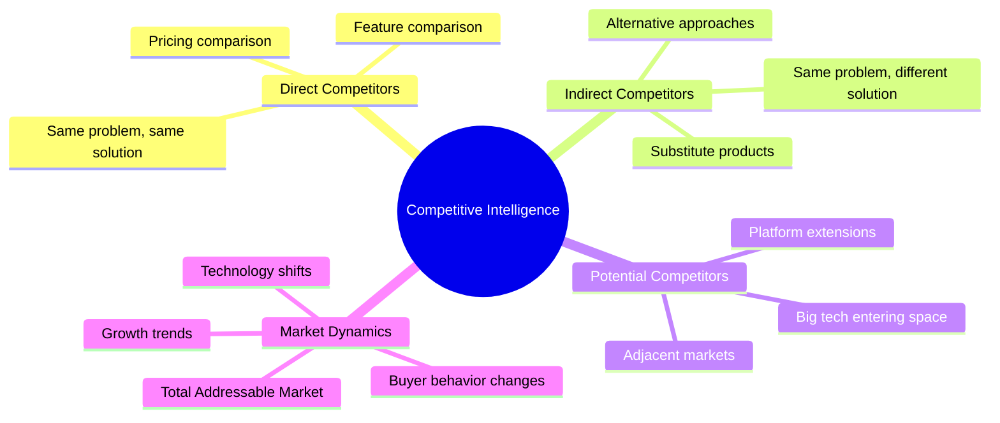
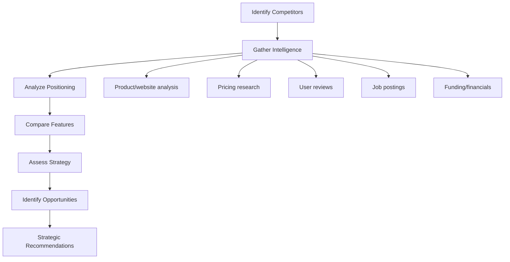
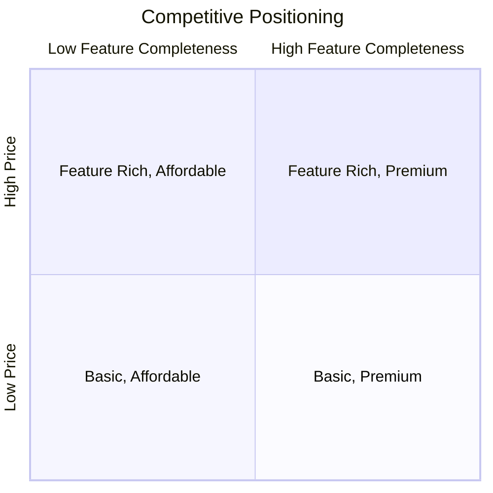

# Competitive Analysis Prompts

## Why Competitive Analysis Prompts Exist

Competitive analysis is the intelligence function of product management. Sun Tzu's principle applies directly: "Know the enemy and know yourself; in a hundred battles you will never be in peril." Yet most startups and growth-stage companies either skip competitive analysis entirely or do it once during fundraising and never update it.

The cost of ignorance is real. Research by CB Insights found that 20% of startup failures cited "getting outcompeted" as a factor. More subtly, many products fail because they solve a real problem but position themselves identically to an established competitor, offering no compelling reason to switch.

AI-assisted competitive analysis makes systematic market intelligence accessible. These prompts help teams:

1. **Identify competitors** they might not be aware of (especially indirect competitors)
2. **Analyze systematically** instead of cherry-picking favorable comparisons
3. **Update regularly** without the overhead of a dedicated analyst
4. **Translate analysis into action** with clear strategic recommendations

::: warning Important Limitation
AI models have a training data cutoff and cannot access real-time information. These prompts are most valuable when you provide current data about competitors (from their websites, product updates, pricing pages, job postings, press releases). The AI excels at structuring the analysis, not at knowing what competitors did last week.
:::

## First Principles

Competitive analysis is fundamentally about understanding **relative positioning** in a market:

$$
\text{Competitive Advantage} = \sum_{i=1}^{n} w_i \cdot (V_i^{us} - \max(V_i^{comp_j}))
$$

Where $V_i$ is the value delivered on dimension $i$, $w_i$ is the importance weight, and you compare against the best competitor on each dimension. A positive total means you have an advantage; negative means you're behind.



## Core Mechanics



## Implementation — The Complete Prompt Library

### Category 1: Competitor Identification (5 Prompts)

#### Prompt 1 — Comprehensive Competitor Mapping

```text
Map the competitive landscape for this product:

OUR PRODUCT: [Description of your product]
OUR MARKET: [Target market and customer segment]
OUR DIFFERENTIATION: [What we believe makes us different]

Identify competitors in four categories:

## 1. Direct Competitors
Companies solving the same problem for the same target customer with a similar approach.

For each (identify 5-10):
| Company | Product | Target Market | Funding/Stage | Est. Revenue | Key Differentiator |
|---------|---------|--------------|--------------|-------------|-------------------|

## 2. Indirect Competitors
Companies solving the same problem with a fundamentally different approach.

| Company | Approach | Why Customers Choose Them | Our Advantage Over Them |

## 3. Potential Competitors
Companies that could easily enter our market.

| Company | Current Market | Entry Capability | Likelihood (1-5) | Timeline | Trigger Event |
|---------|---------------|-----------------|------------------|----------|--------------|

Categories:
- Big tech (Google, Microsoft, Amazon, Apple) — could build it
- Adjacent startups — could pivot to our market
- Enterprise vendors — could add this as a feature
- Open source — could commoditize our value proposition

## 4. Substitute Solutions
Non-software alternatives customers use instead.

| Alternative | How It Solves the Problem | Why Some Prefer It | Our Advantage |
|------------|-------------------------|-------------------|--------------|

Examples: spreadsheets, manual processes, consultants, outsourcing

## Competitive Landscape Map


## Market Share Estimate
| Competitor | Estimated Market Share | Basis for Estimate |

## Key Takeaways
1. [Most dangerous competitor and why]
2. [Biggest opportunity gap in the market]
3. [Most likely new entrant and timeline]
```

#### Prompt 2 — Competitive Intelligence Gathering Framework

```text
Design a competitive intelligence gathering plan for:

COMPETITORS TO MONITOR: [List top 5-10 competitors]
RESOURCES AVAILABLE: [Budget, tools, time allocation]

## Intelligence Sources

### Public Sources (always monitor)
| Source | What to Look For | Frequency | Tool |
|--------|-----------------|-----------|------|
| Product website | Feature changes, pricing updates | Weekly | Web archive diff |
| Blog/changelog | Product direction, feature releases | Weekly | RSS feed |
| Job postings | Hiring areas = investment areas | Monthly | LinkedIn alerts |
| Social media | Customer sentiment, outages | Daily | Social listening |
| Review sites (G2, Capterra) | User complaints, praised features | Monthly | Review alerts |
| Press releases | Funding, partnerships, pivots | Monthly | Google Alerts |
| Conference talks | Technical approach, roadmap hints | Quarterly | YouTube/conf sites |
| Patents/trademarks | Future direction | Quarterly | Patent databases |
| Financial filings (if public) | Revenue, growth, investments | Quarterly | SEC filings |

### Customer Sources
| Source | Method | Intelligence Value |
|--------|--------|-------------------|
| Win/loss analysis | Post-deal interviews | Why customers chose us or them |
| Churn interviews | Exit surveys | What competitors offer that we don't |
| Prospect conversations | Sales call notes | What alternatives prospects evaluated |
| Support tickets | Keyword monitoring | Features customers expect from competitors |

### Product Analysis
| Method | What It Reveals | Frequency |
|--------|----------------|-----------|
| Sign up for competitor product | UX, onboarding, features | Quarterly |
| Free trial exploration | Feature depth, integrations | Quarterly |
| API documentation review | Technical capabilities, platform strategy | Quarterly |
| Pricing page screenshots | Pricing model evolution | Monthly |

## Intelligence Collection Template
For each competitor, collect quarterly:

### Company Profile
- Founded: [year]
- Headquarters: [location]
- Employees: [count and growth trend]
- Funding: [total raised, last round, investors]
- Revenue: [estimate, growth rate]
- Key customers: [notable logos]
- Key partnerships: [strategic partnerships]

### Product Update Log
| Date | Change | Significance | Our Response |
|------|--------|-------------|-------------|

### Competitive Alert Triggers
Conditions that require immediate analysis:
- Competitor raises > $10M
- Competitor launches feature directly competing with our core
- Competitor acquires a company in our space
- Competitor hires executive from our industry
- Competitor's pricing changes significantly
```

#### Prompt 3 — Competitor Deep Dive

```text
Conduct a deep-dive analysis of this competitor:

COMPETITOR: [Company name]
THEIR PRODUCT: [Product description and current information]
OUR PRODUCT: [Our product description for comparison]

## Company Overview
- History and founding story
- Mission and vision
- Leadership team backgrounds
- Company culture (glassdoor, values)
- Growth trajectory

## Product Analysis
### Core Product
- What it does (primary use case)
- How it works (architecture/approach)
- Target customer (ICP)
- Pricing model and tiers
- Free tier/trial offering

### Feature Depth
For each major feature area:
| Feature Area | Their Capability | Our Capability | Advantage |
|-------------|-----------------|---------------|-----------|

### User Experience
- Onboarding experience (steps, time to value)
- UI/UX quality assessment
- Documentation quality
- API/developer experience
- Mobile experience

### Technical Architecture (what's knowable)
- Technology stack (from job postings, tech blog)
- Infrastructure (cloud provider, from job postings)
- API design philosophy
- Integration ecosystem
- Security certifications

## Business Analysis
### Go-to-Market Strategy
- Sales model (self-serve / sales-led / hybrid)
- Marketing channels (content, paid, PLG)
- Partnership strategy
- Geographic focus
- Vertical focus

### Pricing Strategy
| Tier | Price | Key Features | Our Comparable |
|------|-------|-------------|---------------|

Pricing model: [per seat / usage-based / flat rate / hybrid]
Price positioning: [premium / mid-market / budget]

### Customer Analysis
- Customer segments (SMB, mid-market, enterprise)
- Notable customers (logos)
- Customer satisfaction (review scores, NPS if known)
- Common complaints (from reviews)
- Common praise (from reviews)

## Strategic Analysis

### SWOT
| Strengths | Weaknesses |
|-----------|-----------|
| [strength 1] | [weakness 1] |
| [strength 2] | [weakness 2] |

| Opportunities | Threats |
|-------------|---------|
| [opportunity 1] | [threat 1] |
| [opportunity 2] | [threat 2] |

### Strategic Direction
Based on available signals (hiring, product updates, blog posts):
- Where are they investing?
- What are they de-prioritizing?
- What is their likely 12-month roadmap?
- What strategic moves might they make?

## Implications for Us
1. **Differentiation opportunities**: Where can we be clearly better?
2. **Parity requirements**: What table-stakes features must we have?
3. **Threats to monitor**: What moves could hurt us?
4. **Win strategies**: How to win deals against this competitor
5. **Lose scenarios**: When and why we lose to this competitor
```

#### Prompt 4 — New Market Entrant Analysis

```text
Analyze the risk of a new competitor entering our market:

OUR MARKET: [Market description]
POTENTIAL ENTRANT: [Company that might enter]
TRIGGER EVENT: [What would cause them to enter - if any specific signal]

## Porter's Five Forces Analysis (for market entry)

### Threat of New Entry
| Barrier | Strength (1-5) | How It Affects [Entrant] |
|---------|---------------|------------------------|
| Capital requirements | | |
| Brand loyalty | | |
| Technology complexity | | |
| Regulatory barriers | | |
| Network effects | | |
| Switching costs | | |
| Access to distribution | | |
| Economies of scale | | |

### Entrant Capability Assessment
| Capability | Their Strength | Our Strength | Advantage |
|-----------|---------------|-------------|-----------|
| Engineering talent | | | |
| Distribution/sales | | | |
| Brand recognition | | | |
| Financial resources | | | |
| Existing customer base | | | |
| Technology platform | | | |
| Data assets | | | |
| Partnership ecosystem | | | |

### Entry Scenario Planning

**Scenario 1: Build from scratch**
- Timeline: [X months]
- Investment required: [estimate]
- Market impact: [when we'd feel it]
- Our response: [strategy]

**Scenario 2: Acquire a competitor**
- Likely acquisition targets: [list]
- Likely price: [estimate]
- Post-acquisition integration time: [months]
- Our response: [strategy]

**Scenario 3: Partner with existing player**
- Likely partners: [list]
- Partnership model: [white-label, integration, co-sell]
- Time to market: [months]
- Our response: [strategy]

### Probability Assessment
| Scenario | Probability (12 months) | Probability (24 months) |
|----------|----------------------|----------------------|
| Build | | |
| Acquire | | |
| Partner | | |
| No entry | | |

### Early Warning Signals
| Signal | Source | What It Means | Response Protocol |
|--------|--------|-------------|------------------|
| Job postings in our space | LinkedIn | Building capability | Accelerate roadmap |
| Patent filings | Patent database | R&D investment | Evaluate differentiation |
| Meeting with our customers | Customer feedback | Sales exploration | Strengthen relationships |
| Blog posts about our problem space | Their blog | Thought leadership | Counter-content |

### Defensive Strategy
1. **Moat deepening**: What can we do NOW to make entry harder?
2. **Customer lock-in**: How do we increase switching costs (ethically)?
3. **Speed advantage**: What can we ship before they enter?
4. **Partnership offense**: Who should we partner with to block them?
5. **Talent defense**: Key hires to make now?
```

#### Prompt 5 — Open Source Competitive Analysis

```text
Analyze open source alternatives to our product:

OUR PRODUCT: [Product description]
OSS ALTERNATIVES: [List known open source alternatives]

## Open Source Competitor Assessment

For each OSS alternative:

### Project Health
| Metric | Value | Assessment |
|--------|-------|-----------|
| GitHub stars | | Popularity |
| Monthly active contributors | | Community health |
| Commit frequency | | Development activity |
| Issue response time | | Maintainer engagement |
| Last release | | Project vitality |
| License | | Commercial viability |
| Major sponsors/backers | | Sustainability |

### Feature Comparison
| Feature | Our Product | OSS Alternative | Gap |
|---------|------------|----------------|-----|

### Total Cost of Ownership
| Cost Category | Our Product | OSS (Self-Hosted) | OSS (Managed) |
|-------------|------------|-------------------|--------------|
| License/subscription | | Free | |
| Infrastructure | Included | $X/month | $X/month |
| Setup/integration | X hours | Y hours | Z hours |
| Maintenance | Included | X hrs/month | Included |
| Support | Included | Community | $X/month |
| Security patches | Included | Self-managed | Included |
| Total Year 1 | | | |
| Total Year 3 | | | |

### When Customers Choose OSS
- [ ] Price sensitivity (budget constrained)
- [ ] Customization needs (need to modify source)
- [ ] Data sovereignty (must self-host)
- [ ] Vendor lock-in concerns
- [ ] Developer preference (built by developers, for developers)
- [ ] Regulatory requirements (auditable code)

### Our Advantages Over OSS
- [ ] Managed service (no operational burden)
- [ ] Enterprise features (SSO, RBAC, audit logs)
- [ ] SLA and support
- [ ] Integration ecosystem
- [ ] Ease of use (UX polish)
- [ ] Security certifications

### Strategic Response to OSS
| Strategy | Description | When to Use |
|----------|-----------|------------|
| Embrace | Contribute to OSS, build on top | Strong community, complementary |
| Differentiate | Focus on enterprise/UX gap | OSS is technically good but hard to use |
| Commoditize complement | Make OSS the standard, sell the complement | Can't beat it, can complement it |
| Open core | Open source core, proprietary enterprise | Compete directly |
```

### Category 2: Analysis Frameworks (8 Prompts)

#### Prompt 6 — Feature Comparison Matrix

```text
Create a detailed feature comparison matrix:

OUR PRODUCT: [Product name and description]
COMPETITORS: [List of competitors to compare]
EVALUATION CRITERIA: [Optional - specific features to compare]

## Feature Comparison Matrix

### Feature Categories
For each major feature category:

| Feature | Our Product | Competitor A | Competitor B | Competitor C |
|---------|------------|-------------|-------------|-------------|
| **[Category 1]** | | | | |
| Sub-feature 1.1 | Rating | Rating | Rating | Rating |
| Sub-feature 1.2 | Rating | Rating | Rating | Rating |
| **[Category 2]** | | | | |
| Sub-feature 2.1 | Rating | Rating | Rating | Rating |

Rating Scale:
- [Advanced] — Best-in-class implementation
- [Standard] — Meets market expectations
- [Basic] — Minimal implementation
- [Missing] — Not available
- [Beta] — In development/early access

### Weighted Scoring
| Feature Category | Weight | Our Score | Comp A | Comp B | Comp C |
|-----------------|--------|----------|--------|--------|--------|
| Core functionality | 30% | | | | |
| Ease of use | 20% | | | | |
| Integrations | 15% | | | | |
| Security/compliance | 15% | | | | |
| Pricing value | 10% | | | | |
| Support quality | 10% | | | | |
| **Total** | **100%** | | | | |

### Feature Gap Analysis
| Feature We're Missing | Competitors That Have It | User Demand | Build Effort | Priority |
|---------------------|----------------------|------------|------------|---------|

### Feature Advantages
| Feature We Lead On | Our Implementation | Best Competitor | Our Advantage | Defensibility |
|-------------------|-------------------|----------------|--------------|---------------|

### Recommendations
1. **Table stakes gaps** (must close): [features we need for parity]
2. **Differentiation features** (invest more): [features where we lead]
3. **Don't bother** (competitor strength, not worth competing): [features to skip]
```

#### Prompt 7 — Pricing Analysis

```text
Analyze competitive pricing for:

OUR PRODUCT: [Product and current pricing]
COMPETITORS: [List of competitors]
TARGET CUSTOMER: [Customer segments]

## Pricing Model Comparison
| Aspect | Our Product | Competitor A | Competitor B | Competitor C |
|--------|------------|-------------|-------------|-------------|
| Model | [per seat/usage/flat] | | | |
| Free tier | [yes/no, limits] | | | |
| Starter price | [$X/mo] | | | |
| Professional price | [$X/mo] | | | |
| Enterprise price | [$X/mo] | | | |
| Annual discount | [%] | | | |
| Setup/onboarding fee | [$X] | | | |

## Value Metric Analysis
What does each competitor charge based on?
| Competitor | Primary Value Metric | Secondary Metric | Why This Metric |
|-----------|---------------------|-----------------|----------------|
| Us | [per seat] | [per GB] | [reason] |
| Comp A | | | |

## Price-to-Value Analysis
For a typical customer with [X users, Y usage]:
| Competitor | Monthly Cost | Key Features at This Tier | Price per Feature |
|-----------|-------------|-------------------------|------------------|

## Pricing Strategy Assessment
For each competitor:
- **Pricing strategy**: Penetration / Skimming / Value-based / Cost-plus
- **Target segment**: SMB / Mid-market / Enterprise
- **Growth lever**: Seats / Usage / Features / Modules
- **Expansion revenue strategy**: How do they increase spend over time?

## Price Sensitivity Analysis
At different customer sizes:
| Customer Size | Our Price | Cheapest Competitor | Most Expensive | Our Position |
|-------------|----------|-------------------|---------------|-------------|
| 5 users | | | | |
| 25 users | | | | |
| 100 users | | | | |
| 500 users | | | | |

## Pricing Recommendations
1. **Competitive pricing opportunity**: Where we can win on price
2. **Value pricing opportunity**: Where we can charge more due to unique value
3. **Packaging opportunity**: Better tier/feature packaging
4. **Model opportunity**: Different pricing model that better fits our market
5. **Discount strategy**: When and how to discount against competitors
```

#### Prompt 8 — SWOT Analysis

```text
Conduct a SWOT analysis for our product vs the market:

OUR PRODUCT: [Product description and current state]
MARKET CONTEXT: [Market trends, customer feedback, competitive landscape]

## SWOT Analysis

### Strengths (Internal, Positive)
Characteristics that give us an advantage:

| Strength | Evidence | Leverage Strategy |
|----------|---------|------------------|
| [Strength 1] | [Data/evidence] | [How to capitalize] |
| [Strength 2] | [Data/evidence] | [How to capitalize] |

Categories to evaluate:
- Technology/product advantages
- Team expertise and culture
- Customer relationships
- Brand and reputation
- Financial position
- Unique data or network effects
- Speed of execution
- Go-to-market efficiency

### Weaknesses (Internal, Negative)
Characteristics that put us at a disadvantage:

| Weakness | Impact | Mitigation Strategy | Timeline |
|----------|--------|-------------------|----------|
| [Weakness 1] | [Impact] | [How to address] | [When] |

Categories to evaluate:
- Technology debt
- Feature gaps
- Team skill gaps
- Brand awareness
- Financial constraints
- Operational efficiency
- Customer satisfaction gaps
- Geographic/market coverage gaps

### Opportunities (External, Positive)
External factors we could exploit:

| Opportunity | Market Size | Timing | Investment Required |
|------------|-----------|--------|-------------------|
| [Opportunity 1] | [estimate] | [urgency] | [effort/cost] |

Categories to evaluate:
- Market growth trends
- Technology enablers
- Regulatory changes (favorable)
- Competitor weaknesses to exploit
- Customer behavior shifts
- Partnership opportunities
- Geographic expansion
- Adjacent market opportunities

### Threats (External, Negative)
External factors that could harm us:

| Threat | Probability (1-5) | Impact (1-5) | Defensive Strategy |
|--------|-------------------|-------------|-------------------|
| [Threat 1] | | | [How to defend] |

Categories to evaluate:
- New competitors entering
- Existing competitor moves
- Technology disruption
- Regulatory changes (unfavorable)
- Economic downturn impact
- Customer preference shifts
- Talent market competition
- Supply chain/dependency risks

## Strategic Matrix
Cross-reference SWOT elements:

### SO Strategies (Strengths + Opportunities)
Use strengths to exploit opportunities:
1. [Strategy]

### WO Strategies (Weaknesses + Opportunities)
Overcome weaknesses to exploit opportunities:
1. [Strategy]

### ST Strategies (Strengths + Threats)
Use strengths to counter threats:
1. [Strategy]

### WT Strategies (Weaknesses + Threats)
Minimize weaknesses and avoid threats:
1. [Strategy]

## Action Plan
| Priority | Strategy | Type | Effort | Impact | Owner |
|----------|---------|------|--------|--------|-------|
```

#### Prompt 9 — Market Positioning Analysis

```text
Analyze market positioning for our product:

OUR PRODUCT: [Product description]
OUR POSITIONING: [Current positioning statement, if any]
COMPETITORS: [List with their positioning]
TARGET MARKET: [Target customer segments]

## Current Positioning Map

### Perceptual Map
Plot competitors on meaningful dimensions:

Dimension 1: [e.g., Simple <-> Complex]
Dimension 2: [e.g., SMB-focused <-> Enterprise-focused]

```
Enterprise │  [Comp C]
           │           [Comp D]
           │
           │     [Us?]
           │
           │  [Comp A]
  SMB      │           [Comp B]
           └──────────────────────
         Simple              Complex
```

### Positioning Statements
For each competitor:
**[Competitor]**: "For [target customer] who [need], [product] is a [category]
that [key differentiator]. Unlike [alternative], we [unique advantage]."

### Positioning Gap Analysis
| Position | Occupied By | Defensibility | Attractiveness |
|----------|-----------|--------------|---------------|
| Simple + SMB | Comp A | Medium | High (large market) |
| Simple + Enterprise | EMPTY | | |
| Complex + SMB | Comp B | Low | Medium |
| Complex + Enterprise | Comp C | High | High (high revenue) |

### Differentiation Assessment
For each competitor:
| Differentiation Claim | True? | Defensible? | Meaningful to Buyers? |
|---------------------|-------|------------|---------------------|

### Recommended Positioning
Based on the analysis:

1. **Target customer**: [Specific ICP]
2. **Market category**: [Where we play]
3. **Key differentiator**: [What makes us unique]
4. **Competitive frame**: [Who we compare against]
5. **Proof points**: [Evidence supporting our claims]

### Positioning Statement
"For [target customer] who [need/pain],
[Our Product] is the [market category]
that [unique value proposition].
Unlike [competitive alternative],
[Our Product] [key differentiator backed by proof]."
```

#### Prompt 10 — Win/Loss Analysis Template

```text
Generate a win/loss analysis framework:

RECENT DEALS: [List of recent wins and losses if available]
COMPETITORS ENCOUNTERED: [Which competitors appeared in deals]

## Win/Loss Analysis Framework

### Data Collection
For each closed deal (win or loss):

| Field | Data to Collect | Source |
|-------|----------------|--------|
| Deal size | ARR/ACV | CRM |
| Customer segment | Industry, size, region | CRM |
| Decision makers | Titles and count | Sales notes |
| Competitors evaluated | Who else was considered | Sales debrief |
| Decision criteria | What mattered most | Customer interview |
| Decision timeline | Days from first contact to decision | CRM |
| Outcome | Win / Loss / No Decision | CRM |
| Primary reason | Why they chose us / chose competitor | Interview |

### Win Analysis
| Win Factor | Frequency | Competitor Most Beaten | Actionable Insight |
|-----------|----------|---------------------|-------------------|
| Product capability X | 45% of wins | Comp A | Emphasize in demos |
| Pricing | 30% of wins | Comp B | Maintain pricing advantage |
| Customer support | 20% of wins | Comp C | Highlight in proposals |
| Brand/trust | 15% of wins | All | Continue brand investment |
| Integration | 10% of wins | Comp A | Expand integration ecosystem |

### Loss Analysis
| Loss Factor | Frequency | Competitor Lost To | Action Required |
|------------|----------|-------------------|----------------|
| Missing feature X | 35% of losses | Comp A | Build feature (P1) |
| Price too high | 25% of losses | Comp B | Review pricing |
| Incumbent advantage | 20% of losses | Various | Improve switching experience |
| Market perception | 15% of losses | Comp C | Marketing investment |

### No-Decision Analysis
Why deals stalled without a decision:
| Reason | Frequency | Prevention |
|--------|----------|-----------|

### Competitive Win Rate
| Competitor | Deals Competed | Won | Lost | Win Rate | Trend |
|-----------|---------------|-----|------|---------|-------|
| Comp A | | | | % | |
| Comp B | | | | % | |
| None (solo eval) | | | | % | |

### Actionable Insights
1. **Most impactful product improvement**: [based on loss reasons]
2. **Sales enablement priority**: [based on win factors]
3. **Marketing message adjustment**: [based on decision criteria]
4. **Pricing recommendation**: [based on price sensitivity data]
5. **Process improvement**: [based on no-decision analysis]
```

#### Prompt 11 — Technology Stack Comparison

```text
Compare technology stacks and technical approaches:

OUR STACK: [Our technology stack]
COMPETITOR: [Competitor to analyze]
INTELLIGENCE SOURCES: [Job postings, tech blog, open source contributions, etc.]

## Technology Comparison

### Infrastructure
| Component | Our Approach | Competitor's Approach | Advantage |
|-----------|-------------|---------------------|-----------|
| Cloud provider | | | |
| Orchestration | | | |
| Database | | | |
| Cache | | | |
| Search | | | |
| Message queue | | | |
| CDN | | | |

### Development Platform
| Aspect | Our Approach | Competitor's Approach | Advantage |
|--------|-------------|---------------------|-----------|
| Primary language | | | |
| Framework | | | |
| API style | | | |
| Frontend | | | |
| Mobile | | | |

### DevOps Maturity
| Practice | Us (1-5) | Competitor (1-5) | Evidence |
|----------|---------|-----------------|---------|
| CI/CD | | | |
| Infrastructure as Code | | | |
| Monitoring/Observability | | | |
| Incident management | | | |
| Deployment frequency | | | |
| Automated testing | | | |

### Technical Implications
| Our Technical Decision | Advantage It Creates | Risk It Introduces |
|----------------------|---------------------|-------------------|

### Hiring Patterns (from job postings)
| Technology | Our Hiring | Competitor Hiring | What It Signals |
|-----------|-----------|-----------------|----------------|
```

#### Prompt 12 — Customer Review Analysis

```text
Analyze customer reviews for competitive intelligence:

REVIEW SOURCES: [G2, Capterra, TrustRadius, App Store, etc.]
COMPETITORS: [List competitors to analyze]
OUR PRODUCT: [Our product name for comparison]

For each competitor, analyze reviews:

## Sentiment Analysis
| Competitor | Overall Rating | Positive % | Neutral % | Negative % | Trend |
|-----------|---------------|-----------|----------|-----------|-------|

## Theme Analysis — Positive Reviews
| Theme | Frequency | Representative Quote | Can We Match/Beat? |
|-------|----------|---------------------|-------------------|
| Easy to use | 40% | "..." | Yes - already strong |
| Customer support | 25% | "..." | Yes - invest in support |
| Integrations | 20% | "..." | Partially - expand ecosystem |

## Theme Analysis — Negative Reviews
| Theme | Frequency | Representative Quote | Our Advantage? |
|-------|----------|---------------------|---------------|
| Expensive | 35% | "..." | Yes - more competitive pricing |
| Slow performance | 20% | "..." | Yes - faster architecture |
| Missing feature X | 15% | "..." | Yes - we have this feature |

## Switching Signals
Reviews mentioning switching to/from competitors:

| Direction | Frequency | Reason | Opportunity for Us |
|----------|----------|--------|-------------------|
| From Comp A to Comp B | | | |
| From Comp B to us | | | |
| From us to Comp A | | | |

## Review-Based Battle Cards
For each competitor, key talking points from reviews:

### vs [Competitor A]
**Their users love**: [list from positive reviews]
**Their users complain about**: [list from negative reviews]
**Our talking points**: [how we address their complaints]
**Their talking points against us**: [what their fans say we lack]

## Customer Persona Insights
What types of customers leave reviews for each competitor?
| Competitor | Typical Reviewer (title, company size) | Use Case |
```

#### Prompt 13 — Strategic Moves Prediction

```text
Predict likely strategic moves by competitors:

COMPETITORS: [List key competitors]
MARKET CONTEXT: [Current market conditions, trends]
RECENT SIGNALS: [Any recent news, funding, hires, product launches]

For each competitor:

## Strategic Signal Analysis

### Hiring Signals
| Role Being Hired | Volume | Department | What It Suggests |
|-----------------|--------|-----------|-----------------|
| ML engineers | 5+ | Product | AI feature development |
| Enterprise sales | 10+ | Sales | Moving upmarket |
| Compliance officer | 1 | Legal | Enterprise/regulated market push |

### Product Signals
| Signal | Observation | Implication |
|--------|-----------|------------|
| New feature category | [feature] | [entering new market] |
| API expansion | [new endpoints] | [platform strategy] |
| Pricing change | [change] | [market positioning shift] |
| Partnership announced | [partner] | [ecosystem strategy] |

### Financial Signals
| Signal | Observation | Implication |
|--------|-----------|------------|
| Funding round | [amount, investors] | [runway, growth plan] |
| Revenue growth | [estimate] | [market traction] |
| Cost cutting | [layoffs, office closures] | [profitability focus] |

## Predicted Moves (12-month horizon)
| Competitor | Predicted Move | Confidence | Impact on Us | Our Response |
|-----------|---------------|-----------|-------------|-------------|
| Comp A | Launch AI feature | High | Medium | Accelerate our AI roadmap |
| Comp B | Enter enterprise market | Medium | High | Strengthen enterprise features |
| Comp C | Acquire [target] | Low | High | Identify alternative acquisitions |

## Scenario Planning
### Scenario 1: [Most likely competitor move]
- What happens: [description]
- Impact on us: [assessment]
- Immediate response: [within 1 week]
- Short-term response: [within 1 month]
- Long-term response: [within 6 months]

### Scenario 2: [Second most likely]
[Same structure]

### Scenario 3: [Worst case]
[Same structure]
```

### Category 3: Strategic Response (7 Prompts)

#### Prompt 14 — Battle Card Generation

```text
Generate sales battle cards for competing against:

COMPETITOR: [Competitor name]
OUR PRODUCT: [Our product name]
AUDIENCE: Sales team

## Battle Card: [Our Product] vs [Competitor]

### Quick Reference
- **When you encounter them**: [In what deals, what customer segments]
- **Their sweet spot**: [Where they're strongest]
- **Our sweet spot**: [Where we win]
- **Top 3 reasons we win**: 1. [reason] 2. [reason] 3. [reason]
- **Top 3 reasons we lose**: 1. [reason] 2. [reason] 3. [reason]

### Positioning
**Their pitch**: "[How they describe themselves]"
**Our counter**: "[How we reframe the conversation]"

### Feature Comparison (Sales-Friendly)
| What Customer Asks About | Us | Them | Talking Point |
|-------------------------|---|------|-------------|
| [Feature 1] | Better | Good | "We offer X, which means Y for you" |
| [Feature 2] | Equal | Equal | "Both strong here, but our X..." |
| [Feature 3] | Weaker | Better | "While they have X, our approach Y..." |

### Handling Their Claims
| Their Claim | Reality | Our Response |
|------------|---------|-------------|
| "We're cheaper" | [context] | "When you factor in X, our TCO is..." |
| "We have more features" | [context] | "Features aren't everything. Our X..." |
| "We're the market leader" | [context] | "Market share doesn't equal best fit..." |

### Objection Handling
| Objection | Response | Proof Point |
|----------|---------|------------|
| "Why should I switch from [competitor]?" | [value prop] | [customer story] |
| "[Competitor] has feature X" | [our alternative] | [comparison] |
| "[Competitor] is cheaper" | [value argument] | [TCO analysis] |

### Discovery Questions (to uncover competitor weaknesses)
1. "How satisfied are you with [competitor's known weakness]?"
2. "What would you change about your current solution?"
3. "How important is [our strength] to your team?"
4. "Have you experienced [competitor's common complaint]?"
5. "How does your team handle [use case where we excel]?"

### Proof Points
| Customer | Similar To Prospect? | What They Switched From | Result |
|---------|---------------------|----------------------|--------|

### Competitive Trap (position us, constrain them)
"When evaluating solutions, make sure to ask about [criteria where we excel].
This is critical because [business justification]."

### Win Story
"[Customer name] was using [competitor] for [X years]. They switched to us
because [reason]. After [timeframe], they saw [result]."

### Red Flags (when to walk away)
- Customer's top priority is [competitor's unique strength]
- Customer has a 5-year contract with competitor
- Decision is purely price-driven (race to bottom)
```

#### Prompt 15 — Competitive Response Strategy

```text
A competitor just made a significant move. Generate our response strategy:

COMPETITOR MOVE: [Describe what the competitor did]
CONTEXT: [Market context, our current position]
URGENCY: [Immediate / This quarter / Long-term]

## Impact Assessment
| Dimension | Impact (1-5) | Description |
|-----------|-------------|-----------|
| Customer retention | | Will our customers consider switching? |
| New customer acquisition | | Will prospects choose them over us? |
| Market perception | | How does this change market narrative? |
| Pricing pressure | | Does this force us to adjust pricing? |
| Feature expectations | | Does this reset minimum feature bar? |
| Team morale | | How does our team react? |

## Response Options Analysis
| Option | Description | Effort | Impact | Risk | Timeline |
|--------|-----------|--------|--------|------|----------|
| Do nothing | Monitor but don't react | None | Low | Medium | N/A |
| Match | Build similar capability | High | Medium | Medium | 3-6 mo |
| Leapfrog | Build something better | Very High | High | High | 6-12 mo |
| Differentiate | Double down on our strengths | Medium | Medium | Low | 1-3 mo |
| Undercut | Compete on price | Low | Medium | High | 1 mo |
| Reposition | Change our market narrative | Medium | High | Medium | 1-2 mo |

## Recommended Strategy
### Immediate (This Week)
1. [Action: e.g., Internal communication to team]
2. [Action: e.g., Customer communication if needed]
3. [Action: e.g., Sales team briefing]

### Short-Term (This Month)
1. [Action: e.g., Product response plan]
2. [Action: e.g., Marketing counter-narrative]
3. [Action: e.g., Customer success outreach]

### Long-Term (This Quarter+)
1. [Action: e.g., Product roadmap adjustment]
2. [Action: e.g., Strategic positioning shift]
3. [Action: e.g., Partnership or acquisition consideration]

## Communication Plan
| Audience | Message | Channel | Timing | Owner |
|----------|---------|---------|--------|-------|
| All hands | [key message] | Company meeting | Day 1 | CEO |
| Sales team | [battle card update] | Sales meeting | Day 1-2 | Sales VP |
| Key customers | [reassurance + roadmap] | Account managers | Week 1 | CS |
| Prospects | [positioning update] | Marketing | Week 1-2 | Marketing |

## Success Metrics
How do we know our response worked?
| Metric | Before | Target (30 days) | Target (90 days) |
|--------|--------|-----------------|-----------------|
| Win rate vs competitor | | | |
| Customer churn | | | |
| Pipeline volume | | | |
| Market sentiment | | | |
```

#### Prompt 16 — Market Category Creation

```text
Evaluate whether to create a new market category:

OUR PRODUCT: [Product description]
CURRENT CATEGORY: [Existing category we're in, if any]
PROPOSED NEW CATEGORY: [New category idea]

## Category Assessment

### Why Create a New Category?
- Current category is dominated by [incumbent] (hard to win)
- Our approach is fundamentally different from existing solutions
- Existing category doesn't capture our unique value
- Market is ready for a new framing

### Category Design
| Element | Definition |
|---------|-----------|
| Category name | [3 words max, memorable, descriptive] |
| Category definition | [One paragraph - what this category is] |
| Problem it solves | [The before/after story] |
| Who it's for | [Target buyer] |
| Key capability | [What products in this category must do] |
| How it's different | [vs existing categories] |

### Category Validation Checklist
- [ ] Is the problem real and growing? (Evidence: [data])
- [ ] Is the solution fundamentally different from existing categories?
- [ ] Can analysts and press understand and explain the category?
- [ ] Will customers search for this term?
- [ ] Can we own this category for 2+ years?
- [ ] Is the category large enough to build a significant business?

### Category Creation Playbook
| Phase | Activities | Timeline | Budget |
|-------|----------|----------|--------|
| Define | Category name, POV, manifesto | Month 1 | $0 |
| Educate | Analyst briefings, content, events | Month 2-6 | $$$$ |
| Validate | Customer case studies, press coverage | Month 6-12 | $$ |
| Lead | Industry reports, thought leadership | Year 1+ | $$ |

### Risks of Category Creation
| Risk | Probability | Mitigation |
|------|-----------|-----------|
| Market doesn't adopt the term | High | Test with customers first |
| Competitor copies and outspends | Medium | Move fast, be authentic |
| Category is too narrow | Medium | Design for expansion |
| Investor confusion | Low | Clear pitch deck narrative |

### Alternative: Win in Existing Category
| Approach | Effort | Probability of Success |
|----------|--------|----------------------|
| Category creation | Very high | 20-30% (but massive if it works) |
| Category leader assault | High | 10-20% |
| Subcategory creation | Medium | 40-50% |
| Niche domination | Low | 60-70% |
```

#### Prompt 17-20 — Additional Strategic Prompts

Due to space, prompts 17-20 cover: **Competitive Moat Analysis** (evaluating network effects, switching costs, economies of scale, brand, data advantages), **M&A Target Assessment** (evaluating acquisition targets in competitive landscape), **Partnership Strategy** (strategic partnerships to counter competitors), and **Market Timing Analysis** (evaluating whether timing favors us or competitors).

These follow the same structured approach as the prompts above, with specific evaluation criteria, comparison matrices, and actionable recommendations.

## Edge Cases & Failure Modes

::: danger Critical Limitation
AI-generated competitive analysis is only as good as the data provided. The most common failure mode is analyzing competitors based on outdated information. Always verify AI analysis against current competitor websites, recent product updates, and fresh customer feedback.
:::

| Failure Mode | Cause | Prevention |
|-------------|-------|------------|
| Outdated analysis | Training data cutoff | Provide current data in prompt |
| Confirmation bias | Prompting for validation, not truth | Ask AI to argue competitor's strengths |
| Missing competitors | Narrow competitor definition | Explicitly ask for indirect/potential competitors |
| Feature-only comparison | Ignoring GTM, brand, network effects | Use multi-dimensional analysis prompts |
| Analysis paralysis | Too much analysis, no action | End every analysis with recommendations |

## Performance Characteristics

| Analysis Type | Time Investment | Refresh Frequency | Shelf Life |
|-------------|----------------|-------------------|------------|
| Competitor mapping | 4-8 hours | Quarterly | 3 months |
| Feature comparison | 2-4 hours per competitor | Monthly | 1 month |
| Pricing analysis | 2-4 hours | Quarterly | 3 months |
| Win/loss analysis | Ongoing (per deal) | Monthly aggregate | 1 month |
| Strategic prediction | 4-8 hours | Quarterly | 3 months |

## Mathematical Foundations

### Market Share Dynamics

Market share changes follow a competitive Lotka-Volterra model:

$$
\frac{dM_i}{dt} = r_i M_i \left(1 - \frac{\sum_j \alpha_{ij} M_j}{K}\right)
$$

Where $M_i$ is market share of company $i$, $r_i$ is its growth rate, $\alpha_{ij}$ is the competitive interaction strength, and $K$ is the market carrying capacity.

### Switching Cost Estimation

The probability a customer switches from competitor to us:

$$
P(\text{switch}) = \frac{V_{us} - V_{them} - S}{V_{us}}
$$

Where $V_{us}$ is our perceived value, $V_{them}$ is their perceived value, and $S$ is the switching cost. If $V_{us} - V_{them} < S$, the customer won't switch regardless of our superiority.

::: info War Story
A developer tools startup spent 3 months building a feature that their main competitor had, only to discover through a win/loss analysis (using Prompt 10) that they were actually losing deals primarily due to developer documentation quality, not features. Their competitor had interactive API documentation with runnable code examples, while they had static Swagger docs. After redirecting effort to documentation, their win rate against that competitor improved from 30% to 55% in two quarters. The lesson: competitive analysis must focus on what customers actually care about, not what you assume they care about.
:::

## Decision Framework

| Need | Prompt | Outcome |
|------|--------|---------|
| Who competes with us? | Prompt 1 (Competitor Mapping) | Comprehensive competitor list |
| How do they compare feature-wise? | Prompt 6 (Feature Comparison) | Feature matrix |
| How should we price? | Prompt 7 (Pricing Analysis) | Pricing strategy |
| What are our strengths/weaknesses? | Prompt 8 (SWOT) | Strategic priorities |
| How to win deals against them? | Prompt 14 (Battle Cards) | Sales enablement |
| They just did something — now what? | Prompt 15 (Response Strategy) | Action plan |

## Cross-References

- [PRD Prompts](./prd-prompts.md) — Use competitive analysis to inform PRDs
- [Go-to-Market Prompts](./go-to-market-prompts.md) — Competitive positioning for launch
- [User Story Prompts](./user-story-prompts.md) — Feature parity stories from gap analysis
- [System Design Prompts](../architecture-prompts/system-design-prompts.md) — Technical differentiation
