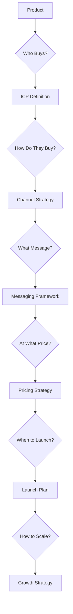
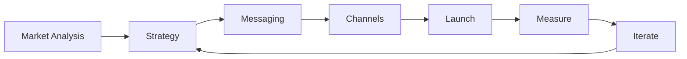
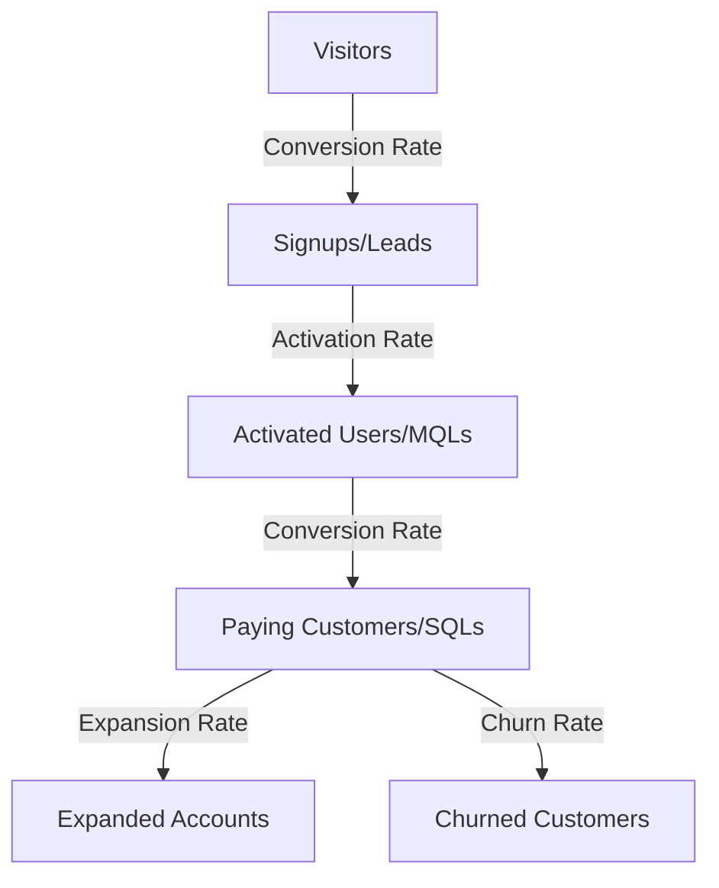

# Go-to-Market Prompts

## Why Go-to-Market Prompts Exist

Go-to-market (GTM) strategy determines how a product reaches its customers. Building a great product is necessary but insufficient — history is filled with superior products that lost to inferior ones with better distribution: Betamax vs VHS, OS/2 vs Windows, Google+ vs Facebook. Marc Andreessen's observation that "the market is the most important factor in a startup's success or failure" underscores that GTM is not an afterthought.

GTM planning is complex because it coordinates multiple teams (product, marketing, sales, customer success, partnerships) across multiple dimensions (messaging, pricing, channels, timing) simultaneously. AI-assisted GTM prompts provide structured frameworks that ensure nothing falls through the cracks while allowing teams to focus their judgment on the strategic decisions that matter most.

::: tip The GTM Equation
$$\text{Revenue} = \text{Reach} \times \text{Conversion Rate} \times \text{Average Deal Size} \times \text{Retention Rate}$$

Every GTM decision should improve at least one of these variables without significantly degrading the others.
:::

## First Principles



### The GTM Motion Types

| Motion | Best For | Sales Cycle | ACV | Customer Acquisition |
|--------|---------|-------------|-----|---------------------|
| Product-Led Growth (PLG) | Self-serve, developer tools | Days | < $10K | Free trial/freemium |
| Sales-Assisted PLG | Mid-market SaaS | Weeks | $10K-$50K | Free trial + sales |
| Inside Sales | Mid-market | Weeks-Months | $25K-$100K | Demo + proposal |
| Field Sales | Enterprise | Months-Year | $100K+ | RFP + multi-stakeholder |
| Channel/Partner | Regulated/niche markets | Varies | Varies | Partner referral |

## Core Mechanics



## Implementation — The Complete Prompt Library

### Category 1: GTM Strategy (5 Prompts)

#### Prompt 1 — Comprehensive GTM Plan

```text
Generate a comprehensive go-to-market plan:

PRODUCT: [Product description]
TARGET MARKET: [Market and customer segments]
TIMELINE: [Launch timeline]
BUDGET: [Marketing and sales budget]
TEAM: [Available resources]
GTM MOTION: [PLG / Sales-led / Hybrid]

## 1. Market Opportunity
- TAM (Total Addressable Market): $[X]
- SAM (Serviceable Addressable Market): $[X]
- SOM (Serviceable Obtainable Market): $[X] (realistic first 3 years)
- Market growth rate: [X]% annually
- Key market trends supporting our timing

## 2. Ideal Customer Profile (ICP)
### Primary ICP
- Company size: [employees, revenue]
- Industry: [verticals]
- Geography: [regions]
- Technology stack: [relevant tech]
- Pain point intensity: [why they need us NOW]
- Budget authority: [who buys, typical budget]
- Decision process: [who's involved, timeline]

### Secondary ICP
[Same structure for secondary segment]

### Buyer Personas
| Persona | Title | Motivation | Objection | Content Preference |
|---------|-------|-----------|----------|-------------------|

## 3. Competitive Positioning
### Positioning Statement
"For [ICP] who [pain point], [Product] is the [category]
that [key differentiator]. Unlike [competitor], we [unique advantage]."

### Category POV
- What category do we create/lead?
- What is our contrarian truth?
- Why now?

## 4. Pricing Strategy
| Tier | Price | Target Customer | Key Features | Value Metric |
|------|-------|----------------|-------------|-------------|

- Pricing model: [per seat / usage / flat rate]
- Free tier/trial: [details]
- Enterprise: [custom pricing approach]
- Discount policy: [when and how much]

## 5. Channel Strategy
| Channel | Role | Investment | Expected CAC | Timeline to Impact |
|---------|------|-----------|-------------|-------------------|
| Content/SEO | Awareness | $X/mo | $Y | 6-12 months |
| Paid search | Demand capture | $X/mo | $Y | 1-3 months |
| Social media | Awareness + community | $X/mo | $Y | 3-6 months |
| Email/nurture | Conversion | $X/mo | $Y | 2-4 months |
| Events/webinars | Pipeline | $X/quarter | $Y | 1-3 months |
| Partnerships | Distribution | $X/quarter | $Y | 6-12 months |
| Sales outbound | Pipeline | $X/mo | $Y | 1-3 months |
| PLG/virality | Organic growth | $X/mo | $Y | 3-6 months |

## 6. Launch Plan
### Pre-Launch (T-4 weeks to T-0)
| Week | Activity | Owner | Deliverable |
|------|---------|-------|------------|

### Launch Week (T-0)
| Day | Activity | Channel | Owner |
|-----|---------|---------|-------|

### Post-Launch (T+1 to T+12 weeks)
| Week | Activity | Metric to Track |
|------|---------|----------------|

## 7. Sales Enablement
- Sales deck
- Demo script
- Battle cards (per competitor)
- Case studies / social proof
- ROI calculator
- Objection handling guide
- Email templates

## 8. Success Metrics
### Leading Indicators (Week 1-4)
| Metric | Target | Measurement |
|--------|--------|-------------|
| Website traffic | +X% | Google Analytics |
| Sign-ups / demo requests | X/week | CRM |
| Feature adoption | X% of signups | Product analytics |

### Lagging Indicators (Month 2-6)
| Metric | Target | Measurement |
|--------|--------|-------------|
| MRR / ARR | $X | Billing system |
| Customer count | X | CRM |
| CAC | < $X | Finance |
| LTV/CAC ratio | > 3:1 | Finance |
| Churn rate | < X% | Product analytics |
| NPS | > 40 | Survey |

## 9. Risks & Mitigations
| Risk | Probability | Impact | Mitigation |
|------|-----------|--------|-----------|

## 10. Budget Allocation
| Category | Monthly Budget | % of Total | Expected ROI |
|----------|-------------|-----------|-------------|
```

#### Prompt 2 — Product-Led Growth (PLG) Strategy

```text
Design a Product-Led Growth strategy:

PRODUCT: [Product description]
CURRENT STATE: [Existing users, if any]
FREE TIER: [What's free, what's paid]

## PLG Flywheel Design

### Acquisition (How users discover and sign up)
| Touchpoint | Mechanism | Metric |
|-----------|----------|--------|
| Organic search | SEO content + product pages | Organic signups |
| Word of mouth | Viral features, sharing | Referral signups |
| Community | Developer community, forums | Community signups |
| Marketplace | App store, integration directory | Marketplace signups |

### Activation (How users reach "aha moment")
- **Aha moment definition**: [What action = activated user]
- **Time to value target**: [< X minutes]
- **Onboarding flow**:
  Step 1: [Immediate value delivery]
  Step 2: [Core feature usage]
  Step 3: [Integration or collaboration]
  Step 4: [Habit formation]

- Activation rate target: > 40% of signups

### Retention (How users keep coming back)
- **Usage triggers**: [What brings users back daily/weekly]
- **Engagement loops**: [Habit-forming features]
- **Notifications**: [Smart, value-adding notifications]
- **Content**: [In-app education, tips]
- Day 1 retention target: > 80%
- Day 7 retention target: > 60%
- Day 30 retention target: > 40%

### Revenue (How free users become paying)
- **Conversion triggers**: [What makes users hit the paywall]
- **Paywall design**: [How limits are communicated]
- **Upgrade path**: [Self-serve upgrade experience]
- **PQL (Product Qualified Lead) definition**: [Behavioral criteria]
- Free-to-paid conversion target: > 5%

### Expansion (How revenue grows per customer)
- **Seat expansion**: [How more users get added]
- **Feature expansion**: [How users discover premium features]
- **Usage expansion**: [How usage naturally grows]
- Net revenue retention target: > 110%

### Referral (How users bring other users)
- **Viral coefficient**: k = (invitations per user) x (acceptance rate)
  Target: k > 0.5 (each user brings 0.5 new users)
- **Referral mechanism**: [How users invite others]
- **Incentive**: [What the referrer and invitee get]
- **Viral loops**: [Features that naturally involve others]

## PLG Metrics Dashboard
| Metric | Formula | Target | Current |
|--------|---------|--------|---------|
| Visitor-to-Signup Rate | Signups / Visitors | > 5% | |
| Activation Rate | Activated / Signups | > 40% | |
| Free-to-Paid Rate | Paid / Free | > 5% | |
| Time to Value | Median time to aha moment | < 5 min | |
| Viral Coefficient | k = invites * acceptance | > 0.5 | |
| DAU/MAU | Daily Active / Monthly Active | > 30% | |
| Net Revenue Retention | NRR | > 110% | |
| Payback Period | CAC / Monthly Revenue | < 12 mo | |
```

#### Prompt 3 — Sales-Led GTM Strategy

```text
Design a sales-led go-to-market strategy:

PRODUCT: [Product description]
ACV TARGET: [Average contract value]
SALES CYCLE: [Expected length]
TARGET BUYER: [Title and organization type]

## Sales Organization Design

### Sales Stages
| Stage | Definition | Exit Criteria | Conversion Rate Target |
|-------|-----------|--------------|----------------------|
| Lead | Contact identified | Qualified via BANT | 20% |
| MQL | Marketing qualified | Sales accepted | 50% |
| SQL | Sales qualified | Discovery call completed | 60% |
| Opportunity | Active evaluation | Proposal sent | 40% |
| Proposal | Proposal reviewed | Verbal agreement | 60% |
| Closed Won | Deal signed | Contract executed | 80% |

### Qualification Framework (MEDDPICC)
| Element | Definition | Questions to Ask |
|---------|-----------|-----------------|
| **M**etrics | Business case quantified | "What metrics will you use to evaluate success?" |
| **E**conomic Buyer | Person with budget authority | "Who approves the budget for this?" |
| **D**ecision Criteria | How they'll evaluate | "What are your top 3 evaluation criteria?" |
| **D**ecision Process | Steps to close | "Walk me through your typical procurement process" |
| **P**aper Process | Legal/procurement | "What does your contract review process look like?" |
| **I**dentified Pain | Specific problem validated | "What is the business impact of this problem today?" |
| **C**hampion | Internal advocate | "Who internally is championing this initiative?" |
| **C**ompetition | Who else they're evaluating | "What other solutions are you considering?" |

### Sales Playbook
For each ICP segment:

#### Outreach Cadence
| Day | Activity | Channel | Template |
|-----|---------|---------|---------|
| 1 | Initial outreach | Email | [template] |
| 3 | Follow-up | LinkedIn | [template] |
| 5 | Value add content | Email | [template] |
| 8 | Phone call | Phone | [script] |
| 12 | Break-up email | Email | [template] |

#### Discovery Call Script
1. Rapport building (2 min)
2. Context gathering (5 min)
3. Pain exploration (10 min)
4. Current solution discussion (5 min)
5. Vision of success (5 min)
6. Product overview (5 min)
7. Next steps (3 min)

#### Demo Script
1. Confirm pain points from discovery
2. Show solution to primary pain (don't show everything)
3. Address secondary pain
4. Show differentiating feature
5. Social proof (similar customer success)
6. Call to action

### Sales Metrics
| Metric | Target | Measurement |
|--------|--------|-------------|
| Pipeline coverage | 3-4x quota | CRM |
| Average deal size | $[X] | CRM |
| Win rate | > 25% | CRM |
| Sales cycle | < [X] days | CRM |
| Quota attainment | > 80% of reps | CRM |
| CAC | < [X] | Finance |
| LTV/CAC | > 3:1 | Finance |
```

#### Prompt 4 — Channel Partner GTM Strategy

```text
Design a channel partner go-to-market strategy:

PRODUCT: [Product description]
TARGET PARTNERS: [Types of partners — resellers, integrators, ISVs]
PARTNER VALUE PROP: [Why partners would sell our product]

## Partner Program Design

### Partner Tiers
| Tier | Requirements | Benefits | Revenue Share |
|------|------------|---------|--------------|
| Registered | Sign agreement | Portal access, NFR license | 10% |
| Certified | 2+ certified staff, 3+ deals | Lead sharing, co-marketing | 20% |
| Premier | 10+ deals/year, dedicated PM | Exclusive territory, MDF | 30% |

### Partner Types
| Type | Role | Value to Us | Example |
|------|------|-----------|---------|
| Reseller | Sell our product | Market reach | IT distributors |
| Technology Partner | Integrate with us | Product value | Complementary SaaS |
| SI/Consultancy | Implement our product | Enterprise access | Big 4, boutique |
| ISV | Build on our platform | Ecosystem | Niche solution builders |
| Referral Partner | Refer leads | Low-cost pipeline | Industry analysts |

### Partner Enablement
| Asset | Description | When Provided |
|-------|-----------|--------------|
| Partner portal | Deal registration, resources | Onboarding |
| Sales training | Product pitch, demo, objection handling | Month 1 |
| Technical training | Implementation, integration | Month 1-2 |
| Certification exam | Validate partner competency | Month 2 |
| Co-selling support | Joint sales calls | Ongoing |
| Marketing materials | Co-brandable collateral | Ongoing |
| Demo environment | Shared demo instances | Onboarding |

### Partner Metrics
| Metric | Target | Timeline |
|--------|--------|----------|
| Partners recruited | X per quarter | |
| Partners activated (first deal) | 50% of recruited | 90 days |
| Partner-sourced pipeline | $X per quarter | |
| Partner-sourced revenue | $X per quarter | |
| Partner satisfaction (NPS) | > 50 | Annual |
```

#### Prompt 5 — International GTM Strategy

```text
Design an international expansion GTM strategy:

PRODUCT: [Product description]
CURRENT MARKETS: [Where you operate today]
TARGET MARKETS: [New markets to enter]
TIMELINE: [Expansion timeline]

## Market Prioritization
| Market | Market Size | Competition | Localization Effort | Regulatory | Priority |
|--------|-----------|-----------|-------------------|-----------|---------|

### Market Entry Scoring Model
$$\text{Priority Score} = \frac{(\text{Market Size} \times \text{Growth Rate}) \times \text{Product Fit}}{(\text{Competition} + \text{Localization Effort} + \text{Regulatory Complexity})}$$

## Market Entry Strategy Per Region

### [Market 1]
**Entry Model**: [Direct / Partner / Hybrid]
**Localization Requirements**:
- Language: [Languages needed]
- Currency: [Local currency support]
- Payment methods: [Local payment methods]
- Compliance: [GDPR, data residency, etc.]
- Cultural: [UI/UX adaptations]

**Go-to-Market Plan**:
| Phase | Duration | Activities | Investment |
|-------|----------|----------|-----------|
| Soft launch | 3 months | Beta users, feedback | $X |
| Market entry | 3 months | Marketing, initial sales | $X |
| Scale | 6 months | Full GTM execution | $X |

**Pricing**:
- Purchasing Power Parity adjustment: [X%]
- Local pricing tiers
- Currency display

**Team**:
- Local hiring plan
- Remote support model
- Partner support

## Cross-Market Coordination
| Function | Centralized | Localized | Reason |
|----------|-----------|----------|--------|
| Product | Core features | Localization | Consistency + relevance |
| Marketing | Brand, positioning | Channels, content | Brand consistency + local reach |
| Sales | Process, tools | Relationships, language | Efficiency + effectiveness |
| Support | Tier 2+, escalation | Tier 1, language | Cost + experience |

## Success Metrics Per Market
| Metric | Month 3 | Month 6 | Month 12 |
|--------|---------|---------|----------|
| Revenue | | | |
| Customers | | | |
| NPS | | | |
| Market awareness | | | |
```

### Category 2: Messaging & Positioning (5 Prompts)

#### Prompt 6 — Messaging Framework

```text
Create a messaging framework:

PRODUCT: [Product description]
TARGET AUDIENCE: [Primary and secondary audiences]
COMPETITIVE CONTEXT: [Key competitors and our differentiation]

## Messaging Hierarchy

### Level 1: Company/Brand Message
**Tagline** (7 words or less): "[Tagline]"
**Elevator Pitch** (30 seconds):
"[Company] helps [audience] [achieve outcome] by [unique approach].
Unlike [alternative], we [key differentiator], so you can [benefit]."

### Level 2: Product Message
**Value Proposition** (one sentence):
"[Product] is the only [category] that [unique capability],
enabling [audience] to [outcome] [X]x faster/better/cheaper."

**Three Pillars of Value**:
| Pillar | Message | Proof Point | Customer Quote |
|--------|---------|------------|---------------|
| [Pillar 1] | [Key message] | [Data/metric] | "[Quote]" |
| [Pillar 2] | [Key message] | [Data/metric] | "[Quote]" |
| [Pillar 3] | [Key message] | [Data/metric] | "[Quote]" |

### Level 3: Persona-Specific Messages
For each persona:

| Persona | Pain Point | Message | CTA |
|---------|-----------|---------|-----|
| [Persona 1] | [Their top pain] | [How we solve it] | [What we want them to do] |
| [Persona 2] | [Their top pain] | [How we solve it] | [What we want them to do] |

### Level 4: Feature Messages
For each key feature:
| Feature | Functional Benefit | Emotional Benefit | Differentiator |
|---------|-------------------|------------------|---------------|
| [Feature 1] | "Do X" | "Feel confident" | "Only product that..." |

## Messaging Don'ts
- Don't say: [Jargon, cliches, or misleading claims]
- Instead say: [Clear, honest alternatives]

## Tone and Voice
| Attribute | We Are | We Are Not | Example |
|-----------|--------|----------|---------|
| Confident | Direct, assured | Arrogant, dismissive | "We deliver..." not "We're the best..." |
| Clear | Simple, precise | Dumbed-down | Technical accuracy in plain language |
| Helpful | Educational, supportive | Condescending | "Here's how..." not "Obviously..." |

## Messaging Testing Plan
| Message Variant | Channel | Test Method | Success Metric |
|----------------|---------|-----------|---------------|
| [Variant A] | Landing page | A/B test | Conversion rate |
| [Variant B] | Email subject | A/B test | Open rate |
| [Variant C] | Ad copy | A/B test | Click-through rate |
```

#### Prompt 7 — Launch Announcement

```text
Write launch announcement content:

PRODUCT/FEATURE: [What's launching]
TARGET AUDIENCE: [Who cares about this]
KEY BENEFIT: [#1 benefit for users]
AVAILABLE: [When and where available]

Generate ALL of these:

## 1. Press Release (400-500 words)
[City, Date] — [Company] today announced [product/feature],
[one-sentence description of what it does and why it matters].
[Quote from CEO/product leader about the vision]
[Key features and benefits — 3 bullet points]
[Customer quote or early results]
[Availability and pricing]
[About company boilerplate]

## 2. Blog Post (800-1000 words)
Title: [Compelling, benefit-focused title]
- Opening: The problem this solves (make it relatable)
- What we built: Feature overview with screenshots
- Why it matters: User benefits, not feature specs
- How it works: Brief walkthrough
- Customer story: Early adopter experience
- What's next: Roadmap teaser
- CTA: Try it now / Learn more

## 3. Email to Existing Customers (200-300 words)
Subject: [Benefit-focused subject line]
Preview: [First line that appears in inbox preview]
Body: Concise announcement with clear CTA

## 4. Social Media Posts
**LinkedIn** (for B2B):
[Professional tone, industry context, business benefit]

**Twitter/X** (announcement):
[Concise, link, relevant hashtags]

**Twitter/X** (thread — 5 tweets):
Tweet 1: Hook/announcement
Tweet 2: Problem we solve
Tweet 3: Key feature/benefit
Tweet 4: Social proof/early results
Tweet 5: CTA with link

## 5. Product Hunt Launch
**Tagline**: [One line, under 60 characters]
**Description**: [Product Hunt description]
**Maker Comment**: [First comment from the maker]

## 6. Internal Announcement (to employees)
Subject: [Exciting, team-focused]
- What we shipped
- Why it matters
- Who made it happen (shout-outs)
- How to talk about it externally
- Where to send feedback

## 7. Sales Email Templates
**For prospects in pipeline**:
Subject + body demonstrating relevance to their needs

**For cold outreach using the news**:
Subject + body using launch as a conversation starter

## 8. Partner Communication
- What they need to know
- How it affects their integration/offering
- Co-marketing opportunity
- Updated materials available
```

#### Prompt 8-10 — Additional Messaging Prompts

Prompts 8-10 cover **Content Marketing Calendar** (mapping content to buyer journey stages), **Sales Deck Framework** (structured investor/customer presentation), and **Case Study Template** (customer success story framework with metrics).

### Category 3: Launch Execution (5 Prompts)

#### Prompt 11 — Launch Checklist Generator

```text
Generate a comprehensive launch checklist:

PRODUCT: [Product/feature launching]
LAUNCH DATE: [Target date]
LAUNCH TYPE: [Major / Minor / Beta / GA]

## T-8 Weeks: Strategy & Planning
- [ ] GTM strategy finalized and approved
- [ ] Pricing finalized and approved
- [ ] Messaging framework complete
- [ ] Launch goals and metrics defined
- [ ] Budget approved
- [ ] Launch team roles assigned

## T-6 Weeks: Content & Assets
- [ ] Blog post drafted and reviewed
- [ ] Press release drafted (if applicable)
- [ ] Product page/landing page designed
- [ ] Demo video recorded
- [ ] Email templates created (customers, prospects, partners)
- [ ] Social media content created
- [ ] Sales deck updated
- [ ] Battle cards updated
- [ ] Help center documentation written
- [ ] API documentation updated (if applicable)
- [ ] Case study/social proof prepared

## T-4 Weeks: Enablement
- [ ] Sales team trained on new feature/product
- [ ] Support team trained on new feature/product
- [ ] CS team briefed on customer communication
- [ ] Partner communication sent
- [ ] Internal all-hands presentation
- [ ] FAQ document distributed
- [ ] Objection handling guide distributed

## T-2 Weeks: Technical Readiness
- [ ] Feature complete and tested
- [ ] Performance testing passed
- [ ] Security review passed
- [ ] Feature flags configured for staged rollout
- [ ] Monitoring and alerting configured
- [ ] Rollback plan documented and tested
- [ ] Data migration completed (if applicable)
- [ ] API documentation live
- [ ] Help center articles published (but hidden)

## T-1 Week: Final Prep
- [ ] Landing page staging review
- [ ] Email sequences scheduled
- [ ] Social media posts scheduled
- [ ] Press/analyst briefings completed
- [ ] Customer advisory board notified
- [ ] All content proofread and approved
- [ ] War room plan for launch day

## T-0: Launch Day
- [ ] Feature flag enabled (staged rollout)
- [ ] Landing page published
- [ ] Blog post published
- [ ] Emails sent
- [ ] Social media published
- [ ] Press release distributed
- [ ] Product Hunt posted (if applicable)
- [ ] Internal announcement sent
- [ ] Monitor metrics dashboard
- [ ] Support team on standby
- [ ] Engineering team on standby

## T+1 Day: Day After
- [ ] Metrics review (traffic, signups, feedback)
- [ ] Support ticket review
- [ ] Bug triage
- [ ] Social media engagement
- [ ] Press coverage monitoring

## T+1 Week: First Week Review
- [ ] Launch metrics vs goals
- [ ] Customer feedback themes
- [ ] Sales team feedback
- [ ] Support team feedback
- [ ] Technical stability review
- [ ] Content performance review
- [ ] Adjust messaging if needed

## T+4 Weeks: Launch Retrospective
- [ ] Full metrics review
- [ ] Win/loss analysis of launch period
- [ ] What went well
- [ ] What to improve
- [ ] Lessons learned documented
```

#### Prompt 12-15 — Launch Execution Prompts

Prompts 12-15 cover **Launch Day War Room Plan** (real-time monitoring and response), **Beta Program Design** (structured beta testing program), **Product Hunt Launch Strategy** (optimizing for Product Hunt launches), and **Developer Launch Strategy** (developer-focused launches with docs, SDKs, and community).

### Category 4: Growth & Scale (5 Prompts)

#### Prompt 16 — Growth Experiment Framework

```text
Design growth experiments for:

PRODUCT: [Product description]
CURRENT METRICS: [Key metrics and current values]
GROWTH GOAL: [What metric to move and by how much]

## Growth Experiment Backlog

### Experiment Template
| Field | Value |
|-------|-------|
| Hypothesis | If we [change], then [metric] will [improve] because [reason] |
| Metric | [Primary metric to measure] |
| Current baseline | [Current value] |
| Target | [Expected improvement] |
| Confidence | [High / Medium / Low] |
| Effort | [S / M / L] |
| ICE Score | Impact (1-10) x Confidence (1-10) x Ease (1-10) |

### Acquisition Experiments
| # | Experiment | ICE Score | Status |
|---|-----------|----------|--------|
| 1 | [SEO: Create 10 comparison landing pages] | [X] | |
| 2 | [Referral: Add in-product referral with $10 credit] | [X] | |
| 3 | [Content: Launch weekly newsletter with tips] | [X] | |
| 4 | [Partnership: Integrate with [popular tool] marketplace] | [X] | |
| 5 | [Paid: Test LinkedIn ads targeting [ICP]] | [X] | |

### Activation Experiments
| # | Experiment | ICE Score | Status |
|---|-----------|----------|--------|
| 1 | [Onboarding: Reduce steps from 7 to 3] | [X] | |
| 2 | [Template: Add 5 pre-built templates] | [X] | |
| 3 | [Guide: Add interactive product tour] | [X] | |
| 4 | [Social: Show activity from similar users] | [X] | |
| 5 | [Quick win: Deliver value in < 2 minutes] | [X] | |

### Retention Experiments
| # | Experiment | ICE Score | Status |
|---|-----------|----------|--------|
| 1 | [Email: Send weekly usage summary] | [X] | |
| 2 | [Feature: Add collaboration features] | [X] | |
| 3 | [Notification: Smart re-engagement triggers] | [X] | |

### Revenue Experiments
| # | Experiment | ICE Score | Status |
|---|-----------|----------|--------|
| 1 | [Pricing: Test 20% price increase] | [X] | |
| 2 | [Upgrade: In-product upgrade prompts at limits] | [X] | |
| 3 | [Annual: Offer 20% annual discount] | [X] | |

## Experiment Execution Process
1. Prioritize by ICE score
2. Design experiment (hypothesis, metric, sample size, duration)
3. Implement (A/B test or before/after)
4. Run for minimum sample size / statistical significance
5. Analyze results
6. Decide: Ship / Iterate / Kill
7. Document learnings

## Statistical Rigor
- Minimum sample size per variant: [calculate using power analysis]
- Confidence level: 95% (p < 0.05)
- Minimum detectable effect: [X%]
- Test duration: [minimum X days to account for weekly patterns]
- One primary metric per experiment (avoid p-hacking)
```

#### Prompt 17-20 — Growth Prompts

Prompts 17-20 cover **Customer Onboarding Optimization** (reducing time-to-value), **Expansion Revenue Strategy** (upsell, cross-sell, land-and-expand), **Community Building Strategy** (developer/user community), and **Customer Advocacy Program** (turning customers into advocates).

### Category 5: Measurement & Optimization (5 Prompts)

#### Prompt 21 — GTM Metrics Dashboard

```text
Design a GTM metrics dashboard:

BUSINESS MODEL: [SaaS / Marketplace / Transaction-based]
GTM MOTION: [PLG / Sales-led / Hybrid]
STAGE: [Pre-revenue / Early revenue / Growth / Scale]

## Funnel Metrics


### Acquisition Metrics
| Metric | Definition | Target | Source |
|--------|-----------|--------|--------|
| Website visitors | Unique monthly visitors | X | GA |
| Visitor-to-signup rate | Signups / Visitors | X% | GA + Product |
| CAC (blended) | Total marketing+sales spend / New customers | $X | Finance |
| CAC (by channel) | Channel spend / Channel customers | $X | Attribution |
| Payback period | CAC / Monthly revenue per customer | X months | Finance |

### Activation Metrics
| Metric | Definition | Target | Source |
|--------|-----------|--------|--------|
| Activation rate | Users reaching aha moment / Total signups | X% | Product |
| Time to value | Median time from signup to aha moment | X min | Product |
| Onboarding completion | Users completing onboarding / Total signups | X% | Product |

### Revenue Metrics
| Metric | Definition | Target | Source |
|--------|-----------|--------|--------|
| MRR | Monthly recurring revenue | $X | Billing |
| ARR | Annual recurring revenue | $X | Billing |
| Net New ARR | New + Expansion - Contraction - Churn | $X | Billing |
| ARPU | Revenue / Customers | $X | Billing |
| Net Revenue Retention | (Start MRR + Expansion - Contraction - Churn) / Start MRR | X% | Billing |

### Efficiency Metrics
| Metric | Definition | Target | Source |
|--------|-----------|--------|--------|
| LTV/CAC ratio | Customer lifetime value / Acquisition cost | > 3:1 | Finance |
| Magic Number | Net New ARR / Prior Quarter Sales+Marketing Spend | > 0.75 | Finance |
| Burn Multiple | Net Burn / Net New ARR | < 2x | Finance |
| Rule of 40 | Revenue Growth % + Free Cash Flow Margin % | > 40% | Finance |

### Engagement Metrics
| Metric | Definition | Target | Source |
|--------|-----------|--------|--------|
| DAU/MAU | Daily active / Monthly active | > 30% | Product |
| Feature adoption | Users using key feature / Total users | > 50% | Product |
| NPS | Net Promoter Score | > 40 | Survey |

## Dashboard Design
### Executive Dashboard (reviewed weekly)
[Top 5 metrics with trends]

### Marketing Dashboard (reviewed daily)
[Channel-specific metrics]

### Sales Dashboard (reviewed daily)
[Pipeline and conversion metrics]

### Product Dashboard (reviewed weekly)
[Usage and engagement metrics]
```

#### Prompt 22-25 — Measurement Prompts

Prompts 22-25 cover **A/B Testing Strategy** (systematic testing framework), **Customer Journey Analytics** (mapping and measuring the full customer journey), **GTM Retrospective** (post-launch review and learnings), and **Quarterly GTM Planning** (quarterly review and planning cycle).

## Edge Cases & Failure Modes

::: danger GTM Anti-Patterns
1. **Build It and They Will Come**: No product succeeds without active distribution.
2. **Premature Scaling**: Scaling GTM before product-market fit wastes money.
3. **One-Channel Dependence**: Relying on a single channel is fragile.
4. **Feature-Led Messaging**: Talking about features instead of outcomes.
5. **Ignoring Unit Economics**: Growing revenue while losing money per customer.
:::

::: info War Story
A B2B SaaS company launched with a sales-led GTM motion, hiring 5 sales reps before reaching $1M ARR. Their average deal size was $5K/year — too small for sales-led economics. CAC was $15K, meaning each customer took 3 years to pay back. After analyzing their GTM metrics (similar to Prompt 21), they pivoted to PLG, redesigned their free tier using Prompt 2, and reached $3M ARR within 12 months with a CAC under $500. The lesson: GTM motion must match unit economics. Use the metrics frameworks in this section to validate your approach before scaling it.
:::

## Performance Characteristics

$$\text{GTM Efficiency} = \frac{\text{Net New ARR}}{\text{GTM Spend}} = \text{Magic Number}$$

A Magic Number > 0.75 indicates efficient GTM spend. Below 0.5 suggests the GTM motion needs fundamental changes.

| GTM Stage | Focus | Key Metric | Target |
|-----------|-------|-----------|--------|
| Pre-PMF | Learning | Qualitative feedback | 10 passionate users |
| Early Revenue | Repeatability | Sales cycle consistency | Win rate > 25% |
| Growth | Scaling | CAC payback period | < 18 months |
| Scale | Efficiency | LTV/CAC ratio | > 3:1 |

## Mathematical Foundations

### SaaS Unit Economics

$$\text{LTV} = \frac{\text{ARPU} \times \text{Gross Margin}}{\text{Monthly Churn Rate}}$$

$$\text{LTV/CAC Ratio} = \frac{\text{LTV}}{\text{CAC}} \geq 3$$

$$\text{Payback Period} = \frac{\text{CAC}}{\text{ARPU} \times \text{Gross Margin}} \leq 18 \text{ months}$$

### Viral Coefficient

$$k = i \times c$$

Where $i$ is the number of invitations per user and $c$ is the conversion rate of invitations. If $k > 1$, growth is self-sustaining (viral). If $k > 0.5$, virality significantly amplifies paid acquisition.

## Decision Framework

| Question | Prompt to Use |
|----------|-------------|
| What's our overall GTM plan? | Prompt 1 (Comprehensive GTM Plan) |
| Should we be PLG or sales-led? | Prompt 2 or 3 (based on ACV) |
| How to message our product? | Prompt 6 (Messaging Framework) |
| How to announce our launch? | Prompt 7 (Launch Announcement) |
| What's our launch checklist? | Prompt 11 (Launch Checklist) |
| How to grow faster? | Prompt 16 (Growth Experiments) |
| How to measure GTM success? | Prompt 21 (Metrics Dashboard) |

## Cross-References

- [PRD Prompts](./prd-prompts.md) — Product definition feeds GTM strategy
- [Competitive Analysis Prompts](./competitive-analysis-prompts.md) — Competitive positioning for GTM
- [User Story Prompts](./user-story-prompts.md) — PLG features as user stories
- [System Design Prompts](../architecture-prompts/system-design-prompts.md) — Technical GTM requirements
- [Design System Prompts](../ui-prompts/design-system-prompts.md) — Landing page and marketing design
