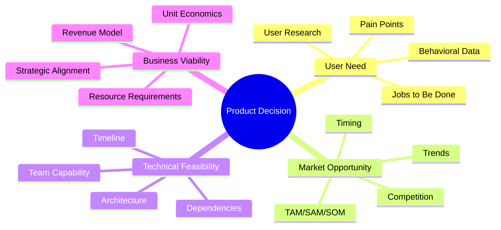
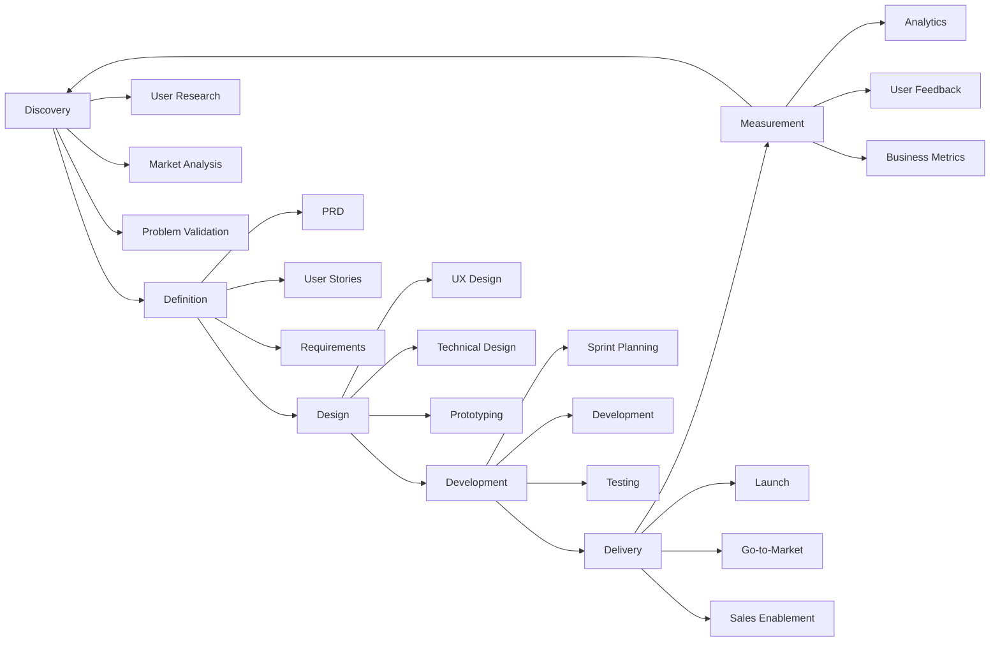
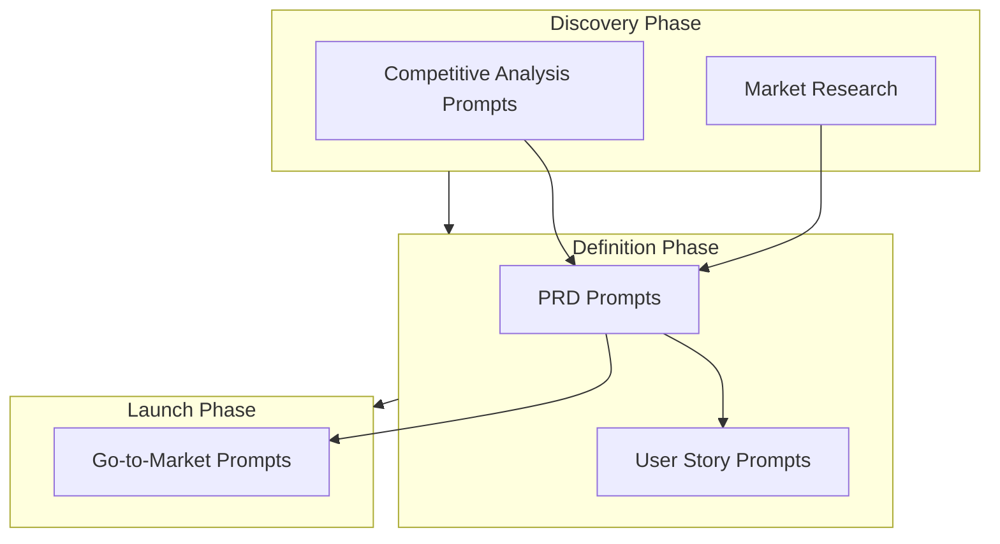
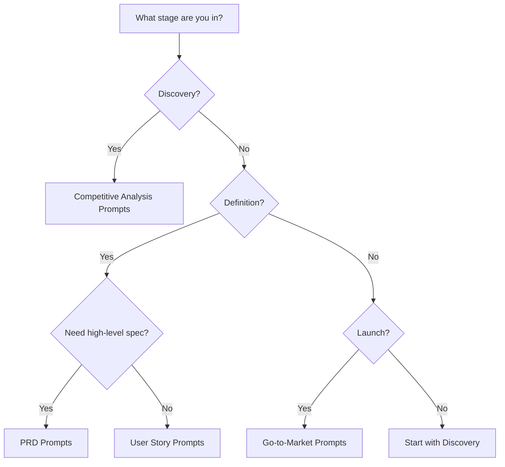

# Product Prompts Overview

## Why Product Prompts Exist

Product management sits at the intersection of business strategy, user experience, and engineering capability. A product manager must synthesize input from customers, stakeholders, market data, and technical constraints into clear specifications that engineering teams can execute. This synthesis is cognitively demanding and error-prone — important requirements get missed, edge cases are overlooked, and assumptions go unstated.

The history of product management traces from Hewlett-Packard's formalization of the PM role in the 1930s through Marty Cagan's "Inspired" (2008), which defined the modern product manager as responsible for value, usability, feasibility, and viability. Today's PM must also navigate AI/ML products, platform economics, privacy regulations, and global scale.

AI-assisted product prompts solve three fundamental challenges:

1. **Completeness** — Prompts encode comprehensive checklists that ensure no critical section is missed in product documents
2. **Consistency** — Teams using the same prompts produce documents with consistent structure, making review and comparison easier
3. **Speed** — First drafts that would take days can be produced in hours, freeing PMs to focus on judgment and decision-making

::: warning Important Distinction
AI-generated product artifacts are first drafts, not finished products. They require validation against real user research, business context, and technical feasibility. The prompts encode structure and coverage; the PM provides judgment and domain expertise.
:::

## First Principles of Product Management

Product management is fundamentally about **making bets under uncertainty**. Every product decision is a hypothesis:

$$
\text{Product Decision} = f(\text{User Need}, \text{Market Opportunity}, \text{Technical Feasibility}, \text{Business Viability})
$$

The quality of a product decision depends on the quality of information in each dimension:



### The Product Development Lifecycle



## Core Mechanics of Product Prompts

Product prompts operate at different levels of the product development lifecycle. Each prompt type serves a specific purpose:



### Prompt Quality Framework

Every product prompt should produce output that scores well on these dimensions:

| Dimension | What It Means | How to Verify |
|-----------|--------------|---------------|
| **Completeness** | All necessary sections present | Checklist review |
| **Specificity** | Measurable success criteria, not vague goals | Numbers present |
| **Feasibility** | Technically achievable with stated resources | Engineering review |
| **Testability** | Can verify if requirements are met | QA can write tests |
| **Priority** | Clear relative importance of features | MoSCoW or similar |
| **Traceability** | Requirements link to user needs | Need-to-feature mapping |

## Implementation — Prompt Categories

### PRD Prompts

Product Requirements Documents are the foundational artifacts of product development. The [PRD Prompts](./prd-prompts.md) section contains 25+ prompts for generating comprehensive PRDs, including:

- **Full PRD generation** — Complete product requirements from a brief description
- **Section-specific prompts** — Deep dives into goals, user personas, requirements
- **PRD review prompts** — Systematic review of existing PRDs for completeness
- **Technical PRD** — PRDs optimized for engineering consumption
- **Executive PRD** — Concise PRDs for leadership review

### User Story Prompts

User stories translate product requirements into development-ready work items. The [User Story Prompts](./user-story-prompts.md) section contains 25+ prompts for:

- **Story generation** — Creating user stories from PRDs or feature descriptions
- **Acceptance criteria** — Detailed, testable acceptance criteria
- **Story splitting** — Breaking epics into implementable stories
- **Edge case stories** — Identifying and documenting edge cases
- **Technical stories** — Non-functional requirements as user stories

### Competitive Analysis Prompts

Understanding the competitive landscape is essential for product positioning. The [Competitive Analysis Prompts](./competitive-analysis-prompts.md) section contains 25+ prompts for:

- **Competitor identification** — Finding direct and indirect competitors
- **Feature comparison** — Systematic feature-by-feature analysis
- **Positioning analysis** — Market positioning and differentiation
- **SWOT analysis** — Strengths, weaknesses, opportunities, threats
- **Pricing analysis** — Competitive pricing strategy

### Go-to-Market Prompts

Launching a product requires coordinated strategy across marketing, sales, and product. The [Go-to-Market Prompts](./go-to-market-prompts.md) section contains 25+ prompts for:

- **Launch planning** — Comprehensive go-to-market plans
- **Messaging framework** — Value propositions, positioning statements
- **Channel strategy** — Distribution and marketing channels
- **Sales enablement** — Sales collateral, battle cards, demo scripts
- **Launch metrics** — KPI definition and tracking

## Edge Cases & Failure Modes

### When Product Prompts Fail

| Failure Mode | Cause | Prevention |
|-------------|-------|------------|
| **Generic output** | Prompt lacks domain context | Include industry, market, and user context |
| **Unrealistic scope** | No constraints provided | Specify timeline, team size, budget |
| **Missing stakeholders** | Prompt doesn't mention them | List all stakeholders explicitly |
| **Technical impossibility** | No engineering input | Include technical constraints |
| **Market disconnection** | No real user data | Validate against actual user research |

::: danger Critical Warning
The most dangerous failure mode is treating AI-generated product documents as truth. These documents are hypotheses that need validation. Never skip user research because "the AI already figured it out." AI generates plausible-sounding product strategy that may be completely disconnected from actual user needs.
:::

### Common Mistakes in Product Prompting

1. **Asking for a PRD without context**: "Write a PRD for a todo app" produces generic output. Include target users, market context, competitive landscape, and constraints.

2. **Skipping the discovery phase**: Jumping straight to PRD prompts without first using competitive analysis and user research prompts.

3. **Ignoring negative requirements**: Not specifying what the product should NOT do is as important as what it should do.

4. **Treating output as final**: The first draft is a starting point. It needs iteration with real stakeholder input.

## Performance Characteristics

| Prompt Type | Input Detail Required | Generation Time | Review Time | Iteration Cycles |
|-------------|----------------------|-----------------|-------------|-----------------|
| PRD (full) | High (3-5 pages of context) | 5-15 min | 4-8 hours | 3-5 |
| User Stories | Medium (PRD + tech context) | 3-10 min | 2-4 hours | 2-3 |
| Competitive Analysis | Medium (market context) | 5-15 min | 2-4 hours | 1-2 |
| Go-to-Market | High (full product context) | 10-20 min | 8-16 hours | 3-5 |

The value of product prompts follows a diminishing returns curve:

$$
V(t) = V_{max} \cdot (1 - e^{-\lambda t})
$$

Where $t$ is the time invested in prompt refinement, $V_{max}$ is the maximum value achievable, and $\lambda$ reflects how quickly you reach useful output. Typically, 80% of the value comes from the first 20% of prompt refinement.

## Mathematical Foundations

### Feature Prioritization Models

Product prompts often need to apply prioritization frameworks. The most commonly used models:

**RICE Score**:

$$
\text{RICE} = \frac{\text{Reach} \times \text{Impact} \times \text{Confidence}}{\text{Effort}}
$$

**Weighted Shortest Job First (WSJF)**:

$$
\text{WSJF} = \frac{\text{Cost of Delay}}{\text{Job Duration}}
$$

Where Cost of Delay = User-Business Value + Time Criticality + Risk Reduction/Opportunity Enablement.

**Expected Value**:

$$
E[V] = \sum_{i=1}^{n} P(s_i) \cdot V(s_i)
$$

Where $P(s_i)$ is the probability of scenario $i$ occurring and $V(s_i)$ is the value in that scenario.

::: info War Story
A B2B SaaS company used AI prompts to generate their annual product roadmap. The prompts produced a compelling 30-feature roadmap with detailed PRDs for each feature. The problem: the prompts were fed market research from the previous year, and the AI didn't know that their largest competitor had just announced the same three features that were at the top of their roadmap. A competitive analysis prompt run with current data would have identified this immediately and shifted priority to differentiation features instead. They lost 6 months building commodity features that didn't differentiate. Lesson: AI prompts are only as good as the context you provide, and context must be current.
:::

## Decision Framework

### Which Prompt to Use When



### Prompt Sequencing

For a complete product lifecycle, use prompts in this order:

1. **Market Analysis** — Competitive analysis prompts to understand the landscape
2. **Problem Definition** — PRD prompts (problem section) to articulate the problem
3. **Solution Definition** — PRD prompts (solution section) to define the approach
4. **Story Breakdown** — User story prompts to create development-ready work
5. **Launch Planning** — Go-to-market prompts to plan the launch
6. **Measurement** — PRD prompts (success metrics) to define what to measure

Each stage feeds into the next. Outputs from competitive analysis inform the PRD. The PRD informs user stories. The PRD and competitive analysis inform go-to-market strategy.

## Advanced Topics

### Multi-Product Portfolio Prompting

For companies with multiple products, prompts must account for:

- **Cannibalization risk** — Does the new product compete with existing ones?
- **Platform leverage** — Can shared infrastructure reduce development cost?
- **Cross-sell opportunities** — How does the new product create upsell paths?
- **Resource allocation** — How to balance investment across products?

### AI-Native Product Management

The emerging practice of AI-native product management uses AI not just for document generation but for:

- **Continuous user research synthesis** — AI processes user feedback at scale
- **Automated competitive monitoring** — AI tracks competitor changes in real-time
- **Predictive prioritization** — AI predicts feature impact based on historical data
- **Dynamic roadmapping** — AI adjusts roadmap based on new information

```typescript
interface AIProductManagement {
  // Continuous inputs
  userFeedback: UserFeedbackStream;
  competitorChanges: CompetitorMonitorStream;
  usageAnalytics: AnalyticsStream;
  marketSignals: MarketSignalStream;

  // AI-assisted decisions
  prioritizeBacklog(): PrioritizedBacklog;
  generatePRD(featureIdea: string): PRD;
  assessMarketFit(concept: ProductConcept): MarketFitScore;
  forecastAdoption(feature: Feature): AdoptionForecast;
}
```

### Product Analytics Integration

Product prompts can be enhanced with real analytics data:

```typescript
// Feed real metrics into prompts for data-driven documents
const contextForPrompt = {
  currentMetrics: {
    monthlyActiveUsers: 50000,
    dailyActiveUsers: 12000,
    churnRate: 0.05,
    nps: 42,
    revenuePerUser: 29.99,
    topRequestedFeatures: ['collaboration', 'mobile-app', 'api-access'],
    topChurnReasons: ['missing-feature-X', 'price', 'complexity'],
  },
  competitorMetrics: {
    // From competitive analysis
  },
  marketMetrics: {
    tamSize: 5_000_000_000,
    growthRate: 0.15,
    trends: ['AI-first', 'mobile-native', 'vertical-specific'],
  },
};
```

## Cross-References

- [PRD Prompts](./prd-prompts.md) — Detailed PRD generation prompts
- [User Story Prompts](./user-story-prompts.md) — Story writing and refinement
- [Competitive Analysis Prompts](./competitive-analysis-prompts.md) — Market and competitor research
- [Go-to-Market Prompts](./go-to-market-prompts.md) — Launch and growth strategy
- [System Design Prompts](../architecture-prompts/system-design-prompts.md) — Technical feasibility
- [Architecture Review Prompts](../engineering-prompts/architecture-review-prompts.md) — Technical review
