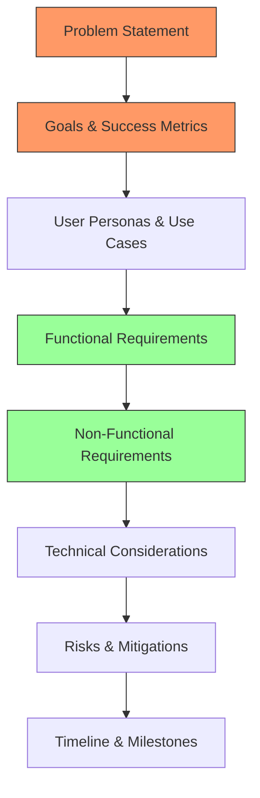
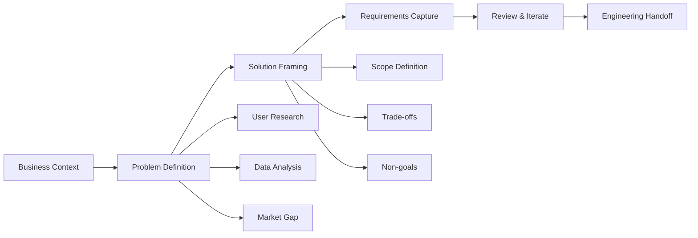
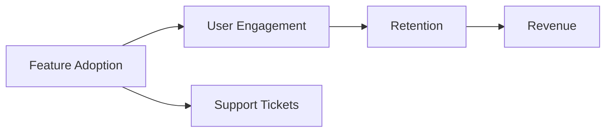
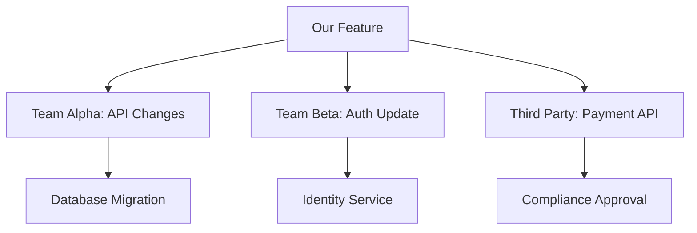
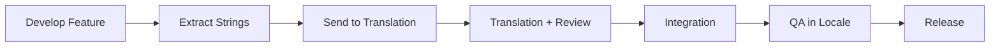

# PRD Writing Prompts

## Why PRD Prompts Exist

The Product Requirements Document is the contract between product, design, and engineering. A poorly written PRD leads to scope creep, misaligned expectations, rework, and ultimately product failure. Studies from the Standish Group show that incomplete requirements are a leading cause of project failure, contributing to 13.1% of challenged projects.

Historically, PRDs evolved from formal Software Requirements Specifications (SRS) documents used in waterfall development. The modern PRD is lighter, more iterative, and focused on outcomes rather than outputs. Companies like Google, Meta, and Stripe have published their internal PRD templates, revealing a convergence around key sections: problem statement, goals, user personas, functional requirements, success metrics, and risks.

AI-assisted PRD writing addresses three persistent problems:

1. **Section amnesia** — PMs forget to include critical sections (security requirements, rollback plans, success metrics)
2. **Vague requirements** — "The system should be fast" instead of "P95 latency under 200ms for authenticated API calls"
3. **Assumption blindness** — Unstated assumptions that cause engineering to build the wrong thing

::: tip
The best PRD is the shortest one that completely and unambiguously communicates what needs to be built, why, and how success is measured. AI prompts help achieve completeness without sacrificing clarity.
:::

## First Principles of PRD Writing

A PRD answers five fundamental questions:

$$
\text{PRD} = \text{Why?} + \text{What?} + \text{For Whom?} + \text{How to Measure?} + \text{What Could Go Wrong?}
$$



### The PRD Quality Equation

$$
Q_{PRD} = \frac{\text{Decisions Enabled}}{\text{Ambiguity Remaining}} \times \frac{\text{Questions Answered}}{\text{Questions Raised}}
$$

A high-quality PRD enables many decisions while leaving few ambiguities.

## Core Mechanics



## Implementation — The Complete Prompt Library

### Category 1: Full PRD Generation (5 Prompts)

#### Prompt 1 — Complete PRD from Product Brief

```text
You are a senior product manager at a technology company.
Generate a comprehensive Product Requirements Document based on this brief:

PRODUCT BRIEF:
[Paste 1-3 paragraph product description]

COMPANY CONTEXT:
- Company stage: [Startup / Growth / Enterprise]
- Industry: [e.g., FinTech, HealthTech, SaaS, E-commerce]
- Team size: [Engineering team size]
- Timeline: [Expected timeline]
- Budget constraints: [If any]

Generate a complete PRD with these sections:

## 1. Executive Summary
- One paragraph summarizing the product/feature
- Key business driver
- Expected impact

## 2. Problem Statement
- What problem exists today?
- Who experiences this problem? (with data/evidence)
- What is the cost of the problem? (revenue, time, satisfaction)
- Why now? What has changed to make this worth solving?

## 3. Goals & Objectives
- Primary goal (one sentence)
- Secondary goals (2-3)
- Anti-goals (what this is explicitly NOT trying to achieve)
- Success metrics with specific targets:
  | Metric | Current | Target | Timeline |

## 4. User Personas
For each persona (2-3):
- Name, role, demographics
- Goals and motivations
- Pain points
- Current workarounds
- Technical sophistication
- Quote that captures their frustration

## 5. User Journeys
For the primary user journey:
- Step-by-step flow with decision points
- Happy path and alternate paths
- Error states and recovery
- Emotional journey (frustration -> satisfaction)

## 6. Functional Requirements
Organized by priority (MoSCoW):
### Must Have (P0)
| ID | Requirement | User Story | Acceptance Criteria |

### Should Have (P1)
| ID | Requirement | User Story | Acceptance Criteria |

### Could Have (P2)
| ID | Requirement | User Story | Acceptance Criteria |

### Won't Have (this version)
List explicitly deferred features with rationale.

## 7. Non-Functional Requirements
- Performance: latency, throughput targets
- Scalability: expected growth, scaling requirements
- Security: authentication, authorization, data protection
- Accessibility: WCAG compliance level
- Internationalization: language, locale support
- Reliability: uptime target, error budget

## 8. Technical Considerations
- System dependencies
- Data model changes
- API changes
- Migration requirements
- Feature flags needed
- Backward compatibility

## 9. Design Requirements
- Key UI/UX principles for this feature
- Design constraints
- Required design deliverables
- Prototype/mockup references

## 10. Analytics & Instrumentation
- Events to track
- Funnels to measure
- A/B test plan
- Dashboard requirements

## 11. Risks & Mitigations
| Risk | Probability | Impact | Mitigation |

## 12. Dependencies & Assumptions
- Internal dependencies
- External dependencies
- Assumptions (explicit)

## 13. Timeline & Milestones
| Milestone | Description | Target Date | Dependencies |

## 14. Open Questions
List questions that need answers before or during development.

## 15. Appendix
- Related documents
- Research references
- Competitive analysis references
```

#### Prompt 2 — Lean PRD (MVP Focus)

```text
Generate a lean PRD focused on validating a hypothesis:

HYPOTHESIS: [State the hypothesis to validate]
TARGET USER: [Who are you building for?]
TIMELINE: [2-4 week sprint]
TEAM: [Small team — 2-3 engineers, 1 designer]

The PRD should be exactly 2 pages (no more) and contain ONLY:

1. **Hypothesis** (2 sentences):
   We believe that [target users] have [problem].
   We will validate this by building [solution] and measuring [metric].

2. **Success/Failure Criteria** (binary, measurable):
   SUCCESS: [specific metric] reaches [threshold] within [timeframe]
   FAILURE: [specific metric] below [threshold] after [timeframe]
   LEARNING: Regardless of outcome, we will learn [what]

3. **Scope** (ruthlessly minimal):
   BUILD: [3-5 things to build, no more]
   SKIP: [things explicitly NOT built yet]
   FAKE: [things that can be manual/mockup for now]

4. **User Flow** (one flow only):
   Step 1 -> Step 2 -> Step 3 -> Step 4 -> Done
   Maximum 7 steps. No branching.

5. **Data to Collect**:
   | Event | When Triggered | What We Learn |

6. **Decision Framework**:
   If SUCCESS: Next steps (expand, scale, invest)
   If FAILURE: Next steps (pivot, kill, modify hypothesis)
   If AMBIGUOUS: What additional data to collect

DO NOT include:
- Detailed technical architecture
- Multi-phase roadmaps
- Comprehensive edge cases
- Multiple user personas
- Internationalization
- Performance optimization

This is an experiment, not a product. Build the minimum needed to learn.
```

#### Prompt 3 — Technical PRD (Engineering-Focused)

```text
Generate a technical PRD for engineering consumption:

FEATURE: [Feature description]
SYSTEM CONTEXT: [Current architecture overview]
CODEBASE: [Technology stack]

This PRD is written FOR engineers BY a PM who understands technology.
Focus on technical clarity, not business narrative.

## Problem
- What user behavior or system behavior needs to change?
- What are the current technical limitations?

## Solution Overview
- High-level approach (1-2 paragraphs)
- Architecture diagram (describe for Mermaid rendering)
- Key technical decisions to make

## API Changes
### New Endpoints
| Method | Path | Request Body | Response | Auth | Rate Limit |

### Modified Endpoints
| Method | Path | What Changes | Migration |

### Deprecated Endpoints
| Method | Path | Sunset Date | Replacement |

## Data Model Changes
- New tables/collections
- Modified fields (with migration strategy)
- Index changes
- Data volume projections

## System Behavior
### State Machine (if applicable)
[Describe states and transitions]

### Event Flow
[Describe events published and consumed]

### Integration Points
| System | Protocol | Direction | Data Exchanged |

## Non-Functional Requirements
| Requirement | Target | How to Measure | Current Baseline |
|------------|--------|---------------|-----------------|
| P99 Latency | < 200ms | APM dashboard | 150ms |
| Throughput | > 1000 rps | Load test | 500 rps |
| Availability | 99.95% | SLO dashboard | 99.9% |
| Error Rate | < 0.1% | Error tracking | 0.05% |

## Feature Flags
| Flag Name | Description | Default | Rollout Plan |

## Testing Strategy
- Unit test focus areas
- Integration test requirements
- Load test scenarios
- Manual QA test plan

## Rollout Plan
| Phase | Scope | Duration | Success Criteria | Rollback Trigger |

## Monitoring
- New metrics to create
- New alerts to configure
- Dashboard changes
- On-call impact

## Security Considerations
- New attack surface
- Authentication/authorization changes
- Data privacy impact
- Compliance implications

## Open Technical Questions
| Question | Who Answers | Deadline | Impact if Unresolved |
```

#### Prompt 4 — Executive PRD (Leadership Summary)

```text
Generate a concise executive PRD for leadership review:

FEATURE: [Feature description]
STRATEGIC CONTEXT: [How this fits into company strategy]
INVESTMENT ASK: [Team size, timeline, infrastructure costs]

This PRD is for executives who need to:
1. Understand the opportunity quickly (< 5 minute read)
2. Approve resource allocation
3. Understand risks and trade-offs

FORMAT: Maximum 2 pages. No technical jargon.

## Opportunity (3 sentences max)
What market opportunity or customer pain point are we addressing?
What is the revenue/growth impact?
Why now?

## Proposal (3 sentences max)
What are we building?
How does it solve the problem?
What makes our approach unique?

## Business Case
| Metric | Current | Projected | Timeline |
|--------|---------|-----------|----------|
| Revenue Impact | | | |
| Customer Acquisition | | | |
| Customer Retention | | | |
| Operational Cost | | | |

## Investment Required
| Resource | Amount | Duration |
|----------|--------|----------|
| Engineering | X engineers | Y months |
| Design | X designers | Y months |
| Infrastructure | $X/month | Ongoing |
| Total Cost | $X | |

## ROI Calculation
- Investment: $[total cost]
- Expected return (Year 1): $[revenue impact]
- Payback period: [months]
- 3-year NPV: $[value]

## Risk Summary
| Risk | Likelihood | Impact | Mitigation |

Top risk: [One sentence on biggest risk and how it's managed]

## Competitive Urgency
- Who else is building this? What's their timeline?
- What happens if we don't build this?
- What is our window of opportunity?

## Decision Requested
- [ ] Approve full investment ($X for Y months)
- [ ] Approve Phase 1 only ($X for Y months) with Phase 2 decision at [date]
- [ ] Reject (specify concerns for revision)

## Timeline
| Milestone | Date | Go/No-Go Decision? |
```

#### Prompt 5 — PRD Review Checklist

```text
Review the following PRD for completeness and quality:

[PASTE PRD HERE]

Score each section on a scale of 1-5:
5 = Excellent — Clear, complete, actionable
4 = Good — Mostly complete, minor gaps
3 = Adequate — Present but needs improvement
2 = Weak — Significant gaps or ambiguity
1 = Missing/Critical — Section absent or fundamentally flawed

## Completeness Check
| Section | Present? | Score | Issues |
|---------|----------|-------|--------|
| Executive Summary | | | |
| Problem Statement | | | |
| Goals & Success Metrics | | | |
| User Personas | | | |
| User Journeys | | | |
| Functional Requirements (MoSCoW) | | | |
| Non-Functional Requirements | | | |
| Technical Considerations | | | |
| Security Requirements | | | |
| Analytics Plan | | | |
| Risks & Mitigations | | | |
| Timeline | | | |
| Open Questions | | | |

## Quality Check
For each present section:

1. **Problem Statement**:
   - Is it user-centric (not solution-centric)?
   - Is there data supporting the problem exists?
   - Is the cost of the problem quantified?
   - Is "Why now?" answered?

2. **Goals**:
   - Are goals SMART (Specific, Measurable, Achievable, Relevant, Time-bound)?
   - Are anti-goals defined (what this is NOT)?
   - Are success metrics linked to business outcomes?

3. **Requirements**:
   - Is each requirement testable?
   - Are requirements prioritized?
   - Are dependencies between requirements identified?
   - Are edge cases covered?

4. **Assumptions**:
   - Are assumptions explicitly stated?
   - Which assumptions are risky?
   - What happens if key assumptions are wrong?

5. **Risks**:
   - Are technical risks identified?
   - Are market risks identified?
   - Are timeline risks identified?
   - Does each risk have a mitigation?

## Critical Issues
List any issues that should block approval:
1. [Issue description — why it's critical]

## Improvement Recommendations
List suggested improvements in priority order:
1. [Recommendation with specific guidance]

## Overall Score: [X/100]
Recommendation: [Approve / Approve with Changes / Revise and Resubmit]
```

### Category 2: Section-Specific Prompts (8 Prompts)

#### Prompt 6 — Problem Statement Generator

```text
Help me write a compelling problem statement for my PRD:

DOMAIN: [Industry/domain]
USER: [Who experiences the problem]
OBSERVATION: [What you've observed or heard from users]

Generate a problem statement following this structure:

1. **Current State** (What exists today):
   Describe the current situation. Be specific about current workflows,
   tools, and pain points. Use data where available.

2. **Problem** (What's wrong with the current state):
   Articulate the specific pain point. Quantify it:
   - How much time is wasted?
   - How much money is lost?
   - How many users are affected?
   - What is the error rate / failure rate?

3. **Impact** (Why it matters):
   Connect the problem to business outcomes:
   - Revenue impact
   - Customer satisfaction impact (NPS, CSAT)
   - Competitive disadvantage
   - Operational cost

4. **Root Cause** (Why the problem exists):
   Not symptoms, but underlying causes.
   Use the "5 Whys" technique if applicable.

5. **Why Now** (What has changed):
   - Market change (new competitor, regulation, trend)
   - Technology change (new capability available)
   - Scale change (problem got worse with growth)
   - Customer demand (frequency of requests)

6. **Who Is Affected** (Segmentation):
   | User Segment | Problem Severity | Frequency | Current Workaround |

Anti-patterns to avoid:
- Don't describe the solution in the problem statement
- Don't use jargon only your team understands
- Don't make claims without data
- Don't conflate multiple problems into one
```

#### Prompt 7 — User Persona Generator

```text
Generate detailed user personas for this product:

PRODUCT: [Product description]
TARGET MARKET: [Market description]
EXISTING USER DATA: [Any data you have — surveys, interviews, analytics]

Create 3 personas (primary, secondary, edge case):

FOR EACH PERSONA:

## [Persona Name] — [One-line Role Description]

### Demographics
- Age range: [range]
- Job title: [title]
- Company size: [size]
- Industry: [industry]
- Technical sophistication: [1-5 scale]
- Annual budget authority: [amount]

### Background Story (3 sentences)
[Brief narrative that makes this persona feel like a real person]

### Goals
1. Primary goal: [What they're trying to achieve]
2. Secondary goal: [What else they care about]
3. Hidden goal: [What they won't say but secretly want]

### Pain Points
1. [Most painful problem] — Impact: [quantified]
2. [Second most painful] — Impact: [quantified]
3. [Third most painful] — Impact: [quantified]

### Current Solution
- Tools they use today: [list]
- Workarounds they've built: [description]
- What they like about current tools: [strengths]
- What frustrates them: [weaknesses]

### Decision-Making Process
- How do they discover new tools?
- Who influences their decisions?
- What is their evaluation criteria? (prioritized)
- What is their buying process?
- What would make them switch from current solution?

### A Day in Their Life
- Morning: [relevant activities]
- Midday: [relevant activities]
- Afternoon: [relevant activities]
- How our product fits: [when they would use it]

### Representative Quote
> "[A quote that captures their primary frustration or desire]"

### Success Scenario
"[Persona name] would consider our product successful if [specific outcome]
within [timeframe] of starting to use it."

### Anti-Persona (who this product is NOT for)
- [Description of a user who should NOT use this product]
- Why they're not the target
- What to do if they show up (redirect to alternatives)
```

#### Prompt 8 — Success Metrics Generator

```text
Define success metrics for this product/feature:

FEATURE: [Feature description]
GOALS: [Business goals this feature supports]
BASELINE: [Current metrics if known]

Generate a comprehensive metrics framework:

## North Star Metric
One metric that best captures the value delivered to users:
- Metric: [Name]
- Definition: [Exactly how it's calculated]
- Current: [Baseline value]
- Target: [Target value]
- Timeline: [When to achieve target]
- Why this metric: [Justification]

## Input Metrics (Leading Indicators)
Metrics that predict the North Star metric will move:
| Metric | Definition | Current | Target | Leading By |
|--------|-----------|---------|--------|-----------|

## Output Metrics (Lagging Indicators)
Business outcomes that result from achieving the North Star:
| Metric | Definition | Current | Target | Timeline |

## Counter-Metrics (Guardrails)
Metrics that must NOT degrade while pursuing goals:
| Metric | Definition | Acceptable Range | Alert Threshold |

## Measurement Plan
For each metric:
| Metric | Data Source | Tracking Method | Dashboard | Owner |

## Analytics Events
| Event Name | Trigger | Properties | Metric It Feeds |

## A/B Test Design
| Hypothesis | Control | Treatment | Primary Metric | Sample Size | Duration |

## Metric Dependencies


## Review Cadence
- Daily: [operational metrics]
- Weekly: [feature metrics]
- Monthly: [business metrics]
- Quarterly: [strategic metrics]

## What "Done" Looks Like
- Success: [Specific criteria for declaring success]
- Failure: [Specific criteria for declaring failure]
- Ambiguous: [What to do if results are unclear]
```

#### Prompt 9 — Requirements Prioritization

```text
Help me prioritize these product requirements:

REQUIREMENTS:
[List all requirements]

CONTEXT:
- Timeline: [Available time]
- Team size: [Engineers, designers]
- Strategic priorities: [Company goals]
- User feedback themes: [Top user requests]
- Technical constraints: [Dependencies, limitations]

Apply MULTIPLE prioritization frameworks and compare:

## 1. MoSCoW Analysis
| Requirement | Must | Should | Could | Won't | Rationale |

## 2. RICE Scoring
| Requirement | Reach (1-10) | Impact (1-3) | Confidence (%) | Effort (person-weeks) | RICE Score |

RICE = (Reach * Impact * Confidence) / Effort

## 3. Value vs Effort Matrix
Plot each requirement on a 2x2:
```
High Value, Low Effort = DO FIRST (Quick Wins)
High Value, High Effort = PLAN (Big Bets)
Low Value, Low Effort = FILL (Nice to Have)
Low Value, High Effort = DROP (Time Sinks)
```

## 4. Kano Model Classification
| Requirement | Must-Be | Performance | Delighter | Indifferent | Reverse |

## 5. Dependency Analysis
| Requirement | Depends On | Blocks | Can Parallelize? |

## Final Prioritized Backlog
| Priority | Requirement | Framework Agreement | Sprint/Phase | Risk |

## Recommendation
Phase 1 (Sprint 1-2): [Requirements]
Phase 2 (Sprint 3-4): [Requirements]
Phase 3 (Sprint 5+): [Requirements]
Deferred: [Requirements with justification]

## Trade-off Decisions
For each controversial prioritization decision:
- What are we trading off?
- What is the cost of delay for deferred items?
- What could change this decision?
```

#### Prompt 10 — Risk Assessment Generator

```text
Generate a comprehensive risk assessment for this product/feature:

FEATURE: [Feature description]
TIMELINE: [Timeline]
TEAM: [Team composition]
DEPENDENCIES: [External dependencies]

RISK CATEGORIES:

## 1. Market Risks
| Risk | Probability (1-5) | Impact (1-5) | Risk Score | Mitigation |
|------|-------------------|-------------|-----------|------------|
| Users don't want this | | | | |
| Competitor launches first | | | | |
| Market timing wrong | | | | |
| Pricing model wrong | | | | |

## 2. Technical Risks
| Risk | Probability | Impact | Risk Score | Mitigation |
| Performance doesn't meet targets | | | | |
| Integration complexity underestimated | | | | |
| Data migration fails | | | | |
| Security vulnerability | | | | |
| Scalability limit | | | | |

## 3. Execution Risks
| Risk | Probability | Impact | Risk Score | Mitigation |
| Timeline slips | | | | |
| Key person leaves | | | | |
| Scope creep | | | | |
| Quality issues | | | | |
| Cross-team dependency delays | | | | |

## 4. Business Risks
| Risk | Probability | Impact | Risk Score | Mitigation |
| Revenue target missed | | | | |
| Customer churn from changes | | | | |
| Regulatory compliance issue | | | | |
| Partner relationship impact | | | | |

## 5. Operational Risks
| Risk | Probability | Impact | Risk Score | Mitigation |
| Support volume increase | | | | |
| Onboarding complexity | | | | |
| Monitoring gaps | | | | |

## Risk Matrix
```
Impact →  1-Minimal  2-Minor  3-Moderate  4-Major  5-Critical
Prob ↓
5-Certain    MEDIUM     HIGH     HIGH     CRITICAL  CRITICAL
4-Likely     MEDIUM     MEDIUM   HIGH     HIGH      CRITICAL
3-Possible   LOW        MEDIUM   MEDIUM   HIGH      HIGH
2-Unlikely   LOW        LOW      MEDIUM   MEDIUM    HIGH
1-Rare       LOW        LOW      LOW      MEDIUM    MEDIUM
```

## Top 5 Risks (ranked by risk score)
For each:
1. Risk description
2. Early warning signs
3. Mitigation plan
4. Contingency plan (if mitigation fails)
5. Risk owner
6. Review frequency

## Risk Review Schedule
| Milestone | Risks to Review | Decision Point |
```

#### Prompt 11 — Acceptance Criteria Generator

```text
Generate detailed acceptance criteria for these requirements:

REQUIREMENTS:
[List requirements]

For each requirement, generate acceptance criteria using BOTH formats:

## Format 1: Given-When-Then (BDD)

```gherkin
Feature: [Requirement Name]

  Scenario: [Happy path]
    Given [precondition]
    And [additional context]
    When [user action]
    Then [expected result]
    And [additional verification]

  Scenario: [Error case]
    Given [precondition]
    When [user does something wrong]
    Then [error handling]
    And [user can recover]

  Scenario: [Edge case]
    Given [unusual but valid condition]
    When [user action]
    Then [expected behavior]

  Scenario: [Boundary]
    Given [boundary condition]
    When [user action]
    Then [boundary behavior]
```

## Format 2: Checklist (QA-friendly)

### [Requirement Name]
**Happy Path:**
- [ ] [Specific testable criterion]
- [ ] [Specific testable criterion]

**Validation:**
- [ ] [Input validation criterion]
- [ ] [Error message criterion]

**Edge Cases:**
- [ ] [Edge case criterion]
- [ ] [Boundary value criterion]

**Performance:**
- [ ] [Performance criterion with specific numbers]

**Security:**
- [ ] [Security criterion]

**Accessibility:**
- [ ] [Accessibility criterion]

RULES FOR ACCEPTANCE CRITERIA:
- Each criterion must be independently testable
- Use specific values, not vague words ("500ms" not "fast")
- Cover happy path, error path, edge cases
- Include performance criteria where relevant
- Include accessibility criteria for UI features
- Include security criteria for data-handling features
```

#### Prompt 12 — Feature Scope Definition

```text
Help me define the scope for this feature:

FEATURE: [Feature description]
GOAL: [What success looks like]
CONSTRAINTS: [Timeline, team, budget]

Define scope using the Scope Ladder:

## The Scope Ladder (from minimal to maximal)

### Level 1: Minimum Viable Feature (MVF)
The absolute minimum that delivers user value.
- [Feature element 1]
- [Feature element 2]
- [Feature element 3]
Estimated effort: [X weeks]
Value delivered: [Y% of total value]

### Level 2: Lovable Feature
MVF + elements that make it delightful.
- Everything in Level 1, plus:
- [Enhancement 1]
- [Enhancement 2]
Estimated effort: [X weeks]
Value delivered: [Y% of total value]

### Level 3: Complete Feature
Addresses all primary use cases.
- Everything in Level 2, plus:
- [Additional capability 1]
- [Additional capability 2]
Estimated effort: [X weeks]
Value delivered: [Y% of total value]

### Level 4: Full Vision
Everything we could possibly build for this feature.
- Everything in Level 3, plus:
- [Advanced capability 1]
- [Advanced capability 2]
Estimated effort: [X weeks]
Value delivered: [Y% of total value]

## Scope Decision Framework
| Level | Effort | Value | Value/Effort | Risk | Recommendation |

## IN Scope (explicit)
- [Item 1] — Why: [rationale]
- [Item 2] — Why: [rationale]

## OUT of Scope (explicit)
- [Item 1] — Why not: [rationale] — When: [future consideration]
- [Item 2] — Why not: [rationale] — When: [future consideration]

## Scope Change Triggers
Events that would cause us to expand or contract scope:
- Expand if: [condition]
- Contract if: [condition]
- Stop if: [condition]

## Scope Communication
One-sentence scope statement for each audience:
- For executives: [concise business impact]
- For engineering: [technical scope boundary]
- For design: [UX scope boundary]
- For customers: [feature description]
```

#### Prompt 13 — Dependency Map Generator

```text
Map all dependencies for this product/feature:

FEATURE: [Feature description]
TEAMS INVOLVED: [List teams]
SYSTEMS INVOLVED: [List systems]

## Internal Dependencies

### Team Dependencies
| Dependent Team | What We Need | When We Need It | Impact if Late | Status |
|---------------|-------------|----------------|---------------|--------|

### System Dependencies
| System | Change Needed | Owner | Timeline | Risk |
|--------|-------------|-------|----------|------|

### Data Dependencies
| Data Source | What Data | Access Method | SLA | Owner |
|------------|----------|--------------|-----|-------|

## External Dependencies

### Third-Party Services
| Service | Usage | SLA | Fallback | Contract Status |
|---------|-------|-----|----------|----------------|

### Partner Dependencies
| Partner | What They Provide | Timeline | Risk | Escalation Path |
|---------|------------------|----------|------|----------------|

## Dependency Graph


## Critical Path Analysis
The longest dependency chain determines the minimum timeline:
[Step 1] (X weeks) -> [Step 2] (Y weeks) -> ... -> Total: Z weeks

## Dependency Risk Mitigation
| Dependency | Risk Level | Mitigation | Plan B |

## Dependency Tracking
Weekly check-in schedule:
| Day | Team | Topic | Escalation Trigger |
```

### Category 3: Specialized PRD Types (5 Prompts)

#### Prompt 14 — API Product PRD

```text
Generate a PRD for an API product:

API PRODUCT: [Description of the API and its purpose]
TARGET DEVELOPERS: [Who will integrate with this API]
BUSINESS MODEL: [Free / Freemium / Paid / Usage-based]

## API Product Vision
- What developer workflow does this API enable?
- What would developers have to build themselves without it?
- How does this API fit into the developer ecosystem?

## Developer Personas
For each developer persona:
- Experience level
- Technology stack
- Integration use case
- Time-to-first-API-call expectation
- Support expectations

## API Design Requirements

### Endpoints
| Method | Path | Description | Auth | Rate Limit | Tier |

### Data Model
[Key entities and their relationships]

### Authentication
- Method: [API Key / OAuth2 / JWT]
- Key management: [Self-service / Admin-provisioned]
- Scopes: [List of permission scopes]

### Rate Limiting
| Tier | Requests/Minute | Requests/Day | Concurrent |
|------|----------------|-------------|-----------|
| Free | 60 | 1000 | 5 |
| Pro | 600 | 50000 | 50 |
| Enterprise | Custom | Custom | Custom |

### Error Handling
- Error response format (RFC 7807)
- Error codes and messages
- Retry guidance

## Developer Experience Requirements
- Time to first API call: < [X] minutes
- Documentation: OpenAPI spec, guides, tutorials, examples
- SDK: [Languages to support]
- Sandbox: Free testing environment with test data
- Webhooks: [Event types and delivery guarantees]
- Changelog: Versioning and deprecation policy

## Pricing and Packaging
| Plan | Price | Included | Overage |
|------|-------|---------|---------|

## Success Metrics
| Metric | Target | Timeline |
|--------|--------|----------|
| Time to first API call | < 5 min | Launch |
| Developer activation (10+ API calls) | 30% of signups | Month 1 |
| Weekly active developers | 500 | Month 3 |
| API uptime | 99.95% | Ongoing |
| Median response time | < 200ms | Ongoing |
| Developer NPS | > 50 | Month 6 |
```

#### Prompt 15 — Platform/Marketplace PRD

```text
Generate a PRD for a platform/marketplace feature:

PLATFORM: [Description of the platform]
SIDES: [e.g., Buyers and Sellers, Creators and Consumers]
CURRENT STATE: [Current platform metrics]

## Platform Dynamics

### Supply Side ([Seller/Creator/Provider])
- Who are they?
- What value do they provide?
- What is their incentive to participate?
- Current supply: [metrics]
- Target supply: [metrics]
- Supply acquisition strategy

### Demand Side ([Buyer/Consumer/User])
- Who are they?
- What value do they seek?
- Current demand: [metrics]
- Target demand: [metrics]
- Demand acquisition strategy

### Matching Mechanism
How do supply and demand find each other?
- Discovery: [Search, recommendation, curation]
- Trust: [Reviews, ratings, verification]
- Transaction: [How value exchange happens]

## Network Effects Analysis
| Type | Description | Strength (1-5) |
|------|-----------|----------------|
| Same-side (supply) | More sellers attract more sellers | |
| Same-side (demand) | More buyers attract more buyers | |
| Cross-side (supply->demand) | More sellers attract more buyers | |
| Cross-side (demand->supply) | More buyers attract more sellers | |

## Chicken-and-Egg Strategy
Which side to grow first and how:
- Strategy: [e.g., subsidize supply, create initial content, seed marketplace]
- Phase 1: [Build supply / build demand first]
- Phase 2: [Attract the other side]
- Phase 3: [Optimize matching]

## Trust and Safety
- Content moderation requirements
- Dispute resolution process
- Fraud prevention
- User verification
- Terms of service enforcement

## Revenue Model
| Revenue Stream | Pricing | Take Rate | Projected Revenue |
|---------------|---------|-----------|------------------|

## Success Metrics
- Liquidity: % of listings that transact
- GMV: Gross merchandise value
- Take rate: Platform revenue / GMV
- Repeat rate: % of users who transact again
- Time to first transaction
- Supply churn / demand churn
```

#### Prompt 16 — Data/AI Feature PRD

```text
Generate a PRD for a data/AI-powered feature:

FEATURE: [AI feature description]
MODEL TYPE: [Classification / Generation / Recommendation / etc.]
DATA AVAILABLE: [What data exists to train/power the feature]

## AI Feature Definition

### What the AI Does
- Input: [What data goes in]
- Output: [What the AI produces]
- User interaction: [How the user interacts with AI output]

### Model Requirements
| Requirement | Target | Measurement Method |
|------------|--------|-------------------|
| Accuracy | > X% | Holdout test set |
| Latency (inference) | < Xms | P95 measurement |
| False positive rate | < X% | Error analysis |
| False negative rate | < X% | Error analysis |
| Bias metrics | < X deviation | Fairness audit |

### Data Requirements
- Training data: [Volume, source, quality]
- Labeling: [How data is labeled, who labels it]
- Data freshness: [How often model needs retraining]
- Data privacy: [PII handling, consent, GDPR compliance]

### User Experience with AI
1. **Transparency**: How does the user know AI is involved?
2. **Control**: Can the user override/correct the AI?
3. **Feedback**: How does user feedback improve the model?
4. **Fallback**: What happens when the AI is wrong or uncertain?
5. **Explanation**: Can the user understand why the AI made a decision?

### AI-Specific Risks
| Risk | Probability | Impact | Mitigation |
|------|-----------|--------|-----------|
| Model bias | | | |
| Hallucination/confabulation | | | |
| Adversarial input | | | |
| Data drift | | | |
| Privacy violation | | | |
| Regulatory non-compliance | | | |

### Model Lifecycle
- Training pipeline and cadence
- Evaluation pipeline and metrics
- A/B testing framework
- Model versioning and rollback
- Monitoring for model degradation

### Ethics Review
- Fairness audit plan
- Bias detection methodology
- Impact assessment for affected users
- Appeal/override process for AI decisions
```

#### Prompt 17 — Migration/Deprecation PRD

```text
Generate a PRD for migrating users from an old system to a new system:

OLD SYSTEM: [Description of what's being replaced]
NEW SYSTEM: [Description of the replacement]
AFFECTED USERS: [Number and segments of affected users]
TIMELINE: [Migration timeline]

## Migration Overview
- What is changing for users?
- Why are we making this change? (user benefit, not just technical)
- What stays the same? (reassurance)

## User Impact Assessment
| User Segment | Count | Impact Level | Special Handling |
|-------------|-------|-------------|-----------------|

## Feature Parity Matrix
| Feature (Old System) | Available in New? | Difference | Migration Action |
|---------------------|------------------|-----------|-----------------|
| Feature A | Yes - identical | None | Automatic |
| Feature B | Yes - improved | [description] | User communication |
| Feature C | No - removed | N/A | [justification + alternative] |
| Feature D | Yes - different UI | [description] | Training/guide |

## Migration Phases
### Phase 1: Preparation (Week 1-2)
- Communication plan
- Opt-in early access
- Support team training
- Rollback testing

### Phase 2: Gradual Migration (Week 3-8)
| Cohort | Users | Start Date | End Date | Criteria |
|--------|-------|-----------|---------|---------|
| Beta | 100 | | | Power users, volunteer |
| Cohort 1 | 1000 | | | Low-risk segment |
| Cohort 2 | 5000 | | | Medium segment |
| Cohort 3 | All remaining | | | Everyone else |

### Phase 3: Sunset Old System (Week 9-12)
- Final migration of stragglers
- Data archival
- Redirect old URLs
- Decommission infrastructure

## Communication Plan
| Audience | Channel | Timing | Message | Owner |
|----------|---------|--------|---------|-------|

Template messages:
1. Announcement (30 days before)
2. Reminder (14 days before)
3. Migration day
4. Confirmation (post-migration)
5. Follow-up (7 days after)

## Data Migration
- What data moves: [list]
- What data stays: [list]
- Data transformation rules
- Data validation checks
- Rollback capability

## Success Metrics
| Metric | Target | Measurement |
|--------|--------|-------------|
| Migration completion rate | 98%+ | |
| Support ticket volume | < 2x normal | |
| Feature adoption in new system | > 80% within 30 days | |
| User satisfaction post-migration | NPS drop < 5 points | |
| Zero data loss | 100% data integrity | |

## Rollback Plan
- At what point do we roll back?
- How quickly can we roll back?
- What data is at risk during rollback?
- Who authorizes rollback?
```

#### Prompt 18 — Internationalization (i18n) PRD

```text
Generate a PRD for internationalizing a product:

PRODUCT: [Product description]
CURRENT LOCALE: [e.g., en-US only]
TARGET LOCALES: [e.g., de-DE, ja-JP, pt-BR, ar-SA]
TIMELINE: [Timeline for i18n rollout]

## Scope of Internationalization

### Language
| Language | Locale | Market Size | Priority | Effort |
|----------|--------|------------|---------|--------|
| German | de-DE | [users/revenue] | P1 | [weeks] |
| Japanese | ja-JP | [users/revenue] | P1 | [weeks] |

### Content Types
| Content Type | Volume | Translation Method | Owner |
|-------------|--------|-------------------|-------|
| UI strings | 5000 | Professional + TM | Eng |
| Documentation | 200 pages | Professional | Docs |
| Marketing | 50 pages | Agency | Marketing |
| User-generated | Dynamic | Machine + human review | Product |
| Legal | 10 documents | Legal translation | Legal |

### Technical Requirements
- String externalization (no hardcoded strings)
- Unicode support throughout the stack
- RTL layout support (for Arabic, Hebrew)
- Date/time format localization
- Number/currency format localization
- Pluralization rules per language
- Text expansion handling (German is 30% longer than English)
- Character encoding (UTF-8 throughout)
- Font support for CJK characters
- Sort order per locale (collation)

### Cultural Adaptation
- Color meaning varies by culture
- Icons and imagery appropriateness
- Address format per country
- Name format (family name first in some cultures)
- Phone number format per country

### Legal/Compliance
| Market | Requirement | Impact |
|--------|------------|--------|
| EU | GDPR, cookie consent | Privacy changes |
| Japan | APPI | Data handling changes |
| Brazil | LGPD | Privacy changes |

## Translation Workflow


## Success Metrics
| Metric | Target | Timeline |
|--------|--------|----------|
| Translation coverage | 100% of UI | Before launch |
| Localization quality score | > 4.5/5 | Ongoing |
| Market-specific conversion rate | Within 80% of en-US | Month 3 |
| User satisfaction per locale | NPS > 40 | Month 6 |
```

### Category 4: PRD Enhancement Prompts (7 Prompts)

#### Prompt 19 — Edge Case Discovery

```text
Identify edge cases for this feature:

FEATURE: [Feature description]
USER FLOWS: [Primary user flows]

Think about edge cases in these categories:

1. **Input Edge Cases**:
   - Empty/null/undefined inputs
   - Maximum length inputs
   - Special characters (Unicode, emoji, RTL text)
   - Very large numbers or very small numbers
   - Negative values where positive expected
   - Date/time edge cases (midnight, DST, leap year, timezone changes)
   - Currency edge cases (different decimal places, conversion)

2. **State Edge Cases**:
   - First-time user (empty state)
   - Power user (thousands of items)
   - Concurrent users editing same resource
   - Mid-process interruption (browser crash, network loss)
   - System state during deployment
   - Cached vs fresh data inconsistency

3. **Permission Edge Cases**:
   - User permissions change while using feature
   - Admin demoted while performing admin action
   - Shared resource accessed by user without permission
   - Invitation accepted after account deleted

4. **Integration Edge Cases**:
   - External service timeout
   - External service returns unexpected data
   - Webhook delivered out of order
   - Rate limit hit on external API

5. **Business Logic Edge Cases**:
   - Exactly at threshold values
   - Multiple rules applying simultaneously
   - Retroactive changes (policy change affecting existing data)
   - Cross-timezone business rules

6. **Scale Edge Cases**:
   - Thousands of items in a list
   - Millions of records in search
   - Large file uploads (at size limit)
   - Many concurrent operations

For each edge case found:
| Edge Case | Probability | Impact if Unhandled | Proposed Handling | Priority |
```

#### Prompt 20 — Non-Functional Requirements Generator

```text
Generate comprehensive non-functional requirements (NFRs) for:

FEATURE: [Feature description]
CONTEXT: [System context, existing NFRs]

## Performance
| Requirement | Target | Measurement | Priority |
|------------|--------|-------------|---------|
| API response time (P50) | < 100ms | APM | P0 |
| API response time (P95) | < 300ms | APM | P0 |
| API response time (P99) | < 1s | APM | P0 |
| Page load time | < 2s (LCP) | RUM | P0 |
| Time to Interactive | < 3s | Lighthouse | P1 |
| Throughput | > 1000 rps | Load test | P0 |
| Database query time | < 50ms | Query logs | P1 |

## Scalability
| Requirement | Target | Growth Rate |
| Concurrent users | 10,000 | 50% YoY |
| Data volume | 1TB | 100% YoY |
| API calls per day | 10M | 200% YoY |

## Reliability
| Requirement | Target |
| Uptime SLA | 99.95% (22 min downtime/month) |
| RTO (Recovery Time Objective) | < 15 minutes |
| RPO (Recovery Point Objective) | < 1 minute |
| Error budget | 0.05% (21.6 min/month) |

## Security
| Requirement | Standard | Verification |
| Data encryption at rest | AES-256 | Audit |
| Data encryption in transit | TLS 1.3 | Scan |
| Authentication | OAuth2 + MFA | Pen test |
| Authorization | RBAC | Access review |
| Secrets management | No hardcoded secrets | CI scan |
| Dependency vulnerabilities | No critical/high CVEs | Snyk/Dependabot |
| OWASP Top 10 | Zero findings | Annual pen test |

## Accessibility
| Requirement | Standard |
| WCAG compliance | Level AA |
| Screen reader compatibility | NVDA, VoiceOver, JAWS |
| Keyboard navigation | Full functionality |
| Color contrast | 4.5:1 minimum |

## Internationalization
| Requirement | Details |
| Locale support | en-US, de-DE, ja-JP |
| RTL support | If Arabic/Hebrew needed |
| Unicode | Full UTF-8 support |
| Date/time | Locale-appropriate formatting |

## Compliance
| Regulation | Requirement | Implementation |
| GDPR | Data subject rights, consent, DPA | |
| SOC 2 | Security controls, audit trail | |
| PCI DSS | If payment data involved | |

## Operability
| Requirement | Target |
| Deployment frequency | Daily |
| Deployment success rate | > 99% |
| Mean time to detect (MTTD) | < 5 minutes |
| Mean time to recover (MTTR) | < 30 minutes |
| Monitoring coverage | 100% of services |
| Log retention | 90 days hot, 1 year cold |
```

#### Prompt 21 — Rollout Strategy Generator

```text
Generate a feature rollout strategy:

FEATURE: [Feature description]
RISK LEVEL: [Low / Medium / High / Critical]
AFFECTED USERS: [User base size and segments]

## Rollout Phases

### Phase 0: Internal (Dogfooding)
- Duration: [1-2 weeks]
- Audience: Internal team
- Purpose: Find obvious issues
- Success criteria: No P0/P1 bugs
- Feature flag: [flag_name]=internal

### Phase 1: Beta
- Duration: [1-2 weeks]
- Audience: [X% of users — opt-in or selected]
- Selection criteria: [How to choose beta users]
- Purpose: Validate with real usage
- Success criteria: [metrics]
- Feature flag: [flag_name]=beta

### Phase 2: Limited Rollout
- Duration: [1-2 weeks]
- Audience: [10-25% of users — random]
- Purpose: Validate at scale, measure impact
- Success criteria: [metrics thresholds]
- Feature flag: [flag_name]=25%

### Phase 3: Expanded Rollout
- Duration: [1 week]
- Audience: [50-75% of users]
- Purpose: Confirm at larger scale
- Success criteria: [metrics thresholds]
- Feature flag: [flag_name]=75%

### Phase 4: General Availability
- Audience: 100% of users
- Remove feature flag (clean up code)
- Announce publicly if applicable

## Metrics at Each Phase
| Metric | Phase 1 Target | Phase 2 Target | Phase 3 Target | GA Target |

## Rollback Criteria
Automatically roll back if ANY of these occur:
- Error rate > [X]% (currently [Y]%)
- P99 latency > [X]ms (currently [Y]ms)
- Conversion rate drops > [X]%
- Support tickets > [X]x normal

## Rollback Procedure
1. Disable feature flag (instant)
2. Notify on-call engineer
3. Investigate root cause
4. Fix and re-test
5. Resume rollout from previous phase

## Communication Plan
| Audience | When | Channel | Message |
|----------|------|---------|---------|
| Engineering | Each phase | Slack | Technical status |
| Support | Before Phase 2 | Training session | Feature overview + FAQ |
| Customers | GA | Email/in-app | Feature announcement |
| Marketing | GA | Brief | Press/blog content |
```

#### Prompt 22 — Competitive Feature Gap Analysis

```text
Analyze feature gaps between our product and competitors:

OUR PRODUCT: [Product description and current feature set]
COMPETITORS: [List competitors]
MARKET SEGMENT: [Target market]

## Feature Comparison Matrix
| Feature | Our Product | Competitor A | Competitor B | Competitor C |
|---------|------------|-------------|-------------|-------------|
| [Feature 1] | [status] | [status] | [status] | [status] |

Status key:
- Advanced (industry-leading implementation)
- Standard (meets market expectations)
- Basic (minimal implementation)
- Missing (not available)
- Planned (announced/in development)

## Gap Analysis
### Features We're Missing (Parity Gaps)
| Feature | Competitors That Have It | User Impact | Build Effort | Priority |

### Features Where We're Behind (Quality Gaps)
| Feature | Our Quality | Competitor Quality | Gap | Improvement Plan |

### Features Where We Lead (Differentiators)
| Feature | Our Advantage | Sustainability | Competitive Response Risk |

## Strategic Recommendations
1. **Close parity gaps** (Table stakes — must have):
   [List with effort estimates]

2. **Double down on differentiators** (Competitive moat):
   [List with investment recommendations]

3. **Leapfrog opportunities** (Skip parity, jump ahead):
   [List with rationale for why we can skip current generation]

4. **Not worth pursuing** (Competitor features we should ignore):
   [List with justification]
```

#### Prompt 23 — Analytics Instrumentation Plan

```text
Generate an analytics instrumentation plan for this feature:

FEATURE: [Feature description]
ANALYTICS TOOL: [Amplitude / Mixpanel / Segment / PostHog]
KEY QUESTIONS: [What do we want to learn from data?]

## Event Taxonomy
### Naming Convention
[object]_[action] in snake_case
Examples: button_clicked, form_submitted, page_viewed

### Events
| Event Name | Trigger | Properties | Business Question |
|-----------|---------|-----------|------------------|
| feature_viewed | User sees the feature | page, referrer, user_segment | How many users encounter this? |
| feature_interaction_started | First interaction | interaction_type | What % engage? |
| feature_completed | Successful completion | duration, items_count | What % complete successfully? |
| feature_error | Error occurred | error_type, error_message | Where do users get stuck? |
| feature_abandoned | Left without completing | last_step, duration | Where do users drop off? |

### User Properties
| Property | Type | Description | When Set |
|----------|------|-----------|---------|

### Group Properties (if B2B)
| Property | Type | Description |

## Funnel Definition
```
Step 1: [Feature discovered] — 100%
Step 2: [Feature opened] — ??%
Step 3: [First action] — ??%
Step 4: [Key action completed] — ??%
Step 5: [Feature goal achieved] — ??%
```

## Dashboards
### Feature Health Dashboard
- Daily active users of feature
- Completion rate trend
- Error rate trend
- Performance (latency) trend

### Feature Adoption Dashboard
- Cumulative adoption curve
- Adoption by segment
- Time to first use after exposure
- Feature retention (return usage)

## A/B Test Instrumentation
| Test Name | Variants | Primary Metric | Secondary Metrics | Min Sample Size |

## Privacy Compliance
- PII in events: [list any, must be approved]
- Consent required: [yes/no per regulation]
- Data retention: [how long events are kept]
- Right to deletion: [how to delete user's events]
```

#### Prompt 24 — Stakeholder Communication Plan

```text
Generate stakeholder communication for this PRD:

FEATURE: [Feature name]
STAKEHOLDERS: [List all stakeholders]

## Stakeholder Map
| Stakeholder | Interest Level | Influence Level | Communication Need |
|-------------|---------------|-----------------|-------------------|
| CEO | High | High | Strategic impact |
| VP Engineering | High | High | Technical feasibility |
| VP Sales | Medium | High | Revenue impact |
| Customer Success | High | Medium | User impact |
| Support Team | High | Low | Operational readiness |
| Legal | Medium | High | Compliance review |
| Marketing | Medium | Medium | Launch planning |

## Communication Cadence
| Audience | Frequency | Format | Content |
|----------|----------|--------|---------|
| Executive team | Bi-weekly | Status email | Progress, risks, decisions needed |
| Engineering | Daily | Standup + Slack | Technical details, blockers |
| Design | Weekly | Review session | Design decisions, user feedback |
| Sales | Monthly | Enablement session | Feature positioning, timeline |
| Support | Pre-launch | Training | FAQ, troubleshooting guide |
| Customers | Launch | Email + in-app | Feature announcement |

## Key Messages by Audience
### For Executives
[2-3 bullet points focusing on business impact]

### For Engineering
[2-3 bullet points focusing on technical scope and approach]

### For Sales
[2-3 bullet points focusing on competitive advantage and customer value]

### For Customers
[2-3 bullet points focusing on user benefit]

## Decision Points Requiring Stakeholder Input
| Decision | Stakeholder(s) | Deadline | Context Document |
```

#### Prompt 25 — Post-Launch Review Template

```text
Generate a post-launch review template:

FEATURE: [Feature that was launched]
LAUNCH DATE: [Date]
REVIEW DATE: [30/60/90 days post-launch]

## Launch Summary
- What was launched
- Target date vs actual date
- Scope delivered vs planned
- Total effort (person-weeks)

## Success Metrics Review
| Metric | Target | Actual | Status | Analysis |
|--------|--------|--------|--------|---------|
| [Metric 1] | [target] | [actual] | [green/yellow/red] | [why] |

## User Feedback Summary
### Positive Feedback Themes
| Theme | Frequency | Representative Quote |

### Negative Feedback Themes
| Theme | Frequency | Representative Quote | Action |

### NPS / Satisfaction Score
- Pre-launch: [score]
- Post-launch: [score]
- Change: [delta]

## Technical Assessment
- Performance vs targets
- Error rates
- Infrastructure costs
- Technical debt created
- Operational burden

## What Went Well
1. [Success with evidence]
2. [Success with evidence]

## What Didn't Go Well
1. [Problem with root cause]
2. [Problem with root cause]

## Lessons Learned
| Lesson | Category | Action for Next Time |
|--------|----------|---------------------|

## Recommendations
### Continue
[Things to keep doing]

### Start
[Things to start doing]

### Stop
[Things to stop doing]

## Next Steps
| Action | Owner | Deadline |
```

## Edge Cases & Failure Modes

::: danger PRD Anti-Patterns
1. **The Novel**: 50+ page PRD that nobody reads. Keep it focused.
2. **The Wishlist**: Long list of features with no prioritization. Everything is P0.
3. **The Solution in Search of a Problem**: Describes a solution without articulating the problem.
4. **The Assumption Minefield**: Unstated assumptions everywhere. What seems obvious to the PM is not obvious to engineering.
5. **The Moving Target**: PRD changes weekly during development. Use version control and change logs.
:::

## Performance Characteristics

| PRD Type | Length | Time to Draft | Time to Review | Shelf Life |
|----------|--------|---------------|---------------|------------|
| Lean PRD | 1-2 pages | 1-2 hours | 30 min | 2-4 weeks |
| Standard PRD | 5-10 pages | 1-2 days | 2-4 hours | 1-3 months |
| Technical PRD | 3-8 pages | 4-8 hours | 1-2 hours | 1-3 months |
| Executive PRD | 1-2 pages | 2-4 hours | 15-30 min | 1-3 months |
| Full PRD | 10-20 pages | 2-5 days | 4-8 hours | 3-6 months |

## Mathematical Foundations

### Requirement Completeness Model

The probability of project success increases with requirement completeness:

$$
P(\text{success}) = 1 - (1 - c)^n
$$

Where $c$ is the completeness fraction (0-1) of requirements captured and $n$ is the number of independent requirement categories. With 8 categories at 90% completeness each: $P = 1 - (0.1)^8 = 99.999999\%$. But the real challenge is achieving even 80% completeness in each category.

### Estimation Uncertainty

Requirements are estimates, and estimates have uncertainty:

$$
\text{Duration} \sim \text{LogNormal}(\mu, \sigma^2)
$$

Where $\mu$ is the estimated duration and $\sigma$ captures uncertainty. Early-stage PRDs have high $\sigma$, which decreases as requirements become more specific.

::: info War Story
A PM at a mid-sized SaaS company used AI prompts to generate a comprehensive PRD for a new billing feature. The AI-generated PRD included a "Currency Edge Cases" section that identified the need for sub-cent precision in certain currencies (e.g., Bahraini Dinar uses 3 decimal places, not 2). The engineering team had been planning to use 2 decimal places universally, which would have caused billing errors for international customers. This edge case, which the PM might not have considered, was caught during PRD review because the prompt specifically asked about currency-related edge cases. The fix was trivial in the PRD phase but would have been a costly data migration if caught in production.
:::

## Decision Framework

### When to Use Each PRD Type

| Situation | PRD Type | Why |
|-----------|----------|-----|
| New product initiative | Full PRD (Prompt 1) | Comprehensive alignment needed |
| Hypothesis validation | Lean PRD (Prompt 2) | Speed over completeness |
| Technical feature | Technical PRD (Prompt 3) | Engineering is primary audience |
| Board/exec approval | Executive PRD (Prompt 4) | Business case focus |
| Existing feature iteration | Section-specific prompts | Build on existing PRD |
| API product | API PRD (Prompt 14) | Developer experience focus |
| Platform feature | Platform PRD (Prompt 15) | Multi-sided dynamics |
| AI feature | AI PRD (Prompt 16) | Model lifecycle focus |
| System migration | Migration PRD (Prompt 17) | Change management focus |

## Advanced Topics

### PRD Version Control

Track PRD changes like code changes:

```
prd-v1.0.md — Initial draft
prd-v1.1.md — After engineering review (scope adjustments)
prd-v1.2.md — After design review (UX changes)
prd-v2.0.md — Major scope change (pivot after user testing)
```

### Living PRDs

Modern teams treat PRDs as living documents that evolve during development. Key practices:

1. **Version history** with diff tracking
2. **Decision log** appended as decisions are made
3. **Status section** updated weekly
4. **Metrics section** updated with actual data post-launch
5. **Retrospective section** added after launch

## Cross-References

- [User Story Prompts](./user-story-prompts.md) — Break PRD into development stories
- [Competitive Analysis Prompts](./competitive-analysis-prompts.md) — Inform PRD context
- [Go-to-Market Prompts](./go-to-market-prompts.md) — Launch planning from PRD
- [System Design Prompts](../architecture-prompts/system-design-prompts.md) — Technical design
- [Architecture Review Prompts](../engineering-prompts/architecture-review-prompts.md) — Technical review
