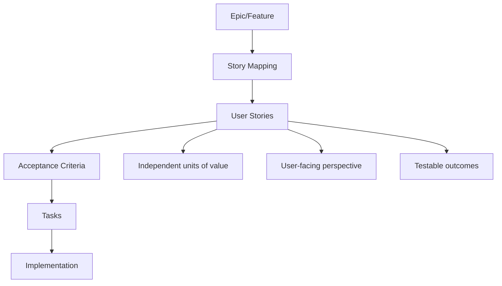
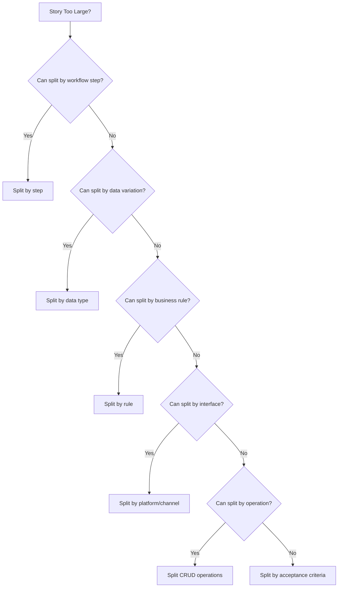
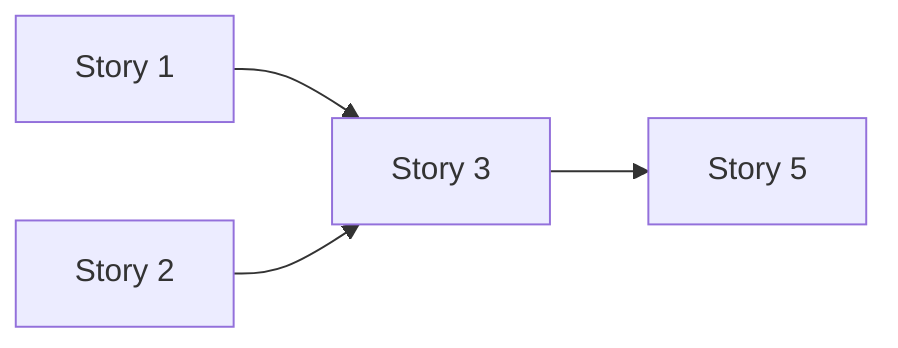
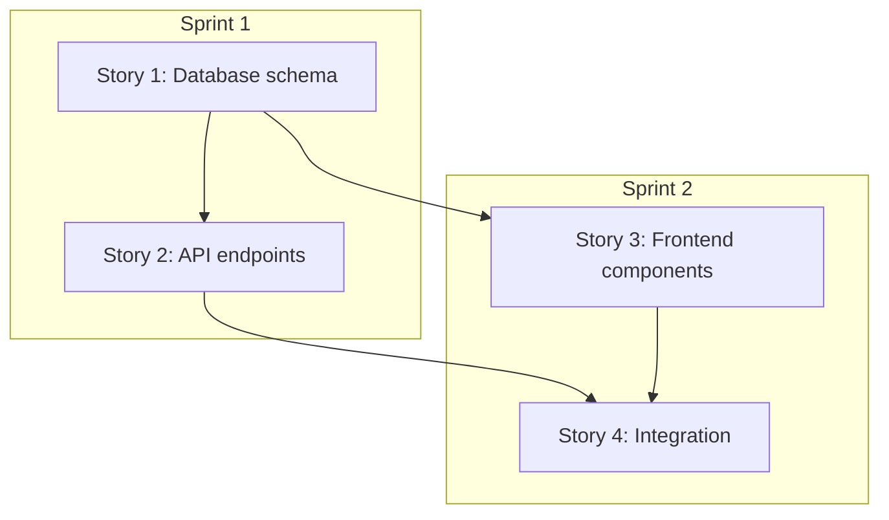

# User Story Prompts

## Why User Story Prompts Exist

User stories bridge the gap between product vision and engineering execution. Introduced by Kent Beck in Extreme Programming (1999) and refined by Mike Cohn in "User Stories Applied" (2004), user stories are the fundamental unit of work in agile development. Yet most teams struggle with stories that are too vague ("As a user, I want the system to be fast"), too large ("As a user, I want a complete billing system"), or missing critical details.

The INVEST criteria define good user stories: **I**ndependent, **N**egotiable, **V**aluable, **E**stimable, **S**mall, **T**estable. Meeting all six criteria consistently is difficult without systematic prompts that enforce completeness.

$$
\text{Story Quality} = \prod_{i \in \text{INVEST}} Q_i
$$

If any single INVEST criterion scores zero, the overall story quality is zero — a story that is not testable is useless regardless of how well it scores on other dimensions.

::: tip
The "three C's" of user stories are Card (brief description), Conversation (discussion about details), and Confirmation (acceptance criteria). Prompts can generate the Card and Confirmation; the Conversation requires humans.
:::

## First Principles



### Story Anatomy

$$
\text{User Story} = \text{Persona} + \text{Action} + \text{Benefit} + \text{Acceptance Criteria} + \text{Context}
$$

```
As a [persona],
I want [action/capability],
So that [benefit/value].

Acceptance Criteria:
Given [context],
When [action],
Then [outcome].
```

## Core Mechanics


### The Story Splitting Flowchart



## Implementation — The Complete Prompt Library

### Category 1: Story Generation (7 Prompts)

#### Prompt 1 — Generate Stories from PRD

```text
Generate user stories from this Product Requirements Document:

[PASTE PRD OR FEATURE DESCRIPTION]

For each requirement in the PRD, generate user stories following this format:

## Story [ID]: [Title]
**As a** [specific persona from the PRD],
**I want** [specific action or capability],
**So that** [measurable benefit or outcome].

**Priority**: [P0-Must Have / P1-Should Have / P2-Could Have]
**Story Points**: [Fibonacci: 1, 2, 3, 5, 8, 13]
**Sprint**: [Suggested sprint number]

### Acceptance Criteria

**Scenario 1: [Happy path name]**
```gherkin
Given [precondition]
And [additional context]
When [action]
Then [expected result]
And [additional verification]
```

**Scenario 2: [Error/edge case name]**
```gherkin
Given [precondition]
When [invalid action or error condition]
Then [error handling behavior]
And [user can recover]
```

**Scenario 3: [Boundary case name]**
```gherkin
Given [boundary condition]
When [action at boundary]
Then [boundary behavior]
```

### Technical Notes
- Implementation hints (not prescriptive)
- Known technical constraints
- Dependencies on other stories

### Definition of Done
- [ ] Code complete and reviewed
- [ ] Unit tests pass (> 80% coverage for new code)
- [ ] Integration tests pass
- [ ] Accessibility verified
- [ ] Documentation updated
- [ ] Product owner accepted

RULES:
1. Each story must deliver standalone user value
2. Each story must be completable in one sprint (< 8 points)
3. If a story is > 8 points, split it and explain the split
4. Stories must be independent (no ordering dependencies)
5. Generate at least 3 acceptance criteria per story
6. Include at least one error scenario per story
7. Include at least one edge case per story
```

#### Prompt 2 — Epic Decomposition

```text
Decompose this epic into sprint-sized user stories:

EPIC: [Epic description]
PERSONAS: [Relevant user personas]
SPRINT LENGTH: [1-4 weeks]
TEAM VELOCITY: [Average story points per sprint]

DECOMPOSITION STRATEGY:

1. **Identify the user journey steps**:
   Map the end-to-end flow and create a story for each step.

2. **Apply INVEST criteria** to each story:
   - Independent: Can be developed without other stories
   - Negotiable: Details can be discussed
   - Valuable: Delivers user value
   - Estimable: Can be estimated (< 13 points)
   - Small: Fits in one sprint
   - Testable: Has clear acceptance criteria

3. **Create a story map**:
```
User Activity 1    User Activity 2    User Activity 3
│                 │                 │
├── Step 1.1      ├── Step 2.1      ├── Step 3.1
├── Step 1.2      ├── Step 2.2      ├── Step 3.2
└── Step 1.3      └── Step 2.3      └── Step 3.3
                                    └── Step 3.4
```

4. **Define release slices** (horizontal cuts across the map):
   Release 1 (MVP): Steps 1.1, 2.1, 3.1
   Release 2: Steps 1.2, 2.2, 3.2
   Release 3: Steps 1.3, 2.3, 3.3, 3.4

5. **For each story, provide**:
   - Story in standard format (As a / I want / So that)
   - 3+ acceptance criteria
   - Story points estimate
   - Sprint assignment
   - Dependencies (minimize these)
   - Technical notes

OUTPUT:
- Story map diagram
- Prioritized story list
- Sprint plan suggestion
- Dependency diagram
- Risk assessment per story
```

#### Prompt 3 — API User Stories

```text
Generate user stories for this API feature:

API FEATURE: [Description of the API feature]
API CONSUMERS: [Who calls this API — frontend, mobile, third-party]

Create stories from the API consumer's perspective:

## Consumer-Facing Stories

**As a** [frontend developer / mobile developer / third-party integrator],
**I want** [API capability],
**So that** [I can build feature X for end users].

### For each API endpoint, generate stories for:

1. **Happy Path Story**: Standard successful API usage
   ```gherkin
   Given I have a valid API key
   And the request body contains valid data
   When I call [METHOD] [/path]
   Then I receive a [status] response
   And the response body contains [expected data]
   And the response includes pagination metadata
   ```

2. **Error Handling Story**: Handling API errors gracefully
   ```gherkin
   Given I call [METHOD] [/path] with invalid data
   Then I receive a 400 response
   And the response body contains field-level errors
   And the error message is actionable
   ```

3. **Authentication Story**: Securing API access
   ```gherkin
   Given I do not include an Authorization header
   When I call any protected endpoint
   Then I receive a 401 response
   And the response indicates how to authenticate
   ```

4. **Rate Limiting Story**: Handling rate limits
   ```gherkin
   Given I have exceeded my rate limit
   When I call any endpoint
   Then I receive a 429 response
   And the Retry-After header tells me when to retry
   And X-RateLimit headers show my limit status
   ```

5. **Pagination Story**: Navigating large result sets
   ```gherkin
   Given there are 1000 items matching my query
   When I call GET [/path] with limit=20
   Then I receive 20 items
   And a cursor for the next page
   And total count metadata
   ```

6. **Versioning Story**: API version management
   ```gherkin
   Given I am using API v1
   And API v2 is available
   When I call v1 endpoints
   Then they continue to work as documented
   And I receive a deprecation warning header
   ```

## Backend Implementation Stories

For each endpoint, also generate implementation-focused stories:
- Database schema story
- Business logic story
- Caching story
- Monitoring story
```

#### Prompt 4 — Infrastructure/DevOps User Stories

```text
Generate user stories for infrastructure and DevOps work:

INFRASTRUCTURE NEED: [Description of infrastructure work]
TEAM: [Dev team, DevOps team, SRE team]

Note: Infrastructure stories are often written incorrectly as tasks.
They MUST still deliver value to someone, even if indirectly.

PATTERN: Frame infrastructure work in terms of the capability it enables.

### Examples:

**As a** developer on the payments team,
**I want** a staging environment that mirrors production,
**So that** I can test payment integrations without affecting real transactions.

**As a** on-call engineer,
**I want** automated alerts when error rates exceed 1%,
**So that** I can respond to incidents before users notice.

**As a** product team member,
**I want** feature flags for new billing features,
**So that** we can gradually roll out changes and quickly roll back if needed.

**As a** security engineer,
**I want** all container images scanned for vulnerabilities in CI,
**So that** we don't deploy images with known critical CVEs.

FOR EACH INFRASTRUCTURE STORY:

### Acceptance Criteria
```gherkin
Given [infrastructure precondition]
When [infrastructure change is applied]
Then [capability is available]
And [performance meets target]
And [monitoring confirms it works]
```

### Verification Criteria
- How do we know this infrastructure works?
- What monitoring proves it's healthy?
- What happens if it fails?
- What is the rollback procedure?

### Non-Functional Criteria
- Performance impact of this change
- Cost impact (monthly cost delta)
- Security impact
- Maintenance burden
```

#### Prompt 5 — Data / Analytics Stories

```text
Generate user stories for data and analytics features:

ANALYTICS NEED: [What insights are needed]
STAKEHOLDERS: [Who needs the data — PM, marketing, executive, engineering]
DATA SOURCES: [Where does the data come from]

### Analytics Consumer Stories

**As a** [product manager / marketing lead / executive],
**I want** [specific insight or report],
**So that** I can [make a specific decision].

For each analytics story:

### Data Requirements
| Field | Source | Transformation | Freshness |
|-------|--------|---------------|-----------|

### Acceptance Criteria
```gherkin
Given I navigate to the [dashboard/report]
When I select date range [X to Y]
Then I see [specific metric] with value [expected range]
And the data is no more than [freshness] old
And I can filter by [dimension 1], [dimension 2]
And I can export to CSV
```

### Data Quality Criteria
```gherkin
Given the ETL pipeline runs daily at 3 AM UTC
When it processes yesterday's events
Then all events are accounted for (reconciliation check passes)
And no PII is present in the analytics tables
And data types match the schema exactly
```

### Dashboard Stories
**As a** [persona],
**I want** a dashboard showing [metrics],
**So that** I can monitor [business process] in real-time.

Dashboard acceptance criteria:
- Loads in < 3 seconds
- Auto-refreshes every [X] minutes
- Shows data from last [X] days by default
- Supports drill-down from summary to detail
- Mobile-responsive layout
```

#### Prompt 6 — Bug Fix Stories

```text
Convert this bug report into a well-structured user story:

BUG REPORT:
[Paste the bug report]

Generate a story that captures both the fix and the prevention:

## Bug Fix Story
**As a** [affected user persona],
**I want** [correct behavior],
**So that** [I can accomplish my goal without the bug].

**Priority**: [P0-Critical / P1-High / P2-Medium / P3-Low]
**Affected Users**: [Number or percentage]
**Revenue Impact**: [If applicable]

### Steps to Reproduce
1. [Step 1]
2. [Step 2]
3. [Step 3]

### Current (Broken) Behavior
[What happens now]

### Expected (Fixed) Behavior
[What should happen]

### Root Cause (if known)
[Technical explanation of why the bug exists]

### Acceptance Criteria for Fix
```gherkin
Given [the scenario that triggers the bug]
When [the user performs the action]
Then [the correct behavior occurs]
And [the bug no longer manifests]
```

### Regression Prevention
```gherkin
Given the bug fix is deployed
When [the original bug trigger conditions exist]
Then the system behaves correctly
And an automated test prevents regression
```

### Test Cases
1. [Test that would have caught this bug]
2. [Related edge cases to test]
3. [Regression test]

### Additional Stories (if needed)
- Story for monitoring to detect if bug recurs
- Story for customer communication
- Story for data fix (if data was corrupted)
```

#### Prompt 7 — Security Stories

```text
Generate security-focused user stories:

SECURITY AREA: [Authentication / Authorization / Data Protection / Compliance]
SYSTEM: [System description]
THREAT MODEL: [Known threats or STRIDE model reference]

### Security Stories Pattern

**As a** system operator,
**I want** [security control],
**So that** [the system is protected from specific threat].

OR

**As a** user,
**I want** [security feature],
**So that** [my data/account is protected].

### Categories:

## Authentication Stories
- Multi-factor authentication
- Password policy enforcement
- Session management
- Account lockout
- Password reset security

## Authorization Stories
- Role-based access control
- Resource-level permissions
- API key management
- Least privilege enforcement

## Data Protection Stories
- Encryption at rest
- Encryption in transit
- PII handling
- Data retention and deletion
- Backup and recovery

## Audit Stories
- Action logging
- Access logging
- Log tamper protection
- Log retention

## Compliance Stories
- GDPR: Right to access, delete, port data
- SOC 2: Control implementation
- PCI: Cardholder data protection

For each security story:

### Acceptance Criteria
```gherkin
Given [security context]
When [action or threat scenario]
Then [security control activates]
And [threat is mitigated]
And [audit log records the event]
```

### Security Test Cases
1. Positive: Security control works correctly
2. Negative: Attempt to bypass is blocked
3. Edge: Unusual but valid security scenario

### Compliance Mapping
| Control | Regulation | Section | Evidence |
```

### Category 2: Story Quality & Refinement (6 Prompts)

#### Prompt 8 — Story Review & Improvement

```text
Review and improve these user stories:

[PASTE USER STORIES]

Evaluate each story against INVEST criteria:

| Story | Independent | Negotiable | Valuable | Estimable | Small | Testable | Score |
|-------|-----------|-----------|---------|----------|-------|---------|-------|

For each story with score < 5/6:

1. **Problem Identification**:
   What INVEST criteria are violated and why?

2. **Rewritten Story**:
   Improved version that addresses all issues.

3. **Enhanced Acceptance Criteria**:
   Add missing scenarios:
   - Happy path (if missing)
   - Error handling (if missing)
   - Edge cases (if missing)
   - Performance criteria (if missing)
   - Accessibility criteria (if applicable)

4. **Splitting Recommendations**:
   If the story is too large, propose splits with:
   - Rationale for the split
   - How each part delivers independent value
   - Suggested priority order

5. **Missing Stories**:
   Based on the feature context, are there stories that should
   exist but don't? Identify gaps:
   - Error handling stories
   - Empty state stories
   - Loading state stories
   - Offline/degraded mode stories
   - Admin/support tool stories
   - Analytics/tracking stories
```

#### Prompt 9 — Acceptance Criteria Enhancement

```text
Enhance the acceptance criteria for these user stories:

[PASTE STORIES WITH BASIC ACCEPTANCE CRITERIA]

For each story, add comprehensive acceptance criteria in these categories:

## Functional Criteria
```gherkin
Scenario: [name]
  Given [complete precondition with test data]
  And [additional context]
  When [specific user action]
  Then [specific, measurable outcome]
  And [side effect verification]
```

## Validation Criteria
- Input validation rules with specific examples
- Error messages for each validation failure
- Inline validation vs form-level validation

## Performance Criteria
- Response time: [specific target, e.g., < 200ms]
- Page load: [specific target, e.g., < 2s LCP]
- Data handling: [specific limit, e.g., handle 10,000 items]

## Accessibility Criteria
- Keyboard navigation sequence
- Screen reader announcements
- Focus management after actions
- ARIA attributes required

## Responsive Design Criteria
- Behavior on mobile (< 768px)
- Behavior on tablet (768px - 1024px)
- Behavior on desktop (> 1024px)

## State Management Criteria
- Loading state appearance and behavior
- Empty state content and calls to action
- Error state recovery mechanism
- Stale data handling

## Analytics Criteria
- Events to fire (event name, properties)
- Metrics this story affects
- A/B test variant behavior (if applicable)

## Security Criteria (if applicable)
- Authentication required?
- Authorization checks?
- Input sanitization?
- Rate limiting?
```

#### Prompt 10 — Story Splitting

```text
This user story is too large. Split it into smaller, independently valuable stories:

ORIGINAL STORY:
[Paste the large story]

CONSTRAINTS:
- Each split story must deliver independent user value
- Each split story must be completable in one sprint
- Split stories should be independently deployable
- Minimize dependencies between split stories

SPLITTING TECHNIQUES TO APPLY:

1. **Split by workflow step**:
   Original: "User can complete checkout"
   Split into: Cart review, Address entry, Payment, Confirmation

2. **Split by happy path / edge cases**:
   Story 1: Happy path (most common flow)
   Story 2: Error handling
   Story 3: Edge cases

3. **Split by data variation**:
   Story 1: Handle credit cards
   Story 2: Handle bank transfers
   Story 3: Handle digital wallets

4. **Split by CRUD operation**:
   Story 1: Create resource
   Story 2: Read/view resource
   Story 3: Update resource
   Story 4: Delete resource

5. **Split by business rule**:
   Story 1: Basic rule
   Story 2: Advanced rule
   Story 3: Exception handling

6. **Split by interface**:
   Story 1: Web interface
   Story 2: Mobile interface
   Story 3: API

7. **Split by acceptance criteria**:
   When a story has 10+ acceptance criteria,
   each can become its own story.

FOR EACH SPLIT STORY:
- Full story format (As a / I want / So that)
- 3+ acceptance criteria
- Story point estimate
- Dependencies on other split stories (minimize)
- Recommended implementation order

ALSO PROVIDE:
- Story relationship diagram
- Suggested sprint allocation
- Risk assessment for the split approach
```

#### Prompt 11 — Edge Case Story Generation

```text
Generate edge case user stories for this feature:

FEATURE: [Feature description]
HAPPY PATH STORIES: [Existing happy path stories]

For each category, generate specific edge case stories:

## Input Edge Cases
- What happens with empty input?
- What happens with maximum-length input?
- What happens with special characters?
- What happens with non-Latin characters (CJK, Arabic, Cyrillic)?
- What happens with emoji?
- What happens with copy-pasted text containing hidden formatting?

## Timing Edge Cases
- What if the user's session expires mid-action?
- What if the user submits the form twice rapidly?
- What if the user's clock is wrong?
- What happens at midnight, DST transition, end of month/year?
- What if an async operation takes longer than expected?

## Concurrency Edge Cases
- Two users edit the same resource simultaneously
- User opens the same form in two tabs
- Admin changes permissions while user is mid-workflow
- Data changes between page load and form submission

## State Edge Cases
- First-time user with no data (empty state)
- User with maximum amount of data
- User with corrupted/inconsistent data
- User in the middle of a previously interrupted workflow
- User returning after long absence (stale session)

## Permission Edge Cases
- User's role changes during their session
- Resource is deleted while user is viewing it
- User is added to / removed from a team while active
- Feature flag changes while user is using the feature

## Network Edge Cases
- Request fails due to network error
- Request times out
- Request succeeds but response is lost (user retries)
- Slow network (high latency, low bandwidth)
- User goes offline mid-operation

For each edge case:

**As a** [user persona],
**I want** [the system to handle edge case gracefully],
**So that** [I don't lose data / get confused / encounter an error].

```gherkin
Given [edge case precondition]
When [edge case trigger]
Then [graceful handling]
And [user feedback is clear]
And [system state is consistent]
```

Priority: [P0 if data loss possible, P1 if UX degradation, P2 if cosmetic]
```

#### Prompt 12 — Technical Debt Stories

```text
Generate user stories for technical debt repayment:

TECHNICAL DEBT: [Description of the tech debt]
IMPACT: [How it affects users, developers, and operations]
CODE AREAS: [Affected code and systems]

Technical debt stories must be framed in terms of user or business value:

## Template

**As a** [developer / user / operator],
**I want** [the technical improvement],
**So that** [specific measurable benefit].

### Examples:

**As a** developer on the orders team,
**I want** the order service database queries optimized,
**So that** the checkout page loads in under 2 seconds
(currently 5 seconds due to N+1 queries).

**As a** user,
**I want** the search feature to return results in under 500ms,
**So that** I can quickly find what I'm looking for
(currently 3 seconds due to unindexed queries).

**As a** on-call engineer,
**I want** structured logging across all services,
**So that** I can diagnose production issues in minutes instead of hours.

### Acceptance Criteria for Tech Debt Stories:

```gherkin
Given the technical improvement is deployed
When [the previously degraded scenario occurs]
Then [measurable improvement is observed]
And [the improvement is verified by metrics/tests]
```

### Quantification:
For each tech debt story, quantify:
| Metric | Before | After | Improvement |
|--------|--------|-------|-------------|
| [Performance metric] | | | |
| [Developer time saved] | | | |
| [Incident frequency] | | | |
| [Customer impact] | | | |

### ROI Justification:
- Effort to fix: [story points / person-days]
- Ongoing cost if not fixed: [per sprint / per month]
- Payback period: [sprints until ROI positive]
```

#### Prompt 13 — Accessibility Stories

```text
Generate accessibility-focused user stories:

FEATURE: [Feature description]
WCAG LEVEL: [A / AA / AAA]
TARGET DISABILITIES: [Visual, Motor, Auditory, Cognitive]

### Accessibility Story Template

**As a** [user with specific disability],
**I want** [accessible interaction],
**So that** I can [accomplish the same task as other users].

### Stories by Disability Category:

## Visual Impairment (Screen Reader Users)
**As a** screen reader user,
**I want** all interactive elements to have descriptive labels,
**So that** I know what each button and link does.

```gherkin
Given I navigate to [page/component] with a screen reader
When I tab through the interactive elements
Then each element announces its purpose and state
And form fields announce their labels and any errors
And dynamic content changes are announced via live regions
```

## Motor Impairment (Keyboard-Only Users)
**As a** keyboard-only user,
**I want** to complete all workflows without a mouse,
**So that** I can use the application with keyboard navigation.

```gherkin
Given I navigate using only the keyboard
When I tab through the interface
Then focus order follows a logical sequence
And focus is always visible
And I can activate all controls with Enter or Space
And modal dialogs trap focus correctly
And I can dismiss dialogs with Escape
```

## Low Vision (Magnification Users)
**As a** user with low vision,
**I want** the interface to work at 200% zoom,
**So that** I can read all content without horizontal scrolling.

```gherkin
Given I zoom the browser to 200%
When I view [page/component]
Then all content is visible without horizontal scrolling
And text remains readable
And no content is cut off or overlapping
```

## Cognitive Disabilities
**As a** user with cognitive disabilities,
**I want** clear, simple language and consistent navigation,
**So that** I can understand and use the application.

```gherkin
Given I navigate to [page/component]
Then error messages explain what went wrong in plain language
And instructions are clear and concise
And navigation is consistent across pages
And form fields have visible labels (not just placeholders)
And important actions require confirmation
```

## Color Blindness
**As a** color-blind user,
**I want** information conveyed through more than just color,
**So that** I can distinguish all states and categories.

```gherkin
Given I view [page/component]
Then status indicators use icons/text in addition to color
And charts/graphs are distinguishable without color
And error states use icons, not just red color
And all text meets 4.5:1 contrast ratio minimum
```

## Hearing Impairment
**As a** deaf or hard-of-hearing user,
**I want** captions and visual alternatives for audio content,
**So that** I don't miss any information.

```gherkin
Given [page/component] contains audio or video content
Then captions are available and accurate
And audio-only alerts have visual alternatives
And voice-based features have text alternatives
```

### Definition of Done for Accessibility
- [ ] Passes automated axe-core scan with zero violations
- [ ] Keyboard navigation tested and documented
- [ ] Screen reader tested (NVDA or VoiceOver)
- [ ] Color contrast verified (4.5:1 for text, 3:1 for UI)
- [ ] Focus management verified for dynamic content
- [ ] ARIA attributes reviewed for correctness
```

### Category 3: Story Management (5 Prompts)

#### Prompt 14 — Sprint Planning Prompt

```text
Help me plan the next sprint:

SPRINT LENGTH: [1-4 weeks]
TEAM VELOCITY: [Story points per sprint, average of last 3 sprints]
TEAM CAPACITY: [Available developer-days, accounting for PTO/meetings]
SPRINT GOAL: [What we want to achieve this sprint]

BACKLOG:
[Paste the prioritized backlog with story points]

Generate:

## Sprint Goal
One clear sentence describing what this sprint achieves.
Success criteria for the sprint goal.

## Selected Stories
| Story | Points | Assignee | Dependencies | Risk |
|-------|--------|----------|--------------|------|

Total points: [X] (vs velocity of [Y])
Buffer: [Y - X] points (should be 10-20% buffer)

## Sprint Capacity Check
| Developer | Available Days | Allocated Points | Utilization |

## Dependency Map


## Risk Assessment
| Risk | Probability | Impact | Mitigation |
|------|-----------|--------|-----------|

## Daily Focus Suggestion
| Day | Focus Area | Key Activities |
|-----|-----------|---------------|
| Day 1 | Setup | Kick off stories, clarify questions |
| Day 2-3 | Build | Core development |
| Day 4-5 | Build | Continue development |
| Day 6-7 | Integration | Connect components |
| Day 8-9 | Polish | Bug fixes, testing |
| Day 10 | Review | Demo prep, retrospective |

## Carry-Over Risk
Stories most likely to not complete:
| Story | Risk Level | Contingency |
```

#### Prompt 15 — Story Point Estimation Guide

```text
Help estimate story points for these user stories:

STORIES:
[List stories to estimate]

REFERENCE STORIES (calibration):
- 1 point: [Example of a trivial change in your codebase]
- 2 points: [Example of a small, well-understood change]
- 3 points: [Example of a moderate change]
- 5 points: [Example of a larger change with some unknowns]
- 8 points: [Example of a complex change]
- 13 points: [Example of a very complex change, consider splitting]

For each story, provide:

## Story: [Title]

### Complexity Analysis
- Code changes: [files/components affected]
- Data model changes: [schema changes needed]
- Integration points: [APIs/services affected]
- Testing complexity: [types of tests needed]
- Unknown factors: [what we don't know yet]

### Estimate: [X] story points

### Rationale:
Compared to [reference story], this is [more/less complex] because:
1. [Reason 1]
2. [Reason 2]

### Confidence: [High / Medium / Low]
If Low: What would increase confidence?
- Spike/investigation needed?
- Technical design needed?
- Dependency clarification needed?

### Risks that could increase actual effort:
| Risk | Probability | Impact on Points |
|------|-----------|-----------------|

### Splitting Recommendation (if > 8 points):
| Sub-story | Points | Value | Can Defer? |
```

#### Prompt 16 — Story Dependency Management

```text
Analyze dependencies between these stories and create an execution plan:

STORIES:
[List all stories with their relationships]

1. **Dependency Map**:


2. **Dependency Matrix**:
| Story | Depends On | Blocks | Type | Removable? |
|-------|-----------|--------|------|-----------|
| Story 1 | None | Story 2, 3 | Technical | N/A |
| Story 2 | Story 1 | Story 4 | Technical | No |
| Story 3 | Story 1 | Story 4 | Technical | Yes - could mock |

3. **Critical Path**:
The longest dependency chain: [Story X -> Story Y -> Story Z]
Total duration: [X sprints]
Any way to shorten: [analysis]

4. **Parallel Execution Opportunities**:
| Group | Stories | Can Run In Parallel | Conditions |
|-------|---------|-------------------|-----------|

5. **Dependency Risk Assessment**:
| Dependency | Owner | Risk | Mitigation |
|-----------|-------|------|-----------|

6. **Recommendations**:
- Stories to start first (unblock others)
- Stories that can be worked in parallel
- Dependencies to eliminate (through mocking, feature flags, etc.)
- External dependencies that need early communication
```

#### Prompt 17 — Backlog Grooming Prompt

```text
Help me groom this backlog:

CURRENT BACKLOG:
[Paste all backlog items]

PRODUCT STRATEGY: [Current priorities and direction]
UPCOMING MILESTONES: [Key dates and commitments]

Perform backlog grooming:

## 1. Categorization
| Story | Category | Strategic Alignment | Status |
|-------|----------|-------------------|--------|
| | Feature / Bug / Tech Debt / Research | High/Med/Low | Ready/Needs Refinement/Blocked |

## 2. Stories That Need Refinement
| Story | Missing Information | Questions to Resolve | Effort to Refine |

## 3. Stories to Split
| Story | Current Size | Proposed Split | Rationale |

## 4. Stories to Combine
| Stories | Proposed Combined Story | Rationale |

## 5. Stories to Remove
| Story | Reason for Removal | Last Relevant |
Criteria for removal:
- Over 6 months old with no progress
- Duplicate of another story
- No longer aligned with strategy
- Superseded by other work

## 6. Priority Reassessment
| Story | Current Priority | Recommended Priority | Reason |

## 7. Missing Stories
Based on the strategy and existing backlog, what stories are missing?
| Missing Story | Why It's Needed | Suggested Priority |

## 8. Backlog Health Metrics
- Total stories: [count]
- Refined and ready: [count] ([%])
- Stale (> 3 months untouched): [count]
- Blocked: [count]
- Average story age: [weeks]
- Stories per sprint (throughput): [average]
- Backlog depth: [sprints worth of work]

Recommended actions:
1. [Top priority action]
2. [Second priority action]
3. [Third priority action]
```

#### Prompt 18 — Definition of Ready Template

```text
Generate a Definition of Ready (DoR) checklist for user stories:

TEAM CONTEXT: [Team type, tech stack, process]

## Definition of Ready Checklist

A story is ready for sprint planning when ALL of these are true:

### Business Clarity
- [ ] Story follows format: As a [persona], I want [action], So that [benefit]
- [ ] The business value is clearly stated and understood by the team
- [ ] The product owner has approved the story
- [ ] Success metrics are defined (how do we know this works?)

### Scope Definition
- [ ] Acceptance criteria are written in Given/When/Then format
- [ ] At least 3 acceptance criteria exist (happy path, error, edge case)
- [ ] Scope is clear: what's IN and what's OUT
- [ ] The story is small enough for one sprint (< 8 story points)

### Technical Readiness
- [ ] Technical approach is discussed and agreed upon
- [ ] Dependencies are identified and either resolved or managed
- [ ] API contracts are defined (if applicable)
- [ ] Data model changes are identified (if applicable)
- [ ] No blocking unknowns remain (or a spike is planned)

### Design Readiness (if UI story)
- [ ] Mockups or wireframes are available
- [ ] Responsive design specifications exist
- [ ] Accessibility requirements are documented
- [ ] Edge case designs exist (empty state, error state, loading state)

### Testing Readiness
- [ ] Test scenarios are identified
- [ ] Test data requirements are known
- [ ] Performance targets are defined (if applicable)
- [ ] Security testing needs are identified (if applicable)

### Estimation
- [ ] Story is estimated by the team
- [ ] Team is confident in the estimate (not a guess)
- [ ] Risks are identified and factored into the estimate

## Stories That Should NOT Enter a Sprint
- [ ] Stories without acceptance criteria
- [ ] Stories that depend on unresolved external dependencies
- [ ] Stories without design (for UI features)
- [ ] Stories with estimate "?" or "> 13 points"
- [ ] Stories the team hasn't discussed
```

## Edge Cases & Failure Modes

### Story Anti-Patterns

| Anti-Pattern | Example | Fix |
|-------------|---------|-----|
| **Technical Story** | "Refactor the database layer" | Frame as user value: "As a user, I want search to respond in < 500ms" |
| **Compound Story** | "As a user, I want to create, edit, and delete posts" | Split into 3 stories |
| **Vague Criteria** | "System should be fast" | "API response under 200ms at P95" |
| **Solution Story** | "Implement Redis caching" | "As a user, I want instant search results" |
| **Epic Story** | 100+ point story | Decompose using story splitting techniques |
| **Orphan Story** | Story with no connection to any goal | Connect to a goal or remove |

::: info War Story
An e-commerce team generated 47 user stories from their PRD using AI prompts. During sprint planning, they discovered that 12 stories had hidden dependencies that weren't captured — Story 23 couldn't be started until Stories 7, 12, and 15 were all complete, but this wasn't documented anywhere. They added the Story Dependency Management prompt (Prompt 16) to their workflow and started running it against every batch of new stories. Dependency-related sprint failures dropped from 30% to under 5%. The key insight: AI is excellent at finding dependencies when explicitly asked to look for them, but won't mention them if the prompt focuses only on story generation.
:::

## Performance Characteristics

| Activity | Time Without Prompts | Time With Prompts | Quality Improvement |
|----------|---------------------|-------------------|-------------------|
| Story Generation | 30 min/story | 5 min/story | +40% completeness |
| Acceptance Criteria | 20 min/story | 3 min/story | +60% coverage |
| Story Splitting | 1 hour/epic | 15 min/epic | Better independence |
| Sprint Planning | 4 hours | 2 hours | Fewer carry-overs |

## Mathematical Foundations

### Velocity Prediction

Sprint velocity follows a normal distribution after initial ramp-up:

$$
V \sim \mathcal{N}(\mu_v, \sigma_v^2)
$$

Where $\mu_v$ is the average velocity and $\sigma_v$ is the standard deviation. Use the last 5-8 sprints for estimation. Plan for $\mu_v - \sigma_v$ (conservative) rather than $\mu_v$ (optimistic).

### Story Point Fibonacci Scale

The Fibonacci sequence (1, 2, 3, 5, 8, 13, 21) is used because estimation uncertainty grows with size:

$$
\text{Estimation Error} \propto \sqrt{\text{Story Size}}
$$

The gaps between Fibonacci numbers grow proportionally, reflecting this increasing uncertainty. A 13-point story has much more uncertainty than a 3-point story, and the gap between 8 and 13 is proportionally larger than between 2 and 3.

## Decision Framework

| Need | Prompt to Use | Why |
|------|-------------|-----|
| Break down a PRD | Prompt 1 (Generate from PRD) | Systematic decomposition |
| Large epic | Prompt 2 (Epic Decomposition) | Story mapping technique |
| API work | Prompt 3 (API Stories) | Consumer-focused stories |
| Infrastructure | Prompt 4 (DevOps Stories) | Frame as user value |
| Improve quality | Prompt 8 (Story Review) | INVEST criteria check |
| Better criteria | Prompt 9 (Criteria Enhancement) | Comprehensive coverage |
| Too large | Prompt 10 (Story Splitting) | Multiple splitting techniques |
| Missing edge cases | Prompt 11 (Edge Case Stories) | Systematic edge case discovery |
| Sprint planning | Prompt 14 (Sprint Planning) | Capacity and risk analysis |

## Advanced Topics

### Automated Story Quality Gates

Integrate story quality checks into your workflow:

```typescript
interface StoryQualityScore {
  invest: {
    independent: boolean;
    negotiable: boolean;
    valuable: boolean;
    estimable: boolean;
    small: boolean;
    testable: boolean;
  };
  acceptanceCriteria: {
    count: number;
    hasHappyPath: boolean;
    hasErrorCase: boolean;
    hasEdgeCase: boolean;
    isTestable: boolean;
  };
  overallScore: number; // 0-100
  readyForSprint: boolean;
  issues: string[];
}

function evaluateStory(story: UserStory): StoryQualityScore {
  const invest = {
    independent: !story.dependencies || story.dependencies.length === 0,
    negotiable: !story.description.includes('must use'),
    valuable: story.benefit.length > 10,
    estimable: story.points !== undefined && story.points <= 13,
    small: (story.points ?? 99) <= 8,
    testable: story.acceptanceCriteria.length >= 3,
  };

  const score = Object.values(invest).filter(Boolean).length * 100 / 6;

  return {
    invest,
    acceptanceCriteria: {
      count: story.acceptanceCriteria.length,
      hasHappyPath: story.acceptanceCriteria.some(ac => ac.type === 'happy'),
      hasErrorCase: story.acceptanceCriteria.some(ac => ac.type === 'error'),
      hasEdgeCase: story.acceptanceCriteria.some(ac => ac.type === 'edge'),
      isTestable: story.acceptanceCriteria.every(ac => ac.then.length > 0),
    },
    overallScore: score,
    readyForSprint: score >= 80,
    issues: [],
  };
}
```

## Cross-References

- [PRD Prompts](./prd-prompts.md) — Source material for story generation
- [Competitive Analysis Prompts](./competitive-analysis-prompts.md) — Market context for stories
- [Testing Prompts](../engineering-prompts/testing-prompts.md) — Acceptance criteria to tests
- [Accessibility Prompts](../ui-prompts/accessibility-prompts.md) — Accessibility story details
- [Code Generation Prompts](../engineering-prompts/code-generation-prompts.md) — Implementing stories
