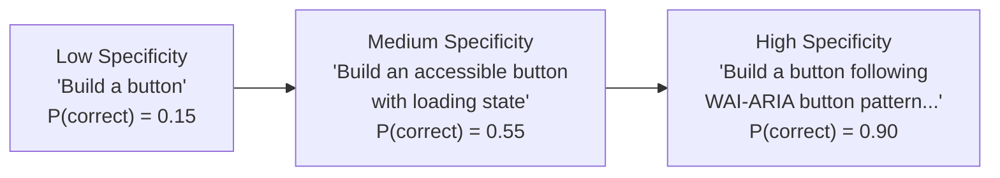
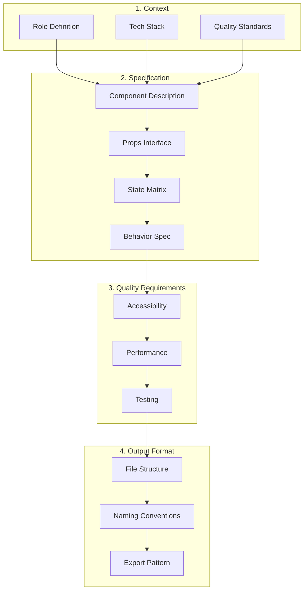

# Component Generation Prompts

## Why It Exists

Generating UI components with AI is the most common use case in frontend prompt engineering, yet it's where the quality gap is widest. A naive prompt like "create a React dropdown" produces a component that fails on accessibility, breaks on mobile, ignores keyboard navigation, and doesn't handle edge cases. These prompt templates encode years of frontend engineering expertise into reusable patterns that consistently produce production-quality output.

The core problem: a production component needs to handle 10-50x more scenarios than a demo component. A dropdown isn't just "show list, select item." It's focus management, keyboard navigation, screen reader announcements, overflow handling, virtualization for large lists, multi-select, search/filter, async loading, disabled states, grouping, RTL support, and mobile touch optimization. Each of these requirements must be explicitly stated in the prompt.

### Historical Context

Component generation prompts evolved from simple to sophisticated:

- **Phase 1** (2022): "Build me a modal component in React"
- **Phase 2** (2023): "Build an accessible modal with focus trapping and keyboard dismissal"
- **Phase 3** (2024): "Build a modal following the WAI-ARIA Dialog pattern with these specific behaviors..."
- **Phase 4** (2025-2026): Structured templates with complete state matrices, design token integration, and automated quality validation

## First Principles

### The Component State Matrix

Every component exists in multiple states simultaneously. The state matrix enumerates all possible combinations:

$$
S_{total} = S_{data} \times S_{interaction} \times S_{validation} \times S_{loading}
$$

For a form input:
- $S_{data}$: empty, filled, overflowing = 3
- $S_{interaction}$: default, focused, hovered, disabled, readonly = 5
- $S_{validation}$: valid, invalid, warning, pending = 4
- $S_{loading}$: idle, loading, success, error = 4

$$
S_{total} = 3 \times 5 \times 4 \times 4 = 240 \text{ state combinations}
$$

Not all combinations are valid, but the prompt must address the major ones.

### The Prompt Specificity Principle

$$
P(\text{correct output}) = 1 - e^{-\lambda \cdot S_{prompt}}
$$

Where $S_{prompt}$ is the specificity score and $\lambda$ is the model capability parameter. Higher specificity exponentially reduces the probability of incorrect output.



## Core Mechanics

### Prompt Template Structure

Every component generation prompt follows this structure:



## Prompts

### 1. Form Input Component

::: details Prompt: Production Form Input

```
Build a production React form input component with TypeScript.

COMPONENT: TextInput
FRAMEWORK: React 18 with TypeScript 5
STYLING: Tailwind CSS with design token CSS custom properties

PROPS INTERFACE:
- label: string (required, visible label)
- name: string (required, form field name)
- type: 'text' | 'email' | 'password' | 'tel' | 'url' | 'search'
- value: string (controlled)
- onChange: (value: string) => void
- onBlur?: () => void
- placeholder?: string
- helperText?: string
- errorMessage?: string
- disabled?: boolean
- readOnly?: boolean
- required?: boolean
- maxLength?: number
- leftIcon?: ReactNode
- rightIcon?: ReactNode
- size?: 'sm' | 'md' | 'lg'
- autoComplete?: string
- inputMode?: 'text' | 'numeric' | 'email' | 'tel' | 'url'

STATES TO IMPLEMENT:
1. Default (empty, no interaction)
2. Focused (ring/outline visible)
3. Filled (has value)
4. Disabled (grayed out, not interactive)
5. Read-only (visible but not editable)
6. Error (red border, error message visible)
7. With helper text
8. With character count (when maxLength provided)
9. With left/right icons
10. Loading (spinner in right icon position)

ACCESSIBILITY REQUIREMENTS:
- Label always associated via htmlFor/id
- Error messages linked via aria-describedby
- Helper text linked via aria-describedby
- aria-invalid="true" when errorMessage is present
- aria-required="true" when required
- No placeholder-only labels (label is always visible)
- Sufficient color contrast for all states (4.5:1 minimum)

BEHAVIOR:
- Focus ring on keyboard focus only (not mouse click) via :focus-visible
- Character count updates as user types
- Error message animates in (slide down, fade in)
- Password type has toggle visibility button

OUTPUT: Single file with component, types exported. Include usage examples as comments.
Do NOT use any Vue template syntax like double curly braces.
```
:::

### 2. Select/Dropdown Component

::: details Prompt: Accessible Select Dropdown

```
Build a custom accessible Select dropdown component in React with TypeScript.

COMPONENT: Select (custom, not native <select>)
PATTERN: WAI-ARIA Listbox pattern (https://www.w3.org/WAI/ARIA/apg/patterns/listbox/)

PROPS INTERFACE:
- options: Array<{ value: string; label: string; disabled?: boolean; group?: string }>
- value: string | string[] (for multi-select)
- onChange: (value: string | string[]) => void
- label: string
- placeholder?: string
- multiple?: boolean
- searchable?: boolean
- disabled?: boolean
- loading?: boolean
- errorMessage?: string
- maxHeight?: number (dropdown max height in px, default 300)
- renderOption?: (option: Option) => ReactNode
- groupBy?: boolean
- clearable?: boolean
- size?: 'sm' | 'md' | 'lg'

KEYBOARD NAVIGATION (CRITICAL):
- Enter/Space: Open dropdown, select focused option
- Escape: Close dropdown, return focus to trigger
- ArrowDown: Move focus to next option (wrap to first)
- ArrowUp: Move focus to previous option (wrap to last)
- Home: Move focus to first option
- End: Move focus to last option
- Type-ahead: Focus option starting with typed characters
- Tab: Close dropdown and move focus to next element

STATES:
1. Closed, empty
2. Closed, with selection (show selected label)
3. Open, no selection
4. Open, with highlighted option
5. Open, with selected option
6. Open, filtered (when searchable)
7. Open, no results (when search has no matches)
8. Loading (show spinner, disable interaction)
9. Disabled
10. Error state
11. Multi-select with chips/tags

ACCESSIBILITY:
- Trigger has role="combobox" (searchable) or role="button" (non-searchable)
- Listbox has role="listbox"
- Options have role="option"
- aria-expanded on trigger
- aria-activedescendant for focus management
- aria-selected on selected options
- aria-disabled on disabled options
- Live region announces selection changes
- Groups use role="group" with aria-labelledby

POSITIONING:
- Dropdown flips to top if not enough space below
- Dropdown aligns to trigger width (minimum)
- Portal to document.body to avoid overflow:hidden ancestors

PERFORMANCE:
- Virtualize options list when > 100 options (use react-virtual or custom implementation)
- Debounce search input (300ms)
- Memoize filtered options

OUTPUT: Component file + custom hook (useSelect) + types file. Do NOT use double curly braces anywhere.
```
:::

### 3. Data Table Component

::: details Prompt: Advanced Data Table

```
Build a production data table component in React with TypeScript.

COMPONENT: DataTable<T>
GENERIC: Table should be generic over row data type

PROPS INTERFACE:
- data: T[]
- columns: ColumnDef<T>[]
- loading?: boolean
- emptyState?: ReactNode
- onRowClick?: (row: T) => void
- sortable?: boolean
- onSort?: (column: string, direction: 'asc' | 'desc') => void
- selectable?: boolean
- selectedRows?: Set<string>
- onSelectionChange?: (selected: Set<string>) => void
- getRowId: (row: T) => string
- stickyHeader?: boolean
- pagination?: { page: number; pageSize: number; total: number; onPageChange: (page: number) => void }
- resizableColumns?: boolean
- striped?: boolean
- compact?: boolean
- maxHeight?: number | string

COLUMN DEFINITION:
interface ColumnDef<T> {
  id: string;
  header: string | ReactNode;
  accessor: keyof T | ((row: T) => ReactNode);
  width?: number | string;
  minWidth?: number;
  maxWidth?: number;
  sortable?: boolean;
  align?: 'left' | 'center' | 'right';
  sticky?: 'left' | 'right';
  cellClassName?: string | ((row: T) => string);
}

STATES:
1. Loading (skeleton rows)
2. Empty (empty state component)
3. Populated (normal data display)
4. Error (error message with retry)
5. Sorted (asc/desc indicators)
6. Selected rows (checkbox column, highlight)
7. All selected (header checkbox indeterminate/checked)
8. Scrolling (sticky header behavior)
9. Column resizing (drag handles)

ACCESSIBILITY:
- Proper <table> semantics (thead, tbody, th, td)
- scope="col" on header cells
- aria-sort on sortable columns
- aria-selected on selected rows
- Checkbox inputs with labels for row selection
- Column resize handles keyboard accessible
- Pagination controls fully keyboard accessible

PERFORMANCE:
- Virtualize rows when data.length > 100
- Memoize row rendering
- Use CSS sticky for header/columns (not JS scroll listeners)
- Debounce column resize

OUTPUT: DataTable component + useDataTable hook + types. Include Storybook story. Do NOT use double curly braces in any output.
```
:::

### 4. Modal/Dialog Component

::: details Prompt: Accessible Modal Dialog

```
Build an accessible Modal/Dialog component in React with TypeScript.
Follow WAI-ARIA Dialog (Modal) pattern exactly.

COMPONENT: Modal
PATTERN: WAI-ARIA Dialog pattern

PROPS:
- isOpen: boolean
- onClose: () => void
- title: string
- description?: string
- children: ReactNode
- size?: 'sm' | 'md' | 'lg' | 'xl' | 'full'
- closeOnOverlayClick?: boolean (default true)
- closeOnEscape?: boolean (default true)
- showCloseButton?: boolean (default true)
- preventScroll?: boolean (default true)
- initialFocusRef?: RefObject<HTMLElement>
- returnFocusOnClose?: boolean (default true)
- role?: 'dialog' | 'alertdialog'
- footer?: ReactNode
- headerActions?: ReactNode

FOCUS MANAGEMENT (CRITICAL):
1. When modal opens: move focus to first focusable element (or initialFocusRef)
2. Trap focus inside modal (Tab wraps from last to first, Shift+Tab wraps from first to last)
3. When modal closes: return focus to the element that triggered it
4. Focus trap must handle dynamically added/removed content

ACCESSIBILITY:
- role="dialog" (or "alertdialog" for confirmations)
- aria-modal="true"
- aria-labelledby pointing to title element
- aria-describedby pointing to description element
- Escape key closes (unless role="alertdialog")
- Background content is inert (aria-hidden="true" on siblings, or use <dialog> element)

ANIMATION:
- Overlay: fade in 150ms ease-out, fade out 100ms ease-in
- Content: scale from 0.95 + fade in 150ms, scale to 0.95 + fade out 100ms
- Respect prefers-reduced-motion (disable animations)

SCROLL BEHAVIOR:
- Body scroll locked when open
- Restore scroll position on close
- Handle iOS Safari scroll lock correctly (position: fixed workaround)

COMPOUND COMPONENTS:
Provide Modal.Header, Modal.Body, Modal.Footer for flexible composition.

OUTPUT: Modal component file with compound components. Do NOT use double curly braces.
```
:::

### 5. Toast/Notification System

::: details Prompt: Toast Notification System

```
Build a toast notification system in React with TypeScript.

COMPONENT: Toast system (ToastProvider + useToast hook + Toast component)

ARCHITECTURE:
- ToastProvider wraps the app, manages toast state
- useToast() hook returns { toast, dismiss, dismissAll }
- Toast component renders individual notifications
- Toasts stack vertically with animation

TOAST API:
const { toast } = useToast();

toast({
  title: string;
  description?: string;
  variant: 'info' | 'success' | 'warning' | 'error';
  duration?: number; // ms, default 5000, 0 = persistent
  action?: { label: string; onClick: () => void };
  dismissible?: boolean; // default true
  id?: string; // for deduplication
  position?: 'top-right' | 'top-center' | 'top-left' | 'bottom-right' | 'bottom-center' | 'bottom-left';
});

// Convenience methods:
toast.success("Saved successfully");
toast.error("Failed to save");
toast.loading("Saving...", { id: "save" });
toast.dismiss("save");

BEHAVIOR:
- Auto-dismiss after duration (default 5s)
- Pause auto-dismiss on hover
- Resume auto-dismiss on mouse leave
- Max 5 visible toasts, queue additional
- Duplicate prevention via id
- Loading toasts can be updated to success/error

ANIMATION:
- Enter: slide in from edge + fade in (200ms)
- Exit: slide out to edge + fade out (150ms)
- Stack reorder: smooth position transition (200ms)
- Respect prefers-reduced-motion

ACCESSIBILITY:
- Toast container has role="region" aria-label="Notifications"
- Individual toasts use role="status" (info/success) or role="alert" (warning/error)
- aria-live="polite" for info/success, "assertive" for error
- Dismiss button has aria-label="Dismiss notification"
- Focus does NOT move to toast (non-intrusive)
- Action buttons are keyboard accessible

OUTPUT: ToastProvider, useToast hook, Toast component, types. Do NOT use double curly braces.
```
:::

### 6. Tabs Component

::: details Prompt: Accessible Tabs

```
Build an accessible Tabs component in React with TypeScript.
Follow WAI-ARIA Tabs pattern (automatic activation).

COMPONENT: Tabs (compound component pattern)

API:
<Tabs defaultValue="tab1" onValueChange={(value) => {}}>
  <TabsList aria-label="Account settings">
    <TabsTrigger value="tab1">Profile</TabsTrigger>
    <TabsTrigger value="tab2">Security</TabsTrigger>
    <TabsTrigger value="tab3" disabled>Billing</TabsTrigger>
  </TabsList>
  <TabsContent value="tab1">Profile content</TabsContent>
  <TabsContent value="tab2">Security content</TabsContent>
  <TabsContent value="tab3">Billing content</TabsContent>
</Tabs>

PROPS:
Tabs: { value?: string; defaultValue?: string; onValueChange?: (value: string) => void; orientation?: 'horizontal' | 'vertical' }
TabsList: { aria-label: string; className?: string }
TabsTrigger: { value: string; disabled?: boolean; className?: string }
TabsContent: { value: string; forceMount?: boolean; className?: string }

KEYBOARD NAVIGATION:
- ArrowRight/ArrowDown: Focus next tab (automatic activation)
- ArrowLeft/ArrowUp: Focus previous tab
- Home: Focus first tab
- End: Focus last tab
- Skip disabled tabs during navigation

ACCESSIBILITY:
- TabsList has role="tablist"
- TabsTrigger has role="tab"
- TabsContent has role="tabpanel"
- aria-selected on active tab
- aria-controls linking tab to panel
- aria-labelledby linking panel to tab
- tabindex="0" on active tab, tabindex="-1" on others

FEATURES:
- Controlled and uncontrolled modes
- Vertical orientation support
- Lazy loading of tab content (only mount when first activated)
- Active tab indicator animation (sliding underline)
- Overflow handling for many tabs (scroll with arrows)

OUTPUT: Complete compound component with types. Do NOT use double curly braces.
```
:::

### 7. Command Palette / Search

::: details Prompt: Command Palette

```
Build a Command Palette (Cmd+K) component in React with TypeScript.

COMPONENT: CommandPalette
INSPIRATION: VS Code command palette, Linear, Raycast

PROPS:
- isOpen: boolean
- onClose: () => void
- commands: CommandGroup[]
- onSelect: (command: Command) => void
- placeholder?: string (default "Type a command or search...")
- recentCommands?: Command[]
- maxResults?: number (default 10)
- footer?: ReactNode

TYPES:
interface CommandGroup {
  heading: string;
  commands: Command[];
}

interface Command {
  id: string;
  label: string;
  description?: string;
  icon?: ReactNode;
  shortcut?: string[];
  keywords?: string[]; // Additional search terms
  disabled?: boolean;
  action: () => void;
}

SEARCH BEHAVIOR:
- Fuzzy search across label + description + keywords
- Results scored by relevance
- Highlight matching characters in results
- Search is instant (no debounce needed for local data)
- Group results by CommandGroup heading
- Show "No results" with suggestions when empty

KEYBOARD NAVIGATION:
- Cmd+K / Ctrl+K: Open (handled externally)
- Escape: Close
- ArrowDown/ArrowUp: Navigate results
- Enter: Execute selected command
- Ctrl+N/Ctrl+P: Alternative up/down (vim-style)
- Type: Filter results

ACCESSIBILITY:
- role="dialog" on container
- Input has role="combobox"
- Results list has role="listbox"
- Items have role="option"
- aria-activedescendant for virtual focus
- Announce result count via live region
- Shortcuts displayed as <kbd> elements

ANIMATION:
- Open: overlay fade + content scale from 0.98 (150ms)
- Close: reverse (100ms)
- Results: stagger fade in (50ms each, max 5)
- prefers-reduced-motion: disable animations

PERFORMANCE:
- Virtualize when >50 results
- Memoize fuzzy search scoring
- Lazy load command icons

OUTPUT: CommandPalette component + useCommandPalette hook + fuzzy search utility. Do NOT use double curly braces.
```
:::

### 8. Date Picker Component

::: details Prompt: Accessible Date Picker

```
Build an accessible Date Picker component in React with TypeScript.

COMPONENT: DatePicker
PATTERN: WAI-ARIA Date Picker dialog pattern

PROPS:
- value?: Date | null
- onChange: (date: Date | null) => void
- label: string
- placeholder?: string
- minDate?: Date
- maxDate?: Date
- disabledDates?: Date[] | ((date: Date) => boolean)
- locale?: string (default 'en-US')
- firstDayOfWeek?: 0 | 1 (0=Sunday, 1=Monday)
- format?: string (default based on locale)
- clearable?: boolean
- disabled?: boolean
- errorMessage?: string
- required?: boolean
- size?: 'sm' | 'md' | 'lg'

CALENDAR FEATURES:
- Month/year navigation
- Month/year dropdown selectors
- Today button
- Clear button
- Previous/next month navigation
- Disabled dates visually distinct
- Today highlighted
- Selected date highlighted
- Date range of min/max enforced

KEYBOARD NAVIGATION (within calendar grid):
- ArrowRight: Next day
- ArrowLeft: Previous day
- ArrowDown: Same day next week
- ArrowUp: Same day previous week
- Home: First day of week
- End: Last day of week
- PageUp: Previous month
- PageDown: Next month
- Shift+PageUp: Previous year
- Shift+PageDown: Next year
- Enter/Space: Select focused date
- Escape: Close calendar

INPUT BEHAVIOR:
- Manual date typing with format validation
- Auto-formatting as user types (insert / or - separators)
- Invalid date shows error
- Paste support with format detection

ACCESSIBILITY:
- Calendar grid uses role="grid"
- Day cells use role="gridcell"
- Month navigation buttons with aria-label
- Live region announces month changes
- aria-selected on selected date
- aria-disabled on disabled dates
- aria-current="date" on today
- Calendar dialog is modal when open

INTERNATIONALIZATION:
- Month/day names from Intl.DateTimeFormat
- Date format from locale
- RTL layout support
- Week start day configurable

OUTPUT: DatePicker component + useCalendar hook + date utility functions. Do NOT use double curly braces.
```
:::

### 9. File Upload Component

::: details Prompt: Drag & Drop File Upload

```
Build a file upload component with drag-and-drop in React with TypeScript.

COMPONENT: FileUpload

PROPS:
- onUpload: (files: File[]) => Promise<UploadResult[]>
- accept?: string (MIME types, e.g., "image/*,.pdf")
- maxFiles?: number (default 1)
- maxSize?: number (bytes, default 10MB)
- multiple?: boolean
- disabled?: boolean
- label?: string
- description?: string
- showPreview?: boolean (default true for images)
- onError?: (error: UploadError) => void

TYPES:
interface UploadResult {
  file: File;
  url: string;
  status: 'success' | 'error';
  error?: string;
}

interface UploadError {
  type: 'file-too-large' | 'file-type-invalid' | 'too-many-files' | 'upload-failed';
  message: string;
  file?: File;
}

STATES:
1. Default (drop zone with dashed border)
2. Drag over (highlighted drop zone, "Drop files here")
3. File selected (show file info/preview)
4. Uploading (progress bar per file)
5. Upload complete (success indicator)
6. Upload error (error message with retry)
7. Disabled
8. Max files reached (disable interaction)

DRAG AND DROP:
- Visual feedback on dragenter/dragover
- Handle nested dragenter/dragleave correctly (use counter or contains check)
- Prevent browser default file drop behavior
- Support dropping folders (iterate entries)

FILE VALIDATION:
- Check file type against accept prop
- Check file size against maxSize
- Check file count against maxFiles
- Show specific error messages for each violation

PREVIEW:
- Image files: thumbnail preview
- PDF: PDF icon with filename
- Other: generic file icon with filename and size
- Animated loading while generating preview

PROGRESS:
- Individual progress bars for each file
- Upload speed display
- Cancel button per file
- Retry button on failure

ACCESSIBILITY:
- Drop zone is a button (keyboard activatable)
- File input is visually hidden but accessible
- Upload progress announced via aria-live
- Error messages linked to drop zone
- File list is an unordered list with status per item

OUTPUT: FileUpload component + useFileUpload hook. Do NOT use double curly braces.
```
:::

### 10. Breadcrumbs Component

::: details Prompt: Accessible Breadcrumbs

```
Build an accessible Breadcrumbs navigation component in React with TypeScript.

COMPONENT: Breadcrumbs

PROPS:
- items: BreadcrumbItem[]
- separator?: ReactNode (default /)
- maxItems?: number (collapse middle items if exceeded)
- showHomeIcon?: boolean
- className?: string
- renderLink?: (item: BreadcrumbItem) => ReactNode (for router integration)

TYPES:
interface BreadcrumbItem {
  label: string;
  href?: string;
  icon?: ReactNode;
  current?: boolean; // true for the last item
}

BEHAVIOR:
- Last item is current page (not a link)
- Middle items collapse to "..." when exceeding maxItems
- Clicking "..." expands all items
- Separator between items (customizable)
- Truncate long labels with ellipsis (title tooltip on hover)

ACCESSIBILITY:
- nav element with aria-label="Breadcrumb"
- Ordered list (ol) containing list items
- Current page has aria-current="page"
- Separator is aria-hidden="true"
- Collapsed items button has aria-label showing hidden count

RESPONSIVE:
- On mobile, show only parent + current (2 items)
- Horizontal scroll with no wrapping on small screens
- Touch targets at least 44x44px

OUTPUT: Breadcrumbs component with types. Do NOT use double curly braces.
```
:::

### 11. Accordion Component

::: details Prompt: Accessible Accordion

```
Build an accessible Accordion component in React with TypeScript.
Follow WAI-ARIA Accordion pattern.

COMPONENT: Accordion (compound component)

API:
<Accordion type="single" defaultValue="item-1" collapsible>
  <AccordionItem value="item-1">
    <AccordionTrigger>Section 1</AccordionTrigger>
    <AccordionContent>Content 1</AccordionContent>
  </AccordionItem>
  <AccordionItem value="item-2">
    <AccordionTrigger>Section 2</AccordionTrigger>
    <AccordionContent>Content 2</AccordionContent>
  </AccordionItem>
</Accordion>

PROPS:
Accordion: {
  type: 'single' | 'multiple';
  value?: string | string[];
  defaultValue?: string | string[];
  onValueChange?: (value: string | string[]) => void;
  collapsible?: boolean; // single type: allow collapsing all
  disabled?: boolean;
}
AccordionItem: { value: string; disabled?: boolean }
AccordionTrigger: { children: ReactNode; className?: string }
AccordionContent: { children: ReactNode; className?: string; forceMount?: boolean }

KEYBOARD:
- Enter/Space: Toggle accordion item
- ArrowDown: Focus next trigger
- ArrowUp: Focus previous trigger
- Home: Focus first trigger
- End: Focus last trigger

ACCESSIBILITY:
- Trigger: button with aria-expanded, aria-controls
- Content: region with role="region", aria-labelledby
- Heading level configurable (h2, h3, h4)

ANIMATION:
- Content slides down/up with height animation
- Use CSS grid trick (grid-template-rows: 0fr to 1fr) for smooth height
- Chevron/icon rotates on expand
- prefers-reduced-motion: instant show/hide

OUTPUT: Compound component with types. Do NOT use double curly braces.
```
:::

### 12. Avatar Component

::: details Prompt: Avatar with Fallback Chain

```
Build an Avatar component in React with TypeScript.

COMPONENT: Avatar

PROPS:
- src?: string
- alt: string (required for accessibility)
- name?: string (for initials fallback)
- size?: 'xs' | 'sm' | 'md' | 'lg' | 'xl' | number
- shape?: 'circle' | 'square' | 'rounded'
- status?: 'online' | 'offline' | 'busy' | 'away'
- statusPosition?: 'top-right' | 'bottom-right'
- fallbackDelay?: number (ms before showing fallback)
- className?: string

FALLBACK CHAIN:
1. Try to load image from src
2. If image fails or not provided, show initials from name
3. If name not provided, show generic person icon
4. During image load, show skeleton placeholder

FEATURES:
- Image loading with error handling
- Initials extraction from name (first + last initial)
- Consistent color generation from name string (deterministic hash)
- Status indicator dot with appropriate color
- AvatarGroup component for stacked avatars with "+N" overflow

ACCESSIBILITY:
- img has alt text
- Status indicator has sr-only text describing status
- AvatarGroup announces count

PERFORMANCE:
- loading="lazy" for images below fold
- Intersection Observer for lazy loading
- Placeholder shown during load (no layout shift)

OUTPUT: Avatar + AvatarGroup components with types. Do NOT use double curly braces.
```
:::

### 13. Tooltip Component

::: details Prompt: Accessible Tooltip

```
Build an accessible Tooltip component in React with TypeScript.
Follow WAI-ARIA Tooltip pattern.

COMPONENT: Tooltip

PROPS:
- content: ReactNode
- children: ReactElement (trigger element)
- side?: 'top' | 'right' | 'bottom' | 'left' (default 'top')
- align?: 'start' | 'center' | 'end'
- delayShow?: number (ms, default 500)
- delayHide?: number (ms, default 0)
- offset?: number (px from trigger, default 8)
- maxWidth?: number (default 250)
- disabled?: boolean

BEHAVIOR:
- Show on hover (after delay) and focus
- Hide on mouse leave, blur, Escape, or scroll
- Position flips if not enough space on preferred side
- Portaled to document.body
- Only one tooltip visible at a time (dismiss previous)
- Arrow pointing to trigger element

ACCESSIBILITY:
- role="tooltip" on tooltip element
- Trigger has aria-describedby pointing to tooltip
- Tooltip content must be text (not interactive)
- For interactive content, use Popover instead
- Escape dismisses tooltip
- Does NOT steal focus

ANIMATION:
- Fade in + slight translate from direction (100ms)
- Fade out (75ms)
- prefers-reduced-motion: instant

OUTPUT: Tooltip component. Do NOT use double curly braces.
```
:::

### 14. Pagination Component

::: details Prompt: Accessible Pagination

```
Build an accessible Pagination component in React with TypeScript.

COMPONENT: Pagination

PROPS:
- totalItems: number
- pageSize: number
- currentPage: number
- onPageChange: (page: number) => void
- siblingCount?: number (pages shown around current, default 1)
- showFirstLast?: boolean (default true)
- showPrevNext?: boolean (default true)
- showPageSize?: boolean (show page size selector)
- pageSizeOptions?: number[] (default [10, 25, 50, 100])
- onPageSizeChange?: (pageSize: number) => void
- showTotal?: boolean (show "1-10 of 100 items")

DISPLAY LOGIC:
- Always show first and last page
- Show siblingCount pages on each side of current
- Ellipsis (...) for gaps
- Example with siblingCount=1: [1] ... [4] [5] [6] ... [20]

ACCESSIBILITY:
- nav element with aria-label="Pagination"
- Current page: aria-current="page"
- Page buttons: aria-label="Page 1", "Page 2", etc.
- Previous/Next: aria-label="Go to previous page"
- Disabled buttons: aria-disabled="true"
- Ellipsis: aria-hidden="true" (decorative)

KEYBOARD:
- All page buttons focusable
- Tab order: Previous, page numbers, Next

RESPONSIVE:
- Mobile: Previous + current + Next only
- Tablet: First + Previous + current +/- 1 + Next + Last
- Desktop: Full pagination

OUTPUT: Pagination component + usePagination hook. Do NOT use double curly braces.
```
:::

### 15. Skeleton Loader Component

::: details Prompt: Skeleton Loading States

```
Build a Skeleton loader component system in React with TypeScript.

COMPONENTS: Skeleton, SkeletonText, SkeletonCircle, SkeletonCard

SKELETON PROPS:
- width?: number | string
- height?: number | string
- borderRadius?: number | string
- className?: string
- count?: number (repeat skeleton)
- gap?: number (between repeated)
- animate?: boolean (default true)

SKELETON TEXT PROPS:
- lines?: number (default 3)
- lastLineWidth?: string (default '75%', for realistic text look)
- lineHeight?: number
- spacing?: number

SKELETON CIRCLE PROPS:
- size?: number | 'sm' | 'md' | 'lg'

SKELETON CARD PROPS:
- hasImage?: boolean
- imageHeight?: number
- lines?: number
- hasAction?: boolean

ANIMATION:
- Shimmer effect (gradient sweep left to right)
- Animation duration: 1.5s, infinite
- prefers-reduced-motion: pulse instead of shimmer

ACCESSIBILITY:
- Container has aria-busy="true"
- aria-label="Loading content"
- role="status"
- Screen reader text: "Loading..."
- When content loads, aria-busy changes to false

USAGE PATTERN:
Provide a loading prop pattern:
if (loading) return <SkeletonCard />;
return <ActualCard data={data} />;

OUTPUT: All skeleton components with types. Do NOT use double curly braces.
```
:::

### 16. Switch/Toggle Component

::: details Prompt: Accessible Toggle Switch

```
Build an accessible Switch/Toggle component in React with TypeScript.
Follow WAI-ARIA Switch pattern.

COMPONENT: Switch

PROPS:
- checked: boolean
- onChange: (checked: boolean) => void
- label: string (required)
- description?: string
- disabled?: boolean
- size?: 'sm' | 'md' | 'lg'
- labelPosition?: 'left' | 'right'
- name?: string
- required?: boolean
- errorMessage?: string

ACCESSIBILITY:
- role="switch" on the toggle element
- aria-checked reflects state
- aria-label or visible label association
- Keyboard: Space toggles, Enter toggles
- Focus ring visible on keyboard focus only
- Description linked via aria-describedby

ANIMATION:
- Thumb slides left/right (150ms ease)
- Background color transitions (150ms)
- prefers-reduced-motion: instant transition

VISUAL:
- Clear on/off visual distinction (not color-only)
- Thumb has check/X icons in sm/md sizes
- Focus ring offset for clear visibility

OUTPUT: Switch component with types. Do NOT use double curly braces.
```
:::

### 17. Sidebar Navigation

::: details Prompt: Collapsible Sidebar Navigation

```
Build a collapsible sidebar navigation component in React with TypeScript.

COMPONENT: Sidebar

PROPS:
- items: NavItem[]
- collapsed: boolean
- onCollapsedChange: (collapsed: boolean) => void
- header?: ReactNode (logo area)
- footer?: ReactNode (user profile area)
- activeItem?: string
- onItemClick?: (item: NavItem) => void
- width?: number (expanded width, default 280)
- collapsedWidth?: number (default 64)

TYPES:
interface NavItem {
  id: string;
  label: string;
  icon: ReactNode;
  href?: string;
  badge?: string | number;
  children?: NavItem[]; // sub-navigation
  disabled?: boolean;
  dividerBefore?: boolean;
}

BEHAVIOR:
- Expand/collapse with animation
- Collapsed mode shows icons only with tooltips
- Nested items expand/collapse independently
- Active item highlighted
- Badge shows notification count
- Hover preview in collapsed mode (show label)
- Resize handle to drag width
- Persist collapsed state in localStorage

KEYBOARD:
- Tab through items
- ArrowDown/ArrowUp: Navigate items
- ArrowRight: Expand submenu
- ArrowLeft: Collapse submenu
- Enter/Space: Activate item

ACCESSIBILITY:
- nav element with aria-label="Main navigation"
- role="tree" for nested navigation
- aria-expanded on expandable items
- aria-current="page" on active item
- Collapse button has aria-label

RESPONSIVE:
- Mobile: overlay mode (slides in from left)
- Tablet: collapsed by default
- Desktop: expanded by default

OUTPUT: Sidebar component + useSidebar hook. Do NOT use double curly braces.
```
:::

### 18. Progress Indicator

::: details Prompt: Multi-Step Progress

```
Build a multi-step progress indicator in React with TypeScript.

COMPONENTS: Stepper, Step

API:
<Stepper activeStep={1} orientation="horizontal">
  <Step label="Account" description="Create account" status="complete" />
  <Step label="Profile" description="Add details" status="current" />
  <Step label="Review" description="Final check" status="upcoming" />
</Stepper>

STEPPER PROPS:
- activeStep: number
- orientation?: 'horizontal' | 'vertical'
- size?: 'sm' | 'md' | 'lg'
- variant?: 'circles' | 'dots' | 'arrows'
- showConnector?: boolean (default true)
- children: ReactNode (Step elements)

STEP PROPS:
- label: string
- description?: string
- status?: 'complete' | 'current' | 'upcoming' | 'error'
- icon?: ReactNode
- optional?: boolean (shows "Optional" text)
- onClick?: () => void (for clickable steps)

VISUAL:
- Complete: green check icon
- Current: highlighted circle with step number
- Upcoming: gray circle with step number
- Error: red X icon
- Connectors between steps (solid for complete, dashed for upcoming)

ACCESSIBILITY:
- Stepper uses aria-label="Progress"
- Steps in an ordered list (ol > li)
- aria-current="step" on current step
- Complete steps have sr-only "Complete" text
- Error steps have sr-only "Error" text
- Clickable steps are buttons

RESPONSIVE:
- Horizontal: collapse descriptions on mobile
- Vertical: always shows descriptions
- Mobile: show only current step with count "Step 2 of 3"

OUTPUT: Stepper + Step components with types. Do NOT use double curly braces.
```
:::

### 19. Infinite Scroll List

::: details Prompt: Virtualized Infinite Scroll

```
Build an infinite scroll list component in React with TypeScript.

COMPONENT: InfiniteList<T>

PROPS:
- items: T[]
- hasMore: boolean
- loadMore: () => Promise<void>
- renderItem: (item: T, index: number) => ReactNode
- getItemKey: (item: T) => string
- itemHeight?: number | ((index: number) => number) // for virtualization
- overscan?: number (extra items rendered above/below, default 5)
- loadingIndicator?: ReactNode
- emptyState?: ReactNode
- endMessage?: ReactNode
- threshold?: number (px from bottom to trigger loadMore, default 200)
- className?: string
- estimatedItemHeight?: number (for variable height, default 50)

VIRTUALIZATION:
- Only render visible items + overscan
- Support fixed AND variable height items
- Smooth scrolling without flicker
- Handle dynamic content height changes
- Recycle DOM nodes when possible

LOADING:
- Show loading indicator at bottom while fetching
- Prevent duplicate loadMore calls
- Handle loadMore errors with retry button
- Optimistic scroll position (don't jump on load)

SCROLL BEHAVIOR:
- Scroll restoration on back navigation
- Scroll to top function exposed
- Scroll to item by key function exposed
- Intersection Observer based (not scroll events)

ACCESSIBILITY:
- role="feed" on container
- aria-busy during loading
- aria-setsize and aria-posinset on items (when total known)
- Status announcing new items loaded
- Keyboard: items focusable, arrow key navigation

PERFORMANCE:
- requestAnimationFrame for scroll handling
- ResizeObserver for dynamic height measurement
- Debounced scroll position save
- Memory: cleanup off-screen item refs

OUTPUT: InfiniteList component + useInfiniteScroll hook + useVirtualization hook. Do NOT use double curly braces.
```
:::

### 20. Color Picker Component

::: details Prompt: Accessible Color Picker

```
Build a color picker component in React with TypeScript.

COMPONENT: ColorPicker

PROPS:
- value: string (hex color, e.g., "#FF5733")
- onChange: (color: string) => void
- label: string
- format?: 'hex' | 'rgb' | 'hsl'
- showAlpha?: boolean
- presetColors?: string[]
- disabled?: boolean
- size?: 'sm' | 'md' | 'lg'
- showInput?: boolean (hex input field)
- showEyeDropper?: boolean (browser EyeDropper API)

FEATURES:
- Saturation/brightness picker (2D gradient area)
- Hue slider (rainbow gradient)
- Alpha slider (when showAlpha)
- Hex/RGB/HSL input fields
- Preset color swatches
- Color preview (before/after)
- EyeDropper API integration (with fallback)
- Copy color value to clipboard

INTERACTION:
- Click/drag on saturation area
- Click/drag on hue slider
- Click preset swatch
- Type hex value
- Paste color value

ACCESSIBILITY:
- Saturation area: role="slider" with aria-valuetext describing the color
- Hue slider: role="slider" with aria-label="Hue"
- Alpha slider: role="slider" with aria-label="Opacity"
- Keyboard: Arrow keys adjust values, Tab between controls
- Color name announced via aria-live (e.g., "Selected color: red")
- Preset swatches have aria-label with color name

COLOR MATH:
- Convert between hex, RGB, HSL, HSV
- Clamp values to valid ranges
- Parse partial inputs gracefully
- Validate hex input

OUTPUT: ColorPicker component + color conversion utilities. Do NOT use double curly braces.
```
:::

### 21. Rich Text Display (Not Editor)

::: details Prompt: Rich Text Renderer

```
Build a Rich Text display component in React with TypeScript.
This renders rich text content, NOT an editor.

COMPONENT: RichTextDisplay

PROPS:
- content: string (HTML string or structured content)
- format?: 'html' | 'markdown'
- maxLines?: number (truncate with "Read more")
- highlightTerms?: string[] (highlight search matches)
- linkTarget?: '_blank' | '_self'
- onLinkClick?: (url: string, event: MouseEvent) => void
- className?: string
- allowedElements?: string[] (sanitization whitelist)
- codeTheme?: 'light' | 'dark'

SANITIZATION:
- Strip dangerous HTML (script, onclick, etc.)
- Whitelist allowed elements
- Strip data attributes except data-testid
- Convert target="_blank" links to have rel="noopener noreferrer"
- Sanitize URLs (prevent javascript: protocol)

TYPOGRAPHY:
- Headings: proper hierarchy (h1-h6)
- Paragraphs: proper spacing
- Lists: ordered and unordered with nested support
- Code: inline and block with syntax highlighting
- Blockquotes: styled with left border
- Tables: responsive with horizontal scroll
- Images: lazy loaded, max-width constrained
- Links: styled and accessible

TRUNCATION:
- Truncate at maxLines with gradient fade
- "Read more" / "Show less" toggle
- Word-boundary truncation (no mid-word cut)

SEARCH HIGHLIGHTING:
- Highlight matching terms with <mark>
- Case-insensitive matching
- Preserve original text casing
- Multiple terms highlighted in different colors

ACCESSIBILITY:
- Headings maintain proper hierarchy
- Images require alt text (show placeholder if missing)
- Links are distinguishable (not color-only)
- Code blocks have aria-label="Code block"
- Tables have caption when available

OUTPUT: RichTextDisplay component + sanitization utilities. Do NOT use double curly braces.
```
:::

### 22. Popover Component

::: details Prompt: Accessible Popover

```
Build an accessible Popover component in React with TypeScript.
For interactive content (unlike Tooltip which is non-interactive).

COMPONENT: Popover

PROPS:
- trigger: ReactElement
- content: ReactNode
- open?: boolean (controlled)
- defaultOpen?: boolean
- onOpenChange?: (open: boolean) => void
- side?: 'top' | 'right' | 'bottom' | 'left'
- align?: 'start' | 'center' | 'end'
- offset?: number (default 8)
- arrow?: boolean
- closeOnInteractOutside?: boolean (default true)
- closeOnEscape?: boolean (default true)
- modal?: boolean (default false, trap focus when true)
- portaled?: boolean (default true)

BEHAVIOR:
- Opens on trigger click
- Closes on outside click, Escape, or trigger click
- Positioning with collision detection (flip/shift)
- Arrow follows alignment
- Focus moves into popover when opened
- Focus returns to trigger when closed
- Supports nested popovers

ACCESSIBILITY:
- Trigger has aria-expanded
- Trigger has aria-haspopup="dialog"
- Popover has role="dialog" (when modal) or no role (when non-modal)
- Popover has aria-labelledby (if has title)
- Focus trap when modal=true
- Escape closes current popover only (not parent)

POSITIONING:
- Portal to body
- Flip when hitting viewport edge
- Shift to stay in viewport
- Arrow positioned correctly after flip
- Handle scroll within ancestors

OUTPUT: Popover component with types. Do NOT use double curly braces.
```
:::

### 23. Alert/Banner Component

::: details Prompt: Alert Banner

```
Build an Alert/Banner component in React with TypeScript.

COMPONENT: Alert

PROPS:
- variant: 'info' | 'success' | 'warning' | 'error'
- title?: string
- children: ReactNode (description/content)
- icon?: ReactNode | boolean (true for default per variant)
- dismissible?: boolean
- onDismiss?: () => void
- action?: { label: string; onClick: () => void }
- className?: string
- filled?: boolean (filled vs. outlined style)

VARIANTS:
- Info: blue, info icon
- Success: green, check icon
- Warning: amber, warning triangle icon
- Error: red, X circle icon

ACCESSIBILITY:
- role="alert" for error/warning
- role="status" for info/success
- aria-live="assertive" for errors
- aria-live="polite" for info/success
- Dismiss button: aria-label="Dismiss alert"
- Icon: aria-hidden="true" (decorative)

ANIMATION:
- Enter: slide down + fade in
- Dismiss: slide up + fade out + height collapse
- prefers-reduced-motion: instant

OUTPUT: Alert component with types. Do NOT use double curly braces.
```
:::

### 24. Chip/Tag Component

::: details Prompt: Interactive Chips

```
Build a Chip/Tag component in React with TypeScript.

COMPONENT: Chip

PROPS:
- label: string
- variant?: 'filled' | 'outlined' | 'soft'
- color?: 'default' | 'primary' | 'success' | 'warning' | 'error' | string (custom color)
- size?: 'sm' | 'md' | 'lg'
- leftIcon?: ReactNode
- avatar?: string (image URL)
- removable?: boolean
- onRemove?: () => void
- onClick?: () => void
- selected?: boolean
- disabled?: boolean
- className?: string

FEATURES:
- Clickable variant (acts like toggle button)
- Removable variant (X button)
- Avatar variant (circular image on left)
- Icon variant (icon on left)
- Truncation for long labels (with title tooltip)

CHIP GROUP:
ChipGroup component for managing chip sets:
- Single select mode
- Multi select mode
- Wrap to multiple lines or horizontal scroll
- Gap between chips configurable

ACCESSIBILITY:
- Clickable chips: role="button" or role="checkbox" (in group)
- Remove button: aria-label="Remove [label]"
- Disabled: aria-disabled="true"
- Selected: aria-pressed="true" (toggle) or aria-checked="true" (checkbox)
- ChipGroup: role="group" with aria-label

OUTPUT: Chip + ChipGroup components with types. Do NOT use double curly braces.
```
:::

### 25. Empty State Component

::: details Prompt: Empty State Pattern

```
Build an Empty State component in React with TypeScript.

COMPONENT: EmptyState

PROPS:
- variant: 'no-data' | 'no-results' | 'error' | 'no-permission' | 'first-use'
- title: string
- description?: string
- icon?: ReactNode | 'default' (variant-specific default)
- illustration?: string (image URL)
- primaryAction?: { label: string; onClick: () => void; icon?: ReactNode }
- secondaryAction?: { label: string; onClick: () => void }
- compact?: boolean (inline vs. full-page)
- className?: string

DEFAULT CONTENT PER VARIANT:
- no-data: "No items yet" + "Create your first item" CTA
- no-results: "No results found" + "Try different search terms"
- error: "Something went wrong" + "Try again" CTA
- no-permission: "Access restricted" + "Request access" CTA
- first-use: "Welcome!" + "Get started" CTA

VISUAL:
- Centered layout (horizontally and vertically in container)
- Illustration or large icon above text
- Title (prominent), description (muted)
- Action buttons below description
- Compact mode: horizontal layout, smaller

ACCESSIBILITY:
- Appropriate heading level for title
- Illustration: aria-hidden="true" (decorative)
- Action buttons clearly labeled
- Error variant: role="alert"
- Focus on primary action when error state renders

RESPONSIVE:
- Stack vertically on small screens
- Scale illustration proportionally
- Touch-friendly action buttons

OUTPUT: EmptyState component with types and default illustrations mapping. Do NOT use double curly braces.
```
:::

### 26. Dropdown Menu Component

::: details Prompt: Accessible Dropdown Menu

```
Build an accessible Dropdown Menu component in React with TypeScript.
Follow WAI-ARIA Menu pattern.

COMPONENT: DropdownMenu (compound component)

API:
<DropdownMenu>
  <DropdownMenuTrigger>Actions</DropdownMenuTrigger>
  <DropdownMenuContent>
    <DropdownMenuItem onSelect={() => {}}>Edit</DropdownMenuItem>
    <DropdownMenuItem onSelect={() => {}}>Duplicate</DropdownMenuItem>
    <DropdownMenuSeparator />
    <DropdownMenuSub>
      <DropdownMenuSubTrigger>Share</DropdownMenuSubTrigger>
      <DropdownMenuSubContent>
        <DropdownMenuItem>Email</DropdownMenuItem>
        <DropdownMenuItem>Slack</DropdownMenuItem>
      </DropdownMenuSubContent>
    </DropdownMenuSub>
    <DropdownMenuSeparator />
    <DropdownMenuItem variant="danger">Delete</DropdownMenuItem>
  </DropdownMenuContent>
</DropdownMenu>

KEYBOARD:
- Enter/Space/ArrowDown: Open menu, focus first item
- ArrowDown: Focus next item
- ArrowUp: Focus previous item
- ArrowRight: Open submenu
- ArrowLeft: Close submenu
- Home: Focus first item
- End: Focus last item
- Escape: Close menu
- Type-ahead: focus matching item

ACCESSIBILITY:
- Trigger: aria-haspopup="menu", aria-expanded
- Menu: role="menu"
- Items: role="menuitem"
- Separators: role="separator"
- Submenus: role="menu" with aria-labelledby
- Disabled items: aria-disabled

FEATURES:
- Checkbox items (role="menuitemcheckbox")
- Radio group items (role="menuitemradio")
- Icons, keyboard shortcuts display
- Danger variant (red) for destructive actions
- Disabled items
- Nested submenus (one level)

OUTPUT: Full compound component set. Do NOT use double curly braces.
```
:::

### 27. Card Component

::: details Prompt: Flexible Card

```
Build a flexible Card component in React with TypeScript.

COMPONENT: Card (compound component)

API:
<Card variant="elevated" interactive onClick={() => {}}>
  <CardMedia src="image.jpg" alt="Description" aspectRatio="16/9" />
  <CardHeader
    title="Card Title"
    subtitle="Subtitle text"
    action={<IconButton icon={<MoreIcon />} aria-label="More options" />}
    avatar={<Avatar name="John Doe" />}
  />
  <CardContent>
    <p>Card body content goes here.</p>
  </CardContent>
  <CardFooter>
    <Button variant="primary">Action</Button>
    <Button variant="ghost">Cancel</Button>
  </CardFooter>
</Card>

CARD PROPS:
- variant?: 'elevated' | 'outlined' | 'filled'
- interactive?: boolean (hover/focus effects)
- onClick?: () => void
- href?: string (renders as anchor)
- fullWidth?: boolean
- padding?: 'none' | 'sm' | 'md' | 'lg'
- className?: string

CARD MEDIA PROPS:
- src: string
- alt: string
- aspectRatio?: string ('16/9', '4/3', '1/1')
- overlay?: ReactNode
- loading?: 'lazy' | 'eager'

ACCESSIBILITY:
- Interactive card: role="button" or <a> tag
- Card has accessible name (from title)
- Media has alt text
- Action buttons stop event propagation
- Focus ring on interactive cards
- Keyboard: Enter/Space activates interactive card

RESPONSIVE:
- Horizontal layout on desktop, vertical on mobile (configurable)
- Image aspect ratio maintained
- Content truncation with "Read more"

OUTPUT: Card compound components with types. Do NOT use double curly braces.
```
:::

## Edge Cases and Failure Modes

### Common Generation Failures by Component Type

| Component | Common Failure | Required in Prompt |
|-----------|---------------|-------------------|
| Select | No keyboard nav | Full keyboard spec |
| Modal | Focus not trapped | Focus trap implementation |
| Toast | No screen reader announce | aria-live regions |
| Tabs | Wrong ARIA roles | WAI-ARIA pattern reference |
| Date Picker | Wrong keyboard shortcuts | Full keyboard matrix |
| Accordion | Content height jumps | CSS grid animation technique |
| Table | Not responsive | Horizontal scroll strategy |
| File Upload | No drag feedback | dragenter counter pattern |

::: info War Story
A team generated 15 form components for a banking application. All looked perfect visually. During the accessibility audit, they discovered that none of the generated components had `aria-describedby` linking error messages to inputs. Screen reader users couldn't understand which field had an error. The fix required updating every component — a 2-day task that would have been zero effort if the original prompts had included the ARIA requirement explicitly. They now use a shared "form accessibility checklist" prepended to every form component prompt.
:::

## Performance Characteristics

### Component Generation Speed vs. Quality

| Prompt Complexity | Generation Time | Quality Score | Rework Time |
|---|---|---|---|
| Minimal (name only) | 5 seconds | 0.15 | 4-8 hours |
| Basic (name + stack) | 10 seconds | 0.35 | 2-4 hours |
| Detailed (full spec) | 30 seconds | 0.70 | 30-60 min |
| Expert (with examples) | 45 seconds | 0.85 | 10-20 min |
| Template (this collection) | 30 seconds | 0.90+ | 5-15 min |

The ROI of detailed prompts is clear: 6x more prompt time yields 20x less rework time.

## Advanced Topics

### Composing Prompts for Feature-Level Generation

For an entire feature (e.g., user settings page), chain component prompts:

1. Generate the page layout first (shell, navigation)
2. Generate each section component (profile form, security settings)
3. Generate shared components (buttons, inputs) with consistent tokens
4. Generate the state management layer
5. Generate tests for the composed feature

Each step references the output of previous steps, building a coherent feature.

### Prompt Versioning

Track prompt versions alongside component versions:

```typescript
interface PromptVersion {
  promptId: string;
  version: string;
  template: string;
  generatedComponents: string[];
  qualityScore: number;
  lastUsed: Date;
  changelog: string[];
}
```

This enables A/B testing of prompts and tracking which versions produce the best output for each model version.
