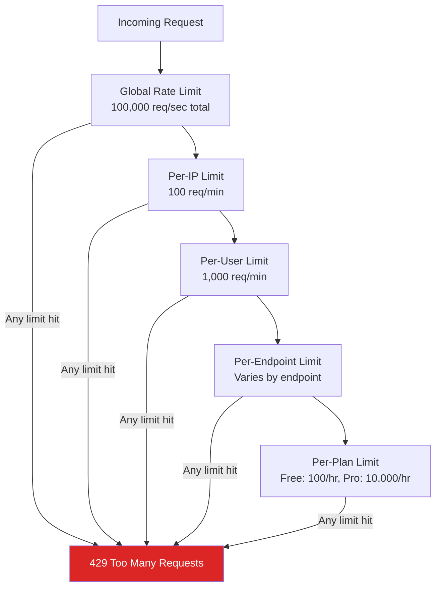
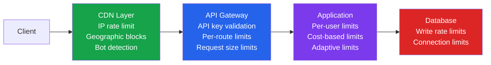

# Advanced Rate Limiting

Basic rate limiting protects against casual abuse. Advanced rate limiting protects against sophisticated attackers, handles distributed systems correctly, adapts to system health, and differentiates between legitimate traffic spikes and DDoS attacks. This page builds on the [API Rate Limiting](./rate-limiting.md) fundamentals with production-grade patterns for systems handling millions of requests per second.

## Algorithm Deep Comparison

### Token Bucket

Tokens accumulate at a fixed rate up to a maximum capacity. Each request consumes one token. When the bucket is empty, requests are rejected.

```
Configuration: rate=10/sec, burst=50
Bucket starts full: 50 tokens
10 requests arrive simultaneously: 40 tokens remain
No requests for 3 seconds: min(40 + 30, 50) = 50 tokens (refilled)
60 requests arrive: 50 succeed, 10 rejected
```

**Behavior:** Allows bursts up to bucket capacity, then enforces the steady-state rate. Naturally permits brief spikes while maintaining long-term averages.

### Leaky Bucket

Requests enter a queue (bucket) and are processed at a fixed rate. If the queue is full, new requests are dropped.

```
Configuration: rate=10/sec, queue_size=50
Request arrives: added to queue (if not full)
Queue drains at exactly 10/sec
If queue is full: request rejected
```

**Behavior:** Produces a perfectly smooth output rate. No bursts at all — every request waits in the queue. Better for APIs that need predictable throughput.

### Sliding Window Log

Store the timestamp of every request in the window. Count the number of timestamps within the window for each new request.

```
Window: 60 seconds, Limit: 100 requests

Request at t=1001: timestamps = [945, 950, 960, ..., 1001]
Count timestamps where t > (1001 - 60) = 941
If count < 100: allow. Else: reject.
```

**Behavior:** Most accurate — no boundary effects. But storing every timestamp is expensive at high volumes.

### Sliding Window Counter

Approximation of the sliding window log using two fixed windows and a weighted average.

```
Current window (last 30s): 40 requests
Previous window (30-60s ago): 80 requests
Current position in window: 70% through

Weighted count: 80 × (1 - 0.7) + 40 = 80 × 0.3 + 40 = 64
Limit: 100 → Allow
```

**Behavior:** Accurate to within ~1% of the sliding log, with O(1) memory per counter.

### Algorithm Comparison

| Algorithm | Accuracy | Memory | Burst Handling | Latency | Complexity |
|-----------|----------|--------|---------------|---------|------------|
| **Token Bucket** | Good | O(1) per key | Allows controlled bursts | O(1) | Low |
| **Leaky Bucket** | Exact (smooth) | O(queue_size) | No bursts (queued) | O(1) | Low |
| **Sliding Window Log** | Exact | O(n) per key | Accurate counting | O(n) | Medium |
| **Sliding Window Counter** | ~99% accurate | O(1) per key | Approximate | O(1) | Low |
| **Fixed Window** | Poor at boundaries | O(1) per key | 2x burst at boundary | O(1) | Lowest |

::: tip Production Recommendation
Use **sliding window counter** for most rate limiting. It provides near-exact accuracy with O(1) memory. Use **token bucket** when you explicitly want burst allowance (e.g., API tiers that advertise "100/min with burst to 20/sec"). Never use fixed windows in production — the boundary problem is not theoretical.
:::

### The Fixed Window Boundary Problem

```
Limit: 100 requests per minute

Minute 1 (00:00-00:59): 0 requests in first 30s, 100 requests in last 30s
Minute 2 (01:00-01:59): 100 requests in first 30s, 0 requests after

Result: 200 requests in a 60-second span (00:30-01:30) while the limit is 100.
This is a 2x overshoot at the boundary.
```

## Distributed Rate Limiting with Redis

In a horizontally scaled environment, rate limiting must be centralized. Each application instance must check and increment the same counters.

### Sliding Window Counter (Redis Lua)

```lua
-- sliding_window.lua
-- Atomic sliding window counter rate limiter
-- Keys: KEYS[1] = rate limit key
-- Args: ARGV[1] = window size (seconds)
--        ARGV[2] = max requests per window
--        ARGV[3] = current timestamp (seconds)

local key = KEYS[1]
local window = tonumber(ARGV[1])
local limit = tonumber(ARGV[2])
local now = tonumber(ARGV[3])

-- Calculate current and previous window keys
local current_window = math.floor(now / window)
local previous_window = current_window - 1
local current_key = key .. ":" .. current_window
local previous_key = key .. ":" .. previous_window

-- Get counts for both windows
local current_count = tonumber(redis.call("GET", current_key) or "0")
local previous_count = tonumber(redis.call("GET", previous_key) or "0")

-- Calculate position in current window (0.0 to 1.0)
local elapsed = now - (current_window * window)
local weight = 1.0 - (elapsed / window)

-- Weighted count
local weighted_count = math.floor(previous_count * weight) + current_count

if weighted_count >= limit then
    -- Rate limited
    local retry_after = window - elapsed
    return {0, limit - weighted_count, math.ceil(retry_after)}
end

-- Allow request — increment current window
redis.call("INCR", current_key)
redis.call("EXPIRE", current_key, window * 2) -- Keep for 2 windows

return {1, limit - weighted_count - 1, 0}
-- Returns: {allowed (0/1), remaining, retry_after}
```

### TypeScript Rate Limiter Service

```typescript
import Redis from 'ioredis';
import { readFileSync } from 'fs';

const redis = new Redis.Cluster([
  { host: 'redis-1.example.com', port: 6379 },
]);

const slidingWindowScript = readFileSync('./sliding_window.lua', 'utf8');

interface RateLimitResult {
  allowed: boolean;
  remaining: number;
  retryAfter: number; // seconds
  limit: number;
}

async function checkRateLimit(
  key: string,
  windowSeconds: number,
  maxRequests: number
): Promise<RateLimitResult> {
  const now = Math.floor(Date.now() / 1000);

  const result = (await redis.eval(
    slidingWindowScript,
    1,
    key,
    windowSeconds.toString(),
    maxRequests.toString(),
    now.toString()
  )) as [number, number, number];

  return {
    allowed: result[0] === 1,
    remaining: Math.max(0, result[1]),
    retryAfter: result[2],
    limit: maxRequests,
  };
}
```

### Token Bucket (Redis Lua)

```lua
-- token_bucket.lua
-- Atomic token bucket rate limiter
-- Keys: KEYS[1] = bucket key
-- Args: ARGV[1] = max tokens (bucket capacity)
--        ARGV[2] = refill rate (tokens per second)
--        ARGV[3] = current timestamp (microseconds)
--        ARGV[4] = tokens to consume (default 1)

local key = KEYS[1]
local capacity = tonumber(ARGV[1])
local refill_rate = tonumber(ARGV[2])
local now = tonumber(ARGV[3])
local requested = tonumber(ARGV[4] or "1")

-- Get current bucket state
local bucket = redis.call("HMGET", key, "tokens", "last_refill")
local tokens = tonumber(bucket[1])
local last_refill = tonumber(bucket[2])

if tokens == nil then
    -- Initialize bucket
    tokens = capacity
    last_refill = now
end

-- Calculate token refill
local elapsed = (now - last_refill) / 1000000.0 -- Convert microseconds to seconds
local new_tokens = math.min(capacity, tokens + (elapsed * refill_rate))

if new_tokens < requested then
    -- Not enough tokens
    local wait_time = (requested - new_tokens) / refill_rate
    return {0, math.floor(new_tokens), math.ceil(wait_time)}
end

-- Consume tokens
new_tokens = new_tokens - requested
redis.call("HMSET", key, "tokens", new_tokens, "last_refill", now)
redis.call("EXPIRE", key, math.ceil(capacity / refill_rate) * 2)

return {1, math.floor(new_tokens), 0}
```

## Multi-Dimensional Rate Limiting

Real-world systems need rate limits across multiple dimensions simultaneously.

### Dimension Hierarchy



### Implementation

```typescript
interface RateLimitRule {
  dimension: string;
  keyExtractor: (req: Request) => string;
  windowSeconds: number;
  maxRequests: number;
}

const rules: RateLimitRule[] = [
  {
    dimension: 'global',
    keyExtractor: () => 'global',
    windowSeconds: 1,
    maxRequests: 100000,
  },
  {
    dimension: 'ip',
    keyExtractor: (req) => `ip:${req.ip}`,
    windowSeconds: 60,
    maxRequests: 100,
  },
  {
    dimension: 'user',
    keyExtractor: (req) => `user:${req.user?.id || 'anonymous'}`,
    windowSeconds: 60,
    maxRequests: 1000,
  },
  {
    dimension: 'endpoint',
    keyExtractor: (req) => `ep:${req.user?.id}:${req.method}:${req.path}`,
    windowSeconds: 60,
    maxRequests: getEndpointLimit(req.method, req.path),
  },
  {
    dimension: 'plan',
    keyExtractor: (req) => `plan:${req.user?.id}`,
    windowSeconds: 3600,
    maxRequests: getPlanLimit(req.user?.plan),
  },
];

async function multiDimensionalRateLimit(
  req: Request,
  res: Response,
  next: NextFunction
): Promise<void> {
  // Check all dimensions in parallel
  const checks = await Promise.all(
    rules.map(async (rule) => {
      const key = `rl:${rule.dimension}:${rule.keyExtractor(req)}`;
      const result = await checkRateLimit(key, rule.windowSeconds, rule.maxRequests);
      return { rule, result };
    })
  );

  // Find the most restrictive limit that was hit
  const blocked = checks.find((c) => !c.result.allowed);

  if (blocked) {
    res.set({
      'RateLimit-Limit': blocked.result.limit.toString(),
      'RateLimit-Remaining': '0',
      'RateLimit-Reset': Math.ceil(Date.now() / 1000 + blocked.result.retryAfter).toString(),
      'Retry-After': blocked.result.retryAfter.toString(),
      'X-RateLimit-Dimension': blocked.rule.dimension,
    });

    res.status(429).json({
      error: 'rate_limit_exceeded',
      message: `Rate limit exceeded for ${blocked.rule.dimension}`,
      retryAfter: blocked.result.retryAfter,
    });
    return;
  }

  // Set headers for the most consumed dimension
  const mostConsumed = checks.reduce((min, c) =>
    c.result.remaining < min.result.remaining ? c : min
  );

  res.set({
    'RateLimit-Limit': mostConsumed.result.limit.toString(),
    'RateLimit-Remaining': mostConsumed.result.remaining.toString(),
    'RateLimit-Reset': Math.ceil(
      Date.now() / 1000 + mostConsumed.rule.windowSeconds
    ).toString(),
  });

  next();
}
```

## Rate Limiting at Different Layers

Each layer provides different trade-offs between precision and performance.

| Layer | Latency Cost | Precision | State | Best For |
|-------|-------------|-----------|-------|----------|
| **CDN (Cloudflare, AWS WAF)** | 0ms (edge) | Low (IP only) | Distributed | DDoS, IP-based blocks |
| **API Gateway (Kong, Envoy)** | <1ms | Medium | Shared (Redis) | Per-key, per-route limits |
| **Application middleware** | 1-5ms | High | Shared (Redis) | Per-user, per-plan, cost-based |
| **Database** | N/A | Exact | Database constraints | Write rate limits, transaction limits |



## Adaptive Rate Limiting

Static rate limits cannot handle variable system capacity. Adaptive rate limiting adjusts limits based on real-time system health.

### Dynamic Limits Based on System Health

```typescript
interface SystemHealth {
  cpuUsage: number;        // 0-100
  memoryUsage: number;     // 0-100
  p99LatencyMs: number;    // Current P99 latency
  errorRate: number;       // 0-1 (percentage of 5xx responses)
  queueDepth: number;      // Pending request queue size
}

function calculateDynamicLimit(
  baseLimit: number,
  health: SystemHealth
): number {
  let multiplier = 1.0;

  // Reduce limits when system is stressed
  if (health.cpuUsage > 80) {
    multiplier *= 0.5;
  } else if (health.cpuUsage > 60) {
    multiplier *= 0.8;
  }

  if (health.p99LatencyMs > 5000) {
    multiplier *= 0.3; // Aggressive reduction
  } else if (health.p99LatencyMs > 2000) {
    multiplier *= 0.6;
  } else if (health.p99LatencyMs > 1000) {
    multiplier *= 0.8;
  }

  if (health.errorRate > 0.05) { // >5% error rate
    multiplier *= 0.4;
  } else if (health.errorRate > 0.01) {
    multiplier *= 0.7;
  }

  // Never go below 10% of base limit
  const dynamicLimit = Math.max(
    Math.floor(baseLimit * multiplier),
    Math.floor(baseLimit * 0.1)
  );

  return dynamicLimit;
}
```

### AIMD (Additive Increase / Multiplicative Decrease)

Inspired by TCP congestion control. Gradually increase limits when healthy, rapidly decrease on errors.

```typescript
class AIMDRateLimiter {
  private currentLimit: number;
  private readonly minLimit: number;
  private readonly maxLimit: number;
  private readonly additiveIncrease: number;
  private readonly multiplicativeDecrease: number;

  constructor(config: {
    initialLimit: number;
    minLimit: number;
    maxLimit: number;
    additiveIncrease?: number;
    multiplicativeDecrease?: number;
  }) {
    this.currentLimit = config.initialLimit;
    this.minLimit = config.minLimit;
    this.maxLimit = config.maxLimit;
    this.additiveIncrease = config.additiveIncrease || 1;
    this.multiplicativeDecrease = config.multiplicativeDecrease || 0.5;
  }

  onSuccess(): void {
    // Slowly increase
    this.currentLimit = Math.min(
      this.currentLimit + this.additiveIncrease,
      this.maxLimit
    );
  }

  onError(): void {
    // Rapidly decrease
    this.currentLimit = Math.max(
      Math.floor(this.currentLimit * this.multiplicativeDecrease),
      this.minLimit
    );
  }

  getLimit(): number {
    return this.currentLimit;
  }
}
```

## Rate Limit Response Headers

Follow the IETF draft standard `RateLimit` header fields (draft-ietf-httpapi-ratelimit-headers).

```http
HTTP/1.1 429 Too Many Requests
Content-Type: application/json
RateLimit-Limit: 100
RateLimit-Remaining: 0
RateLimit-Reset: 1711000060
Retry-After: 30

{
  "error": "rate_limit_exceeded",
  "message": "You have exceeded the rate limit of 100 requests per minute",
  "limit": 100,
  "remaining": 0,
  "retryAfter": 30,
  "documentation": "https://docs.example.com/rate-limits"
}
```

| Header | Description | Format |
|--------|-------------|--------|
| `RateLimit-Limit` | Maximum requests allowed in window | Integer |
| `RateLimit-Remaining` | Requests remaining in current window | Integer |
| `RateLimit-Reset` | Unix timestamp when the window resets | Unix epoch (seconds) |
| `Retry-After` | Seconds to wait before retrying | Integer (seconds) |

::: tip Always Include Retry-After
`Retry-After` is critical for well-behaved clients. Without it, clients will retry immediately and hammering behavior occurs. SDKs should use exponential backoff with jitter based on `Retry-After`.
:::

## Graceful Degradation vs Hard Rejection

| Strategy | Behavior | Best For |
|----------|----------|----------|
| **Hard rejection (429)** | Request denied immediately | Most APIs, default behavior |
| **Queue and delay** | Request queued, processed at rate limit | Background jobs, webhooks |
| **Degraded response** | Return cached or partial data | Read-heavy APIs, search |
| **Priority queue** | Paid users get priority, free users queued | Freemium SaaS |
| **Shed load** | Drop lowest-priority requests first | Systems under extreme load |

## DDoS vs Legitimate Traffic Differentiation

### Signals That Differentiate

| Signal | Legitimate Traffic | DDoS / Abuse |
|--------|-------------------|-------------|
| **Request pattern** | Varied endpoints, natural navigation | Same endpoint, mechanical repetition |
| **User-Agent** | Real browsers, known SDKs | Missing, random, or spoofed |
| **TLS fingerprint** | Matches User-Agent (JA3/JA4) | Mismatched JA3/JA4 hash |
| **Request timing** | Human-like variance | Perfectly regular intervals |
| **Geographic distribution** | Matches user base | Unusual concentration |
| **Session behavior** | Reads cookies, follows redirects | Ignores cookies, no JavaScript |
| **Rate of new connections** | Low (connection reuse) | High (many new connections) |

### Implementation

```typescript
function classifyRequest(req: Request): 'legitimate' | 'suspicious' | 'malicious' {
  let suspicionScore = 0;

  // Check 1: Missing or suspicious User-Agent
  const ua = req.headers['user-agent'];
  if (!ua) suspicionScore += 30;
  if (ua && isFakeUserAgent(ua)) suspicionScore += 40;

  // Check 2: No cookies / no session
  if (!req.cookies || Object.keys(req.cookies).length === 0) {
    suspicionScore += 10;
  }

  // Check 3: Request timing regularity
  const timings = getRecentRequestTimings(req.ip);
  if (timings.length > 10 && calculateJitter(timings) < 50) {
    // Suspiciously regular timing (< 50ms jitter)
    suspicionScore += 30;
  }

  // Check 4: Known bad IP ranges
  if (isKnownBadIP(req.ip)) suspicionScore += 50;

  // Check 5: Challenge response (has client solved a JS challenge?)
  if (!req.headers['x-challenge-token']) suspicionScore += 15;

  if (suspicionScore >= 60) return 'malicious';
  if (suspicionScore >= 30) return 'suspicious';
  return 'legitimate';
}
```

## Cost-Based Rate Limiting

Not all requests are equal. A search query with complex aggregations costs 100x more than a simple key lookup. Cost-based rate limiting assigns weights to different endpoints.

```typescript
const endpointCosts: Record<string, number> = {
  'GET /api/users/:id': 1,            // Simple lookup
  'GET /api/users': 5,                 // List with pagination
  'GET /api/search': 20,               // Full-text search
  'POST /api/reports/generate': 100,   // Heavy computation
  'GET /api/export': 200,              // Large data export
  'POST /api/ai/completion': 50,       // AI inference
};

async function costBasedRateLimit(
  req: Request
): Promise<RateLimitResult> {
  const route = matchRoute(req.method, req.path);
  const cost = endpointCosts[route] || 1;
  const userId = req.user?.id || req.ip;

  // User has a budget of 1000 "cost units" per minute
  const budgetPerMinute = getPlanBudget(req.user?.plan); // e.g., 1000

  return checkRateLimit(
    `cost:${userId}`,
    60,            // 1 minute window
    budgetPerMinute, // total budget
    cost             // this request's cost (tokens to consume)
  );
}
```

| Plan | Budget/min | GET /users/:id (cost 1) | GET /search (cost 20) | POST /reports (cost 100) |
|------|-----------|------------------------|----------------------|-------------------------|
| **Free** | 100 | 100 calls | 5 calls | 1 call |
| **Pro** | 1,000 | 1,000 calls | 50 calls | 10 calls |
| **Enterprise** | 10,000 | 10,000 calls | 500 calls | 100 calls |

::: tip Communicate Costs Transparently
Document the cost of each endpoint in your API docs. Include the cost consumed and remaining budget in response headers. Developers need to understand why a heavy endpoint exhausts their rate limit faster than lightweight endpoints.
:::

## Further Reading

- [API Rate Limiting](./rate-limiting.md) — Foundational rate limiting concepts and algorithms
- [API Abuse Prevention](./api-abuse-prevention.md) — Bot detection and abuse prevention beyond rate limiting
- [Auth System Architecture](/security/authentication/auth-architecture.md) — Rate limiting in the auth pipeline
- [Redis Caching Patterns](/system-design/caching/redis-caching-patterns.md) — Redis patterns used for rate limiting
- [Load Balancing Algorithms](/system-design/load-balancing/algorithms.md) — Load distribution before rate limiting
- [Input Validation](./input-validation.md) — Request validation before rate limiting
